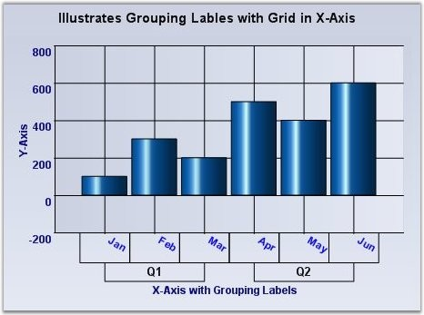

::: {style="DISPLAY: none"}
{#d2h_url_template}{#d2h_package_url style="WIDTH: 0px; DISPLAY: none; HEIGHT: 0px"}
:::

:::: {.d2h_secondary_topic style="PADDING-BOTTOM: 10pt; MARGIN: 0pt; PADDING-LEFT: 0pt; PADDING-RIGHT: 0pt; PADDING-TOP: 0pt"}
#### Grouping Labels {#grouping-labels style="tab-stops: 0pt"}

 

Another interesting feature that is available is to be able to group a set of adjoining labels and mark them with a new label. For example, grouping the first three months of the year and marking them as Q1 and so on. The following properties will let you do that.

 

::: {align="center"}
  ------------------------ ---------------------------------------------------------------------------------------------------------------------
  **ChartAxis Property**   **Description**
  GroupingLabels           Lets you group a range of default labels and provide them a custom name/label.
  DrawTickLabelGrid        Puts the labels within a grid. Though commonly used when in grouping mode, this feature can be used even otherwise.
  ------------------------ ---------------------------------------------------------------------------------------------------------------------
:::

 

+------------------------------------------------------------------------------------------------------------------------------------------------------------------------------------------------------------------------------------------------------------------------------------------------------+
| **[\[C#\]]{style="FONT-FAMILY: 'Courier New'; COLOR: black"}**                                                                                                                                                                                                                                       |
|                                                                                                                                                                                                                                                                                                      |
| []{style="FONT-FAMILY: 'Courier New'; COLOR: green"}                                                                                                                                                                                                                                                 |
|                                                                                                                                                                                                                                                                                                      |
| [ChartAxisGroupingLabel]{style="FONT-FAMILY: 'Courier New'; COLOR: teal"}[ Q1 = [new]{style="COLOR: blue"} [ChartAxisGroupingLabel]{style="COLOR: teal"}([new]{style="COLOR: blue"} [DoubleRange]{style="COLOR: teal"}(1, 3), [\"Q1\"]{style="COLOR: maroon"});]{style="FONT-FAMILY: 'Courier New'"} |
|                                                                                                                                                                                                                                                                                                      |
| [Q1.BorderStyle = [ChartAxisGroupingLabelBorderStyle]{style="COLOR: teal"}.Rectangle;]{style="FONT-FAMILY: 'Courier New'"}                                                                                                                                                                           |
|                                                                                                                                                                                                                                                                                                      |
| [Q1.Font = [new]{style="COLOR: blue"} [Font]{style="COLOR: teal"}([\"Arial\"]{style="COLOR: maroon"}, 10F, [FontStyle]{style="COLOR: teal"}.Bold);]{style="FONT-FAMILY: 'Courier New'"}                                                                                                              |
|                                                                                                                                                                                                                                                                                                      |
| [this]{style="FONT-FAMILY: 'Courier New'; COLOR: blue"}[.chartControl1.PrimaryXAxis.GroupingLabels.Add(Q1);]{style="FONT-FAMILY: 'Courier New'"}                                                                                                                                                     |
|                                                                                                                                                                                                                                                                                                      |
| []{style="FONT-FAMILY: 'Courier New'"}                                                                                                                                                                                                                                                               |
|                                                                                                                                                                                                                                                                                                      |
| [ChartAxisGroupingLabel]{style="FONT-FAMILY: 'Courier New'; COLOR: teal"}[ Q2 = [new]{style="COLOR: blue"} [ChartAxisGroupingLabel]{style="COLOR: teal"}([new]{style="COLOR: blue"} [DoubleRange]{style="COLOR: teal"}(4, 6), [\"Q2\"]{style="COLOR: maroon"});]{style="FONT-FAMILY: 'Courier New'"} |
|                                                                                                                                                                                                                                                                                                      |
| [Q2.BorderStyle = [ChartAxisGroupingLabelBorderStyle]{style="COLOR: teal"}.Rectangle;]{style="FONT-FAMILY: 'Courier New'"}                                                                                                                                                                           |
|                                                                                                                                                                                                                                                                                                      |
| [Q2.Font = [new]{style="COLOR: blue"} [Font]{style="COLOR: teal"}([\"Arial\"]{style="COLOR: maroon"}, 10F, [FontStyle]{style="COLOR: teal"}.Bold);]{style="FONT-FAMILY: 'Courier New'"}                                                                                                              |
|                                                                                                                                                                                                                                                                                                      |
| [this]{style="FONT-FAMILY: 'Courier New'; COLOR: blue"}[.chartControl1.PrimaryXAxis.GroupingLabels.Add(Q2);]{style="FONT-FAMILY: 'Courier New'"}                                                                                                                                                     |
|                                                                                                                                                                                                                                                                                                      |
| []{style="FONT-FAMILY: 'Courier New'"}                                                                                                                                                                                                                                                               |
|                                                                                                                                                                                                                                                                                                      |
| [this]{style="FONT-FAMILY: 'Courier New'; COLOR: blue"}[.chartControl1.PrimaryXAxis.DrawTickLabelGrid = [true]{style="COLOR: blue"};]{style="FONT-FAMILY: 'Courier New'"}                                                                                                                            |
+------------------------------------------------------------------------------------------------------------------------------------------------------------------------------------------------------------------------------------------------------------------------------------------------------+

 

+------------------------------------------------------------------------------------------------------------------------------------------------------------------------------------------------------------------------------------------------------------+
| **[\[VB\]]{style="FONT-FAMILY: 'Courier New'; COLOR: black"}**                                                                                                                                                                                             |
|                                                                                                                                                                                                                                                            |
| []{style="FONT-FAMILY: 'Courier New'; COLOR: green"}                                                                                                                                                                                                       |
|                                                                                                                                                                                                                                                            |
| [Dim]{style="FONT-FAMILY: 'Courier New'; COLOR: blue"}[ Q1 [As]{style="COLOR: blue"} [New]{style="COLOR: blue"} ChartAxisGroupingLabel([New]{style="COLOR: blue"} DoubleRange(1, 3), [\"Q1\"]{style="COLOR: maroon"})]{style="FONT-FAMILY: 'Courier New'"} |
|                                                                                                                                                                                                                                                            |
| [Q1.BorderStyle = ChartAxisGroupingLabelBorderStyle.Rectangle]{style="FONT-FAMILY: 'Courier New'"}                                                                                                                                                         |
|                                                                                                                                                                                                                                                            |
| [Q1.Font = [New]{style="COLOR: blue"} Font([\"Arial\"]{style="COLOR: maroon"}, 10.0F, FontStyle.Bold)]{style="FONT-FAMILY: 'Courier New'"}                                                                                                                 |
|                                                                                                                                                                                                                                                            |
| [Me]{style="FONT-FAMILY: 'Courier New'; COLOR: blue"}[.chartControl1.PrimaryXAxis.GroupingLabels.Add(Q1)]{style="FONT-FAMILY: 'Courier New'"}                                                                                                              |
|                                                                                                                                                                                                                                                            |
| []{style="FONT-FAMILY: 'Courier New'"}                                                                                                                                                                                                                     |
|                                                                                                                                                                                                                                                            |
| [Dim]{style="FONT-FAMILY: 'Courier New'; COLOR: blue"}[ Q2 [As]{style="COLOR: blue"} [New]{style="COLOR: blue"} ChartAxisGroupingLabel([New]{style="COLOR: blue"} DoubleRange(4, 6), [\"Q2\"]{style="COLOR: maroon"})]{style="FONT-FAMILY: 'Courier New'"} |
|                                                                                                                                                                                                                                                            |
| [Q2.BorderStyle = ChartAxisGroupingLabelBorderStyle.Rectangle]{style="FONT-FAMILY: 'Courier New'"}                                                                                                                                                         |
|                                                                                                                                                                                                                                                            |
| [Q2.Font = [New]{style="COLOR: blue"} Font([\"Arial\"]{style="COLOR: maroon"}, 10.0F, FontStyle.Bold)]{style="FONT-FAMILY: 'Courier New'"}                                                                                                                 |
|                                                                                                                                                                                                                                                            |
| [Me]{style="FONT-FAMILY: 'Courier New'; COLOR: blue"}[.chartControl1.PrimaryXAxis.GroupingLabels.Add(Q2)]{style="FONT-FAMILY: 'Courier New'"}                                                                                                              |
|                                                                                                                                                                                                                                                            |
| []{style="FONT-FAMILY: 'Courier New'; COLOR: blue"}                                                                                                                                                                                                        |
|                                                                                                                                                                                                                                                            |
| [Me]{style="FONT-FAMILY: 'Courier New'; COLOR: blue"}[.chartControl1.PrimaryXAxis.DrawTickLabelGrid = [True]{style="COLOR: blue"}]{style="FONT-FAMILY: 'Courier New'"}                                                                                     |
+------------------------------------------------------------------------------------------------------------------------------------------------------------------------------------------------------------------------------------------------------------+

[]{style="COLOR: red; FONT-SIZE: 8pt"} 

{border="0"}

[]{style="COLOR: red; FONT-SIZE: 8pt"} 

Figure 262: **[Q1 and Q2 Grouping Labels with Grids]{style="FONT-STYLE: normal"}**

[]{#related-topics}
::::
