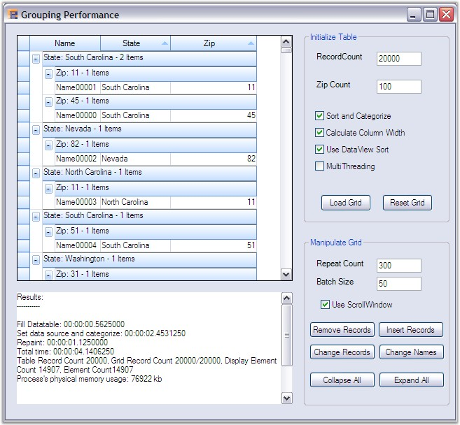

::: {style="DISPLAY: none"}
{#d2h_url_template}{#d2h_package_url style="WIDTH: 0px; DISPLAY: none; HEIGHT: 0px"}
:::

:::: {.d2h_secondary_topic style="PADDING-BOTTOM: 10pt; MARGIN: 0pt; PADDING-LEFT: 0pt; PADDING-RIGHT: 0pt; PADDING-TOP: 0pt"}
##### Grouping Performance {#grouping-performance style="tab-stops: 0pt"}

[]{style="FONT-FAMILY: 'Trebuchet MS','sans-serif'; COLOR: #15428b; FONT-SIZE: 9pt"} 

This section focuses a sample that lets you check the performance of the grid grouping control by toggling various options that can affect the speed of the grid. The different options include Sort and Categorize the records, Calculating MaximumColumnWidth, CustomSorting and MultiThreading (in case if a multiprocessor system is available).

[]{style="FONT-FAMILY: 'Trebuchet MS','sans-serif'; COLOR: #15428b; FONT-SIZE: 9pt"} 

::: {style="BORDER-BOTTOM: windowtext 1pt solid; BORDER-LEFT: medium none; PADDING-BOTTOM: 1pt; MARGIN-TOP: 9pt; PADDING-LEFT: 0pt; PADDING-RIGHT: 0pt; MARGIN-BOTTOM: 9pt; BORDER-TOP: windowtext 1pt solid; BORDER-RIGHT: medium none; PADDING-TOP: 1pt"}
{border="0"}Note: For Code, refer the following Browser sample:

\<Install Location\>\\Syncfusion\\EssentialStudio\\\[Version Number\]\\Windows\\Grid.Grouping.Windows\\Samples\\2.0\\Performance\\Grouping Performance Demo
:::

[]{style="FONT-FAMILY: 'Trebuchet MS','sans-serif'; COLOR: #15428b; FONT-SIZE: 9pt"} 

The following is the list of the options used.

**[]{style="FONT-FAMILY: 'Segoe UI','sans-serif'; COLOR: #15428b; FONT-SIZE: 9pt"}** 

Sort and Categorize

[]{style="FONT-FAMILY: 'Verdana','sans-serif'; COLOR: #4a5c8c; FONT-SIZE: 8pt"} 

[This option will enable grouping and sorting by assigning a group and sort order.]{style="FONT-SIZE: 9pt"}

[]{style="FONT-SIZE: 9pt"} 

UseDataViewSort

[]{style="FONT-FAMILY: 'Verdana','sans-serif'; COLOR: #4a5c8c; FONT-SIZE: 8pt"} 

[It uses the class GroupingSortList to wrap the DataView with IBindingList. It also implements IGroupingList interface. This allows performing the sort on the data view directly instead of relying on the grouping engine to perform sort.]{style="FONT-SIZE: 9pt"}

[]{style="FONT-SIZE: 9pt"} 

CalculateMaximumColumnWidth

[]{style="FONT-FAMILY: 'Verdana','sans-serif'; COLOR: #4a5c8c; FONT-SIZE: 8pt"} 

[When enabled, the maximum number of characters found in record field cells is calculated for columns. This will be used in re sizing the columns to optimal width. Affects TableDescriptor.AllowCalculateMaxColumnWidth property.]{style="FONT-SIZE: 9pt"}

[]{style="FONT-SIZE: 9pt"} 

MultiThreading

[]{style="COLOR: #4a5c8c; FONT-SIZE: 9pt"} 

[When set to true, this option will allow multithreading. It allows you to calculate the count in a separate thread when all records are categorized. Affects Table.AllowThreading property. Enable this only on true multiprocessor machines otherwise systems calculating counts in separate thread will slow categorization down.]{style="FONT-SIZE: 9pt"}

[]{style="FONT-SIZE: 9pt"} 

ListChanging Options

[]{style="FONT-FAMILY: 'Verdana','sans-serif'; COLOR: #4a5c8c; FONT-SIZE: 8pt"} 

[It also includes options to insert, remove and modify the records in the data source. All the changes will be immediately updated manually by making a call to grid.Update method.]{style="FONT-SIZE: 9pt"}

[]{style="FONT-SIZE: 9pt"} 

UseScrollWindow

[]{style="FONT-FAMILY: 'Verdana','sans-serif'; COLOR: #4a5c8c; FONT-SIZE: 8pt"} 

[When enabled, inserting and removing cells will be optimized by scrolling window contents and only invalidating new cells. If set to false, it results in repainting of the whole display. Affects TableControl.OptimizeInsertRemoveCells]{style="FONT-SIZE: 9pt"}[ ]{style="FONT-FAMILY: 'Verdana','sans-serif'; FONT-SIZE: 8pt"}[property.]{style="FONT-SIZE: 9pt"}

[]{style="FONT-SIZE: 9pt"} 

ExpandAll/CollapseAll

[]{style="FONT-FAMILY: 'Verdana','sans-serif'; COLOR: #4a5c8c; FONT-SIZE: 8pt"} 

[Using these options, you can track the time taken to expand / collapse all the groups and memory usage too.]{style="FONT-SIZE: 9pt"}

[]{style="FONT-SIZE: 9pt"} 

[After enabling the options required, click the LoadGrid button. This will then check for the options requested and apply those options before painting the grid. After loading, it also displays a log to print various performance measures like time taken to paint the grid, physical memory usage, etc.  The log will continue to display these performance measure at every instant the grid options are changed.]{style="FONT-SIZE: 9pt"}

[]{style="FONT-SIZE: 9pt"} 

[Given below is a sample screen shot.]{style="FONT-SIZE: 9pt"}

[]{style="FONT-FAMILY: 'Trebuchet MS','sans-serif'; COLOR: #15428b; FONT-SIZE: 9pt"} 

{border="0"}

[]{style="FONT-FAMILY: 'Trebuchet MS','sans-serif'; COLOR: #15428b; FONT-SIZE: 9pt"} 

*[Figure ]{style="FONT-SIZE: 9pt"}[260]{style="FONT-SIZE: 9pt"}[: Checking the Grouping Performance in the Grid Grouping Control]{style="FONT-SIZE: 9pt"}*

 

[]{#p402} 

 

[]{#related-topics}
::::
