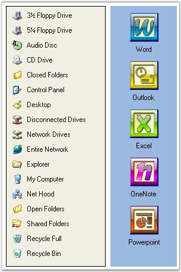

::: {style="DISPLAY: none"}
{#d2h_url_template}{#d2h_package_url style="WIDTH: 0px; DISPLAY: none; HEIGHT: 0px"}
:::

::::: {#nsbanner .d2h_main_nsbanner style="BORDER-BOTTOM: #999999 1px solid; POSITION: relative; PADDING-BOTTOM: 0px; BACKGROUND-COLOR: transparent; PADDING-LEFT: 0px; PADDING-RIGHT: 0px; DISPLAY: none; BORDER-TOP: #999999 1px solid; PADDING-TOP: 0px; LEFT: 0px"}
:::: {#TitleRow .d2h_main_titlerow style="PADDING-BOTTOM: 4px; BACKGROUND-COLOR: transparent; PADDING-LEFT: 22px; WIDTH: 100%; PADDING-RIGHT: 10px; DISPLAY: none; PADDING-TOP: 4px"}
::: {#ienav .d2h_main_ienav style="DISPLAY: none"}
{#D2HPrevious .D2HPreviousEnabled}  {#D2HNext .D2HNextEnabled}
:::
::::
:::::

:::: {#nstext .d2h_main_nstext style="PADDING-BOTTOM: 10px; BACKGROUND-COLOR: transparent; PADDING-LEFT: 22px; PADDING-RIGHT: 10px; HEIGHT: 100%; OVERFLOW: auto; PADDING-TOP: 5px" hasuserbackground="true" valign="bottom"}
::: {#d2h_breadcrumbs .d2h_breadcrumbs}
[Essential Studio User Guide Documentation](ms-xhelp:///?Id=12457748-09e3-4d74-a240-8e049cedf030){.d2h_breadcrumbsNormal}[ \> ]{.d2h_breadcrumbsLinkSeparator}[User Interface Edition](ms-xhelp:///?Id=c29296b7-531c-413b-a0ec-488ca1f7f669){.d2h_breadcrumbsNormal}[ \> ]{.d2h_breadcrumbsLinkSeparator}[Essential Windows](ms-xhelp:///?Id=e60759d8-47a4-4570-9d7a-16a68d63f2ea){.d2h_breadcrumbsNormal}[ \> ]{.d2h_breadcrumbsLinkSeparator}[Essential Tools]{.d2h_breadcrumbsContentsOnly}[ \> ]{.d2h_breadcrumbsLinkSeparator}[Tools Controls](ms-xhelp:///?Id=13c3c4f4-9d16-4b69-93f2-7e98eec67452){.d2h_breadcrumbsNormal}[ \> ]{.d2h_breadcrumbsLinkSeparator}[Navigation Package](ms-xhelp:///?Id=a57592e8-7db2-4cd9-ba89-c7ee92b60203){.d2h_breadcrumbsNormal}
:::

### GroupView {#groupview style="MARGIN-LEFT: 18pt; tab-stops: 18.0pt"}

[]{style="COLOR: #15428b"} 

The **GroupView** control implements a selectable list that can display a collection of items, where each item is represented by an image and a descriptor.

 

The GroupView control\'s appearance and behavior attributes are extensively customizable, making it possible to create a wide range of interfaces such as lists with large / small images, regular / flow view, button type selection, flat look and selective item highlighting / underlining.

[]{style="COLOR: #15428b"} 

{border="0"}

[]{style="COLOR: #15428b"} 

Figure 891: GroupView Styles

[]{style="COLOR: #15428b"} 

 

 

[]{#p633} 

 

More:

[ ]{#related-topics}

[{border="0" align="absMiddle"}Features Overview](ms-xhelp:///?Id=7767bd67-ebe5-451f-aa42-073dece02c4b){style="TEXT-DECORATION: none"}

[{border="0" align="absMiddle"}Control Overview](ms-xhelp:///?Id=c3eef4f0-25a4-499b-90a5-a6c723342496){style="TEXT-DECORATION: none"}

[{border="0" align="absMiddle"}Creating GroupView](ms-xhelp:///?Id=a48ab761-297d-4bd0-b1e6-570b7255b341){style="TEXT-DECORATION: none"}

[{border="0" align="absMiddle"}Concepts and Features](ms-xhelp:///?Id=f35549f1-4917-4ce4-b809-05c043c5d19b){style="TEXT-DECORATION: none"}

[{border="0" align="absMiddle"}Frequently Asked Questions](ms-xhelp:///?Id=ba39714e-10f7-4da8-b6a1-57ac0a8f2aa7){style="TEXT-DECORATION: none"}
::::
