::: {style="DISPLAY: none"}
{#d2h_url_template}{#d2h_package_url style="WIDTH: 0px; DISPLAY: none; HEIGHT: 0px"}
:::

::::::::::::::: {.d2h_secondary_topic style="PADDING-BOTTOM: 10pt; MARGIN: 0pt; PADDING-LEFT: 0pt; PADDING-RIGHT: 0pt; PADDING-TOP: 0pt"}
##### GroupView Items Settings {#groupview-items-settings style="MARGIN-LEFT: 18pt; tab-stops: 18.0pt"}

 

This section discusses the various settings that can be applied to the GroupView Items of the GroupView control.

 

It includes the below given topics.

[]{style="COLOR: #15428b"} 

[]{#p644} 

 

###### 3.6.2.4.2.1      Text Settings {#text-settings style="MARGIN-LEFT: 18pt; tab-stops: 18.0pt"}

[]{style="COLOR: #15428b"} 

This section describes the text alignment options available for GroupView.

[]{style="COLOR: #15428b"} 

Text Highlighting

[]{style="COLOR: #4a5c8c; FONT-SIZE: 8pt"} 

The GroupView control provides highlighting of text when the mouse is over the GroupView Item. This can be activated by setting the **HighlightText** property to \'True\'.

[]{style="COLOR: #15428b"} 

+-------------------------------------------------------------------------------------------------------------------------------------------------------+
| **[\[C#\]]{style="FONT-FAMILY: 'Courier New'; COLOR: black"}**                                                                                        |
|                                                                                                                                                       |
| []{style="FONT-FAMILY: 'Courier New'; COLOR: black"}                                                                                                  |
|                                                                                                                                                       |
| [this]{style="FONT-FAMILY: 'Courier New'; COLOR: blue"}[.groupView1.HighlightText = [true]{style="COLOR: blue"};]{style="FONT-FAMILY: 'Courier New'"} |
+-------------------------------------------------------------------------------------------------------------------------------------------------------+

[]{style="COLOR: #4a5c8c; FONT-SIZE: 8pt"} 

+----------------------------------------------------------------------------------------------------------------------------------------------------+
| **[\[VB.NET\]]{style="FONT-FAMILY: 'Courier New'; COLOR: black"}**                                                                                 |
|                                                                                                                                                    |
| []{style="FONT-FAMILY: 'Courier New'; COLOR: black"}                                                                                               |
|                                                                                                                                                    |
| [Me]{style="FONT-FAMILY: 'Courier New'; COLOR: blue"}[.groupView1.HighlightText = [True]{style="COLOR: blue"}]{style="FONT-FAMILY: 'Courier New'"} |
+----------------------------------------------------------------------------------------------------------------------------------------------------+

[]{style="COLOR: #15428b"} 

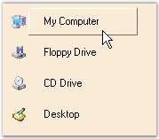{border="0"}

[]{style="COLOR: #15428b"} 

Figure 902: \"My Computer\" Item is Highlighted in the GroupView Control

[]{style="COLOR: #4a5c8c; FONT-SIZE: 8pt"} 

Text Offset

[]{style="COLOR: #4a5c8c; FONT-SIZE: 8pt"} 

The following properties are used to set the text offset for the GroupView Items.

[]{style="COLOR: #15428b"} 

::: {align="center"}
  ----------------------------- ---------------------------------------------------------------------------------------------------
  GroupView Property            Description
  HighlightTextOffset           Sets the text offset for the highlighted GroupView Item.
  SelectedHighlightTextOffset   Specifies the offset for the text of the selected GroupView Item when the mouse is moved over it.
  SelectingTextOffset           Sets the text offset for the GroupView Item being selected.
  SelectedTextOffset            Sets the text offset for the selected GroupView Item.
  ----------------------------- ---------------------------------------------------------------------------------------------------
:::

[]{style="COLOR: #15428b"} 

::: {style="BORDER-BOTTOM: windowtext 1pt solid; BORDER-LEFT: medium none; PADDING-BOTTOM: 1pt; MARGIN: 9pt 0pt 9pt 18pt; PADDING-LEFT: 0pt; PADDING-RIGHT: 0pt; BORDER-TOP: windowtext 1pt solid; BORDER-RIGHT: medium none; PADDING-TOP: 1pt"}
{border="0"} Note: HighlightText property must be set to \'True\' in all the cases.
:::

[]{style="COLOR: #15428b"} 

+------------------------------------------------------------------------------------------------------------------------------------------------------------------------------------------------+
| **[\[C#\]]{style="FONT-FAMILY: 'Courier New'; COLOR: black"}**                                                                                                                                 |
|                                                                                                                                                                                                |
| []{style="FONT-FAMILY: 'Courier New'; COLOR: black"}                                                                                                                                           |
|                                                                                                                                                                                                |
| [this]{style="FONT-FAMILY: 'Courier New'; COLOR: blue"}[.groupView1.HighlightTextOffset = [new]{style="COLOR: blue"} System.Drawing.Point(10, 5);]{style="FONT-FAMILY: 'Courier New'"}         |
|                                                                                                                                                                                                |
| [this]{style="FONT-FAMILY: 'Courier New'; COLOR: blue"}[.groupView1.SelectedHighlightTextOffset = [new]{style="COLOR: blue"} System.Drawing.Point(20, 6);]{style="FONT-FAMILY: 'Courier New'"} |
|                                                                                                                                                                                                |
| [this]{style="FONT-FAMILY: 'Courier New'; COLOR: blue"}[.groupView1.SelectedTextOffset = [new]{style="COLOR: blue"} System.Drawing.Point(30, 7);]{style="FONT-FAMILY: 'Courier New'"}          |
|                                                                                                                                                                                                |
| [this]{style="FONT-FAMILY: 'Courier New'; COLOR: blue"}[.groupView1.SelectingTextOffset = [new]{style="COLOR: blue"} System.Drawing.Point(40, 8);]{style="FONT-FAMILY: 'Courier New'"}         |
+------------------------------------------------------------------------------------------------------------------------------------------------------------------------------------------------+

[]{style="COLOR: #4a5c8c; FONT-SIZE: 8pt"} 

+---------------------------------------------------------------------------------------------------------------------------------------------------------------------------------------------+
| **[\[VB.NET\]]{style="FONT-FAMILY: 'Courier New'; COLOR: black"}**                                                                                                                          |
|                                                                                                                                                                                             |
| []{style="FONT-FAMILY: 'Courier New'; COLOR: black"}                                                                                                                                        |
|                                                                                                                                                                                             |
| [Me]{style="FONT-FAMILY: 'Courier New'; COLOR: blue"}[.groupView1.HighlightTextOffset = [New]{style="COLOR: blue"} System.Drawing.Point(10, 5)]{style="FONT-FAMILY: 'Courier New'"}         |
|                                                                                                                                                                                             |
| [Me]{style="FONT-FAMILY: 'Courier New'; COLOR: blue"}[.groupView1.SelectedHighlightTextOffset = [New]{style="COLOR: blue"} System.Drawing.Point(20, 6)]{style="FONT-FAMILY: 'Courier New'"} |
|                                                                                                                                                                                             |
| [Me]{style="FONT-FAMILY: 'Courier New'; COLOR: blue"}[.groupView1.SelectedTextOffset = [New]{style="COLOR: blue"} System.Drawing.Point(30, 7)]{style="FONT-FAMILY: 'Courier New'"}          |
|                                                                                                                                                                                             |
| [Me]{style="FONT-FAMILY: 'Courier New'; COLOR: blue"}[.groupView1.SelectingTextOffset = [New]{style="COLOR: blue"} System.Drawing.Point(40, 8)]{style="FONT-FAMILY: 'Courier New'"}         |
+---------------------------------------------------------------------------------------------------------------------------------------------------------------------------------------------+

[]{style="COLOR: #4a5c8c; FONT-SIZE: 8pt"} 

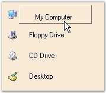{border="0"}

[]{style="COLOR: #15428b"} 

Figure 903: HighlightTextOffset = \"10, 5\"

[]{style="COLOR: #15428b"} 

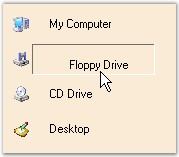{border="0"}

[]{style="COLOR: #15428b"} 

Figure 904: SelectedHighlightTextOffset = \"20, 6\"

[]{style="COLOR: #15428b"} 

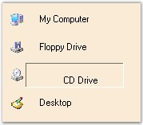{border="0"}

[]{style="COLOR: #15428b"} 

Figure 905: SelectedTextOffset = \"30, 7\"

[]{style="COLOR: #15428b"} 

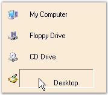{border="0"}

[]{style="COLOR: #15428b"} 

Figure 906: SelectingTextOffset = \"40, 8\"

[]{style="COLOR: #4a5c8c; FONT-SIZE: 8pt"} 

The methods associated with these properties are given below.

[]{style="COLOR: #15428b"} 

::: {align="center"}
  ---------------------------------- -------------------------------------------------------------------------
  Methods                            Description
  ResetHighlightTextOffset           Resets the HighlightTextOffset property to it\'s default value.
  ResetSelectedHighlightTextOffset   Resets the SelectedHighlightTextOffset property to it\'s default value.
  ResetSelectingTextOffset           Resets the SelectingTextOffset property to it\'s default value.
  ResetSelectedTextOffset            Resets the SelectedTextOffset property to it\'s default value.
  ---------------------------------- -------------------------------------------------------------------------
:::

[      ** **]{style="COLOR: #15428b"}

Text Formatting

[]{style="COLOR: #4a5c8c; FONT-SIZE: 8pt"} 

The following table lists the text formatting properties of GroupView Control.

[]{style="COLOR: #15428b"} 

::: {align="center"}
  -------------------- ---------------------------------------------------------------------------------------------------------------------------------------
  GroupView Property   Description
  TextSpacing          Specifies the distance between the GroupView Item\'s image and text. The default value is 8.
  TextUnderline        Specifies whether the control should underline the text when the mouse is moved over the GroupView Item.
  TextWrap             Specifies whether the GroupView Item\'s text should be wrapped when the control width is insufficient to accommodate the entire text.
  -------------------- ---------------------------------------------------------------------------------------------------------------------------------------
:::

[]{style="COLOR: #4a5c8c; FONT-SIZE: 8pt"} 

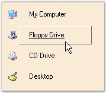{border="0"}

[]{style="COLOR: #4a5c8c; FONT-SIZE: 8pt"} 

Figure 907: Text Underline Illustrated

[]{style="COLOR: #15428b"} 

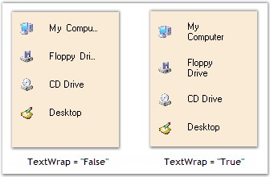{border="0"}

[]{style="COLOR: #15428b"} 

Figure 908: Text Wrap Illustrated

[]{style="COLOR: #15428b"} 

+-------------------------------------------------------------------------------------------------------------------------------------------------------+
| **[\[C#\]]{style="FONT-FAMILY: 'Courier New'; COLOR: black"}**                                                                                        |
|                                                                                                                                                       |
| []{style="FONT-FAMILY: 'Courier New'; COLOR: black"}                                                                                                  |
|                                                                                                                                                       |
| [this]{style="FONT-FAMILY: 'Courier New'; COLOR: blue"}[.groupView1.TextSpacing = 15;]{style="FONT-FAMILY: 'Courier New'"}                            |
|                                                                                                                                                       |
| [this]{style="FONT-FAMILY: 'Courier New'; COLOR: blue"}[.groupView1.TextUnderline = [true]{style="COLOR: blue"};]{style="FONT-FAMILY: 'Courier New'"} |
|                                                                                                                                                       |
| [this]{style="FONT-FAMILY: 'Courier New'; COLOR: blue"}[.groupView1.TextWrap = [true]{style="COLOR: blue"};]{style="FONT-FAMILY: 'Courier New'"}      |
+-------------------------------------------------------------------------------------------------------------------------------------------------------+

[]{style="COLOR: #4a5c8c; FONT-SIZE: 8pt"} 

+----------------------------------------------------------------------------------------------------------------------------------------------------+
| **[\[VB.NET\]]{style="FONT-FAMILY: 'Courier New'; COLOR: black"}**                                                                                 |
|                                                                                                                                                    |
| []{style="FONT-FAMILY: 'Courier New'; COLOR: black"}                                                                                               |
|                                                                                                                                                    |
| [Me]{style="FONT-FAMILY: 'Courier New'; COLOR: blue"}[.groupView1.TextSpacing = 15]{style="FONT-FAMILY: 'Courier New'"}                            |
|                                                                                                                                                    |
| [Me]{style="FONT-FAMILY: 'Courier New'; COLOR: blue"}[.groupView1.TextUnderline = [True]{style="COLOR: blue"}]{style="FONT-FAMILY: 'Courier New'"} |
|                                                                                                                                                    |
| [Me]{style="FONT-FAMILY: 'Courier New'; COLOR: blue"}[.groupView1.TextWrap = [True]{style="COLOR: blue"}]{style="FONT-FAMILY: 'Courier New'"}      |
+----------------------------------------------------------------------------------------------------------------------------------------------------+

[]{style="COLOR: #15428b"} 

In-Place Renaming

[]{style="COLOR: #4a5c8c; FONT-SIZE: 8pt"} 

It is possible to rename the specified GroupView Item at run-time using the **InplaceRenameItem()** method**.**

[]{style="COLOR: #15428b"} 

+------------------------------------------------------------------------------------------------------------------------------------+
| **[\[C#\]]{style="FONT-FAMILY: 'Courier New'; COLOR: black"}**                                                                     |
|                                                                                                                                    |
| []{style="FONT-FAMILY: 'Courier New'; COLOR: black"}                                                                               |
|                                                                                                                                    |
| [// index: index of the GroupView Item to be renamed.]{style="FONT-FAMILY: 'Courier New'; COLOR: green"}                           |
|                                                                                                                                    |
| [this]{style="FONT-FAMILY: 'Courier New'; COLOR: blue"}[.groupView1.InplaceRenameItem(index);]{style="FONT-FAMILY: 'Courier New'"} |
+------------------------------------------------------------------------------------------------------------------------------------+

[]{style="COLOR: #4a5c8c; FONT-SIZE: 8pt"} 

+---------------------------------------------------------------------------------------------------------------------------------+
| **[\[VB.NET\]]{style="FONT-FAMILY: 'Courier New'; COLOR: black"}**                                                              |
|                                                                                                                                 |
| []{style="FONT-FAMILY: 'Courier New'; COLOR: black"}                                                                            |
|                                                                                                                                 |
| [\' index: index of the GroupView Item to be renamed.]{style="FONT-FAMILY: 'Courier New'; COLOR: green"}                        |
|                                                                                                                                 |
| [Me]{style="FONT-FAMILY: 'Courier New'; COLOR: blue"}[.groupView1.InplaceRenameItem(index)]{style="FONT-FAMILY: 'Courier New'"} |
+---------------------------------------------------------------------------------------------------------------------------------+

[]{style="COLOR: #15428b"} 

::: {align="center"}
  --------------------------- -----------------------------------------------
  Method                      Description
  CancelInplaceRenameItemAt   Cancels an in-place edit that is in progress.
  --------------------------- -----------------------------------------------
:::

 

 

[]{#p645} 

 

###### []{#_Color_Settings}3.6.2.4.2.2      Color Settings {#color-settings style="MARGIN-LEFT: 18pt; tab-stops: 18.0pt"}

[]{style="COLOR: #15428b"} 

This section describes the color settings available for GroupView.

[]{style="COLOR: #15428b"} 

Highlighting Items and Text

[]{style="COLOR: #4a5c8c; FONT-SIZE: 8pt"} 

The color for highlighting Items and text during mouse hover can be specified using the properties given below.

[]{style="COLOR: #15428b"} 

::: {align="center"}
  -------------------- -------------------------------------------------------------------------------------------------------
  GroupView Property   Description
  HighlightItemColor   Specifies the color for highlighting the GroupView Items when the mouse is moved over it.
  HighlightTextColor   Specifies the color for highlighting the text of the GroupView Items when the mouse is moved over it.
  -------------------- -------------------------------------------------------------------------------------------------------
:::

[]{style="COLOR: #15428b"} 

::: {style="BORDER-BOTTOM: windowtext 1pt solid; BORDER-LEFT: medium none; PADDING-BOTTOM: 1pt; MARGIN: 9pt 0pt 9pt 18pt; PADDING-LEFT: 0pt; PADDING-RIGHT: 0pt; BORDER-TOP: windowtext 1pt solid; BORDER-RIGHT: medium none; PADDING-TOP: 1pt"}
{border="0"}Note: HighlightText property must be set to \'True\' in both the cases.
:::

[]{style="COLOR: #15428b"} 

+-------------------------------------------------------------------------------------------------------------------------------------------------------------------+
| **[\[C#\]]{style="FONT-FAMILY: 'Courier New'; COLOR: black"}**                                                                                                    |
|                                                                                                                                                                   |
| []{style="FONT-FAMILY: 'Courier New'; COLOR: black"}                                                                                                              |
|                                                                                                                                                                   |
| [this]{style="FONT-FAMILY: 'Courier New'; COLOR: blue"}[.groupView1.HighlightItemColor = System.Drawing.Color.LavendarBlush;]{style="FONT-FAMILY: 'Courier New'"} |
|                                                                                                                                                                   |
| [this]{style="FONT-FAMILY: 'Courier New'; COLOR: blue"}[.groupView1.HighlightTextColor = System.Drawing.Color.Purple;]{style="FONT-FAMILY: 'Courier New'"}        |
+-------------------------------------------------------------------------------------------------------------------------------------------------------------------+

[]{style="COLOR: #4a5c8c; FONT-SIZE: 8pt"} 

+----------------------------------------------------------------------------------------------------------------------------------------------------------------+
| **[\[VB.NET\]]{style="FONT-FAMILY: 'Courier New'; COLOR: black"}**                                                                                             |
|                                                                                                                                                                |
| []{style="FONT-FAMILY: 'Courier New'; COLOR: black"}                                                                                                           |
|                                                                                                                                                                |
| [Me]{style="FONT-FAMILY: 'Courier New'; COLOR: blue"}[.groupView1.HighlightItemColor = System.Drawing.Color.LavendarBlush]{style="FONT-FAMILY: 'Courier New'"} |
|                                                                                                                                                                |
| [Me]{style="FONT-FAMILY: 'Courier New'; COLOR: blue"}[.groupView1.HighlightTextColor = System.Drawing.Color.Purple]{style="FONT-FAMILY: 'Courier New'"}        |
+----------------------------------------------------------------------------------------------------------------------------------------------------------------+

[]{style="COLOR: #15428b"} 

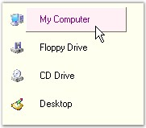{border="0"}

[]{style="COLOR: #15428b"} 

Figure 909: LavendarBlush and Purple Color applied for

Highlighting the Item and Text

[]{style="COLOR: #15428b"} 

The following table lists the methods related to the above properties.

[]{style="COLOR: #15428b"} 

::: {align="center"}
  ------------------------- ----------------------------------------------------------------
  Methods                   Description
  ResetHighlightItemColor   Resets the HighlightItemColor property to it\'s default value.
  ResetHighlightTextColor   Resets the HighlightTextColor property to it\'s default value.
  ------------------------- ----------------------------------------------------------------
:::

[]{style="COLOR: #4a5c8c; FONT-SIZE: 8pt"} 

Highlighting Selected Items and Text

[]{style="COLOR: #4a5c8c; FONT-SIZE: 8pt"} 

The color for highlighting selected Items and text can be specified using the properties given below.

[]{style="COLOR: #15428b"} 

::: {align="center"}
  ---------------------------- -------------------------------------------------------------------------------------------------------------------
  GroupView Property           Description
  SelectedHighlightItemColor   Sets the color used to draw the background of the selected GroupView Item when the mouse cursor is moved over it.
  SelectedHighlightTextColor   Sets the color used to draw the text of the selected GroupView Item when the mouse cursor is moved over it.
  SelectedItemColor            Sets the color used to draw the background of the selected GroupView Item.
  SelectedTextColor            Sets the color used to draw the text of the selected GroupView Item
  SelectingItemColor           Specifies the color used to draw the background of the GroupView Item being selected.
  SelectingTextColor           Specifies the color used to draw the text of the GroupView Item being selected.
  ---------------------------- -------------------------------------------------------------------------------------------------------------------
:::

[]{style="COLOR: #15428b"} 

::: {style="BORDER-BOTTOM: windowtext 1pt solid; BORDER-LEFT: medium none; PADDING-BOTTOM: 1pt; MARGIN: 9pt 0pt 9pt 18pt; PADDING-LEFT: 0pt; PADDING-RIGHT: 0pt; BORDER-TOP: windowtext 1pt solid; BORDER-RIGHT: medium none; PADDING-TOP: 1pt"}
{border="0"} Note: HighlightText property must be set to \'True\' in all the cases.
:::

[]{style="COLOR: #15428b"} 

+-----------------------------------------------------------------------------------------------------------------------------------------------------------------------+
| **[\[C#\]]{style="FONT-FAMILY: 'Courier New'; COLOR: black"}**                                                                                                        |
|                                                                                                                                                                       |
| []{style="FONT-FAMILY: 'Courier New'; COLOR: black"}                                                                                                                  |
|                                                                                                                                                                       |
| [this]{style="FONT-FAMILY: 'Courier New'; COLOR: blue"}[.groupView1.SelectedHighlightItemColor = System.Drawing.Color.LightBlue;]{style="FONT-FAMILY: 'Courier New'"} |
|                                                                                                                                                                       |
| [this]{style="FONT-FAMILY: 'Courier New'; COLOR: blue"}[.groupView1.SelectedHighlightTextColor = System.Drawing.Color.Crimson;]{style="FONT-FAMILY: 'Courier New'"}   |
|                                                                                                                                                                       |
| [this]{style="FONT-FAMILY: 'Courier New'; COLOR: blue"}[.groupView1.SelectedItemColor = System.Drawing.Color.LightGreen;]{style="FONT-FAMILY: 'Courier New'"}         |
|                                                                                                                                                                       |
| [this]{style="FONT-FAMILY: 'Courier New'; COLOR: blue"}[.groupView1.SelectedTextColor = System.Drawing.Color.Blue;]{style="FONT-FAMILY: 'Courier New'"}               |
|                                                                                                                                                                       |
| [this]{style="FONT-FAMILY: 'Courier New'; COLOR: blue"}[.groupView1.SelectingItemColor = System.Drawing.Color.PeachPuff;]{style="FONT-FAMILY: 'Courier New'"}         |
|                                                                                                                                                                       |
| [this]{style="FONT-FAMILY: 'Courier New'; COLOR: blue"}[.groupView1.SelectingTextColor = System.Drawing.Color.Red;]{style="FONT-FAMILY: 'Courier New'"}               |
+-----------------------------------------------------------------------------------------------------------------------------------------------------------------------+

[]{style="COLOR: #4a5c8c; FONT-SIZE: 8pt"} 

+--------------------------------------------------------------------------------------------------------------------------------------------------------------------+
| **[\[VB.NET\]]{style="FONT-FAMILY: 'Courier New'; COLOR: black"}**                                                                                                 |
|                                                                                                                                                                    |
| []{style="FONT-FAMILY: 'Courier New'; COLOR: black"}                                                                                                               |
|                                                                                                                                                                    |
| [Me]{style="FONT-FAMILY: 'Courier New'; COLOR: blue"}[.groupView1.SelectedHighlightItemColor = System.Drawing.Color.LightBlue]{style="FONT-FAMILY: 'Courier New'"} |
|                                                                                                                                                                    |
| [Me]{style="FONT-FAMILY: 'Courier New'; COLOR: blue"}[.groupView1.SelectedHighlightTextColor = System.Drawing.Color.Crimson]{style="FONT-FAMILY: 'Courier New'"}   |
|                                                                                                                                                                    |
| [Me]{style="FONT-FAMILY: 'Courier New'; COLOR: blue"}[.groupView1.SelectedItemColor = System.Drawing.Color.LightGreen]{style="FONT-FAMILY: 'Courier New'"}         |
|                                                                                                                                                                    |
| [Me]{style="FONT-FAMILY: 'Courier New'; COLOR: blue"}[.groupView1.SelectedTextColor = System.Drawing.Color.Blue]{style="FONT-FAMILY: 'Courier New'"}               |
|                                                                                                                                                                    |
| [Me]{style="FONT-FAMILY: 'Courier New'; COLOR: blue"}[.groupView1.SelectingItemColor = System.Drawing.Color.PeachPuff]{style="FONT-FAMILY: 'Courier New'"}         |
|                                                                                                                                                                    |
| [Me]{style="FONT-FAMILY: 'Courier New'; COLOR: blue"}[.groupView1.SelectingTextColor = System.Drawing.Color.Red]{style="FONT-FAMILY: 'Courier New'"}               |
+--------------------------------------------------------------------------------------------------------------------------------------------------------------------+

[]{style="COLOR: #4a5c8c; FONT-SIZE: 8pt"} 

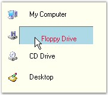{border="0"}

[]{style="COLOR: #4a5c8c; FONT-SIZE: 8pt"} 

Figure 910: LightBlue and Crimson Color applied for

Highlighting the Selected Item and Text during Mouse Hover

[]{style="COLOR: #4a5c8c; FONT-SIZE: 8pt"} 

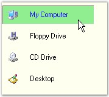{border="0"}

[]{style="COLOR: #15428b"} 

Figure 911: LightGreen and Blue Color applied for

Highlighting the Selected Item and Text

[]{style="COLOR: #15428b"} 

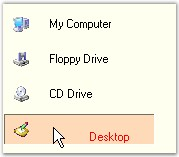{border="0"}

[]{style="COLOR: #15428b"} 

Figure 912: PeachPuff and Red Color applied for

Highlighting the Item and Text that is Being Selected

[]{style="COLOR: #15428b"} 

The following table lists the methods related to the above properties.

 

::: {align="center"}
  --------------------------------- ----------------------------------------------------------------------------
  Methods                           Description
  ResetSelectedHighlightItemColor   Resets the SelectedHighlightItemColor property value to the default value.
  ResetSelectedHighlightTextColor   Resets the SelectedHighlightTextColor property to the default value.
  ResetSelectedItemColor            Resets the SelectedItemColor property to the default value.
  ResetSelectedTextColor            Resets the SelectedTextColor property to the default value.
  ResetSelectingItemColor           Resets the SelectingItemColor property to the default value.
  ResetSelectingTextColor           Resets the SelectingTextColor property to the default value.
  --------------------------------- ----------------------------------------------------------------------------
:::

 

 

[]{#p646} 

 

###### 3.6.2.4.2.3      Orientation Settings for GroupView Item {#orientation-settings-for-groupview-item style="MARGIN-LEFT: 18pt; tab-stops: 18.0pt"}

[]{style="COLOR: #4a5c8c; FONT-SIZE: 8pt"} 

The following table lists the properties related to the orientation of GroupView Items.

[]{style="COLOR: #4a5c8c; FONT-SIZE: 8pt"} 

::: {align="center"}
+-----------------------------------+------------------------------------------------------------------------------------------------------------------------------------------------------------+
| GroupView Property                | Description                                                                                                                                                |
+-----------------------------------+------------------------------------------------------------------------------------------------------------------------------------------------------------+
| FlowView                          | This is a non-text, image-only display mode where items are arranged in a horizontal layout that increases or decreases with changes in the control width. |
+-----------------------------------+------------------------------------------------------------------------------------------------------------------------------------------------------------+
| FlowViewItemTextLength            | Gets / sets the GroupView Item\'s text length in FlowView mode.                                                                                            |
+-----------------------------------+------------------------------------------------------------------------------------------------------------------------------------------------------------+
| ShowFlowViewItemText              | Specifies whether the control should show GroupView Item\'s text in the FlowView mode.                                                                     |
+-----------------------------------+------------------------------------------------------------------------------------------------------------------------------------------------------------+
| Orientation                       | Specifies the orientation for the GroupView Items. The options included are as follows.                                                                    |
|                                   |                                                                                                                                                            |
|                                   |                                                                                                                                                            |
|                                   |                                                                                                                                                            |
|                                   | [·      ]{style="FONT-FAMILY: Symbol"}Horizontal and                                                                                                       |
|                                   |                                                                                                                                                            |
|                                   | [·      ]{style="FONT-FAMILY: Symbol"}Vertical.                                                                                                            |
|                                   |                                                                                                                                                            |
|                                   |                                                                                                                                                            |
|                                   |                                                                                                                                                            |
|                                   | The default value is \'Vertical\'.                                                                                                                         |
+-----------------------------------+------------------------------------------------------------------------------------------------------------------------------------------------------------+
:::

[]{style="COLOR: #15428b"} 

+----------------------------------------------------------------------------------------------------------------------------------------------------------------------------------------+
| **[\[C#\]]{style="FONT-FAMILY: 'Courier New'; COLOR: black"}**                                                                                                                         |
|                                                                                                                                                                                        |
| []{style="FONT-FAMILY: 'Courier New'; COLOR: black"}                                                                                                                                   |
|                                                                                                                                                                                        |
| [this]{style="FONT-FAMILY: 'Courier New'; COLOR: blue"}[.groupView1.FlowView = [true]{style="COLOR: blue"};]{style="FONT-FAMILY: 'Courier New'"}                                       |
|                                                                                                                                                                                        |
| [this]{style="FONT-FAMILY: 'Courier New'; COLOR: blue"}[.groupView1.FlowViewItemTextLength = 45;]{style="FONT-FAMILY: 'Courier New'"}                                                  |
|                                                                                                                                                                                        |
| [this]{style="FONT-FAMILY: 'Courier New'; COLOR: blue"}[.groupView1.ShowFlowViewItemText = [true]{style="COLOR: blue"};]{style="FONT-FAMILY: 'Courier New'"}                           |
|                                                                                                                                                                                        |
| [this]{style="FONT-FAMILY: 'Courier New'; COLOR: blue"}[.groupView1.Orientation = Syncfusion.Windows.Forms.Tools.GroupViewOrientation.Horizontal;]{style="FONT-FAMILY: 'Courier New'"} |
+----------------------------------------------------------------------------------------------------------------------------------------------------------------------------------------+

[]{style="COLOR: #4a5c8c; FONT-SIZE: 8pt"} 

+-------------------------------------------------------------------------------------------------------------------------------------------------------------------------------------+
| **[\[VB.NET\]]{style="FONT-FAMILY: 'Courier New'; COLOR: black"}**                                                                                                                  |
|                                                                                                                                                                                     |
| []{style="FONT-FAMILY: 'Courier New'; COLOR: black"}                                                                                                                                |
|                                                                                                                                                                                     |
| [Me]{style="FONT-FAMILY: 'Courier New'; COLOR: blue"}[.groupView1.FlowView = [True]{style="COLOR: blue"}]{style="FONT-FAMILY: 'Courier New'"}                                       |
|                                                                                                                                                                                     |
| [Me]{style="FONT-FAMILY: 'Courier New'; COLOR: blue"}[.groupView1.FlowViewItemTextLength = 45]{style="FONT-FAMILY: 'Courier New'"}                                                  |
|                                                                                                                                                                                     |
| [Me]{style="FONT-FAMILY: 'Courier New'; COLOR: blue"}[.groupView1.ShowFlowViewItemText = [True]{style="COLOR: blue"}]{style="FONT-FAMILY: 'Courier New'"}                           |
|                                                                                                                                                                                     |
| [Me]{style="FONT-FAMILY: 'Courier New'; COLOR: blue"}[.groupView1.Orientation = Syncfusion.Windows.Forms.Tools.GroupViewOrientation.Horizontal]{style="FONT-FAMILY: 'Courier New'"} |
+-------------------------------------------------------------------------------------------------------------------------------------------------------------------------------------+

[]{style="COLOR: #4a5c8c; FONT-SIZE: 8pt"} 

The GroupView Items in the GroupView control can be arranged in the horizontal and vertical direction, with or without displaying text. **FlowView** property displays the GroupView Items with images and without text.

 

If you want to show the GroupView Item\'s text in the FlowView mode then set the **ShowFlowViewItemText** property to \'True\'. You can also control the length of the GroupView Item\'s text in the FlowView mode using the **FlowViewItemTextLength** property.

[]{style="COLOR: #15428b"} 

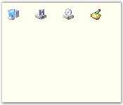{border="0"}

[]{style="COLOR: #15428b"} 

Figure 913: FlowView Illustrated

[]{style="COLOR: #15428b"} 

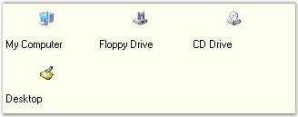{border="0"}

[]{style="COLOR: #15428b"} 

Figure 914: ShowFlowViewItemText property set to True

[]{style="COLOR: #15428b"} 

The **Orientation** property determines the direction of display for the GroupView Items.

[]{style="COLOR: #15428b"} 

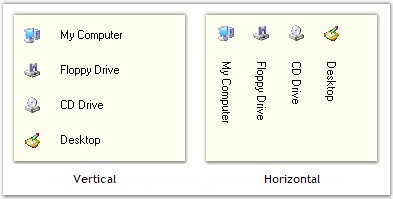{border="0"}

[]{style="COLOR: #15428b"} 

Figure 915: Orientation property Illustrated

 

 

[]{#p647} 

 

[]{#related-topics}
:::::::::::::::
