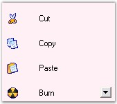

::: {style="DISPLAY: none"}
{#d2h_url_template}{#d2h_package_url style="WIDTH: 0px; DISPLAY: none; HEIGHT: 0px"}
:::

::::::: {.d2h_secondary_topic style="PADDING-BOTTOM: 10pt; MARGIN: 0pt; PADDING-LEFT: 0pt; PADDING-RIGHT: 0pt; PADDING-TOP: 0pt"}
##### GroupView Settings {#groupview-settings style="MARGIN-LEFT: 18pt; tab-stops: 18.0pt"}

[]{style="COLOR: #4a5c8c; FONT-SIZE: 8pt"} 

This section discusses the various settings that can be applied to define the look and behavior of the GroupView control.

 

It includes the below given topics.

[]{style="COLOR: #15428b"} 

[]{style="COLOR: black"} 

###### 3.6.2.4.1.1      Appearance Settings {#appearance-settings style="MARGIN-LEFT: 18pt; tab-stops: 18.0pt"}

[]{style="COLOR: #15428b"} 

The following table describes the properties that enhance the appearance of the GroupView control.

[]{style="COLOR: #4a5c8c; FONT-SIZE: 8pt"} 

::: {align="center"}
+-----------------------------------+--------------------------------------------------------------------------------------------+
| GroupView Property                | Description                                                                                |
+-----------------------------------+--------------------------------------------------------------------------------------------+
| FlatLook                          | Specifies whether the control is displayed with a flat look.                               |
+-----------------------------------+--------------------------------------------------------------------------------------------+
| BorderStyle                       | Gets / sets the border style for the GroupView control. It includes the following options: |
|                                   |                                                                                            |
|                                   |                                                                                            |
|                                   |                                                                                            |
|                                   | [·      ]{style="FONT-FAMILY: Symbol"}None,                                                |
|                                   |                                                                                            |
|                                   | [·      ]{style="FONT-FAMILY: Symbol"}FixedSingle and                                      |
|                                   |                                                                                            |
|                                   | [·      ]{style="FONT-FAMILY: Symbol"}Fixed3D.                                             |
+-----------------------------------+--------------------------------------------------------------------------------------------+
:::

[]{style="COLOR: #4a5c8c; FONT-SIZE: 8pt"} 

+---------------------------------------------------------------------------------------------------------------------------------------------------------------------------------------------+
| **[\[C#\]]{style="FONT-FAMILY: 'Courier New'; COLOR: black"}**                                                                                                                              |
|                                                                                                                                                                                             |
| []{style="FONT-FAMILY: 'Courier New'; COLOR: black"}                                                                                                                                        |
|                                                                                                                                                                                             |
| [this]{style="FONT-FAMILY: 'Courier New'; COLOR: blue"}[.groupView1.FlatLook = [true]{style="COLOR: blue"};]{style="FONT-FAMILY: 'Courier New'"}                                            |
|                                                                                                                                                                                             |
| [this]{style="FONT-FAMILY: 'Courier New'; COLOR: blue"}[.groupView1.BorderStyle = System.Windows.Forms.[BorderStyle]{style="COLOR: teal"}.FixedSingle;]{style="FONT-FAMILY: 'Courier New'"} |
+---------------------------------------------------------------------------------------------------------------------------------------------------------------------------------------------+

[]{style="COLOR: #4a5c8c; FONT-SIZE: 8pt"} 

+----------------------------------------------------------------------------------------------------------------------------------------------------------------------------------+
| **[\[VB.NET\]]{style="FONT-FAMILY: 'Courier New'; COLOR: black"}**                                                                                                               |
|                                                                                                                                                                                  |
| []{style="FONT-FAMILY: 'Courier New'; COLOR: black"}                                                                                                                             |
|                                                                                                                                                                                  |
| [Me]{style="FONT-FAMILY: 'Courier New'; COLOR: blue"}[.groupView1.FlatLook = [True]{style="COLOR: blue"}]{style="FONT-FAMILY: 'Courier New'"}                                    |
|                                                                                                                                                                                  |
| [Me.]{style="FONT-FAMILY: 'Courier New'; COLOR: blue"}[groupView1.BorderStyle = System.Windows.Forms.BorderStyle.FixedSingle ]{style="FONT-FAMILY: 'Courier New'; COLOR: black"} |
+----------------------------------------------------------------------------------------------------------------------------------------------------------------------------------+

[]{style="COLOR: #15428b"} 

The border of the GroupView Items can be changed by drawing the border without the 3-dimensional edge which can be attained by setting the **FlatLook** property to \'True\'.

[]{style="COLOR: #4a5c8c; FONT-SIZE: 8pt"} 

{border="0"}

[]{style="COLOR: #15428b"} 

Figure 898: Flat Look of GroupView Control Illustrated

[]{style="COLOR: #15428b"} 

We can specify the border style for the GroupView control using the **BorderStyle** property.

[]{style="COLOR: #15428b"} 

{border="0"}

[]{style="COLOR: #15428b"} 

Figure 899: GroupView with BorderStyle set to \"FixedSingle\"

 

[]{#p641} 

 

###### 3.6.2.4.1.2      Behavior Settings {#behavior-settings style="MARGIN-LEFT: 18pt; tab-stops: 18.0pt"}

[]{style="COLOR: #15428b"} 

This section discusses the properties that determine the behavior of the GroupView control.

[]{style="COLOR: #15428b"} 

Drag-and-Drop Effect

[]{style="COLOR: #4a5c8c; FONT-SIZE: 8pt"} 

This explains the drag-and-drop settings supported by the GroupView control.

[]{style="COLOR: #15428b"} 

::: {align="center"}
+-----------------------------------+---------------------------------------------------------------------------------------------------------------------------------------------+
| GroupView Property                | Description                                                                                                                                 |
+-----------------------------------+---------------------------------------------------------------------------------------------------------------------------------------------+
| AllowDragDrop                     | The property determines whether the control will permit user-interactive drag-and-drop of GroupView Items.                                  |
|                                   |                                                                                                                                             |
|                                   |                                                                                                                                             |
+-----------------------------------+---------------------------------------------------------------------------------------------------------------------------------------------+
| AllowDragAnyObject                | Setting this property permits the user to drag any object inside the GroupView control, provided AllowDragDrop property is set to \'True\'. |
+-----------------------------------+---------------------------------------------------------------------------------------------------------------------------------------------+
:::

[]{style="COLOR: #15428b"} 

+------------------------------------------------------------------------------------------------------------------------------------------------------------+
| **[\[C#\]]{style="FONT-FAMILY: 'Courier New'; COLOR: black"}**                                                                                             |
|                                                                                                                                                            |
| []{style="FONT-FAMILY: 'Courier New'; COLOR: black"}                                                                                                       |
|                                                                                                                                                            |
| [this]{style="FONT-FAMILY: 'Courier New'; COLOR: blue"}[.groupView1.AllowDragDrop = [true]{style="COLOR: blue"};]{style="FONT-FAMILY: 'Courier New'"}      |
|                                                                                                                                                            |
| [this]{style="FONT-FAMILY: 'Courier New'; COLOR: blue"}[.groupView1.AllowDragAnyObject = [true]{style="COLOR: blue"};]{style="FONT-FAMILY: 'Courier New'"} |
+------------------------------------------------------------------------------------------------------------------------------------------------------------+

[]{style="COLOR: #15428b"} 

+---------------------------------------------------------------------------------------------------------------------------------------------------------+
| **[\[VB.NET\]]{style="FONT-FAMILY: 'Courier New'; COLOR: black"}**                                                                                      |
|                                                                                                                                                         |
| []{style="FONT-FAMILY: 'Courier New'; COLOR: black"}                                                                                                    |
|                                                                                                                                                         |
| [Me]{style="FONT-FAMILY: 'Courier New'; COLOR: blue"}[.groupView1.AllowDragDrop = [True]{style="COLOR: blue"}]{style="FONT-FAMILY: 'Courier New'"}      |
|                                                                                                                                                         |
| [Me]{style="FONT-FAMILY: 'Courier New'; COLOR: blue"}[.groupView1.AllowDragAnyObject = [True]{style="COLOR: blue"}]{style="FONT-FAMILY: 'Courier New'"} |
+---------------------------------------------------------------------------------------------------------------------------------------------------------+

[]{style="COLOR: #4a5c8c; FONT-SIZE: 8pt"} 

Spacing

[]{style="COLOR: #4a5c8c; FONT-SIZE: 8pt"} 

Spacing can be provided between the GroupView Items, and between the GroupView control\'s left border and the GroupView Items using the properties given below.

[]{style="COLOR: #15428b"} 

::: {align="center"}
  -------------------- ----------------------------------------------------------------------------------------------------
  GroupView Property   Description
  ItemXSpacing         It sets the horizontal distance between a GroupView Item and the GroupView control\'s left border.
  ItemYSpacing         It sets the height between adjacent GroupView Items.
  -------------------- ----------------------------------------------------------------------------------------------------
:::

[]{style="COLOR: #15428b"} 

+-----------------------------------------------------------------------------------------------------------------------------+
| **[\[C#\]]{style="FONT-FAMILY: 'Courier New'; COLOR: black"}**                                                              |
|                                                                                                                             |
| []{style="FONT-FAMILY: 'Courier New'; COLOR: black"}                                                                        |
|                                                                                                                             |
| [this]{style="FONT-FAMILY: 'Courier New'; COLOR: blue"}[.groupView1.ItemXSpacing = 5;]{style="FONT-FAMILY: 'Courier New'"}  |
|                                                                                                                             |
| [this]{style="FONT-FAMILY: 'Courier New'; COLOR: blue"}[.groupView1.ItemYSpacing = 10;]{style="FONT-FAMILY: 'Courier New'"} |
+-----------------------------------------------------------------------------------------------------------------------------+

[]{style="COLOR: #15428b"} 

+--------------------------------------------------------------------------------------------------------------------------+
| **[\[VB.NET\]]{style="FONT-FAMILY: 'Courier New'; COLOR: black"}**                                                       |
|                                                                                                                          |
| []{style="FONT-FAMILY: 'Courier New'; COLOR: blue"}                                                                      |
|                                                                                                                          |
| [Me]{style="FONT-FAMILY: 'Courier New'; COLOR: blue"}[.groupView1.ItemXSpacing = 5]{style="FONT-FAMILY: 'Courier New'"}  |
|                                                                                                                          |
| [Me]{style="FONT-FAMILY: 'Courier New'; COLOR: blue"}[.groupView1.ItemYSpacing = 10]{style="FONT-FAMILY: 'Courier New'"} |
+--------------------------------------------------------------------------------------------------------------------------+

[]{style="COLOR: #15428b"} 

{border="0"}

*[]{style="COLOR: #4a5c8c; FONT-SIZE: 8pt"}* 

Figure 900: GroupBar with ItemXSpacing = \"5\" and

ItemYSpacing = \'\"10\"**[]{style="FONT-FAMILY: 'Trebuchet MS','sans-serif'; COLOR: #15428b"}**

 

 

[]{#p642} 

 

###### 3.6.2.4.1.3 Scroll Settings {#scroll-settings style="tab-stops: 0pt"}

[]{style="COLOR: #15428b"} 

We can specify scrolling for the GroupBar control to view the set of GroupView Items back and forth. This can be achieved by setting the **IntegratedScrolling** property to \'True\'**.**

[]{style="COLOR: #15428b"} 

::: {align="center"}
+-----------------------------------+---------------------------------------------------------------------------------------------------------------------------------------------------------------------------------------------------------------------------------------------------+
| GroupView Property                | Description                                                                                                                                                                                                                                       |
+-----------------------------------+---------------------------------------------------------------------------------------------------------------------------------------------------------------------------------------------------------------------------------------------------+
| Integrated Scrolling              | Setting this property will delegate the GroupView\'s scrolling to the Parent GroupBar control. This mode is exclusive to the VS .NET toolbox type interface where the GroupBar provides the scrolling support for it\'s GroupView Child controls. |
|                                   |                                                                                                                                                                                                                                                   |
|                                   | On disabling this property, scrollbars are set inside the GroupView control to scroll through the GroupView Items.                                                                                                                                |
+-----------------------------------+---------------------------------------------------------------------------------------------------------------------------------------------------------------------------------------------------------------------------------------------------+
:::

[]{style="COLOR: #15428b"} 

+--------------------------------------------------------------------------------------------------------------------------------------------------------------+
| **[\[C#\]]{style="FONT-FAMILY: 'Courier New'; COLOR: black"}**                                                                                               |
|                                                                                                                                                              |
| []{style="FONT-FAMILY: 'Courier New'; COLOR: black"}                                                                                                         |
|                                                                                                                                                              |
| [this]{style="FONT-FAMILY: 'Courier New'; COLOR: blue"}[.groupView2.IntegratedScrolling = [False]{style="COLOR: blue"};]{style="FONT-FAMILY: 'Courier New'"} |
+--------------------------------------------------------------------------------------------------------------------------------------------------------------+

[]{style="COLOR: #15428b"} 

+-----------------------------------------------------------------------------------------------------------------------------------------------------------+
| **[\[VB.NET\]]{style="FONT-FAMILY: 'Courier New'; COLOR: black"}**                                                                                        |
|                                                                                                                                                           |
| []{style="FONT-FAMILY: 'Courier New'; COLOR: black"}                                                                                                      |
|                                                                                                                                                           |
| [Me]{style="FONT-FAMILY: 'Courier New'; COLOR: blue"}[.groupView1.IntegratedScrolling = [False]{style="COLOR: blue"}]{style="FONT-FAMILY: 'Courier New'"} |
+-----------------------------------------------------------------------------------------------------------------------------------------------------------+

[]{style="COLOR: #15428b"} 

{border="0"}

[]{style="COLOR: #15428b"} 

Figure 901: Integrated Scrolling set to \"False\" in the Parent Control

 

 

[]{#p643} 

 

[]{#related-topics}
:::::::
