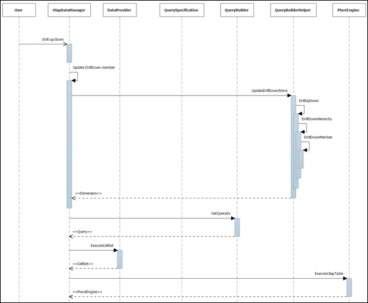

::: {style="DISPLAY: none"}
{#d2h_url_template}{#d2h_package_url style="WIDTH: 0px; DISPLAY: none; HEIGHT: 0px"}
:::

::::: {#nsbanner .d2h_main_nsbanner style="BORDER-BOTTOM: #999999 1px solid; POSITION: relative; PADDING-BOTTOM: 0px; BACKGROUND-COLOR: transparent; PADDING-LEFT: 0px; PADDING-RIGHT: 0px; DISPLAY: none; BORDER-TOP: #999999 1px solid; PADDING-TOP: 0px; LEFT: 0px"}
:::: {#TitleRow .d2h_main_titlerow style="PADDING-BOTTOM: 4px; BACKGROUND-COLOR: transparent; PADDING-LEFT: 22px; WIDTH: 100%; PADDING-RIGHT: 10px; DISPLAY: none; PADDING-TOP: 4px"}
::: {#ienav .d2h_main_ienav style="DISPLAY: none"}
{#D2HPrevious .D2HPreviousEnabled}  {#D2HNext .D2HNextEnabled}
:::
::::
:::::

:::: {#nstext .d2h_main_nstext style="PADDING-BOTTOM: 10px; BACKGROUND-COLOR: transparent; PADDING-LEFT: 22px; PADDING-RIGHT: 10px; HEIGHT: 100%; OVERFLOW: auto; PADDING-TOP: 5px" hasuserbackground="true" valign="bottom"}
::: {#d2h_breadcrumbs .d2h_breadcrumbs}
[Essential Studio User Guide Documentation](ms-xhelp:///?Id=12457748-09e3-4d74-a240-8e049cedf030){.d2h_breadcrumbsNormal}[ \> ]{.d2h_breadcrumbsLinkSeparator}[Business Intelligence Edition](ms-xhelp:///?Id=fdf33dd8-62b2-47b9-ad7b-fc50e590bca5){.d2h_breadcrumbsNormal}[ \> ]{.d2h_breadcrumbsLinkSeparator}[Essential BI Common](ms-xhelp:///?Id=51cb28d1-f201-4ea8-9963-a8afa451f64c){.d2h_breadcrumbsNormal}[ \> ]{.d2h_breadcrumbsLinkSeparator}[How-To](ms-xhelp:///?Id=f56652ff-a795-456f-ba4a-e1b615c58fdd){.d2h_breadcrumbsNormal}
:::

## Handle Drill Down/Up Process {#handle-drill-downup-process style="tab-stops: 0pt"}

Whenever we collapse or expand the controls like a grid or chart, the level member items will change and the query will be regenerated to create the new **CellSet**.

The important methods that identify the drill-down members are:

[·      ]{style="FONT-FAMILY: Symbol"}ToggleExpandableState()

[·      ]{style="FONT-FAMILY: Symbol"}UpdateDrillDowItems()

[·      ]{style="FONT-FAMILY: Symbol"}DrillUpDown()

 

Whenever the drill-down button is clicked, the **ToggleExpandableState()** method in the **OlapDataManager** will be invoked by the control. From there, the **UpdateDrillDowItems** will be called by passing the arguments and there it checks the unique name and call the **DrillUpDown()** method, which accepts the hierarchy element as argument. This method is a recursive method and has an overload method that accepts the member element as an argument. By recursively iterating the drill-down level, all the members in that level will be created and added with its parent for the query creation.

Once the drill-down member is updated, the **NotifyElementModified()** will be invoked to generate the new query.

 

Sequential Diagrams

The following screen shot explains sequential diagram for drill/down process:

         

{border="0"}

 

Figure 12: OLAP base sequential diagram

 

[]{#related-topics}
::::
