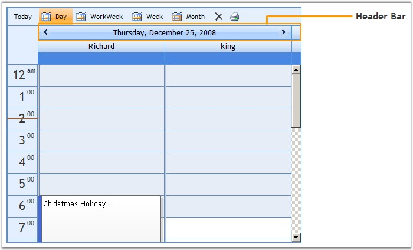
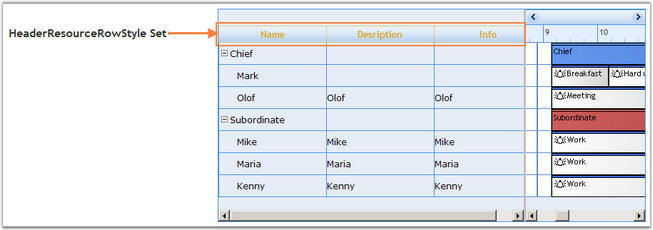
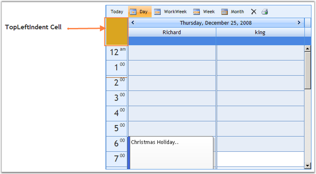
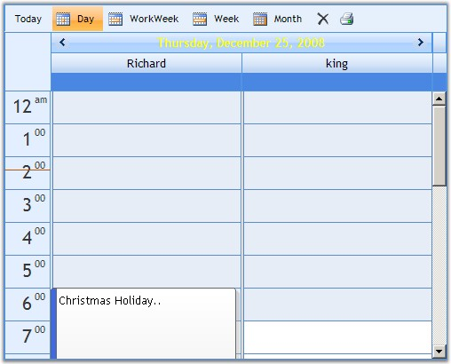
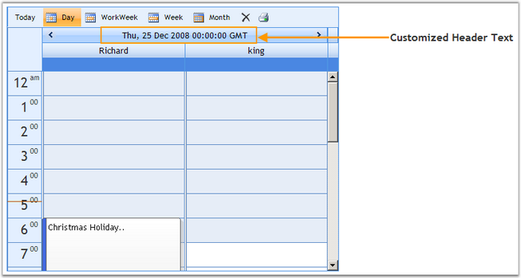
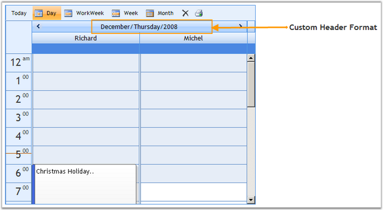
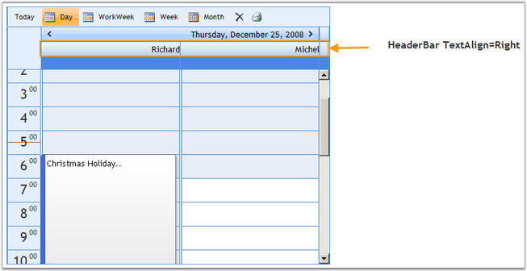
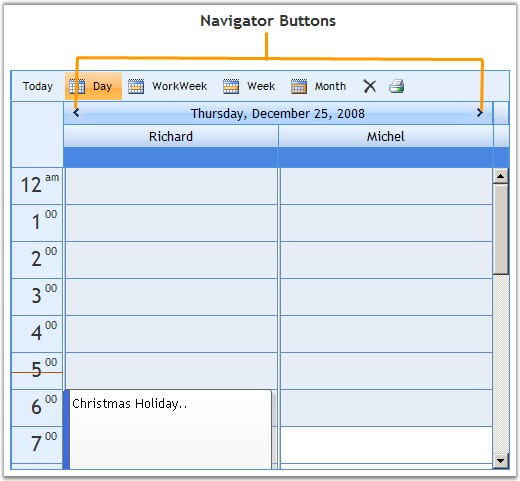

::: {style="DISPLAY: none"}
{#d2h_url_template}{#d2h_package_url style="WIDTH: 0px; DISPLAY: none; HEIGHT: 0px"}
:::

::::: {#nsbanner .d2h_main_nsbanner style="BORDER-BOTTOM: #999999 1px solid; POSITION: relative; PADDING-BOTTOM: 0px; BACKGROUND-COLOR: transparent; PADDING-LEFT: 0px; PADDING-RIGHT: 0px; DISPLAY: none; BORDER-TOP: #999999 1px solid; PADDING-TOP: 0px; LEFT: 0px"}
:::: {#TitleRow .d2h_main_titlerow style="PADDING-BOTTOM: 4px; BACKGROUND-COLOR: transparent; PADDING-LEFT: 22px; WIDTH: 100%; PADDING-RIGHT: 10px; DISPLAY: none; PADDING-TOP: 4px"}
::: {#ienav .d2h_main_ienav style="DISPLAY: none"}
{#D2HPrevious .D2HPreviousEnabled}  {#D2HNext .D2HNextEnabled}
:::
::::
:::::

:::::::::::: {#nstext .d2h_main_nstext style="PADDING-BOTTOM: 10px; BACKGROUND-COLOR: transparent; PADDING-LEFT: 22px; PADDING-RIGHT: 10px; HEIGHT: 100%; OVERFLOW: auto; PADDING-TOP: 5px" hasuserbackground="true" valign="bottom"}
::: {#d2h_breadcrumbs .d2h_breadcrumbs}
[Essential Studio User Guide Documentation](ms-xhelp:///?Id=12457748-09e3-4d74-a240-8e049cedf030){.d2h_breadcrumbsNormal}[ \> ]{.d2h_breadcrumbsLinkSeparator}[User Interface Edition](ms-xhelp:///?Id=c29296b7-531c-413b-a0ec-488ca1f7f669){.d2h_breadcrumbsNormal}[ \> ]{.d2h_breadcrumbsLinkSeparator}[Essential ASP.NET](ms-xhelp:///?Id=25c35330-c127-4dad-9a92-ed79dc7261a6){.d2h_breadcrumbsNormal}[ \> ]{.d2h_breadcrumbsLinkSeparator}[Essential Schedule]{.d2h_breadcrumbsContentsOnly}[ \> ]{.d2h_breadcrumbsLinkSeparator}[Concepts and Features](ms-xhelp:///?Id=64869483-f57f-4838-b322-b1a3d1ce8e40){.d2h_breadcrumbsNormal}[ \> ]{.d2h_breadcrumbsLinkSeparator}[Appearance](ms-xhelp:///?Id=b74f4808-9372-4450-906a-7d594040dbb4){.d2h_breadcrumbsNormal}
:::

### Header Bar Customization {#header-bar-customization style="tab-stops: 0pt"}

[]{style="FONT-FAMILY: 'Trebuchet MS','sans-serif'; COLOR: #15428b; FONT-SIZE: 9pt"} 

This section discusses the settings supported by the Schedule control to customize the appearance of the header.

[]{style="FONT-FAMILY: 'Trebuchet MS','sans-serif'; COLOR: #15428b; FONT-SIZE: 9pt"} 

{border="0"}[]{style="FONT-SIZE: 12pt"}

Figure 97[]{style="FONT-SIZE: 12pt"}

**[]{style="FONT-FAMILY: 'Trebuchet MS','sans-serif'; COLOR: #15428b"}** 

Header Resource Row Style

[]{style="FONT-FAMILY: 'Trebuchet MS','sans-serif'; COLOR: #15428b; FONT-SIZE: 9pt"} 

This property specifies style settings for the header resource row.

[]{style="FONT-FAMILY: 'Trebuchet MS','sans-serif'; COLOR: #15428b; FONT-SIZE: 9pt"} 

+--------------------------------------------------------------------------------------------------------------------------------------------------------------------------------------------------------------------------------------------------------------------------------------------------------------------------------------------------------------------------------------------------------------------------------------------------------------------+
| **[\[ASPX\]]{style="FONT-FAMILY: 'Courier New'"}**                                                                                                                                                                                                                                                                                                                                                                                                                 |
|                                                                                                                                                                                                                                                                                                                                                                                                                                                                    |
| []{style="FONT-FAMILY: 'Courier New'"}                                                                                                                                                                                                                                                                                                                                                                                                                             |
|                                                                                                                                                                                                                                                                                                                                                                                                                                                                    |
| [\<]{style="FONT-FAMILY: 'Courier New'; COLOR: blue"}[Syncfusion]{style="FONT-FAMILY: 'Courier New'; COLOR: #a31515"}[:]{style="FONT-FAMILY: 'Courier New'; COLOR: blue"}[Schedule]{style="FONT-FAMILY: 'Courier New'; COLOR: #a31515"}[ [id]{style="COLOR: red"}[=\"Schedule1\"]{style="COLOR: blue"} [runat]{style="COLOR: red"}[=\"server\"\>]{style="COLOR: blue"}]{style="FONT-FAMILY: 'Courier New'"}                                                        |
|                                                                                                                                                                                                                                                                                                                                                                                                                                                                    |
| [\<]{style="FONT-FAMILY: 'Courier New'; COLOR: blue"}[HeaderbarResourcerowstyle]{style="FONT-FAMILY: 'Courier New'; COLOR: #a31515"}[ [ForeColor]{style="COLOR: red"}[=\"Goldenrod\"]{style="COLOR: blue"} [BackColor]{style="COLOR: red"}[=\"LightYellow\"]{style="COLOR: blue"}  [BorderColor]{style="COLOR: red"}[=\"Goldenrod\"]{style="COLOR: blue"} [BorderStyle]{style="COLOR: red"}[=\"Dotted\"]{style="COLOR: blue"}]{style="FONT-FAMILY: 'Courier New'"} |
|                                                                                                                                                                                                                                                                                                                                                                                                                                                                    |
| [Font-Bold]{style="FONT-FAMILY: 'Courier New'; COLOR: red"}[=\"true\"/\>]{style="FONT-FAMILY: 'Courier New'; COLOR: blue"}                                                                                                                                                                                                                                                                                                                                         |
|                                                                                                                                                                                                                                                                                                                                                                                                                                                                    |
| [\</]{style="FONT-FAMILY: 'Courier New'; COLOR: blue"}[Syncfusion]{style="FONT-FAMILY: 'Courier New'; COLOR: #a31515"}[:]{style="FONT-FAMILY: 'Courier New'; COLOR: blue"}[Schedule]{style="FONT-FAMILY: 'Courier New'; COLOR: #a31515"}[\>]{style="FONT-FAMILY: 'Courier New'; COLOR: blue"}                                                                                                                                                                      |
+--------------------------------------------------------------------------------------------------------------------------------------------------------------------------------------------------------------------------------------------------------------------------------------------------------------------------------------------------------------------------------------------------------------------------------------------------------------------+

[]{style="FONT-FAMILY: 'Trebuchet MS','sans-serif'; COLOR: #15428b; FONT-SIZE: 9pt"} 

+---------------------------------------------------------------------------------------------------------------------------------------------+
| **[\[C#\]]{style="FONT-FAMILY: 'Courier New'"}**                                                                                            |
|                                                                                                                                             |
| []{style="FONT-FAMILY: 'Courier New'"}                                                                                                      |
|                                                                                                                                             |
| [Schedule1.HeaderResourceRowStyle.BackColor = System.Drawing.[Color]{style="COLOR: teal"}.LightYellow;]{style="FONT-FAMILY: 'Courier New'"} |
|                                                                                                                                             |
| [Schedule1.HeaderResourceRowStyle.ForeColor = System.Drawing.[Color]{style="COLOR: teal"}.Goldenrod;]{style="FONT-FAMILY: 'Courier New'"}   |
|                                                                                                                                             |
| [Schedule1.HeaderResourceRowStyle.BorderColor = System.Drawing.[Color]{style="COLOR: teal"}.Goldenrod;]{style="FONT-FAMILY: 'Courier New'"} |
|                                                                                                                                             |
| [Schedule1.HeaderResourceRowStyle.BorderStyle = Dotted;]{style="FONT-FAMILY: 'Courier New'"}                                                |
|                                                                                                                                             |
| [Schedule1.HeaderResourceRowStyle.Font.Bold = [true]{style="COLOR: blue"};]{style="FONT-FAMILY: 'Courier New'"}                             |
+---------------------------------------------------------------------------------------------------------------------------------------------+

[]{style="FONT-FAMILY: 'Trebuchet MS','sans-serif'; COLOR: #15428b; FONT-SIZE: 9pt"} 

+-------------------------------------------------------------------------------------------------------------------------------------------------------------------------------------------------------+
| **[\[VB\]]{style="FONT-FAMILY: 'Courier New'"}**                                                                                                                                                      |
|                                                                                                                                                                                                       |
| []{style="FONT-FAMILY: 'Courier New'"}                                                                                                                                                                |
|                                                                                                                                                                                                       |
| [Private ]{style="FONT-FAMILY: 'Courier New'; COLOR: blue"}[Schedule1.HeaderResourceRowStyle.BackColor = System.Drawing.[Color]{style="COLOR: teal"}.LightYellow]{style="FONT-FAMILY: 'Courier New'"} |
|                                                                                                                                                                                                       |
| [Private ]{style="FONT-FAMILY: 'Courier New'; COLOR: blue"}[Schedule1.HeaderResourceRowStyle.ForeColor = System.Drawing.[Color]{style="COLOR: teal"}.Goldenrod]{style="FONT-FAMILY: 'Courier New'"}   |
|                                                                                                                                                                                                       |
| [Private ]{style="FONT-FAMILY: 'Courier New'; COLOR: blue"}[Schedule1.HeaderResourceRowStyle.BorderColor = System.Drawing.[Color]{style="COLOR: teal"}.Goldenrod]{style="FONT-FAMILY: 'Courier New'"} |
|                                                                                                                                                                                                       |
| [Private ]{style="FONT-FAMILY: 'Courier New'; COLOR: blue"}[Schedule1.HeaderResourceRowStyle.BorderStyle = Dotted]{style="FONT-FAMILY: 'Courier New'"}                                                |
|                                                                                                                                                                                                       |
| [Private ]{style="FONT-FAMILY: 'Courier New'; COLOR: blue"}[Schedule1.HeaderResourceRowStyle.Font.Bold = [True]{style="COLOR: blue"}]{style="FONT-FAMILY: 'Courier New'"}                             |
+-------------------------------------------------------------------------------------------------------------------------------------------------------------------------------------------------------+

[]{style="FONT-FAMILY: 'Trebuchet MS','sans-serif'; COLOR: #4a5c8c; FONT-SIZE: 9pt"} 

{border="0"}[]{style="FONT-SIZE: 12pt"}

[]{style="FONT-FAMILY: 'Trebuchet MS','sans-serif'; COLOR: #4a5c8c; FONT-SIZE: 9pt"} 

Figure 98: HeaderResourceRowStyle - BackColor = \"LightYellow\"; ForeColor = \"Goldenrod\"; BorderColor = \"Goldenrod\"; BorderStyle = \"Dotted\"; FontBold = \"True\"

[]{style="FONT-FAMILY: 'Trebuchet MS','sans-serif'; COLOR: #15428b; FONT-SIZE: 9pt"} 

Top-Left Indent Cell Style

[]{style="FONT-FAMILY: 'Trebuchet MS','sans-serif'; COLOR: #15428b; FONT-SIZE: 9pt"} 

This property specifies style settings for the top-left indent cell of the header bar.

[]{style="FONT-FAMILY: 'Trebuchet MS','sans-serif'; COLOR: #15428b; FONT-SIZE: 9pt"} 

+-------------------------------------------------------------------------------------------------------------------------------------------------------------------------------------------------------------------------------------------------------------------------------------------------------------------------------------------------------------------------------------------------------------+
| **[\[ASPX\]]{style="FONT-FAMILY: 'Courier New'"}**                                                                                                                                                                                                                                                                                                                                                          |
|                                                                                                                                                                                                                                                                                                                                                                                                             |
| []{style="FONT-FAMILY: 'Courier New'"}                                                                                                                                                                                                                                                                                                                                                                      |
|                                                                                                                                                                                                                                                                                                                                                                                                             |
| [\<]{style="FONT-FAMILY: 'Courier New'; COLOR: blue"}[Syncfusion]{style="FONT-FAMILY: 'Courier New'; COLOR: #a31515"}[:]{style="FONT-FAMILY: 'Courier New'; COLOR: blue"}[Schedule]{style="FONT-FAMILY: 'Courier New'; COLOR: #a31515"}[ [id]{style="COLOR: red"}[=\"Schedule1\"]{style="COLOR: blue"} [runat]{style="COLOR: red"}[=\"server\"\>]{style="COLOR: blue"}]{style="FONT-FAMILY: 'Courier New'"} |
|                                                                                                                                                                                                                                                                                                                                                                                                             |
| [\<]{style="FONT-FAMILY: 'Courier New'; COLOR: blue"}[TopLeftIndentCellStyle]{style="FONT-FAMILY: 'Courier New'; COLOR: #a31515"}[ [BackColor]{style="COLOR: red"}[=\"Goldenrod\"]{style="COLOR: blue"} [BorderColor]{style="COLOR: red"}[=\"LightYellow\"]{style="COLOR: blue"} [BorderStyle]{style="COLOR: red"}[=\"Double\"/\>]{style="COLOR: blue"}]{style="FONT-FAMILY: 'Courier New'"}                |
|                                                                                                                                                                                                                                                                                                                                                                                                             |
| [\</]{style="FONT-FAMILY: 'Courier New'; COLOR: blue"}[Syncfusion]{style="FONT-FAMILY: 'Courier New'; COLOR: #a31515"}[:]{style="FONT-FAMILY: 'Courier New'; COLOR: blue"}[Schedule]{style="FONT-FAMILY: 'Courier New'; COLOR: #a31515"}[\>]{style="FONT-FAMILY: 'Courier New'; COLOR: blue"}                                                                                                               |
+-------------------------------------------------------------------------------------------------------------------------------------------------------------------------------------------------------------------------------------------------------------------------------------------------------------------------------------------------------------------------------------------------------------+

[]{style="FONT-FAMILY: 'Trebuchet MS','sans-serif'; COLOR: #15428b; FONT-SIZE: 9pt"} 

+-----------------------------------------------------------------------------------------------------------------------------------------------------------------------+
| **[\[C#\]]{style="FONT-FAMILY: 'Courier New'"}**                                                                                                                      |
|                                                                                                                                                                       |
| []{style="FONT-FAMILY: 'Courier New'"}                                                                                                                                |
|                                                                                                                                                                       |
| [Schedule1.[TopLeftIndentCellStyle]{style="COLOR: black"}.BackColor = System.Drawing.[Color]{style="COLOR: teal"}.Goldenrod;]{style="FONT-FAMILY: 'Courier New'"}     |
|                                                                                                                                                                       |
| [Schedule1.[TopLeftIndentCellStyle]{style="COLOR: black"}.BorderColor = System.Drawing.[Color]{style="COLOR: teal"}.LightYellow;]{style="FONT-FAMILY: 'Courier New'"} |
|                                                                                                                                                                       |
| [Schedule1.[TopLeftIndentCellStyle]{style="COLOR: black"}.BorderStyle = System.Drawing.[Color]{style="COLOR: teal"}.Double;]{style="FONT-FAMILY: 'Courier New'"}      |
+-----------------------------------------------------------------------------------------------------------------------------------------------------------------------+

[]{style="FONT-FAMILY: 'Trebuchet MS','sans-serif'; COLOR: #15428b; FONT-SIZE: 9pt"} 

+---------------------------------------------------------------------------------------------------------------------------------------------------------------------------------------------------------------------------------+
| **[\[VB\]]{style="FONT-FAMILY: 'Courier New'"}**                                                                                                                                                                                |
|                                                                                                                                                                                                                                 |
| []{style="FONT-FAMILY: 'Courier New'"}                                                                                                                                                                                          |
|                                                                                                                                                                                                                                 |
| [Private]{style="FONT-FAMILY: 'Courier New'; COLOR: blue"}[ Schedule1.[TopLeftIndentCellStyle]{style="COLOR: black"}.BackColor = System.Drawing.[Color]{style="COLOR: teal"}.Goldenrod]{style="FONT-FAMILY: 'Courier New'"}     |
|                                                                                                                                                                                                                                 |
| [Private]{style="FONT-FAMILY: 'Courier New'; COLOR: blue"}[ Schedule1.[TopLeftIndentCellStyle]{style="COLOR: black"}.BorderColor = System.Drawing.[Color]{style="COLOR: teal"}.LightYellow]{style="FONT-FAMILY: 'Courier New'"} |
|                                                                                                                                                                                                                                 |
| [Private]{style="FONT-FAMILY: 'Courier New'; COLOR: blue"}[ Schedule1.[TopLeftIndentCellStyle]{style="COLOR: black"}.BorderStyle = System.Drawing.[Color]{style="COLOR: teal"}.Double]{style="FONT-FAMILY: 'Courier New'"}      |
+---------------------------------------------------------------------------------------------------------------------------------------------------------------------------------------------------------------------------------+

[]{style="FONT-FAMILY: 'Trebuchet MS','sans-serif'; COLOR: #15428b; FONT-SIZE: 9pt"} 

{border="0"}[]{style="FONT-SIZE: 12pt"}

[]{style="COLOR: #4a5c8c; FONT-SIZE: 8pt"} 

Figure 99: TopLeftIndentCellStyle - BackColor = \"Goldenrod\"; BorderColor = \"LightYellow\"; BorderStyle = \"Double\"

[]{style="FONT-FAMILY: 'Trebuchet MS','sans-serif'; FONT-SIZE: 9pt"} 

**[]{style="FONT-FAMILY: 'Trebuchet MS','sans-serif'; COLOR: #15428b"}** 

Show or Hide Header Bar

**[]{style="FONT-FAMILY: 'Trebuchet MS','sans-serif'; COLOR: #15428b"}** 

You can toggle the visibility of the header bar using the property given below.

[]{style="FONT-FAMILY: 'Trebuchet MS','sans-serif'; COLOR: #15428b; FONT-SIZE: 9pt"} 

::: {align="center"}
+-----------------------------------+------------------------------------------------------------------------------------------------------------+
|                                   |                                                                                                            |
|                                   |                                                                                                            |
| Schedule Property                 | Description                                                                                                |
+-----------------------------------+------------------------------------------------------------------------------------------------------------+
|                                   |                                                                                                            |
|                                   |                                                                                                            |
| ShowHeaderBar                     | Specifies whether the header bar with date and navigation button is visible. Default value is set to True. |
+-----------------------------------+------------------------------------------------------------------------------------------------------------+
:::

[]{style="FONT-FAMILY: 'Trebuchet MS','sans-serif'; COLOR: #15428b; FONT-SIZE: 9pt"} 

+---------------------------------------------------------------------------------------------------------------------------------------------------------------------------------------------------------------------------------------------------------------------------------------------------------------------------------------------------------------------------------------------------------------------------------------------------------------------------------+
| **[\[ASPX\]]{style="FONT-FAMILY: 'Courier New'"}**                                                                                                                                                                                                                                                                                                                                                                                                                              |
|                                                                                                                                                                                                                                                                                                                                                                                                                                                                                 |
| []{style="FONT-FAMILY: 'Courier New'"}                                                                                                                                                                                                                                                                                                                                                                                                                                          |
|                                                                                                                                                                                                                                                                                                                                                                                                                                                                                 |
| [\<]{style="FONT-FAMILY: 'Courier New'; COLOR: blue"}[Syncfusion]{style="FONT-FAMILY: 'Courier New'; COLOR: #a31515"}[:]{style="FONT-FAMILY: 'Courier New'; COLOR: blue"}[Schedule]{style="FONT-FAMILY: 'Courier New'; COLOR: #a31515"}[ [id]{style="COLOR: red"}[=\"Schedule1\"]{style="COLOR: blue"} [runat]{style="COLOR: red"}[=\"server\"]{style="COLOR: blue"} [ShowHeaderBar]{style="COLOR: red"}[=\"True\"\>]{style="COLOR: blue"}]{style="FONT-FAMILY: 'Courier New'"} |
|                                                                                                                                                                                                                                                                                                                                                                                                                                                                                 |
| [\</]{style="FONT-FAMILY: 'Courier New'; COLOR: blue"}[Syncfusion]{style="FONT-FAMILY: 'Courier New'; COLOR: #a31515"}[:]{style="FONT-FAMILY: 'Courier New'; COLOR: blue"}[Schedule]{style="FONT-FAMILY: 'Courier New'; COLOR: #a31515"}[\>]{style="FONT-FAMILY: 'Courier New'; COLOR: blue"}                                                                                                                                                                                   |
+---------------------------------------------------------------------------------------------------------------------------------------------------------------------------------------------------------------------------------------------------------------------------------------------------------------------------------------------------------------------------------------------------------------------------------------------------------------------------------+

[]{style="FONT-FAMILY: 'Trebuchet MS','sans-serif'; COLOR: #15428b; FONT-SIZE: 9pt"} 

+----------------------------------------------------------------------------------------------+
| **[\[C#\]]{style="FONT-FAMILY: 'Courier New'"}**                                             |
|                                                                                              |
| []{style="FONT-FAMILY: 'Courier New'"}                                                       |
|                                                                                              |
| [Schedule1.ShowHeaderBar = [true]{style="COLOR: blue"};]{style="FONT-FAMILY: 'Courier New'"} |
+----------------------------------------------------------------------------------------------+

[]{style="FONT-FAMILY: 'Trebuchet MS','sans-serif'; COLOR: #15428b; FONT-SIZE: 9pt"} 

+--------------------------------------------------------------------------------------------------------------------------------------------------------+
| **[\[VB\]]{style="FONT-FAMILY: 'Courier New'"}**                                                                                                       |
|                                                                                                                                                        |
| []{style="FONT-FAMILY: 'Courier New'"}                                                                                                                 |
|                                                                                                                                                        |
| [Private]{style="FONT-FAMILY: 'Courier New'; COLOR: blue"}[ Schedule1.ShowHeaderBar = [True]{style="COLOR: blue"}]{style="FONT-FAMILY: 'Courier New'"} |
+--------------------------------------------------------------------------------------------------------------------------------------------------------+

[]{style="FONT-FAMILY: 'Trebuchet MS','sans-serif'; COLOR: #15428b; FONT-SIZE: 9pt"} 

Header Bar Text Alignment and Style

[]{style="COLOR: #4a5c8c; FONT-SIZE: 8pt"} 

You can align the header bar text using the options provided by the **HeaderBarVerticalAlign** property given below. Also, you can add style to the header bar using the **HeaderBarStyle** property.

[]{style="FONT-FAMILY: 'Trebuchet MS','sans-serif'; COLOR: #15428b; FONT-SIZE: 9pt"} 

::: {align="center"}
+-----------------------------------+-------------------------------------------------------------------------------------+
|                                   |                                                                                     |
|                                   |                                                                                     |
| Schedule Property                 | Description                                                                         |
+-----------------------------------+-------------------------------------------------------------------------------------+
| HeaderBarVerticalAlign            | Gets / sets text vertical align in header row. The options included are as follows: |
|                                   |                                                                                     |
|                                   |                                                                                     |
|                                   |                                                                                     |
|                                   | [·      ]{style="FONT-FAMILY: Symbol"}NotSet                                        |
|                                   |                                                                                     |
|                                   | [·      ]{style="FONT-FAMILY: Symbol"}Top                                           |
|                                   |                                                                                     |
|                                   | [·      ]{style="FONT-FAMILY: Symbol"}Middle                                        |
|                                   |                                                                                     |
|                                   | [·      ]{style="FONT-FAMILY: Symbol"}Bottom                                        |
+-----------------------------------+-------------------------------------------------------------------------------------+
| HeaderBarStyle                    | Specifies the style settings for header bar.                                        |
+-----------------------------------+-------------------------------------------------------------------------------------+
:::

[]{style="FONT-FAMILY: 'Trebuchet MS','sans-serif'; COLOR: #15428b; FONT-SIZE: 9pt"} 

+--------------------------------------------------------------------------------------------------------------------------------------------------------------------------------------------------------------------------------------------------------------------------------------------------------------------------------------------------------------------------------------------------------------------------------------------------------------------------------------------+
| **[\[ASPX\]]{style="FONT-FAMILY: 'Courier New'"}**                                                                                                                                                                                                                                                                                                                                                                                                                                         |
|                                                                                                                                                                                                                                                                                                                                                                                                                                                                                            |
| []{style="FONT-FAMILY: 'Courier New'"}                                                                                                                                                                                                                                                                                                                                                                                                                                                     |
|                                                                                                                                                                                                                                                                                                                                                                                                                                                                                            |
| [\<]{style="FONT-FAMILY: 'Courier New'; COLOR: blue"}[Syncfusion]{style="FONT-FAMILY: 'Courier New'; COLOR: #a31515"}[:]{style="FONT-FAMILY: 'Courier New'; COLOR: blue"}[Schedule]{style="FONT-FAMILY: 'Courier New'; COLOR: #a31515"}[ [id]{style="COLOR: red"}[=\"Schedule1\"]{style="COLOR: blue"} [runat]{style="COLOR: red"}[=\"server\"]{style="COLOR: blue"} [HeaderBarVerticalAlign]{style="COLOR: red"}[=\"Middle\"\>]{style="COLOR: blue"}]{style="FONT-FAMILY: 'Courier New'"} |
|                                                                                                                                                                                                                                                                                                                                                                                                                                                                                            |
| [   [\<]{style="COLOR: blue"}[headerbarstyle]{style="COLOR: #a31515"} [font-bold]{style="COLOR: red"}[=\"True\"]{style="COLOR: blue"} [BackColor]{style="COLOR: red"}[=\"Goldenrod\"]{style="COLOR: blue"} [ForeColor]{style="COLOR: red"}[=\"LightYellow\"]{style="COLOR: blue"} [font-names]{style="COLOR: red"}[=\"Times New Roman\"]{style="COLOR: blue"} [font-size]{style="COLOR: red"}[=\"X-Small\"/\>]{style="COLOR: blue"}]{style="FONT-FAMILY: 'Courier New'"}                   |
|                                                                                                                                                                                                                                                                                                                                                                                                                                                                                            |
| [\</]{style="FONT-FAMILY: 'Courier New'; COLOR: blue"}[Syncfusion]{style="FONT-FAMILY: 'Courier New'; COLOR: #a31515"}[:]{style="FONT-FAMILY: 'Courier New'; COLOR: blue"}[Schedule]{style="FONT-FAMILY: 'Courier New'; COLOR: #a31515"}[\>]{style="FONT-FAMILY: 'Courier New'; COLOR: blue"}                                                                                                                                                                                              |
+--------------------------------------------------------------------------------------------------------------------------------------------------------------------------------------------------------------------------------------------------------------------------------------------------------------------------------------------------------------------------------------------------------------------------------------------------------------------------------------------+

[]{style="FONT-FAMILY: 'Trebuchet MS','sans-serif'; COLOR: #15428b; FONT-SIZE: 9pt"} 

+----------------------------------------------------------------------------------------------------------------------------------+
| **[\[C#\]]{style="FONT-FAMILY: 'Courier New'"}**                                                                                 |
|                                                                                                                                  |
| []{style="FONT-FAMILY: 'Courier New'"}                                                                                           |
|                                                                                                                                  |
| [Scheduler1.HeaderBarVerticalAlign = [VerticalAlign]{style="COLOR: teal"}.Middle;]{style="FONT-FAMILY: 'Courier New'"}           |
|                                                                                                                                  |
| []{style="FONT-FAMILY: 'Courier New'"}                                                                                           |
|                                                                                                                                  |
| [Scheduler1.HeaderBarStyle.BackColor = [Color]{style="COLOR: teal"}.FromArgb(244, 204, 57);]{style="FONT-FAMILY: 'Courier New'"} |
|                                                                                                                                  |
| [Scheduler1.HeaderBarStyle.ForeColor = [Color]{style="COLOR: teal"}.Yellow;]{style="FONT-FAMILY: 'Courier New'"}                 |
|                                                                                                                                  |
| [Scheduler1.HeaderBarStyle.Font.Bold = [true]{style="COLOR: blue"};]{style="FONT-FAMILY: 'Courier New'"}                         |
|                                                                                                                                  |
| [Scheduler1.HeaderBarStyle.Font.Name = [\"TimesNewRoman\"]{style="COLOR: maroon"};]{style="FONT-FAMILY: 'Courier New'"}          |
|                                                                                                                                  |
| [Scheduler1.HeaderBarStyle.Font.Size = 12;]{style="FONT-FAMILY: 'Courier New'"}                                                  |
+----------------------------------------------------------------------------------------------------------------------------------+

[]{style="FONT-FAMILY: 'Trebuchet MS','sans-serif'; COLOR: #15428b; FONT-SIZE: 9pt"} 

+-----------------------------------------------------------------------------------------------------------------------------------------------------------------------------------+
| **[\[VB\]]{style="FONT-FAMILY: 'Courier New'"}**                                                                                                                                  |
|                                                                                                                                                                                   |
| []{style="FONT-FAMILY: 'Courier New'"}                                                                                                                                            |
|                                                                                                                                                                                   |
| [Private]{style="FONT-FAMILY: 'Courier New'; COLOR: blue"}[ Scheduler1.HeaderBarVerticalAlign = VerticalAlign.Middle]{style="FONT-FAMILY: 'Courier New'"}                         |
|                                                                                                                                                                                   |
| []{style="FONT-FAMILY: 'Courier New'"}                                                                                                                                            |
|                                                                                                                                                                                   |
| [Private]{style="FONT-FAMILY: 'Courier New'; COLOR: blue"}[ Scheduler1.HeaderBarStyle.BackColor = Color.FromArgb(244, 204, 57)]{style="FONT-FAMILY: 'Courier New'"}               |
|                                                                                                                                                                                   |
| [Private]{style="FONT-FAMILY: 'Courier New'; COLOR: blue"}[ Scheduler1.HeaderBarStyle.ForeColor = Color.Yellow]{style="FONT-FAMILY: 'Courier New'"}                               |
|                                                                                                                                                                                   |
| [Private]{style="FONT-FAMILY: 'Courier New'; COLOR: blue"}[ Scheduler1.HeaderBarStyle.Font.Bold = [True]{style="COLOR: blue"}]{style="FONT-FAMILY: 'Courier New'"}                |
|                                                                                                                                                                                   |
| [Private]{style="FONT-FAMILY: 'Courier New'; COLOR: blue"}[ Scheduler1.HeaderBarStyle.Font.Name = [\"TimesNewRoman\"]{style="COLOR: maroon"}]{style="FONT-FAMILY: 'Courier New'"} |
|                                                                                                                                                                                   |
| [Private]{style="FONT-FAMILY: 'Courier New'; COLOR: blue"}[ Scheduler1.HeaderBarStyle.Font.Size = 12]{style="FONT-FAMILY: 'Courier New'"}                                         |
+-----------------------------------------------------------------------------------------------------------------------------------------------------------------------------------+

[]{style="FONT-FAMILY: 'Trebuchet MS','sans-serif'; COLOR: #15428b; FONT-SIZE: 9pt"} 

{border="0"}[]{style="FONT-SIZE: 12pt"}

Figure 100[]{style="FONT-SIZE: 12pt"}

[]{style="FONT-FAMILY: 'Trebuchet MS','sans-serif'; FONT-SIZE: 9pt"} 

Header Text Formatting

[]{style="FONT-FAMILY: 'Trebuchet MS','sans-serif'; COLOR: #15428b; FONT-SIZE: 9pt"} 

You can set the header text format to any one of the pre-defined options supported by the Schedule control by using the **HeaderFormat** property given below.

[]{style="FONT-FAMILY: 'Trebuchet MS','sans-serif'; COLOR: #15428b; FONT-SIZE: 9pt"} 

::: {align="center"}
+-----------------------------------+------------------------------------------------------------------------------------------+
| Schedule Property                 | Description                                                                              |
+-----------------------------------+------------------------------------------------------------------------------------------+
| HeaderFormat                      | Gets / sets the format type. Default value is Long. The options included are as follows: |
|                                   |                                                                                          |
|                                   | [·      ]{style="FONT-FAMILY: Symbol"}Long                                               |
|                                   |                                                                                          |
|                                   | [·      ]{style="FONT-FAMILY: Symbol"}Short                                              |
|                                   |                                                                                          |
|                                   | [·      ]{style="FONT-FAMILY: Symbol"}CustomChar                                         |
|                                   |                                                                                          |
|                                   | [·      ]{style="FONT-FAMILY: Symbol"}CustomString                                       |
+-----------------------------------+------------------------------------------------------------------------------------------+
| HeaderCustomFormatChar            | Gets or sets custom format character.                                                    |
+-----------------------------------+------------------------------------------------------------------------------------------+
| HeaderCustomFormat                | Gets or sets custom format string.                                                       |
+-----------------------------------+------------------------------------------------------------------------------------------+
| HeaderFormatString                | Gets format pattern string.                                                              |
+-----------------------------------+------------------------------------------------------------------------------------------+
:::

[]{style="FONT-FAMILY: 'Trebuchet MS','sans-serif'; COLOR: #15428b; FONT-SIZE: 9pt"} 

By default, the **Long** (Ex: Tuesday, 20th February 2007) option will be set. The **Short** option will display the date in numbers (Ex: 02/21/2007).

[]{style="FONT-FAMILY: 'Trebuchet MS','sans-serif'; COLOR: #15428b; FONT-SIZE: 9pt"} 

When the HeaderFormat is set to the **CustomChar** option, the format will be obtained from the **HeaderCustomFormatChar** property.

 

The various valid character entries are listed in the below table.

[]{style="FONT-FAMILY: 'Trebuchet MS','sans-serif'; COLOR: #15428b; FONT-SIZE: 9pt"} 

::: {align="center"}
+-----------------------------------+-----------------------------------+
|                                   |                                   |
|                                   |                                   |
| CustomFormatChar Option           | Format                            |
+-----------------------------------+-----------------------------------+
| d                                 | 01/20/2007                        |
+-----------------------------------+-----------------------------------+
| D                                 | Monday, 01 January 2007           |
+-----------------------------------+-----------------------------------+
| g/G                               | 01/01/2007 00:00                  |
+-----------------------------------+-----------------------------------+
| f                                 | Monday, 01 January 2007 00:00     |
+-----------------------------------+-----------------------------------+
| F/U                               | Monday, 01 January 2007 00:00:00  |
+-----------------------------------+-----------------------------------+
| m/M                               | January 01                        |
+-----------------------------------+-----------------------------------+
| t                                 | 00.00                             |
+-----------------------------------+-----------------------------------+
| T                                 | 09:00:00                          |
+-----------------------------------+-----------------------------------+
| u                                 | 2007-01-01 09:00:00z              |
+-----------------------------------+-----------------------------------+
| y/Y                               | 2007 January                      |
+-----------------------------------+-----------------------------------+
| r/R                               | Mon, 01 Jan 2007 09:00:00 GMT     |
+-----------------------------------+-----------------------------------+
| s                                 | 2007-01-01 T09:00:00              |
+-----------------------------------+-----------------------------------+
:::

[]{style="FONT-FAMILY: 'Trebuchet MS','sans-serif'; COLOR: #15428b; FONT-SIZE: 9pt"} 

Programmatically the properties can be set as follows.

[]{style="FONT-FAMILY: 'Trebuchet MS','sans-serif'; COLOR: #15428b; FONT-SIZE: 9pt"} 

+----------------------------------------------------------------------------------------------------------------------------------------------------------------------------------------------------------------------------------------------------------------------------------------------------------------------------------------------------------------------------------------------------------------------------------------------------------------------------------------------------------------------------------------------------------------+
| **[\[ASPX\]]{style="FONT-FAMILY: 'Courier New'"}**                                                                                                                                                                                                                                                                                                                                                                                                                                                                                                             |
|                                                                                                                                                                                                                                                                                                                                                                                                                                                                                                                                                                |
| []{style="FONT-FAMILY: 'Courier New'"}                                                                                                                                                                                                                                                                                                                                                                                                                                                                                                                         |
|                                                                                                                                                                                                                                                                                                                                                                                                                                                                                                                                                                |
| [\<]{style="FONT-FAMILY: 'Courier New'; COLOR: blue"}[Syncfusion]{style="FONT-FAMILY: 'Courier New'; COLOR: #a31515"}[:]{style="FONT-FAMILY: 'Courier New'; COLOR: blue"}[Schedule]{style="FONT-FAMILY: 'Courier New'; COLOR: #a31515"}[ [id]{style="COLOR: red"}[=\"Schedule1\"]{style="COLOR: blue"} [runat]{style="COLOR: red"}[=\"server\"]{style="COLOR: blue"} [HeaderFormat]{style="COLOR: red"}[=\"CustomChar\"]{style="COLOR: blue"} [HeaderCustomFormatChar]{style="COLOR: red"}[=\"r\"\>]{style="COLOR: blue"}]{style="FONT-FAMILY: 'Courier New'"} |
|                                                                                                                                                                                                                                                                                                                                                                                                                                                                                                                                                                |
| [\</]{style="FONT-FAMILY: 'Courier New'; COLOR: blue"}[Syncfusion]{style="FONT-FAMILY: 'Courier New'; COLOR: #a31515"}[:]{style="FONT-FAMILY: 'Courier New'; COLOR: blue"}[Schedule]{style="FONT-FAMILY: 'Courier New'; COLOR: #a31515"}[\>]{style="FONT-FAMILY: 'Courier New'; COLOR: blue"}                                                                                                                                                                                                                                                                  |
+----------------------------------------------------------------------------------------------------------------------------------------------------------------------------------------------------------------------------------------------------------------------------------------------------------------------------------------------------------------------------------------------------------------------------------------------------------------------------------------------------------------------------------------------------------------+

[]{style="FONT-FAMILY: 'Trebuchet MS','sans-serif'; COLOR: #15428b; FONT-SIZE: 9pt"} 

+-------------------------------------------------------------------------------------------------------------------------------+
| **[\[C#\]]{style="FONT-FAMILY: 'Courier New'"}**                                                                              |
|                                                                                                                               |
| []{style="FONT-FAMILY: 'Courier New'"}                                                                                        |
|                                                                                                                               |
| [Schedule1.HeaderFormat = [SchedulerDateTimeFormatType]{style="COLOR: teal"}.CustomChar;]{style="FONT-FAMILY: 'Courier New'"} |
|                                                                                                                               |
| [Schedule1.HeaderCustomFormatChar = [\'r\']{style="COLOR: maroon"};]{style="FONT-FAMILY: 'Courier New'"}                      |
+-------------------------------------------------------------------------------------------------------------------------------+

[]{style="FONT-FAMILY: 'Trebuchet MS','sans-serif'; COLOR: #15428b; FONT-SIZE: 9pt"} 

+----------------------------------------------------------------------------------------------------------------------------------------------------------------------+
| **[\[VB\]]{style="FONT-FAMILY: 'Courier New'"}**                                                                                                                     |
|                                                                                                                                                                      |
| []{style="FONT-FAMILY: 'Courier New'"}                                                                                                                               |
|                                                                                                                                                                      |
| [Private ]{style="FONT-FAMILY: 'Courier New'; COLOR: blue"}[Schedule1.HeaderFormat = SchedulerDateTimeFormatType.CustomChar]{style="FONT-FAMILY: 'Courier New'"}     |
|                                                                                                                                                                      |
| [Private]{style="FONT-FAMILY: 'Courier New'; COLOR: blue"}[ Schedule1.HeaderCustomFormatChar = [\"r\"c]{style="COLOR: #a31515"}]{style="FONT-FAMILY: 'Courier New'"} |
+----------------------------------------------------------------------------------------------------------------------------------------------------------------------+

[]{style="FONT-FAMILY: 'Trebuchet MS','sans-serif'; COLOR: #15428b; FONT-SIZE: 9pt"} 

{border="0"}[]{style="FONT-SIZE: 12pt"}

[]{style="FONT-FAMILY: 'Trebuchet MS','sans-serif'; COLOR: #15428b; FONT-SIZE: 9pt"} 

Figure 101: HeaderFormat = \"CustomChar\" and HeaderCustomFormatChar = \"r\"

[]{style="FONT-FAMILY: 'Trebuchet MS','sans-serif'; COLOR: #15428b; FONT-SIZE: 9pt"} 

Customized Header Text

[]{style="FONT-FAMILY: 'Trebuchet MS','sans-serif'; COLOR: #15428b; FONT-SIZE: 9pt"} 

When the HeaderFormat is set to the **CustomString** option, it displays the date in the format obtained from the **HeaderCustomFormat** property.

 

The various valid string entries are listed in the below table.

[]{style="FONT-FAMILY: 'Trebuchet MS','sans-serif'; COLOR: #15428b; FONT-SIZE: 9pt"} 

::: {align="center"}
+-----------------------------------+--------------------------------------------------------------------------------------------------------------------------------------------------------------------------------------------------------------------------+
| CustomFormat Option               | Description                                                                                                                                                                                                              |
+-----------------------------------+--------------------------------------------------------------------------------------------------------------------------------------------------------------------------------------------------------------------------+
| ffffff                            | The fraction of a second in six-digit precision. The remaining digits are truncated. The number of f\'s can be specified from 1 to 6, where those many digits will be displayed thereby truncating the remaining digits. |
+-----------------------------------+--------------------------------------------------------------------------------------------------------------------------------------------------------------------------------------------------------------------------+
| hh:mm:ss:ff                       | The hour in a 12-hour clock.                                                                                                                                                                                             |
|                                   |                                                                                                                                                                                                                          |
|                                   | Single-digit hours/min/sec/fraction of a second, will have a leading zero.                                                                                                                                               |
+-----------------------------------+--------------------------------------------------------------------------------------------------------------------------------------------------------------------------------------------------------------------------+
| HH:mm:ss:ff                       | The hour in a 24-hour clock.                                                                                                                                                                                             |
|                                   |                                                                                                                                                                                                                          |
|                                   | Single-digit hours/min/sec/fraction of a second, will have a leading zero.                                                                                                                                               |
+-----------------------------------+--------------------------------------------------------------------------------------------------------------------------------------------------------------------------------------------------------------------------+
| h:m:s:f                           | Single-digit hours/min/sec/fraction of a second will not have a leading zero.                                                                                                                                            |
+-----------------------------------+--------------------------------------------------------------------------------------------------------------------------------------------------------------------------------------------------------------------------+
| MMMM/dddd/yyyy                    | The full name of the month/day/year will be displayed.                                                                                                                                                                   |
+-----------------------------------+--------------------------------------------------------------------------------------------------------------------------------------------------------------------------------------------------------------------------+
| ddd/MMM                           | The abbreviated name of the day/month will be displayed.                                                                                                                                                                 |
+-----------------------------------+--------------------------------------------------------------------------------------------------------------------------------------------------------------------------------------------------------------------------+
| dd/yy/MM                          | The first two letters of the day and month will be displayed.                                                                                                                                                            |
|                                   |                                                                                                                                                                                                                          |
|                                   | Year will be displayed without the century. If the year without the century is less than 10, the year is displayed with a leading zero.                                                                                  |
+-----------------------------------+--------------------------------------------------------------------------------------------------------------------------------------------------------------------------------------------------------------------------+
:::

[]{style="FONT-FAMILY: 'Trebuchet MS','sans-serif'; COLOR: #15428b; FONT-SIZE: 9pt"} 

Programmatically the properties can be set as follows.

[]{style="FONT-FAMILY: 'Trebuchet MS','sans-serif'; COLOR: #15428b; FONT-SIZE: 9pt"} 

+-------------------------------------------------------------------------------------------------------------------------------------------------------------------------------------------------------------------------------------------------------------------------------------------------------------------------------------------------------------------------------------------------------------------------------------------------------------------------------------------------------------------------------------------------------------------------------+
| **[\[ASPX\]]{style="FONT-FAMILY: 'Courier New'"}**                                                                                                                                                                                                                                                                                                                                                                                                                                                                                                                            |
|                                                                                                                                                                                                                                                                                                                                                                                                                                                                                                                                                                               |
| []{style="FONT-FAMILY: 'Courier New'"}                                                                                                                                                                                                                                                                                                                                                                                                                                                                                                                                        |
|                                                                                                                                                                                                                                                                                                                                                                                                                                                                                                                                                                               |
| [\<]{style="FONT-FAMILY: 'Courier New'; COLOR: blue"}[Syncfusion]{style="FONT-FAMILY: 'Courier New'; COLOR: #a31515"}[:]{style="FONT-FAMILY: 'Courier New'; COLOR: blue"}[Schedule]{style="FONT-FAMILY: 'Courier New'; COLOR: #a31515"}[ [id]{style="COLOR: red"}[=\"Schedule1\"]{style="COLOR: blue"} [runat]{style="COLOR: red"}[=\"server\"]{style="COLOR: blue"} [HeaderFormat]{style="COLOR: red"}[=\"CustomString\"]{style="COLOR: blue"} [HeaderCustomFormatChar]{style="COLOR: red"}[=\"MMMM/dddd/yyyy\"\>]{style="COLOR: blue"}]{style="FONT-FAMILY: 'Courier New'"} |
|                                                                                                                                                                                                                                                                                                                                                                                                                                                                                                                                                                               |
| [\</]{style="FONT-FAMILY: 'Courier New'; COLOR: blue"}[Syncfusion]{style="FONT-FAMILY: 'Courier New'; COLOR: #a31515"}[:]{style="FONT-FAMILY: 'Courier New'; COLOR: blue"}[Schedule]{style="FONT-FAMILY: 'Courier New'; COLOR: #a31515"}[\>]{style="FONT-FAMILY: 'Courier New'; COLOR: blue"}                                                                                                                                                                                                                                                                                 |
+-------------------------------------------------------------------------------------------------------------------------------------------------------------------------------------------------------------------------------------------------------------------------------------------------------------------------------------------------------------------------------------------------------------------------------------------------------------------------------------------------------------------------------------------------------------------------------+

[]{style="FONT-FAMILY: 'Trebuchet MS','sans-serif'; COLOR: #15428b; FONT-SIZE: 9pt"} 

+---------------------------------------------------------------------------------------------------------------------------------+
| **[\[C#\]]{style="FONT-FAMILY: 'Courier New'"}**                                                                                |
|                                                                                                                                 |
| []{style="FONT-FAMILY: 'Courier New'"}                                                                                          |
|                                                                                                                                 |
| [Schedule1.HeaderFormat = [SchedulerDateTimeFormatType]{style="COLOR: teal"}.CustomString;]{style="FONT-FAMILY: 'Courier New'"} |
|                                                                                                                                 |
| [Schedule1.HeaderCustomFormat = [\"MMMM/dddd/yyyy\"]{style="COLOR: maroon"};]{style="FONT-FAMILY: 'Courier New'"}               |
+---------------------------------------------------------------------------------------------------------------------------------+

[]{style="FONT-FAMILY: 'Trebuchet MS','sans-serif'; COLOR: #15428b; FONT-SIZE: 9pt"} 

+-----------------------------------------------------------------------------------------------------------------------------------------------------------------------------+
| **[\[VB\]]{style="FONT-FAMILY: 'Courier New'"}**                                                                                                                            |
|                                                                                                                                                                             |
| []{style="FONT-FAMILY: 'Courier New'"}                                                                                                                                      |
|                                                                                                                                                                             |
| [Private]{style="FONT-FAMILY: 'Courier New'; COLOR: blue"}[ Schedule1.HeaderFormat = SchedulerDateTimeFormatType.CustomString]{style="FONT-FAMILY: 'Courier New'"}          |
|                                                                                                                                                                             |
| [Private]{style="FONT-FAMILY: 'Courier New'; COLOR: blue"}[ Schedule1.HeaderCustomFormat = [\"MMMM/dddd/yyyy\"]{style="COLOR: maroon"}]{style="FONT-FAMILY: 'Courier New'"} |
+-----------------------------------------------------------------------------------------------------------------------------------------------------------------------------+

[]{style="FONT-FAMILY: 'Trebuchet MS','sans-serif'; COLOR: #15428b; FONT-SIZE: 9pt"} 

{border="0"}[]{style="FONT-SIZE: 12pt"}

**[]{style="FONT-FAMILY: 'Trebuchet MS','sans-serif'; COLOR: #15428b; FONT-SIZE: 9pt"}** 

Figure 102: HeaderFormat = \"CustomString\" and HeaderCustomFormat = \"MMMM/dddd/yyyy\"

 

Text Alignment

[]{style="COLOR: #4a5c8c; FONT-SIZE: 8pt"} 

You can customize the horizontal alignment of the text in the navigator row using the options provided by the **HorizontalAlign** property given below.

[]{style="FONT-FAMILY: 'Trebuchet MS','sans-serif'; COLOR: #15428b; FONT-SIZE: 9pt"} 

::: {align="center"}
+-----------------------------------+------------------------------------------------------------------------------------------+
|                                   |                                                                                          |
|                                   |                                                                                          |
| Schedule Property                 | Description                                                                              |
+-----------------------------------+------------------------------------------------------------------------------------------+
|                                   |                                                                                          |
|                                   |                                                                                          |
| HorizontalAlign                   | Gets / sets text horizontal align in navigator row. The options included are as follows: |
|                                   |                                                                                          |
|                                   |                                                                                          |
|                                   |                                                                                          |
|                                   | [·      ]{style="FONT-FAMILY: Symbol"}Left                                               |
|                                   |                                                                                          |
|                                   | [·      ]{style="FONT-FAMILY: Symbol"}Right                                              |
|                                   |                                                                                          |
|                                   | [·      ]{style="FONT-FAMILY: Symbol"}Center                                             |
|                                   |                                                                                          |
|                                   | [·      ]{style="FONT-FAMILY: Symbol"}Justify                                            |
+-----------------------------------+------------------------------------------------------------------------------------------+
:::

[]{style="FONT-FAMILY: 'Trebuchet MS','sans-serif'; COLOR: #15428b; FONT-SIZE: 9pt"} 

+------------------------------------------------------------------------------------------------------------------------------------------------------------------------------------------------------------------------------------------------------------------------------------------------------------------------------------------------------------------------------------------------------------------------------------------------------------------------------------+
| **[\[ASPX\]]{style="FONT-FAMILY: 'Courier New'"}**                                                                                                                                                                                                                                                                                                                                                                                                                                 |
|                                                                                                                                                                                                                                                                                                                                                                                                                                                                                    |
| []{style="FONT-FAMILY: 'Courier New'"}                                                                                                                                                                                                                                                                                                                                                                                                                                             |
|                                                                                                                                                                                                                                                                                                                                                                                                                                                                                    |
| [\<]{style="FONT-FAMILY: 'Courier New'; COLOR: blue"}[Syncfusion]{style="FONT-FAMILY: 'Courier New'; COLOR: #a31515"}[:]{style="FONT-FAMILY: 'Courier New'; COLOR: blue"}[Schedule]{style="FONT-FAMILY: 'Courier New'; COLOR: #a31515"}[ [id]{style="COLOR: red"}[=\"Schedule1\"]{style="COLOR: blue"} [runat]{style="COLOR: red"}[=\"server\"]{style="COLOR: blue"} [HorizontalAlign]{style="COLOR: red"}[=\"Right\"\>]{style="COLOR: blue"}]{style="FONT-FAMILY: 'Courier New'"} |
|                                                                                                                                                                                                                                                                                                                                                                                                                                                                                    |
| [\</]{style="FONT-FAMILY: 'Courier New'; COLOR: blue"}[Syncfusion]{style="FONT-FAMILY: 'Courier New'; COLOR: #a31515"}[:]{style="FONT-FAMILY: 'Courier New'; COLOR: blue"}[Schedule]{style="FONT-FAMILY: 'Courier New'; COLOR: #a31515"}[\>]{style="FONT-FAMILY: 'Courier New'; COLOR: blue"}                                                                                                                                                                                      |
+------------------------------------------------------------------------------------------------------------------------------------------------------------------------------------------------------------------------------------------------------------------------------------------------------------------------------------------------------------------------------------------------------------------------------------------------------------------------------------+

[]{style="FONT-FAMILY: 'Trebuchet MS','sans-serif'; COLOR: #15428b; FONT-SIZE: 9pt"} 

+--------------------------------------------------------------------------------------------------------------------------------+
| **[\[C#\]]{style="FONT-FAMILY: 'Courier New'"}**                                                                               |
|                                                                                                                                |
| []{style="FONT-FAMILY: 'Courier New'"}                                                                                         |
|                                                                                                                                |
| [Schedule1.HorizontalAlign = Syncfusion.Web.UI.[TextAlign]{style="COLOR: #2b91af"}.Right;]{style="FONT-FAMILY: 'Courier New'"} |
+--------------------------------------------------------------------------------------------------------------------------------+

[]{style="FONT-FAMILY: 'Trebuchet MS','sans-serif'; COLOR: #15428b; FONT-SIZE: 9pt"} 

+-----------------------------------------------------------------------------------------------------+
| **[\[VB\]]{style="FONT-FAMILY: 'Courier New'"}**                                                    |
|                                                                                                     |
| []{style="FONT-FAMILY: 'Courier New'"}                                                              |
|                                                                                                     |
| [Schedule1.HorizontalAlign = Syncfusion.Web.UI.TextAlign.Right]{style="FONT-FAMILY: 'Courier New'"} |
+-----------------------------------------------------------------------------------------------------+

[]{style="FONT-FAMILY: 'Trebuchet MS','sans-serif'; COLOR: #15428b; FONT-SIZE: 9pt"} 

[{border="0"}]{style="FONT-FAMILY: 'Trebuchet MS','sans-serif'; COLOR: #15428b; FONT-SIZE: 9pt"}[]{style="FONT-SIZE: 12pt"}

**[]{style="FONT-FAMILY: 'Trebuchet MS','sans-serif'; COLOR: #15428b; FONT-SIZE: 9pt"}** 

Figure 103: HorizontalAlign = \"Right\"

[]{style="FONT-FAMILY: 'Trebuchet MS','sans-serif'; COLOR: #15428b; FONT-SIZE: 9pt"} 

Navigator Button

[]{style="FONT-FAMILY: 'Trebuchet MS','sans-serif'; COLOR: #15428b; FONT-SIZE: 9pt"} 

Navigator for Days

[]{style="FONT-FAMILY: 'Trebuchet MS','sans-serif'; COLOR: #15428b; FONT-SIZE: 9pt"} 

The left and right navigator buttons, to traverse through the days, can be set on either side of the header text, or can be positioned in the left indent cell (to the left of the header) by using the **DayNavigatorPosition** property given below.

[]{style="FONT-FAMILY: 'Trebuchet MS','sans-serif'; COLOR: #15428b; FONT-SIZE: 9pt"} 

::: {align="center"}
+-----------------------------------+-----------------------------------------------------------------------------------------------------------------+
| Schedule Property                 | Description                                                                                                     |
+-----------------------------------+-----------------------------------------------------------------------------------------------------------------+
| DayNavigatorPosition              | Specifies the navigator button position. Default value is HeaderLeftRight. The options included are as follows: |
|                                   |                                                                                                                 |
|                                   | [·      ]{style="FONT-FAMILY: Symbol"}HeaderLeft                                                                |
|                                   |                                                                                                                 |
|                                   | [·      ]{style="FONT-FAMILY: Symbol"}HeaderLeftRight                                                           |
+-----------------------------------+-----------------------------------------------------------------------------------------------------------------+
| ShowNavigator                     | Gets / sets the boolean value whether to display the navigator buttons. Default value is False.                 |
+-----------------------------------+-----------------------------------------------------------------------------------------------------------------+
:::

[]{style="FONT-FAMILY: 'Trebuchet MS','sans-serif'; COLOR: #15428b; FONT-SIZE: 9pt"} 

+-----------------------------------------------------------------------------------------------------------------------------------------------------------------------------------------------------------------------------------------------------------------------------------------------------------------------------------------------------------------------------------------------------------------------------------------------------------------------------------------------------------------------------------------------------------------------+
| **[\[ASPX\]]{style="FONT-FAMILY: 'Courier New'"}**                                                                                                                                                                                                                                                                                                                                                                                                                                                                                                                    |
|                                                                                                                                                                                                                                                                                                                                                                                                                                                                                                                                                                       |
| []{style="FONT-FAMILY: 'Courier New'"}                                                                                                                                                                                                                                                                                                                                                                                                                                                                                                                                |
|                                                                                                                                                                                                                                                                                                                                                                                                                                                                                                                                                                       |
| [\<]{style="FONT-FAMILY: 'Courier New'; COLOR: blue"}[Syncfusion]{style="FONT-FAMILY: 'Courier New'; COLOR: #a31515"}[:]{style="FONT-FAMILY: 'Courier New'; COLOR: blue"}[Schedule]{style="FONT-FAMILY: 'Courier New'; COLOR: #a31515"}[ [id]{style="COLOR: red"}[=\"Schedule1\"]{style="COLOR: blue"} [runat]{style="COLOR: red"}[=\"server\"]{style="COLOR: blue"} [ShowNavigator]{style="COLOR: red"}[=\"true\"]{style="COLOR: blue"} [DayNavigatorPosition]{style="COLOR: red"}[=\"HeaderLeftRight\"\>]{style="COLOR: blue"}]{style="FONT-FAMILY: 'Courier New'"} |
|                                                                                                                                                                                                                                                                                                                                                                                                                                                                                                                                                                       |
| [\</]{style="FONT-FAMILY: 'Courier New'; COLOR: blue"}[Syncfusion]{style="FONT-FAMILY: 'Courier New'; COLOR: #a31515"}[:]{style="FONT-FAMILY: 'Courier New'; COLOR: blue"}[Schedule]{style="FONT-FAMILY: 'Courier New'; COLOR: #a31515"}[\>]{style="FONT-FAMILY: 'Courier New'; COLOR: blue"}                                                                                                                                                                                                                                                                         |
+-----------------------------------------------------------------------------------------------------------------------------------------------------------------------------------------------------------------------------------------------------------------------------------------------------------------------------------------------------------------------------------------------------------------------------------------------------------------------------------------------------------------------------------------------------------------------+

[]{style="FONT-FAMILY: 'Trebuchet MS','sans-serif'; COLOR: #15428b; FONT-SIZE: 9pt"} 

+----------------------------------------------------------------------------------------------------------------------------------+
| **[\[C#\]]{style="FONT-FAMILY: 'Courier New'"}**                                                                                 |
|                                                                                                                                  |
| []{style="FONT-FAMILY: 'Courier New'"}                                                                                           |
|                                                                                                                                  |
| [Schedule1.DayNavigatorPosition = [NavigatorPosition]{style="COLOR: teal"}.HeaderLeftRight;]{style="FONT-FAMILY: 'Courier New'"} |
|                                                                                                                                  |
| [Schedule1.ShowNavigator = [true]{style="COLOR: blue"};]{style="FONT-FAMILY: 'Courier New'"}                                     |
+----------------------------------------------------------------------------------------------------------------------------------+

[]{style="FONT-FAMILY: 'Trebuchet MS','sans-serif'; COLOR: #15428b; FONT-SIZE: 9pt"} 

+---------------------------------------------------------------------------------------------------------------------------------------------------------------------+
| **[\[VB\]]{style="FONT-FAMILY: 'Courier New'"}**                                                                                                                    |
|                                                                                                                                                                     |
| []{style="FONT-FAMILY: 'Courier New'; COLOR: blue"}                                                                                                                 |
|                                                                                                                                                                     |
| [Private]{style="FONT-FAMILY: 'Courier New'; COLOR: blue"}[ Schedule1.DayNavigatorPosition = NavigatorPosition.HeaderLeftRight]{style="FONT-FAMILY: 'Courier New'"} |
|                                                                                                                                                                     |
| [Private]{style="FONT-FAMILY: 'Courier New'; COLOR: blue"}[ Schedule1.ShowNavigator = [True]{style="COLOR: blue"}]{style="FONT-FAMILY: 'Courier New'"}              |
+---------------------------------------------------------------------------------------------------------------------------------------------------------------------+

[]{style="FONT-FAMILY: 'Trebuchet MS','sans-serif'; COLOR: #15428b; FONT-SIZE: 9pt"} 

{border="0"}[]{style="FONT-SIZE: 12pt"}

**[]{style="FONT-FAMILY: 'Trebuchet MS','sans-serif'; COLOR: #15428b; FONT-SIZE: 9pt"}** 

Figure 104: Navigator Buttons displayed on the Left and Right of the Header

[]{style="FONT-FAMILY: 'Trebuchet MS','sans-serif'; COLOR: #15428b; FONT-SIZE: 9pt"} 

Navigator Button Image

[]{style="FONT-FAMILY: 'Trebuchet MS','sans-serif'; COLOR: #4a5c8c; FONT-SIZE: 9pt"} 

You can change the standard image displayed for the navigator buttons using the below given properties.

[]{style="FONT-FAMILY: 'Trebuchet MS','sans-serif'; COLOR: #4a5c8c; FONT-SIZE: 9pt"} 

::: {align="center"}
  ---------------------------- --------------------------------------------------
  Schedule Property            Description
  NextDayNavigatorImgUrl       Gets / sets image URL of next day navigator.
  PreviousDayNavigatorImgUrl   Gets / sets image URL of previous day navigator.
  ---------------------------- --------------------------------------------------
:::

[]{style="FONT-FAMILY: 'Trebuchet MS','sans-serif'; COLOR: #15428b; FONT-SIZE: 9pt"} 

+---------------------------------------------------------------------------------------------------------------------------------------------------------------------------------------------------------------------------------------------------------------------------------------------------------------------------------------------------------------------------------------------------------------------------------------------------------------------------------------------------------------------------------------------------------------------------------------------------------------------------------------------------------------------------------------------------+
| **[\[ASPX\]]{style="FONT-FAMILY: 'Courier New'"}**                                                                                                                                                                                                                                                                                                                                                                                                                                                                                                                                                                                                                                                |
|                                                                                                                                                                                                                                                                                                                                                                                                                                                                                                                                                                                                                                                                                                   |
| []{style="FONT-FAMILY: 'Courier New'"}                                                                                                                                                                                                                                                                                                                                                                                                                                                                                                                                                                                                                                                            |
|                                                                                                                                                                                                                                                                                                                                                                                                                                                                                                                                                                                                                                                                                                   |
| [\<]{style="FONT-FAMILY: 'Courier New'; COLOR: blue"}[Syncfusion]{style="FONT-FAMILY: 'Courier New'; COLOR: #a31515"}[:]{style="FONT-FAMILY: 'Courier New'; COLOR: blue"}[Schedule]{style="FONT-FAMILY: 'Courier New'; COLOR: #a31515"}[ [id]{style="COLOR: red"}[=\"Schedule1\"]{style="COLOR: blue"} [runat]{style="COLOR: red"}[=\"server\"]{style="COLOR: blue"} [NextDayNavigatorImgUrl]{style="COLOR: red"}[=\"Desktop\\Syncfusion\\Company\\IconCollection\\navigate_right.ico\"]{style="COLOR: blue"} [PreviousDayNavigatorImgUrl]{style="COLOR: red"}[=\"Desktop\\Syncfusion\\Company\\IconCollection\\navigate_right.ico\"\>]{style="COLOR: blue"}]{style="FONT-FAMILY: 'Courier New'"} |
|                                                                                                                                                                                                                                                                                                                                                                                                                                                                                                                                                                                                                                                                                                   |
| [\</]{style="FONT-FAMILY: 'Courier New'; COLOR: blue"}[Syncfusion]{style="FONT-FAMILY: 'Courier New'; COLOR: #a31515"}[:]{style="FONT-FAMILY: 'Courier New'; COLOR: blue"}[Schedule]{style="FONT-FAMILY: 'Courier New'; COLOR: #a31515"}[\>]{style="FONT-FAMILY: 'Courier New'; COLOR: blue"}                                                                                                                                                                                                                                                                                                                                                                                                     |
+---------------------------------------------------------------------------------------------------------------------------------------------------------------------------------------------------------------------------------------------------------------------------------------------------------------------------------------------------------------------------------------------------------------------------------------------------------------------------------------------------------------------------------------------------------------------------------------------------------------------------------------------------------------------------------------------------+

[]{style="FONT-FAMILY: 'Trebuchet MS','sans-serif'; COLOR: #15428b; FONT-SIZE: 9pt"} 

+------------------------------------------------------------------------------------------------------------------------------------------------------------------------------+
| **[\[C#\]]{style="FONT-FAMILY: 'Courier New'"}**                                                                                                                             |
|                                                                                                                                                                              |
| []{style="FONT-FAMILY: 'Courier New'"}                                                                                                                                       |
|                                                                                                                                                                              |
| [Schedule1.NextDayNavigatorImgUrl = [\"Desktop\\Syncfusion\\Company\\IconCollection\\navigate_right.ico\"]{style="COLOR: #a31515"};]{style="FONT-FAMILY: 'Courier New'"}     |
|                                                                                                                                                                              |
| [Schedule1.PreviousDayNavigatorImgUrl = [\"Desktop\\Syncfusion\\Company\\IconCollection\\navigate_right.ico\"]{style="COLOR: #a31515"};]{style="FONT-FAMILY: 'Courier New'"} |
+------------------------------------------------------------------------------------------------------------------------------------------------------------------------------+

[]{style="FONT-FAMILY: 'Trebuchet MS','sans-serif'; COLOR: #15428b; FONT-SIZE: 9pt"} 

+-----------------------------------------------------------------------------------------------------------------------------------------------------------------------------+
| **[\[VB\]]{style="FONT-FAMILY: 'Courier New'"}**                                                                                                                            |
|                                                                                                                                                                             |
| []{style="FONT-FAMILY: 'Courier New'; COLOR: blue"}                                                                                                                         |
|                                                                                                                                                                             |
| [Schedule1.NextDayNavigatorImgUrl = [\"Desktop\\Syncfusion\\Company\\IconCollection\\navigate_right.ico\"]{style="COLOR: #a31515"}]{style="FONT-FAMILY: 'Courier New'"}     |
|                                                                                                                                                                             |
| [Schedule1.PreviousDayNavigatorImgUrl = [\"Desktop\\Syncfusion\\Company\\IconCollection\\navigate_right.ico\"]{style="COLOR: #a31515"}]{style="FONT-FAMILY: 'Courier New'"} |
+-----------------------------------------------------------------------------------------------------------------------------------------------------------------------------+

[]{#p60} 

[]{#related-topics}
::::::::::::
