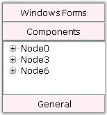
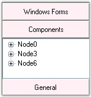
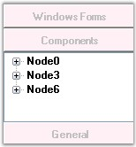

::: {style="DISPLAY: none"}
{#d2h_url_template}{#d2h_package_url style="WIDTH: 0px; DISPLAY: none; HEIGHT: 0px"}
:::

:::::: {.d2h_secondary_topic style="PADDING-BOTTOM: 10pt; MARGIN: 0pt; PADDING-LEFT: 0pt; PADDING-RIGHT: 0pt; PADDING-TOP: 0pt"}
##### Header Customization Settings {#header-customization-settings style="tab-stops: 0pt"}

[]{style="COLOR: #15428b"} 

Header Height and Font Settings

[]{style="COLOR: #4a5c8c; FONT-SIZE: 8pt"} 

The following properties can be used to change the height and font of the header of the GroupBar Items.

[]{style="COLOR: #15428b"} 

::: {align="center"}
  -------------------- ------------------------------------------------------------------
  GroupBar Property    Description
  GroupBarItemHeight   Specifies the height of the GroupBarItem.
  Font                 Specifies the font of the text displayed in the GroupBar header.
  -------------------- ------------------------------------------------------------------
:::

[]{style="COLOR: #15428b"} 

+------------------------------------------------------------------------------------------------------------------------------------------------------------------------------------------------------------------------------------------------------------------------------------------------------------------------------------------------------------------------------------------------------------------------------------------------------------------------------------------------+
| **[\[C#\]]{style="FONT-FAMILY: 'Courier New'; COLOR: black"}**                                                                                                                                                                                                                                                                                                                                                                                                                                 |
|                                                                                                                                                                                                                                                                                                                                                                                                                                                                                                |
| []{style="FONT-FAMILY: 'Courier New'; COLOR: black"}                                                                                                                                                                                                                                                                                                                                                                                                                                           |
|                                                                                                                                                                                                                                                                                                                                                                                                                                                                                                |
| [this]{style="FONT-FAMILY: 'Courier New'; COLOR: blue"}[.groupBar1.GroupBarItemHeight = 30;]{style="FONT-FAMILY: 'Courier New'"}                                                                                                                                                                                                                                                                                                                                                               |
|                                                                                                                                                                                                                                                                                                                                                                                                                                                                                                |
| [this]{style="FONT-FAMILY: 'Courier New'; COLOR: blue"}[.groupBar1.Font = [new]{style="COLOR: blue"} System.Drawing.[Font]{style="COLOR: teal"}([\"Verdana\"]{style="COLOR: maroon"}, 9F, System.Drawing.[FontStyle]{style="COLOR: teal"}.Regular, System.Drawing.]{style="FONT-FAMILY: 'Courier New'"}[GraphicsUnit]{style="FONT-FAMILY: 'Courier New'; COLOR: teal"}[.Point, ]{style="FONT-FAMILY: 'Courier New'"}[(([byte]{style="COLOR: blue"})(0)));]{style="FONT-FAMILY: 'Courier New'"} |
+------------------------------------------------------------------------------------------------------------------------------------------------------------------------------------------------------------------------------------------------------------------------------------------------------------------------------------------------------------------------------------------------------------------------------------------------------------------------------------------------+

[]{style="COLOR: #4a5c8c; FONT-SIZE: 8pt"} 

+----------------------------------------------------------------------------------------------------------------------------------------------------------------------------------------------------------------------------------------------------------------------------------------------------------------+
| **[\[VB.NET\]]{style="FONT-FAMILY: 'Courier New'; COLOR: black"}**                                                                                                                                                                                                                                             |
|                                                                                                                                                                                                                                                                                                                |
| []{style="FONT-FAMILY: 'Courier New'; COLOR: black"}                                                                                                                                                                                                                                                           |
|                                                                                                                                                                                                                                                                                                                |
| [Me]{style="FONT-FAMILY: 'Courier New'; COLOR: blue"}[.groupBar1.GroupBarItemHeight = 30 ]{style="FONT-FAMILY: 'Courier New'"}                                                                                                                                                                                 |
|                                                                                                                                                                                                                                                                                                                |
| [Me]{style="FONT-FAMILY: 'Courier New'; COLOR: blue"}[.groupBar1.Font = [New]{style="COLOR: blue"} System.Drawing.Font([\"Verdana\"]{style="COLOR: maroon"}, 9F, System.Drawing.FontStyle.Regular, System.Drawing.GraphicsUnit.Point, [CByte]{style="COLOR: blue"}((0))) ]{style="FONT-FAMILY: 'Courier New'"} |
+----------------------------------------------------------------------------------------------------------------------------------------------------------------------------------------------------------------------------------------------------------------------------------------------------------------+

[]{style="COLOR: #15428b"} 

{border="0"}[]{style="FONT-FAMILY: 'Calibri','sans-serif'; FONT-SIZE: 11pt"}

 

Figure 877**[: ]{style="FONT-FAMILY: 'Trebuchet MS','sans-serif'; COLOR: #15428b"}**GroupBar Items with Header Font = \"Verdana, 9F, Regular\"[]{style="FONT-FAMILY: 'Trebuchet MS','sans-serif'; COLOR: #15428b"}

[]{style="FONT-FAMILY: 'Trebuchet MS','sans-serif'; COLOR: #15428b"} 

{border="0"}[]{style="FONT-FAMILY: 'Calibri','sans-serif'"}

 

Figure 878: GroupBar Items with Header Height = \"30\"

[]{style="COLOR: #15428b"} 

Header BackColor and ForeColor Settings

[]{style="COLOR: #15428b"} 

Different colors can be applied to the header and header text of the GroupBar Items. This can be done using the below given properties.

[]{style="COLOR: #15428b"} 

::: {align="center"}
  ------------------- -------------------------------------------------------
  GroupBar Property   Description
  HeaderBackColor     Specifies the Background color for the GroupBar Item.
  HeaderForeColor     Specifies the Foreground color for the GroupBar Item.
  ------------------- -------------------------------------------------------
:::

[]{style="COLOR: #15428b"} 

+--------------------------------------------------------------------------------------------------------------------------------------------------------------------------------------+
| **[\[C#\]]{style="FONT-FAMILY: 'Courier New'; COLOR: black"}**                                                                                                                       |
|                                                                                                                                                                                      |
| []{style="FONT-FAMILY: 'Courier New'; COLOR: black"}                                                                                                                                 |
|                                                                                                                                                                                      |
| [this]{style="FONT-FAMILY: 'Courier New'; COLOR: blue"}[.groupBar1.HeaderBackColor = System.Drawing.[Color]{style="COLOR: teal"}.LavendarBlush;]{style="FONT-FAMILY: 'Courier New'"} |
|                                                                                                                                                                                      |
| [this]{style="FONT-FAMILY: 'Courier New'; COLOR: blue"}[.groupBar1.HeaderForeColor = System.Drawing.[Color]{style="COLOR: teal"}.Silver;]{style="FONT-FAMILY: 'Courier New'"}        |
+--------------------------------------------------------------------------------------------------------------------------------------------------------------------------------------+

[]{style="COLOR: #4a5c8c; FONT-SIZE: 8pt"} 

+-----------------------------------------------------------------------------------------------------------------------------------------------------+
| **[\[VB.NET\]]{style="FONT-FAMILY: 'Courier New'; COLOR: black"}**                                                                                  |
|                                                                                                                                                     |
| []{style="FONT-FAMILY: 'Courier New'; COLOR: black"}                                                                                                |
|                                                                                                                                                     |
| [Me]{style="FONT-FAMILY: 'Courier New'; COLOR: blue"}[.groupBar1.HeaderBackColor = System.Drawing.Color.Red]{style="FONT-FAMILY: 'Courier New'"}    |
|                                                                                                                                                     |
| [Me]{style="FONT-FAMILY: 'Courier New'; COLOR: blue"}[.groupBar1.HeaderForeColor = System.Drawing.Color.Maroon]{style="FONT-FAMILY: 'Courier New'"} |
+-----------------------------------------------------------------------------------------------------------------------------------------------------+

[]{style="COLOR: #15428b"} 

{border="0"}[]{style="FONT-FAMILY: 'Calibri','sans-serif'; FONT-SIZE: 11pt"}

 

Figure 879: GroupBar Items with Background Color = \"LavenderBlush\" and

Foreground Color = \"Silver\"

[]{style="COLOR: #4a5c8c; FONT-SIZE: 8pt"} 

The methods given below are used to reset the above properties.

 

::: {align="center"}
  ---------------------- -------------------------------------------------------------
  Methods                Description
  ResetHeaderFont        Resets the HeaderFont property to it\'s default value.
  ResetHeaderBackcolor   Resets the HeaderBackColor property to it\'s default value.
  ResetHeaderForeColor   Resets the HeaderForeColor property to it\'s default value.
  ---------------------- -------------------------------------------------------------
:::

 

 

[]{#p609} 

 

[]{#related-topics}
::::::
