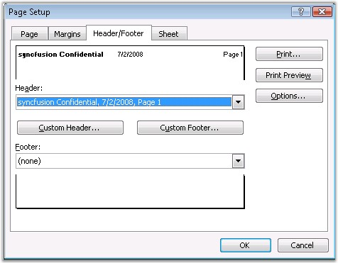
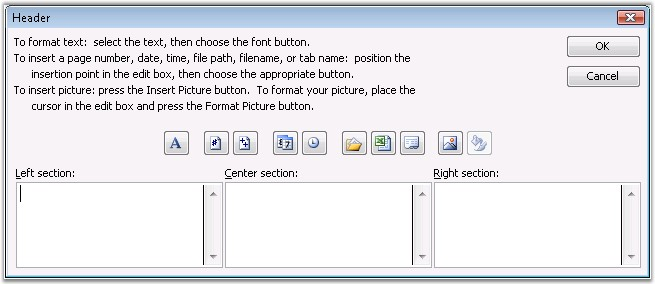

::: {style="DISPLAY: none"}
{#d2h_url_template}{#d2h_package_url style="WIDTH: 0px; DISPLAY: none; HEIGHT: 0px"}
:::

::::: {#nsbanner .d2h_main_nsbanner style="BORDER-BOTTOM: #999999 1px solid; POSITION: relative; PADDING-BOTTOM: 0px; BACKGROUND-COLOR: transparent; PADDING-LEFT: 0px; PADDING-RIGHT: 0px; DISPLAY: none; BORDER-TOP: #999999 1px solid; PADDING-TOP: 0px; LEFT: 0px"}
:::: {#TitleRow .d2h_main_titlerow style="PADDING-BOTTOM: 4px; BACKGROUND-COLOR: transparent; PADDING-LEFT: 22px; WIDTH: 100%; PADDING-RIGHT: 10px; DISPLAY: none; PADDING-TOP: 4px"}
::: {#ienav .d2h_main_ienav style="DISPLAY: none"}
{#D2HPrevious .D2HPreviousEnabled}  {#D2HNext .D2HNextEnabled}
:::
::::
:::::

::::::: {#nstext .d2h_main_nstext style="PADDING-BOTTOM: 10px; BACKGROUND-COLOR: transparent; PADDING-LEFT: 22px; PADDING-RIGHT: 10px; HEIGHT: 100%; OVERFLOW: auto; PADDING-TOP: 5px" hasuserbackground="true" valign="bottom"}
::: {#d2h_breadcrumbs .d2h_breadcrumbs}
[Essential Studio User Guide Documentation](ms-xhelp:///?Id=12457748-09e3-4d74-a240-8e049cedf030){.d2h_breadcrumbsNormal}[ \> ]{.d2h_breadcrumbsLinkSeparator}[Reporting Edition](ms-xhelp:///?Id=027aa5b6-6676-4f93-ad23-c20e8c45792e){.d2h_breadcrumbsNormal}[ \> ]{.d2h_breadcrumbsLinkSeparator}[Essential XlsIO](ms-xhelp:///?Id=b01a1b50-1d7d-40c0-bc83-af67e57c9005){.d2h_breadcrumbsNormal}[ \> ]{.d2h_breadcrumbsLinkSeparator}[Concepts and Features](ms-xhelp:///?Id=21b26556-5905-4ad9-90b4-40320db25faf){.d2h_breadcrumbsNormal}[ \> ]{.d2h_breadcrumbsLinkSeparator}[Insert](ms-xhelp:///?Id=3b5c8a38-7946-47f2-a4af-0711da3daaa8){.d2h_breadcrumbsNormal}
:::

### Header/Footer {#headerfooter style="tab-stops: 0pt"}

**[]{style="FONT-FAMILY: 'Segoe UI','sans-serif'; COLOR: black"}** 

Often, there is a need to include some information about your document at the top (the header), or the bottom (the footer) of each printed sheet. Spreadsheets often need several pages to print. It is important to put the right information on the header or footer, so you can tell which pages go together.

 

MS Excel provides an option to insert headers and footers, through the below handy dialog box from the **View** menu, to make this process as easy as possible.

 

{border="0"}

Figure 84: Page Setup Dialog Box to insert Headers and Footers

[]{style="FONT-FAMILY: 'Trebuchet MS','sans-serif'; COLOR: #15428b"} 

{border="0"}

Figure 85: Header Dialog Box**[]{style="FONT-STYLE: normal; FONT-FAMILY: 'Trebuchet MS','sans-serif'; COLOR: #15428b"}**

[]{style="FONT-FAMILY: 'Trebuchet MS','sans-serif'; COLOR: #15428b; FONT-SIZE: 9pt"} 

Inserting Headers and Footers in XlsIO

 

You can insert headers and footers through XlsIO, with the properties in the **IPageSetup**. Headers and footers can also be inserted to a Chart Worksheet.

 

The string that the header/footer takes, is a script that you can use to format the header. Please refer to the following link for more information on formatting strings: [[http://support.microsoft.com/smarterror/default.aspx?spid=global&query=213618.]{.UGHyperlink}](http://support.microsoft.com/smarterror/default.aspx?spid=global&query=213618.)

[]{style="FONT-FAMILY: 'Trebuchet MS','sans-serif'; COLOR: #15428b; FONT-SIZE: 9pt"} 

::: {align="center"}
+-----------------------------------+-----------------------------------------------------+
| Codes to Format Text              | Description                                         |
+===================================+=====================================================+
| &L                                | Left-aligns the characters that follow.             |
+-----------------------------------+-----------------------------------------------------+
| &C                                | Centers the characters that follow.                 |
+-----------------------------------+-----------------------------------------------------+
| &R                                | Right-aligns the characters that follow.            |
+-----------------------------------+-----------------------------------------------------+
| &E                                | Turns double-underline printing on or off.          |
+-----------------------------------+-----------------------------------------------------+
| &X                                | Turns superscript printing on or off.               |
+-----------------------------------+-----------------------------------------------------+
| &Y                                | Turns subscript printing on or off.                 |
+-----------------------------------+-----------------------------------------------------+
| &B                                | Turns bold printing on or off.                      |
+-----------------------------------+-----------------------------------------------------+
| &I                                | Turns italic printing on or off.                    |
+-----------------------------------+-----------------------------------------------------+
| &U                                | Turns underline printing on or off.                 |
+-----------------------------------+-----------------------------------------------------+
| &S                                | Turns strikethrough printing on or off.             |
+-----------------------------------+-----------------------------------------------------+
| &\"fontname\"                     | Prints the characters that follow in the specified  |
|                                   |                                                     |
|                                   | font. Be sure to include the quotation marks around |
|                                   |                                                     |
|                                   | the font name.                                      |
+-----------------------------------+-----------------------------------------------------+
| &nn                               | Prints the characters that follow in the specified  |
|                                   |                                                     |
|                                   | font size. Use a two-digit number to specify a size |
|                                   |                                                     |
|                                   | in points.                                          |
+-----------------------------------+-----------------------------------------------------+
:::

[]{style="FONT-FAMILY: 'Trebuchet MS','sans-serif'; COLOR: #15428b; FONT-SIZE: 9pt"} 

::: {align="center"}
  ------------------------------- -----------------------------------------------------------
  Codes to Insert Specific Data   Description
  &D                              Prints the current date.
  &T                              Prints the current time.
  &F                              Prints the name of the document.
  &A                              Prints the name of the workbook tab (the \"sheet name\").
  &P                              Prints the page number.
  &P+number                       Prints the page number plus number.
  &P-number                       Prints the page number minus number.
  &&                              Prints a single ampersand.
  &N                              Prints the total number of pages in the document.
  ------------------------------- -----------------------------------------------------------
:::

 

Following code example illustrates how to insert images in the header.

 

+--------------------------------------------------------------------------------------------------------------------------------------------------------------------------------------------+
| **[\[C#\]]{style="FONT-FAMILY: 'Courier New'"}**                                                                                                                                           |
|                                                                                                                                                                                            |
| []{style="FONT-FAMILY: 'Courier New'; COLOR: black"}                                                                                                                                       |
|                                                                                                                                                                                            |
| [// Insert image in right header.]{style="FONT-FAMILY: 'Courier New'; COLOR: green"}                                                                                                       |
|                                                                                                                                                                                            |
| [Image]{style="FONT-FAMILY: 'Courier New'; COLOR: #2b91af"}[ img = [Image]{style="COLOR: #2b91af"}.FromFile([@\"logo.jpg\"]{style="COLOR: #a31515"});]{style="FONT-FAMILY: 'Courier New'"} |
|                                                                                                                                                                                            |
| []{style="FONT-FAMILY: 'Courier New'"}                                                                                                                                                     |
|                                                                                                                                                                                            |
| [// Right Header Image.]{style="FONT-FAMILY: 'Courier New'; COLOR: green"}                                                                                                                 |
|                                                                                                                                                                                            |
| [sheet.PageSetup.RightHeaderImage = img;]{style="FONT-FAMILY: 'Courier New'"}                                                                                                              |
|                                                                                                                                                                                            |
| [sheet.PageSetup.RightHeader = [\"&G\"]{style="COLOR: #a31515"};]{style="FONT-FAMILY: 'Courier New'"}                                                                                      |
+--------------------------------------------------------------------------------------------------------------------------------------------------------------------------------------------+

[]{style="FONT-FAMILY: 'Trebuchet MS','sans-serif'; COLOR: #15428b; FONT-SIZE: 9pt"} 

+------------------------------------------------------------------------------------------------------------------------------------------------------------------------------------------+
| **[\[VB.NET\]]{style="FONT-FAMILY: 'Courier New'"}**                                                                                                                                     |
|                                                                                                                                                                                          |
| **[]{style="FONT-FAMILY: 'Courier New'"}**                                                                                                                                               |
|                                                                                                                                                                                          |
| [\' Insert image in right header.]{style="FONT-FAMILY: 'Courier New'; COLOR: green"}                                                                                                     |
|                                                                                                                                                                                          |
| [Dim]{style="FONT-FAMILY: 'Courier New'; COLOR: blue"}[ img [As]{style="COLOR: blue"} Image = Image.FromFile([\"logo.jpg\"]{style="COLOR: maroon"})]{style="FONT-FAMILY: 'Courier New'"} |
|                                                                                                                                                                                          |
| []{style="FONT-FAMILY: 'Courier New'"}                                                                                                                                                   |
|                                                                                                                                                                                          |
| [\' Right Header Image.]{style="FONT-FAMILY: 'Courier New'; COLOR: green"}                                                                                                               |
|                                                                                                                                                                                          |
| [sheet.PageSetup.RightHeaderImage = img]{style="FONT-FAMILY: 'Courier New'"}                                                                                                             |
|                                                                                                                                                                                          |
| [sheet.PageSetup.RightHeader = [\"&G\"]{style="COLOR: maroon"}]{style="FONT-FAMILY: 'Courier New'"}                                                                                      |
+------------------------------------------------------------------------------------------------------------------------------------------------------------------------------------------+

[]{style="FONT-FAMILY: 'Trebuchet MS','sans-serif'; COLOR: #15428b; FONT-SIZE: 9pt"} 

::: {style="BORDER-BOTTOM: windowtext 1pt solid; BORDER-LEFT: medium none; PADDING-BOTTOM: 1pt; MARGIN-TOP: 9pt; PADDING-LEFT: 0pt; PADDING-RIGHT: 0pt; MARGIN-BOTTOM: 9pt; BORDER-TOP: windowtext 1pt solid; BORDER-RIGHT: medium none; PADDING-TOP: 1pt"}
{border="0"}Note: XlsIO does not provide any option to get the page count. You can only insert the page count by using the format string, as illustrated in the following code snippet.
:::

[]{style="FONT-FAMILY: 'Trebuchet MS','sans-serif'; COLOR: #15428b; FONT-SIZE: 9pt"} 

+-------------------------------------------------------------------------------------------------------+
| **[\[C#\]]{style="FONT-FAMILY: 'Courier New'"}**                                                      |
|                                                                                                       |
| []{style="FONT-FAMILY: 'Courier New'; COLOR: black"}                                                  |
|                                                                                                       |
| [// Setting the page number in the Center Header.]{style="FONT-FAMILY: 'Courier New'; COLOR: green"}  |
|                                                                                                       |
| [sheet.PageSetup.CenterHeader = [\"&P\"]{style="COLOR: maroon"};]{style="FONT-FAMILY: 'Courier New'"} |
+-------------------------------------------------------------------------------------------------------+

[]{style="FONT-FAMILY: 'Trebuchet MS','sans-serif'; COLOR: #15428b; FONT-SIZE: 9pt"} 

+------------------------------------------------------------------------------------------------------+
| **[\[VB.NET\]]{style="FONT-FAMILY: 'Courier New'"}**                                                 |
|                                                                                                      |
| **[]{style="FONT-FAMILY: 'Courier New'"}**                                                           |
|                                                                                                      |
| [\' Setting the page number in the Center Header.]{style="FONT-FAMILY: 'Courier New'; COLOR: green"} |
|                                                                                                      |
| [sheet.PageSetup.CenterHeader = [\"&P\"]{style="COLOR: maroon"}]{style="FONT-FAMILY: 'Courier New'"} |
+------------------------------------------------------------------------------------------------------+

 

[]{#related-topics}
:::::::
