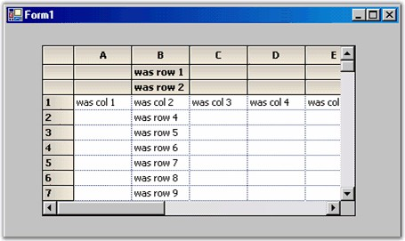

::: {style="DISPLAY: none"}
{#d2h_url_template}{#d2h_package_url style="WIDTH: 0px; DISPLAY: none; HEIGHT: 0px"}
:::

::: {.d2h_secondary_topic style="PADDING-BOTTOM: 10pt; MARGIN: 0pt; PADDING-LEFT: 0pt; PADDING-RIGHT: 0pt; PADDING-TOP: 0pt"}
##### Header Rows and Columns {#header-rows-and-columns style="tab-stops: 0pt"}

[]{style="FONT-FAMILY: 'Trebuchet MS','sans-serif'; COLOR: #15428b; FONT-SIZE: 9pt"} 

As we have seen in the previous section, it is possible to hide both the row and column headers. We can also have more than one header row and / or more than one header column. The properties that control the number of header rows and columns is **GridControl.Rows.HeaderCount** and **GridControl.Cols.HeaderCount**. This **HeaderCount** property is the index of the last header row or column. So, to have a total of three column header rows, set **Rows.HeaderCount** to two.

[]{style="FONT-FAMILY: 'Trebuchet MS','sans-serif'; COLOR: #15428b; FONT-SIZE: 9pt"} 

+-------------------------------------------------------------------------------------------------------------------------------------------------------+
| **[\[C#\]]{style="FONT-FAMILY: 'Courier New'; COLOR: black"}**                                                                                        |
|                                                                                                                                                       |
| []{style="FONT-FAMILY: 'Courier New'; COLOR: black"}                                                                                                  |
|                                                                                                                                                       |
| [// Total of three column header rows.    ]{style="FONT-FAMILY: 'Courier New'; COLOR: green"}[    ]{style="FONT-FAMILY: 'Courier New'; COLOR: black"} |
|                                                                                                                                                       |
| [this]{style="FONT-FAMILY: 'Courier New'; COLOR: blue"}[.gridControl1.Rows.HeaderCount = 2;]{style="FONT-FAMILY: 'Courier New'; COLOR: black"}        |
+-------------------------------------------------------------------------------------------------------------------------------------------------------+

[]{style="FONT-FAMILY: 'Trebuchet MS','sans-serif'; COLOR: #15428b; FONT-SIZE: 9pt"} 

+-------------------------------------------------------------------------------------------------------------------------------------------------------+
| **[\[VB.NET\]]{style="FONT-FAMILY: 'Courier New'; COLOR: black"}**                                                                                    |
|                                                                                                                                                       |
| []{style="FONT-FAMILY: 'Courier New'; COLOR: black"}                                                                                                  |
|                                                                                                                                                       |
| [\' Total of three column header rows.     ]{style="FONT-FAMILY: 'Courier New'; COLOR: green"}[   ]{style="FONT-FAMILY: 'Courier New'; COLOR: black"} |
|                                                                                                                                                       |
| [Me]{style="FONT-FAMILY: 'Courier New'; COLOR: blue"}[.GridControl1.Cols.Rows.HeaderCount = 2  ]{style="FONT-FAMILY: 'Courier New'; COLOR: black"}    |
+-------------------------------------------------------------------------------------------------------------------------------------------------------+

[]{style="FONT-FAMILY: 'Trebuchet MS','sans-serif'; COLOR: #15428b; FONT-SIZE: 9pt"} 

{border="0"}

[]{style="FONT-FAMILY: 'Trebuchet MS','sans-serif'; COLOR: #15428b; FONT-SIZE: 9pt"} 

*[Figure ]{style="FONT-SIZE: 9pt"}[172]{style="FONT-SIZE: 9pt"}[: Grid With Three Column Header Rows]{style="FONT-SIZE: 9pt"}*

 

[]{#p327} 

 

[]{#related-topics}
:::
