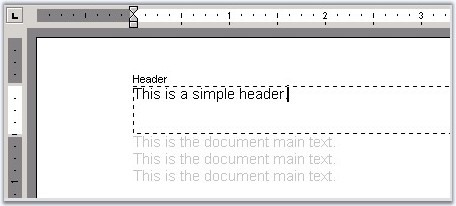
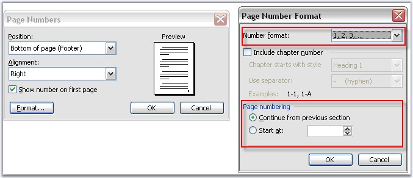

::: {style="DISPLAY: none"}
{#d2h_url_template}{#d2h_package_url style="WIDTH: 0px; DISPLAY: none; HEIGHT: 0px"}
:::

::::: {#nsbanner .d2h_main_nsbanner style="BORDER-BOTTOM: #999999 1px solid; POSITION: relative; PADDING-BOTTOM: 0px; BACKGROUND-COLOR: transparent; PADDING-LEFT: 0px; PADDING-RIGHT: 0px; DISPLAY: none; BORDER-TOP: #999999 1px solid; PADDING-TOP: 0px; LEFT: 0px"}
:::: {#TitleRow .d2h_main_titlerow style="PADDING-BOTTOM: 4px; BACKGROUND-COLOR: transparent; PADDING-LEFT: 22px; WIDTH: 100%; PADDING-RIGHT: 10px; DISPLAY: none; PADDING-TOP: 4px"}
::: {#ienav .d2h_main_ienav style="DISPLAY: none"}
{#D2HPrevious .D2HPreviousEnabled}  {#D2HNext .D2HNextEnabled}
:::
::::
:::::

::::::: {#nstext .d2h_main_nstext style="PADDING-BOTTOM: 10px; BACKGROUND-COLOR: transparent; PADDING-LEFT: 22px; PADDING-RIGHT: 10px; HEIGHT: 100%; OVERFLOW: auto; PADDING-TOP: 5px" hasuserbackground="true" valign="bottom"}
::: {#d2h_breadcrumbs .d2h_breadcrumbs}
[Essential Studio User Guide Documentation](ms-xhelp:///?Id=12457748-09e3-4d74-a240-8e049cedf030){.d2h_breadcrumbsNormal}[ \> ]{.d2h_breadcrumbsLinkSeparator}[Reporting Edition](ms-xhelp:///?Id=027aa5b6-6676-4f93-ad23-c20e8c45792e){.d2h_breadcrumbsNormal}[ \> ]{.d2h_breadcrumbsLinkSeparator}[Essential DocIO](ms-xhelp:///?Id=b88d77b3-4c51-460f-a761-d2ef6d5b0ca6){.d2h_breadcrumbsNormal}[ \> ]{.d2h_breadcrumbsLinkSeparator}[Concepts and Features](ms-xhelp:///?Id=c1881696-52ce-4414-9f3d-97433d8e9775){.d2h_breadcrumbsNormal}[ \> ]{.d2h_breadcrumbsLinkSeparator}[Section](ms-xhelp:///?Id=e7b4f267-a55a-4dff-9f7f-45ea32df6ecb){.d2h_breadcrumbsNormal}
:::

### Headers and Footers {#headers-and-footers style="tab-stops: 0pt"}

 

Headers and Footers are displayed at the top and bottom of the document pages respectively. Headers and Footers can include text, graphics, and nearly any other information that can be contained by a document.

 

{border="0"}

Figure 35: Header added to the Document

 

Headers and Footers are characteristics (properties) of the document section. Each document section can have its own set of headers/footers. Each section can also have different headers on the first, odd and even pages.

 

You can set the header and footer by using the **HeadersFooters** property of the Word Document\'s section. HeadersFooters property returns the object of the **WHeadersFooters** type. To access a particular header/footer, you can use the following properties of the **WHeadersFooters** class.

 

[·      ]{style="FONT-FAMILY: Symbol"}FirstPageHeader

[·      ]{style="FONT-FAMILY: Symbol"}FirstPageFooter

[·      ]{style="FONT-FAMILY: Symbol"}OddHeader

[·      ]{style="FONT-FAMILY: Symbol"}OddFooter

[·      ]{style="FONT-FAMILY: Symbol"}EvenHeader

[·      ]{style="FONT-FAMILY: Symbol"}EvenFooter

 

The following properties return the object of the HeaderFooter type.

 

**Public Properties**

 

::: {align="center"}
  ----------------- ------------------------------------------------------
  Name              Description
  EvenFooter        Gets even footer.
  EvenHeader        Gets even header.
  FirstPageFooter   Gets first page footer.  
  FirstPageHeader   Gets first page header.  
  Footer            Gets default footer.  
  Header            Gets default header.  
  IsEmpty           Detects whether all headers/footers are empty.
  OddFooter         Gets odd footer ( This is also the default footer ).
  OddHeader         Gets odd header ( This is also the default header ).
  LinkToPrevious    Links to previous section\'s header and footer.
  ----------------- ------------------------------------------------------
:::

 

Public Methods

 

::: {align="center"}
  --------------- -------------------------------------------------------------
  **Name**        **Description**
  GetEnumerator   Returns an enumerator that iterates through a collection.  
  --------------- -------------------------------------------------------------
:::

 

**HeaderFooter Class**

 

The HeaderFooter class represents the page header or footer. It is inherited from the **WTextBody**, and hence can hold other paragraphs inside.

 

**Public Properties**

 

::: {align="center"}
  ------------ --------------------------------
  Name         Description
  EntityType   Gets the type of the entity.  
  ------------ --------------------------------
:::

 

The following example illustrates how to add text to different types of headers and footers.

 

+---------------------------------------------------------------------------------------------------------------------------------------------------------------------------------------------------------------+
| **[\[C#\]]{style="FONT-FAMILY: 'Courier New'; COLOR: black"}**                                                                                                                                                |
|                                                                                                                                                                                                               |
| []{style="FONT-FAMILY: 'Courier New'"}                                                                                                                                                                        |
|                                                                                                                                                                                                               |
| [// A new document is created]{style="FONT-FAMILY: 'Courier New'; COLOR: green"}                                                                                                                              |
|                                                                                                                                                                                                               |
| [WordDocument document = [new]{style="COLOR: blue"} WordDocument();]{style="FONT-FAMILY: 'Courier New'"}                                                                                                      |
|                                                                                                                                                                                                               |
| []{style="FONT-FAMILY: 'Courier New'"}                                                                                                                                                                        |
|                                                                                                                                                                                                               |
| [// Adding the first section to the document.]{style="FONT-FAMILY: 'Courier New'; COLOR: green"}                                                                                                              |
|                                                                                                                                                                                                               |
| [IWSection section = document.AddSection();]{style="FONT-FAMILY: 'Courier New'"}                                                                                                                              |
|                                                                                                                                                                                                               |
| []{style="FONT-FAMILY: 'Courier New'"}                                                                                                                                                                        |
|                                                                                                                                                                                                               |
| [// Adding a paragraph to the section.]{style="FONT-FAMILY: 'Courier New'; COLOR: green"}                                                                                                                     |
|                                                                                                                                                                                                               |
| [IWParagraph paragraph = section.AddParagraph();]{style="FONT-FAMILY: 'Courier New'"}                                                                                                                         |
|                                                                                                                                                                                                               |
| []{style="FONT-FAMILY: 'Courier New'"}                                                                                                                                                                        |
|                                                                                                                                                                                                               |
| [// Setting DifferentFirstPage and DifferentOddEvenPages as true for inserting Header and Footer text.]{style="FONT-FAMILY: 'Courier New'; COLOR: green"}                                                     |
|                                                                                                                                                                                                               |
| [section.PageSetup.DifferentFirstPage = [true]{style="COLOR: blue"};]{style="FONT-FAMILY: 'Courier New'"}                                                                                                     |
|                                                                                                                                                                                                               |
| [section.PageSetup.DifferentOddAndEvenPages = [true]{style="COLOR: blue"};]{style="FONT-FAMILY: 'Courier New'"}                                                                                               |
|                                                                                                                                                                                                               |
| []{style="FONT-FAMILY: 'Courier New'"}                                                                                                                                                                        |
|                                                                                                                                                                                                               |
| [// Appending some text to the first page in document.]{style="FONT-FAMILY: 'Courier New'; COLOR: green"}                                                                                                     |
|                                                                                                                                                                                                               |
| [paragraph.AppendText( \"\\r\\r\[ First Page \] \\r\\rText Body_Text Body_Text Body_Text Body_Text Body_Text Body\" );]{style="FONT-FAMILY: 'Courier New'"}                                                   |
|                                                                                                                                                                                                               |
| [paragraph.ParagraphFormat.PageBreakAfter = [true]{style="COLOR: blue"};]{style="FONT-FAMILY: 'Courier New'"}                                                                                                 |
|                                                                                                                                                                                                               |
| []{style="FONT-FAMILY: 'Courier New'"}                                                                                                                                                                        |
|                                                                                                                                                                                                               |
| [// Appending some text to the second page in document.]{style="FONT-FAMILY: 'Courier New'; COLOR: green"}                                                                                                    |
|                                                                                                                                                                                                               |
| [paragraph = section.AddParagraph();]{style="FONT-FAMILY: 'Courier New'"}                                                                                                                                     |
|                                                                                                                                                                                                               |
| [paragraph.AppendText( \"\\r\\r\[ Second Page \] \\r\\rText Body_Text Body_Text Body_Text Body_Text Body_Text Body\" );]{style="FONT-FAMILY: 'Courier New'"}                                                  |
|                                                                                                                                                                                                               |
| [paragraph.ParagraphFormat.PageBreakAfter = [true]{style="COLOR: blue"};]{style="FONT-FAMILY: 'Courier New'"}                                                                                                 |
|                                                                                                                                                                                                               |
| []{style="FONT-FAMILY: 'Courier New'"}                                                                                                                                                                        |
|                                                                                                                                                                                                               |
| [// Appending some text to the third page in document.]{style="FONT-FAMILY: 'Courier New'; COLOR: green"}                                                                                                     |
|                                                                                                                                                                                                               |
| [paragraph = section.AddParagraph();]{style="FONT-FAMILY: 'Courier New'"}                                                                                                                                     |
|                                                                                                                                                                                                               |
| [paragraph.AppendText( \"\\r\\r\[ Third Page \] \\r\\rText Body_Text Body_Text Body_Text Body_Text Body_Text Body\" );]{style="FONT-FAMILY: 'Courier New'"}                                                   |
|                                                                                                                                                                                                               |
| []{style="FONT-FAMILY: 'Courier New'"}                                                                                                                                                                        |
|                                                                                                                                                                                                               |
| [// Inserting First Page Header]{style="FONT-FAMILY: 'Courier New'; COLOR: green"}                                                                                                                            |
|                                                                                                                                                                                                               |
| [paragraph = [new]{style="COLOR: blue"} WParagraph( document );]{style="FONT-FAMILY: 'Courier New'"}                                                                                                          |
|                                                                                                                                                                                                               |
| [paragraph.AppendText( \"\[ FIRST PAGE Header \]\" );]{style="FONT-FAMILY: 'Courier New'"}                                                                                                                    |
|                                                                                                                                                                                                               |
| [section.HeadersFooters.FirstPageHeader.Paragraphs.Add( paragraph );]{style="FONT-FAMILY: 'Courier New'"}                                                                                                     |
|                                                                                                                                                                                                               |
| []{style="FONT-FAMILY: 'Courier New'"}                                                                                                                                                                        |
|                                                                                                                                                                                                               |
| [// Inserting First Page Footer]{style="FONT-FAMILY: 'Courier New'; COLOR: green"}                                                                                                                            |
|                                                                                                                                                                                                               |
| [paragraph = [new]{style="COLOR: blue"} WParagraph( document );]{style="FONT-FAMILY: 'Courier New'"}                                                                                                          |
|                                                                                                                                                                                                               |
| [paragraph.AppendText( \"\[ FIRST PAGE Footer \]\" );]{style="FONT-FAMILY: 'Courier New'"}                                                                                                                    |
|                                                                                                                                                                                                               |
| [section.HeadersFooters.FirstPageFooter.Paragraphs.Add( paragraph );]{style="FONT-FAMILY: 'Courier New'"}                                                                                                     |
|                                                                                                                                                                                                               |
| []{style="FONT-FAMILY: 'Courier New'"}                                                                                                                                                                        |
|                                                                                                                                                                                                               |
| [// Inserting Odd Pages Header]{style="FONT-FAMILY: 'Courier New'; COLOR: green"}                                                                                                                             |
|                                                                                                                                                                                                               |
| [paragraph = [new]{style="COLOR: blue"} WParagraph( document );]{style="FONT-FAMILY: 'Courier New'"}                                                                                                          |
|                                                                                                                                                                                                               |
| [paragraph.AppendText( \"\[ ODD Page Header Text goes here \]\" );]{style="FONT-FAMILY: 'Courier New'"}                                                                                                       |
|                                                                                                                                                                                                               |
| [section.HeadersFooters.OddHeader.Paragraphs.Add( paragraph );]{style="FONT-FAMILY: 'Courier New'"}                                                                                                           |
|                                                                                                                                                                                                               |
| []{style="FONT-FAMILY: 'Courier New'"}                                                                                                                                                                        |
|                                                                                                                                                                                                               |
| [// Inserting Odd Pages Footer]{style="FONT-FAMILY: 'Courier New'; COLOR: green"}                                                                                                                             |
|                                                                                                                                                                                                               |
| [paragraph = [new]{style="COLOR: blue"} WParagraph( document );]{style="FONT-FAMILY: 'Courier New'"}                                                                                                          |
|                                                                                                                                                                                                               |
| [paragraph.AppendText( \"\[ ODD Page Footer Text goes here \]\" );]{style="FONT-FAMILY: 'Courier New'"}                                                                                                       |
|                                                                                                                                                                                                               |
| [section.HeadersFooters.OddFooter.Paragraphs.Add( paragraph );]{style="FONT-FAMILY: 'Courier New'"}                                                                                                           |
|                                                                                                                                                                                                               |
| []{style="FONT-FAMILY: 'Courier New'"}                                                                                                                                                                        |
|                                                                                                                                                                                                               |
| [// Inserting Even Pages Header]{style="FONT-FAMILY: 'Courier New'; COLOR: green"}                                                                                                                            |
|                                                                                                                                                                                                               |
| [paragraph = [new]{style="COLOR: blue"} WParagraph( document );]{style="FONT-FAMILY: 'Courier New'"}                                                                                                          |
|                                                                                                                                                                                                               |
| [paragraph.AppendText( \"\[ EVEN Page Header Text goes here \]\" );]{style="FONT-FAMILY: 'Courier New'"}                                                                                                      |
|                                                                                                                                                                                                               |
| [section.HeadersFooters.EvenHeader.Paragraphs.Add( paragraph );]{style="FONT-FAMILY: 'Courier New'"}                                                                                                          |
|                                                                                                                                                                                                               |
| []{style="FONT-FAMILY: 'Courier New'"}                                                                                                                                                                        |
|                                                                                                                                                                                                               |
| [// Inserting Even Pages Footer]{style="FONT-FAMILY: 'Courier New'; COLOR: green"}                                                                                                                            |
|                                                                                                                                                                                                               |
| [paragraph = [new]{style="COLOR: blue"} WParagraph( document );]{style="FONT-FAMILY: 'Courier New'"}                                                                                                          |
|                                                                                                                                                                                                               |
| [paragraph.AppendText( \"\[ EVEN Page Footer Text goes here \]\" );]{style="FONT-FAMILY: 'Courier New'"}                                                                                                      |
|                                                                                                                                                                                                               |
| [section.HeadersFooters.EvenFooter.Paragraphs.Add( paragraph );]{style="FONT-FAMILY: 'Courier New'"}                                                                                                          |
|                                                                                                                                                                                                               |
| []{style="FONT-FAMILY: 'Courier New'"}                                                                                                                                                                        |
|                                                                                                                                                                                                               |
| [// Adding the second section to the document.]{style="FONT-FAMILY: 'Courier New'; COLOR: green"}                                                                                                             |
|                                                                                                                                                                                                               |
| [section = document.AddSection();]{style="FONT-FAMILY: 'Courier New'"}                                                                                                                                        |
|                                                                                                                                                                                                               |
| [section.PageSetup.DifferentFirstPage = [true]{style="COLOR: blue"};]{style="FONT-FAMILY: 'Courier New'"}                                                                                                     |
|                                                                                                                                                                                                               |
| []{style="FONT-FAMILY: 'Courier New'"}                                                                                                                                                                        |
|                                                                                                                                                                                                               |
| [// Appending some text to the Second Sections\'s first page in the document.]{style="FONT-FAMILY: 'Courier New'; COLOR: green"}                                                                              |
|                                                                                                                                                                                                               |
| [paragraph = section.AddParagraph();]{style="FONT-FAMILY: 'Courier New'"}                                                                                                                                     |
|                                                                                                                                                                                                               |
| [paragraph.AppendText( \"\\r\\r\[ First Page for SECOND SECTION \]\\r\[ ON DIFFERENT FIRTS PAGE \]\\r\\rText Body_Text Body_Text Body_Text Body_Text Body_Text Body\" );]{style="FONT-FAMILY: 'Courier New'"} |
|                                                                                                                                                                                                               |
| [paragraph.ParagraphFormat.PageBreakAfter = [true]{style="COLOR: blue"};]{style="FONT-FAMILY: 'Courier New'"}                                                                                                 |
|                                                                                                                                                                                                               |
| []{style="FONT-FAMILY: 'Courier New'"}                                                                                                                                                                        |
|                                                                                                                                                                                                               |
| [// Appending some text to the Second Sections\'s second page in the document.]{style="FONT-FAMILY: 'Courier New'; COLOR: green"}                                                                             |
|                                                                                                                                                                                                               |
| [paragraph = section.AddParagraph();]{style="FONT-FAMILY: 'Courier New'"}                                                                                                                                     |
|                                                                                                                                                                                                               |
| [paragraph.AppendText( \"\\r\\r\[ Second Page for SECOND SECTION \]\\rText Body_Text Body_Text Body_Text Body_Text Body_Text Body\" );]{style="FONT-FAMILY: 'Courier New'"}                                   |
|                                                                                                                                                                                                               |
| []{style="FONT-FAMILY: 'Courier New'"}                                                                                                                                                                        |
|                                                                                                                                                                                                               |
| [// Inserting Second Sections\'s First Header]{style="FONT-FAMILY: 'Courier New'; COLOR: green"}                                                                                                              |
|                                                                                                                                                                                                               |
| [paragraph = [new]{style="COLOR: blue"} WParagraph( document );]{style="FONT-FAMILY: 'Courier New'"}                                                                                                          |
|                                                                                                                                                                                                               |
| [paragraph.AppendText( \"\[ SECOND SECTION FIRST PAGE Header \]\" );]{style="FONT-FAMILY: 'Courier New'"}                                                                                                     |
|                                                                                                                                                                                                               |
| [section.HeadersFooters.FirstPageHeader.Paragraphs.Add( paragraph );]{style="FONT-FAMILY: 'Courier New'"}                                                                                                     |
|                                                                                                                                                                                                               |
| []{style="FONT-FAMILY: 'Courier New'"}                                                                                                                                                                        |
|                                                                                                                                                                                                               |
| [// Inserting Second Sections\'s First Footer]{style="FONT-FAMILY: 'Courier New'; COLOR: green"}                                                                                                              |
|                                                                                                                                                                                                               |
| [paragraph = [new]{style="COLOR: blue"} WParagraph( document );]{style="FONT-FAMILY: 'Courier New'"}                                                                                                          |
|                                                                                                                                                                                                               |
| [paragraph.AppendText( \"\[ SECOND SECTION FIRST PAGE Footer \]\" );]{style="FONT-FAMILY: 'Courier New'"}                                                                                                     |
|                                                                                                                                                                                                               |
| [section.HeadersFooters.FirstPageFooter.Paragraphs.Add( paragraph );]{style="FONT-FAMILY: 'Courier New'"}                                                                                                     |
|                                                                                                                                                                                                               |
| []{style="FONT-FAMILY: 'Courier New'"}                                                                                                                                                                        |
|                                                                                                                                                                                                               |
| [// Inserting Second Sections\'s Header]{style="FONT-FAMILY: 'Courier New'; COLOR: green"}                                                                                                                    |
|                                                                                                                                                                                                               |
| [paragraph = [new]{style="COLOR: blue"} WParagraph( document );]{style="FONT-FAMILY: 'Courier New'"}                                                                                                          |
|                                                                                                                                                                                                               |
| [paragraph.AppendText( \"SECOND SECTION Header Text goes here\" );]{style="FONT-FAMILY: 'Courier New'"}                                                                                                       |
|                                                                                                                                                                                                               |
| [section.HeadersFooters.OddHeader.Paragraphs.Add( paragraph );]{style="FONT-FAMILY: 'Courier New'"}                                                                                                           |
|                                                                                                                                                                                                               |
| []{style="FONT-FAMILY: 'Courier New'"}                                                                                                                                                                        |
|                                                                                                                                                                                                               |
| [// Inserting Second Sections\'s Footer]{style="FONT-FAMILY: 'Courier New'; COLOR: green"}                                                                                                                    |
|                                                                                                                                                                                                               |
| [paragraph = [new]{style="COLOR: blue"} WParagraph( document );]{style="FONT-FAMILY: 'Courier New'"}                                                                                                          |
|                                                                                                                                                                                                               |
| [paragraph.AppendText( \"SECOND SECTION Footer Text goes here\" );]{style="FONT-FAMILY: 'Courier New'"}                                                                                                       |
|                                                                                                                                                                                                               |
| [section.HeadersFooters.OddFooter.Paragraphs.Add( paragraph );]{style="FONT-FAMILY: 'Courier New'"}                                                                                                           |
|                                                                                                                                                                                                               |
| []{style="FONT-FAMILY: 'Courier New'"}                                                                                                                                                                        |
|                                                                                                                                                                                                               |
| [// Saving the document to disk.]{style="FONT-FAMILY: 'Courier New'; COLOR: green"}                                                                                                                           |
|                                                                                                                                                                                                               |
| [document.Save( \"Sample.doc\" , FormatType.Doc );]{style="FONT-FAMILY: 'Courier New'"}                                                                                                                       |
+---------------------------------------------------------------------------------------------------------------------------------------------------------------------------------------------------------------+

 

+------------------------------------------------------------------------------------------------------------------------------------------------------------------------------------------------------------------------------------------------------------------------------------------------+
| **[\[VB.NET\]]{style="FONT-FAMILY: 'Courier New'; COLOR: black"}**                                                                                                                                                                                                                             |
|                                                                                                                                                                                                                                                                                                |
| []{style="FONT-FAMILY: 'Courier New'; COLOR: black"}                                                                                                                                                                                                                                           |
|                                                                                                                                                                                                                                                                                                |
| [\' A new document is created.]{style="FONT-FAMILY: 'Courier New'; COLOR: green"}                                                                                                                                                                                                              |
|                                                                                                                                                                                                                                                                                                |
| [Dim]{style="FONT-FAMILY: 'Courier New'; COLOR: blue"}[ document [As]{style="COLOR: blue"} WordDocument = [New]{style="COLOR: blue"} WordDocument()]{style="FONT-FAMILY: 'Courier New'"}                                                                                                       |
|                                                                                                                                                                                                                                                                                                |
| []{style="FONT-FAMILY: 'Courier New'"}                                                                                                                                                                                                                                                         |
|                                                                                                                                                                                                                                                                                                |
| [\' Adding the first section to the document.]{style="FONT-FAMILY: 'Courier New'; COLOR: green"}                                                                                                                                                                                               |
|                                                                                                                                                                                                                                                                                                |
| [Dim]{style="FONT-FAMILY: 'Courier New'; COLOR: blue"}[ section [As]{style="COLOR: blue"} IWSection = document.AddSection()]{style="FONT-FAMILY: 'Courier New'"}                                                                                                                               |
|                                                                                                                                                                                                                                                                                                |
| []{style="FONT-FAMILY: 'Courier New'"}                                                                                                                                                                                                                                                         |
|                                                                                                                                                                                                                                                                                                |
| [\' Adding a paragraph to the section.]{style="FONT-FAMILY: 'Courier New'; COLOR: green"}                                                                                                                                                                                                      |
|                                                                                                                                                                                                                                                                                                |
| [Dim]{style="FONT-FAMILY: 'Courier New'; COLOR: blue"}[ paragraph [As]{style="COLOR: blue"} IWParagraph = section.AddParagraph()]{style="FONT-FAMILY: 'Courier New'"}                                                                                                                          |
|                                                                                                                                                                                                                                                                                                |
| []{style="FONT-FAMILY: 'Courier New'"}                                                                                                                                                                                                                                                         |
|                                                                                                                                                                                                                                                                                                |
| [\' Setting DifferentFirstPage and DifferentOddEvenPages as true for inserting Header and Footer text.]{style="FONT-FAMILY: 'Courier New'; COLOR: green"}                                                                                                                                      |
|                                                                                                                                                                                                                                                                                                |
| [section.PageSetup.DifferentFirstPage = [True]{style="COLOR: blue"}]{style="FONT-FAMILY: 'Courier New'"}                                                                                                                                                                                       |
|                                                                                                                                                                                                                                                                                                |
| [section.PageSetup.DifferentOddAndEvenPages = [True]{style="COLOR: blue"}]{style="FONT-FAMILY: 'Courier New'"}                                                                                                                                                                                 |
|                                                                                                                                                                                                                                                                                                |
| []{style="FONT-FAMILY: 'Courier New'; COLOR: blue"}                                                                                                                                                                                                                                            |
|                                                                                                                                                                                                                                                                                                |
| [\' Appending some text to the first page in document.]{style="FONT-FAMILY: 'Courier New'; COLOR: green"}                                                                                                                                                                                      |
|                                                                                                                                                                                                                                                                                                |
| [paragraph.AppendText(Constants.vbCr + Constants.vbCr & \"\[ First Page \] \" & Constants.vbCr + Constants.vbCr & \"Text Body_Text Body_Text Body_Text Body_Text Body_Text Body\")]{style="FONT-FAMILY: 'Courier New'"}                                                                        |
|                                                                                                                                                                                                                                                                                                |
| [paragraph.ParagraphFormat.PageBreakAfter = [True]{style="COLOR: blue"}]{style="FONT-FAMILY: 'Courier New'"}                                                                                                                                                                                   |
|                                                                                                                                                                                                                                                                                                |
| []{style="FONT-FAMILY: 'Courier New'; COLOR: blue"}                                                                                                                                                                                                                                            |
|                                                                                                                                                                                                                                                                                                |
| [\' Appending some text to the second page in document.]{style="FONT-FAMILY: 'Courier New'; COLOR: green"}                                                                                                                                                                                     |
|                                                                                                                                                                                                                                                                                                |
| [paragraph = section.AddParagraph()]{style="FONT-FAMILY: 'Courier New'"}                                                                                                                                                                                                                       |
|                                                                                                                                                                                                                                                                                                |
| [paragraph.AppendText(Constants.vbCr + Constants.vbCr & \"\[ Second Page \] \" & Constants.vbCr + Constants.vbCr & \"Text Body_Text Body_Text Body_Text Body_Text Body_Text Body\")]{style="FONT-FAMILY: 'Courier New'"}                                                                       |
|                                                                                                                                                                                                                                                                                                |
| [paragraph.ParagraphFormat.PageBreakAfter = [True]{style="COLOR: blue"}]{style="FONT-FAMILY: 'Courier New'"}                                                                                                                                                                                   |
|                                                                                                                                                                                                                                                                                                |
| []{style="FONT-FAMILY: 'Courier New'; COLOR: blue"}                                                                                                                                                                                                                                            |
|                                                                                                                                                                                                                                                                                                |
| [\' Appending some text to the third page in document.]{style="FONT-FAMILY: 'Courier New'; COLOR: green"}                                                                                                                                                                                      |
|                                                                                                                                                                                                                                                                                                |
| [paragraph = section.AddParagraph()]{style="FONT-FAMILY: 'Courier New'"}                                                                                                                                                                                                                       |
|                                                                                                                                                                                                                                                                                                |
| [paragraph.AppendText(Constants.vbCr + Constants.vbCr & \"\[ Third Page \] \" & Constants.vbCr + Constants.vbCr & \"Text Body_Text Body_Text Body_Text Body_Text Body_Text Body\")]{style="FONT-FAMILY: 'Courier New'"}                                                                        |
|                                                                                                                                                                                                                                                                                                |
| []{style="FONT-FAMILY: 'Courier New'"}                                                                                                                                                                                                                                                         |
|                                                                                                                                                                                                                                                                                                |
| [\' Inserting First Page Header]{style="FONT-FAMILY: 'Courier New'; COLOR: green"}                                                                                                                                                                                                             |
|                                                                                                                                                                                                                                                                                                |
| [paragraph = [New]{style="COLOR: blue"} WParagraph(document)]{style="FONT-FAMILY: 'Courier New'"}                                                                                                                                                                                              |
|                                                                                                                                                                                                                                                                                                |
| [paragraph.AppendText(\"\[ FIRST PAGE Header \]\")]{style="FONT-FAMILY: 'Courier New'"}                                                                                                                                                                                                        |
|                                                                                                                                                                                                                                                                                                |
| [section.HeadersFooters.FirstPageHeader.Paragraphs.Add(paragraph)]{style="FONT-FAMILY: 'Courier New'"}                                                                                                                                                                                         |
|                                                                                                                                                                                                                                                                                                |
| []{style="FONT-FAMILY: 'Courier New'"}                                                                                                                                                                                                                                                         |
|                                                                                                                                                                                                                                                                                                |
| [\' Inserting First Page Footer]{style="FONT-FAMILY: 'Courier New'; COLOR: green"}                                                                                                                                                                                                             |
|                                                                                                                                                                                                                                                                                                |
| [paragraph = [New]{style="COLOR: blue"} WParagraph(document)]{style="FONT-FAMILY: 'Courier New'"}                                                                                                                                                                                              |
|                                                                                                                                                                                                                                                                                                |
| [paragraph.AppendText(\"\[ FIRST PAGE Footer \]\")]{style="FONT-FAMILY: 'Courier New'"}                                                                                                                                                                                                        |
|                                                                                                                                                                                                                                                                                                |
| [section.HeadersFooters.FirstPageFooter.Paragraphs.Add(paragraph)]{style="FONT-FAMILY: 'Courier New'"}                                                                                                                                                                                         |
|                                                                                                                                                                                                                                                                                                |
| []{style="FONT-FAMILY: 'Courier New'"}                                                                                                                                                                                                                                                         |
|                                                                                                                                                                                                                                                                                                |
| [\' Inserting Odd Pages Header]{style="FONT-FAMILY: 'Courier New'; COLOR: green"}                                                                                                                                                                                                              |
|                                                                                                                                                                                                                                                                                                |
| [paragraph = [New]{style="COLOR: blue"} WParagraph(document)]{style="FONT-FAMILY: 'Courier New'"}                                                                                                                                                                                              |
|                                                                                                                                                                                                                                                                                                |
| [paragraph.AppendText(\"\[ ODD Page Header Text goes here \]\")]{style="FONT-FAMILY: 'Courier New'"}                                                                                                                                                                                           |
|                                                                                                                                                                                                                                                                                                |
| [section.HeadersFooters.OddHeader.Paragraphs.Add(paragraph)]{style="FONT-FAMILY: 'Courier New'"}                                                                                                                                                                                               |
|                                                                                                                                                                                                                                                                                                |
| []{style="FONT-FAMILY: 'Courier New'"}                                                                                                                                                                                                                                                         |
|                                                                                                                                                                                                                                                                                                |
| [\' Inserting Odd Pages Footer]{style="FONT-FAMILY: 'Courier New'; COLOR: green"}                                                                                                                                                                                                              |
|                                                                                                                                                                                                                                                                                                |
| [paragraph = [New]{style="COLOR: blue"} WParagraph(document)]{style="FONT-FAMILY: 'Courier New'"}                                                                                                                                                                                              |
|                                                                                                                                                                                                                                                                                                |
| [paragraph.AppendText(\"\[ ODD Page Footer Text goes here \]\")]{style="FONT-FAMILY: 'Courier New'"}                                                                                                                                                                                           |
|                                                                                                                                                                                                                                                                                                |
| [section.HeadersFooters.OddFooter.Paragraphs.Add(paragraph)]{style="FONT-FAMILY: 'Courier New'"}                                                                                                                                                                                               |
|                                                                                                                                                                                                                                                                                                |
| []{style="FONT-FAMILY: 'Courier New'"}                                                                                                                                                                                                                                                         |
|                                                                                                                                                                                                                                                                                                |
| [\' Inserting Even Pages Header]{style="FONT-FAMILY: 'Courier New'; COLOR: green"}                                                                                                                                                                                                             |
|                                                                                                                                                                                                                                                                                                |
| [paragraph = [New]{style="COLOR: blue"} WParagraph(document)]{style="FONT-FAMILY: 'Courier New'"}                                                                                                                                                                                              |
|                                                                                                                                                                                                                                                                                                |
| [paragraph.AppendText(\"\[ EVEN Page Header Text goes here \]\")]{style="FONT-FAMILY: 'Courier New'"}                                                                                                                                                                                          |
|                                                                                                                                                                                                                                                                                                |
| [section.HeadersFooters.EvenHeader.Paragraphs.Add(paragraph)]{style="FONT-FAMILY: 'Courier New'"}                                                                                                                                                                                              |
|                                                                                                                                                                                                                                                                                                |
| []{style="FONT-FAMILY: 'Courier New'"}                                                                                                                                                                                                                                                         |
|                                                                                                                                                                                                                                                                                                |
| [\' Inserting Even Pages Footer]{style="FONT-FAMILY: 'Courier New'; COLOR: green"}                                                                                                                                                                                                             |
|                                                                                                                                                                                                                                                                                                |
| [paragraph = [New]{style="COLOR: blue"} WParagraph(document)]{style="FONT-FAMILY: 'Courier New'"}                                                                                                                                                                                              |
|                                                                                                                                                                                                                                                                                                |
| [paragraph.AppendText(\"\[ EVEN Page Footer Text goes here \]\")]{style="FONT-FAMILY: 'Courier New'"}                                                                                                                                                                                          |
|                                                                                                                                                                                                                                                                                                |
| [section.HeadersFooters.EvenFooter.Paragraphs.Add(paragraph)]{style="FONT-FAMILY: 'Courier New'"}                                                                                                                                                                                              |
|                                                                                                                                                                                                                                                                                                |
| []{style="FONT-FAMILY: 'Courier New'"}                                                                                                                                                                                                                                                         |
|                                                                                                                                                                                                                                                                                                |
| [\' Adding the second section to the document.]{style="FONT-FAMILY: 'Courier New'; COLOR: green"}                                                                                                                                                                                              |
|                                                                                                                                                                                                                                                                                                |
| [section = document.AddSection()]{style="FONT-FAMILY: 'Courier New'"}                                                                                                                                                                                                                          |
|                                                                                                                                                                                                                                                                                                |
| [section.PageSetup.DifferentFirstPage = [True]{style="COLOR: blue"}]{style="FONT-FAMILY: 'Courier New'"}                                                                                                                                                                                       |
|                                                                                                                                                                                                                                                                                                |
| []{style="FONT-FAMILY: 'Courier New'; COLOR: blue"}                                                                                                                                                                                                                                            |
|                                                                                                                                                                                                                                                                                                |
| [\' Appending some text to the Second Sections\'s first page in the document.]{style="FONT-FAMILY: 'Courier New'; COLOR: green"}                                                                                                                                                               |
|                                                                                                                                                                                                                                                                                                |
| [paragraph = section.AddParagraph()]{style="FONT-FAMILY: 'Courier New'"}                                                                                                                                                                                                                       |
|                                                                                                                                                                                                                                                                                                |
| [paragraph.AppendText(Constants.vbCr + Constants.vbCr & \"\[ First Page for SECOND SECTION \]\" & Constants.vbCr & \"\[ ON DIFFERENT FIRTS PAGE \]\" & Constants.vbCr + Constants.vbCr & \"Text Body_Text Body_Text Body_Text Body_Text Body_Text Body\")]{style="FONT-FAMILY: 'Courier New'"} |
|                                                                                                                                                                                                                                                                                                |
| [paragraph.ParagraphFormat.PageBreakAfter = [True]{style="COLOR: blue"}]{style="FONT-FAMILY: 'Courier New'"}                                                                                                                                                                                   |
|                                                                                                                                                                                                                                                                                                |
| []{style="FONT-FAMILY: 'Courier New'; COLOR: blue"}                                                                                                                                                                                                                                            |
|                                                                                                                                                                                                                                                                                                |
| [\' Appending some text to the Second Sections\'s second page in the document.]{style="FONT-FAMILY: 'Courier New'; COLOR: green"}                                                                                                                                                              |
|                                                                                                                                                                                                                                                                                                |
| [paragraph = section.AddParagraph()]{style="FONT-FAMILY: 'Courier New'"}                                                                                                                                                                                                                       |
|                                                                                                                                                                                                                                                                                                |
| [paragraph.AppendText(Constants.vbCr + Constants.vbCr & \"\[ Second Page for SECOND SECTION \]\" & Constants.vbCr & \"Text Body_Text Body_Text Body_Text Body_Text Body_Text Body\")]{style="FONT-FAMILY: 'Courier New'"}                                                                      |
|                                                                                                                                                                                                                                                                                                |
| []{style="FONT-FAMILY: 'Courier New'"}                                                                                                                                                                                                                                                         |
|                                                                                                                                                                                                                                                                                                |
| [\' Inserting Second Sections\'s First Header]{style="FONT-FAMILY: 'Courier New'; COLOR: green"}                                                                                                                                                                                               |
|                                                                                                                                                                                                                                                                                                |
| [paragraph = [New]{style="COLOR: blue"} WParagraph(document)]{style="FONT-FAMILY: 'Courier New'"}                                                                                                                                                                                              |
|                                                                                                                                                                                                                                                                                                |
| [paragraph.AppendText(\"\[ SECOND SECTION FIRST PAGE Header \]\")]{style="FONT-FAMILY: 'Courier New'"}                                                                                                                                                                                         |
|                                                                                                                                                                                                                                                                                                |
| [section.HeadersFooters.FirstPageHeader.Paragraphs.Add(paragraph)]{style="FONT-FAMILY: 'Courier New'"}                                                                                                                                                                                         |
|                                                                                                                                                                                                                                                                                                |
| []{style="FONT-FAMILY: 'Courier New'"}                                                                                                                                                                                                                                                         |
|                                                                                                                                                                                                                                                                                                |
| [\' Inserting Second Sections\'s First Footer]{style="FONT-FAMILY: 'Courier New'; COLOR: green"}                                                                                                                                                                                               |
|                                                                                                                                                                                                                                                                                                |
| [paragraph = [New]{style="COLOR: blue"} WParagraph(document)]{style="FONT-FAMILY: 'Courier New'"}                                                                                                                                                                                              |
|                                                                                                                                                                                                                                                                                                |
| [paragraph.AppendText(\"\[ SECOND SECTION FIRST PAGE Footer \]\")]{style="FONT-FAMILY: 'Courier New'"}                                                                                                                                                                                         |
|                                                                                                                                                                                                                                                                                                |
| [section.HeadersFooters.FirstPageFooter.Paragraphs.Add(paragraph)]{style="FONT-FAMILY: 'Courier New'"}                                                                                                                                                                                         |
|                                                                                                                                                                                                                                                                                                |
| []{style="FONT-FAMILY: 'Courier New'"}                                                                                                                                                                                                                                                         |
|                                                                                                                                                                                                                                                                                                |
| [\' Inserting Second Sections\'s Header]{style="FONT-FAMILY: 'Courier New'; COLOR: green"}                                                                                                                                                                                                     |
|                                                                                                                                                                                                                                                                                                |
| [paragraph = [New]{style="COLOR: blue"} WParagraph(document)]{style="FONT-FAMILY: 'Courier New'"}                                                                                                                                                                                              |
|                                                                                                                                                                                                                                                                                                |
| [paragraph.AppendText(\"SECOND SECTION Header Text goes here\")]{style="FONT-FAMILY: 'Courier New'"}                                                                                                                                                                                           |
|                                                                                                                                                                                                                                                                                                |
| [section.HeadersFooters.OddHeader.Paragraphs.Add(paragraph)]{style="FONT-FAMILY: 'Courier New'"}                                                                                                                                                                                               |
|                                                                                                                                                                                                                                                                                                |
| []{style="FONT-FAMILY: 'Courier New'"}                                                                                                                                                                                                                                                         |
|                                                                                                                                                                                                                                                                                                |
| [\' Inserting Second Sections\'s Footer]{style="FONT-FAMILY: 'Courier New'; COLOR: green"}                                                                                                                                                                                                     |
|                                                                                                                                                                                                                                                                                                |
| [paragraph = [New]{style="COLOR: blue"} WParagraph(document)]{style="FONT-FAMILY: 'Courier New'"}                                                                                                                                                                                              |
|                                                                                                                                                                                                                                                                                                |
| [paragraph.AppendText(\"SECOND SECTION Footer Text goes here\")]{style="FONT-FAMILY: 'Courier New'"}                                                                                                                                                                                           |
|                                                                                                                                                                                                                                                                                                |
| [section.HeadersFooters.OddFooter.Paragraphs.Add(paragraph)]{style="FONT-FAMILY: 'Courier New'"}                                                                                                                                                                                               |
|                                                                                                                                                                                                                                                                                                |
| []{style="FONT-FAMILY: 'Courier New'"}                                                                                                                                                                                                                                                         |
|                                                                                                                                                                                                                                                                                                |
| [\' Saving the document to disk.]{style="FONT-FAMILY: 'Courier New'; COLOR: green"}                                                                                                                                                                                                            |
|                                                                                                                                                                                                                                                                                                |
| [document.Save(\"Sample.doc\", FormatType.Doc)]{style="FONT-FAMILY: 'Courier New'"}                                                                                                                                                                                                            |
+------------------------------------------------------------------------------------------------------------------------------------------------------------------------------------------------------------------------------------------------------------------------------------------------+

 

DocIO provides options to link the header or footer of a section to the corresponding header or footer in the previous section by using the **LinkToPrevious** property. This option is available in the Header/Footer toolbar in MS Word. By default this property is set to **True**.

 

The following code illustrates how to enable this option by using DocIO.\
\

+---------------------------------------------------------------------------------------------------------------------+
| **[\[C#\]]{style="FONT-FAMILY: 'Courier New'; COLOR: black"}**                                                      |
|                                                                                                                     |
|                                                                                                                     |
|                                                                                                                     |
| [doc.AddSection().HeadersFooters.LinkToPrevious = [true]{style="COLOR: blue"};]{style="FONT-FAMILY: 'Courier New'"} |
+---------------------------------------------------------------------------------------------------------------------+

 

+--------------------------------------------------------------------------------------------------------------------+
| **[\[VB.NET\]]{style="FONT-FAMILY: 'Courier New'; COLOR: black"}**                                                 |
|                                                                                                                    |
| []{style="COLOR: black"}                                                                                           |
|                                                                                                                    |
| [doc.AddSection().HeadersFooters.LinkToPrevious = [True]{style="COLOR: blue"}]{style="FONT-FAMILY: 'Courier New'"} |
+--------------------------------------------------------------------------------------------------------------------+

 

**Page Number Format**

 

You can insert page numbers of different formats such as arabic numbers, roman numbers, and so on, to the pages in the document. It is also possible to restart the page numbers from any section, and change the starting number of the page number for each section. This is equivalent to the Insert -\> Page Numbers -\> Format option of MS Word.

 

+-------------------------------------------------------------------------------------------------------------+
| **[\[C#\]]{style="FONT-FAMILY: 'Courier New'; COLOR: black"}**                                              |
|                                                                                                             |
| []{style="COLOR: black"}                                                                                    |
|                                                                                                             |
| [section.PageSetup.PageStartingNumber = 3;]{style="FONT-FAMILY: 'Courier New'"}                             |
|                                                                                                             |
| [section.PageSetup.RestartPageNumbering = [true]{style="COLOR: blue"};]{style="FONT-FAMILY: 'Courier New'"} |
|                                                                                                             |
| [sections.PageSetup.PageNumberStyle = PageNumberStyle.Arabic;]{style="FONT-FAMILY: 'Courier New'"}          |
+-------------------------------------------------------------------------------------------------------------+

 

+------------------------------------------------------------------------------------------------------------+
| **[\[VB.NET\]]{style="FONT-FAMILY: 'Courier New'; COLOR: black"}**                                         |
|                                                                                                            |
| []{style="COLOR: black"}                                                                                   |
|                                                                                                            |
| [section.PageSetup.PageStartingNumber = 3]{style="FONT-FAMILY: 'Courier New'"}                             |
|                                                                                                            |
| [section.PageSetup.RestartPageNumbering = [True]{style="COLOR: blue"}]{style="FONT-FAMILY: 'Courier New'"} |
|                                                                                                            |
| [sections.PageSetup.PageNumberStyle = PageNumberStyle.Arabic]{style="FONT-FAMILY: 'Courier New'"}          |
+------------------------------------------------------------------------------------------------------------+

 

The following screen shot illustrates the options provided by DocIO for setting the Page Number.

 

{border="0"}

Figure 36*: Page Number Settings*

 

 

 

[]{#related-topics}
:::::::
