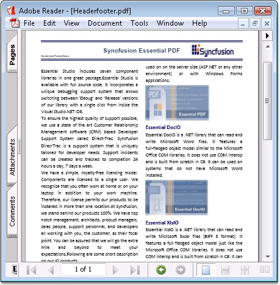

::: {style="DISPLAY: none"}
{#d2h_url_template}{#d2h_package_url style="WIDTH: 0px; DISPLAY: none; HEIGHT: 0px"}
:::

::: {.d2h_secondary_topic style="PADDING-BOTTOM: 10pt; MARGIN: 0pt; PADDING-LEFT: 0pt; PADDING-RIGHT: 0pt; PADDING-TOP: 0pt"}
#### Headers and Footers {#headers-and-footers style="tab-stops: 0pt"}

 

Headers and footers can be placed in the pages of your PDF document.

 

Follow the below procedure to place a header:

 

1.   Create a template object for the header. **PdfPageTemplateElement** class can be used for creating a template object.

2.   Assign the created template header to PDF document header.

 

The same procedure can be followed to create a footer. Page numbers on the footer of a document are set by using automatic fields.

 

You can dock the header or footer to any position.

 

The following code example illustrates how to create a Header and Footer.

 

+------------------------------------------------------------------------------------------------------------------------------------------------------------------------------------------------------+
| **[\[C#\]]{style="FONT-FAMILY: 'Courier New'"}**                                                                                                                                                     |
|                                                                                                                                                                                                      |
| **[]{style="FONT-FAMILY: 'Courier New'"}**                                                                                                                                                           |
|                                                                                                                                                                                                      |
| [//Create a header and draw the image.]{style="FONT-FAMILY: 'Courier New'; COLOR: green"}                                                                                                            |
|                                                                                                                                                                                                      |
| [RectangleF rect = [new]{style="COLOR: blue"} RectangleF(0, 0, doc.Pages\[0\].GetClientSize().Width, 50);]{style="FONT-FAMILY: 'Courier New'"}                                                       |
|                                                                                                                                                                                                      |
| [PdfPageTemplateElement header = [new]{style="COLOR: blue"} PdfPageTemplateElement(rect);]{style="FONT-FAMILY: 'Courier New'"}                                                                       |
|                                                                                                                                                                                                      |
| [PdfImage img = [new]{style="COLOR: blue"} PdfBitmap([@\"..\\..\\Data\\logo.png\"]{style="COLOR: maroon"});]{style="FONT-FAMILY: 'Courier New'"}                                                     |
|                                                                                                                                                                                                      |
| []{style="FONT-FAMILY: 'Courier New'"}                                                                                                                                                               |
|                                                                                                                                                                                                      |
| [//Draw the image in the Header.]{style="FONT-FAMILY: 'Courier New'; COLOR: green"}                                                                                                                  |
|                                                                                                                                                                                                      |
| [header.Graphics.DrawImage(img, imageLocation, imageSize);]{style="FONT-FAMILY: 'Courier New'"}                                                                                                      |
|                                                                                                                                                                                                      |
| []{style="FONT-FAMILY: 'Courier New'"}                                                                                                                                                               |
|                                                                                                                                                                                                      |
| [//Add the header at the top]{style="FONT-FAMILY: 'Courier New'; COLOR: green"}                                                                                                                      |
|                                                                                                                                                                                                      |
| [doc.Template.Top = header; ]{style="FONT-FAMILY: 'Courier New'"}                                                                                                                                    |
|                                                                                                                                                                                                      |
| []{style="FONT-FAMILY: 'Courier New'"}                                                                                                                                                               |
|                                                                                                                                                                                                      |
| [// Footer.]{style="FONT-FAMILY: 'Courier New'; COLOR: green"}                                                                                                                                       |
|                                                                                                                                                                                                      |
| [// Create a Template that can be used as a footer.]{style="FONT-FAMILY: 'Courier New'; COLOR: green"}                                                                                               |
|                                                                                                                                                                                                      |
| [//Create a page template]{style="FONT-FAMILY: 'Courier New'; COLOR: green"}                                                                                                                         |
|                                                                                                                                                                                                      |
| [PdfPageTemplateElement footer = [new]{style="COLOR: blue"} PdfPageTemplateElement(rect);]{style="FONT-FAMILY: 'Courier New'"}                                                                       |
|                                                                                                                                                                                                      |
| []{style="FONT-FAMILY: 'Courier New'"}                                                                                                                                                               |
|                                                                                                                                                                                                      |
| [//Create page number field]{style="FONT-FAMILY: 'Courier New'; COLOR: green"}                                                                                                                       |
|                                                                                                                                                                                                      |
| [PdfPageNumberField pageNumber = [new]{style="COLOR: blue"} PdfPageNumberField(font, brush);]{style="FONT-FAMILY: 'Courier New'"}                                                                    |
|                                                                                                                                                                                                      |
| []{style="FONT-FAMILY: 'Courier New'"}                                                                                                                                                               |
|                                                                                                                                                                                                      |
| [//Create page count field]{style="FONT-FAMILY: 'Courier New'; COLOR: green"}                                                                                                                        |
|                                                                                                                                                                                                      |
| [PdfPageCountField count = [new]{style="COLOR: blue"} PdfPageCountField(font, brush);]{style="FONT-FAMILY: 'Courier New'"}                                                                           |
|                                                                                                                                                                                                      |
| []{style="FONT-FAMILY: 'Courier New'"}                                                                                                                                                               |
|                                                                                                                                                                                                      |
| [//Add the fields in composite fields]{style="FONT-FAMILY: 'Courier New'; COLOR: green"}                                                                                                             |
|                                                                                                                                                                                                      |
| [PdfCompositeField compositeField = [new]{style="COLOR: blue"} PdfCompositeField(font, brush, [\"Page {0} of {1}\"]{style="COLOR: maroon"}, pageNumber, count);]{style="FONT-FAMILY: 'Courier New'"} |
|                                                                                                                                                                                                      |
| [compositeField.Bounds = footer.Bounds;]{style="FONT-FAMILY: 'Courier New'"}                                                                                                                         |
|                                                                                                                                                                                                      |
| []{style="FONT-FAMILY: 'Courier New'"}                                                                                                                                                               |
|                                                                                                                                                                                                      |
| [//Draw the composite field in footer]{style="FONT-FAMILY: 'Courier New'; COLOR: green"}                                                                                                             |
|                                                                                                                                                                                                      |
| [compositeField.Draw(footer.Graphics, [new]{style="COLOR: blue"} PointF(470, 40));]{style="FONT-FAMILY: 'Courier New'"}                                                                              |
|                                                                                                                                                                                                      |
| [           ]{style="FONT-FAMILY: 'Courier New'"}                                                                                                                                                    |
|                                                                                                                                                                                                      |
| [//Add the footer template at the bottom]{style="FONT-FAMILY: 'Courier New'; COLOR: green"}                                                                                                          |
|                                                                                                                                                                                                      |
| [doc.Template.Bottom = footer;]{style="FONT-FAMILY: 'Courier New'"}                                                                                                                                  |
+------------------------------------------------------------------------------------------------------------------------------------------------------------------------------------------------------+

[]{style="FONT-FAMILY: 'Trebuchet MS','sans-serif'; COLOR: #15428b; FONT-SIZE: 9pt"} 

+--------------------------------------------------------------------------------------------------------------------------------------------------------------------------------------------------------------------------------------------------------------------------------------+
| **[\[VB.NET\]]{style="FONT-FAMILY: 'Courier New'"}**                                                                                                                                                                                                                                 |
|                                                                                                                                                                                                                                                                                      |
| []{style="FONT-FAMILY: 'Courier New'"}                                                                                                                                                                                                                                               |
|                                                                                                                                                                                                                                                                                      |
| [\'Create a header and draw the image.]{style="FONT-FAMILY: 'Courier New'; COLOR: green"}                                                                                                                                                                                            |
|                                                                                                                                                                                                                                                                                      |
| [Dim]{style="FONT-FAMILY: 'Courier New'; COLOR: blue"}[ rect [As]{style="COLOR: blue"} RectangleF = [New]{style="COLOR: blue"} RectangleF(0, 0, doc.Pages(0).GetClientSize().Width, 50)]{style="FONT-FAMILY: 'Courier New'"}                                                         |
|                                                                                                                                                                                                                                                                                      |
| [Dim]{style="FONT-FAMILY: 'Courier New'; COLOR: blue"}[ header [As]{style="COLOR: blue"} PdfPageTemplateElement = [New]{style="COLOR: blue"} PdfPageTemplateElement(rect)]{style="FONT-FAMILY: 'Courier New'"}                                                                       |
|                                                                                                                                                                                                                                                                                      |
| [Dim]{style="FONT-FAMILY: 'Courier New'; COLOR: blue"}[ img [As]{style="COLOR: blue"} PdfImage = [New]{style="COLOR: blue"} PdfBitmap([\"..\\..\\Data\\logo.png\"]{style="COLOR: maroon"})]{style="FONT-FAMILY: 'Courier New'"}                                                      |
|                                                                                                                                                                                                                                                                                      |
| []{style="FONT-FAMILY: 'Courier New'"}                                                                                                                                                                                                                                               |
|                                                                                                                                                                                                                                                                                      |
| [\'Draw the image in the Header.]{style="FONT-FAMILY: 'Courier New'; COLOR: green"}                                                                                                                                                                                                  |
|                                                                                                                                                                                                                                                                                      |
| [header.Graphics.DrawImage(img, imageLocation, imageSize)]{style="FONT-FAMILY: 'Courier New'"}                                                                                                                                                                                       |
|                                                                                                                                                                                                                                                                                      |
| []{style="FONT-FAMILY: 'Courier New'"}                                                                                                                                                                                                                                               |
|                                                                                                                                                                                                                                                                                      |
| [\'Add the header at the top]{style="FONT-FAMILY: 'Courier New'; COLOR: green"}                                                                                                                                                                                                      |
|                                                                                                                                                                                                                                                                                      |
| [doc.Template.Top = header]{style="FONT-FAMILY: 'Courier New'"}                                                                                                                                                                                                                      |
|                                                                                                                                                                                                                                                                                      |
| []{style="FONT-FAMILY: 'Courier New'"}                                                                                                                                                                                                                                               |
|                                                                                                                                                                                                                                                                                      |
| [\' Footer.]{style="FONT-FAMILY: 'Courier New'; COLOR: green"}                                                                                                                                                                                                                       |
|                                                                                                                                                                                                                                                                                      |
| [\' Create a Template that can be used as a footer.]{style="FONT-FAMILY: 'Courier New'; COLOR: green"}                                                                                                                                                                               |
|                                                                                                                                                                                                                                                                                      |
| [\'Create a page template]{style="FONT-FAMILY: 'Courier New'; COLOR: green"}                                                                                                                                                                                                         |
|                                                                                                                                                                                                                                                                                      |
| [Dim]{style="FONT-FAMILY: 'Courier New'; COLOR: blue"}[ footer [As]{style="COLOR: blue"} PdfPageTemplateElement = [New]{style="COLOR: blue"} PdfPageTemplateElement(rect)]{style="FONT-FAMILY: 'Courier New'"}                                                                       |
|                                                                                                                                                                                                                                                                                      |
| []{style="FONT-FAMILY: 'Courier New'"}                                                                                                                                                                                                                                               |
|                                                                                                                                                                                                                                                                                      |
| [\'Create page number field]{style="FONT-FAMILY: 'Courier New'; COLOR: green"}                                                                                                                                                                                                       |
|                                                                                                                                                                                                                                                                                      |
| [Dim]{style="FONT-FAMILY: 'Courier New'; COLOR: blue"}[ pageNumber [As]{style="COLOR: blue"} PdfPageNumberField = [New]{style="COLOR: blue"} PdfPageNumberField(font, brush)]{style="FONT-FAMILY: 'Courier New'"}                                                                    |
|                                                                                                                                                                                                                                                                                      |
| []{style="FONT-FAMILY: 'Courier New'"}                                                                                                                                                                                                                                               |
|                                                                                                                                                                                                                                                                                      |
| [\'Create page count field]{style="FONT-FAMILY: 'Courier New'; COLOR: green"}                                                                                                                                                                                                        |
|                                                                                                                                                                                                                                                                                      |
| [Dim]{style="FONT-FAMILY: 'Courier New'; COLOR: blue"}[ count [As]{style="COLOR: blue"} PdfPageCountField = [New]{style="COLOR: blue"} PdfPageCountField(font, brush)]{style="FONT-FAMILY: 'Courier New'"}                                                                           |
|                                                                                                                                                                                                                                                                                      |
| []{style="FONT-FAMILY: 'Courier New'"}                                                                                                                                                                                                                                               |
|                                                                                                                                                                                                                                                                                      |
| [\'Add the fields in composite fields]{style="FONT-FAMILY: 'Courier New'; COLOR: green"}                                                                                                                                                                                             |
|                                                                                                                                                                                                                                                                                      |
| [Dim]{style="FONT-FAMILY: 'Courier New'; COLOR: blue"}[ compositeField [As]{style="COLOR: blue"} PdfCompositeField = [New]{style="COLOR: blue"} PdfCompositeField(font, brush, [\"Page {0} of {1}\"]{style="COLOR: maroon"}, pageNumber, count)]{style="FONT-FAMILY: 'Courier New'"} |
|                                                                                                                                                                                                                                                                                      |
| [compositeField.Bounds = footer.Bounds]{style="FONT-FAMILY: 'Courier New'"}                                                                                                                                                                                                          |
|                                                                                                                                                                                                                                                                                      |
| []{style="FONT-FAMILY: 'Courier New'"}                                                                                                                                                                                                                                               |
|                                                                                                                                                                                                                                                                                      |
| [\'Draw the composite field in footer]{style="FONT-FAMILY: 'Courier New'; COLOR: green"}                                                                                                                                                                                             |
|                                                                                                                                                                                                                                                                                      |
| [compositeField.Draw(footer.Graphics, [New]{style="COLOR: blue"} PointF(470, 40))]{style="FONT-FAMILY: 'Courier New'"}                                                                                                                                                               |
|                                                                                                                                                                                                                                                                                      |
| []{style="FONT-FAMILY: 'Courier New'"}                                                                                                                                                                                                                                               |
|                                                                                                                                                                                                                                                                                      |
| [\'Add the footer template at the bottom]{style="FONT-FAMILY: 'Courier New'; COLOR: green"}                                                                                                                                                                                          |
|                                                                                                                                                                                                                                                                                      |
| [doc.Template.Bottom = footer]{style="FONT-FAMILY: 'Courier New'"}                                                                                                                                                                                                                   |
+--------------------------------------------------------------------------------------------------------------------------------------------------------------------------------------------------------------------------------------------------------------------------------------+

[]{style="FONT-FAMILY: 'Trebuchet MS','sans-serif'; COLOR: #15428b; FONT-SIZE: 9pt"} 

{border="0"}

Figure 55: Header and Footer in PDF page

 

 

[]{#related-topics}
:::
