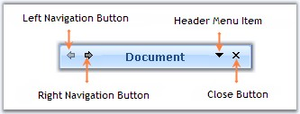
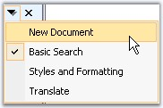

::: {style="DISPLAY: none"}
{#d2h_url_template}{#d2h_package_url style="WIDTH: 0px; DISPLAY: none; HEIGHT: 0px"}
:::

:::: {.d2h_secondary_topic style="PADDING-BOTTOM: 10pt; MARGIN: 0pt; PADDING-LEFT: 0pt; PADDING-RIGHT: 0pt; PADDING-TOP: 0pt"}
##### Header Settings {#header-settings style="MARGIN-LEFT: 18pt; tab-stops: 18.0pt"}

[]{style="FONT-SIZE: 8pt"} 

Setting Visibility of the ToolBar Items

[]{style="FONT-FAMILY: 'Verdana','sans-serif'; FONT-SIZE: 8pt"} 

The header section by default has four toolbar items. Left and right navigating buttons at the top left corner of the TaskPane Header and DropDownMenu and Close Button at the top right corner of the TaskPane Header.

[]{style="COLOR: #15428b"} 

{border="0"}

[]{style="COLOR: #15428b"} 

Figure 1260: Header Illustrated with Left and Right Toolbar Items

**[]{style="FONT-SIZE: 8pt"}** 

[·      ]{style="FONT-FAMILY: Symbol"}HeaderLeftToolbar.Items\[0\] - Indicates Left navigating button, lets you navigate to the previous page.

[·      ]{style="FONT-FAMILY: Symbol"}HeaderLeftToolbar.Items\[1\] - Indicates Right navigating button, lets you navigate to the next page.

[·      ]{style="FONT-FAMILY: Symbol"}HeaderRightToolbar.Items\[0\] - Indicates Header Menu Item which lists all the Task pages when clicked at run time.

[]{style="COLOR: #15428b"} 

[{border="0"}]{style="COLOR: #15428b"}[]{style="COLOR: #15428b"}

[]{style="COLOR: #15428b"} 

Figure 1261: TaskPages list displayed on clicking DropDownMenu Item

[]{style="COLOR: #15428b"} 

[·      ]{style="FONT-FAMILY: Symbol"}HeaderRightToolbar.Items\[1\] - Indicates Close button, using which we can close the Task Pane.

[]{style="COLOR: #15428b"} 

The visibility of these items can be controlled using the below code snippets.

[]{style="COLOR: #15428b"} 

+----------------------------------------------------------------------------------------------------------------------------------------------------------------------------------------------------------------------+
| **[\[C#\]]{style="FONT-FAMILY: 'Courier New'; COLOR: black"}**                                                                                                                                                       |
|                                                                                                                                                                                                                      |
| **[]{style="FONT-FAMILY: 'Courier New'; COLOR: black"}**                                                                                                                                                             |
|                                                                                                                                                                                                                      |
| [//Setting the visibility of the left navigating button at the top left corner]{style="FONT-FAMILY: 'Courier New'; COLOR: green"}                                                                                    |
|                                                                                                                                                                                                                      |
| [this]{style="FONT-FAMILY: 'Courier New'; COLOR: blue"}[.xpTaskPane1.HeaderLeftToolbar.Items\[0\].Visible = [true]{style="COLOR: blue"};]{style="FONT-FAMILY: 'Courier New'"}                                        |
|                                                                                                                                                                                                                      |
| [//Setting the visibility of the Right navigating button at the top left corner]{style="FONT-FAMILY: 'Courier New'; COLOR: green"}                                                                                   |
|                                                                                                                                                                                                                      |
| [this]{style="FONT-FAMILY: 'Courier New'; COLOR: blue"}[.xpTaskPane1.HeaderLeftToolbar.Items\[1\].Visible = [true]{style="COLOR: blue"};]{style="FONT-FAMILY: 'Courier New'"}                                        |
|                                                                                                                                                                                                                      |
| []{style="FONT-FAMILY: 'Courier New'; COLOR: green"}                                                                                                                                                                 |
|                                                                                                                                                                                                                      |
| [//Setting the visibility of the header menu item at the top right corner]{style="FONT-FAMILY: 'Courier New'; COLOR: green"}                                                                                         |
|                                                                                                                                                                                                                      |
| [this]{style="FONT-FAMILY: 'Courier New'; COLOR: blue"}[.xpTaskPane1.HeaderRightToolbar.Items\[0\].Visible = [true]{style="COLOR: blue"};]{style="FONT-FAMILY: 'Courier New'"}                                       |
|                                                                                                                                                                                                                      |
| [//Setting the visibility of the close button item at the top right corner]{style="FONT-FAMILY: 'Courier New'; COLOR: green"}                                                                                        |
|                                                                                                                                                                                                                      |
| [this]{style="FONT-FAMILY: 'Courier New'; COLOR: blue"}[.xpTaskPane1.HeaderRightToolbar.Items\[1\].Visible = [true]{style="COLOR: blue"};]{style="FONT-FAMILY: 'Courier New'"}[]{style="FONT-FAMILY: 'Courier New'"} |
+----------------------------------------------------------------------------------------------------------------------------------------------------------------------------------------------------------------------+

[]{#p1080}[]{style="COLOR: #15428b"} 

+--------------------------------------------------------------------------------------------------------------------------------------------------------------------------------------------------------------------------------+
| **[\[VB.NET\]]{style="FONT-FAMILY: 'Courier New'; COLOR: black"}**                                                                                                                                                             |
|                                                                                                                                                                                                                                |
| **[]{style="FONT-FAMILY: 'Courier New'; COLOR: black"}**                                                                                                                                                                       |
|                                                                                                                                                                                                                                |
| [\'Setting the visibility of the left navigating button at the top left corner]{style="FONT-FAMILY: 'Courier New'; COLOR: green"}                                                                                              |
|                                                                                                                                                                                                                                |
| [Me]{style="FONT-FAMILY: 'Courier New'; COLOR: blue"}[.xpTaskPane1.HeaderLeftToolbar.Items\[0\].Visible = [True]{style="COLOR: blue"}]{style="FONT-FAMILY: 'Courier New'"}                                                     |
|                                                                                                                                                                                                                                |
| [\'Setting the visibility of the Right navigating button at the top left corner]{style="FONT-FAMILY: 'Courier New'; COLOR: green"}                                                                                             |
|                                                                                                                                                                                                                                |
| [Me]{style="FONT-FAMILY: 'Courier New'; COLOR: blue"}[.xpTaskPane1.HeaderLeftToolbar.Items\[1\].Visible = [True]{style="COLOR: blue"}]{style="FONT-FAMILY: 'Courier New'"}                                                     |
|                                                                                                                                                                                                                                |
| []{style="FONT-FAMILY: 'Courier New'; COLOR: green"}                                                                                                                                                                           |
|                                                                                                                                                                                                                                |
| [\'Setting the visibility of the header menu item at the top right corner]{style="FONT-FAMILY: 'Courier New'; COLOR: green"}                                                                                                   |
|                                                                                                                                                                                                                                |
| [Me]{style="FONT-FAMILY: 'Courier New'; COLOR: blue"}[.xpTaskPane1.HeaderRightToolbar.Items\[0\].Visible = [True]{style="COLOR: blue"}]{style="FONT-FAMILY: 'Courier New'"}                                                    |
|                                                                                                                                                                                                                                |
| [\'Setting the visibility of the close button item at the top right corner]{style="FONT-FAMILY: 'Courier New'; COLOR: green"}                                                                                                  |
|                                                                                                                                                                                                                                |
| [Me]{style="FONT-FAMILY: 'Courier New'; COLOR: blue"}[.xpTaskPane1.HeaderRightToolbar.Items\[1\].Visible = [True]{style="COLOR: blue"}]{style="FONT-FAMILY: 'Courier New'"}[]{style="FONT-FAMILY: 'Courier New'; COLOR: blue"} |
+--------------------------------------------------------------------------------------------------------------------------------------------------------------------------------------------------------------------------------+

[]{style="COLOR: #15428b"} 

Images for Toolbar items

[]{style="COLOR: #15428b"} 

We can change the existing image for the toolbar items using the below code snippets.[]{#p1081}

[]{style="COLOR: #15428b"} 

+----------------------------------------------------------------------------------------------------------------------------------------------------------------------------------------------+
| **[\[C#\]]{style="FONT-FAMILY: 'Courier New'; COLOR: black"}**                                                                                                                               |
|                                                                                                                                                                                              |
| **[]{style="FONT-FAMILY: 'Courier New'; COLOR: black"}**                                                                                                                                     |
|                                                                                                                                                                                              |
| [//Setting Image for the right navigating button]{style="FONT-FAMILY: 'Courier New'; COLOR: green"}                                                                                          |
|                                                                                                                                                                                              |
| [this]{style="FONT-FAMILY: 'Courier New'; COLOR: blue"}[.xpTaskPane1.HeaderLeftToolbar.Items\[1\].ImageList = [this]{style="COLOR: blue"}.imageList1;]{style="FONT-FAMILY: 'Courier New'"}   |
|                                                                                                                                                                                              |
| [this]{style="FONT-FAMILY: 'Courier New'; COLOR: blue"}[.xpTaskPane1.HeaderLeftToolbar.Items\[1\].ImageIndex = 0;]{style="FONT-FAMILY: 'Courier New'"}                                       |
|                                                                                                                                                                                              |
| []{style="FONT-FAMILY: 'Courier New'"}                                                                                                                                                       |
|                                                                                                                                                                                              |
| [//Setting Image for the left navigating button]{style="FONT-FAMILY: 'Courier New'; COLOR: green"}                                                                                           |
|                                                                                                                                                                                              |
| [this]{style="FONT-FAMILY: 'Courier New'; COLOR: blue"}[.xpTaskPane1.HeaderLeftToolbar.Items\[0\].ImageList = [this]{style="COLOR: blue"}.imageList1;]{style="FONT-FAMILY: 'Courier New'"}   |
|                                                                                                                                                                                              |
| [this]{style="FONT-FAMILY: 'Courier New'; COLOR: blue"}[.xpTaskPane1.HeaderLeftToolbar.Items\[0\].ImageIndex = 1;]{style="FONT-FAMILY: 'Courier New'"}[]{style="FONT-FAMILY: 'Courier New'"} |
+----------------------------------------------------------------------------------------------------------------------------------------------------------------------------------------------+

[]{style="COLOR: #15428b"} 

+-------------------------------------------------------------------------------------------------------------------------------------------------------------------------------------------------------------+
| **[\[VB.NET\]]{style="FONT-FAMILY: 'Courier New'; COLOR: black"}**                                                                                                                                          |
|                                                                                                                                                                                                             |
| **[]{style="FONT-FAMILY: 'Courier New'; COLOR: black"}**                                                                                                                                                    |
|                                                                                                                                                                                                             |
| [\'Setting Image for]{style="FONT-FAMILY: 'Courier New'; COLOR: green"}[ the ]{style="FONT-FAMILY: 'Courier New'; COLOR: green"}[right navigating button]{style="FONT-FAMILY: 'Courier New'; COLOR: green"} |
|                                                                                                                                                                                                             |
| [Me]{style="FONT-FAMILY: 'Courier New'; COLOR: blue"}[.xpTaskPane1.HeaderLeftToolbar.Items\[1\].ImageList = [Me]{style="COLOR: blue"}.imageList1]{style="FONT-FAMILY: 'Courier New'"}                       |
|                                                                                                                                                                                                             |
| [Me]{style="FONT-FAMILY: 'Courier New'; COLOR: blue"}[.xpTaskPane1.HeaderLeftToolbar.Items\[1\].ImageIndex = 0]{style="FONT-FAMILY: 'Courier New'"}                                                         |
|                                                                                                                                                                                                             |
| []{style="FONT-FAMILY: 'Courier New'"}                                                                                                                                                                      |
|                                                                                                                                                                                                             |
| [\'Setting Image]{style="FONT-FAMILY: 'Courier New'; COLOR: green"}[ for the ]{style="FONT-FAMILY: 'Courier New'; COLOR: green"}[left navigating button]{style="FONT-FAMILY: 'Courier New'; COLOR: green"}  |
|                                                                                                                                                                                                             |
| [Me]{style="FONT-FAMILY: 'Courier New'; COLOR: blue"}[.xpTaskPane1.HeaderLeftToolbar.Items\[0\].ImageList = [Me]{style="COLOR: blue"}.imageList1]{style="FONT-FAMILY: 'Courier New'"}                       |
|                                                                                                                                                                                                             |
| [Me]{style="FONT-FAMILY: 'Courier New'; COLOR: blue"}[.xpTaskPane1.HeaderLeftToolbar.Items\[0\].ImageIndex = 1]{style="FONT-FAMILY: 'Courier New'"}[]{style="FONT-FAMILY: 'Courier New'"}                   |
+-------------------------------------------------------------------------------------------------------------------------------------------------------------------------------------------------------------+

[]{style="COLOR: #15428b"} 

{border="0"}

[]{style="COLOR: #15428b"} 

Figure 1262: Images set for Navigation Buttons using HeaderLeftToolbar Property

[]{style="COLOR: #15428b"} 

Customizing Header Menu Item Image

 

The Header Menu Item image can be changed through ImageIndex property which lists a set of pre-defined images, else set the Image property to the custom image you want to set for the dropdown image.

[]{style="COLOR: #15428b"} 

::: {align="center"}
  --------------------------- ------------------------------------------------------------------------
  Property                    Description
  HeaderMenuItem.ImageIndex   Specifies index of the image to be displayed in the DropDownMenu item.
  HeaderMenuItem.Image        Sets the image to be displayed in DropDownMenu item.
  --------------------------- ------------------------------------------------------------------------
:::

[]{style="COLOR: #15428b"} 

+------------------------------------------------------------------------------------------------------------------------------------------+
| **[\[C#\]]{style="FONT-FAMILY: 'Courier New'; COLOR: black"}**                                                                           |
|                                                                                                                                          |
| **[]{style="FONT-FAMILY: 'Courier New'; COLOR: black"}**                                                                                 |
|                                                                                                                                          |
| [//Setting Image for the DropDownMenu item]{style="FONT-FAMILY: 'Courier New'; COLOR: green"}                                            |
|                                                                                                                                          |
| [this]{style="FONT-FAMILY: 'Courier New'; COLOR: blue"}[.xpTaskPane1.HeaderMenuItem.ImageIndex = 1;]{style="FONT-FAMILY: 'Courier New'"} |
+------------------------------------------------------------------------------------------------------------------------------------------+

[]{style="COLOR: #15428b"} 

+---------------------------------------------------------------------------------------------------------------------------------------+
| **[\[VB.NET\]]{style="FONT-FAMILY: 'Courier New'; COLOR: black"}**                                                                    |
|                                                                                                                                       |
| **[]{style="FONT-FAMILY: 'Courier New'; COLOR: black"}**                                                                              |
|                                                                                                                                       |
| [\'Setting Image for the DropDownMenu item]{style="FONT-FAMILY: 'Courier New'; COLOR: green"}                                         |
|                                                                                                                                       |
| [Me]{style="FONT-FAMILY: 'Courier New'; COLOR: blue"}[.xpTaskPane1.HeaderMenuItem.ImageIndex = 1]{style="FONT-FAMILY: 'Courier New'"} |
+---------------------------------------------------------------------------------------------------------------------------------------+

[]{style="COLOR: #15428b"} 

{border="0"}

[]{style="COLOR: #15428b"} 

Figure 1263: Default DropDownMenu Image Changed to \"Arrow\" Icon

 

 

 

 

[]{#related-topics}
::::
