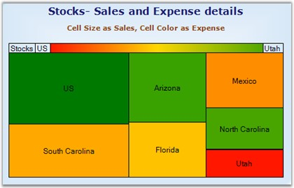

::: {style="DISPLAY: none"}
{#d2h_url_template}{#d2h_package_url style="WIDTH: 0px; DISPLAY: none; HEIGHT: 0px"}
:::

::::: {#nsbanner .d2h_main_nsbanner style="BORDER-BOTTOM: #999999 1px solid; POSITION: relative; PADDING-BOTTOM: 0px; BACKGROUND-COLOR: transparent; PADDING-LEFT: 0px; PADDING-RIGHT: 0px; DISPLAY: none; BORDER-TOP: #999999 1px solid; PADDING-TOP: 0px; LEFT: 0px"}
:::: {#TitleRow .d2h_main_titlerow style="PADDING-BOTTOM: 4px; BACKGROUND-COLOR: transparent; PADDING-LEFT: 22px; WIDTH: 100%; PADDING-RIGHT: 10px; DISPLAY: none; PADDING-TOP: 4px"}
::: {#ienav .d2h_main_ienav style="DISPLAY: none"}
{#D2HPrevious .D2HPreviousEnabled}  {#D2HNext .D2HNextEnabled}
:::
::::
:::::

:::::: {#nstext .d2h_main_nstext style="PADDING-BOTTOM: 10px; BACKGROUND-COLOR: transparent; PADDING-LEFT: 22px; PADDING-RIGHT: 10px; HEIGHT: 100%; OVERFLOW: auto; PADDING-TOP: 5px" hasuserbackground="true" valign="bottom"}
::: {#d2h_breadcrumbs .d2h_breadcrumbs}
[Essential Studio User Guide Documentation](ms-xhelp:///?Id=12457748-09e3-4d74-a240-8e049cedf030){.d2h_breadcrumbsNormal}[ \> ]{.d2h_breadcrumbsLinkSeparator}[User Interface Edition](ms-xhelp:///?Id=c29296b7-531c-413b-a0ec-488ca1f7f669){.d2h_breadcrumbsNormal}[ \> ]{.d2h_breadcrumbsLinkSeparator}[Essential Windows](ms-xhelp:///?Id=e60759d8-47a4-4570-9d7a-16a68d63f2ea){.d2h_breadcrumbsNormal}[ \> ]{.d2h_breadcrumbsLinkSeparator}[Essential Chart]{.d2h_breadcrumbsContentsOnly}[ \> ]{.d2h_breadcrumbsLinkSeparator}[Concepts and Features](ms-xhelp:///?Id=71321e9c-336c-4c1c-a127-be9f135ad4bb){.d2h_breadcrumbsNormal}[ \> ]{.d2h_breadcrumbsLinkSeparator}[Chart Types](ms-xhelp:///?Id=cf461556-638d-4482-bf48-b839cfdbac14){.d2h_breadcrumbsNormal}
:::

### Heat Map Charts {#heat-map-charts style="tab-stops: 0pt"}

 

A heat map chart is a graphical representation of data where the values taken by a variable in two-dimensional map are represented as colors.

 

{border="0"}

 

Figure 87: Chart displaying Heat Map Series

 

**Chart Details**

 

::: {align="center"}
+----------------------------------+------------------------+
| Details                                                   |
+----------------------------------+------------------------+
| **Number of Y values per point** | 2                      |
+----------------------------------+------------------------+
| **Number of Series         **    | One.                   |
+----------------------------------+------------------------+
| **Cannot be Combined with   **   | Any other chart types. |
+----------------------------------+------------------------+
:::

 

Combination series can be added to the chart using the following code.

 

+---------------------------------------------------------------------------------------------------------------------------------------------------------------------------------------------------------------------------------------------+
| **[\[C#\]]{style="FONT-FAMILY: 'Courier New'; COLOR: black"}**                                                                                                                                                                              |
|                                                                                                                                                                                                                                             |
| []{style="COLOR: black"}                                                                                                                                                                                                                    |
|                                                                                                                                                                                                                                             |
| [ChartSeries]{style="FONT-FAMILY: 'Courier New'; COLOR: teal"}[ Stocks = [new]{style="COLOR: blue"} [ChartSeries]{style="COLOR: teal"}([\"Stocks\"]{style="COLOR: #a31515"}, ChartSeriesType.HeatMap);]{style="FONT-FAMILY: 'Courier New'"} |
|                                                                                                                                                                                                                                             |
| [Stocks.Points.Add(7,4, 10000);]{style="FONT-FAMILY: 'Courier New'"}                                                                                                                                                                        |
|                                                                                                                                                                                                                                             |
| [Stocks.Points.Add(6,3, 5541);]{style="FONT-FAMILY: 'Courier New'"}                                                                                                                                                                         |
|                                                                                                                                                                                                                                             |
| [Stocks.Points.Add(5,2, 6007);]{style="FONT-FAMILY: 'Courier New'"}                                                                                                                                                                         |
|                                                                                                                                                                                                                                             |
| [Stocks.Points.Add(4,2, 5022);]{style="FONT-FAMILY: 'Courier New'"}                                                                                                                                                                         |
|                                                                                                                                                                                                                                             |
| [Stocks.Points.Add(3,2.5, 6882);]{style="FONT-FAMILY: 'Courier New'"}                                                                                                                                                                       |
|                                                                                                                                                                                                                                             |
| [Stocks.Points.Add(2,1.5, 6584);]{style="FONT-FAMILY: 'Courier New'"}                                                                                                                                                                       |
|                                                                                                                                                                                                                                             |
| [Stocks.Points.Add(1,1, 2799);]{style="FONT-FAMILY: 'Courier New'"}                                                                                                                                                                         |
|                                                                                                                                                                                                                                             |
| [this]{style="FONT-FAMILY: 'Courier New'; COLOR: blue"}[.chartControl1.Series.Add(Stocks);]{style="FONT-FAMILY: 'Courier New'"}                                                                                                             |
+---------------------------------------------------------------------------------------------------------------------------------------------------------------------------------------------------------------------------------------------+

 

+----------------------------------------------------------------------------------------------------------------------------------------------------------------------------------------------------------------------------------------------------------------------------------------------------------------------------------------------------------------------------------------------+
| **[\[VB.NET\]]{style="FONT-FAMILY: 'Courier New'; COLOR: black"}**                                                                                                                                                                                                                                                                                                                           |
|                                                                                                                                                                                                                                                                                                                                                                                              |
| []{style="COLOR: black; FONT-SIZE: 12pt"}                                                                                                                                                                                                                                                                                                                                                    |
|                                                                                                                                                                                                                                                                                                                                                                                              |
| [Dim]{style="FONT-FAMILY: 'Courier New'; COLOR: blue"}[ ]{style="FONT-FAMILY: 'Courier New'; COLOR: black"}[Stocks[ As]{style="COLOR: blue"}[ ChartSeries = ]{style="COLOR: black"}[Me]{style="COLOR: blue"}[.chartControl1.Model.NewSeries (]{style="COLOR: black"}[\"Stocks\"]{style="COLOR: #a31515"}[, ChartSeriesType.Line)]{style="COLOR: black"}]{style="FONT-FAMILY: 'Courier New'"} |
|                                                                                                                                                                                                                                                                                                                                                                                              |
| [Stocks.Points.Add(7,4, 10000)]{style="FONT-FAMILY: 'Courier New'"}                                                                                                                                                                                                                                                                                                                          |
|                                                                                                                                                                                                                                                                                                                                                                                              |
| [Stocks.Points.Add(6,3, 5541)]{style="FONT-FAMILY: 'Courier New'"}                                                                                                                                                                                                                                                                                                                           |
|                                                                                                                                                                                                                                                                                                                                                                                              |
| [Stocks.Points.Add(5,2, 6007)]{style="FONT-FAMILY: 'Courier New'"}                                                                                                                                                                                                                                                                                                                           |
|                                                                                                                                                                                                                                                                                                                                                                                              |
| [Stocks.Points.Add(4,2, 5022)]{style="FONT-FAMILY: 'Courier New'"}                                                                                                                                                                                                                                                                                                                           |
|                                                                                                                                                                                                                                                                                                                                                                                              |
| [Stocks.Points.Add(3,2.5, 6882)]{style="FONT-FAMILY: 'Courier New'"}                                                                                                                                                                                                                                                                                                                         |
|                                                                                                                                                                                                                                                                                                                                                                                              |
| [Stocks.Points.Add(2,1.5, 6584)]{style="FONT-FAMILY: 'Courier New'"}                                                                                                                                                                                                                                                                                                                         |
|                                                                                                                                                                                                                                                                                                                                                                                              |
| [Stocks.Points.Add(1,1, 2799)]{style="FONT-FAMILY: 'Courier New'"}                                                                                                                                                                                                                                                                                                                           |
|                                                                                                                                                                                                                                                                                                                                                                                              |
| []{style="FONT-FAMILY: 'Courier New'; COLOR: black"}                                                                                                                                                                                                                                                                                                                                         |
|                                                                                                                                                                                                                                                                                                                                                                                              |
| [\' Add the series to the chart series collection.]{style="FONT-FAMILY: 'Courier New'; COLOR: green"}                                                                                                                                                                                                                                                                                        |
|                                                                                                                                                                                                                                                                                                                                                                                              |
| [Me]{style="FONT-FAMILY: 'Courier New'; COLOR: blue"}[.chartControl1.Series.Add (Stocks)]{style="FONT-FAMILY: 'Courier New'; COLOR: black"}                                                                                                                                                                                                                                                  |
+----------------------------------------------------------------------------------------------------------------------------------------------------------------------------------------------------------------------------------------------------------------------------------------------------------------------------------------------------------------------------------------------+

 

Features

 

The following table lists the properties of heat map chart with descriptions.

 

::: {align="center"}
  -------------------- -------------------------------------------------------------------------------------------
  Property             Description
  HeatMapStyle         Specifies styles of heat maps. The types are Rectangular, Vertical and Horizontal styles.
  DisplayColorSwatch   Enables the color swatch of the heat map.
  DisplayTitle         Enables or disables the series title in the left corner of the swatch.
  StartText            Sets the text for the left label in the color swatch.
  EndText              Sets the text for the right label in the color swatch.
  LowestValueColor     Sets the lowest value color of the heat map chart.
  HighestValueColor    Sets the highest value color of the heat map chart.
  MiddleValueColor     Sets the middle value color of the heat map chart.
  LabelMargin          Sets the margin for the left and right side labels.
  -------------------- -------------------------------------------------------------------------------------------
:::

 

+------------------------------------------------------------------------------------------------------------------------------------------------------------------------------------------------------------+
| **[\[C#\]]{style="FONT-FAMILY: 'Courier New'; COLOR: black"}**                                                                                                                                             |
|                                                                                                                                                                                                            |
| []{style="COLOR: black"}                                                                                                                                                                                   |
|                                                                                                                                                                                                            |
| [//Sets the Heat map style.]{style="FONT-FAMILY: 'Courier New'; COLOR: green"}                                                                                                                             |
|                                                                                                                                                                                                            |
| [this]{style="FONT-FAMILY: 'Courier New'; COLOR: blue"}[.chartControl1.Series\[0\].ConfigItems.HeatMapItem.HeatMapStyle = ChartHeatMapLayoutStyle.Rectangular;]{style="FONT-FAMILY: 'Courier New'"}        |
|                                                                                                                                                                                                            |
| [//Display color swatch.]{style="FONT-FAMILY: 'Courier New'; COLOR: green"}                                                                                                                                |
|                                                                                                                                                                                                            |
| [this]{style="FONT-FAMILY: 'Courier New'; COLOR: blue"}[.chartControl1.Series\[0\].ConfigItems.HeatMapItem.DisplayColorSwatch = [true]{style="COLOR: blue"};]{style="FONT-FAMILY: 'Courier New'"}          |
|                                                                                                                                                                                                            |
| [//Sets the Series Title.]{style="FONT-FAMILY: 'Courier New'; COLOR: green"}                                                                                                                               |
|                                                                                                                                                                                                            |
| [this]{style="FONT-FAMILY: 'Courier New'; COLOR: blue"}[.chartControl1.Series\[0\].ConfigItems.HeatMapItem.DisplayTitle = [true]{style="COLOR: blue"};]{style="FONT-FAMILY: 'Courier New'"}                |
|                                                                                                                                                                                                            |
| [//Sets the left and right label text.]{style="FONT-FAMILY: 'Courier New'; COLOR: green"}                                                                                                                  |
|                                                                                                                                                                                                            |
| [this]{style="FONT-FAMILY: 'Courier New'; COLOR: blue"}[.chartControl1.Series\[0\].ConfigItems.HeatMapItem.StartText = [\"US\"]{style="COLOR: #a31515"};]{style="FONT-FAMILY: 'Courier New'"}              |
|                                                                                                                                                                                                            |
| [this]{style="FONT-FAMILY: 'Courier New'; COLOR: blue"}[.chartControl1.Series\[0\].ConfigItems.HeatMapItem.EndText = [\"Utah\"]{style="COLOR: #a31515"};]{style="FONT-FAMILY: 'Courier New'"}              |
|                                                                                                                                                                                                            |
| [//Sets the lowest, highest and middle value color.]{style="FONT-FAMILY: 'Courier New'; COLOR: green"}                                                                                                     |
|                                                                                                                                                                                                            |
| [this]{style="FONT-FAMILY: 'Courier New'; COLOR: blue"}[.chartControl1.Series\[0\].ConfigItems.HeatMapItem.LowestValueColor = [Color]{style="COLOR: #2b91af"}.Red;]{style="FONT-FAMILY: 'Courier New'"}    |
|                                                                                                                                                                                                            |
| [this]{style="FONT-FAMILY: 'Courier New'; COLOR: blue"}[.chartControl1.Series\[0\].ConfigItems.HeatMapItem.HighestValueColor = [Color]{style="COLOR: #2b91af"}.Blue;]{style="FONT-FAMILY: 'Courier New'"}  |
|                                                                                                                                                                                                            |
| [this]{style="FONT-FAMILY: 'Courier New'; COLOR: blue"}[.chartControl1.Series\[0\].ConfigItems.HeatMapItem.MiddleValueColor = [Color]{style="COLOR: #2b91af"}.Yellow;]{style="FONT-FAMILY: 'Courier New'"} |
|                                                                                                                                                                                                            |
| [//Sets the value for label margin.]{style="FONT-FAMILY: 'Courier New'; COLOR: green"}                                                                                                                     |
|                                                                                                                                                                                                            |
| [this]{style="FONT-FAMILY: 'Courier New'; COLOR: blue"}[.chartControl1.Series\[0\].ConfigItems.HeatMapItem.LabelMargins = 15;]{style="FONT-FAMILY: 'Courier New'"}                                         |
+------------------------------------------------------------------------------------------------------------------------------------------------------------------------------------------------------------+

 

+-----------------------------------------------------------------------------------------------------------------------------------------------------------------------------------------------+
| **[\[VB.NET\]]{style="FONT-FAMILY: 'Courier New'; COLOR: black"}**                                                                                                                            |
|                                                                                                                                                                                               |
| []{style="COLOR: black; FONT-SIZE: 12pt"}                                                                                                                                                     |
|                                                                                                                                                                                               |
| [\'Sets the Heat map style.]{style="FONT-FAMILY: 'Courier New'; COLOR: green"}                                                                                                                |
|                                                                                                                                                                                               |
| [Me]{style="FONT-FAMILY: 'Courier New'; COLOR: blue"}[.chartControl1.Series(0).ConfigItems.HeatMapItem.HeatMapStyle =ChartHeatMapLayoutStyle.Rectangular]{style="FONT-FAMILY: 'Courier New'"} |
|                                                                                                                                                                                               |
| [\'Display color swatch.  ]{style="FONT-FAMILY: 'Courier New'; COLOR: green"}                                                                                                                 |
|                                                                                                                                                                                               |
| [Me]{style="FONT-FAMILY: 'Courier New'; COLOR: blue"}[.chartControl1.Series(0).ConfigItems.HeatMapItem.DisplayColorSwatch = [True]{style="COLOR: blue"}]{style="FONT-FAMILY: 'Courier New'"}  |
|                                                                                                                                                                                               |
| [\'Sets the display title.      ]{style="FONT-FAMILY: 'Courier New'; COLOR: green"}                                                                                                           |
|                                                                                                                                                                                               |
| [Me]{style="FONT-FAMILY: 'Courier New'; COLOR: blue"}[.chartControl1.Series(0).ConfigItems.HeatMapItem.DisplayTitle = [True]{style="COLOR: blue"}]{style="FONT-FAMILY: 'Courier New'"}        |
|                                                                                                                                                                                               |
| [\'Sets the start and end text.]{style="FONT-FAMILY: 'Courier New'; COLOR: green"}                                                                                                            |
|                                                                                                                                                                                               |
| [series.ConfigItems.HeatMapItem.StartText = [\"US\"]{style="COLOR: maroon"}            ]{style="FONT-FAMILY: 'Courier New'"}                                                                  |
|                                                                                                                                                                                               |
| [series.ConfigItems.HeatMapItem.EndText = [\"Utah\"]{style="COLOR: maroon"}]{style="FONT-FAMILY: 'Courier New'"}                                                                              |
|                                                                                                                                                                                               |
| [\'Sets the lowest, highest and middle value color.]{style="FONT-FAMILY: 'Courier New'; COLOR: green"}                                                                                        |
|                                                                                                                                                                                               |
| [series.ConfigItems.HeatMapItem.LowestValueColor = Color.FromArgb(255, 23, 0)]{style="FONT-FAMILY: 'Courier New'"}                                                                            |
|                                                                                                                                                                                               |
| [series.ConfigItems.HeatMapItem.HighestValueColor = Color.FromArgb(81, 168, 0)]{style="FONT-FAMILY: 'Courier New'"}                                                                           |
|                                                                                                                                                                                               |
| [series.ConfigItems.HeatMapItem.MiddleValueColor = Color.Gold]{style="FONT-FAMILY: 'Courier New'"}                                                                                            |
|                                                                                                                                                                                               |
| [\'Sets the margin for the left and right labels.]{style="FONT-FAMILY: 'Courier New'; COLOR: green"}                                                                                          |
|                                                                                                                                                                                               |
| [series.ConfigItems.HeatMapItem.LabelMargins = 15]{style="FONT-FAMILY: 'Courier New'"}                                                                                                        |
+-----------------------------------------------------------------------------------------------------------------------------------------------------------------------------------------------+

[]{#p73} 

 

[]{#related-topics}
::::::
