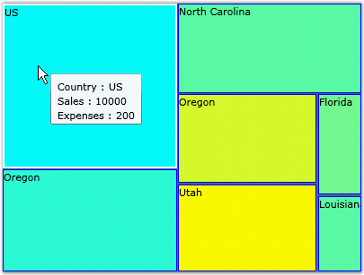

::: {style="DISPLAY: none"}
{#d2h_url_template}{#d2h_package_url style="WIDTH: 0px; DISPLAY: none; HEIGHT: 0px"}
:::

::::: {#nsbanner .d2h_main_nsbanner style="BORDER-BOTTOM: #999999 1px solid; POSITION: relative; PADDING-BOTTOM: 0px; BACKGROUND-COLOR: transparent; PADDING-LEFT: 0px; PADDING-RIGHT: 0px; DISPLAY: none; BORDER-TOP: #999999 1px solid; PADDING-TOP: 0px; LEFT: 0px"}
:::: {#TitleRow .d2h_main_titlerow style="PADDING-BOTTOM: 4px; BACKGROUND-COLOR: transparent; PADDING-LEFT: 22px; WIDTH: 100%; PADDING-RIGHT: 10px; DISPLAY: none; PADDING-TOP: 4px"}
::: {#ienav .d2h_main_ienav style="DISPLAY: none"}
{#D2HPrevious .D2HPreviousEnabled}  {#D2HNext .D2HNextEnabled}
:::
::::
:::::

:::: {#nstext .d2h_main_nstext style="PADDING-BOTTOM: 10px; BACKGROUND-COLOR: transparent; PADDING-LEFT: 22px; PADDING-RIGHT: 10px; HEIGHT: 100%; OVERFLOW: auto; PADDING-TOP: 5px" hasuserbackground="true" valign="bottom"}
::: {#d2h_breadcrumbs .d2h_breadcrumbs}
[Essential Studio User Guide Documentation](ms-xhelp:///?Id=12457748-09e3-4d74-a240-8e049cedf030){.d2h_breadcrumbsNormal}[ \> ]{.d2h_breadcrumbsLinkSeparator}[User Interface Edition](ms-xhelp:///?Id=c29296b7-531c-413b-a0ec-488ca1f7f669){.d2h_breadcrumbsNormal}[ \> ]{.d2h_breadcrumbsLinkSeparator}[Essential Silverlight](ms-xhelp:///?Id=66221bd1-ba2e-43c2-94a7-618f50e01d24){.d2h_breadcrumbsNormal}[ \> ]{.d2h_breadcrumbsLinkSeparator}[Essential Chart]{.d2h_breadcrumbsContentsOnly}[ \> ]{.d2h_breadcrumbsLinkSeparator}[Concepts and Features](ms-xhelp:///?Id=0f820843-9cdd-4436-8cae-3dc5a65fd5cd){.d2h_breadcrumbsNormal}
:::

## HeatMap Control {#heatmap-control style="tab-stops: 0pt"}

 

 A Heat Map is a graphical representation of data where the values taken by a variable in a two-dimensional map are represented as Colors. The HeatMap control lets you visualize, using color and cell size, two measurements of your choice, from items in a data source.

 

The first measurement, referred to as \"Weight\" of each item, is used to arrive upon the cell size of the corresponding cell. The cells are then arranged in the descending order of their size. This lets you quickly visualize, for example, the divisions that are generating most profits in your company.

 

The second measurement, referred to as \"ColorWeight\" of each item, is used to determine the background color of the corresponding cell. You can use this to visualize, for example, the profit per employee for each division. You can assign a \"hot color\" for the best performing division, and a \"cold color\" for the worst performing division. And also a \"median color\" for the median value. The resulting range of colors will be used to determine the background color for each cell.

 

 

{border="0"}

Figure 54: HeatMap Control

 

Feature Summary

 

Here are some key features supported by the HeatMap control.

 

Data Source Support

 

Ability to visualize two measurements of items in your data source - by cell size and color.

 

Binding Support

 

Ability to bind to business objects, XML data.

 

Templates Support

 

Customize the appearance of items using templates. Add tooltips, descriptive text, and so on, to cells via templates.

 

Color Customization

 

Specify any custom color range for the cell background.

More:

[ ]{#related-topics}

[{border="0" align="absMiddle"}Getting Started](ms-xhelp:///?Id=3558ee04-360b-465c-a421-f1798aefea5b){style="TEXT-DECORATION: none"}

[{border="0" align="absMiddle"}Concepts and Features](ms-xhelp:///?Id=d2a3756b-583d-41e9-9c17-019eb50aa6d0){style="TEXT-DECORATION: none"}
::::
