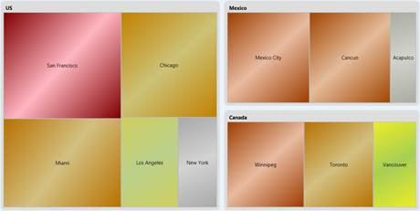
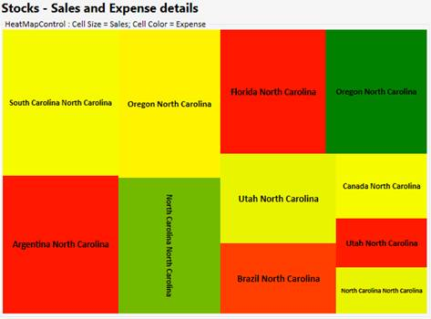
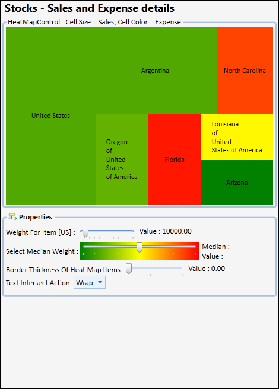
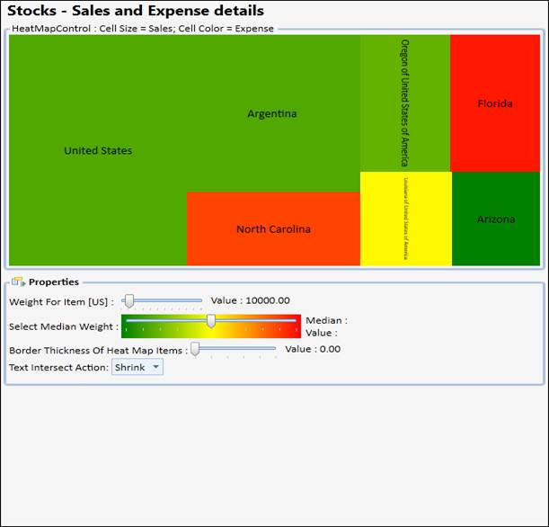

::: {style="DISPLAY: none"}
{#d2h_url_template}{#d2h_package_url style="WIDTH: 0px; DISPLAY: none; HEIGHT: 0px"}
:::

::::: {.d2h_secondary_topic style="PADDING-BOTTOM: 10pt; MARGIN: 0pt; PADDING-LEFT: 0pt; PADDING-RIGHT: 0pt; PADDING-TOP: 0pt"}
##### Heat Map Control {#heat-map-control style="tab-stops: 0pt"}

HeatMapControl is a control that lays out bound child items in rectangles, whose area is based on their \"weight\", and whose color is based on their \"color weight\". It can also be bound to hierarchical data.

 

[]{style="FONT-FAMILY: 'Trebuchet MS','sans-serif'; COLOR: #15428b; FONT-SIZE: 9pt"} 

Table 123: Property Table

::: {align="center"}
+-----------------------------------+-----------------------------------------------------------------------------------------------------------------------------------------------------------------------------------------------------------------------------------------------------------------------------------------------+
| Property                          | Description                                                                                                                                                                                                                                                                                   |
+-----------------------------------+-----------------------------------------------------------------------------------------------------------------------------------------------------------------------------------------------------------------------------------------------------------------------------------------------+
| ColorCalculationLevel             | specifies the items at a level (when bound to hierarchical data) for which the ColorWeight should be processed                                                                                                                                                                                |
|                                   |                                                                                                                                                                                                                                                                                               |
|                                   | Default value is -1, indicating this will be processed for all leaf nodes in the hierarchy. 0 indicates the top level of items in the bound hierarchy and so on. If you are adding HeatMapItems manually, make sure to set their Level property appropriately. This is a dependency property. |
+-----------------------------------+-----------------------------------------------------------------------------------------------------------------------------------------------------------------------------------------------------------------------------------------------------------------------------------------------+
| ColorValuePath                    | gets or sets a path to a value on the source object to serve as the \"color weight\" of the object                                                                                                                                                                                            |
|                                   |                                                                                                                                                                                                                                                                                               |
|                                   | This is a dependency property. This is used for items at all levels. It can be overridden for items at specific levels through the corresponding HeatMapItem\'s setting.                                                                                                                      |
+-----------------------------------+-----------------------------------------------------------------------------------------------------------------------------------------------------------------------------------------------------------------------------------------------------------------------------------------------+
| ColorWeightsInfo                  | contains computed information about the low and high colors in the bound items                                                                                                                                                                                                                |
+-----------------------------------+-----------------------------------------------------------------------------------------------------------------------------------------------------------------------------------------------------------------------------------------------------------------------------------------------+
| HighestWeightColor                | specifies the color that will be used on the item with the highest color weight                                                                                                                                                                                                               |
|                                   |                                                                                                                                                                                                                                                                                               |
|                                   | This is a dependency property. Default value is Green.                                                                                                                                                                                                                                        |
+-----------------------------------+-----------------------------------------------------------------------------------------------------------------------------------------------------------------------------------------------------------------------------------------------------------------------------------------------+
| ItemsLayoutMode                   | specifies the mode in which items should be laid out                                                                                                                                                                                                                                          |
|                                   |                                                                                                                                                                                                                                                                                               |
|                                   | This setting will be applied at all levels. To customize this for specific levels, check the corresponding HeatMapItem setting. Default value is HeatMapLayoutMode.Squarified. This is a dependency property.                                                                                 |
+-----------------------------------+-----------------------------------------------------------------------------------------------------------------------------------------------------------------------------------------------------------------------------------------------------------------------------------------------+
| LowestWeightColor                 | specifies the color that will be used on the item with the lowest color weight                                                                                                                                                                                                                |
|                                   |                                                                                                                                                                                                                                                                                               |
|                                   | This is a dependency property. Default value is Cornsilk.                                                                                                                                                                                                                                     |
+-----------------------------------+-----------------------------------------------------------------------------------------------------------------------------------------------------------------------------------------------------------------------------------------------------------------------------------------------+
| MedianWeight                      | specifies the \"median color weight\" on which the MedianWeightColor will be applied                                                                                                                                                                                                          |
|                                   |                                                                                                                                                                                                                                                                                               |
|                                   | The valid values for this property are between 0 to 100. Default value is 50. This is a dependency property.                                                                                                                                                                                  |
+-----------------------------------+-----------------------------------------------------------------------------------------------------------------------------------------------------------------------------------------------------------------------------------------------------------------------------------------------+
| MedianWeightColor                 | specifies the color that will be used on the item with the median color weight                                                                                                                                                                                                                |
|                                   |                                                                                                                                                                                                                                                                                               |
|                                   | This is a dependency property. Default value is Yellow.                                                                                                                                                                                                                                       |
+-----------------------------------+-----------------------------------------------------------------------------------------------------------------------------------------------------------------------------------------------------------------------------------------------------------------------------------------------+
| PreferredItemsPanelHeight         | when bound to a grouped CollectionViewSource, this property specifies the preferred height you want to use for groups                                                                                                                                                                         |
|                                   |                                                                                                                                                                                                                                                                                               |
|                                   | Default value is 300. This is a dependency property.                                                                                                                                                                                                                                          |
+-----------------------------------+-----------------------------------------------------------------------------------------------------------------------------------------------------------------------------------------------------------------------------------------------------------------------------------------------+
| PreferredItemsPanelWidth          | when bound to a grouped CollectionViewSource, this property specifies the preferred width you want to use for groups                                                                                                                                                                          |
|                                   |                                                                                                                                                                                                                                                                                               |
|                                   | Default value is 300. This is a dependency property.                                                                                                                                                                                                                                          |
+-----------------------------------+-----------------------------------------------------------------------------------------------------------------------------------------------------------------------------------------------------------------------------------------------------------------------------------------------+
| WeightValuePath                   | gets or sets a path to a value on the source object to serve as the \"weight\" of the object                                                                                                                                                                                                  |
|                                   |                                                                                                                                                                                                                                                                                               |
|                                   | This is a dependency property. This is used for items at all levels. It can be overridden for items at specific levels, through the corresponding HeatMapItem\'s setting.                                                                                                                     |
+-----------------------------------+-----------------------------------------------------------------------------------------------------------------------------------------------------------------------------------------------------------------------------------------------------------------------------------------------+
:::

 

###### 4.1.1.4.13.1        Gradient Support for Heat Maps {#gradient-support-for-heat-maps style="tab-stops: 0pt"}

The heat map control contains the **IsGradientBrush** property, which supports linear gradient brushes in its interior.

 

Property Details

**[]{style="FONT-FAMILY: 'Trebuchet MS','sans-serif'; COLOR: #15428b; FONT-SIZE: 9pt"}** 

::: {align="center"}
+------------------+--------------------------------------------------------+------------------+---------------------+--------------------------+----------------------------------------------------------------------------------------------------------------------------------+
| Name of Property | Description                                            | Type of Property | Value It Accepts    | Property syntax          | Sub properties                                                                                                                   |
|                  |                                                        |                  |                     |                          |                                                                                                                                  |
|                  |                                                        |                  |                     |                          |                                                                                                                                  |
+------------------+--------------------------------------------------------+------------------+---------------------+--------------------------+----------------------------------------------------------------------------------------------------------------------------------+
| IsGradientBrush  | Used to set the gradient brush for a heat map control. | Dependency       | Bool or True/False. | IsGradientBrush=\"True\" | LowestWeightGradient,  MedianWeightGradient,                          HighestWeightGradient (All properties are type of brushes) |
+------------------+--------------------------------------------------------+------------------+---------------------+--------------------------+----------------------------------------------------------------------------------------------------------------------------------+
:::

[]{style="FONT-FAMILY: 'Trebuchet MS','sans-serif'; COLOR: #15428b; FONT-SIZE: 9pt"} 

Setting Gradient Brush for a Heat Map Control

The following code is used to set a gradient brush for a heat map control.

 

+----------------------------------------------------------------------------------------------------------------------------------------------------------------------------------------------------------------------------------------------------------------------------------------------------------------------------------------------------------------------------------------------------------------------------------------------------------------------------------------------------------------------------------------------------------------------------------------------------------------------------------------------------------------------------------------------------------------------------------------------------------------------------------------------------------------------------------------------------------------------------------------------+
| **[\[XAML \]]{style="FONT-FAMILY: 'Calibri','sans-serif'"}**                                                                                                                                                                                                                                                                                                                                                                                                                                                                                                                                                                                                                                                                                                                                                                                                                                 |
|                                                                                                                                                                                                                                                                                                                                                                                                                                                                                                                                                                                                                                                                                                                                                                                                                                                                                              |
| [\<]{style="FONT-FAMILY: Consolas; COLOR: blue; FONT-SIZE: 9.5pt"}[syncfusion]{style="FONT-FAMILY: Consolas; COLOR: #a31515; FONT-SIZE: 9.5pt"}[:]{style="FONT-FAMILY: Consolas; COLOR: blue; FONT-SIZE: 9.5pt"}[HeatMapControl]{style="FONT-FAMILY: Consolas; COLOR: #a31515; FONT-SIZE: 9.5pt"}[ Grid.Row]{style="FONT-FAMILY: Consolas; COLOR: red; FONT-SIZE: 9.5pt"}[=\"0\"]{style="FONT-FAMILY: Consolas; COLOR: blue; FONT-SIZE: 9.5pt"}[ [x]{style="COLOR: red"}[:]{style="COLOR: blue"}[Name]{style="COLOR: red"}[=\"heatMap\" ]{style="COLOR: blue"}[IsGradientBrush]{style="COLOR: red"}[=\"True\"]{style="COLOR: blue"} [ LowestWeightGradient]{style="COLOR: red"}[=\"{]{style="COLOR: blue"}[StaticResource]{style="COLOR: #a31515"}[ SeriesBInterior]{style="COLOR: red"}[}\"]{style="COLOR: blue"} [ ]{style="COLOR: red"}]{style="FONT-FAMILY: Consolas; FONT-SIZE: 9.5pt"} |
|                                                                                                                                                                                                                                                                                                                                                                                                                                                                                                                                                                                                                                                                                                                                                                                                                                                                                              |
| [MedianWeightGradient]{style="FONT-FAMILY: Consolas; COLOR: red; FONT-SIZE: 9.5pt"}[=\"{]{style="FONT-FAMILY: Consolas; COLOR: blue; FONT-SIZE: 9.5pt"}[StaticResource]{style="FONT-FAMILY: Consolas; COLOR: #a31515; FONT-SIZE: 9.5pt"}[ SeriesAInterior]{style="FONT-FAMILY: Consolas; COLOR: red; FONT-SIZE: 9.5pt"}[}\" ]{style="FONT-FAMILY: Consolas; COLOR: blue; FONT-SIZE: 9.5pt"}[                                   [ HighestWeightGradient]{style="COLOR: red"}[=\"{]{style="COLOR: blue"}[StaticResource]{style="COLOR: #a31515"}[ SeriesCInterior]{style="COLOR: red"}[}\"]{style="COLOR: blue"}[ ]{style="COLOR: red"}[/\>]{style="COLOR: blue"}]{style="FONT-FAMILY: Consolas; FONT-SIZE: 9.5pt"}                                                                                                                                                                            |
|                                                                                                                                                                                                                                                                                                                                                                                                                                                                                                                                                                                                                                                                                                                                                                                                                                                                                              |
|                                                                                                                                                                                                                                                                                                                                                                                                                                                                                                                                                                                                                                                                                                                                                                                                                                                                                              |
+----------------------------------------------------------------------------------------------------------------------------------------------------------------------------------------------------------------------------------------------------------------------------------------------------------------------------------------------------------------------------------------------------------------------------------------------------------------------------------------------------------------------------------------------------------------------------------------------------------------------------------------------------------------------------------------------------------------------------------------------------------------------------------------------------------------------------------------------------------------------------------------------+

 

When the code runs, the following output displays.

 

{border="0"}

Figure 163: Heat Map Control with Gradient Interior

 

4.1.1.4.13.1.1     Resize the Font to Fit in the HeatMap Item

This feature automatically resizes the content to fit inside the HeatMap item, so that the font size of the content is adjusted according to the width of the Heat Map item and the orientation is changed according to the height and width of the HeatMap item.

 

Use Case Scenarios

It is used in the field where data are represented in a two dimensional map namely Population Survey. The data of the survey will automatically fit into the HeatMap item by resizing its font size.

 

{border="0"}

Figure 164: HeatMap[]{style="COLOR: #c00000"}

Sample Link

The path to access the sample is:

***\<sample installation location\>\\Syncfusion\\EssentialStudio\\Version Number\\WPF\\Chart.WPF\\WindowSamples\\3.5\\Controllers \\Heat Map\\FlatListDemo\"*** 

 

4.1.1.4.13.1.2     Text Wrapping Behavior in HeatMapItem

The HeatMap control ships with the enhancement of customizing the text within the HeatMap item using the enum property **TextIntersectAction** which includes **Shrink** and **Wrap** to shrink the size of the overlapped text on resizing and to support multiline text respectively.

**Use Case Scenarios**

1.  Avoid overlapping of text on resizing.

2.  Make the text inside the HeatMapItem readable.

**Properties**

  --------------------- ------------------------------------------------------------ ------------ ---------------
  **Property**          **Description**                                              **Type**     **Data Type**
  TextIntersectAction   Sets the intersect action for the text in the HeatMapItem.   Dependency   Enum
  --------------------- ------------------------------------------------------------ ------------ ---------------

 

**Sample Links**

1.  Open the Sample Browser and select the WPF platform.

2.  Select the **Chart** product.

3.  SB \> Chart \> Heat Map \> Flat List Demo.

**Adding Text Wrapping Behavior in HeatMapItem to an Application**

To add the text wrapping support to the **HeatMapItem**:

+------------------------------------------------------------------------------------------------------------------------------------------------------------------------------------------------------------------------------------------------------------------------------------------------------------------------------------------------------------------------------------------------------------------------------------------------------------------------------------------------------------------------------------------------+
| **[\[XAML\]]{style="FONT-FAMILY: 'Courier New'"}**                                                                                                                                                                                                                                                                                                                                                                                                                                                                                             |
|                                                                                                                                                                                                                                                                                                                                                                                                                                                                                                                                                |
| []{style="FONT-FAMILY: 'Courier New'"}                                                                                                                                                                                                                                                                                                                                                                                                                                                                                                         |
|                                                                                                                                                                                                                                                                                                                                                                                                                                                                                                                                                |
| [\<]{style="FONT-FAMILY: Consolas; COLOR: blue; FONT-SIZE: 9.5pt"}[syncfusion]{style="FONT-FAMILY: Consolas; COLOR: #a31515; FONT-SIZE: 9.5pt"}[:]{style="FONT-FAMILY: Consolas; COLOR: blue; FONT-SIZE: 9.5pt"}[HeatMapControl]{style="FONT-FAMILY: Consolas; COLOR: #a31515; FONT-SIZE: 9.5pt"}[ [x]{style="COLOR: red"}[:]{style="COLOR: blue"}[Name]{style="COLOR: red"}[=\"heatMap\"]{style="COLOR: blue"} [TextIntersectAction]{style="COLOR: red"}[=\"Wrap\"/\>]{style="COLOR: blue"}]{style="FONT-FAMILY: Consolas; FONT-SIZE: 9.5pt"} |
|                                                                                                                                                                                                                                                                                                                                                                                                                                                                                                                                                |
|                                                                                                                                                                                                                                                                                                                                                                                                                                                                                                                                                |
+------------------------------------------------------------------------------------------------------------------------------------------------------------------------------------------------------------------------------------------------------------------------------------------------------------------------------------------------------------------------------------------------------------------------------------------------------------------------------------------------------------------------------------------------+

**** 

+------------------------------------------------------------------------------------------------------------------------------------------------------------------------------+
| **[\[C#\]]{style="FONT-FAMILY: 'Courier New'"}**                                                                                                                             |
|                                                                                                                                                                              |
| [ ]{style="FONT-FAMILY: 'Courier New'"}[heatMap.TextIntersectAction = [TextIntersectActions]{style="COLOR: #2b91af"}.Wrap;]{style="FONT-FAMILY: Consolas; FONT-SIZE: 9.5pt"} |
|                                                                                                                                                                              |
|                                                                                                                                                                              |
+------------------------------------------------------------------------------------------------------------------------------------------------------------------------------+

 

{border="0"}

Figure 165: Intersect Action Set as Wrap

1.  To shrink the text for the HeatMapItem.

+--------------------------------------------------------------------------------------------------------------------------------------------------------------------------------------------------------------------------------------------------------------------------------------------------------------------------------------------------------------------------------------------------------------------------------------------------------------------------------------------------------------------------------------------------+
| **[\[XAML\]]{style="FONT-FAMILY: 'Courier New'"}**                                                                                                                                                                                                                                                                                                                                                                                                                                                                                               |
|                                                                                                                                                                                                                                                                                                                                                                                                                                                                                                                                                  |
| []{style="FONT-FAMILY: 'Courier New'"}                                                                                                                                                                                                                                                                                                                                                                                                                                                                                                           |
|                                                                                                                                                                                                                                                                                                                                                                                                                                                                                                                                                  |
| [\<]{style="FONT-FAMILY: Consolas; COLOR: blue; FONT-SIZE: 9.5pt"}[syncfusion]{style="FONT-FAMILY: Consolas; COLOR: #a31515; FONT-SIZE: 9.5pt"}[:]{style="FONT-FAMILY: Consolas; COLOR: blue; FONT-SIZE: 9.5pt"}[HeatMapControl]{style="FONT-FAMILY: Consolas; COLOR: #a31515; FONT-SIZE: 9.5pt"}[ [x]{style="COLOR: red"}[:]{style="COLOR: blue"}[Name]{style="COLOR: red"}[=\"heatMap\"]{style="COLOR: blue"} [TextIntersectAction]{style="COLOR: red"}[=\"Shrink\"/\>]{style="COLOR: blue"}]{style="FONT-FAMILY: Consolas; FONT-SIZE: 9.5pt"} |
|                                                                                                                                                                                                                                                                                                                                                                                                                                                                                                                                                  |
|                                                                                                                                                                                                                                                                                                                                                                                                                                                                                                                                                  |
+--------------------------------------------------------------------------------------------------------------------------------------------------------------------------------------------------------------------------------------------------------------------------------------------------------------------------------------------------------------------------------------------------------------------------------------------------------------------------------------------------------------------------------------------------+

**** 

+--------------------------------------------------------------------------------------------------------------------------------------------------------------------------------+
| **[\[C#\]]{style="FONT-FAMILY: 'Courier New'"}**                                                                                                                               |
|                                                                                                                                                                                |
| [ ]{style="FONT-FAMILY: 'Courier New'"}[heatMap.TextIntersectAction = [TextIntersectActions]{style="COLOR: #2b91af"}.Shrink;]{style="FONT-FAMILY: Consolas; FONT-SIZE: 9.5pt"} |
|                                                                                                                                                                                |
|                                                                                                                                                                                |
+--------------------------------------------------------------------------------------------------------------------------------------------------------------------------------+

 

 

{border="0"}

Figure 166: Intersect Action Set as Shrink

[]{#related-topics}
:::::
