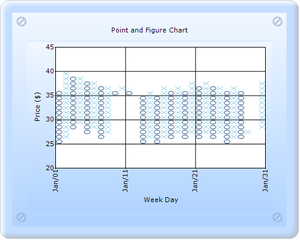
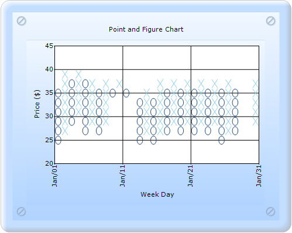

::: {style="DISPLAY: none"}
{#d2h_url_template}{#d2h_package_url style="WIDTH: 0px; DISPLAY: none; HEIGHT: 0px"}
:::

:::: {.d2h_secondary_topic style="PADDING-BOTTOM: 10pt; MARGIN: 0pt; PADDING-LEFT: 0pt; PADDING-RIGHT: 0pt; PADDING-TOP: 0pt"}
#### Height Box {#height-box style="tab-stops: 0pt"}

Height Box gets or sets the height of the boxes in the Financial chart types.

 

::: {align="center"}
+------------------------------+------------------------+
|                      Details                          |
+------------------------------+------------------------+
| Possible values              | A double value.        |
+------------------------------+------------------------+
| Default value                | 1                      |
+------------------------------+------------------------+
| 2D/3D limitations            | No                     |
+------------------------------+------------------------+
| Application to chart element | All series             |
+------------------------------+------------------------+
| Application to chart types   | Point and Figure chart |
+------------------------------+------------------------+
:::

[]{style="FONT-FAMILY: 'Times New Roman','serif'; FONT-SIZE: 12pt"} 

{border="0"}

Figure 242: Point and Figure chart with default HeightBox

[]{style="FONT-FAMILY: 'Times New Roman','serif'; FONT-SIZE: 12pt"} 

{border="0"}

Figure 243: Point and Figure chart with HeightBox as 2f

[]{style="FONT-FAMILY: 'Times New Roman','serif'; FONT-SIZE: 12pt"} 

Point and Figure chart with the HeightBox property can be created in two ways:

[·      ]{style="FONT-FAMILY: Symbol"}Builder

[·      ]{style="FONT-FAMILY: Symbol"}ChartModel

More:

[ ]{#related-topics}

[{border="0" align="absMiddle"}Builder](ms-xhelp:///?Id=5e7480bb-1643-4cbf-b331-4f28f8155d7e){style="TEXT-DECORATION: none"}

[{border="0" align="absMiddle"}ChartModel](ms-xhelp:///?Id=ac545e25-9499-4f9e-8d1d-461fec0e3552){style="TEXT-DECORATION: none"}
::::
