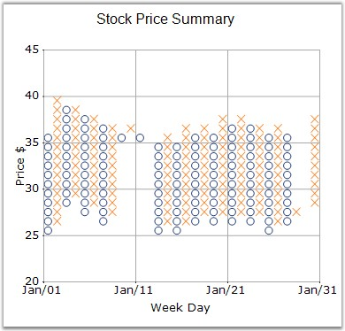

::: {style="DISPLAY: none"}
{#d2h_url_template}{#d2h_package_url style="WIDTH: 0px; DISPLAY: none; HEIGHT: 0px"}
:::

:::: {.d2h_secondary_topic style="PADDING-BOTTOM: 10pt; MARGIN: 0pt; PADDING-LEFT: 0pt; PADDING-RIGHT: 0pt; PADDING-TOP: 0pt"}
#### HeightBox {#heightbox style="tab-stops: 0pt"}

 

Gets / sets the height of the boxes in the financial chart types.

 

::: {align="center"}
+-------------------------------------+-------------------------------------+
|                                                                           |
|                                                                           |
| Details                                                                   |
+-------------------------------------+-------------------------------------+
| **Possible Values**                 | A double value                      |
+-------------------------------------+-------------------------------------+
| **Default Value    **               | **1**                               |
+-------------------------------------+-------------------------------------+
| **2D / 3D Limitations**             | No                                  |
+-------------------------------------+-------------------------------------+
| **Applies to Chart Element**        | All series                          |
+-------------------------------------+-------------------------------------+
| **Applies to Chart Types**          | Point And Figure Chart              |
+-------------------------------------+-------------------------------------+
:::

 

Here is some sample code.

 

+-----------------------------------------------------------------------------------------------------------------------------------------+
| **[\[C#\]]{style="FONT-FAMILY: 'Courier New'; COLOR: black"}**                                                                          |
|                                                                                                                                         |
| **[]{style="FONT-FAMILY: 'Courier New'; COLOR: black"}**                                                                                |
|                                                                                                                                         |
| [this]{style="FONT-FAMILY: 'Courier New'; COLOR: blue"}[.chartControl1.Series\[0\].HeightBox = 2f;]{style="FONT-FAMILY: 'Courier New'"} |
+-----------------------------------------------------------------------------------------------------------------------------------------+

 

+--------------------------------------------------------------------------------------------------------------------------------------------------+
| **[\[VB.NET\]]{style="FONT-FAMILY: 'Courier New'; COLOR: black"}**                                                                               |
|                                                                                                                                                  |
| **[]{style="FONT-FAMILY: 'Courier New'; COLOR: black"}**                                                                                         |
|                                                                                                                                                  |
| [Me]{style="FONT-FAMILY: 'Courier New'; COLOR: blue"}[.chartControl1.Series(0).HeightBox = 2f]{style="FONT-FAMILY: 'Courier New'; COLOR: black"} |
+--------------------------------------------------------------------------------------------------------------------------------------------------+

 

{border="0"}

 

Figure 143: PointAndFigure Chart with Box Size of 1 (Default)

 

{border="0"}

 

Figure 144: PointAndFigure Chart with Box Size of 2

 

See Also

 

[PointAndFigure Chart]{.UGHyperlink}[]{.UGHyperlink}

 

[]{#p110} 

 

[]{#related-topics}
::::
