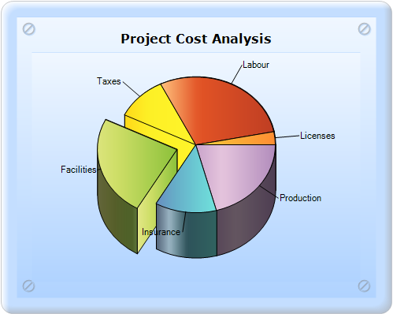
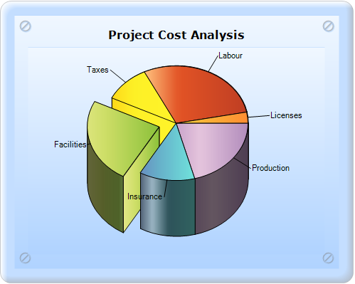

::: {style="DISPLAY: none"}
{#d2h_url_template}{#d2h_package_url style="WIDTH: 0px; DISPLAY: none; HEIGHT: 0px"}
:::

:::::::::::::: {.d2h_secondary_topic style="PADDING-BOTTOM: 10pt; MARGIN: 0pt; PADDING-LEFT: 0pt; PADDING-RIGHT: 0pt; PADDING-TOP: 0pt"}
##### HeightByAreaDepth and HeightCoEfficient {#heightbyareadepth-and-heightcoefficient style="tab-stops: 0pt"}

###### []{#_HeightByAreaDepth}5.2.1.2.8.1 HeightByAreaDepth {#heightbyareadepth style="tab-stops: 0pt"}

HeightByAreaDepth indicates whether to draw a series by using the ChartArea.Depth property.

::: {align="center"}
+------------------------------+---------------+
| Details                                      |
+------------------------------+---------------+
| Possible values              | True or False |
+------------------------------+---------------+
| Default value                | False         |
+------------------------------+---------------+
| 2D/3D limitations            | 3D only       |
+------------------------------+---------------+
| Application to chart element | All series    |
+------------------------------+---------------+
| Application to chart types   | Pie chart     |
+------------------------------+---------------+
:::

[]{style="FONT-FAMILY: 'Calibri','sans-serif'"} 

[]{style="FONT-FAMILY: 'Calibri','sans-serif'"} 

{border="0"}

Figure 173: Default dimension

[]{style="FONT-FAMILY: 'Calibri','sans-serif'"} 

[]{style="FONT-FAMILY: 'Calibri','sans-serif'"} 

{border="0"}

Figure 174: Pie chart with HeightAreaDepth by setting ChartArea.Depth as 50f

###### []{#_Height_CoEfficient}5.2.1.2.8.2 Height CoEfficient {#height-coefficient style="tab-stops: 0pt"}

In the 3D mode, the relative height of the Pie chart can be specified by using the Height CoEfficient property. Note that the HeightByAreaDepth property should be set to false for this to take effect.

::: {align="center"}
+------------------------------+---------------------------+
| Details                                                  |
+------------------------------+---------------------------+
| Possible values              | Valid ranges from 0 to 1. |
+------------------------------+---------------------------+
| Default value                | 0.2                       |
+------------------------------+---------------------------+
| 2D/3D limitations            | 3D only                   |
+------------------------------+---------------------------+
| Application to chart element | All series                |
+------------------------------+---------------------------+
| Application to chart types   | Pie chart                 |
+------------------------------+---------------------------+
:::

[]{style="FONT-FAMILY: 'Calibri','sans-serif'"} 

[]{style="FONT-FAMILY: 'Calibri','sans-serif'"} 

{border="0"}

Figure 175: Pie chart with property HeightCoEfficient 0.5f

###### 5.2.1.2.8.3 Creation {#creation style="tab-stops: 0pt"}

Pie chart with HeightAreaByDepth and HeightCoEfficient Gradient can be created through two ways:

[·      ]{style="FONT-FAMILY: Symbol"}Builder

[·      ]{style="FONT-FAMILY: Symbol"}ChartModel

5.2.1.2.8.3.1      Setting HeightAreaByDepth to false

[]{style="FONT-FAMILY: 'Calibri','sans-serif'"} 

Builder

To create a Pie chart and set its HeightAreaByDepth property to false through Builder:

1.   In Controller, return view to the corresponding View page.

2.   In the View page, invoke the ChartBuilder by using the control ID as the first argument.

3.   Add the **Series** to the ChartModel and [set the Chart Type to **Pie**]{style="COLOR: black"}, and add the **Points** to the series and set the style.

4.   Set the ChartModel and ChartArea properties.

5.   Set the HeightAreaByDepth property, as specified in the code snippets displayed below.

*[]{style="LETTER-SPACING: 0.75pt; FONT-FAMILY: 'Cambria','serif'; COLOR: #4f81bd; FONT-SIZE: 12pt"}* 

::: {style="BORDER-BOTTOM: #c8c8c8 1pt solid; BORDER-LEFT: #c8c8c8 1pt solid; PADDING-BOTTOM: 1pt; MARGIN-TOP: 0pt; PADDING-LEFT: 4pt; PADDING-RIGHT: 4pt; MARGIN-BOTTOM: 0pt; BACKGROUND: #f0f0f0; BORDER-TOP: #c8c8c8 1pt solid; BORDER-RIGHT: #c8c8c8 1pt solid; PADDING-TOP: 1pt"}
\[C#\]

[        ]{style="FONT-FAMILY: Consolas; FONT-SIZE: 9.5pt"}[public]{style="FONT-FAMILY: 'Courier New'; COLOR: blue"}[ [ActionResult]{style="COLOR: #2b91af"} SimpleChart()]{style="FONT-FAMILY: 'Courier New'"}

[        {            ]{style="FONT-FAMILY: 'Courier New'"}

[            [return]{style="COLOR: blue"} View();]{style="FONT-FAMILY: 'Courier New'"}

[        }]{style="FONT-FAMILY: 'Courier New'"}
:::

[]{style="FONT-FAMILY: 'Calibri','sans-serif'"} 

::: {style="BORDER-BOTTOM: #c8c8c8 1pt solid; BORDER-LEFT: #c8c8c8 1pt solid; PADDING-BOTTOM: 1pt; MARGIN-TOP: 0pt; PADDING-LEFT: 4pt; PADDING-RIGHT: 4pt; MARGIN-BOTTOM: 0pt; BACKGROUND: #f0f0f0; BORDER-TOP: #c8c8c8 1pt solid; BORDER-RIGHT: #c8c8c8 1pt solid; PADDING-TOP: 1pt"}
View \[ASPX\]

[    ]{style="FONT-FAMILY: Consolas; FONT-SIZE: 9.5pt"}[\<%]{style="FONT-FAMILY: 'Courier New'; BACKGROUND: yellow"}[=]{style="FONT-FAMILY: 'Courier New'; COLOR: blue"}[Html.Chart([\"chart_Model\"]{style="COLOR: #a31515"}).Text([\"Project Cost Analysis\"]{style="COLOR: #a31515"}).Series(series =\>]{style="FONT-FAMILY: 'Courier New'"}

[        {]{style="FONT-FAMILY: 'Courier New'"}

[            series.Add()]{style="FONT-FAMILY: 'Courier New'"}

[                  .Name([\"Market\"]{style="COLOR: #a31515"})]{style="FONT-FAMILY: 'Courier New'"}

[                  .Type(Syncfusion.Windows.Forms.Chart.[ChartSeriesType]{style="COLOR: #2b91af"}.Pie)]{style="FONT-FAMILY: 'Courier New'"}

[                  .Points(points =\>]{style="FONT-FAMILY: 'Courier New'"}

[                  {]{style="FONT-FAMILY: 'Courier New'"}

[                      points.Add(0, 20);]{style="FONT-FAMILY: 'Courier New'"}

[                      points.Add(1, 28);]{style="FONT-FAMILY: 'Courier New'"}

[                      points.Add(2, 23);]{style="FONT-FAMILY: 'Courier New'"}

[                      points.Add(3, 10);]{style="FONT-FAMILY: 'Courier New'"}

[                      points.Add(4, 12);]{style="FONT-FAMILY: 'Courier New'"}

[                      points.Add(5, 3);]{style="FONT-FAMILY: 'Courier New'"}

[                  })]{style="FONT-FAMILY: 'Courier New'"}

[                  .Style(style =\>]{style="FONT-FAMILY: 'Courier New'"}

[                  {]{style="FONT-FAMILY: 'Courier New'"}

[                      style.DisplayText([true]{style="COLOR: blue"});]{style="FONT-FAMILY: 'Courier New'"}

[                  })]{style="FONT-FAMILY: 'Courier New'"}

[                  .Styles(styles =\>]{style="FONT-FAMILY: 'Courier New'"}

[                  {]{style="FONT-FAMILY: 'Courier New'"}

[                      styles.Get(0)]{style="FONT-FAMILY: 'Courier New'"}

[                            ]{style="FONT-FAMILY: 'Courier New'"}[.Text([\"Production\"]{style="COLOR: #a31515"})]{style="FONT-FAMILY: 'Courier New'"}

[                            .Interior([new]{style="COLOR: blue"} Syncfusion.Drawing.[BrushInfo]{style="COLOR: #2b91af"}(Syncfusion.Drawing.[GradientStyle]{style="COLOR: #2b91af"}.Horizontal, [new]{style="COLOR: blue"} System.Drawing.[Color]{style="COLOR: #2b91af"}\[\] { System.Drawing.[Color]{style="COLOR: #2b91af"}.FromArgb(177, 140, 188), System.Drawing.[Color]{style="COLOR: #2b91af"}.FromArgb(229, 197, 221), System.Drawing.[Color]{style="COLOR: #2b91af"}.FromArgb(201, 163, 202) }));]{style="FONT-FAMILY: 'Courier New'"}

[                      styles.Get(1)]{style="FONT-FAMILY: 'Courier New'"}

[                            .Text([\"Labour\"]{style="COLOR: #a31515"})]{style="FONT-FAMILY: 'Courier New'"}

[                           .Interior([new]{style="COLOR: blue"} Syncfusion.Drawing.[BrushInfo]{style="COLOR: #2b91af"}(Syncfusion.Drawing.[GradientStyle]{style="COLOR: #2b91af"}.Horizontal, [new]{style="COLOR: blue"} System.Drawing.[Color]{style="COLOR: #2b91af"}\[\] { System.Drawing.[Color]{style="COLOR: #2b91af"}.FromArgb(191, 62, 35), System.Drawing.[Color]{style="COLOR: #2b91af"}.FromArgb(226, 83, 37), System.Drawing.[Color]{style="COLOR: #2b91af"}.FromArgb(255, 195, 127) }));]{style="FONT-FAMILY: 'Courier New'"}

[                      styles.Get(2)]{style="FONT-FAMILY: 'Courier New'"}

[                            .Text([\"Facilities\"]{style="COLOR: #a31515"})]{style="FONT-FAMILY: 'Courier New'"}

[                           .Interior([new]{style="COLOR: blue"} Syncfusion.Drawing.[BrushInfo]{style="COLOR: #2b91af"}(Syncfusion.Drawing.[GradientStyle]{style="COLOR: #2b91af"}.Horizontal, [new]{style="COLOR: blue"} System.Drawing.[Color]{style="COLOR: #2b91af"}\[\] { System.Drawing.[Color]{style="COLOR: #2b91af"}.FromArgb(139, 193, 58), System.Drawing.[Color]{style="COLOR: #2b91af"}.FromArgb(206, 222, 103), System.Drawing.[Color]{style="COLOR: #2b91af"}.FromArgb(227, 231, 135) }));]{style="FONT-FAMILY: 'Courier New'"}

[                      styles.Get(3)]{style="FONT-FAMILY: 'Courier New'"}

[                            .Text([\"Taxes\"]{style="COLOR: #a31515"})]{style="FONT-FAMILY: 'Courier New'"}

[                           .Interior([new]{style="COLOR: blue"} Syncfusion.Drawing.[BrushInfo]{style="COLOR: #2b91af"}(Syncfusion.Drawing.[GradientStyle]{style="COLOR: #2b91af"}.Horizontal, [new]{style="COLOR: blue"} System.Drawing.[Color]{style="COLOR: #2b91af"}\[\] { System.Drawing.[Color]{style="COLOR: #2b91af"}.FromArgb(255, 244, 42), System.Drawing.[Color]{style="COLOR: #2b91af"}.FromArgb(253, 240, 38), System.Drawing.[Color]{style="COLOR: #2b91af"}.FromArgb(255, 216, 25) }));]{style="FONT-FAMILY: 'Courier New'"}

[                      styles.Get(4)]{style="FONT-FAMILY: 'Courier New'"}

[                            .Text([\"Insurance\"]{style="COLOR: #a31515"})]{style="FONT-FAMILY: 'Courier New'"}

[                           .Interior([new]{style="COLOR: blue"} Syncfusion.Drawing.[BrushInfo]{style="COLOR: #2b91af"}(Syncfusion.Drawing.[GradientStyle]{style="COLOR: #2b91af"}.Horizontal, [new]{style="COLOR: blue"} System.Drawing.[Color]{style="COLOR: #2b91af"}\[\] { System.Drawing.[Color]{style="COLOR: #2b91af"}.FromArgb(112, 227, 220), System.Drawing.[Color]{style="COLOR: #2b91af"}.FromArgb(102, 175, 201), System.Drawing.[Color]{style="COLOR: #2b91af"}.FromArgb(104, 142, 191) }));]{style="FONT-FAMILY: 'Courier New'"}

[                      styles.Get(5)]{style="FONT-FAMILY: 'Courier New'"}

[                            .Text([\"Licenses\"]{style="COLOR: #a31515"})]{style="FONT-FAMILY: 'Courier New'"}

[                           .Interior([new]{style="COLOR: blue"} Syncfusion.Drawing.[BrushInfo]{style="COLOR: #2b91af"}(Syncfusion.Drawing.[GradientStyle]{style="COLOR: #2b91af"}.Horizontal, [new]{style="COLOR: blue"} System.Drawing.[Color]{style="COLOR: #2b91af"}\[\] { System.Drawing.[Color]{style="COLOR: #2b91af"}.FromArgb(255, 141, 51), System.Drawing.[Color]{style="COLOR: #2b91af"}.FromArgb(248, 183, 56), System.Drawing.[Color]{style="COLOR: #2b91af"}.FromArgb(249, 228, 70) }));]{style="FONT-FAMILY: 'Courier New'"}

[]{style="FONT-FAMILY: 'Courier New'"} 

[                  })]{style="FONT-FAMILY: 'Courier New'"}

[                  .ExplodedIndex(2)]{style="FONT-FAMILY: 'Courier New'"}

**[                  .ConfigItems(configItems =\>]{style="FONT-FAMILY: 'Courier New'"}**

**[                  {]{style="FONT-FAMILY: 'Courier New'"}**

**[                      configItems.PieItem(item =\>]{style="FONT-FAMILY: 'Courier New'"}**

**[                      {]{style="FONT-FAMILY: 'Courier New'"}**

**[                          item.HeightByAreaDepth([false]{style="COLOR: blue"})]{style="FONT-FAMILY: 'Courier New'"}**

**[                              .HeightCoeficient(0.5f);]{style="FONT-FAMILY: 'Courier New'"}**

**[                      });]{style="FONT-FAMILY: 'Courier New'"}**

**[                  });]{style="FONT-FAMILY: 'Courier New'"}**

[        }).BorderAppearance(border =\>]{style="FONT-FAMILY: 'Courier New'"}

[        {]{style="FONT-FAMILY: 'Courier New'"}

[            border.SkinStyle(Syncfusion.Windows.Forms.Chart.[ChartBorderSkinStyle]{style="COLOR: #2b91af"}.Pinned);]{style="FONT-FAMILY: 'Courier New'"}

[        }).Size([new]{style="COLOR: blue"} System.Drawing.[Size]{style="COLOR: #2b91af"}(500, 400))]{style="FONT-FAMILY: 'Courier New'"}

[              .Skins([ChartModelSkins]{style="COLOR: #2b91af"}.Office2007Blue)]{style="FONT-FAMILY: 'Courier New'"}

[              .Series3D([true]{style="COLOR: blue"})]{style="FONT-FAMILY: 'Courier New'"}

[              .ElementsSpacing(5)]{style="FONT-FAMILY: 'Courier New'"}

[              .Font([new]{style="COLOR: blue"} System.Drawing.[Font]{style="COLOR: #2b91af"}([\"Verdana\"]{style="COLOR: #a31515"}, 12, System.Drawing.[FontStyle]{style="COLOR: #2b91af"}.Bold))]{style="FONT-FAMILY: 'Courier New'"}

[    [%\>]{style="BACKGROUND: yellow"}]{style="FONT-FAMILY: 'Courier New'"}

[]{style="FONT-FAMILY: Consolas; BACKGROUND: yellow; FONT-SIZE: 9.5pt"} 
:::

[]{style="FONT-FAMILY: Consolas; BACKGROUND: yellow; FONT-SIZE: 9.5pt"} 

[]{style="FONT-FAMILY: 'Calibri','sans-serif'"} 

::: {style="BORDER-BOTTOM: #c8c8c8 1pt solid; BORDER-LEFT: #c8c8c8 1pt solid; PADDING-BOTTOM: 1pt; MARGIN-TOP: 0pt; PADDING-LEFT: 4pt; PADDING-RIGHT: 4pt; MARGIN-BOTTOM: 0pt; BACKGROUND: #f0f0f0; BORDER-TOP: #c8c8c8 1pt solid; BORDER-RIGHT: #c8c8c8 1pt solid; PADDING-TOP: 1pt"}
View \[cshtml\]

[    ]{style="FONT-FAMILY: Consolas; FONT-SIZE: 9.5pt"}[\@{]{style="FONT-FAMILY: 'Courier New'; BACKGROUND: yellow"}[ Html.Chart([\"chart_Model\"]{style="COLOR: #a31515"}).Text([\"Project Cost Analysis\"]{style="COLOR: #a31515"}).Series(series =\>]{style="FONT-FAMILY: 'Courier New'"}

[        {]{style="FONT-FAMILY: 'Courier New'"}

[            series.Add()]{style="FONT-FAMILY: 'Courier New'"}

[                  .Name([\"Market\"]{style="COLOR: #a31515"})]{style="FONT-FAMILY: 'Courier New'"}

[                  .Type(Syncfusion.Windows.Forms.Chart.[ChartSeriesType]{style="COLOR: #2b91af"}.Pie)]{style="FONT-FAMILY: 'Courier New'"}

[                  .Points(points =\>]{style="FONT-FAMILY: 'Courier New'"}

[                  {]{style="FONT-FAMILY: 'Courier New'"}

[                      points.Add(0, 20);]{style="FONT-FAMILY: 'Courier New'"}

[                      points.Add(1, 28);]{style="FONT-FAMILY: 'Courier New'"}

[                      points.Add(2, 23);]{style="FONT-FAMILY: 'Courier New'"}

[                      points.Add(3, 10);]{style="FONT-FAMILY: 'Courier New'"}

[                      points.Add(4, 12);]{style="FONT-FAMILY: 'Courier New'"}

[                      points.Add(5, 3);]{style="FONT-FAMILY: 'Courier New'"}

[                  })]{style="FONT-FAMILY: 'Courier New'"}

[                  .Style(style =\>]{style="FONT-FAMILY: 'Courier New'"}

[                  {]{style="FONT-FAMILY: 'Courier New'"}

[                      style.DisplayText([true]{style="COLOR: blue"});]{style="FONT-FAMILY: 'Courier New'"}

[                  })]{style="FONT-FAMILY: 'Courier New'"}

[                  .Styles(styles =\>]{style="FONT-FAMILY: 'Courier New'"}

[                  {]{style="FONT-FAMILY: 'Courier New'"}

[                      styles.Get(0)]{style="FONT-FAMILY: 'Courier New'"}

[                            ]{style="FONT-FAMILY: 'Courier New'"}[.Text([\"Production\"]{style="COLOR: #a31515"})]{style="FONT-FAMILY: 'Courier New'"}

[                            .Interior([new]{style="COLOR: blue"} Syncfusion.Drawing.[BrushInfo]{style="COLOR: #2b91af"}(Syncfusion.Drawing.[GradientStyle]{style="COLOR: #2b91af"}.Horizontal, [new]{style="COLOR: blue"} System.Drawing.[Color]{style="COLOR: #2b91af"}\[\] { System.Drawing.[Color]{style="COLOR: #2b91af"}.FromArgb(177, 140, 188), System.Drawing.[Color]{style="COLOR: #2b91af"}.FromArgb(229, 197, 221), System.Drawing.[Color]{style="COLOR: #2b91af"}.FromArgb(201, 163, 202) }));]{style="FONT-FAMILY: 'Courier New'"}

[                      styles.Get(1)]{style="FONT-FAMILY: 'Courier New'"}

[                            .Text([\"Labour\"]{style="COLOR: #a31515"})]{style="FONT-FAMILY: 'Courier New'"}

[                           .Interior([new]{style="COLOR: blue"} Syncfusion.Drawing.[BrushInfo]{style="COLOR: #2b91af"}(Syncfusion.Drawing.[GradientStyle]{style="COLOR: #2b91af"}.Horizontal, [new]{style="COLOR: blue"} System.Drawing.[Color]{style="COLOR: #2b91af"}\[\] { System.Drawing.[Color]{style="COLOR: #2b91af"}.FromArgb(191, 62, 35), System.Drawing.[Color]{style="COLOR: #2b91af"}.FromArgb(226, 83, 37), System.Drawing.[Color]{style="COLOR: #2b91af"}.FromArgb(255, 195, 127) }));]{style="FONT-FAMILY: 'Courier New'"}

[                      styles.Get(2)]{style="FONT-FAMILY: 'Courier New'"}

[                            .Text([\"Facilities\"]{style="COLOR: #a31515"})]{style="FONT-FAMILY: 'Courier New'"}

[                           .Interior([new]{style="COLOR: blue"} Syncfusion.Drawing.[BrushInfo]{style="COLOR: #2b91af"}(Syncfusion.Drawing.[GradientStyle]{style="COLOR: #2b91af"}.Horizontal, [new]{style="COLOR: blue"} System.Drawing.[Color]{style="COLOR: #2b91af"}\[\] { System.Drawing.[Color]{style="COLOR: #2b91af"}.FromArgb(139, 193, 58), System.Drawing.[Color]{style="COLOR: #2b91af"}.FromArgb(206, 222, 103), System.Drawing.[Color]{style="COLOR: #2b91af"}.FromArgb(227, 231, 135) }));]{style="FONT-FAMILY: 'Courier New'"}

[                      styles.Get(3)]{style="FONT-FAMILY: 'Courier New'"}

[                            .Text([\"Taxes\"]{style="COLOR: #a31515"})]{style="FONT-FAMILY: 'Courier New'"}

[                           .Interior([new]{style="COLOR: blue"} Syncfusion.Drawing.[BrushInfo]{style="COLOR: #2b91af"}(Syncfusion.Drawing.[GradientStyle]{style="COLOR: #2b91af"}.Horizontal, [new]{style="COLOR: blue"} System.Drawing.[Color]{style="COLOR: #2b91af"}\[\] { System.Drawing.[Color]{style="COLOR: #2b91af"}.FromArgb(255, 244, 42), System.Drawing.[Color]{style="COLOR: #2b91af"}.FromArgb(253, 240, 38), System.Drawing.[Color]{style="COLOR: #2b91af"}.FromArgb(255, 216, 25) }));]{style="FONT-FAMILY: 'Courier New'"}

[                      styles.Get(4)]{style="FONT-FAMILY: 'Courier New'"}

[                            .Text([\"Insurance\"]{style="COLOR: #a31515"})]{style="FONT-FAMILY: 'Courier New'"}

[                           .Interior([new]{style="COLOR: blue"} Syncfusion.Drawing.[BrushInfo]{style="COLOR: #2b91af"}(Syncfusion.Drawing.[GradientStyle]{style="COLOR: #2b91af"}.Horizontal, [new]{style="COLOR: blue"} System.Drawing.[Color]{style="COLOR: #2b91af"}\[\] { System.Drawing.[Color]{style="COLOR: #2b91af"}.FromArgb(112, 227, 220), System.Drawing.[Color]{style="COLOR: #2b91af"}.FromArgb(102, 175, 201), System.Drawing.[Color]{style="COLOR: #2b91af"}.FromArgb(104, 142, 191) }));]{style="FONT-FAMILY: 'Courier New'"}

[                      styles.Get(5)]{style="FONT-FAMILY: 'Courier New'"}

[                            .Text([\"Licenses\"]{style="COLOR: #a31515"})]{style="FONT-FAMILY: 'Courier New'"}

[                           .Interior([new]{style="COLOR: blue"} Syncfusion.Drawing.[BrushInfo]{style="COLOR: #2b91af"}(Syncfusion.Drawing.[GradientStyle]{style="COLOR: #2b91af"}.Horizontal, [new]{style="COLOR: blue"} System.Drawing.[Color]{style="COLOR: #2b91af"}\[\] { System.Drawing.[Color]{style="COLOR: #2b91af"}.FromArgb(255, 141, 51), System.Drawing.[Color]{style="COLOR: #2b91af"}.FromArgb(248, 183, 56), System.Drawing.[Color]{style="COLOR: #2b91af"}.FromArgb(249, 228, 70) }));]{style="FONT-FAMILY: 'Courier New'"}

[]{style="FONT-FAMILY: 'Courier New'"} 

[                  })]{style="FONT-FAMILY: 'Courier New'"}

[                  .ExplodedIndex(2)]{style="FONT-FAMILY: 'Courier New'"}

**[                  .ConfigItems(configItems =\>]{style="FONT-FAMILY: 'Courier New'"}**

**[                  {]{style="FONT-FAMILY: 'Courier New'"}**

**[                      configItems.PieItem(item =\>]{style="FONT-FAMILY: 'Courier New'"}**

**[                      {]{style="FONT-FAMILY: 'Courier New'"}**

**[                          item.HeightByAreaDepth([false]{style="COLOR: blue"})]{style="FONT-FAMILY: 'Courier New'"}**

**[                              .HeightCoeficient(0.5f);]{style="FONT-FAMILY: 'Courier New'"}**

**[                      });]{style="FONT-FAMILY: 'Courier New'"}**

**[                  });]{style="FONT-FAMILY: 'Courier New'"}**

[        }).BorderAppearance(border =\>]{style="FONT-FAMILY: 'Courier New'"}

[        {]{style="FONT-FAMILY: 'Courier New'"}

[            border.SkinStyle(Syncfusion.Windows.Forms.Chart.[ChartBorderSkinStyle]{style="COLOR: #2b91af"}.Pinned);]{style="FONT-FAMILY: 'Courier New'"}

[        }).Size([new]{style="COLOR: blue"} System.Drawing.[Size]{style="COLOR: #2b91af"}(500, 400))]{style="FONT-FAMILY: 'Courier New'"}

[              .Skins([ChartModelSkins]{style="COLOR: #2b91af"}.Office2007Blue)]{style="FONT-FAMILY: 'Courier New'"}

[              .Series3D([true]{style="COLOR: blue"})]{style="FONT-FAMILY: 'Courier New'"}

[              .ElementsSpacing(5)]{style="FONT-FAMILY: 'Courier New'"}

[              .Font([new]{style="COLOR: blue"} System.Drawing.[Font]{style="COLOR: #2b91af"}([\"Verdana\"]{style="COLOR: #a31515"}, 12, System.Drawing.[FontStyle]{style="COLOR: #2b91af"}.Bold)).Render();]{style="FONT-FAMILY: 'Courier New'"}

[    [}]{style="BACKGROUND: yellow"}]{style="FONT-FAMILY: 'Courier New'"}

[]{style="FONT-FAMILY: Consolas; BACKGROUND: yellow; FONT-SIZE: 9.5pt"} 
:::

[]{style="FONT-FAMILY: Consolas; BACKGROUND: yellow; FONT-SIZE: 9.5pt"} 

[]{style="FONT-FAMILY: Consolas; BACKGROUND: yellow; FONT-SIZE: 9.5pt"} 

The output will look like the screenshot displayed below:

{border="0"}

Figure 176: Pie chart with HeightByAreaDepth as false and HeightCoEficient as 0.5f

[]{style="FONT-FAMILY: Consolas; BACKGROUND: yellow; FONT-SIZE: 9.5pt"} 

[]{style="FONT-FAMILY: Consolas; BACKGROUND: yellow; FONT-SIZE: 9.5pt"} 

[]{style="FONT-FAMILY: Consolas; BACKGROUND: yellow; FONT-SIZE: 9.5pt"} 

ChartModel

*[]{style="LETTER-SPACING: 0.75pt; FONT-FAMILY: 'Cambria','serif'; COLOR: #4f81bd; FONT-SIZE: 12pt"}* 

To create a Pie chart and set its HeightAreaByDepth property to false through ChartModel:

1.   In Controller, create an instance of **MVCChartModel**.

2.   Create an instance of **ChartSeries**, and set the Chart Type to **Pie**.

3.   Set the ChartSeries, ChartArea, and ChartModel properties.

4.   Set the HeightAreaByDepth property, as specified in the code displayed below.

5.   [series1.ConfigItems.PieItem.HeightByAreaDepth = [false]{style="COLOR: blue"};]{style="FONT-FAMILY: Consolas; FONT-SIZE: 9.5pt"}

6.   Return view to the corresponding View page after setting the ChartModel to the ViewData.

7.   Refer to the code snippets given below.

 

::: {style="BORDER-BOTTOM: #c8c8c8 1pt solid; BORDER-LEFT: #c8c8c8 1pt solid; PADDING-BOTTOM: 1pt; MARGIN-TOP: 0pt; PADDING-LEFT: 4pt; PADDING-RIGHT: 4pt; MARGIN-BOTTOM: 0pt; BACKGROUND: #f0f0f0; BORDER-TOP: #c8c8c8 1pt solid; BORDER-RIGHT: #c8c8c8 1pt solid; PADDING-TOP: 1pt"}
\[C#\][                ]{style="FONT-FAMILY: 'Times New Roman','serif'; FONT-SIZE: 12pt"}

[        ]{style="FONT-FAMILY: Consolas; FONT-SIZE: 9.5pt"}[public]{style="FONT-FAMILY: 'Courier New'; COLOR: blue"}[ [ActionResult]{style="COLOR: #2b91af"} SimpleChart()]{style="FONT-FAMILY: 'Courier New'"}

[        {            ]{style="FONT-FAMILY: 'Courier New'"}

[            [MVCChartModel]{style="COLOR: #2b91af"} chartModel = [new]{style="COLOR: blue"} [MVCChartModel]{style="COLOR: #2b91af"}();]{style="FONT-FAMILY: 'Courier New'"}

[            [// Create chart series and add data points into it.]{style="COLOR: green"}]{style="FONT-FAMILY: 'Courier New'"}

[]{style="FONT-FAMILY: 'Courier New'"} 

[            [ChartSeries]{style="COLOR: #2b91af"} series1 = [new]{style="COLOR: blue"} [ChartSeries]{style="COLOR: #2b91af"}([\"Market\"]{style="COLOR: #a31515"});]{style="FONT-FAMILY: 'Courier New'"}

[            series1.Type = [ChartSeriesType]{style="COLOR: #2b91af"}.Pie;]{style="FONT-FAMILY: 'Courier New'"}

[            series1.Points.Add(0, 20);]{style="FONT-FAMILY: 'Courier New'"}

[            series1.Points.Add(1, 28);]{style="FONT-FAMILY: 'Courier New'"}

[            series1.Points.Add(2, 23);]{style="FONT-FAMILY: 'Courier New'"}

[            series1.Points.Add(3, 10);]{style="FONT-FAMILY: 'Courier New'"}

[            series1.Points.Add(4, 12);]{style="FONT-FAMILY: 'Courier New'"}

[            series1.Points.Add(5, 3);]{style="FONT-FAMILY: 'Courier New'"}

[]{style="FONT-FAMILY: 'Courier New'"} 

[            series1.ExplodedIndex = 2;]{style="FONT-FAMILY: 'Courier New'"}

[]{style="FONT-FAMILY: 'Courier New'"} 

[            series1.Styles\[0\].Text = [\"Production\"]{style="COLOR: #a31515"};]{style="FONT-FAMILY: 'Courier New'"}

[            series1.Styles\[1\].Text = [\"Labour\"]{style="COLOR: #a31515"};]{style="FONT-FAMILY: 'Courier New'"}

[            series1.Styles\[2\].Text = [\"Facilities\"]{style="COLOR: #a31515"};]{style="FONT-FAMILY: 'Courier New'"}

[            series1.Styles\[3\].Text = [\"Taxes\"]{style="COLOR: #a31515"};]{style="FONT-FAMILY: 'Courier New'"}

[            series1.Styles\[4\].Text = [\"Insurance\"]{style="COLOR: #a31515"};]{style="FONT-FAMILY: 'Courier New'"}

[            series1.Styles\[5\].Text = [\"Licenses\"]{style="COLOR: #a31515"};]{style="FONT-FAMILY: 'Courier New'"}

[]{style="FONT-FAMILY: 'Courier New'"} 

[            series1.Style.DisplayText = [true]{style="COLOR: blue"};]{style="FONT-FAMILY: 'Courier New'"}

[]{style="FONT-FAMILY: 'Courier New'"} 

**[            series1.ConfigItems.PieItem.HeightByAreaDepth = [false]{style="COLOR: blue"};]{style="FONT-FAMILY: 'Courier New'"}**

**[]{style="FONT-FAMILY: 'Courier New'"}** 

**[            series1.ConfigItems.PieItem.HeightCoeficient = 0.5f;]{style="FONT-FAMILY: 'Courier New'"}**

[]{style="FONT-FAMILY: 'Courier New'"} 

[            series1.Styles\[0\].Interior = [new]{style="COLOR: blue"} [BrushInfo]{style="COLOR: #2b91af"}([GradientStyle]{style="COLOR: #2b91af"}.Horizontal, [new]{style="COLOR: blue"} [Color]{style="COLOR: #2b91af"}\[\] { [Color]{style="COLOR: #2b91af"}.FromArgb(177, 140, 188), [Color]{style="COLOR: #2b91af"}.FromArgb(229, 197, 221), [Color]{style="COLOR: #2b91af"}.FromArgb(201, 163, 202) });]{style="FONT-FAMILY: 'Courier New'"}

[            series1.Styles\[1\].Interior = [new]{style="COLOR: blue"} [BrushInfo]{style="COLOR: #2b91af"}([GradientStyle]{style="COLOR: #2b91af"}.Horizontal, [new]{style="COLOR: blue"} [Color]{style="COLOR: #2b91af"}\[\] { [Color]{style="COLOR: #2b91af"}.FromArgb(191, 62, 35), [Color]{style="COLOR: #2b91af"}.FromArgb(226, 83, 37), [Color]{style="COLOR: #2b91af"}.FromArgb(255, 195, 127) });]{style="FONT-FAMILY: 'Courier New'"}

[            series1.Styles\[2\].Interior = [new]{style="COLOR: blue"} [BrushInfo]{style="COLOR: #2b91af"}([GradientStyle]{style="COLOR: #2b91af"}.Horizontal, [new]{style="COLOR: blue"} [Color]{style="COLOR: #2b91af"}\[\] { [Color]{style="COLOR: #2b91af"}.FromArgb(139, 193, 58), [Color]{style="COLOR: #2b91af"}.FromArgb(206, 222, 103), [Color]{style="COLOR: #2b91af"}.FromArgb(227, 231, 135) });]{style="FONT-FAMILY: 'Courier New'"}

[            series1.Styles\[3\].Interior = [new]{style="COLOR: blue"} [BrushInfo]{style="COLOR: #2b91af"}([GradientStyle]{style="COLOR: #2b91af"}.Horizontal, [new]{style="COLOR: blue"} [Color]{style="COLOR: #2b91af"}\[\] { [Color]{style="COLOR: #2b91af"}.FromArgb(255, 244, 42), [Color]{style="COLOR: #2b91af"}.FromArgb(253, 240, 38), [Color]{style="COLOR: #2b91af"}.FromArgb(255, 216, 25) });]{style="FONT-FAMILY: 'Courier New'"}

[            series1.Styles\[4\].Interior = [new]{style="COLOR: blue"} [BrushInfo]{style="COLOR: #2b91af"}([GradientStyle]{style="COLOR: #2b91af"}.Horizontal, [new]{style="COLOR: blue"} [Color]{style="COLOR: #2b91af"}\[\] { [Color]{style="COLOR: #2b91af"}.FromArgb(112, 227, 220), [Color]{style="COLOR: #2b91af"}.FromArgb(102, 175, 201), [Color]{style="COLOR: #2b91af"}.FromArgb(104, 142, 191) });]{style="FONT-FAMILY: 'Courier New'"}

[            series1.Styles\[5\].Interior = [new]{style="COLOR: blue"} [BrushInfo]{style="COLOR: #2b91af"}([GradientStyle]{style="COLOR: #2b91af"}.Horizontal, [new]{style="COLOR: blue"} [Color]{style="COLOR: #2b91af"}\[\] { [Color]{style="COLOR: #2b91af"}.FromArgb(255, 141, 51), [Color]{style="COLOR: #2b91af"}.FromArgb(248, 183, 56), [Color]{style="COLOR: #2b91af"}.FromArgb(249, 228, 70) });]{style="FONT-FAMILY: 'Courier New'"}

[]{style="FONT-FAMILY: 'Courier New'"} 

[]{style="FONT-FAMILY: 'Courier New'"} 

[            chartModel.Series.Add(series1);]{style="FONT-FAMILY: 'Courier New'"}

[]{style="FONT-FAMILY: 'Courier New'"} 

[]{style="FONT-FAMILY: 'Courier New'"} 

[            chartModel.Text = [\"Project Cost Analysis\"]{style="COLOR: #a31515"};]{style="FONT-FAMILY: 'Courier New'"}

[            chartModel.Font = [new]{style="COLOR: blue"} [Font]{style="COLOR: #2b91af"}([\"Verdana\"]{style="COLOR: #a31515"}, 12, [FontStyle]{style="COLOR: #2b91af"}.Bold);]{style="FONT-FAMILY: 'Courier New'"}

[]{style="FONT-FAMILY: 'Courier New'"} 

[            chartModel.Series3D = [true]{style="COLOR: blue"};]{style="FONT-FAMILY: 'Courier New'"}

[            chartModel.ElementsSpacing = 5;]{style="FONT-FAMILY: 'Courier New'"}

[            chartModel.Skins = [ChartModelSkins]{style="COLOR: #2b91af"}.Office2007Blue;]{style="FONT-FAMILY: 'Courier New'"}

[]{style="FONT-FAMILY: 'Courier New'"} 

[            chartModel.SmoothingMode = System.Drawing.Drawing2D.[SmoothingMode]{style="COLOR: #2b91af"}.AntiAlias;]{style="FONT-FAMILY: 'Courier New'"}

[            chartModel.BorderAppearance.SkinStyle = [ChartBorderSkinStyle]{style="COLOR: #2b91af"}.Pinned;]{style="FONT-FAMILY: 'Courier New'"}

[]{style="FONT-FAMILY: 'Courier New'"} 

[            chartModel.Size = [new]{style="COLOR: blue"} System.Drawing.[Size]{style="COLOR: #2b91af"}(500, 400);]{style="FONT-FAMILY: 'Courier New'"}

[            ViewData.Model = chartModel;]{style="FONT-FAMILY: 'Courier New'"}

[]{style="FONT-FAMILY: 'Courier New'"} 

[            [return]{style="COLOR: blue"} View();]{style="FONT-FAMILY: 'Courier New'"}

[}]{style="FONT-FAMILY: 'Courier New'"}
:::

[]{style="FONT-FAMILY: Consolas; FONT-SIZE: 9.5pt"} 

8.   In the View page, invoke the ChartBuilder by using the control ID as the first argument, and convert the ViewData to **MVCChartModel** and set it as the second argument.

[]{style="FONT-FAMILY: Consolas; FONT-SIZE: 9.5pt"} 

[]{style="FONT-FAMILY: Consolas; FONT-SIZE: 9.5pt"} 

::: {style="BORDER-BOTTOM: #c8c8c8 1pt solid; BORDER-LEFT: #c8c8c8 1pt solid; PADDING-BOTTOM: 1pt; MARGIN-TOP: 0pt; PADDING-LEFT: 4pt; PADDING-RIGHT: 4pt; MARGIN-BOTTOM: 0pt; BACKGROUND: #f0f0f0; BORDER-TOP: #c8c8c8 1pt solid; BORDER-RIGHT: #c8c8c8 1pt solid; PADDING-TOP: 1pt"}
View \[ASPX\]

[]{style="FONT-FAMILY: 'Courier New'; FONT-SIZE: 12pt"} 

[\<%]{style="FONT-FAMILY: 'Courier New'; BACKGROUND: yellow"}[=]{style="FONT-FAMILY: 'Courier New'; COLOR: blue"}[ Html.Chart([\"SimpleChart\"]{style="COLOR: #a31515"},([MVCChartModel]{style="COLOR: #2b91af"})ViewData.Model) [%\>]{style="BACKGROUND: yellow"}]{style="FONT-FAMILY: 'Courier New'"}[]{style="FONT-FAMILY: Consolas; BACKGROUND: yellow; FONT-SIZE: 9.5pt"}
:::

[]{style="FONT-FAMILY: Consolas; FONT-SIZE: 9.5pt"} 

[]{style="FONT-FAMILY: Consolas; FONT-SIZE: 9.5pt"} 

::: {style="BORDER-BOTTOM: #c8c8c8 1pt solid; BORDER-LEFT: #c8c8c8 1pt solid; PADDING-BOTTOM: 1pt; MARGIN-TOP: 0pt; PADDING-LEFT: 4pt; PADDING-RIGHT: 4pt; MARGIN-BOTTOM: 0pt; BACKGROUND: #f0f0f0; BORDER-TOP: #c8c8c8 1pt solid; BORDER-RIGHT: #c8c8c8 1pt solid; PADDING-TOP: 1pt"}
View \[cshtml\]

[]{style="FONT-FAMILY: 'Courier New'; FONT-SIZE: 12pt"} 

[@(]{style="FONT-FAMILY: 'Courier New'; BACKGROUND: yellow"}[ ]{style="FONT-FAMILY: 'Courier New'"}[new]{style="FONT-FAMILY: Consolas; COLOR: blue; FONT-SIZE: 9.5pt"}[ [HtmlString]{style="COLOR: #2b91af"}]{style="FONT-FAMILY: Consolas; FONT-SIZE: 9.5pt"}[(Html.Chart([\"SimpleChart\"]{style="COLOR: #a31515"},([MVCChartModel]{style="COLOR: #2b91af"})ViewData.Model).ToString())]{style="FONT-FAMILY: 'Courier New'"}[)]{style="FONT-FAMILY: Consolas; BACKGROUND: yellow; FONT-SIZE: 9.5pt"}[]{style="FONT-FAMILY: Consolas; FONT-SIZE: 9.5pt"}
:::

 

The output will look like the screenshot displayed below:

{border="0"}

Figure 177: Pie chart with HeightByAreaDepth as false and HeightCoEficient as 0.5f

5.2.1.2.8.3.2      Setting HeightAreaByDepth to true

[]{style="FONT-FAMILY: 'Calibri','sans-serif'"} 

Builder

*[]{style="LETTER-SPACING: 0.75pt; FONT-FAMILY: 'Cambria','serif'; COLOR: #4f81bd; FONT-SIZE: 12pt"}* 

To create a Pie chart and set its HeightAreaByDepth property to true through Builder:

1.   In Controller, return view to the corresponding View page.

2.   In the View page, invoke the ChartBuilder by using the control ID as the first argument.

3.   Add the **Series** to the ChartModel and [set the Chart Type to **Pie**,]{style="COLOR: black"} and add the **Points** to the series and set the style.

4.   Set the ChartModel and ChartArea properties.

5.   Set the HeightAreaByDepth property, as specified in the code snippets displayed below.

[]{style="FONT-FAMILY: 'Calibri','sans-serif'"} 

::: {style="BORDER-BOTTOM: #c8c8c8 1pt solid; BORDER-LEFT: #c8c8c8 1pt solid; PADDING-BOTTOM: 1pt; MARGIN-TOP: 0pt; PADDING-LEFT: 4pt; PADDING-RIGHT: 4pt; MARGIN-BOTTOM: 0pt; BACKGROUND: #f0f0f0; BORDER-TOP: #c8c8c8 1pt solid; BORDER-RIGHT: #c8c8c8 1pt solid; PADDING-TOP: 1pt"}
\[C#\]

[        [public]{style="COLOR: blue"} [ActionResult]{style="COLOR: #2b91af"} SimpleChart()]{style="FONT-FAMILY: 'Courier New'"}

[        {            ]{style="FONT-FAMILY: 'Courier New'"}

[            [return]{style="COLOR: blue"} View();]{style="FONT-FAMILY: 'Courier New'"}

[        }]{style="FONT-FAMILY: 'Courier New'"}
:::

[]{style="FONT-FAMILY: 'Calibri','sans-serif'"} 

+-------------------------------------------------------------------------------------------------------------------------------------------------------------------------------------------------------------------------------------------------------------------------------------------------------------------------------------------------+
| View \[ASPX\][]{style="FONT-FAMILY: 'Calibri','sans-serif'"}                                                                                                                                                                                                                                                                                    |
|                                                                                                                                                                                                                                                                                                                                                 |
| [    ]{style="FONT-FAMILY: Consolas; FONT-SIZE: 9.5pt"}[\<%]{style="FONT-FAMILY: 'Courier New'; BACKGROUND: yellow"}[=]{style="FONT-FAMILY: 'Courier New'; COLOR: blue"}[Html.Chart([\"chart_Model\"]{style="COLOR: #a31515"}).Text([\"Project Cost Analysis\"]{style="COLOR: #a31515"}).Series(series =\>]{style="FONT-FAMILY: 'Courier New'"} |
|                                                                                                                                                                                                                                                                                                                                                 |
| [        {]{style="FONT-FAMILY: 'Courier New'"}                                                                                                                                                                                                                                                                                                 |
|                                                                                                                                                                                                                                                                                                                                                 |
| [            series.Add()]{style="FONT-FAMILY: 'Courier New'"}                                                                                                                                                                                                                                                                                  |
|                                                                                                                                                                                                                                                                                                                                                 |
| [                  .Name([\"Market\"]{style="COLOR: #a31515"})]{style="FONT-FAMILY: 'Courier New'"}                                                                                                                                                                                                                                             |
|                                                                                                                                                                                                                                                                                                                                                 |
| [                  .Type(Syncfusion.Windows.Forms.Chart.[ChartSeriesType]{style="COLOR: #2b91af"}.Pie)]{style="FONT-FAMILY: 'Courier New'"}                                                                                                                                                                                                     |
|                                                                                                                                                                                                                                                                                                                                                 |
| [                [// Add the points and the required styling properties. Refer to the Chart Type you want]{style="COLOR: green"}]{style="FONT-FAMILY: 'Courier New'"}                                                                                                                                                                           |
|                                                                                                                                                                                                                                                                                                                                                 |
| [                //\-\-\-\-\-\-\-\-\-\-\-\-\-\-\-\-\-\-\-\-\-\-\-\-\-\-\-\-\-\-\--]{style="FONT-FAMILY: 'Courier New'; COLOR: green"}[]{style="FONT-FAMILY: 'Courier New'"}                                                                                                                                                                     |
|                                                                                                                                                                                                                                                                                                                                                 |
| [                  .ExplodedIndex(2)]{style="FONT-FAMILY: 'Courier New'"}                                                                                                                                                                                                                                                                       |
|                                                                                                                                                                                                                                                                                                                                                 |
| **[                  .ConfigItems(configItems =\>]{style="FONT-FAMILY: 'Courier New'"}**                                                                                                                                                                                                                                                        |
|                                                                                                                                                                                                                                                                                                                                                 |
| **[                  {]{style="FONT-FAMILY: 'Courier New'"}**                                                                                                                                                                                                                                                                                   |
|                                                                                                                                                                                                                                                                                                                                                 |
| **[                      configItems.PieItem(item =\>]{style="FONT-FAMILY: 'Courier New'"}**                                                                                                                                                                                                                                                    |
|                                                                                                                                                                                                                                                                                                                                                 |
| **[                      {]{style="FONT-FAMILY: 'Courier New'"}**                                                                                                                                                                                                                                                                               |
|                                                                                                                                                                                                                                                                                                                                                 |
| **[                          item.HeightByAreaDepth([true]{style="COLOR: blue"});]{style="FONT-FAMILY: 'Courier New'"}**                                                                                                                                                                                                                        |
|                                                                                                                                                                                                                                                                                                                                                 |
| **[                      });]{style="FONT-FAMILY: 'Courier New'"}**                                                                                                                                                                                                                                                                             |
|                                                                                                                                                                                                                                                                                                                                                 |
| **[                  });]{style="FONT-FAMILY: 'Courier New'"}**                                                                                                                                                                                                                                                                                 |
|                                                                                                                                                                                                                                                                                                                                                 |
| [        })]{style="FONT-FAMILY: 'Courier New'"}                                                                                                                                                                                                                                                                                                |
|                                                                                                                                                                                                                                                                                                                                                 |
| [// Set the Chart Model required properties.  Refer to the Chart Type that you want]{style="FONT-FAMILY: 'Courier New'; COLOR: green"}                                                                                                                                                                                                          |
|                                                                                                                                                                                                                                                                                                                                                 |
| [//\-\-\-\-\-\-\-\-\-\-\-\-\-\-\-\-\-\-\-\-\-\-\-\-\-\-\-\-\-\-\-\-\-\-\-\-\-\-\-\-\-\-\-\-\-\-\-\-\-\-\-\-\--]{style="FONT-FAMILY: 'Courier New'; COLOR: green"}                                                                                                                                                                               |
|                                                                                                                                                                                                                                                                                                                                                 |
| **[              .ChartArea(area =\> {]{style="FONT-FAMILY: 'Courier New'"}**                                                                                                                                                                                                                                                                   |
|                                                                                                                                                                                                                                                                                                                                                 |
| **[                  area.Depth(50f);]{style="FONT-FAMILY: 'Courier New'"}**                                                                                                                                                                                                                                                                    |
|                                                                                                                                                                                                                                                                                                                                                 |
| **[              })]{style="FONT-FAMILY: 'Courier New'"}**                                                                                                                                                                                                                                                                                      |
|                                                                                                                                                                                                                                                                                                                                                 |
| [    [%\>]{style="BACKGROUND: yellow"}]{style="FONT-FAMILY: 'Courier New'"}                                                                                                                                                                                                                                                                     |
|                                                                                                                                                                                                                                                                                                                                                 |
| []{style="FONT-FAMILY: Consolas; COLOR: blue; FONT-SIZE: 9.5pt"}                                                                                                                                                                                                                                                                                |
+-------------------------------------------------------------------------------------------------------------------------------------------------------------------------------------------------------------------------------------------------------------------------------------------------------------------------------------------------+

[]{style="FONT-FAMILY: Consolas; BACKGROUND: yellow; FONT-SIZE: 9.5pt"} 

+----------------------------------------------------------------------------------------------------------------------------------------------------------------------------------------------------------------------------------------------------------------------------------------------+
| View \[cshtml\][]{style="FONT-FAMILY: 'Calibri','sans-serif'"}                                                                                                                                                                                                                               |
|                                                                                                                                                                                                                                                                                              |
| [    ]{style="FONT-FAMILY: Consolas; FONT-SIZE: 9.5pt"}[\@{]{style="FONT-FAMILY: 'Courier New'; BACKGROUND: yellow"}[ Html.Chart([\"chart_Model\"]{style="COLOR: #a31515"}).Text([\"Project Cost Analysis\"]{style="COLOR: #a31515"}).Series(series =\>]{style="FONT-FAMILY: 'Courier New'"} |
|                                                                                                                                                                                                                                                                                              |
| [        {]{style="FONT-FAMILY: 'Courier New'"}                                                                                                                                                                                                                                              |
|                                                                                                                                                                                                                                                                                              |
| [            series.Add()]{style="FONT-FAMILY: 'Courier New'"}                                                                                                                                                                                                                               |
|                                                                                                                                                                                                                                                                                              |
| [                  .Name([\"Market\"]{style="COLOR: #a31515"})]{style="FONT-FAMILY: 'Courier New'"}                                                                                                                                                                                          |
|                                                                                                                                                                                                                                                                                              |
| [                  .Type(Syncfusion.Windows.Forms.Chart.[ChartSeriesType]{style="COLOR: #2b91af"}.Pie)]{style="FONT-FAMILY: 'Courier New'"}                                                                                                                                                  |
|                                                                                                                                                                                                                                                                                              |
| [                [// Add the points and the required styling properties. Refer to the Chart Type which you want]{style="COLOR: green"}]{style="FONT-FAMILY: 'Courier New'"}                                                                                                                  |
|                                                                                                                                                                                                                                                                                              |
| [                //\-\-\-\-\-\-\-\-\-\-\-\-\-\-\-\-\-\-\-\-\-\-\-\-\-\-\-\-\-\-\--]{style="FONT-FAMILY: 'Courier New'; COLOR: green"}[]{style="FONT-FAMILY: 'Courier New'"}                                                                                                                  |
|                                                                                                                                                                                                                                                                                              |
| [                  .ExplodedIndex(2)]{style="FONT-FAMILY: 'Courier New'"}                                                                                                                                                                                                                    |
|                                                                                                                                                                                                                                                                                              |
| **[                  .ConfigItems(configItems =\>]{style="FONT-FAMILY: 'Courier New'"}**                                                                                                                                                                                                     |
|                                                                                                                                                                                                                                                                                              |
| **[                  {]{style="FONT-FAMILY: 'Courier New'"}**                                                                                                                                                                                                                                |
|                                                                                                                                                                                                                                                                                              |
| **[                      configItems.PieItem(item =\>]{style="FONT-FAMILY: 'Courier New'"}**                                                                                                                                                                                                 |
|                                                                                                                                                                                                                                                                                              |
| **[                      {]{style="FONT-FAMILY: 'Courier New'"}**                                                                                                                                                                                                                            |
|                                                                                                                                                                                                                                                                                              |
| **[                          item.HeightByAreaDepth([true]{style="COLOR: blue"});]{style="FONT-FAMILY: 'Courier New'"}**                                                                                                                                                                     |
|                                                                                                                                                                                                                                                                                              |
| **[                      });]{style="FONT-FAMILY: 'Courier New'"}**                                                                                                                                                                                                                          |
|                                                                                                                                                                                                                                                                                              |
| **[                  });]{style="FONT-FAMILY: 'Courier New'"}**                                                                                                                                                                                                                              |
|                                                                                                                                                                                                                                                                                              |
| [        })]{style="FONT-FAMILY: 'Courier New'"}                                                                                                                                                                                                                                             |
|                                                                                                                                                                                                                                                                                              |
| [// Set the Chart Model required properties. Refer to the Chart Type that you want]{style="FONT-FAMILY: 'Courier New'; COLOR: green"}                                                                                                                                                        |
|                                                                                                                                                                                                                                                                                              |
| [//\-\-\-\-\-\-\-\-\-\-\-\-\-\-\-\-\-\-\-\-\-\-\-\-\-\-\-\-\-\-\-\-\-\-\-\-\-\-\-\-\-\-\-\-\-\-\-\-\-\-\-\-\--]{style="FONT-FAMILY: 'Courier New'; COLOR: green"}                                                                                                                            |
|                                                                                                                                                                                                                                                                                              |
| **[              .ChartArea(area =\> {]{style="FONT-FAMILY: 'Courier New'"}**                                                                                                                                                                                                                |
|                                                                                                                                                                                                                                                                                              |
| **[                  area.Depth(50f);]{style="FONT-FAMILY: 'Courier New'"}**                                                                                                                                                                                                                 |
|                                                                                                                                                                                                                                                                                              |
| **[              }).]{style="FONT-FAMILY: 'Courier New'"}**[Render();]{style="FONT-FAMILY: 'Courier New'"}                                                                                                                                                                                   |
|                                                                                                                                                                                                                                                                                              |
| [    [}]{style="BACKGROUND: yellow"}]{style="FONT-FAMILY: 'Courier New'"}[]{style="FONT-FAMILY: Consolas; COLOR: blue; FONT-SIZE: 9.5pt"}                                                                                                                                                    |
+----------------------------------------------------------------------------------------------------------------------------------------------------------------------------------------------------------------------------------------------------------------------------------------------+

[]{style="FONT-FAMILY: Consolas; BACKGROUND: yellow; FONT-SIZE: 9.5pt"} 

[]{style="FONT-FAMILY: Consolas; BACKGROUND: yellow; FONT-SIZE: 9.5pt"} 

The output will look like the screenshot displayed below:

{border="0"}

Figure 178: Pie chart with the HeightAreaByDepth property

[]{style="FONT-FAMILY: Consolas; BACKGROUND: yellow; FONT-SIZE: 9.5pt"} 

[]{style="FONT-FAMILY: Consolas; BACKGROUND: yellow; FONT-SIZE: 9.5pt"} 

[]{style="FONT-FAMILY: Consolas; BACKGROUND: yellow; FONT-SIZE: 9.5pt"} 

ChartModel

*[]{style="LETTER-SPACING: 0.75pt; FONT-FAMILY: 'Cambria','serif'; COLOR: #4f81bd; FONT-SIZE: 12pt"}* 

To create a Pie chart and set its HeightAreaByDepth property to true through ChartModel:

1.   In Controller, create an instance of **MVCChartModel**.

2.   Create an instance of **ChartSeries**, and set the Chart Type to **Pie**.

3.   Set the ChartSeries, ChartArea, and ChartModel properties.

4.   Set the HeightAreaByDepth property, as specified in the code displayed below.

5.   [series1.ConfigItems.PieItem.HeightByAreaDepth = [true]{style="COLOR: blue"};]{style="FONT-FAMILY: Consolas; FONT-SIZE: 9.5pt"}

6.   Return view to the corresponding View page after setting the ChartModel to the ViewData.

7.   Refer to the following code snippets.

 

+-----------------------------------------------------------------------------------------------------------------------------------------------------------------------------------------------------------------+
| \[C#\]                                                                                                                                                                                                          |
|                                                                                                                                                                                                                 |
| [        ]{style="FONT-FAMILY: Consolas; FONT-SIZE: 9.5pt"}[public]{style="FONT-FAMILY: 'Courier New'; COLOR: blue"}[ [ActionResult]{style="COLOR: #2b91af"} SimpleChart()]{style="FONT-FAMILY: 'Courier New'"} |
|                                                                                                                                                                                                                 |
| [        {            ]{style="FONT-FAMILY: 'Courier New'"}                                                                                                                                                     |
|                                                                                                                                                                                                                 |
| [           [MVCChartModel]{style="COLOR: #2b91af"} chartModel = [new]{style="COLOR: blue"} [MVCChartModel]{style="COLOR: #2b91af"}();]{style="FONT-FAMILY: 'Courier New'"}                                     |
|                                                                                                                                                                                                                 |
| [            [// Create chart series and add data points to it.]{style="COLOR: green"}]{style="FONT-FAMILY: 'Courier New'"}                                                                                     |
|                                                                                                                                                                                                                 |
| []{style="FONT-FAMILY: 'Courier New'"}                                                                                                                                                                          |
|                                                                                                                                                                                                                 |
| [            [ChartSeries]{style="COLOR: #2b91af"} series1 = [new]{style="COLOR: blue"} [ChartSeries]{style="COLOR: #2b91af"}([\"Market\"]{style="COLOR: #a31515"});]{style="FONT-FAMILY: 'Courier New'"}       |
|                                                                                                                                                                                                                 |
| [            series1.Type = [ChartSeriesType]{style="COLOR: #2b91af"}.Pie;]{style="FONT-FAMILY: 'Courier New'"}                                                                                                 |
|                                                                                                                                                                                                                 |
| [                 [// Add the points and the required styling properties. Refer to the Chart Type, which you want]{style="COLOR: green"}]{style="FONT-FAMILY: 'Courier New'"}                                   |
|                                                                                                                                                                                                                 |
| [           //\-\-\-\-\-\-\-\-\-\-\-\-\-\-\-\-\-\-\-\-\-\-\-\-\-\-\-\-\-\-\--]{style="FONT-FAMILY: 'Courier New'; COLOR: green"}[]{style="FONT-FAMILY: 'Courier New'"}                                          |
|                                                                                                                                                                                                                 |
| []{style="FONT-FAMILY: 'Courier New'"}                                                                                                                                                                          |
|                                                                                                                                                                                                                 |
| [            series1.Style.DisplayText = [true]{style="COLOR: blue"};]{style="FONT-FAMILY: 'Courier New'"}                                                                                                      |
|                                                                                                                                                                                                                 |
| [series1.ExplodedIndex = 2;]{style="FONT-FAMILY: 'Courier New'"}                                                                                                                                                |
|                                                                                                                                                                                                                 |
| **[            series1.ConfigItems.PieItem.HeightByAreaDepth = [true]{style="COLOR: blue"};]{style="FONT-FAMILY: 'Courier New'"}**                                                                              |
|                                                                                                                                                                                                                 |
| []{style="FONT-FAMILY: 'Courier New'"}                                                                                                                                                                          |
|                                                                                                                                                                                                                 |
| [              chartModel.Series.Add(series1);]{style="FONT-FAMILY: 'Courier New'"}                                                                                                                             |
|                                                                                                                                                                                                                 |
| **[]{style="FONT-FAMILY: 'Courier New'"}**                                                                                                                                                                      |
|                                                                                                                                                                                                                 |
| **[            chartModel.ChartArea.Depth = 50f;]{style="FONT-FAMILY: 'Courier New'"}**                                                                                                                         |
|                                                                                                                                                                                                                 |
| []{style="FONT-FAMILY: 'Courier New'"}                                                                                                                                                                          |
|                                                                                                                                                                                                                 |
| [   // Set the Chart Model required properties. Refer to the Chart Type, which you want]{style="FONT-FAMILY: 'Courier New'; COLOR: green"}                                                                      |
|                                                                                                                                                                                                                 |
| [   //\-\-\-\-\-\-\-\-\-\-\-\-\-\-\-\-\-\-\-\-\-\-\-\-\-\-\-\-\-\-\-\-\-\-\-\-\-\-\-\-\-\-\-\-\-\-\-\-\-\-\-\-\--]{style="FONT-FAMILY: 'Courier New'; COLOR: green"}                                            |
|                                                                                                                                                                                                                 |
| [            ViewData.Model = chartModel;]{style="FONT-FAMILY: 'Courier New'"}                                                                                                                                  |
|                                                                                                                                                                                                                 |
| []{style="FONT-FAMILY: 'Courier New'"}                                                                                                                                                                          |
|                                                                                                                                                                                                                 |
| [            [return]{style="COLOR: blue"} View();]{style="FONT-FAMILY: 'Courier New'"}                                                                                                                         |
|                                                                                                                                                                                                                 |
| [}]{style="FONT-FAMILY: 'Courier New'"}                                                                                                                                                                         |
|                                                                                                                                                                                                                 |
| []{style="FONT-FAMILY: 'Courier New'"}                                                                                                                                                                          |
|                                                                                                                                                                                                                 |
| []{style="FONT-FAMILY: Consolas; COLOR: blue; FONT-SIZE: 9.5pt"}                                                                                                                                                |
+-----------------------------------------------------------------------------------------------------------------------------------------------------------------------------------------------------------------+

*[]{style="LETTER-SPACING: 0.75pt; FONT-FAMILY: 'Cambria','serif'; COLOR: #4f81bd; FONT-SIZE: 12pt"}* 

8.   In the View page, invoke the ChartBuilder by using the control ID as the first argument, and convert the ViewData to **MVCChartModel** and set it as the second argument.

[]{style="FONT-FAMILY: Consolas; FONT-SIZE: 9.5pt"} 

[]{style="FONT-FAMILY: Consolas; FONT-SIZE: 9.5pt"} 

::: {style="BORDER-BOTTOM: #c8c8c8 1pt solid; BORDER-LEFT: #c8c8c8 1pt solid; PADDING-BOTTOM: 1pt; MARGIN-TOP: 0pt; PADDING-LEFT: 4pt; PADDING-RIGHT: 4pt; MARGIN-BOTTOM: 0pt; BACKGROUND: #f0f0f0; BORDER-TOP: #c8c8c8 1pt solid; BORDER-RIGHT: #c8c8c8 1pt solid; PADDING-TOP: 1pt"}
View \[ASPX\]

[]{style="FONT-FAMILY: 'Courier New'; FONT-SIZE: 12pt"} 

[\<%]{style="FONT-FAMILY: 'Courier New'; BACKGROUND: yellow"}[=]{style="FONT-FAMILY: 'Courier New'; COLOR: blue"}[ Html.Chart([\"SimpleChart\"]{style="COLOR: #a31515"},([MVCChartModel]{style="COLOR: #2b91af"})ViewData.Model) [%\>]{style="BACKGROUND: yellow"}]{style="FONT-FAMILY: 'Courier New'"}
:::

[]{style="FONT-FAMILY: 'Calibri','sans-serif'"} 

[]{style="FONT-FAMILY: Consolas; FONT-SIZE: 9.5pt"} 

::: {style="BORDER-BOTTOM: #c8c8c8 1pt solid; BORDER-LEFT: #c8c8c8 1pt solid; PADDING-BOTTOM: 1pt; MARGIN-TOP: 0pt; PADDING-LEFT: 4pt; PADDING-RIGHT: 4pt; MARGIN-BOTTOM: 0pt; BACKGROUND: #f0f0f0; BORDER-TOP: #c8c8c8 1pt solid; BORDER-RIGHT: #c8c8c8 1pt solid; PADDING-TOP: 1pt"}
View \[cshtml\]

[]{style="FONT-FAMILY: 'Courier New'; FONT-SIZE: 12pt"} 

[@(]{style="FONT-FAMILY: 'Courier New'; BACKGROUND: yellow"}[ ]{style="FONT-FAMILY: 'Courier New'"}[new]{style="FONT-FAMILY: Consolas; COLOR: blue; FONT-SIZE: 9.5pt"}[ [HtmlString]{style="COLOR: #2b91af"}]{style="FONT-FAMILY: Consolas; FONT-SIZE: 9.5pt"}[(]{style="FONT-FAMILY: 'Courier New'"}[Html.Chart([\"SimpleChart\"]{style="COLOR: #a31515"},([MVCChartModel]{style="COLOR: #2b91af"})ViewData.Model)]{style="FONT-FAMILY: Consolas; FONT-SIZE: 9.5pt"}[.ToString())]{style="FONT-FAMILY: 'Courier New'"}[)]{style="FONT-FAMILY: Consolas; BACKGROUND: yellow; FONT-SIZE: 9.5pt"}[]{style="FONT-FAMILY: Consolas; FONT-SIZE: 9.5pt"}

[]{style="FONT-FAMILY: Consolas; FONT-SIZE: 9.5pt"} 
:::

[]{style="FONT-FAMILY: 'Calibri','sans-serif'"} 

The output will look like the screenshot displayed below:

{border="0"}

Figure 179: Pie chart with the HeightAreaByDepth property

See Also

[PieChart]{style="COLOR: windowtext; TEXT-DECORATION: none; text-underline: none"}

[]{#related-topics}
::::::::::::::
