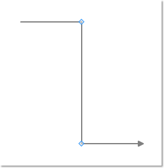

::: {style="DISPLAY: none"}
{#d2h_url_template}{#d2h_package_url style="WIDTH: 0px; DISPLAY: none; HEIGHT: 0px"}
:::

::: {.d2h_secondary_topic style="PADDING-BOTTOM: 10pt; MARGIN: 0pt; PADDING-LEFT: 0pt; PADDING-RIGHT: 0pt; PADDING-TOP: 0pt"}
#### Hide Decorator Adorner {#hide-decorator-adorner style="tab-stops: 0pt"}

The user can hide the decorator adorner of a line connector by setting the **IsDecoratorVisible** property to False.

[]{style="FONT-FAMILY: 'Trebuchet MS','sans-serif'; COLOR: #15428b"} 

  -------------------- ------------------------------------------------------------------------------------- ---------------------- ------------------------ ---------------------------------------------------
  Property             Description                                                                           Type of the property   Value it accepts         Any other dependencies/ sub properties associated
  IsDecoratorVisible   Gets or sets a value indicating whether this instance is decorator adorner visible.   Dependency property    Boolean (true / false)   No
  -------------------- ------------------------------------------------------------------------------------- ---------------------- ------------------------ ---------------------------------------------------

[]{style="FONT-FAMILY: 'Trebuchet MS','sans-serif'; COLOR: #15428b; FONT-SIZE: 9pt"} 

[]{style="FONT-FAMILY: 'Trebuchet MS','sans-serif'; COLOR: #15428b; FONT-SIZE: 9pt"} 

+--------------------------------------------------------------------------------------------------------------------------------------------------------------------------------------+
| **[\[C#\]]{style="FONT-FAMILY: 'Courier New'; COLOR: black"}**                                                                                                                       |
|                                                                                                                                                                                      |
|                                                                                                                                                                                      |
|                                                                                                                                                                                      |
| [LineConnector]{style="FONT-FAMILY: 'Courier New'; COLOR: #2b91af"}[ lc = [new]{style="COLOR: blue"} [LineConnector]{style="COLOR: #2b91af"}();]{style="FONT-FAMILY: 'Courier New'"} |
|                                                                                                                                                                                      |
| [lc.ConnectorType = [ConnectorType]{style="COLOR: #2b91af"}.Straight;]{style="FONT-FAMILY: 'Courier New'"}                                                                           |
|                                                                                                                                                                                      |
| [lc.StartPointPosition = [new]{style="COLOR: blue"} [Point]{style="COLOR: #2b91af"}(100, 100);]{style="FONT-FAMILY: 'Courier New'"}                                                  |
|                                                                                                                                                                                      |
| [lc.EndPointPosition = [new]{style="COLOR: blue"} [Point]{style="COLOR: #2b91af"}(300, 300);]{style="FONT-FAMILY: 'Courier New'"}                                                    |
|                                                                                                                                                                                      |
| [lc.IntermediatePoints.Add([new]{style="COLOR: blue"} [Point]{style="COLOR: #2b91af"}(200, 100));]{style="FONT-FAMILY: 'Courier New'"}                                               |
|                                                                                                                                                                                      |
| [lc.IntermediatePoints.Add([new]{style="COLOR: blue"} [Point]{style="COLOR: #2b91af"}(200, 300));]{style="FONT-FAMILY: 'Courier New'"}                                               |
|                                                                                                                                                                                      |
| [lc.IsDecoratorVisible = [false]{style="COLOR: blue"}; ]{style="FONT-FAMILY: 'Courier New'"}                                                                                         |
|                                                                                                                                                                                      |
| []{style="FONT-FAMILY: 'Courier New'"}                                                                                                                                               |
+--------------------------------------------------------------------------------------------------------------------------------------------------------------------------------------+

***[]{style="FONT-FAMILY: 'Trebuchet MS','sans-serif'; COLOR: #15428b; FONT-SIZE: 9pt"}*** 

+------------------------------------------------------------------------------------------------------------------------------------------------------------------------------------------------+
| **[\[VB\]]{style="FONT-FAMILY: 'Courier New'; COLOR: black"}**                                                                                                                                 |
|                                                                                                                                                                                                |
|                                                                                                                                                                                                |
|                                                                                                                                                                                                |
| [Dim]{style="FONT-FAMILY: 'Courier New'; COLOR: blue"}[ lc [As]{style="COLOR: blue"} [New]{style="COLOR: blue"} [LineConnector]{style="COLOR: #2b91af"}()]{style="FONT-FAMILY: 'Courier New'"} |
|                                                                                                                                                                                                |
| [lc.ConnectorType = ConnectorType.Straight]{style="FONT-FAMILY: 'Courier New'"}                                                                                                                |
|                                                                                                                                                                                                |
| [lc.StartPointPosition = [New]{style="COLOR: blue"} Point(100, 100)]{style="FONT-FAMILY: 'Courier New'"}                                                                                       |
|                                                                                                                                                                                                |
| [lc.EndPointPosition = [New]{style="COLOR: blue"} Point(300, 300)]{style="FONT-FAMILY: 'Courier New'"}                                                                                         |
|                                                                                                                                                                                                |
| [lc.IntermediatePoints.Add(New Point(200, 100))]{style="FONT-FAMILY: 'Courier New'"}                                                                                                           |
|                                                                                                                                                                                                |
| [lc.IntermediatePoints.Add(New Point(200, 300))]{style="FONT-FAMILY: 'Courier New'"}                                                                                                           |
|                                                                                                                                                                                                |
| [lc.IsDecoratorVisible = [False]{style="COLOR: blue"}]{style="FONT-FAMILY: 'Courier New'"}                                                                                                     |
|                                                                                                                                                                                                |
| []{style="FONT-FAMILY: 'Courier New'"}                                                                                                                                                         |
+------------------------------------------------------------------------------------------------------------------------------------------------------------------------------------------------+

***[]{style="FONT-FAMILY: 'Trebuchet MS','sans-serif'; COLOR: #15428b; FONT-SIZE: 9pt"}*** 

{border="0"}

Figure 64:Decorator Adorner Style not visible

 

[]{#related-topics}
:::
