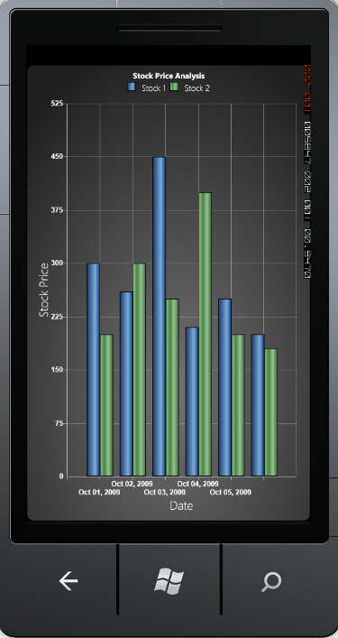

::: {style="DISPLAY: none"}
{#d2h_url_template}{#d2h_package_url style="WIDTH: 0px; DISPLAY: none; HEIGHT: 0px"}
:::

::: {.d2h_secondary_topic style="PADDING-BOTTOM: 10pt; MARGIN: 0pt; PADDING-LEFT: 0pt; PADDING-RIGHT: 0pt; PADDING-TOP: 0pt"}
##### Hide Partial Labels {#hide-partial-labels style="tab-stops: 0pt"}

[]{#p95}[]{style="COLOR: #15428b"} 

The HidePartialLabel property can be used to hide the axis labels that appear partially in the chart area. Usually labels in the edges are affected. If this property is set to True, the partially displayed labels will be hidden.

[]{style="COLOR: #15428b"} 

+-------------------------------------------------------------------------------------------------------------------------------------------------------------------------------------------------------------------------------------------------------------------------------------------------------------------------------------------------------------------------------------------------------------------------------------------------------------------------------------+
| [\[XAML\]]{style="FONT-FAMILY: 'Courier New'"}                                                                                                                                                                                                                                                                                                                                                                                                                                      |
|                                                                                                                                                                                                                                                                                                                                                                                                                                                                                     |
| **[]{style="FONT-FAMILY: 'Courier New'"}**                                                                                                                                                                                                                                                                                                                                                                                                                                          |
|                                                                                                                                                                                                                                                                                                                                                                                                                                                                                     |
| [\<]{style="FONT-FAMILY: 'Courier New'; COLOR: blue"}[syncfusion:ChartArea.PrimaryAxis]{style="FONT-FAMILY: 'Courier New'; COLOR: #a31515"}[\>]{style="FONT-FAMILY: 'Courier New'; COLOR: blue"}                                                                                                                                                                                                                                                                                    |
|                                                                                                                                                                                                                                                                                                                                                                                                                                                                                     |
| [  \<]{style="FONT-FAMILY: 'Courier New'; COLOR: blue"}[syncfusion:ChartAxis]{style="FONT-FAMILY: 'Courier New'; COLOR: #a31515"}[ ]{style="FONT-FAMILY: 'Courier New'; COLOR: blue"}[HidePartialLabel]{style="FONT-FAMILY: 'Courier New'; COLOR: red"}[=]{style="FONT-FAMILY: 'Courier New'; COLOR: blue"}[\"[True]{style="COLOR: blue"}\"[\>\</]{style="COLOR: blue"}[syncfusion:ChartAxis]{style="COLOR: #a31515"}[\>]{style="COLOR: blue"}]{style="FONT-FAMILY: 'Courier New'"} |
|                                                                                                                                                                                                                                                                                                                                                                                                                                                                                     |
| [\</]{style="FONT-FAMILY: 'Courier New'; COLOR: blue"}[syncfusion:ChartArea.PrimaryAxis]{style="FONT-FAMILY: 'Courier New'; COLOR: #a31515"}[\>]{style="FONT-FAMILY: 'Courier New'; COLOR: blue"}                                                                                                                                                                                                                                                                                   |
+-------------------------------------------------------------------------------------------------------------------------------------------------------------------------------------------------------------------------------------------------------------------------------------------------------------------------------------------------------------------------------------------------------------------------------------------------------------------------------------+

[]{style="COLOR: #15428b"} 

+------------------------------------------------------------------------------------------------+
| [\[C#\]]{style="FONT-FAMILY: 'Courier New'"}                                                   |
|                                                                                                |
| []{style="FONT-FAMILY: 'Courier New'"}                                                         |
|                                                                                                |
| [ChartArea area = [new]{style="COLOR: blue"} ChartArea();]{style="FONT-FAMILY: 'Courier New'"} |
|                                                                                                |
| [ChartAxis axis = [new]{style="COLOR: blue"} ChartAxis();]{style="FONT-FAMILY: 'Courier New'"} |
|                                                                                                |
| [axis.HidePartialLabel = [true]{style="COLOR: blue"};]{style="FONT-FAMILY: 'Courier New'"}     |
|                                                                                                |
| [area.PrimaryAxis = axis;]{style="FONT-FAMILY: 'Courier New'"}                                 |
+------------------------------------------------------------------------------------------------+

**[]{style="COLOR: #15428b"}** 

{border="0"}

 

Figure 93 : HidePartialLabel = \"True\"**[]{style="COLOR: #15428b"}**

**[]{style="COLOR: #15428b"}** 

 

[]{#related-topics}
:::
