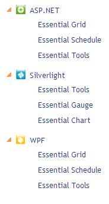

::: {style="DISPLAY: none"}
{#d2h_url_template}{#d2h_package_url style="WIDTH: 0px; DISPLAY: none; HEIGHT: 0px"}
:::

:::: {.d2h_secondary_topic style="PADDING-BOTTOM: 10pt; MARGIN: 0pt; PADDING-LEFT: 0pt; PADDING-RIGHT: 0pt; PADDING-TOP: 0pt"}
#### Hiding Tree-View Lines {#hiding-tree-view-lines style="tab-stops: 0pt"}

The tree-view control supports displaying or hiding the lines between nodes.

 

Properties

 

::: {align="center"}
  ----------- --------------------------------------------------------------------------- ---------------------------------- ---------------------------------------- -----------
  Name        Description                                                                 Type of property                   Value it accepts                         Dependecy
  ShowLines   When set to False, this property hides the tree-view lines between nodes.   [bool]{style="FONT-SIZE: 9.5pt"}   [True/False]{style="FONT-SIZE: 9.5pt"}   NA
  ----------- --------------------------------------------------------------------------- ---------------------------------- ---------------------------------------- -----------
:::

*[[]{style="TEXT-DECORATION: none"}]{.underline}* 

**[]{style="FONT-FAMILY: 'Calibri','sans-serif'; FONT-SIZE: 12pt"}** 

Using Builder

The following steps explain how to hide the lines between tree-view nodes through the builder.

1.   In **View**, create a *ul-li* hierarchy of tree-view nodes and invoke the tree-view helper with the control ID as the first argument and the tree-view content ID as the second argument, followed by the **ShowLines** method with False as an argument.

**[]{style="FONT-FAMILY: 'Calibri','sans-serif'"}** 

+--------------------------------------------------------------------------------------------------------------------------------------------------------------------------------------------------------------------------------------------------------------------------------------------------------------------------------------------------+
| **View\[ASPX\]**                                                                                                                                                                                                                                                                                                                                 |
|                                                                                                                                                                                                                                                                                                                                                  |
|                                                                                                                                                                                                                                                                                                                                                  |
|                                                                                                                                                                                                                                                                                                                                                  |
| [\<]{style="FONT-FAMILY: 'Courier New'; COLOR: blue"}[ul]{style="FONT-FAMILY: 'Courier New'; COLOR: maroon"}[ [id]{style="COLOR: red"}[=\"treeViewContents\"]{style="COLOR: blue"} [style]{style="COLOR: red"}[=\"]{style="COLOR: blue"}[visibility]{style="COLOR: red"}[: hidden\"\>]{style="COLOR: blue"}]{style="FONT-FAMILY: 'Courier New'"} |
|                                                                                                                                                                                                                                                                                                                                                  |
| [    [\<]{style="COLOR: blue"}[li]{style="COLOR: maroon"} [id]{style="COLOR: red"}[=\"ASP.NET\"\>]{style="COLOR: blue"}]{style="FONT-FAMILY: 'Courier New'"}                                                                                                                                                                                     |
|                                                                                                                                                                                                                                                                                                                                                  |
| [        [\<]{style="COLOR: blue"}[img]{style="COLOR: maroon"} [src]{style="COLOR: red"}[=\']{style="COLOR: blue"}[\<%]{style="BACKGROUND: yellow"}[=]{style="COLOR: blue"} Url.Content(\"\~/Images/asp.png\")[%\>]{style="BACKGROUND: yellow"}[\']{style="COLOR: blue"} [/\>]{style="COLOR: blue"}]{style="FONT-FAMILY: 'Courier New'"}         |
|                                                                                                                                                                                                                                                                                                                                                  |
| [  ]{style="FONT-FAMILY: 'Courier New'; COLOR: blue"}[ASP.NET]{style="FONT-FAMILY: 'Courier New'"}                                                                                                                                                                                                                                               |
|                                                                                                                                                                                                                                                                                                                                                  |
| [         [\<]{style="COLOR: blue"}[ul]{style="COLOR: maroon"}[\>]{style="COLOR: blue"}]{style="FONT-FAMILY: 'Courier New'"}                                                                                                                                                                                                                     |
|                                                                                                                                                                                                                                                                                                                                                  |
| [            [\<]{style="COLOR: blue"}[li]{style="COLOR: maroon"} [id]{style="COLOR: red"}[=\"aspGrid\"\>]{style="COLOR: blue"}Essential Grid[\</]{style="COLOR: blue"}[li]{style="COLOR: maroon"}[\>]{style="COLOR: blue"}]{style="FONT-FAMILY: 'Courier New'"}                                                                                 |
|                                                                                                                                                                                                                                                                                                                                                  |
| [            [\<]{style="COLOR: blue"}[li]{style="COLOR: maroon"} [id]{style="COLOR: red"}[=\"aspSchedule\"\>]{style="COLOR: blue"}Essential Schedule[\</]{style="COLOR: blue"}[li]{style="COLOR: maroon"}[\>]{style="COLOR: blue"}]{style="FONT-FAMILY: 'Courier New'"}                                                                         |
|                                                                                                                                                                                                                                                                                                                                                  |
| [            [\<]{style="COLOR: blue"}[li]{style="COLOR: maroon"} [id]{style="COLOR: red"}[=\"aspTools\"\>]{style="COLOR: blue"}Essential Tools[\</]{style="COLOR: blue"}[li]{style="COLOR: maroon"}[\>]{style="COLOR: blue"}]{style="FONT-FAMILY: 'Courier New'"}                                                                               |
|                                                                                                                                                                                                                                                                                                                                                  |
| [         [\</]{style="COLOR: blue"}[ul]{style="COLOR: maroon"}[\>]{style="COLOR: blue"}]{style="FONT-FAMILY: 'Courier New'"}                                                                                                                                                                                                                    |
|                                                                                                                                                                                                                                                                                                                                                  |
| [    [\</]{style="COLOR: blue"}[li]{style="COLOR: maroon"}[\>]{style="COLOR: blue"}        ]{style="FONT-FAMILY: 'Courier New'"}                                                                                                                                                                                                                 |
|                                                                                                                                                                                                                                                                                                                                                  |
| [    [\<]{style="COLOR: blue"}[li]{style="COLOR: maroon"} [id]{style="COLOR: red"}[=\"Silverlight\"\>]{style="COLOR: blue"}]{style="FONT-FAMILY: 'Courier New'"}                                                                                                                                                                                 |
|                                                                                                                                                                                                                                                                                                                                                  |
| [        [\<]{style="COLOR: blue"}[img]{style="COLOR: maroon"} [src]{style="COLOR: red"}[=\']{style="COLOR: blue"}[\<%]{style="BACKGROUND: yellow"}[=]{style="COLOR: blue"} Url.Content(\"\~/Images/silverlight.png\")[%\>]{style="BACKGROUND: yellow"}[\']{style="COLOR: blue"} [/\>\                                                           |
| ]{style="COLOR: blue"}        Silverlight]{style="FONT-FAMILY: 'Courier New'"}                                                                                                                                                                                                                                                                   |
|                                                                                                                                                                                                                                                                                                                                                  |
| [        [\<]{style="COLOR: blue"}[ul]{style="COLOR: maroon"}[\>]{style="COLOR: blue"}]{style="FONT-FAMILY: 'Courier New'"}                                                                                                                                                                                                                      |
|                                                                                                                                                                                                                                                                                                                                                  |
| [           [\<]{style="COLOR: blue"}[li]{style="COLOR: maroon"} [id]{style="COLOR: red"}[=\"silverGrid\"\>]{style="COLOR: blue"}Essential Tools [\</]{style="COLOR: blue"}[li]{style="COLOR: maroon"}[\>]{style="COLOR: blue"}]{style="FONT-FAMILY: 'Courier New'"}                                                                             |
|                                                                                                                                                                                                                                                                                                                                                  |
| [           [\<]{style="COLOR: blue"}[li]{style="COLOR: maroon"} [id]{style="COLOR: red"}[=\"silverGauge\"\>]{style="COLOR: blue"}Essential Gauge [\</]{style="COLOR: blue"}[li]{style="COLOR: maroon"}[\>]{style="COLOR: blue"}]{style="FONT-FAMILY: 'Courier New'"}                                                                            |
|                                                                                                                                                                                                                                                                                                                                                  |
| [           [\<]{style="COLOR: blue"}[li]{style="COLOR: maroon"} [id]{style="COLOR: red"}[=\"silverChart\"\>]{style="COLOR: blue"}Essential Chart [\</]{style="COLOR: blue"}[li]{style="COLOR: maroon"}[\>]{style="COLOR: blue"}]{style="FONT-FAMILY: 'Courier New'"}                                                                            |
|                                                                                                                                                                                                                                                                                                                                                  |
| [        [\</]{style="COLOR: blue"}[ul]{style="COLOR: maroon"}[\>]{style="COLOR: blue"}]{style="FONT-FAMILY: 'Courier New'"}                                                                                                                                                                                                                     |
|                                                                                                                                                                                                                                                                                                                                                  |
| [    [\</]{style="COLOR: blue"}[li]{style="COLOR: maroon"}[\>]{style="COLOR: blue"}]{style="FONT-FAMILY: 'Courier New'"}                                                                                                                                                                                                                         |
|                                                                                                                                                                                                                                                                                                                                                  |
| [    [\<]{style="COLOR: blue"}[li]{style="COLOR: maroon"} [id]{style="COLOR: red"}[=\"WPF\"\>]{style="COLOR: blue"}]{style="FONT-FAMILY: 'Courier New'"}                                                                                                                                                                                         |
|                                                                                                                                                                                                                                                                                                                                                  |
| [        [\<]{style="COLOR: blue"}[img]{style="COLOR: maroon"} [src]{style="COLOR: red"}[=\']{style="COLOR: blue"}[\<%]{style="BACKGROUND: yellow"}[=]{style="COLOR: blue"} Url.Content(\"\~/Images/wpf.png\")[%\>]{style="BACKGROUND: yellow"}[\']{style="COLOR: blue"} [/\>]{style="COLOR: blue"}WPF]{style="FONT-FAMILY: 'Courier New'"}      |
|                                                                                                                                                                                                                                                                                                                                                  |
| [        [\<]{style="COLOR: blue"}[ul]{style="COLOR: maroon"}[\>]{style="COLOR: blue"}]{style="FONT-FAMILY: 'Courier New'"}                                                                                                                                                                                                                      |
|                                                                                                                                                                                                                                                                                                                                                  |
| [           [\<]{style="COLOR: blue"}[li]{style="COLOR: maroon"} [id]{style="COLOR: red"}[=\"wpfGrid\"\>]{style="COLOR: blue"}Essential Grid[\</]{style="COLOR: blue"}[li]{style="COLOR: maroon"}[\>]{style="COLOR: blue"}]{style="FONT-FAMILY: 'Courier New'"}                                                                                  |
|                                                                                                                                                                                                                                                                                                                                                  |
| [           [\<]{style="COLOR: blue"}[li]{style="COLOR: maroon"} [id]{style="COLOR: red"}[=\"wpfSchedule\"\>]{style="COLOR: blue"}Essential Schedule[\</]{style="COLOR: blue"}[li]{style="COLOR: maroon"}[\>]{style="COLOR: blue"}]{style="FONT-FAMILY: 'Courier New'"}                                                                          |
|                                                                                                                                                                                                                                                                                                                                                  |
| [            [\<]{style="COLOR: blue"}[li]{style="COLOR: maroon"} [id]{style="COLOR: red"}[=\"wpfTools\"\>]{style="COLOR: blue"}Essential Tools[\</]{style="COLOR: blue"}[li]{style="COLOR: maroon"}[\>]{style="COLOR: blue"}]{style="FONT-FAMILY: 'Courier New'"}                                                                               |
|                                                                                                                                                                                                                                                                                                                                                  |
| [        [\</]{style="COLOR: blue"}[ul]{style="COLOR: maroon"}[\>]{style="COLOR: blue"}]{style="FONT-FAMILY: 'Courier New'"}                                                                                                                                                                                                                     |
|                                                                                                                                                                                                                                                                                                                                                  |
| [     [\</]{style="COLOR: blue"}[li]{style="COLOR: maroon"}[\>]{style="COLOR: blue"}]{style="FONT-FAMILY: 'Courier New'"}                                                                                                                                                                                                                        |
|                                                                                                                                                                                                                                                                                                                                                  |
| [\</]{style="FONT-FAMILY: 'Courier New'; COLOR: blue"}[ul]{style="FONT-FAMILY: 'Courier New'; COLOR: maroon"}[\>]{style="FONT-FAMILY: 'Courier New'; COLOR: blue"}[]{style="FONT-FAMILY: 'Courier New'"}                                                                                                                                         |
|                                                                                                                                                                                                                                                                                                                                                  |
| [\<%]{style="FONT-FAMILY: 'Courier New'; BACKGROUND: yellow"}[=]{style="FONT-FAMILY: 'Courier New'; COLOR: blue"}[Html.Syncfusion().TreeView([\"myTreeView\"]{style="COLOR: #a31515"}, [\"treeViewContents\"]{style="COLOR: #a31515"})]{style="FONT-FAMILY: 'Courier New'"}                                                                      |
|                                                                                                                                                                                                                                                                                                                                                  |
| [                  .Skin([TreeViewSkin]{style="COLOR: #2b91af"}.Office2007Blue)]{style="FONT-FAMILY: 'Courier New'"}                                                                                                                                                                                                                             |
|                                                                                                                                                                                                                                                                                                                                                  |
| [                  **.ShowLines([false]{style="COLOR: blue"})**[%\>]{style="BACKGROUND: yellow"}]{style="FONT-FAMILY: 'Courier New'"}                                                                                                                                                                                                            |
|                                                                                                                                                                                                                                                                                                                                                  |
| []{style="FONT-FAMILY: 'Courier New'; BACKGROUND: yellow"}                                                                                                                                                                                                                                                                                       |
+--------------------------------------------------------------------------------------------------------------------------------------------------------------------------------------------------------------------------------------------------------------------------------------------------------------------------------------------------+

**[]{style="FONT-FAMILY: 'Calibri','sans-serif'"}** 

**[]{style="FONT-FAMILY: 'Calibri','sans-serif'"}** 

+--------------------------------------------------------------------------------------------------------------------------------------------------------------------------------------------------------------------------------------------------------------------------------------------------------------------------------------------------+
| **View\[cshtml\]**                                                                                                                                                                                                                                                                                                                               |
|                                                                                                                                                                                                                                                                                                                                                  |
| **[]{style="FONT-FAMILY: 'Courier New'"}**                                                                                                                                                                                                                                                                                                       |
|                                                                                                                                                                                                                                                                                                                                                  |
| [\<]{style="FONT-FAMILY: 'Courier New'; COLOR: blue"}[ul]{style="FONT-FAMILY: 'Courier New'; COLOR: maroon"}[ [id]{style="COLOR: red"}[=\"treeViewContents\"]{style="COLOR: blue"} [style]{style="COLOR: red"}[=\"]{style="COLOR: blue"}[visibility]{style="COLOR: red"}[: hidden\"\>]{style="COLOR: blue"}]{style="FONT-FAMILY: 'Courier New'"} |
|                                                                                                                                                                                                                                                                                                                                                  |
| [    [\<]{style="COLOR: blue"}[li]{style="COLOR: maroon"} [id]{style="COLOR: red"}[=\"ASP.NET\"\>]{style="COLOR: blue"}]{style="FONT-FAMILY: 'Courier New'"}                                                                                                                                                                                     |
|                                                                                                                                                                                                                                                                                                                                                  |
| [        [\<]{style="COLOR: blue"}[img]{style="COLOR: maroon"} [src]{style="COLOR: red"}[=\']{style="COLOR: blue"}[@]{style="BACKGROUND: yellow"}Url.Content(\"\~/Images/asp.png\")[\']{style="COLOR: blue"} [/\>]{style="COLOR: blue"}]{style="FONT-FAMILY: 'Courier New'"}                                                                     |
|                                                                                                                                                                                                                                                                                                                                                  |
| [  ]{style="FONT-FAMILY: 'Courier New'; COLOR: blue"}[ASP.NET]{style="FONT-FAMILY: 'Courier New'"}                                                                                                                                                                                                                                               |
|                                                                                                                                                                                                                                                                                                                                                  |
| [         [\<]{style="COLOR: blue"}[ul]{style="COLOR: maroon"}[\>]{style="COLOR: blue"}]{style="FONT-FAMILY: 'Courier New'"}                                                                                                                                                                                                                     |
|                                                                                                                                                                                                                                                                                                                                                  |
| [            [\<]{style="COLOR: blue"}[li]{style="COLOR: maroon"} [id]{style="COLOR: red"}[=\"aspGrid\"\>]{style="COLOR: blue"}Essential Grid[\</]{style="COLOR: blue"}[li]{style="COLOR: maroon"}[\>]{style="COLOR: blue"}]{style="FONT-FAMILY: 'Courier New'"}                                                                                 |
|                                                                                                                                                                                                                                                                                                                                                  |
| [            [\<]{style="COLOR: blue"}[li]{style="COLOR: maroon"} [id]{style="COLOR: red"}[=\"aspSchedule\"\>]{style="COLOR: blue"}Essential Schedule[\</]{style="COLOR: blue"}[li]{style="COLOR: maroon"}[\>]{style="COLOR: blue"}]{style="FONT-FAMILY: 'Courier New'"}                                                                         |
|                                                                                                                                                                                                                                                                                                                                                  |
| [            [\<]{style="COLOR: blue"}[li]{style="COLOR: maroon"} [id]{style="COLOR: red"}[=\"aspTools\"\>]{style="COLOR: blue"}Essential Tools[\</]{style="COLOR: blue"}[li]{style="COLOR: maroon"}[\>]{style="COLOR: blue"}]{style="FONT-FAMILY: 'Courier New'"}                                                                               |
|                                                                                                                                                                                                                                                                                                                                                  |
| [         [\</]{style="COLOR: blue"}[ul]{style="COLOR: maroon"}[\>]{style="COLOR: blue"}]{style="FONT-FAMILY: 'Courier New'"}                                                                                                                                                                                                                    |
|                                                                                                                                                                                                                                                                                                                                                  |
| [    [\</]{style="COLOR: blue"}[li]{style="COLOR: maroon"}[\>]{style="COLOR: blue"}        ]{style="FONT-FAMILY: 'Courier New'"}                                                                                                                                                                                                                 |
|                                                                                                                                                                                                                                                                                                                                                  |
| [    [\<]{style="COLOR: blue"}[li]{style="COLOR: maroon"} [id]{style="COLOR: red"}[=\"Silverlight\"\>]{style="COLOR: blue"}]{style="FONT-FAMILY: 'Courier New'"}                                                                                                                                                                                 |
|                                                                                                                                                                                                                                                                                                                                                  |
| [        [\<]{style="COLOR: blue"}[img]{style="COLOR: maroon"} [src]{style="COLOR: red"}[=\']{style="COLOR: blue"}[@]{style="BACKGROUND: yellow"}Url.Content(\"\~/Images/silverlight.png\")[\']{style="COLOR: blue"} [/\>\                                                                                                                       |
| ]{style="COLOR: blue"}        Silverlight]{style="FONT-FAMILY: 'Courier New'"}                                                                                                                                                                                                                                                                   |
|                                                                                                                                                                                                                                                                                                                                                  |
| [        [\<]{style="COLOR: blue"}[ul]{style="COLOR: maroon"}[\>]{style="COLOR: blue"}]{style="FONT-FAMILY: 'Courier New'"}                                                                                                                                                                                                                      |
|                                                                                                                                                                                                                                                                                                                                                  |
| [           [\<]{style="COLOR: blue"}[li]{style="COLOR: maroon"} [id]{style="COLOR: red"}[=\"silverGrid\"\>]{style="COLOR: blue"}Essential Tools [\</]{style="COLOR: blue"}[li]{style="COLOR: maroon"}[\>]{style="COLOR: blue"}]{style="FONT-FAMILY: 'Courier New'"}                                                                             |
|                                                                                                                                                                                                                                                                                                                                                  |
| [           [\<]{style="COLOR: blue"}[li]{style="COLOR: maroon"} [id]{style="COLOR: red"}[=\"silverGauge\"\>]{style="COLOR: blue"}Essential Gauge [\</]{style="COLOR: blue"}[li]{style="COLOR: maroon"}[\>]{style="COLOR: blue"}]{style="FONT-FAMILY: 'Courier New'"}                                                                            |
|                                                                                                                                                                                                                                                                                                                                                  |
| [           [\<]{style="COLOR: blue"}[li]{style="COLOR: maroon"} [id]{style="COLOR: red"}[=\"silverChart\"\>]{style="COLOR: blue"}Essential Chart [\</]{style="COLOR: blue"}[li]{style="COLOR: maroon"}[\>]{style="COLOR: blue"}]{style="FONT-FAMILY: 'Courier New'"}                                                                            |
|                                                                                                                                                                                                                                                                                                                                                  |
| [        [\</]{style="COLOR: blue"}[ul]{style="COLOR: maroon"}[\>]{style="COLOR: blue"}]{style="FONT-FAMILY: 'Courier New'"}                                                                                                                                                                                                                     |
|                                                                                                                                                                                                                                                                                                                                                  |
| [    [\</]{style="COLOR: blue"}[li]{style="COLOR: maroon"}[\>]{style="COLOR: blue"}]{style="FONT-FAMILY: 'Courier New'"}                                                                                                                                                                                                                         |
|                                                                                                                                                                                                                                                                                                                                                  |
| [    [\<]{style="COLOR: blue"}[li]{style="COLOR: maroon"} [id]{style="COLOR: red"}[=\"WPF\"\>]{style="COLOR: blue"}]{style="FONT-FAMILY: 'Courier New'"}                                                                                                                                                                                         |
|                                                                                                                                                                                                                                                                                                                                                  |
| [        [\<]{style="COLOR: blue"}[img]{style="COLOR: maroon"} [src]{style="COLOR: red"}[=\']{style="COLOR: blue"}[@]{style="BACKGROUND: yellow"}Url.Content(\"\~/Images/wpf.png\")[\']{style="COLOR: blue"} [/\>]{style="COLOR: blue"}WPF]{style="FONT-FAMILY: 'Courier New'"}                                                                  |
|                                                                                                                                                                                                                                                                                                                                                  |
| [        [\<]{style="COLOR: blue"}[ul]{style="COLOR: maroon"}[\>]{style="COLOR: blue"}]{style="FONT-FAMILY: 'Courier New'"}                                                                                                                                                                                                                      |
|                                                                                                                                                                                                                                                                                                                                                  |
| [           [\<]{style="COLOR: blue"}[li]{style="COLOR: maroon"} [id]{style="COLOR: red"}[=\"wpfGrid\"\>]{style="COLOR: blue"}Essential Grid[\</]{style="COLOR: blue"}[li]{style="COLOR: maroon"}[\>]{style="COLOR: blue"}]{style="FONT-FAMILY: 'Courier New'"}                                                                                  |
|                                                                                                                                                                                                                                                                                                                                                  |
| [           [\<]{style="COLOR: blue"}[li]{style="COLOR: maroon"} [id]{style="COLOR: red"}[=\"wpfSchedule\"\>]{style="COLOR: blue"}Essential Schedule[\</]{style="COLOR: blue"}[li]{style="COLOR: maroon"}[\>]{style="COLOR: blue"}]{style="FONT-FAMILY: 'Courier New'"}                                                                          |
|                                                                                                                                                                                                                                                                                                                                                  |
| [            [\<]{style="COLOR: blue"}[li]{style="COLOR: maroon"} [id]{style="COLOR: red"}[=\"wpfTools\"\>]{style="COLOR: blue"}Essential Tools[\</]{style="COLOR: blue"}[li]{style="COLOR: maroon"}[\>]{style="COLOR: blue"}]{style="FONT-FAMILY: 'Courier New'"}                                                                               |
|                                                                                                                                                                                                                                                                                                                                                  |
| [        [\</]{style="COLOR: blue"}[ul]{style="COLOR: maroon"}[\>]{style="COLOR: blue"}]{style="FONT-FAMILY: 'Courier New'"}                                                                                                                                                                                                                     |
|                                                                                                                                                                                                                                                                                                                                                  |
| [     [\</]{style="COLOR: blue"}[li]{style="COLOR: maroon"}[\>]{style="COLOR: blue"}]{style="FONT-FAMILY: 'Courier New'"}                                                                                                                                                                                                                        |
|                                                                                                                                                                                                                                                                                                                                                  |
| [\</]{style="FONT-FAMILY: 'Courier New'; COLOR: blue"}[ul]{style="FONT-FAMILY: 'Courier New'; COLOR: maroon"}[\>]{style="FONT-FAMILY: 'Courier New'; COLOR: blue"}[]{style="FONT-FAMILY: 'Courier New'"}                                                                                                                                         |
|                                                                                                                                                                                                                                                                                                                                                  |
| [\@{]{style="FONT-FAMILY: 'Courier New'; BACKGROUND: yellow"}[ Html.Syncfusion().TreeView([\"myTreeView\"]{style="COLOR: #a31515"}, [\"treeViewContents\"]{style="COLOR: #a31515"})]{style="FONT-FAMILY: 'Courier New'"}                                                                                                                         |
|                                                                                                                                                                                                                                                                                                                                                  |
| [                  .Skin([TreeViewSkin]{style="COLOR: #2b91af"}.Office2007Blue)]{style="FONT-FAMILY: 'Courier New'"}                                                                                                                                                                                                                             |
|                                                                                                                                                                                                                                                                                                                                                  |
| [                  **.ShowLines([false]{style="COLOR: blue"})**.Render();[}]{style="BACKGROUND: yellow"}]{style="FONT-FAMILY: 'Courier New'"}                                                                                                                                                                                                    |
+--------------------------------------------------------------------------------------------------------------------------------------------------------------------------------------------------------------------------------------------------------------------------------------------------------------------------------------------------+

[]{style="FONT-FAMILY: Consolas; BACKGROUND: yellow; FONT-SIZE: 9.5pt"} 

 

**[]{style="FONT-FAMILY: 'Calibri','sans-serif'"}** 

 

2.   Build and run the application.

 

Using Properties Model

The following steps explain how to hide the lines between tree-view nodes through the properties model.

1.   In the controller, create an instance of **TreeViewModel**.

2.   Reset the **ShowLines** property and pass the instance through the **view-specific data** to the **View**.

**[]{style="FONT-FAMILY: 'Calibri','sans-serif'"}** 

+---------------------------------------------------------------------------------------------------------------------------------------------------------------------------+
| **[\[Controller\]]{style="FONT-FAMILY: 'Courier New'"}**                                                                                                                  |
|                                                                                                                                                                           |
| [public]{style="FONT-FAMILY: 'Courier New'; COLOR: blue"}[ [ActionResult]{style="COLOR: #2b91af"} Index()]{style="FONT-FAMILY: 'Courier New'"}                            |
|                                                                                                                                                                           |
| [        {]{style="FONT-FAMILY: 'Courier New'"}                                                                                                                           |
|                                                                                                                                                                           |
| [            [TreeViewModel]{style="COLOR: #2b91af"} myModel = [new]{style="COLOR: blue"} [TreeViewModel]{style="COLOR: #2b91af"}();]{style="FONT-FAMILY: 'Courier New'"} |
|                                                                                                                                                                           |
| [            myModel.Skin = [TreeViewSkin]{style="COLOR: #2b91af"}.Office2007Blue;]{style="FONT-FAMILY: 'Courier New'"}                                                   |
|                                                                                                                                                                           |
| [            myModel.ShowLines = [false]{style="COLOR: blue"};]{style="FONT-FAMILY: 'Courier New'"}                                                                       |
|                                                                                                                                                                           |
| []{style="FONT-FAMILY: 'Courier New'"}                                                                                                                                    |
|                                                                                                                                                                           |
| [            [//Pass the model through the view data to the view.]{style="COLOR: green"}]{style="FONT-FAMILY: 'Courier New'"}                                             |
|                                                                                                                                                                           |
| [            ViewData\[[\"myTreeView\"]{style="COLOR: #a31515"}\] = myModel;]{style="FONT-FAMILY: 'Courier New'"}                                                         |
|                                                                                                                                                                           |
| [            [return]{style="COLOR: blue"} View();]{style="FONT-FAMILY: 'Courier New'"}                                                                                   |
|                                                                                                                                                                           |
| [        }]{style="FONT-FAMILY: 'Courier New'"}                                                                                                                           |
|                                                                                                                                                                           |
| []{style="FONT-FAMILY: 'Courier New'; BACKGROUND: yellow"}                                                                                                                |
+---------------------------------------------------------------------------------------------------------------------------------------------------------------------------+

[]{style="FONT-FAMILY: Consolas; FONT-SIZE: 9.5pt"} 

3.   In **View**, create a *ul-li* hierarchy of tree-view nodes and invoke the tree-view helper by passing the **view data** key as the first argument and the **tree-view content ID** as the second argument.

**[]{style="FONT-FAMILY: 'Calibri','sans-serif'"}** 

+--------------------------------------------------------------------------------------------------------------------------------------------------------------------------------------------------------------------------------------------------------------------------------------------------------------------------------------------------+
| **View\[ASPX\]**                                                                                                                                                                                                                                                                                                                                 |
|                                                                                                                                                                                                                                                                                                                                                  |
| [\<]{style="FONT-FAMILY: 'Courier New'; COLOR: blue"}[ul]{style="FONT-FAMILY: 'Courier New'; COLOR: maroon"}[ [id]{style="COLOR: red"}[=\"treeViewContents\"]{style="COLOR: blue"} [style]{style="COLOR: red"}[=\"]{style="COLOR: blue"}[visibility]{style="COLOR: red"}[: hidden\"\>]{style="COLOR: blue"}]{style="FONT-FAMILY: 'Courier New'"} |
|                                                                                                                                                                                                                                                                                                                                                  |
| [    [\<]{style="COLOR: blue"}[li]{style="COLOR: maroon"} [id]{style="COLOR: red"}[=\"ASP.NET\"\>]{style="COLOR: blue"}]{style="FONT-FAMILY: 'Courier New'"}                                                                                                                                                                                     |
|                                                                                                                                                                                                                                                                                                                                                  |
| [        [\<]{style="COLOR: blue"}[img]{style="COLOR: maroon"} [src]{style="COLOR: red"}[=\']{style="COLOR: blue"}[\<%]{style="BACKGROUND: yellow"}[=]{style="COLOR: blue"} Url.Content(\"\~/Images/asp.png\")[%\>]{style="BACKGROUND: yellow"}[\']{style="COLOR: blue"} [/\>]{style="COLOR: blue"}]{style="FONT-FAMILY: 'Courier New'"}         |
|                                                                                                                                                                                                                                                                                                                                                  |
| [  ]{style="FONT-FAMILY: 'Courier New'; COLOR: blue"}[ASP.NET]{style="FONT-FAMILY: 'Courier New'"}                                                                                                                                                                                                                                               |
|                                                                                                                                                                                                                                                                                                                                                  |
| [         [\<]{style="COLOR: blue"}[ul]{style="COLOR: maroon"}[\>]{style="COLOR: blue"}]{style="FONT-FAMILY: 'Courier New'"}                                                                                                                                                                                                                     |
|                                                                                                                                                                                                                                                                                                                                                  |
| [            [\<]{style="COLOR: blue"}[li]{style="COLOR: maroon"} [id]{style="COLOR: red"}[=\"aspGrid\"\>]{style="COLOR: blue"}Essential Grid[\</]{style="COLOR: blue"}[li]{style="COLOR: maroon"}[\>]{style="COLOR: blue"}]{style="FONT-FAMILY: 'Courier New'"}                                                                                 |
|                                                                                                                                                                                                                                                                                                                                                  |
| [            [\<]{style="COLOR: blue"}[li]{style="COLOR: maroon"} [id]{style="COLOR: red"}[=\"aspSchedule\"\>]{style="COLOR: blue"}Essential Schedule[\</]{style="COLOR: blue"}[li]{style="COLOR: maroon"}[\>]{style="COLOR: blue"}]{style="FONT-FAMILY: 'Courier New'"}                                                                         |
|                                                                                                                                                                                                                                                                                                                                                  |
| [            [\<]{style="COLOR: blue"}[li]{style="COLOR: maroon"} [id]{style="COLOR: red"}[=\"aspTools\"\>]{style="COLOR: blue"}Essential Tools[\</]{style="COLOR: blue"}[li]{style="COLOR: maroon"}[\>]{style="COLOR: blue"}]{style="FONT-FAMILY: 'Courier New'"}                                                                               |
|                                                                                                                                                                                                                                                                                                                                                  |
| [         [\</]{style="COLOR: blue"}[ul]{style="COLOR: maroon"}[\>]{style="COLOR: blue"}]{style="FONT-FAMILY: 'Courier New'"}                                                                                                                                                                                                                    |
|                                                                                                                                                                                                                                                                                                                                                  |
| [    [\</]{style="COLOR: blue"}[li]{style="COLOR: maroon"}[\>]{style="COLOR: blue"}        ]{style="FONT-FAMILY: 'Courier New'"}                                                                                                                                                                                                                 |
|                                                                                                                                                                                                                                                                                                                                                  |
| [    [\<]{style="COLOR: blue"}[li]{style="COLOR: maroon"} [id]{style="COLOR: red"}[=\"Silverlight\"\>]{style="COLOR: blue"}]{style="FONT-FAMILY: 'Courier New'"}                                                                                                                                                                                 |
|                                                                                                                                                                                                                                                                                                                                                  |
| [        [\<]{style="COLOR: blue"}[img]{style="COLOR: maroon"} [src]{style="COLOR: red"}[=\']{style="COLOR: blue"}[\<%]{style="BACKGROUND: yellow"}[=]{style="COLOR: blue"} Url.Content(\"\~/Images/silverlight.png\")[%\>]{style="BACKGROUND: yellow"}[\']{style="COLOR: blue"} [/\>\                                                           |
| ]{style="COLOR: blue"}        Silverlight]{style="FONT-FAMILY: 'Courier New'"}                                                                                                                                                                                                                                                                   |
|                                                                                                                                                                                                                                                                                                                                                  |
| [        [\<]{style="COLOR: blue"}[ul]{style="COLOR: maroon"}[\>]{style="COLOR: blue"}]{style="FONT-FAMILY: 'Courier New'"}                                                                                                                                                                                                                      |
|                                                                                                                                                                                                                                                                                                                                                  |
| [           [\<]{style="COLOR: blue"}[li]{style="COLOR: maroon"} [id]{style="COLOR: red"}[=\"silverGrid\"\>]{style="COLOR: blue"}Essential Tools [\</]{style="COLOR: blue"}[li]{style="COLOR: maroon"}[\>]{style="COLOR: blue"}]{style="FONT-FAMILY: 'Courier New'"}                                                                             |
|                                                                                                                                                                                                                                                                                                                                                  |
| [           [\<]{style="COLOR: blue"}[li]{style="COLOR: maroon"} [id]{style="COLOR: red"}[=\"silverGauge\"\>]{style="COLOR: blue"}Essential Gauge [\</]{style="COLOR: blue"}[li]{style="COLOR: maroon"}[\>]{style="COLOR: blue"}]{style="FONT-FAMILY: 'Courier New'"}                                                                            |
|                                                                                                                                                                                                                                                                                                                                                  |
| [           [\<]{style="COLOR: blue"}[li]{style="COLOR: maroon"} [id]{style="COLOR: red"}[=\"silverChart\"\>]{style="COLOR: blue"}Essential Chart [\</]{style="COLOR: blue"}[li]{style="COLOR: maroon"}[\>]{style="COLOR: blue"}]{style="FONT-FAMILY: 'Courier New'"}                                                                            |
|                                                                                                                                                                                                                                                                                                                                                  |
| [        [\</]{style="COLOR: blue"}[ul]{style="COLOR: maroon"}[\>]{style="COLOR: blue"}]{style="FONT-FAMILY: 'Courier New'"}                                                                                                                                                                                                                     |
|                                                                                                                                                                                                                                                                                                                                                  |
| [    [\</]{style="COLOR: blue"}[li]{style="COLOR: maroon"}[\>]{style="COLOR: blue"}]{style="FONT-FAMILY: 'Courier New'"}                                                                                                                                                                                                                         |
|                                                                                                                                                                                                                                                                                                                                                  |
| [    [\<]{style="COLOR: blue"}[li]{style="COLOR: maroon"} [id]{style="COLOR: red"}[=\"WPF\"\>]{style="COLOR: blue"}]{style="FONT-FAMILY: 'Courier New'"}                                                                                                                                                                                         |
|                                                                                                                                                                                                                                                                                                                                                  |
| [        [\<]{style="COLOR: blue"}[img]{style="COLOR: maroon"} [src]{style="COLOR: red"}[=\']{style="COLOR: blue"}[\<%]{style="BACKGROUND: yellow"}[=]{style="COLOR: blue"} Url.Content(\"\~/Images/wpf.png\")[%\>]{style="BACKGROUND: yellow"}[\']{style="COLOR: blue"} [/\>]{style="COLOR: blue"}WPF]{style="FONT-FAMILY: 'Courier New'"}      |
|                                                                                                                                                                                                                                                                                                                                                  |
| [        [\<]{style="COLOR: blue"}[ul]{style="COLOR: maroon"}[\>]{style="COLOR: blue"}]{style="FONT-FAMILY: 'Courier New'"}                                                                                                                                                                                                                      |
|                                                                                                                                                                                                                                                                                                                                                  |
| [           [\<]{style="COLOR: blue"}[li]{style="COLOR: maroon"} [id]{style="COLOR: red"}[=\"wpfGrid\"\>]{style="COLOR: blue"}Essential Grid[\</]{style="COLOR: blue"}[li]{style="COLOR: maroon"}[\>]{style="COLOR: blue"}]{style="FONT-FAMILY: 'Courier New'"}                                                                                  |
|                                                                                                                                                                                                                                                                                                                                                  |
| [           [\<]{style="COLOR: blue"}[li]{style="COLOR: maroon"} [id]{style="COLOR: red"}[=\"wpfSchedule\"\>]{style="COLOR: blue"}Essential Schedule[\</]{style="COLOR: blue"}[li]{style="COLOR: maroon"}[\>]{style="COLOR: blue"}]{style="FONT-FAMILY: 'Courier New'"}                                                                          |
|                                                                                                                                                                                                                                                                                                                                                  |
| [            [\<]{style="COLOR: blue"}[li]{style="COLOR: maroon"} [id]{style="COLOR: red"}[=\"wpfTools\"\>]{style="COLOR: blue"}Essential Tools[\</]{style="COLOR: blue"}[li]{style="COLOR: maroon"}[\>]{style="COLOR: blue"}]{style="FONT-FAMILY: 'Courier New'"}                                                                               |
|                                                                                                                                                                                                                                                                                                                                                  |
| [        [\</]{style="COLOR: blue"}[ul]{style="COLOR: maroon"}[\>]{style="COLOR: blue"}]{style="FONT-FAMILY: 'Courier New'"}                                                                                                                                                                                                                     |
|                                                                                                                                                                                                                                                                                                                                                  |
| [     [\</]{style="COLOR: blue"}[li]{style="COLOR: maroon"}[\>]{style="COLOR: blue"}]{style="FONT-FAMILY: 'Courier New'"}                                                                                                                                                                                                                        |
|                                                                                                                                                                                                                                                                                                                                                  |
| [\</]{style="FONT-FAMILY: 'Courier New'; COLOR: blue"}[ul]{style="FONT-FAMILY: 'Courier New'; COLOR: maroon"}[\>]{style="FONT-FAMILY: 'Courier New'; COLOR: blue"}[]{style="FONT-FAMILY: 'Courier New'"}                                                                                                                                         |
|                                                                                                                                                                                                                                                                                                                                                  |
| []{style="FONT-FAMILY: 'Courier New'; BACKGROUND: yellow"}                                                                                                                                                                                                                                                                                       |
|                                                                                                                                                                                                                                                                                                                                                  |
| [\<%]{style="FONT-FAMILY: 'Courier New'; BACKGROUND: yellow"}[=]{style="FONT-FAMILY: 'Courier New'; COLOR: blue"}[Html.Syncfusion().TreeView([\"myTreeView\"]{style="COLOR: #a31515"}, [\"treeViewContents\"]{style="COLOR: #a31515"})[%\>]{style="BACKGROUND: yellow"}]{style="FONT-FAMILY: 'Courier New'"}                                     |
|                                                                                                                                                                                                                                                                                                                                                  |
| []{style="FONT-FAMILY: 'Courier New'; BACKGROUND: yellow"}                                                                                                                                                                                                                                                                                       |
+--------------------------------------------------------------------------------------------------------------------------------------------------------------------------------------------------------------------------------------------------------------------------------------------------------------------------------------------------+

**[]{style="FONT-FAMILY: 'Calibri','sans-serif'"}** 

+--------------------------------------------------------------------------------------------------------------------------------------------------------------------------------------------------------------------------------------------------------------------------------------------------------------------------------------------------+
| **View\[cshtml\]**                                                                                                                                                                                                                                                                                                                               |
|                                                                                                                                                                                                                                                                                                                                                  |
| **[]{style="FONT-FAMILY: 'Courier New'"}**                                                                                                                                                                                                                                                                                                       |
|                                                                                                                                                                                                                                                                                                                                                  |
| [\<]{style="FONT-FAMILY: 'Courier New'; COLOR: blue"}[ul]{style="FONT-FAMILY: 'Courier New'; COLOR: maroon"}[ [id]{style="COLOR: red"}[=\"treeViewContents\"]{style="COLOR: blue"} [style]{style="COLOR: red"}[=\"]{style="COLOR: blue"}[visibility]{style="COLOR: red"}[: hidden\"\>]{style="COLOR: blue"}]{style="FONT-FAMILY: 'Courier New'"} |
|                                                                                                                                                                                                                                                                                                                                                  |
| [    [\<]{style="COLOR: blue"}[li]{style="COLOR: maroon"} [id]{style="COLOR: red"}[=\"ASP.NET\"\>]{style="COLOR: blue"}]{style="FONT-FAMILY: 'Courier New'"}                                                                                                                                                                                     |
|                                                                                                                                                                                                                                                                                                                                                  |
| [        [\<]{style="COLOR: blue"}[img]{style="COLOR: maroon"} [src]{style="COLOR: red"}[=\']{style="COLOR: blue"}[@]{style="BACKGROUND: yellow"}Url.Content(\"\~/Images/asp.png\")[\']{style="COLOR: blue"} [/\>]{style="COLOR: blue"}]{style="FONT-FAMILY: 'Courier New'"}                                                                     |
|                                                                                                                                                                                                                                                                                                                                                  |
| [  ]{style="FONT-FAMILY: 'Courier New'; COLOR: blue"}[ASP.NET]{style="FONT-FAMILY: 'Courier New'"}                                                                                                                                                                                                                                               |
|                                                                                                                                                                                                                                                                                                                                                  |
| [         [\<]{style="COLOR: blue"}[ul]{style="COLOR: maroon"}[\>]{style="COLOR: blue"}]{style="FONT-FAMILY: 'Courier New'"}                                                                                                                                                                                                                     |
|                                                                                                                                                                                                                                                                                                                                                  |
| [            [\<]{style="COLOR: blue"}[li]{style="COLOR: maroon"} [id]{style="COLOR: red"}[=\"aspGrid\"\>]{style="COLOR: blue"}Essential Grid[\</]{style="COLOR: blue"}[li]{style="COLOR: maroon"}[\>]{style="COLOR: blue"}]{style="FONT-FAMILY: 'Courier New'"}                                                                                 |
|                                                                                                                                                                                                                                                                                                                                                  |
| [            [\<]{style="COLOR: blue"}[li]{style="COLOR: maroon"} [id]{style="COLOR: red"}[=\"aspSchedule\"\>]{style="COLOR: blue"}Essential Schedule[\</]{style="COLOR: blue"}[li]{style="COLOR: maroon"}[\>]{style="COLOR: blue"}]{style="FONT-FAMILY: 'Courier New'"}                                                                         |
|                                                                                                                                                                                                                                                                                                                                                  |
| [            [\<]{style="COLOR: blue"}[li]{style="COLOR: maroon"} [id]{style="COLOR: red"}[=\"aspTools\"\>]{style="COLOR: blue"}Essential Tools[\</]{style="COLOR: blue"}[li]{style="COLOR: maroon"}[\>]{style="COLOR: blue"}]{style="FONT-FAMILY: 'Courier New'"}                                                                               |
|                                                                                                                                                                                                                                                                                                                                                  |
| [         [\</]{style="COLOR: blue"}[ul]{style="COLOR: maroon"}[\>]{style="COLOR: blue"}]{style="FONT-FAMILY: 'Courier New'"}                                                                                                                                                                                                                    |
|                                                                                                                                                                                                                                                                                                                                                  |
| [    [\</]{style="COLOR: blue"}[li]{style="COLOR: maroon"}[\>]{style="COLOR: blue"}        ]{style="FONT-FAMILY: 'Courier New'"}                                                                                                                                                                                                                 |
|                                                                                                                                                                                                                                                                                                                                                  |
| [    [\<]{style="COLOR: blue"}[li]{style="COLOR: maroon"} [id]{style="COLOR: red"}[=\"Silverlight\"\>]{style="COLOR: blue"}]{style="FONT-FAMILY: 'Courier New'"}                                                                                                                                                                                 |
|                                                                                                                                                                                                                                                                                                                                                  |
| [        [\<]{style="COLOR: blue"}[img]{style="COLOR: maroon"} [src]{style="COLOR: red"}[=\']{style="COLOR: blue"}[@]{style="BACKGROUND: yellow"}Url.Content(\"\~/Images/silverlight.png\")[\']{style="COLOR: blue"} [/\>\                                                                                                                       |
| ]{style="COLOR: blue"}        Silverlight]{style="FONT-FAMILY: 'Courier New'"}                                                                                                                                                                                                                                                                   |
|                                                                                                                                                                                                                                                                                                                                                  |
| [        [\<]{style="COLOR: blue"}[ul]{style="COLOR: maroon"}[\>]{style="COLOR: blue"}]{style="FONT-FAMILY: 'Courier New'"}                                                                                                                                                                                                                      |
|                                                                                                                                                                                                                                                                                                                                                  |
| [           [\<]{style="COLOR: blue"}[li]{style="COLOR: maroon"} [id]{style="COLOR: red"}[=\"silverGrid\"\>]{style="COLOR: blue"}Essential Tools [\</]{style="COLOR: blue"}[li]{style="COLOR: maroon"}[\>]{style="COLOR: blue"}]{style="FONT-FAMILY: 'Courier New'"}                                                                             |
|                                                                                                                                                                                                                                                                                                                                                  |
| [           [\<]{style="COLOR: blue"}[li]{style="COLOR: maroon"} [id]{style="COLOR: red"}[=\"silverGauge\"\>]{style="COLOR: blue"}Essential Gauge [\</]{style="COLOR: blue"}[li]{style="COLOR: maroon"}[\>]{style="COLOR: blue"}]{style="FONT-FAMILY: 'Courier New'"}                                                                            |
|                                                                                                                                                                                                                                                                                                                                                  |
| [           [\<]{style="COLOR: blue"}[li]{style="COLOR: maroon"} [id]{style="COLOR: red"}[=\"silverChart\"\>]{style="COLOR: blue"}Essential Chart [\</]{style="COLOR: blue"}[li]{style="COLOR: maroon"}[\>]{style="COLOR: blue"}]{style="FONT-FAMILY: 'Courier New'"}                                                                            |
|                                                                                                                                                                                                                                                                                                                                                  |
| [        [\</]{style="COLOR: blue"}[ul]{style="COLOR: maroon"}[\>]{style="COLOR: blue"}]{style="FONT-FAMILY: 'Courier New'"}                                                                                                                                                                                                                     |
|                                                                                                                                                                                                                                                                                                                                                  |
| [    [\</]{style="COLOR: blue"}[li]{style="COLOR: maroon"}[\>]{style="COLOR: blue"}]{style="FONT-FAMILY: 'Courier New'"}                                                                                                                                                                                                                         |
|                                                                                                                                                                                                                                                                                                                                                  |
| [    [\<]{style="COLOR: blue"}[li]{style="COLOR: maroon"} [id]{style="COLOR: red"}[=\"WPF\"\>]{style="COLOR: blue"}]{style="FONT-FAMILY: 'Courier New'"}                                                                                                                                                                                         |
|                                                                                                                                                                                                                                                                                                                                                  |
| [        [\<]{style="COLOR: blue"}[img]{style="COLOR: maroon"} [src]{style="COLOR: red"}[=\']{style="COLOR: blue"}[@]{style="BACKGROUND: yellow"}Url.Content(\"\~/Images/wpf.png\")[\']{style="COLOR: blue"} [/\>]{style="COLOR: blue"}WPF]{style="FONT-FAMILY: 'Courier New'"}                                                                  |
|                                                                                                                                                                                                                                                                                                                                                  |
| [        [\<]{style="COLOR: blue"}[ul]{style="COLOR: maroon"}[\>]{style="COLOR: blue"}]{style="FONT-FAMILY: 'Courier New'"}                                                                                                                                                                                                                      |
|                                                                                                                                                                                                                                                                                                                                                  |
| [           [\<]{style="COLOR: blue"}[li]{style="COLOR: maroon"} [id]{style="COLOR: red"}[=\"wpfGrid\"\>]{style="COLOR: blue"}Essential Grid[\</]{style="COLOR: blue"}[li]{style="COLOR: maroon"}[\>]{style="COLOR: blue"}]{style="FONT-FAMILY: 'Courier New'"}                                                                                  |
|                                                                                                                                                                                                                                                                                                                                                  |
| [           [\<]{style="COLOR: blue"}[li]{style="COLOR: maroon"} [id]{style="COLOR: red"}[=\"wpfSchedule\"\>]{style="COLOR: blue"}Essential Schedule[\</]{style="COLOR: blue"}[li]{style="COLOR: maroon"}[\>]{style="COLOR: blue"}]{style="FONT-FAMILY: 'Courier New'"}                                                                          |
|                                                                                                                                                                                                                                                                                                                                                  |
| [            [\<]{style="COLOR: blue"}[li]{style="COLOR: maroon"} [id]{style="COLOR: red"}[=\"wpfTools\"\>]{style="COLOR: blue"}Essential Tools[\</]{style="COLOR: blue"}[li]{style="COLOR: maroon"}[\>]{style="COLOR: blue"}]{style="FONT-FAMILY: 'Courier New'"}                                                                               |
|                                                                                                                                                                                                                                                                                                                                                  |
| [        [\</]{style="COLOR: blue"}[ul]{style="COLOR: maroon"}[\>]{style="COLOR: blue"}]{style="FONT-FAMILY: 'Courier New'"}                                                                                                                                                                                                                     |
|                                                                                                                                                                                                                                                                                                                                                  |
| [     [\</]{style="COLOR: blue"}[li]{style="COLOR: maroon"}[\>]{style="COLOR: blue"}]{style="FONT-FAMILY: 'Courier New'"}                                                                                                                                                                                                                        |
|                                                                                                                                                                                                                                                                                                                                                  |
| [\</]{style="FONT-FAMILY: 'Courier New'; COLOR: blue"}[ul]{style="FONT-FAMILY: 'Courier New'; COLOR: maroon"}[\>]{style="FONT-FAMILY: 'Courier New'; COLOR: blue"}[]{style="FONT-FAMILY: 'Courier New'"}                                                                                                                                         |
|                                                                                                                                                                                                                                                                                                                                                  |
| [\@{]{style="FONT-FAMILY: 'Courier New'; BACKGROUND: yellow"}[ Html.Syncfusion().TreeView([\"myTreeView\"]{style="COLOR: #a31515"}, [\"treeViewContents\"]{style="COLOR: #a31515"}).Render();[}]{style="BACKGROUND: yellow"}]{style="FONT-FAMILY: 'Courier New'"}                                                                                |
+--------------------------------------------------------------------------------------------------------------------------------------------------------------------------------------------------------------------------------------------------------------------------------------------------------------------------------------------------+

 

4.   Build and run the application.

The following figure shows the output of the tree-view control with hidden lines.

{border="0"}

Figure 320: Tree View without Lines

 

[]{#related-topics}
::::
