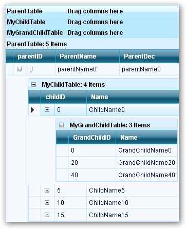

::: {style="DISPLAY: none"}
{#d2h_url_template}{#d2h_package_url style="WIDTH: 0px; DISPLAY: none; HEIGHT: 0px"}
:::

::::: {#nsbanner .d2h_main_nsbanner style="BORDER-BOTTOM: #999999 1px solid; POSITION: relative; PADDING-BOTTOM: 0px; BACKGROUND-COLOR: transparent; PADDING-LEFT: 0px; PADDING-RIGHT: 0px; DISPLAY: none; BORDER-TOP: #999999 1px solid; PADDING-TOP: 0px; LEFT: 0px"}
:::: {#TitleRow .d2h_main_titlerow style="PADDING-BOTTOM: 4px; BACKGROUND-COLOR: transparent; PADDING-LEFT: 22px; WIDTH: 100%; PADDING-RIGHT: 10px; DISPLAY: none; PADDING-TOP: 4px"}
::: {#ienav .d2h_main_ienav style="DISPLAY: none"}
{#D2HPrevious .D2HPreviousEnabled}  {#D2HNext .D2HNextEnabled}
:::
::::
:::::

:::: {#nstext .d2h_main_nstext style="PADDING-BOTTOM: 10px; BACKGROUND-COLOR: transparent; PADDING-LEFT: 22px; PADDING-RIGHT: 10px; HEIGHT: 100%; OVERFLOW: auto; PADDING-TOP: 5px" hasuserbackground="true" valign="bottom"}
::: {#d2h_breadcrumbs .d2h_breadcrumbs}
[Essential Studio User Guide Documentation](ms-xhelp:///?Id=12457748-09e3-4d74-a240-8e049cedf030){.d2h_breadcrumbsNormal}[ \> ]{.d2h_breadcrumbsLinkSeparator}[User Interface Edition](ms-xhelp:///?Id=c29296b7-531c-413b-a0ec-488ca1f7f669){.d2h_breadcrumbsNormal}[ \> ]{.d2h_breadcrumbsLinkSeparator}[Essential ASP.NET](ms-xhelp:///?Id=25c35330-c127-4dad-9a92-ed79dc7261a6){.d2h_breadcrumbsNormal}[ \> ]{.d2h_breadcrumbsLinkSeparator}[Essential Grid]{.d2h_breadcrumbsContentsOnly}[ \> ]{.d2h_breadcrumbsLinkSeparator}[Concepts and Features](ms-xhelp:///?Id=9e489974-524d-457c-9881-e458b1321685){.d2h_breadcrumbsNormal}[ \> ]{.d2h_breadcrumbsLinkSeparator}[Nested Relationship](ms-xhelp:///?Id=b9f71f14-2850-40d8-8438-293a0b032fc5){.d2h_breadcrumbsNormal}
:::

### Hierarchical {#hierarchical style="tab-stops: 0pt"}

[]{style="FONT-FAMILY: 'Trebuchet MS','sans-serif'; COLOR: #15428b; FONT-SIZE: 9pt"} 

The Parent-Children form of hierarchy is taken for our example scenario.

[]{style="FONT-FAMILY: 'Trebuchet MS','sans-serif'; COLOR: #15428b; FONT-SIZE: 9pt"} 

{border="0"}

Figure 65

[]{style="FONT-FAMILY: 'Trebuchet MS','sans-serif'; COLOR: #15428b; FONT-SIZE: 9pt"} 

[·      ]{style="FONT-FAMILY: Symbol"}The Grid relations are given in code, using the GridRelationDescriptor.

[·      ]{style="FONT-FAMILY: Symbol"}Tables namely Parent, Child and GrandChild are manually given relations, using the **GridRelationDescriptor** property.

[·      ]{style="FONT-FAMILY: Symbol"}Here, the Tables and DataRelations are added manually to the Grouping Engine.

[·      ]{style="FONT-FAMILY: Symbol"}Register any DataTable / List with the SourceListSet, so that the RelationDescriptor can resolve the name.

[]{style="FONT-FAMILY: 'Trebuchet MS','sans-serif'; COLOR: #15428b; FONT-SIZE: 9pt"} 

+-----------------------------------------------------------------------------------------------------------------------------------------------------------------------------------------------------------------------------------------------------------------------------+
| **[\[C#\]]{style="FONT-FAMILY: 'Courier New'; COLOR: black"}**                                                                                                                                                                                                              |
|                                                                                                                                                                                                                                                                             |
| []{style="FONT-FAMILY: 'Courier New'; COLOR: black"}                                                                                                                                                                                                                        |
|                                                                                                                                                                                                                                                                             |
| [protected]{style="FONT-FAMILY: 'Courier New'; COLOR: blue"}[ [void]{style="COLOR: blue"} Page_Load([object]{style="COLOR: blue"} sender, [EventArgs]{style="COLOR: teal"} e)]{style="FONT-FAMILY: 'Courier New'"}                                                          |
|                                                                                                                                                                                                                                                                             |
| [{]{style="FONT-FAMILY: 'Courier New'"}                                                                                                                                                                                                                                     |
|                                                                                                                                                                                                                                                                             |
| [        [if]{style="COLOR: blue"} (!IsPostBack)]{style="FONT-FAMILY: 'Courier New'"}                                                                                                                                                                                       |
|                                                                                                                                                                                                                                                                             |
| [ {]{style="FONT-FAMILY: 'Courier New'"}                                                                                                                                                                                                                                    |
|                                                                                                                                                                                                                                                                             |
| [            [DataTable]{style="COLOR: teal"} parentTable = GetParentTable();]{style="FONT-FAMILY: 'Courier New'"}                                                                                                                                                          |
|                                                                                                                                                                                                                                                                             |
| [            [DataTable]{style="COLOR: teal"} childTable = GetChildTable();]{style="FONT-FAMILY: 'Courier New'"}                                                                                                                                                            |
|                                                                                                                                                                                                                                                                             |
| [            [DataTable]{style="COLOR: teal"} grandChildTable = GetGrandChildTable();]{style="FONT-FAMILY: 'Courier New'"}                                                                                                                                                  |
|                                                                                                                                                                                                                                                                             |
| []{style="FONT-FAMILY: 'Courier New'"}                                                                                                                                                                                                                                      |
|                                                                                                                                                                                                                                                                             |
| [            [// Manually specify relations in grouping engine. The DataSet does not need to have any DataRelations.]{style="COLOR: green"}]{style="FONT-FAMILY: 'Courier New'"}                                                                                            |
|                                                                                                                                                                                                                                                                             |
| [            [// This is the same approach that should be used if you want to set up relation ships]{style="COLOR: green"}]{style="FONT-FAMILY: 'Courier New'"}                                                                                                             |
|                                                                                                                                                                                                                                                                             |
| [            [// between independent IList.]{style="COLOR: green"}]{style="FONT-FAMILY: 'Courier New'"}                                                                                                                                                                     |
|                                                                                                                                                                                                                                                                             |
| [            [GridRelationDescriptor]{style="COLOR: teal"} parentToChildRelationDescriptor = [new]{style="COLOR: blue"} [GridRelationDescriptor]{style="COLOR: teal"}();]{style="FONT-FAMILY: 'Courier New'"}                                                               |
|                                                                                                                                                                                                                                                                             |
| [            parentToChildRelationDescriptor.ChildTableName = [\"MyChildTable\"]{style="COLOR: maroon"};    [// same as SourceListSetEntry.Name for childTable (see                below)]{style="COLOR: green"}]{style="FONT-FAMILY: 'Courier New'"}                       |
|                                                                                                                                                                                                                                                                             |
| [            parentToChildRelationDescriptor.RelationKind = [RelationKind]{style="COLOR: teal"}.RelatedMasterDetails;]{style="FONT-FAMILY: 'Courier New'"}                                                                                                                  |
|                                                                                                                                                                                                                                                                             |
| [            parentToChildRelationDescriptor.RelationKeys.Add([\"parentID\"]{style="COLOR: maroon"}, [\"ParentID\"]{style="COLOR: maroon"});]{style="FONT-FAMILY: 'Courier New'"}                                                                                           |
|                                                                                                                                                                                                                                                                             |
| []{style="FONT-FAMILY: 'Courier New'"}                                                                                                                                                                                                                                      |
|                                                                                                                                                                                                                                                                             |
| [            [// Add relation to ParentTable ]{style="COLOR: green"}]{style="FONT-FAMILY: 'Courier New'"}                                                                                                                                                                   |
|                                                                                                                                                                                                                                                                             |
| [            GridGroupingControl1.TableDescriptor.Relations.Add(parentToChildRelationDescriptor);]{style="FONT-FAMILY: 'Courier New'"}                                                                                                                                      |
|                                                                                                                                                                                                                                                                             |
| []{style="FONT-FAMILY: 'Courier New'"}                                                                                                                                                                                                                                      |
|                                                                                                                                                                                                                                                                             |
| [            [GridRelationDescriptor]{style="COLOR: teal"} childToGrandChildRelationDescriptor = [new]{style="COLOR: blue"} [GridRelationDescriptor]{style="COLOR: teal"}();]{style="FONT-FAMILY: 'Courier New'"}                                                           |
|                                                                                                                                                                                                                                                                             |
| [            childToGrandChildRelationDescriptor.ChildTableName = [\"MyGrandChildTable\"]{style="COLOR: maroon"};  [// same as SourceListSetEntry.Name for                         grandChhildTable (see below)]{style="COLOR: green"}]{style="FONT-FAMILY: 'Courier New'"} |
|                                                                                                                                                                                                                                                                             |
| [            childToGrandChildRelationDescriptor.RelationKind = [RelationKind]{style="COLOR: teal"}.RelatedMasterDetails;]{style="FONT-FAMILY: 'Courier New'"}                                                                                                              |
|                                                                                                                                                                                                                                                                             |
| [            childToGrandChildRelationDescriptor.RelationKeys.Add([\"childID\"]{style="COLOR: maroon"}, [\"ChildID\"]{style="COLOR: maroon"});]{style="FONT-FAMILY: 'Courier New'"}                                                                                         |
|                                                                                                                                                                                                                                                                             |
| []{style="FONT-FAMILY: 'Courier New'"}                                                                                                                                                                                                                                      |
|                                                                                                                                                                                                                                                                             |
| [            [// Add relation to ChildTable ]{style="COLOR: green"}]{style="FONT-FAMILY: 'Courier New'"}                                                                                                                                                                    |
|                                                                                                                                                                                                                                                                             |
| [            parentToChildRelationDescriptor.ChildTableDescriptor.Relations.Add(childToGrandChildRelationDescriptor);]{style="FONT-FAMILY: 'Courier New'"}                                                                                                                  |
|                                                                                                                                                                                                                                                                             |
| []{style="FONT-FAMILY: 'Courier New'"}                                                                                                                                                                                                                                      |
|                                                                                                                                                                                                                                                                             |
| [            [// Register any DataTable/IList with SourceListSet, so that RelationDescriptor can resolve the name]{style="COLOR: green"}]{style="FONT-FAMILY: 'Courier New'"}                                                                                               |
|                                                                                                                                                                                                                                                                             |
| [            [this]{style="COLOR: blue"}.GridGroupingControl1.Engine.SourceListSet.Add([\"MyParentTable\"]{style="COLOR: maroon"}, parentTable);]{style="FONT-FAMILY: 'Courier New'"}                                                                                       |
|                                                                                                                                                                                                                                                                             |
| [            [this]{style="COLOR: blue"}.GridGroupingControl1.Engine.SourceListSet.Add([\"MyChildTable\"]{style="COLOR: maroon"}, childTable);]{style="FONT-FAMILY: 'Courier New'"}                                                                                         |
|                                                                                                                                                                                                                                                                             |
| [            [this]{style="COLOR: blue"}.GridGroupingControl1.Engine.SourceListSet.Add([\"MyGrandChildTable\"]{style="COLOR: maroon"}, grandChildTable);]{style="FONT-FAMILY: 'Courier New'"}                                                                               |
|                                                                                                                                                                                                                                                                             |
| []{style="FONT-FAMILY: 'Courier New'"}                                                                                                                                                                                                                                      |
|                                                                                                                                                                                                                                                                             |
| [            [this]{style="COLOR: blue"}.GridGroupingControl1.DataMember = [\"DefaultView\"]{style="COLOR: maroon"};]{style="FONT-FAMILY: 'Courier New'"}                                                                                                                   |
|                                                                                                                                                                                                                                                                             |
| [            [this]{style="COLOR: blue"}.GridGroupingControl1.DataSource = parentTable;]{style="FONT-FAMILY: 'Courier New'"}                                                                                                                                                |
|                                                                                                                                                                                                                                                                             |
| [            [this]{style="COLOR: blue"}.GridGroupingControl1.DataSourceCachingMode = DataSourceCachingMode.ViewState;]{style="FONT-FAMILY: 'Courier New'"}                                                                                                                 |
|                                                                                                                                                                                                                                                                             |
| [ }]{style="FONT-FAMILY: 'Courier New'"}                                                                                                                                                                                                                                    |
|                                                                                                                                                                                                                                                                             |
| [}]{style="FONT-FAMILY: 'Courier New'"}                                                                                                                                                                                                                                     |
+-----------------------------------------------------------------------------------------------------------------------------------------------------------------------------------------------------------------------------------------------------------------------------+

[]{style="FONT-FAMILY: 'Trebuchet MS','sans-serif'; COLOR: #15428b; FONT-SIZE: 9pt"} 

+---------------------------------------------------------------------------------------------------------------------------------------------------------------------------------------------------------------------------------------------------------------------------------------------------------------------------------+
| **[\[VB.NET\]]{style="FONT-FAMILY: 'Courier New'; COLOR: black"}**                                                                                                                                                                                                                                                              |
|                                                                                                                                                                                                                                                                                                                                 |
| []{style="FONT-FAMILY: 'Courier New'; COLOR: black"}                                                                                                                                                                                                                                                                            |
|                                                                                                                                                                                                                                                                                                                                 |
| [Protected]{style="FONT-FAMILY: 'Courier New'; COLOR: blue"}[ [Sub]{style="COLOR: blue"} Page_Init([ByVal]{style="COLOR: blue"} sender [As]{style="COLOR: blue"} [Object]{style="COLOR: blue"}, [ByVal]{style="COLOR: blue"} e [As]{style="COLOR: blue"} EventArgs)]{style="FONT-FAMILY: 'Courier New'"}                        |
|                                                                                                                                                                                                                                                                                                                                 |
| [Dim]{style="FONT-FAMILY: 'Courier New'; COLOR: blue"}[ parentTable [As]{style="COLOR: blue"} Data.DataTable = GetParentTable()]{style="FONT-FAMILY: 'Courier New'"}                                                                                                                                                            |
|                                                                                                                                                                                                                                                                                                                                 |
| [Dim]{style="FONT-FAMILY: 'Courier New'; COLOR: blue"}[ childTable [As]{style="COLOR: blue"} Data.DataTable = GetChildTable()]{style="FONT-FAMILY: 'Courier New'"}                                                                                                                                                              |
|                                                                                                                                                                                                                                                                                                                                 |
| [Dim]{style="FONT-FAMILY: 'Courier New'; COLOR: blue"}[ grandChildTable [As]{style="COLOR: blue"} Data.DataTable = GetGrandChildTable()]{style="FONT-FAMILY: 'Courier New'"}                                                                                                                                                    |
|                                                                                                                                                                                                                                                                                                                                 |
| []{style="FONT-FAMILY: 'Courier New'"}                                                                                                                                                                                                                                                                                          |
|                                                                                                                                                                                                                                                                                                                                 |
| [\' Manually specify relations in grouping engine. The DataSet does not need to have any DataRelations.]{style="FONT-FAMILY: 'Courier New'; COLOR: green"}                                                                                                                                                                      |
|                                                                                                                                                                                                                                                                                                                                 |
| [\' This is the same approach that should be used if you want to set up relation ships]{style="FONT-FAMILY: 'Courier New'; COLOR: green"}                                                                                                                                                                                       |
|                                                                                                                                                                                                                                                                                                                                 |
| [\' between independent IList.]{style="FONT-FAMILY: 'Courier New'; COLOR: green"}                                                                                                                                                                                                                                               |
|                                                                                                                                                                                                                                                                                                                                 |
| [Dim]{style="FONT-FAMILY: 'Courier New'; COLOR: blue"}[ parentToChildRelationDescriptor [As]{style="COLOR: blue"} Syncfusion.Web.UI.WebControls.Grid.Grouping.GridRelationDescriptor = [New]{style="COLOR: blue"} Syncfusion.Web.UI.WebControls.Grid.Grouping.GridRelationDescriptor()]{style="FONT-FAMILY: 'Courier New'"}     |
|                                                                                                                                                                                                                                                                                                                                 |
| [parentToChildRelationDescriptor.ChildTableName = [\"MyChildTable\"]{style="COLOR: maroon"} [\' same as SourceListSetEntry.Name for childTable (see below)]{style="COLOR: green"}]{style="FONT-FAMILY: 'Courier New'"}                                                                                                          |
|                                                                                                                                                                                                                                                                                                                                 |
| [parentToChildRelationDescriptor.RelationKind = RelationKind.RelatedMasterDetails]{style="FONT-FAMILY: 'Courier New'"}                                                                                                                                                                                                          |
|                                                                                                                                                                                                                                                                                                                                 |
| [parentToChildRelationDescriptor.RelationKeys.Add([\"parentID\"]{style="COLOR: maroon"}, [\"ParentID\"]{style="COLOR: maroon"})]{style="FONT-FAMILY: 'Courier New'"}                                                                                                                                                            |
|                                                                                                                                                                                                                                                                                                                                 |
| []{style="FONT-FAMILY: 'Courier New'"}                                                                                                                                                                                                                                                                                          |
|                                                                                                                                                                                                                                                                                                                                 |
| [\' Add relation to ParentTable ]{style="FONT-FAMILY: 'Courier New'; COLOR: green"}                                                                                                                                                                                                                                             |
|                                                                                                                                                                                                                                                                                                                                 |
| [GridGroupingControl1.TableDescriptor.Relations.Add(parentToChildRelationDescriptor)]{style="FONT-FAMILY: 'Courier New'"}                                                                                                                                                                                                       |
|                                                                                                                                                                                                                                                                                                                                 |
| []{style="FONT-FAMILY: 'Courier New'"}                                                                                                                                                                                                                                                                                          |
|                                                                                                                                                                                                                                                                                                                                 |
| [Dim]{style="FONT-FAMILY: 'Courier New'; COLOR: blue"}[ childToGrandChildRelationDescriptor [As]{style="COLOR: blue"} Syncfusion.Web.UI.WebControls.Grid.Grouping.GridRelationDescriptor = [New]{style="COLOR: blue"} Syncfusion.Web.UI.WebControls.Grid.Grouping.GridRelationDescriptor()]{style="FONT-FAMILY: 'Courier New'"} |
|                                                                                                                                                                                                                                                                                                                                 |
| [childToGrandChildRelationDescriptor.ChildTableName = [\"MyGrandChildTable\"]{style="COLOR: maroon"} [\' same as SourceListSetEntry.Name for grandChhildTable           (see below)]{style="COLOR: green"}]{style="FONT-FAMILY: 'Courier New'"}                                                                                 |
|                                                                                                                                                                                                                                                                                                                                 |
| [childToGrandChildRelationDescriptor.RelationKind = RelationKind.RelatedMasterDetails]{style="FONT-FAMILY: 'Courier New'"}                                                                                                                                                                                                      |
|                                                                                                                                                                                                                                                                                                                                 |
| [childToGrandChildRelationDescriptor.RelationKeys.Add([\"childID\"]{style="COLOR: maroon"}, [\"ChildID\"]{style="COLOR: maroon"})]{style="FONT-FAMILY: 'Courier New'"}                                                                                                                                                          |
|                                                                                                                                                                                                                                                                                                                                 |
| []{style="FONT-FAMILY: 'Courier New'"}                                                                                                                                                                                                                                                                                          |
|                                                                                                                                                                                                                                                                                                                                 |
| [\' Add relation to ChildTable ]{style="FONT-FAMILY: 'Courier New'; COLOR: green"}                                                                                                                                                                                                                                              |
|                                                                                                                                                                                                                                                                                                                                 |
| [parentToChildRelationDescriptor.ChildTableDescriptor.Relations.Add(childToGrandChildRelationDescriptor)]{style="FONT-FAMILY: 'Courier New'"}                                                                                                                                                                                   |
|                                                                                                                                                                                                                                                                                                                                 |
| []{style="FONT-FAMILY: 'Courier New'"}                                                                                                                                                                                                                                                                                          |
|                                                                                                                                                                                                                                                                                                                                 |
| [\' Register any DataTable/IList with SourceListSet, so that RelationDescriptor can resolve the name]{style="FONT-FAMILY: 'Courier New'; COLOR: green"}                                                                                                                                                                         |
|                                                                                                                                                                                                                                                                                                                                 |
| [Me]{style="FONT-FAMILY: 'Courier New'; COLOR: blue"}[.GridGroupingControl1.Engine.SourceListSet.Add([\"MyParentTable\"]{style="COLOR: maroon"}, parentTable)]{style="FONT-FAMILY: 'Courier New'"}                                                                                                                              |
|                                                                                                                                                                                                                                                                                                                                 |
| [Me]{style="FONT-FAMILY: 'Courier New'; COLOR: blue"}[.GridGroupingControl1.Engine.SourceListSet.Add([\"MyChildTable\"]{style="COLOR: maroon"}, childTable)]{style="FONT-FAMILY: 'Courier New'"}                                                                                                                                |
|                                                                                                                                                                                                                                                                                                                                 |
| [Me]{style="FONT-FAMILY: 'Courier New'; COLOR: blue"}[.GridGroupingControl1.Engine.SourceListSet.Add([\"MyGrandChildTable\"]{style="COLOR: maroon"}, grandChildTable)]{style="FONT-FAMILY: 'Courier New'"}                                                                                                                      |
|                                                                                                                                                                                                                                                                                                                                 |
| []{style="FONT-FAMILY: 'Courier New'"}                                                                                                                                                                                                                                                                                          |
|                                                                                                                                                                                                                                                                                                                                 |
| [Me]{style="FONT-FAMILY: 'Courier New'; COLOR: blue"}[.GridGroupingControl1.DataMember = [\"DefaultView\"]{style="COLOR: maroon"}]{style="FONT-FAMILY: 'Courier New'"}                                                                                                                                                          |
|                                                                                                                                                                                                                                                                                                                                 |
| [Me]{style="FONT-FAMILY: 'Courier New'; COLOR: blue"}[.GridGroupingControl1.DataSource = parentTable]{style="FONT-FAMILY: 'Courier New'"}                                                                                                                                                                                       |
|                                                                                                                                                                                                                                                                                                                                 |
| []{style="FONT-FAMILY: 'Courier New'"}                                                                                                                                                                                                                                                                                          |
|                                                                                                                                                                                                                                                                                                                                 |
| [End]{style="FONT-FAMILY: 'Courier New'; COLOR: blue"}[ [Sub]{style="COLOR: blue"}]{style="FONT-FAMILY: 'Courier New'"}                                                                                                                                                                                                         |
+---------------------------------------------------------------------------------------------------------------------------------------------------------------------------------------------------------------------------------------------------------------------------------------------------------------------------------+

[]{style="FONT-FAMILY: 'Trebuchet MS','sans-serif'; COLOR: #15428b; FONT-SIZE: 9pt"} 

{border="0"}

[]{#p55}Figure 66

[]{#related-topics}
::::
