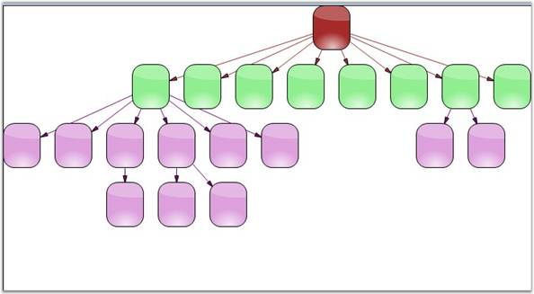
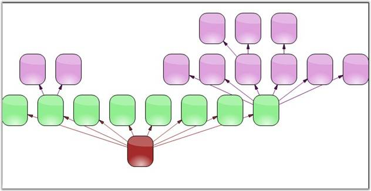

::: {style="DISPLAY: none"}
{#d2h_url_template}{#d2h_package_url style="WIDTH: 0px; DISPLAY: none; HEIGHT: 0px"}
:::

:::: {.d2h_secondary_topic style="PADDING-BOTTOM: 10pt; MARGIN: 0pt; PADDING-LEFT: 0pt; PADDING-RIGHT: 0pt; PADDING-TOP: 0pt"}
#### Hierarchical Layout Manager {#hierarchical-layout-manager style="tab-stops: 0pt"}

[]{style="FONT-FAMILY: 'Trebuchet MS','sans-serif'; COLOR: #15428b; FONT-SIZE: 9pt"} 

Hierarchical layout manager arranges the nodes in a hierarchical fashion depending on the parent-child relationship. Unlike the directed layout, more than one parent item can be defined for a child.

[]{style="FONT-FAMILY: 'Trebuchet MS','sans-serif'; COLOR: #15428b; FONT-SIZE: 9pt"} 

The parameters to be passed for the **HierarchicalLayoutManager** class are as follows:

[]{style="FONT-FAMILY: 'Trebuchet MS','sans-serif'; COLOR: #15428b; FONT-SIZE: 9pt"} 

::: {align="center"}
  ------------------- ----------------------------------------------------------------------------------------
  Property            Description
  Model               Represents the model of the diagram, which has to be displayed out as a directed tree.
  RotationAngle       Defines the Graph Rotation angle. It accepts only integer values between 0-360.
  HorizontalSpacing   Holds the value for the horizontal offset between adjacent nodes (float value).
  VerticalSpacing     Holds the value for the vertical offset between adjacent nodes (float value).
  ------------------- ----------------------------------------------------------------------------------------
:::

[]{style="FONT-FAMILY: 'Trebuchet MS','sans-serif'; COLOR: #15428b; FONT-SIZE: 9pt"} 

Programmatically, the hierarchical layout manager instance should be created with the respective arguments, assigned to the Layout Manager and updated as follows.

[]{style="FONT-FAMILY: 'Times New Roman','serif'; FONT-SIZE: 12pt"} 

+-----------------------------------------------------------------------------------------------------------------------------------------------------------------+
| **[\[C#\]]{style="FONT-FAMILY: 'Courier New'; COLOR: black"}**                                                                                                  |
|                                                                                                                                                                 |
| **[]{style="FONT-FAMILY: 'Courier New'; COLOR: black"}**                                                                                                        |
|                                                                                                                                                                 |
| [HierarchicLayoutManager hierarchyLayout = [new]{style="COLOR: blue"} HierarchicLayoutManager (diagram1.Model, 0, 10, 20);]{style="FONT-FAMILY: 'Courier New'"} |
|                                                                                                                                                                 |
| [this]{style="FONT-FAMILY: 'Courier New'; COLOR: blue"}[.diagram1.LayoutManager = hierarchyLayout;]{style="FONT-FAMILY: 'Courier New'"}                         |
|                                                                                                                                                                 |
| [this]{style="FONT-FAMILY: 'Courier New'; COLOR: blue"}[.diagram1.LayoutManager.UpdateLayout([null]{style="COLOR: blue"});]{style="FONT-FAMILY: 'Courier New'"} |
+-----------------------------------------------------------------------------------------------------------------------------------------------------------------+

[]{style="FONT-FAMILY: 'Courier New'"} 

+----------------------------------------------------------------------------------------------------------------------------------------------------------------------------------------------------------------------+
| **[\[VB\]]{style="FONT-FAMILY: 'Courier New'; COLOR: black"}**                                                                                                                                                       |
|                                                                                                                                                                                                                      |
| **[]{style="FONT-FAMILY: 'Courier New'; COLOR: black"}**                                                                                                                                                             |
|                                                                                                                                                                                                                      |
| [Dim]{style="FONT-FAMILY: 'Courier New'; COLOR: blue"}[ hierarchyLayout [As]{style="COLOR: blue"} [New]{style="COLOR: blue"} HierarchicLayoutManager(diagram1.Model, 0, 10, 20)]{style="FONT-FAMILY: 'Courier New'"} |
|                                                                                                                                                                                                                      |
| [Me]{style="FONT-FAMILY: 'Courier New'; COLOR: blue"}[.diagram1.LayoutManager = hierarchyLayout]{style="FONT-FAMILY: 'Courier New'"}                                                                                 |
|                                                                                                                                                                                                                      |
| [Me]{style="FONT-FAMILY: 'Courier New'; COLOR: blue"}[.diagram1.LayoutManager.UpdateLayout([Nothing]{style="COLOR: blue"})]{style="FONT-FAMILY: 'Courier New'"}                                                      |
+----------------------------------------------------------------------------------------------------------------------------------------------------------------------------------------------------------------------+

[]{style="FONT-FAMILY: 'Trebuchet MS','sans-serif'; COLOR: #15428b; FONT-SIZE: 9pt"} 

Sample diagrams are as follows:

[]{style="FONT-FAMILY: 'Trebuchet MS','sans-serif'; COLOR: #15428b; FONT-SIZE: 9pt"} 

{border="0"}

**[]{style="FONT-FAMILY: 'Trebuchet MS','sans-serif'; COLOR: #15428b; FONT-SIZE: 9pt"}** 

Figure 58: Top-to-Bottom Hierarchical Tree Layout

**[]{style="FONT-FAMILY: 'Trebuchet MS','sans-serif'; COLOR: #15428b; FONT-SIZE: 9pt"}** 

{border="0"}

**[]{style="FONT-FAMILY: 'Trebuchet MS','sans-serif'; COLOR: #15428b; FONT-SIZE: 9pt"}** 

Figure 59: Bottom-to-Top Hierarchical Tree Layout

 

[]{#p37} 

 

[]{#related-topics}
::::
