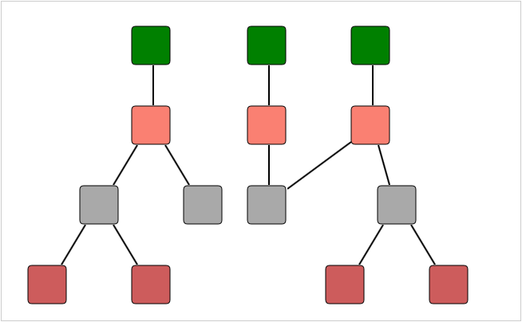

::: {style="DISPLAY: none"}
{#d2h_url_template}{#d2h_package_url style="WIDTH: 0px; DISPLAY: none; HEIGHT: 0px"}
:::

::::: {#nsbanner .d2h_main_nsbanner style="BORDER-BOTTOM: #999999 1px solid; POSITION: relative; PADDING-BOTTOM: 0px; BACKGROUND-COLOR: transparent; PADDING-LEFT: 0px; PADDING-RIGHT: 0px; DISPLAY: none; BORDER-TOP: #999999 1px solid; PADDING-TOP: 0px; LEFT: 0px"}
:::: {#TitleRow .d2h_main_titlerow style="PADDING-BOTTOM: 4px; BACKGROUND-COLOR: transparent; PADDING-LEFT: 22px; WIDTH: 100%; PADDING-RIGHT: 10px; DISPLAY: none; PADDING-TOP: 4px"}
::: {#ienav .d2h_main_ienav style="DISPLAY: none"}
{#D2HPrevious .D2HPreviousEnabled}  {#D2HNext .D2HNextEnabled}
:::
::::
:::::

:::::: {#nstext .d2h_main_nstext style="PADDING-BOTTOM: 10px; BACKGROUND-COLOR: transparent; PADDING-LEFT: 22px; PADDING-RIGHT: 10px; HEIGHT: 100%; OVERFLOW: auto; PADDING-TOP: 5px" hasuserbackground="true" valign="bottom"}
::: {#d2h_breadcrumbs .d2h_breadcrumbs}
[Essential Studio User Guide Documentation](ms-xhelp:///?Id=12457748-09e3-4d74-a240-8e049cedf030){.d2h_breadcrumbsNormal}[ \> ]{.d2h_breadcrumbsLinkSeparator}[User Interface Edition](ms-xhelp:///?Id=c29296b7-531c-413b-a0ec-488ca1f7f669){.d2h_breadcrumbsNormal}[ \> ]{.d2h_breadcrumbsLinkSeparator}[Essential ASP.NET MVC](ms-xhelp:///?Id=4b14e7d1-65c4-4f67-b1aa-2c37709905a5){.d2h_breadcrumbsNormal}[ \> ]{.d2h_breadcrumbsLinkSeparator}[Essential Diagram]{.d2h_breadcrumbsContentsOnly}[ \> ]{.d2h_breadcrumbsLinkSeparator}[Concepts and Features](ms-xhelp:///?Id=04839cdf-94fc-4d24-9f6b-119fdbd7bbfb){.d2h_breadcrumbsNormal}[ \> ]{.d2h_breadcrumbsLinkSeparator}[Automatic Layout](ms-xhelp:///?Id=26208920-fb25-4f4d-926a-bd747f7329d7){.d2h_breadcrumbsNormal}
:::

### Hierarchical Tree Layout {#hierarchical-tree-layout style="tab-stops: 0pt"}

The hierarchical tree layout arranges nodes in a tree-like structure, where the nodes in the hierarchical layout may have multiple parents. As a result, there is no need to specify the layout root.

[]{style="COLOR: black"} 

Orientation

The layout manager lets you orient the hierarchical tree in many directions. The **Orientation** property of the **Diagram** model can be used to specify the tree orientation.[ ]{style="COLOR: black"}

[·      ]{style="FONT-FAMILY: Symbol"}**TopBottom**---Places the root node at the top and the child nodes are arranged below the root node.

[·      ]{style="FONT-FAMILY: Symbol"}**BottomTop**---Places the root node at the bottom and the child nodes are arranged above the root node.

[·      ]{style="FONT-FAMILY: Symbol"}**LeftRight**---Places the root node at the left and the child nodes are arranged on the right side of the root node.

[·      ]{style="FONT-FAMILY: Symbol"}**RightLeft**---Places the root node at the right and the child nodes are arranged on the left side of the root node. 

 

+-----------------------------------------------------------------+--------------------------------------------------------------------------------------------------+-------------+-----------------------------------------------------------------------------------------------------------------------+-----------------------------------------------------------------------------------------------------------------------------------------------------------------------------------------------------------------------------------------------------------------------------------------------------------+
| Property                                                        | Description                                                                                      | Type        | Data Type                                                                                                             | Reference Links                                                                                                                                                                                                                                                                                           |
+=================================================================+==================================================================================================+=============+=======================================================================================================================+===========================================================================================================================================================================================================================================================================================================+
| VerticalSpacing[]{style="FONT-FAMILY: 'Segoe UI','sans-serif'"} | Gets or sets the Vertical spacing between nodes.[]{style="FONT-FAMILY: 'Segoe UI','sans-serif'"} | Server side | Double                                                                                                                | [[http://help.syncfusion.com/ug_92/User%20Interface/ASP.NET%20MVC/Diagram/default.htm?turl=Documents%2F4313layoutspacing.htm]{style="FONT-FAMILY: 'Arial','sans-serif'"}](http://help.syncfusion.com/ug_92/User%20Interface/ASP.NET%20MVC/Diagram/default.htm?turl=Documents%2F4313layoutspacing.htm)     |
+-----------------------------------------------------------------+--------------------------------------------------------------------------------------------------+-------------+-----------------------------------------------------------------------------------------------------------------------+-----------------------------------------------------------------------------------------------------------------------------------------------------------------------------------------------------------------------------------------------------------------------------------------------------------+
| HorizontalSpacing                                               | Gets or sets the Horizontal spacing between nodes.                                               | Server side | Double                                                                                                                | [[http://help.syncfusion.com/ug_92/User%20Interface/ASP.NET%20MVC/Diagram/default.htm?turl=Documents%2F4313layoutspacing.htm]{style="FONT-FAMILY: 'Arial','sans-serif'"}](http://help.syncfusion.com/ug_92/User%20Interface/ASP.NET%20MVC/Diagram/default.htm?turl=Documents%2F4313layoutspacing.htm)     |
+-----------------------------------------------------------------+--------------------------------------------------------------------------------------------------+-------------+-----------------------------------------------------------------------------------------------------------------------+-----------------------------------------------------------------------------------------------------------------------------------------------------------------------------------------------------------------------------------------------------------------------------------------------------------+
| SpaceBetweenSubTrees                                            | Gets or sets the space between sub- trees.                                                       | Server side | Double                                                                                                                | [[http://help.syncfusion.com/ug_92/User%20Interface/ASP.NET%20MVC/Diagram/default.htm?turl=Documents%2F4313layoutspacing.htm]{style="FONT-FAMILY: 'Arial','sans-serif'"}](http://help.syncfusion.com/ug_92/User%20Interface/ASP.NET%20MVC/Diagram/default.htm?turl=Documents%2F4313layoutspacing.htm)     |
+-----------------------------------------------------------------+--------------------------------------------------------------------------------------------------+-------------+-----------------------------------------------------------------------------------------------------------------------+-----------------------------------------------------------------------------------------------------------------------------------------------------------------------------------------------------------------------------------------------------------------------------------------------------------+
| Orientation                                                     | Gets or sets the orientation.                                                                    | Server side | Enum                                                                                                                  | [[http://help.syncfusion.com/ug_92/User%20Interface/ASP.NET%20MVC/Diagram/default.htm?turl=Documents%2F4314treeorientation.htm]{style="FONT-FAMILY: 'Arial','sans-serif'"}](http://help.syncfusion.com/ug_92/User%20Interface/ASP.NET%20MVC/Diagram/default.htm?turl=Documents%2F4314treeorientation.htm) |
|                                                                 |                                                                                                  |             |                                                                                                                       |                                                                                                                                                                                                                                                                                                           |
|                                                                 |                                                                                                  |             | [TreeOrientation]{style="FONT-FAMILY: 'Courier New'; COLOR: #2b91af"}[.TopBottom]{style="FONT-FAMILY: 'Courier New'"} |                                                                                                                                                                                                                                                                                                           |
|                                                                 |                                                                                                  |             |                                                                                                                       |                                                                                                                                                                                                                                                                                                           |
|                                                                 |                                                                                                  |             | [TreeOrientation]{style="FONT-FAMILY: 'Courier New'; COLOR: #2b91af"}[.BottomTop]{style="FONT-FAMILY: 'Courier New'"} |                                                                                                                                                                                                                                                                                                           |
|                                                                 |                                                                                                  |             |                                                                                                                       |                                                                                                                                                                                                                                                                                                           |
|                                                                 |                                                                                                  |             | [TreeOrientation]{style="FONT-FAMILY: 'Courier New'; COLOR: #2b91af"}[.LeftRight]{style="FONT-FAMILY: 'Courier New'"} |                                                                                                                                                                                                                                                                                                           |
|                                                                 |                                                                                                  |             |                                                                                                                       |                                                                                                                                                                                                                                                                                                           |
|                                                                 |                                                                                                  |             | [TreeOrientation]{style="FONT-FAMILY: 'Courier New'; COLOR: #2b91af"}[.RightLeft]{style="FONT-FAMILY: 'Courier New'"} |                                                                                                                                                                                                                                                                                                           |
+-----------------------------------------------------------------+--------------------------------------------------------------------------------------------------+-------------+-----------------------------------------------------------------------------------------------------------------------+-----------------------------------------------------------------------------------------------------------------------------------------------------------------------------------------------------------------------------------------------------------------------------------------------------------+

 

The following code snippet specifies how the hierarchical tree layout can be specified. 

1.   In the **controller**, create an object for the **DiagramPropertiesModel** class and set the **LayoutType** to **HierarchicalTreeLayout**.

2.   Set the **Orientation** property and **Layout spacing**.

3.   Pass this model class to the **view data**.

 

::: {align="center"}
+--------------------------------------------------------------------------------------------------------------------------------------------------------------------------------------------------------------------------------------------+
| **[Controller]{style="FONT-FAMILY: 'Courier New'; FONT-SIZE: 11pt"}[]{style="FONT-FAMILY: 'Courier New'; FONT-SIZE: 11pt"}**                                                                                                               |
|                                                                                                                                                                                                                                            |
| [DiagramPropertiesModel]{style="FONT-FAMILY: 'Courier New'; COLOR: #2b91af; FONT-SIZE: 11pt"}[ model = [new]{style="COLOR: blue"} [DiagramPropertiesModel]{style="COLOR: #2b91af"}()]{style="FONT-FAMILY: 'Courier New'; FONT-SIZE: 11pt"} |
|                                                                                                                                                                                                                                            |
| [{]{style="FONT-FAMILY: 'Courier New'; FONT-SIZE: 11pt"}                                                                                                                                                                                   |
|                                                                                                                                                                                                                                            |
| [    LayoutType = [LayoutType]{style="COLOR: #2b91af"}.HierarchicalTreeLayout,]{style="FONT-FAMILY: 'Courier New'; FONT-SIZE: 11pt"}                                                                                                       |
|                                                                                                                                                                                                                                            |
| [    Orientation = [TreeOrientation]{style="COLOR: #2b91af"}.LeftRight,]{style="FONT-FAMILY: 'Courier New'; FONT-SIZE: 11pt"}                                                                                                              |
|                                                                                                                                                                                                                                            |
| [    HorizontalSpacing = 50,]{style="FONT-FAMILY: 'Courier New'; FONT-SIZE: 11pt"}                                                                                                                                                         |
|                                                                                                                                                                                                                                            |
| [    VerticalSpacing = 50,]{style="FONT-FAMILY: 'Courier New'; FONT-SIZE: 11pt"}                                                                                                                                                           |
|                                                                                                                                                                                                                                            |
| [    RootOffsetX = 300,]{style="FONT-FAMILY: 'Courier New'; FONT-SIZE: 11pt"}                                                                                                                                                              |
|                                                                                                                                                                                                                                            |
| [    RootOffsetY = 50,]{style="FONT-FAMILY: 'Courier New'; FONT-SIZE: 11pt"}                                                                                                                                                               |
|                                                                                                                                                                                                                                            |
| [    DiagramMode = DiagramMode.SVG]{style="FONT-FAMILY: 'Courier New'; FONT-SIZE: 11pt"}                                                                                                                                                   |
|                                                                                                                                                                                                                                            |
| [};]{style="FONT-FAMILY: 'Courier New'; FONT-SIZE: 11pt"}                                                                                                                                                                                  |
|                                                                                                                                                                                                                                            |
| [ViewData\[[\"HierarchicalTreeLayout\"]{style="COLOR: #a31515"}\] = model;]{style="FONT-FAMILY: 'Courier New'; FONT-SIZE: 11pt"}[]{style="FONT-FAMILY: 'Courier New'; FONT-SIZE: 11pt"}                                                    |
+--------------------------------------------------------------------------------------------------------------------------------------------------------------------------------------------------------------------------------------------+
:::

**Note:** If you want to create the diagram in the Canvas mode, change the **DiagramMode** to **Canvas**. By default the diagram is rendered in the SVG mode.

**[]{style="FONT-FAMILY: 'Calibri','sans-serif'"}** 

4.   Create a **view**. In the **view**, invoke the **Diagram** helper with the control ID which is the same as the **view data** name.

 

::: {align="center"}
+------------------------------------------------------------------------------------------------------------------------------------------------------------------------+
| **[View]{style="FONT-FAMILY: 'Courier New'; FONT-SIZE: 11pt"}[]{style="FONT-FAMILY: 'Courier New'"}**                                                                  |
|                                                                                                                                                                        |
| [  [\<%]{style="BACKGROUND: yellow"}{]{style="FONT-FAMILY: 'Courier New'; FONT-SIZE: 11pt"}                                                                            |
|                                                                                                                                                                        |
| [              Html.Syncfusion().Diagram([\"HierarchicalTreeLayout\"]{style="COLOR: #a31515"})]{style="FONT-FAMILY: 'Courier New'; FONT-SIZE: 11pt"}                   |
|                                                                                                                                                                        |
| [                  .Render();]{style="FONT-FAMILY: 'Courier New'; FONT-SIZE: 11pt"}                                                                                    |
|                                                                                                                                                                        |
| [    }]{style="FONT-FAMILY: 'Courier New'; FONT-SIZE: 11pt"}                                                                                                           |
|                                                                                                                                                                        |
| [  [%\>]{style="BACKGROUND: yellow"}]{style="FONT-FAMILY: 'Courier New'; FONT-SIZE: 11pt"}[ ]{style="FONT-FAMILY: 'Courier New'; BACKGROUND: yellow; FONT-SIZE: 11pt"} |
+------------------------------------------------------------------------------------------------------------------------------------------------------------------------+
:::

[]{style="FONT-FAMILY: Consolas; BACKGROUND: yellow; FONT-SIZE: 9.5pt"} 

5.   Build and run the application.

{border="0"}

Figure 119: Hierarchical Layout

 

See Also

**Layout Spacing**

Refer to Concepts and Features \> Diagram Model \> Layout Spacing

Tree Orientation[]{style="COLOR: #4f81bd"}

Refer to Concepts and Features \> Diagram Model \> Tree Orientation

[]{#related-topics}
::::::
