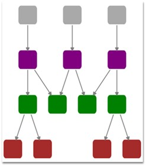

::: {style="DISPLAY: none"}
{#d2h_url_template}{#d2h_package_url style="WIDTH: 0px; DISPLAY: none; HEIGHT: 0px"}
:::

::::: {#nsbanner .d2h_main_nsbanner style="BORDER-BOTTOM: #999999 1px solid; POSITION: relative; PADDING-BOTTOM: 0px; BACKGROUND-COLOR: transparent; PADDING-LEFT: 0px; PADDING-RIGHT: 0px; DISPLAY: none; BORDER-TOP: #999999 1px solid; PADDING-TOP: 0px; LEFT: 0px"}
:::: {#TitleRow .d2h_main_titlerow style="PADDING-BOTTOM: 4px; BACKGROUND-COLOR: transparent; PADDING-LEFT: 22px; WIDTH: 100%; PADDING-RIGHT: 10px; DISPLAY: none; PADDING-TOP: 4px"}
::: {#ienav .d2h_main_ienav style="DISPLAY: none"}
{#D2HPrevious .D2HPreviousEnabled}  {#D2HNext .D2HNextEnabled}
:::
::::
:::::

:::: {#nstext .d2h_main_nstext style="PADDING-BOTTOM: 10px; BACKGROUND-COLOR: transparent; PADDING-LEFT: 22px; PADDING-RIGHT: 10px; HEIGHT: 100%; OVERFLOW: auto; PADDING-TOP: 5px" hasuserbackground="true" valign="bottom"}
::: {#d2h_breadcrumbs .d2h_breadcrumbs}
[Essential Studio User Guide Documentation](ms-xhelp:///?Id=12457748-09e3-4d74-a240-8e049cedf030){.d2h_breadcrumbsNormal}[ \> ]{.d2h_breadcrumbsLinkSeparator}[User Interface Edition](ms-xhelp:///?Id=c29296b7-531c-413b-a0ec-488ca1f7f669){.d2h_breadcrumbsNormal}[ \> ]{.d2h_breadcrumbsLinkSeparator}[Essential Silverlight](ms-xhelp:///?Id=66221bd1-ba2e-43c2-94a7-618f50e01d24){.d2h_breadcrumbsNormal}[ \> ]{.d2h_breadcrumbsLinkSeparator}[Essential Diagram]{.d2h_breadcrumbsContentsOnly}[ \> ]{.d2h_breadcrumbsLinkSeparator}[Getting Started](ms-xhelp:///?Id=77f772a1-15ea-48e9-bd56-21bc587bb944){.d2h_breadcrumbsNormal}[ \> ]{.d2h_breadcrumbsLinkSeparator}[Automatic Layout](ms-xhelp:///?Id=157e81f4-0183-435f-92c0-e47d89cb7257){.d2h_breadcrumbsNormal}
:::

### Hierarchical Tree Layout {#hierarchical-tree-layout style="tab-stops: 0pt"}

**[]{style="FONT-FAMILY: 'Trebuchet MS','sans-serif'; COLOR: #15428b"}** 

The Hierarchical Tree Layout arranges nodes in a tree-like structure, where the nodes in hierarchical layout may have multiple parents. As a result, there is no need to specify the layout root.

[]{style="FONT-FAMILY: 'Trebuchet MS','sans-serif'; COLOR: #15428b; FONT-SIZE: 9pt"} 

[]{style="COLOR: black"} 

Orientation

[]{style="COLOR: black"} 

The Layout Manager lets you orient the hierarchical tree in many directions. The **Orientation** property of Diagram Model can be used to specify the tree orientation.

[]{style="FONT-FAMILY: 'Trebuchet MS','sans-serif'; COLOR: #15428b; FONT-SIZE: 9pt"} 

[·      ]{style="FONT-FAMILY: Symbol"}TopBottom - Places the root node at the top and the child nodes are arranged below the root node.

[·      ]{style="FONT-FAMILY: Symbol"}BottomTop - Places the root node at the bottom and the child nodes are arranged above the root node.

[·      ]{style="FONT-FAMILY: Symbol"}LeftRight - Places the root node at the left and the child nodes are arranged on the right side of the root node.

[·      ]{style="FONT-FAMILY: Symbol"}RightLeft - Places the root node at the right and the child nodes are arranged on the left side of the root node.\
\
\

Properties

[]{style="FONT-FAMILY: 'Trebuchet MS','sans-serif'; COLOR: #15428b; FONT-SIZE: 9pt"} 

+----------------------+-----------------------------------------------------------------------------------------------------+----------------------+---------------------------+---------------------------------------------------+
| Property             | Description                                                                                         | Type of the property | Value it accepts          | Any other dependencies/ sub properties associated |
+----------------------+-----------------------------------------------------------------------------------------------------+----------------------+---------------------------+---------------------------------------------------+
| VerticalSpacing      | Gets or sets the Vertical spacing between nodes.                                                    | CLR Property         | Double                    | No                                                |
+----------------------+-----------------------------------------------------------------------------------------------------+----------------------+---------------------------+---------------------------------------------------+
| HorizontalSpacing    | Gets or sets the Horizontal spacing between nodes.                                                  | CLR Property         | Double                    | No                                                |
+----------------------+-----------------------------------------------------------------------------------------------------+----------------------+---------------------------+---------------------------------------------------+
| SpaceBetweenSubTrees | Gets or sets the space between sub trees.                                                           | CLR Property         | Double                    | No                                                |
+----------------------+-----------------------------------------------------------------------------------------------------+----------------------+---------------------------+---------------------------------------------------+
| Orientation          | Gets or sets the orientation.                                                                       | CLR Property         | TreeOrientation.LeftRight | No                                                |
|                      |                                                                                                     |                      |                           |                                                   |
|                      |                                                                                                     |                      | TreeOrientation.RightLeft |                                                   |
|                      |                                                                                                     |                      |                           |                                                   |
|                      |                                                                                                     |                      | TreeOrientation.TopBottom |                                                   |
|                      |                                                                                                     |                      |                           |                                                   |
|                      |                                                                                                     |                      | TreeOrientation.BottomTop |                                                   |
+----------------------+-----------------------------------------------------------------------------------------------------+----------------------+---------------------------+---------------------------------------------------+
| EnableCycleDetection | Gets or sets a value indicating whether Cycle detection is enabled or not.                          | DependencyProperty   | Boolean (true/ false)     | No                                                |
+----------------------+-----------------------------------------------------------------------------------------------------+----------------------+---------------------------+---------------------------------------------------+
| Bounds               | Gets or sets the bounds value which specifies the position of the root node in case of tree layout. | CLR Property         | Thickness                 | No                                                |
+----------------------+-----------------------------------------------------------------------------------------------------+----------------------+---------------------------+---------------------------------------------------+

[]{style="COLOR: black"} 

The **Bounds** property of the **DiagramView** class can be used to specify the position of the root node, based on which the entire tree gets generated.

[]{style="COLOR: black"} 

The following code snippet specifies how the Hierarchical-tree layout can be specified.

[]{style="FONT-FAMILY: 'Trebuchet MS','sans-serif'; COLOR: #15428b; FONT-SIZE: 9pt"} 

1.   The LayoutType should be set to **HierarchicalTreeLayout** in **DiagramModel** class.

[]{style="FONT-FAMILY: 'Trebuchet MS','sans-serif'; COLOR: #15428b; FONT-SIZE: 9pt"} 

[]{style="COLOR: black"} 

+--------------------------------------------------------------------------------------------------------------------------------------------------------------------------------------------------------------------------------------------------------------------------------------------------------------------------------------------------------------------------------------------------------------------------------------------------------------------------------------------------------------------------------------------------------------------------------------------------------------------------------------------------------------------------------------------------------------------------------------------------------------------------------------------------------------------------------------------------------------------------------------------------------------------------------------------------------------------------------------------------------------------------------------+
| **[\[XAML\]]{style="FONT-FAMILY: 'Courier New'; COLOR: black"}**                                                                                                                                                                                                                                                                                                                                                                                                                                                                                                                                                                                                                                                                                                                                                                                                                                                                                                                                                                     |
|                                                                                                                                                                                                                                                                                                                                                                                                                                                                                                                                                                                                                                                                                                                                                                                                                                                                                                                                                                                                                                      |
| **[]{style="FONT-FAMILY: 'Courier New'; COLOR: black"}**                                                                                                                                                                                                                                                                                                                                                                                                                                                                                                                                                                                                                                                                                                                                                                                                                                                                                                                                                                             |
|                                                                                                                                                                                                                                                                                                                                                                                                                                                                                                                                                                                                                                                                                                                                                                                                                                                                                                                                                                                                                                      |
| [\<]{style="FONT-FAMILY: 'Courier New'; COLOR: blue"}[UserControl]{style="FONT-FAMILY: 'Courier New'; COLOR: #a31515"}[ x]{style="FONT-FAMILY: 'Courier New'; COLOR: red"}[:]{style="FONT-FAMILY: 'Courier New'; COLOR: blue"}[Class]{style="FONT-FAMILY: 'Courier New'; COLOR: red"}[=\"HierarchicalTreeLayout_2008.MainPage\"]{style="FONT-FAMILY: 'Courier New'; COLOR: blue"}[]{style="FONT-FAMILY: 'Courier New'"}                                                                                                                                                                                                                                                                                                                                                                                                                                                                                                                                                                                                              |
|                                                                                                                                                                                                                                                                                                                                                                                                                                                                                                                                                                                                                                                                                                                                                                                                                                                                                                                                                                                                                                      |
| [   [ xmlns]{style="COLOR: red"}[=\"http://schemas.microsoft.com/winfx/2006/xaml/presentation\"]{style="COLOR: blue"}]{style="FONT-FAMILY: 'Courier New'"}                                                                                                                                                                                                                                                                                                                                                                                                                                                                                                                                                                                                                                                                                                                                                                                                                                                                           |
|                                                                                                                                                                                                                                                                                                                                                                                                                                                                                                                                                                                                                                                                                                                                                                                                                                                                                                                                                                                                                                      |
| [   [ xmlns]{style="COLOR: red"}[:]{style="COLOR: blue"}[x]{style="COLOR: red"}[=\"http://schemas.microsoft.com/winfx/2006/xaml\"]{style="COLOR: blue"}]{style="FONT-FAMILY: 'Courier New'"}                                                                                                                                                                                                                                                                                                                                                                                                                                                                                                                                                                                                                                                                                                                                                                                                                                         |
|                                                                                                                                                                                                                                                                                                                                                                                                                                                                                                                                                                                                                                                                                                                                                                                                                                                                                                                                                                                                                                      |
| [   [ xmlns]{style="COLOR: red"}[:]{style="COLOR: blue"}[d]{style="COLOR: red"}[=\"http://schemas.microsoft.com/expression/blend/2008\"]{style="COLOR: blue"}]{style="FONT-FAMILY: 'Courier New'"}                                                                                                                                                                                                                                                                                                                                                                                                                                                                                                                                                                                                                                                                                                                                                                                                                                   |
|                                                                                                                                                                                                                                                                                                                                                                                                                                                                                                                                                                                                                                                                                                                                                                                                                                                                                                                                                                                                                                      |
| [   [ xmlns]{style="COLOR: red"}[:]{style="COLOR: blue"}[mc]{style="COLOR: red"}[=\"http://schemas.openxmlformats.org/markup-compatibility/2006\"]{style="COLOR: blue"}]{style="FONT-FAMILY: 'Courier New'"}                                                                                                                                                                                                                                                                                                                                                                                                                                                                                                                                                                                                                                                                                                                                                                                                                         |
|                                                                                                                                                                                                                                                                                                                                                                                                                                                                                                                                                                                                                                                                                                                                                                                                                                                                                                                                                                                                                                      |
| [   [ mc]{style="COLOR: red"}[:]{style="COLOR: blue"}[Ignorable]{style="COLOR: red"}[=\"d\"]{style="COLOR: blue"} [ xmlns]{style="COLOR: red"}[:]{style="COLOR: blue"}[syncfusion]{style="COLOR: red"}[=\"clr-namespace:Syncfusion.Windows.Diagram;assembly=Syncfusion.Diagram.Silverlight\"]{style="COLOR: blue"}]{style="FONT-FAMILY: 'Courier New'"}                                                                                                                                                                                                                                                                                                                                                                                                                                                                                                                                                                                                                                                                              |
|                                                                                                                                                                                                                                                                                                                                                                                                                                                                                                                                                                                                                                                                                                                                                                                                                                                                                                                                                                                                                                      |
| [\>]{style="FONT-FAMILY: 'Courier New'; COLOR: blue"}[ ]{style="FONT-FAMILY: 'Courier New'"}                                                                                                                                                                                                                                                                                                                                                                                                                                                                                                                                                                                                                                                                                                                                                                                                                                                                                                                                         |
|                                                                                                                                                                                                                                                                                                                                                                                                                                                                                                                                                                                                                                                                                                                                                                                                                                                                                                                                                                                                                                      |
| []{style="FONT-FAMILY: 'Courier New'; COLOR: black"}                                                                                                                                                                                                                                                                                                                                                                                                                                                                                                                                                                                                                                                                                                                                                                                                                                                                                                                                                                                 |
|                                                                                                                                                                                                                                                                                                                                                                                                                                                                                                                                                                                                                                                                                                                                                                                                                                                                                                                                                                                                                                      |
| [\<!\--]{style="FONT-FAMILY: 'Courier New'; COLOR: blue"}[Diagram Control]{style="FONT-FAMILY: 'Courier New'; COLOR: green"}[\--\>]{style="FONT-FAMILY: 'Courier New'; COLOR: blue"}[       ]{style="FONT-FAMILY: 'Courier New'; COLOR: black"}                                                                                                                                                                                                                                                                                                                                                                                                                                                                                                                                                                                                                                                                                                                                                                                      |
|                                                                                                                                                                                                                                                                                                                                                                                                                                                                                                                                                                                                                                                                                                                                                                                                                                                                                                                                                                                                                                      |
| [\<]{style="FONT-FAMILY: 'Courier New'; COLOR: blue"}[syncfusion:DiagramControl]{style="FONT-FAMILY: 'Courier New'; COLOR: #a31515"}[  ]{style="FONT-FAMILY: 'Courier New'; COLOR: black"}[Name]{style="FONT-FAMILY: 'Courier New'; COLOR: red"}[=\"diagramControl\"]{style="FONT-FAMILY: 'Courier New'; COLOR: blue"}[ ]{style="FONT-FAMILY: 'Courier New'; COLOR: black"}[Grid.Row]{style="FONT-FAMILY: 'Courier New'; COLOR: red"}[=\"1\"\>]{style="FONT-FAMILY: 'Courier New'; COLOR: blue"}[           ]{style="FONT-FAMILY: 'Courier New'; COLOR: black"}                                                                                                                                                                                                                                                                                                                                                                                                                                                                      |
|                                                                                                                                                                                                                                                                                                                                                                                                                                                                                                                                                                                                                                                                                                                                                                                                                                                                                                                                                                                                                                      |
| [\<!\--]{style="FONT-FAMILY: 'Courier New'; COLOR: blue"}[ Model to add nodes and connections]{style="FONT-FAMILY: 'Courier New'; COLOR: green"}[\--\>]{style="FONT-FAMILY: 'Courier New'; COLOR: blue"}[            ]{style="FONT-FAMILY: 'Courier New'; COLOR: black"}[\<]{style="FONT-FAMILY: 'Courier New'; COLOR: blue"}[syncfusion:DiagramControl.Model]{style="FONT-FAMILY: 'Courier New'; COLOR: #a31515"}[\>]{style="FONT-FAMILY: 'Courier New'; COLOR: blue"}[               ]{style="FONT-FAMILY: 'Courier New'; COLOR: black"}                                                                                                                                                                                                                                                                                                                                                                                                                                                                                           |
|                                                                                                                                                                                                                                                                                                                                                                                                                                                                                                                                                                                                                                                                                                                                                                                                                                                                                                                                                                                                                                      |
| [\<]{style="FONT-FAMILY: 'Courier New'; COLOR: blue"}[syncfusion:DiagramModel]{style="FONT-FAMILY: 'Courier New'; COLOR: #a31515"}[  ]{style="FONT-FAMILY: 'Courier New'; COLOR: black"}[LayoutType]{style="FONT-FAMILY: 'Courier New'; COLOR: red"}[=\"HierarchicalTreeLayout\"]{style="FONT-FAMILY: 'Courier New'; COLOR: blue"}[ ]{style="FONT-FAMILY: 'Courier New'; COLOR: black"}[Orientation]{style="FONT-FAMILY: 'Courier New'; COLOR: red"}[=\"TopBottom\"]{style="FONT-FAMILY: 'Courier New'; COLOR: blue"}[   ]{style="FONT-FAMILY: 'Courier New'; COLOR: black"}[x:Name]{style="FONT-FAMILY: 'Courier New'; COLOR: red"}[=\"diagramModel\"\>]{style="FONT-FAMILY: 'Courier New'; COLOR: blue"}[               ]{style="FONT-FAMILY: 'Courier New'; COLOR: black"}[\</]{style="FONT-FAMILY: 'Courier New'; COLOR: blue"}[syncfusion:DiagramModel]{style="FONT-FAMILY: 'Courier New'; COLOR: #a31515"}[\>]{style="FONT-FAMILY: 'Courier New'; COLOR: blue"}[           ]{style="FONT-FAMILY: 'Courier New'; COLOR: black"} |
|                                                                                                                                                                                                                                                                                                                                                                                                                                                                                                                                                                                                                                                                                                                                                                                                                                                                                                                                                                                                                                      |
| [\</]{style="FONT-FAMILY: 'Courier New'; COLOR: blue"}[syncfusion:DiagramControl.Model]{style="FONT-FAMILY: 'Courier New'; COLOR: #a31515"}[\>]{style="FONT-FAMILY: 'Courier New'; COLOR: blue"}[   ]{style="FONT-FAMILY: 'Courier New'; COLOR: black"}                                                                                                                                                                                                                                                                                                                                                                                                                                                                                                                                                                                                                                                                                                                                                                              |
|                                                                                                                                                                                                                                                                                                                                                                                                                                                                                                                                                                                                                                                                                                                                                                                                                                                                                                                                                                                                                                      |
| [     ]{style="FONT-FAMILY: 'Courier New'; COLOR: black"}                                                                                                                                                                                                                                                                                                                                                                                                                                                                                                                                                                                                                                                                                                                                                                                                                                                                                                                                                                            |
|                                                                                                                                                                                                                                                                                                                                                                                                                                                                                                                                                                                                                                                                                                                                                                                                                                                                                                                                                                                                                                      |
| [\<!\--]{style="FONT-FAMILY: 'Courier New'; COLOR: blue"}[View to display nodes and connections added through model.]{style="FONT-FAMILY: 'Courier New'; COLOR: green"}[\--\>]{style="FONT-FAMILY: 'Courier New'; COLOR: blue"}[            ]{style="FONT-FAMILY: 'Courier New'; COLOR: black"}                                                                                                                                                                                                                                                                                                                                                                                                                                                                                                                                                                                                                                                                                                                                      |
|                                                                                                                                                                                                                                                                                                                                                                                                                                                                                                                                                                                                                                                                                                                                                                                                                                                                                                                                                                                                                                      |
| [\<]{style="FONT-FAMILY: 'Courier New'; COLOR: blue"}[syncfusion:DiagramControl.View]{style="FONT-FAMILY: 'Courier New'; COLOR: #a31515"}[\>]{style="FONT-FAMILY: 'Courier New'; COLOR: blue"}[              ]{style="FONT-FAMILY: 'Courier New'; COLOR: black"}                                                                                                                                                                                                                                                                                                                                                                                                                                                                                                                                                                                                                                                                                                                                                                     |
|                                                                                                                                                                                                                                                                                                                                                                                                                                                                                                                                                                                                                                                                                                                                                                                                                                                                                                                                                                                                                                      |
| [  ]{style="FONT-FAMILY: 'Courier New'; COLOR: black"}[\<]{style="FONT-FAMILY: 'Courier New'; COLOR: blue"}[syncfusion:DiagramView]{style="FONT-FAMILY: 'Courier New'; COLOR: #a31515"}[ ]{style="FONT-FAMILY: 'Courier New'; COLOR: black"}[Bounds]{style="FONT-FAMILY: 'Courier New'; COLOR: red"}[=\"0,0,700,750\"]{style="FONT-FAMILY: 'Courier New'; COLOR: blue"}[  ]{style="FONT-FAMILY: 'Courier New'; COLOR: black"}                                                                                                                                                                                                                                                                                                                                                                                                                                                                                                                                                                                                        |
|                                                                                                                                                                                                                                                                                                                                                                                                                                                                                                                                                                                                                                                                                                                                                                                                                                                                                                                                                                                                                                      |
| [  ]{style="FONT-FAMILY: 'Courier New'; COLOR: black"}[Background]{style="FONT-FAMILY: 'Courier New'; COLOR: red"}[=\"White\"]{style="FONT-FAMILY: 'Courier New'; COLOR: blue"}[   ]{style="FONT-FAMILY: 'Courier New'; COLOR: black"}[Name]{style="FONT-FAMILY: 'Courier New'; COLOR: red"}[=\"diagramView\"]{style="FONT-FAMILY: 'Courier New'; COLOR: blue"}[   ]{style="FONT-FAMILY: 'Courier New'; COLOR: black"}[\>]{style="FONT-FAMILY: 'Courier New'; COLOR: blue"}[                    ]{style="FONT-FAMILY: 'Courier New'; COLOR: black"}                                                                                                                                                                                                                                                                                                                                                                                                                                                                                  |
|                                                                                                                                                                                                                                                                                                                                                                                                                                                                                                                                                                                                                                                                                                                                                                                                                                                                                                                                                                                                                                      |
| [  ]{style="FONT-FAMILY: 'Courier New'; COLOR: black"}[\</]{style="FONT-FAMILY: 'Courier New'; COLOR: blue"}[syncfusion:DiagramView]{style="FONT-FAMILY: 'Courier New'; COLOR: #a31515"}[\>]{style="FONT-FAMILY: 'Courier New'; COLOR: blue"}[           ]{style="FONT-FAMILY: 'Courier New'; COLOR: black"}                                                                                                                                                                                                                                                                                                                                                                                                                                                                                                                                                                                                                                                                                                                         |
|                                                                                                                                                                                                                                                                                                                                                                                                                                                                                                                                                                                                                                                                                                                                                                                                                                                                                                                                                                                                                                      |
| [ ]{style="FONT-FAMILY: 'Courier New'; COLOR: black"}[\</]{style="FONT-FAMILY: 'Courier New'; COLOR: blue"}[syncfusion:DiagramControl.View]{style="FONT-FAMILY: 'Courier New'; COLOR: #a31515"}[\>]{style="FONT-FAMILY: 'Courier New'; COLOR: blue"}[       ]{style="FONT-FAMILY: 'Courier New'; COLOR: black"}                                                                                                                                                                                                                                                                                                                                                                                                                                                                                                                                                                                                                                                                                                                      |
|                                                                                                                                                                                                                                                                                                                                                                                                                                                                                                                                                                                                                                                                                                                                                                                                                                                                                                                                                                                                                                      |
| [\</]{style="FONT-FAMILY: 'Courier New'; COLOR: blue"}[syncfusion:DiagramControl]{style="FONT-FAMILY: 'Courier New'; COLOR: #a31515"}[\>]{style="FONT-FAMILY: 'Courier New'; COLOR: blue"}                                                                                                                                                                                                                                                                                                                                                                                                                                                                                                                                                                                                                                                                                                                                                                                                                                           |
|                                                                                                                                                                                                                                                                                                                                                                                                                                                                                                                                                                                                                                                                                                                                                                                                                                                                                                                                                                                                                                      |
| [\</]{style="FONT-FAMILY: 'Courier New'; COLOR: blue"}[UserControl]{style="FONT-FAMILY: 'Courier New'; COLOR: #a31515"}[\>]{style="FONT-FAMILY: 'Courier New'; COLOR: blue"}                                                                                                                                                                                                                                                                                                                                                                                                                                                                                                                                                                                                                                                                                                                                                                                                                                                         |
+--------------------------------------------------------------------------------------------------------------------------------------------------------------------------------------------------------------------------------------------------------------------------------------------------------------------------------------------------------------------------------------------------------------------------------------------------------------------------------------------------------------------------------------------------------------------------------------------------------------------------------------------------------------------------------------------------------------------------------------------------------------------------------------------------------------------------------------------------------------------------------------------------------------------------------------------------------------------------------------------------------------------------------------+

[]{style="COLOR: black"} 

2.   Then the nodes can be added and the connections can be specified as follows:

[]{style="FONT-FAMILY: 'Courier New'; COLOR: blue"} 

+------------------------------------------------------------------------------------------------------------------------------------------------------------------------------------------------------------------------------------------------+
| **[\[C#\]]{style="FONT-FAMILY: 'Courier New'; COLOR: black"}**                                                                                                                                                                                 |
|                                                                                                                                                                                                                                                |
| **[]{style="FONT-FAMILY: 'Courier New'; COLOR: black"}**                                                                                                                                                                                       |
|                                                                                                                                                                                                                                                |
| [Node]{style="FONT-FAMILY: 'Courier New'; COLOR: #2b91af"}[ n1 = [new]{style="COLOR: blue"} [Node]{style="COLOR: #2b91af"}([Guid]{style="COLOR: #2b91af"}.NewGuid(), [\"n1\"]{style="COLOR: #a31515"});]{style="FONT-FAMILY: 'Courier New'"}   |
|                                                                                                                                                                                                                                                |
| [Node]{style="FONT-FAMILY: 'Courier New'; COLOR: #2b91af"}[ n2 = [new]{style="COLOR: blue"} [Node]{style="COLOR: #2b91af"}([Guid]{style="COLOR: #2b91af"}.NewGuid(), [\"n2\"]{style="COLOR: #a31515"});]{style="FONT-FAMILY: 'Courier New'"}   |
|                                                                                                                                                                                                                                                |
| [Node]{style="FONT-FAMILY: 'Courier New'; COLOR: #2b91af"}[ n3 = [new]{style="COLOR: blue"} [Node]{style="COLOR: #2b91af"}([Guid]{style="COLOR: #2b91af"}.NewGuid(), [\"n3\"]{style="COLOR: #a31515"});]{style="FONT-FAMILY: 'Courier New'"}   |
|                                                                                                                                                                                                                                                |
| [Node]{style="FONT-FAMILY: 'Courier New'; COLOR: #2b91af"}[ n4 = [new]{style="COLOR: blue"} [Node]{style="COLOR: #2b91af"}([Guid]{style="COLOR: #2b91af"}.NewGuid(), [\"n4\"]{style="COLOR: #a31515"});]{style="FONT-FAMILY: 'Courier New'"}   |
|                                                                                                                                                                                                                                                |
| [Node]{style="FONT-FAMILY: 'Courier New'; COLOR: #2b91af"}[ n5 = [new]{style="COLOR: blue"} [Node]{style="COLOR: #2b91af"}([Guid]{style="COLOR: #2b91af"}.NewGuid(), [\"n5\"]{style="COLOR: #a31515"});]{style="FONT-FAMILY: 'Courier New'"}   |
|                                                                                                                                                                                                                                                |
| [Node]{style="FONT-FAMILY: 'Courier New'; COLOR: #2b91af"}[ n6 = [new]{style="COLOR: blue"} [Node]{style="COLOR: #2b91af"}([Guid]{style="COLOR: #2b91af"}.NewGuid(), [\"n6\"]{style="COLOR: #a31515"});]{style="FONT-FAMILY: 'Courier New'"}   |
|                                                                                                                                                                                                                                                |
| [Node]{style="FONT-FAMILY: 'Courier New'; COLOR: #2b91af"}[ n7 = [new]{style="COLOR: blue"} [Node]{style="COLOR: #2b91af"}([Guid]{style="COLOR: #2b91af"}.NewGuid(), [\"n7\"]{style="COLOR: #a31515"});]{style="FONT-FAMILY: 'Courier New'"}   |
|                                                                                                                                                                                                                                                |
| [Node]{style="FONT-FAMILY: 'Courier New'; COLOR: #2b91af"}[ n8 = [new]{style="COLOR: blue"} [Node]{style="COLOR: #2b91af"}([Guid]{style="COLOR: #2b91af"}.NewGuid(), [\"n8\"]{style="COLOR: #a31515"});]{style="FONT-FAMILY: 'Courier New'"}   |
|                                                                                                                                                                                                                                                |
| [Node]{style="FONT-FAMILY: 'Courier New'; COLOR: #2b91af"}[ n9 = [new]{style="COLOR: blue"} [Node]{style="COLOR: #2b91af"}([Guid]{style="COLOR: #2b91af"}.NewGuid(), [\"n9\"]{style="COLOR: #a31515"});]{style="FONT-FAMILY: 'Courier New'"}   |
|                                                                                                                                                                                                                                                |
| [Node]{style="FONT-FAMILY: 'Courier New'; COLOR: #2b91af"}[ n10 = [new]{style="COLOR: blue"} [Node]{style="COLOR: #2b91af"}([Guid]{style="COLOR: #2b91af"}.NewGuid(), [\"n10\"]{style="COLOR: #a31515"});]{style="FONT-FAMILY: 'Courier New'"} |
|                                                                                                                                                                                                                                                |
| [Node]{style="FONT-FAMILY: 'Courier New'; COLOR: #2b91af"}[ n11 = [new]{style="COLOR: blue"} [Node]{style="COLOR: #2b91af"}([Guid]{style="COLOR: #2b91af"}.NewGuid(), [\"n11\"]{style="COLOR: #a31515"});]{style="FONT-FAMILY: 'Courier New'"} |
|                                                                                                                                                                                                                                                |
| [Node]{style="FONT-FAMILY: 'Courier New'; COLOR: #2b91af"}[ n12 = [new]{style="COLOR: blue"} [Node]{style="COLOR: #2b91af"}([Guid]{style="COLOR: #2b91af"}.NewGuid(), [\"n12\"]{style="COLOR: #a31515"});]{style="FONT-FAMILY: 'Courier New'"} |
|                                                                                                                                                                                                                                                |
| [Node]{style="FONT-FAMILY: 'Courier New'; COLOR: #2b91af"}[ n13 = [new]{style="COLOR: blue"} [Node]{style="COLOR: #2b91af"}([Guid]{style="COLOR: #2b91af"}.NewGuid(), [\"n13\"]{style="COLOR: #a31515"});]{style="FONT-FAMILY: 'Courier New'"} |
|                                                                                                                                                                                                                                                |
| [Node]{style="FONT-FAMILY: 'Courier New'; COLOR: #2b91af"}[ n14 = [new]{style="COLOR: blue"} [Node]{style="COLOR: #2b91af"}([Guid]{style="COLOR: #2b91af"}.NewGuid(), [\"n14\"]{style="COLOR: #a31515"});]{style="FONT-FAMILY: 'Courier New'"} |
|                                                                                                                                                                                                                                                |
| []{style="FONT-FAMILY: 'Courier New'"}                                                                                                                                                                                                         |
|                                                                                                                                                                                                                                                |
| [AddNode(n1, [Colors]{style="COLOR: #2b91af"}.DarkGray, [Colors]{style="COLOR: #2b91af"}.DarkGray);]{style="FONT-FAMILY: 'Courier New'"}                                                                                                       |
|                                                                                                                                                                                                                                                |
| [AddNode(n2, [Colors]{style="COLOR: #2b91af"}.DarkGray, [Colors]{style="COLOR: #2b91af"}.DarkGray);]{style="FONT-FAMILY: 'Courier New'"}                                                                                                       |
|                                                                                                                                                                                                                                                |
| [AddNode(n3, [Colors]{style="COLOR: #2b91af"}.DarkGray, [Colors]{style="COLOR: #2b91af"}.DarkGray);]{style="FONT-FAMILY: 'Courier New'"}                                                                                                       |
|                                                                                                                                                                                                                                                |
| [AddNode(n4, [Colors]{style="COLOR: #2b91af"}.Purple, [Colors]{style="COLOR: #2b91af"}.Purple);]{style="FONT-FAMILY: 'Courier New'"}                                                                                                           |
|                                                                                                                                                                                                                                                |
| [AddNode(n5, [Colors]{style="COLOR: #2b91af"}.Green, [Colors]{style="COLOR: #2b91af"}.Green);]{style="FONT-FAMILY: 'Courier New'"}                                                                                                             |
|                                                                                                                                                                                                                                                |
| [AddNode(n6, [Colors]{style="COLOR: #2b91af"}.Purple, [Colors]{style="COLOR: #2b91af"}.Purple);]{style="FONT-FAMILY: 'Courier New'"}                                                                                                           |
|                                                                                                                                                                                                                                                |
| [AddNode(n7, [Colors]{style="COLOR: #2b91af"}.Purple, [Colors]{style="COLOR: #2b91af"}.Purple);]{style="FONT-FAMILY: 'Courier New'"}                                                                                                           |
|                                                                                                                                                                                                                                                |
| [AddNode(n8, [Colors]{style="COLOR: #2b91af"}.Brown, [Colors]{style="COLOR: #2b91af"}.Brown);]{style="FONT-FAMILY: 'Courier New'"}                                                                                                             |
|                                                                                                                                                                                                                                                |
| [AddNode(n9, [Colors]{style="COLOR: #2b91af"}.Brown, [Colors]{style="COLOR: #2b91af"}.Brown);]{style="FONT-FAMILY: 'Courier New'"}                                                                                                             |
|                                                                                                                                                                                                                                                |
| [AddNode(n10, [Colors]{style="COLOR: #2b91af"}.Green, [Colors]{style="COLOR: #2b91af"}.Green);]{style="FONT-FAMILY: 'Courier New'"}                                                                                                            |
|                                                                                                                                                                                                                                                |
| [AddNode(n11, [Colors]{style="COLOR: #2b91af"}.Green, [Colors]{style="COLOR: #2b91af"}.Green);]{style="FONT-FAMILY: 'Courier New'"}                                                                                                            |
|                                                                                                                                                                                                                                                |
| [AddNode(n12, [Colors]{style="COLOR: #2b91af"}.Green, [Colors]{style="COLOR: #2b91af"}.Green);]{style="FONT-FAMILY: 'Courier New'"}                                                                                                            |
|                                                                                                                                                                                                                                                |
| [AddNode(n13, [Colors]{style="COLOR: #2b91af"}.Brown, [Colors]{style="COLOR: #2b91af"}.Brown);]{style="FONT-FAMILY: 'Courier New'"}                                                                                                            |
|                                                                                                                                                                                                                                                |
| [AddNode(n14, [Colors]{style="COLOR: #2b91af"}.Brown, [Colors]{style="COLOR: #2b91af"}.Brown);]{style="FONT-FAMILY: 'Courier New'"}                                                                                                            |
|                                                                                                                                                                                                                                                |
| []{style="FONT-FAMILY: 'Courier New'"}                                                                                                                                                                                                         |
|                                                                                                                                                                                                                                                |
| [//Creating conections between nodes]{style="FONT-FAMILY: 'Courier New'; COLOR: green"}                                                                                                                                                        |
|                                                                                                                                                                                                                                                |
| [Connect(n1, n4, [\"line1\"]{style="COLOR: #a31515"});]{style="FONT-FAMILY: 'Courier New'"}                                                                                                                                                    |
|                                                                                                                                                                                                                                                |
| [Connect(n6, n11, [\"line2\"]{style="COLOR: #a31515"});]{style="FONT-FAMILY: 'Courier New'"}                                                                                                                                                   |
|                                                                                                                                                                                                                                                |
| [Connect(n2, n6, [\"line3\"]{style="COLOR: #a31515"});]{style="FONT-FAMILY: 'Courier New'"}                                                                                                                                                    |
|                                                                                                                                                                                                                                                |
| [Connect(n6, n10, [\"line4\"]{style="COLOR: #a31515"});]{style="FONT-FAMILY: 'Courier New'"}                                                                                                                                                   |
|                                                                                                                                                                                                                                                |
| [Connect(n3, n7, [\"line5\"]{style="COLOR: #a31515"});]{style="FONT-FAMILY: 'Courier New'"}                                                                                                                                                    |
|                                                                                                                                                                                                                                                |
| [Connect(n5, n8, [\"line6\"]{style="COLOR: #a31515"});]{style="FONT-FAMILY: 'Courier New'"}                                                                                                                                                    |
|                                                                                                                                                                                                                                                |
| [Connect(n5, n9, [\"line7\"]{style="COLOR: #a31515"});]{style="FONT-FAMILY: 'Courier New'"}                                                                                                                                                    |
|                                                                                                                                                                                                                                                |
| [Connect(n4, n5, [\"line8\"]{style="COLOR: #a31515"});]{style="FONT-FAMILY: 'Courier New'"}                                                                                                                                                    |
|                                                                                                                                                                                                                                                |
| [Connect(n7, n10, [\"line9\"]{style="COLOR: #a31515"});]{style="FONT-FAMILY: 'Courier New'"}                                                                                                                                                   |
|                                                                                                                                                                                                                                                |
| [Connect(n4, n11, [\"line10\"]{style="COLOR: #a31515"});]{style="FONT-FAMILY: 'Courier New'"}                                                                                                                                                  |
|                                                                                                                                                                                                                                                |
| [Connect(n7, n12, [\"line11\"]{style="COLOR: #a31515"});]{style="FONT-FAMILY: 'Courier New'"}                                                                                                                                                  |
|                                                                                                                                                                                                                                                |
| [Connect(n12, n13, [\"line12\"]{style="COLOR: #a31515"});]{style="FONT-FAMILY: 'Courier New'"}                                                                                                                                                 |
|                                                                                                                                                                                                                                                |
| [Connect(n12, n14, [\"line13\"]{style="COLOR: #a31515"});]{style="FONT-FAMILY: 'Courier New'"}                                                                                                                                                 |
|                                                                                                                                                                                                                                                |
| []{style="FONT-FAMILY: 'Courier New'"}                                                                                                                                                                                                         |
|                                                                                                                                                                                                                                                |
| [//Creating connection and adding to the model]{style="FONT-FAMILY: 'Courier New'; COLOR: green"}                                                                                                                                              |
|                                                                                                                                                                                                                                                |
| [void]{style="FONT-FAMILY: 'Courier New'; COLOR: blue"}[ Connect([Node]{style="COLOR: #2b91af"} HeadNode, [Node]{style="COLOR: #2b91af"} TailNode, [string]{style="COLOR: blue"} name)]{style="FONT-FAMILY: 'Courier New'"}                    |
|                                                                                                                                                                                                                                                |
| [{]{style="FONT-FAMILY: 'Courier New'"}                                                                                                                                                                                                        |
|                                                                                                                                                                                                                                                |
| [            [LineConnector]{style="COLOR: #2b91af"} connection = [new]{style="COLOR: blue"} [LineConnector]{style="COLOR: #2b91af"}();]{style="FONT-FAMILY: 'Courier New'"}                                                                   |
|                                                                                                                                                                                                                                                |
| [            connection.Name = name;]{style="FONT-FAMILY: 'Courier New'"}                                                                                                                                                                      |
|                                                                                                                                                                                                                                                |
| [            connection.ConnectorType = [ConnectorType]{style="COLOR: #2b91af"}.Straight;]{style="FONT-FAMILY: 'Courier New'"}                                                                                                                 |
|                                                                                                                                                                                                                                                |
| []{style="FONT-FAMILY: 'Courier New'"}                                                                                                                                                                                                         |
|                                                                                                                                                                                                                                                |
| [            [// Specify the TailNode node]{style="COLOR: green"}]{style="FONT-FAMILY: 'Courier New'"}                                                                                                                                         |
|                                                                                                                                                                                                                                                |
| [            connection.TailNode = TailNode;]{style="FONT-FAMILY: 'Courier New'"}                                                                                                                                                              |
|                                                                                                                                                                                                                                                |
| []{style="FONT-FAMILY: 'Courier New'"}                                                                                                                                                                                                         |
|                                                                                                                                                                                                                                                |
| [            [//Specifying the Head Node]{style="COLOR: green"}]{style="FONT-FAMILY: 'Courier New'"}                                                                                                                                           |
|                                                                                                                                                                                                                                                |
| [            connection.HeadNode = HeadNode;]{style="FONT-FAMILY: 'Courier New'"}                                                                                                                                                              |
|                                                                                                                                                                                                                                                |
| []{style="FONT-FAMILY: 'Courier New'"}                                                                                                                                                                                                         |
|                                                                                                                                                                                                                                                |
| [            [//Adding to the Diagram Model]{style="COLOR: green"}]{style="FONT-FAMILY: 'Courier New'"}                                                                                                                                        |
|                                                                                                                                                                                                                                                |
| [            diagramModel.Connections.Add(connection);]{style="FONT-FAMILY: 'Courier New'"}                                                                                                                                                    |
|                                                                                                                                                                                                                                                |
| [}]{style="FONT-FAMILY: 'Courier New'"}                                                                                                                                                                                                        |
|                                                                                                                                                                                                                                                |
| []{style="FONT-FAMILY: 'Courier New'"}                                                                                                                                                                                                         |
|                                                                                                                                                                                                                                                |
| [void]{style="FONT-FAMILY: 'Courier New'; COLOR: blue"}[ AddNode([Node]{style="COLOR: #2b91af"} n,[Color]{style="COLOR: #2b91af"} pathfill, [Color]{style="COLOR: #2b91af"} pathstroke)]{style="FONT-FAMILY: 'Courier New'"}                   |
|                                                                                                                                                                                                                                                |
| [{]{style="FONT-FAMILY: 'Courier New'"}                                                                                                                                                                                                        |
|                                                                                                                                                                                                                                                |
| [            n.Width = 50;]{style="FONT-FAMILY: 'Courier New'"}                                                                                                                                                                                |
|                                                                                                                                                                                                                                                |
| [            n.Height = 50;]{style="FONT-FAMILY: 'Courier New'"}                                                                                                                                                                               |
|                                                                                                                                                                                                                                                |
| [            n.Shape = [Shapes]{style="COLOR: #2b91af"}.RoundedRectangle;]{style="FONT-FAMILY: 'Courier New'"}                                                                                                                                 |
|                                                                                                                                                                                                                                                |
| [            n.NodePathFill = [new]{style="COLOR: blue"} [SolidColorBrush]{style="COLOR: #2b91af"}(pathfill);]{style="FONT-FAMILY: 'Courier New'"}                                                                                             |
|                                                                                                                                                                                                                                                |
| [            n.NodePathStroke = [new]{style="COLOR: blue"} [SolidColorBrush]{style="COLOR: #2b91af"}(pathstroke);]{style="FONT-FAMILY: 'Courier New'"}                                                                                         |
|                                                                                                                                                                                                                                                |
| [            n.NodePathStrokeThickness = 2;]{style="FONT-FAMILY: 'Courier New'"}                                                                                                                                                               |
|                                                                                                                                                                                                                                                |
| [            diagramModel.Nodes.Add(n);]{style="FONT-FAMILY: 'Courier New'"}                                                                                                                                                                   |
|                                                                                                                                                                                                                                                |
| [}[]{style="COLOR: black"}]{style="FONT-FAMILY: 'Courier New'"}                                                                                                                                                                                |
+------------------------------------------------------------------------------------------------------------------------------------------------------------------------------------------------------------------------------------------------+

[]{style="COLOR: black"} 

+-----------------------------------------------------------------------------------------------------------------------------------------------------------------------------------------------------------------------------------------------------------------------+
| **[\[VB\]]{style="FONT-FAMILY: 'Courier New'; COLOR: black"}**                                                                                                                                                                                                        |
|                                                                                                                                                                                                                                                                       |
| **[]{style="FONT-FAMILY: 'Courier New'; COLOR: black"}**                                                                                                                                                                                                              |
|                                                                                                                                                                                                                                                                       |
| [Private]{style="FONT-FAMILY: 'Courier New'; COLOR: blue"}[ n1 [As]{style="COLOR: blue"} [New]{style="COLOR: blue"} [Node]{style="COLOR: #2b91af"}([Guid]{style="COLOR: #2b91af"}.NewGuid(), [\"n1\"]{style="COLOR: #a31515"})]{style="FONT-FAMILY: 'Courier New'"}   |
|                                                                                                                                                                                                                                                                       |
| [Private]{style="FONT-FAMILY: 'Courier New'; COLOR: blue"}[ n2 [As]{style="COLOR: blue"} [New]{style="COLOR: blue"} [Node]{style="COLOR: #2b91af"}([Guid]{style="COLOR: #2b91af"}.NewGuid(), [\"n2\"]{style="COLOR: #a31515"})]{style="FONT-FAMILY: 'Courier New'"}   |
|                                                                                                                                                                                                                                                                       |
| [Private]{style="FONT-FAMILY: 'Courier New'; COLOR: blue"}[ n3 [As]{style="COLOR: blue"} [New]{style="COLOR: blue"} [Node]{style="COLOR: #2b91af"}([Guid]{style="COLOR: #2b91af"}.NewGuid(), [\"n3\"]{style="COLOR: #a31515"})]{style="FONT-FAMILY: 'Courier New'"}   |
|                                                                                                                                                                                                                                                                       |
| [Private]{style="FONT-FAMILY: 'Courier New'; COLOR: blue"}[ n4 [As]{style="COLOR: blue"} [New]{style="COLOR: blue"} [Node]{style="COLOR: #2b91af"}([Guid]{style="COLOR: #2b91af"}.NewGuid(), [\"n4\"]{style="COLOR: #a31515"})]{style="FONT-FAMILY: 'Courier New'"}   |
|                                                                                                                                                                                                                                                                       |
| [Private]{style="FONT-FAMILY: 'Courier New'; COLOR: blue"}[ n5 [As]{style="COLOR: blue"} [New]{style="COLOR: blue"} [Node]{style="COLOR: #2b91af"}([Guid]{style="COLOR: #2b91af"}.NewGuid(), [\"n5\"]{style="COLOR: #a31515"})]{style="FONT-FAMILY: 'Courier New'"}   |
|                                                                                                                                                                                                                                                                       |
| [Private]{style="FONT-FAMILY: 'Courier New'; COLOR: blue"}[ n6 [As]{style="COLOR: blue"} [New]{style="COLOR: blue"} [Node]{style="COLOR: #2b91af"}([Guid]{style="COLOR: #2b91af"}.NewGuid(), [\"n6\"]{style="COLOR: #a31515"})]{style="FONT-FAMILY: 'Courier New'"}   |
|                                                                                                                                                                                                                                                                       |
| [Private]{style="FONT-FAMILY: 'Courier New'; COLOR: blue"}[ n7 [As]{style="COLOR: blue"} [New]{style="COLOR: blue"} [Node]{style="COLOR: #2b91af"}([Guid]{style="COLOR: #2b91af"}.NewGuid(), [\"n7\"]{style="COLOR: #a31515"})]{style="FONT-FAMILY: 'Courier New'"}   |
|                                                                                                                                                                                                                                                                       |
| [Private]{style="FONT-FAMILY: 'Courier New'; COLOR: blue"}[ n8 [As]{style="COLOR: blue"} [New]{style="COLOR: blue"} [Node]{style="COLOR: #2b91af"}([Guid]{style="COLOR: #2b91af"}.NewGuid(), [\"n8\"]{style="COLOR: #a31515"})]{style="FONT-FAMILY: 'Courier New'"}   |
|                                                                                                                                                                                                                                                                       |
| [Private]{style="FONT-FAMILY: 'Courier New'; COLOR: blue"}[ n9 [As]{style="COLOR: blue"} [New]{style="COLOR: blue"} [Node]{style="COLOR: #2b91af"}([Guid]{style="COLOR: #2b91af"}.NewGuid(), [\"n9\"]{style="COLOR: #a31515"})]{style="FONT-FAMILY: 'Courier New'"}   |
|                                                                                                                                                                                                                                                                       |
| [Private]{style="FONT-FAMILY: 'Courier New'; COLOR: blue"}[ n10 [As]{style="COLOR: blue"} [New]{style="COLOR: blue"} [Node]{style="COLOR: #2b91af"}([Guid]{style="COLOR: #2b91af"}.NewGuid(), [\"n10\"]{style="COLOR: #a31515"})]{style="FONT-FAMILY: 'Courier New'"} |
|                                                                                                                                                                                                                                                                       |
| [Private]{style="FONT-FAMILY: 'Courier New'; COLOR: blue"}[ n11 [As]{style="COLOR: blue"} [New]{style="COLOR: blue"} [Node]{style="COLOR: #2b91af"}([Guid]{style="COLOR: #2b91af"}.NewGuid(), [\"n11\"]{style="COLOR: #a31515"})]{style="FONT-FAMILY: 'Courier New'"} |
|                                                                                                                                                                                                                                                                       |
| [Private]{style="FONT-FAMILY: 'Courier New'; COLOR: blue"}[ n12 [As]{style="COLOR: blue"} [New]{style="COLOR: blue"} [Node]{style="COLOR: #2b91af"}([Guid]{style="COLOR: #2b91af"}.NewGuid(), [\"n12\"]{style="COLOR: #a31515"})]{style="FONT-FAMILY: 'Courier New'"} |
|                                                                                                                                                                                                                                                                       |
| [Private]{style="FONT-FAMILY: 'Courier New'; COLOR: blue"}[ n13 [As]{style="COLOR: blue"} [New]{style="COLOR: blue"} [Node]{style="COLOR: #2b91af"}([Guid]{style="COLOR: #2b91af"}.NewGuid(), [\"n13\"]{style="COLOR: #a31515"})]{style="FONT-FAMILY: 'Courier New'"} |
|                                                                                                                                                                                                                                                                       |
| [Private]{style="FONT-FAMILY: 'Courier New'; COLOR: blue"}[ n14 [As]{style="COLOR: blue"} [New]{style="COLOR: blue"} [Node]{style="COLOR: #2b91af"}([Guid]{style="COLOR: #2b91af"}.NewGuid(), [\"n14\"]{style="COLOR: #a31515"})]{style="FONT-FAMILY: 'Courier New'"} |
|                                                                                                                                                                                                                                                                       |
| []{style="FONT-FAMILY: 'Courier New'"}                                                                                                                                                                                                                                |
|                                                                                                                                                                                                                                                                       |
| [AddNode(n1, Colors.DarkGray, Colors.DarkGray)]{style="FONT-FAMILY: 'Courier New'"}                                                                                                                                                                                   |
|                                                                                                                                                                                                                                                                       |
| [AddNode(n2, Colors.DarkGray, Colors.DarkGray)]{style="FONT-FAMILY: 'Courier New'"}                                                                                                                                                                                   |
|                                                                                                                                                                                                                                                                       |
| [AddNode(n3, Colors.DarkGray, Colors.DarkGray)]{style="FONT-FAMILY: 'Courier New'"}                                                                                                                                                                                   |
|                                                                                                                                                                                                                                                                       |
| [AddNode(n4, Colors.Purple, Colors.Purple)]{style="FONT-FAMILY: 'Courier New'"}                                                                                                                                                                                       |
|                                                                                                                                                                                                                                                                       |
| [AddNode(n5, Colors.Green, Colors.Green)]{style="FONT-FAMILY: 'Courier New'"}                                                                                                                                                                                         |
|                                                                                                                                                                                                                                                                       |
| [AddNode(n6, Colors.Purple, Colors.Purple)]{style="FONT-FAMILY: 'Courier New'"}                                                                                                                                                                                       |
|                                                                                                                                                                                                                                                                       |
| [AddNode(n7, Colors.Purple, Colors.Purple)]{style="FONT-FAMILY: 'Courier New'"}                                                                                                                                                                                       |
|                                                                                                                                                                                                                                                                       |
| [AddNode(n8, Colors.Brown, Colors.Brown)]{style="FONT-FAMILY: 'Courier New'"}                                                                                                                                                                                         |
|                                                                                                                                                                                                                                                                       |
| [AddNode(n9, Colors.Brown, Colors.Brown)]{style="FONT-FAMILY: 'Courier New'"}                                                                                                                                                                                         |
|                                                                                                                                                                                                                                                                       |
| [AddNode(n10, Colors.Green, Colors.Green)]{style="FONT-FAMILY: 'Courier New'"}                                                                                                                                                                                        |
|                                                                                                                                                                                                                                                                       |
| [AddNode(n11, Colors.Green, Colors.Green)]{style="FONT-FAMILY: 'Courier New'"}                                                                                                                                                                                        |
|                                                                                                                                                                                                                                                                       |
| [AddNode(n12, Colors.Green, Colors.Green)]{style="FONT-FAMILY: 'Courier New'"}                                                                                                                                                                                        |
|                                                                                                                                                                                                                                                                       |
| [AddNode(n13, Colors.Brown, Colors.Brown)]{style="FONT-FAMILY: 'Courier New'"}                                                                                                                                                                                        |
|                                                                                                                                                                                                                                                                       |
| [AddNode(n14, Colors.Brown, Colors.Brown)]{style="FONT-FAMILY: 'Courier New'"}                                                                                                                                                                                        |
|                                                                                                                                                                                                                                                                       |
| []{style="FONT-FAMILY: 'Courier New'"}                                                                                                                                                                                                                                |
|                                                                                                                                                                                                                                                                       |
| [\'Creating conections between nodes]{style="FONT-FAMILY: 'Courier New'; COLOR: green"}[]{style="FONT-FAMILY: 'Courier New'"}                                                                                                                                         |
|                                                                                                                                                                                                                                                                       |
| [Connect(n1, n4, \"line1\")]{style="FONT-FAMILY: 'Courier New'"}                                                                                                                                                                                                      |
|                                                                                                                                                                                                                                                                       |
| [Connect(n6, n11, \"line2\")]{style="FONT-FAMILY: 'Courier New'"}                                                                                                                                                                                                     |
|                                                                                                                                                                                                                                                                       |
| [Connect(n2, n6, \"line3\")]{style="FONT-FAMILY: 'Courier New'"}                                                                                                                                                                                                      |
|                                                                                                                                                                                                                                                                       |
| [Connect(n6, n10, \"line4\")]{style="FONT-FAMILY: 'Courier New'"}                                                                                                                                                                                                     |
|                                                                                                                                                                                                                                                                       |
| [Connect(n3, n7, \"line5\")]{style="FONT-FAMILY: 'Courier New'"}                                                                                                                                                                                                      |
|                                                                                                                                                                                                                                                                       |
| [Connect(n5, n8, \"line6\")]{style="FONT-FAMILY: 'Courier New'"}                                                                                                                                                                                                      |
|                                                                                                                                                                                                                                                                       |
| [Connect(n5, n9, \"line7\")]{style="FONT-FAMILY: 'Courier New'"}                                                                                                                                                                                                      |
|                                                                                                                                                                                                                                                                       |
| [Connect(n4, n5, \"line8\")]{style="FONT-FAMILY: 'Courier New'"}                                                                                                                                                                                                      |
|                                                                                                                                                                                                                                                                       |
| [Connect(n7, n10, \"line9\")]{style="FONT-FAMILY: 'Courier New'"}                                                                                                                                                                                                     |
|                                                                                                                                                                                                                                                                       |
| [Connect(n4, n11, \"line10\")]{style="FONT-FAMILY: 'Courier New'"}                                                                                                                                                                                                    |
|                                                                                                                                                                                                                                                                       |
| [Connect(n7, n12, \"line11\")]{style="FONT-FAMILY: 'Courier New'"}                                                                                                                                                                                                    |
|                                                                                                                                                                                                                                                                       |
| [Connect(n12, n13, \"line12\")]{style="FONT-FAMILY: 'Courier New'"}                                                                                                                                                                                                   |
|                                                                                                                                                                                                                                                                       |
| [Connect(n12, n14, \"line13\")]{style="FONT-FAMILY: 'Courier New'"}                                                                                                                                                                                                   |
|                                                                                                                                                                                                                                                                       |
| []{style="FONT-FAMILY: 'Courier New'"}                                                                                                                                                                                                                                |
|                                                                                                                                                                                                                                                                       |
| [\'Creating connection and adding to the model]{style="FONT-FAMILY: 'Courier New'; COLOR: green"}[]{style="FONT-FAMILY: 'Courier New'"}                                                                                                                               |
|                                                                                                                                                                                                                                                                       |
| [void Connect(Node HeadNode, Node TailNode, [String]{style="COLOR: blue"} name)]{style="FONT-FAMILY: 'Courier New'"}                                                                                                                                                  |
|                                                                                                                                                                                                                                                                       |
| [    [Dim]{style="COLOR: blue"} connection [As]{style="COLOR: blue"} [New]{style="COLOR: blue"} [LineConnector]{style="COLOR: #2b91af"}()]{style="FONT-FAMILY: 'Courier New'"}                                                                                        |
|                                                                                                                                                                                                                                                                       |
| [                  connection.Name = name]{style="FONT-FAMILY: 'Courier New'"}                                                                                                                                                                                        |
|                                                                                                                                                                                                                                                                       |
| [                  connection.ConnectorType = ConnectorType.Straight]{style="FONT-FAMILY: 'Courier New'"}                                                                                                                                                             |
|                                                                                                                                                                                                                                                                       |
| []{style="FONT-FAMILY: 'Courier New'"}                                                                                                                                                                                                                                |
|                                                                                                                                                                                                                                                                       |
| [    [\'Specify the TailNode node]{style="COLOR: green"}]{style="FONT-FAMILY: 'Courier New'"}                                                                                                                                                                         |
|                                                                                                                                                                                                                                                                       |
| [                  connection.TailNode = TailNode]{style="FONT-FAMILY: 'Courier New'"}                                                                                                                                                                                |
|                                                                                                                                                                                                                                                                       |
| []{style="FONT-FAMILY: 'Courier New'"}                                                                                                                                                                                                                                |
|                                                                                                                                                                                                                                                                       |
| [    [\'Specifying the Head Node]{style="COLOR: green"}]{style="FONT-FAMILY: 'Courier New'"}                                                                                                                                                                          |
|                                                                                                                                                                                                                                                                       |
| [                  connection.HeadNode = HeadNode]{style="FONT-FAMILY: 'Courier New'"}                                                                                                                                                                                |
|                                                                                                                                                                                                                                                                       |
| []{style="FONT-FAMILY: 'Courier New'"}                                                                                                                                                                                                                                |
|                                                                                                                                                                                                                                                                       |
| [    [\'Adding to the Diagram Model]{style="COLOR: green"}]{style="FONT-FAMILY: 'Courier New'"}                                                                                                                                                                       |
|                                                                                                                                                                                                                                                                       |
| [                  diagramModel.Connections.Add(connection)]{style="FONT-FAMILY: 'Courier New'"}                                                                                                                                                                      |
|                                                                                                                                                                                                                                                                       |
| []{style="FONT-FAMILY: 'Courier New'"}                                                                                                                                                                                                                                |
|                                                                                                                                                                                                                                                                       |
| [void AddNode(Node n,Color pathfill, Color pathstroke)]{style="FONT-FAMILY: 'Courier New'"}                                                                                                                                                                           |
|                                                                                                                                                                                                                                                                       |
| [                  n.Width = 50]{style="FONT-FAMILY: 'Courier New'"}                                                                                                                                                                                                  |
|                                                                                                                                                                                                                                                                       |
| [                  n.Height = 50]{style="FONT-FAMILY: 'Courier New'"}                                                                                                                                                                                                 |
|                                                                                                                                                                                                                                                                       |
| [                  n.Shape = Shapes.RoundedRectangle]{style="FONT-FAMILY: 'Courier New'"}                                                                                                                                                                             |
|                                                                                                                                                                                                                                                                       |
| [                  n.NodePathFill = [New]{style="COLOR: blue"} SolidColorBrush(pathfill)]{style="FONT-FAMILY: 'Courier New'"}                                                                                                                                         |
|                                                                                                                                                                                                                                                                       |
| [                  n.NodePathStroke = [New]{style="COLOR: blue"} SolidColorBrush(pathstroke)]{style="FONT-FAMILY: 'Courier New'"}                                                                                                                                     |
|                                                                                                                                                                                                                                                                       |
| [                  n.NodePathStrokeThickness = 2]{style="FONT-FAMILY: 'Courier New'"}                                                                                                                                                                                 |
|                                                                                                                                                                                                                                                                       |
| [                  diagramModel.Nodes.Add(n)]{style="FONT-FAMILY: 'Courier New'"}[]{style="FONT-FAMILY: 'Courier New'; COLOR: black"}                                                                                                                                 |
+-----------------------------------------------------------------------------------------------------------------------------------------------------------------------------------------------------------------------------------------------------------------------+

[]{style="COLOR: black"} 

 

 

{border="0"}

Figure 19: Hierarchical-Tree Layout**[]{style="FONT-STYLE: normal; FONT-FAMILY: 'Trebuchet MS','sans-serif'; COLOR: #15428b"}**

***[]{style="FONT-FAMILY: 'Trebuchet MS','sans-serif'; COLOR: #15428b; FONT-SIZE: 9pt"}*** 

Layout Spacing

[]{style="FONT-FAMILY: 'Trebuchet MS','sans-serif'; COLOR: #15428b; FONT-SIZE: 9pt"} 

Spacing between the nodes with respect to different levels and siblings are adjustable; this will be helpful to adjust the distance between nodes, so that it will meet many business needs. As this is a general topic between all layouts, detailed explanation about this can be found in [Layout Spacing]{style="FONT-SIZE: 9pt"}[ u]{style="COLOR: black"}nder DiagramModel.[]{style="COLOR: black"}

**[]{style="FONT-FAMILY: 'Trebuchet MS','sans-serif'; COLOR: #15428b; FONT-SIZE: 9pt"}** 

Cyclic path in Hierarchical-Tree Layout[]{style="COLOR: black"}

**[]{style="FONT-FAMILY: 'Trebuchet MS','sans-serif'; COLOR: #15428b; FONT-SIZE: 9pt"}** 

Unlike Directed-Tree layout, hierarchical tree layout supports nodes with multiple parents. This will cause a cyclic path in the layout and a detailed explanation about this scenario can be found in [Cyclic path in Hierarchical-Tree Layout]{style="FONT-SIZE: 9pt"}[ ]{style="COLOR: black"}under DiagramModel.

\
Refresh Layout

**[]{style="FONT-FAMILY: 'Trebuchet MS','sans-serif'; COLOR: #15428b; FONT-SIZE: 9pt"}** 

When there are changes in the content of the page link, new nodes and connectors added to the layout have to be refreshed to get the page's content aligned again to give space for new contents. To refresh the layout follow the following code snippet.

[]{style="FONT-FAMILY: 'Trebuchet MS','sans-serif'; COLOR: #15428b; FONT-SIZE: 9pt"} 

+-----------------------------------------------------------------------------------------------------------------------------------------------------------------------------------------------------------------------------------+
| **[\[C#\]]{style="FONT-FAMILY: 'Courier New'; COLOR: black"}**                                                                                                                                                                    |
|                                                                                                                                                                                                                                   |
| [HierarchicalTreeLayout]{style="FONT-FAMILY: 'Courier New'; COLOR: #2b91af"}[ tree = [new]{style="COLOR: blue"} [HierarchicalTreeLayout]{style="COLOR: #2b91af"}(diagramModel, diagramView);]{style="FONT-FAMILY: 'Courier New'"} |
|                                                                                                                                                                                                                                   |
| [tree.RefreshLayout();]{style="FONT-FAMILY: 'Courier New'"}                                                                                                                                                                       |
+-----------------------------------------------------------------------------------------------------------------------------------------------------------------------------------------------------------------------------------+

**[]{style="FONT-FAMILY: 'Trebuchet MS','sans-serif'; COLOR: #15428b; FONT-SIZE: 9pt"}** 

+------------------------------------------------------------------------------------------------------------------------------------------------------------------------------------------------------------------------------------+
| **[\[VB\]]{style="FONT-FAMILY: 'Courier New'; COLOR: black"}**                                                                                                                                                                     |
|                                                                                                                                                                                                                                    |
| **[]{style="FONT-FAMILY: 'Courier New'; COLOR: black"}**                                                                                                                                                                           |
|                                                                                                                                                                                                                                    |
| [Dim]{style="FONT-FAMILY: 'Courier New'; COLOR: blue"}[ tree [As]{style="COLOR: blue"} [New]{style="COLOR: blue"} [HierarchicalTreeLayout]{style="COLOR: #2b91af"}(diagramModel, diagramView)]{style="FONT-FAMILY: 'Courier New'"} |
|                                                                                                                                                                                                                                    |
| [tree.RefreshLayout()]{style="FONT-FAMILY: 'Courier New'"}[]{style="FONT-FAMILY: 'Courier New'"}                                                                                                                                   |
+------------------------------------------------------------------------------------------------------------------------------------------------------------------------------------------------------------------------------------+

**[]{style="FONT-FAMILY: 'Trebuchet MS','sans-serif'; COLOR: #15428b; FONT-SIZE: 9pt"}** 

Here diagramModel and diagramView is an instance of DiagramModel and DiagramView respectively.\
\

\
See Also[]{style="COLOR: black"}

**[]{style="FONT-FAMILY: 'Trebuchet MS','sans-serif'; COLOR: #15428b; FONT-SIZE: 9pt"}** 

[Layout Spacing]{.UGHyperlink}[]{.UGHyperlink}

[Tree Orientation]{.UGHyperlink}[]{.UGHyperlink}

[Cyclic path in Hierarchical-Tree Layout]{.UGHyperlink}[]{.UGHyperlink}

 

[]{#related-topics}
::::
