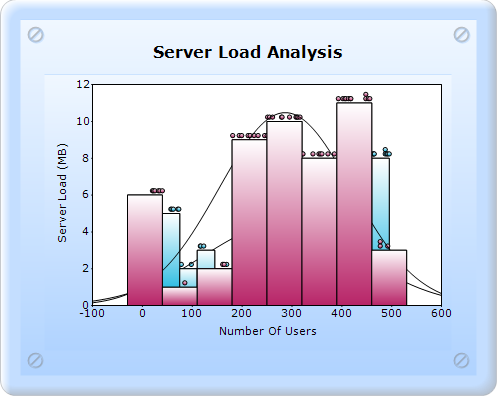
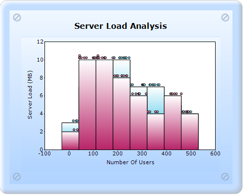
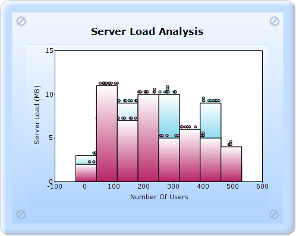
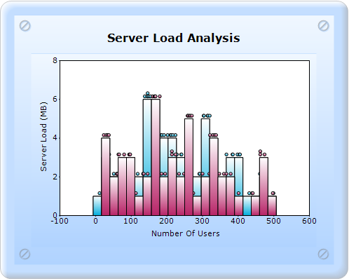

::: {style="DISPLAY: none"}
{#d2h_url_template}{#d2h_package_url style="WIDTH: 0px; DISPLAY: none; HEIGHT: 0px"}
:::

:::::::: {.d2h_secondary_topic style="PADDING-BOTTOM: 10pt; MARGIN: 0pt; PADDING-LEFT: 0pt; PADDING-RIGHT: 0pt; PADDING-TOP: 0pt"}
##### Histogram Properties {#histogram-properties style="tab-stops: 0pt"}

 

The properties that fall under the Histogram properties are the following:

[·      ]{style="FONT-FAMILY: Symbol"}DrawHistogramNormalDistribution

[·      ]{style="FONT-FAMILY: Symbol"}NumberofHistogramIntervals

[·      ]{style="FONT-FAMILY: Symbol"}ShowHistogramDataPoints

[]{style="FONT-FAMILY: 'Calibri','sans-serif'"} 

###### 5.2.1.3.3.1 DrawHistogramNormalDistribution {#drawhistogramnormaldistribution style="tab-stops: 0pt"}

The normal distribution curve is drawn by setting the DrawHistogramNormalDistribution property of the ChartSeries class to true.

::: {align="center"}
+------------------------------+-----------------+
| Details                                        |
+------------------------------+-----------------+
| Possible values              | True or False   |
+------------------------------+-----------------+
| Default value                | False           |
+------------------------------+-----------------+
| 2D/3D limitations            | No              |
+------------------------------+-----------------+
| Application to chart element | All series      |
+------------------------------+-----------------+
| Application to chart types   | Histogram chart |
+------------------------------+-----------------+
:::

[                                ]{style="FONT-FAMILY: 'Calibri','sans-serif'"}

{border="0"}

Figure 193: Histogram chart with NormalDistribution

###### 5.2.1.3.3.2 NumberOfHistogramIntervals {#numberofhistogramintervals style="tab-stops: 0pt"}

NumberOfHistogramIntervals gets or sets the number of histogram intervals.

::: {align="center"}
+------------------------------+--------------------+
| Details                                           |
+------------------------------+--------------------+
| Possible values              | Any numeric value. |
+------------------------------+--------------------+
| Default value                | 10                 |
+------------------------------+--------------------+
| 2D/3D limitations            | No                 |
+------------------------------+--------------------+
| Application to chart element | All series points. |
+------------------------------+--------------------+
| Application to chart types   | Histogram chart    |
+------------------------------+--------------------+
:::

[]{style="FONT-FAMILY: 'Calibri','sans-serif'"} 

{border="0"}

Figure 194: Histogram chart with Number of Intervals 20

###### 5.2.1.3.3.3 ShowHistogramDataPoints {#showhistogramdatapoints style="tab-stops: 0pt"}

ShowHistogramDataPoints indicates if the histogram data points should be shown.

::: {align="center"}
+-------------------------------------+-------------------------------------+
| Details[]{style="FONT-WEIGHT: normal"}                                    |
+-------------------------------------+-------------------------------------+
| Possible values                     | True - Displays the datapoints.     |
|                                     |                                     |
|                                     | False - Hides the datapoints.       |
+-------------------------------------+-------------------------------------+
| Default value                       | True                                |
+-------------------------------------+-------------------------------------+
| 2D/3D limitations                   | No                                  |
+-------------------------------------+-------------------------------------+
| Application to chart element        | Any series                          |
+-------------------------------------+-------------------------------------+
| Application to chart types          | Histogram chart                     |
+-------------------------------------+-------------------------------------+
:::

[]{style="FONT-FAMILY: 'Calibri','sans-serif'"} 

{border="0"}

Figure 195: Histogram chart with ShowDataPoints as false

{border="0"}

Figure 196: Histogram chart with ShowDataPoints as true

###### 5.2.1.3.3.4 Histogram chart with the Histogarm properties can be created through two ways: {#histogram-chart-with-the-histogarm-properties-can-be-created-through-two-ways style="tab-stops: 0pt"}

5.2.1.3.3.4.1      Builder

[]{style="FONT-FAMILY: 'Calibri','sans-serif'"} 

To create a Histogram chart with the Histogram properties through Builder:

1.   In Controller, return view to the corresponding View page.

[]{style="FONT-FAMILY: 'Calibri','sans-serif'"} 

+----------------------------------------------------------------------------------------------------------------------------------+
| \[C#\]                                                                                                                           |
|                                                                                                                                  |
| [        [public]{style="COLOR: blue"} [ActionResult]{style="COLOR: #2b91af"} SimpleChart()]{style="FONT-FAMILY: 'Courier New'"} |
|                                                                                                                                  |
| [        {            ]{style="FONT-FAMILY: 'Courier New'"}                                                                      |
|                                                                                                                                  |
| [            [return]{style="COLOR: blue"} View();]{style="FONT-FAMILY: 'Courier New'"}                                          |
|                                                                                                                                  |
| [        }]{style="FONT-FAMILY: 'Courier New'"}                                                                                  |
|                                                                                                                                  |
| []{style="FONT-FAMILY: Consolas; FONT-SIZE: 9.5pt"}                                                                              |
|                                                                                                                                  |
| []{style="FONT-FAMILY: Consolas; COLOR: blue; FONT-SIZE: 9.5pt"}                                                                 |
+----------------------------------------------------------------------------------------------------------------------------------+

[]{style="FONT-FAMILY: 'Calibri','sans-serif'"} 

2.   In the View page, invoke the ChartBuilder by using the control ID as the first argument.

3.   Create the **Series** with the SeriesType as **Histogram**, add the **Points**, and set the style.

4.   Set the ChartArea and ChartModel properties.

5.   Set the HistogramConfigItems, ShowHistogramDataPoints, NumberofIntervals, and ShowHistogramDataPoints.[]{style="FONT-FAMILY: Consolas; FONT-SIZE: 9.5pt"}

[]{style="FONT-FAMILY: Consolas; FONT-SIZE: 9.5pt"} 

[]{style="FONT-FAMILY: Consolas; FONT-SIZE: 9.5pt"} 

+----------------------------------------------------------------------------------------------------------------------------------------------------------------------------------------------------------------------------------------------------------------------------------------------+
| View \[ASPX\]                                                                                                                                                                                                                                                                                |
|                                                                                                                                                                                                                                                                                              |
|                                                                                                                                                                                                                                                                                              |
|                                                                                                                                                                                                                                                                                              |
| [       ]{style="FONT-FAMILY: Consolas; FONT-SIZE: 9.5pt"}[\<%]{style="FONT-FAMILY: 'Courier New'; BACKGROUND: yellow"}[          ]{style="FONT-FAMILY: 'Courier New'"}                                                                                                                      |
|                                                                                                                                                                                                                                                                                              |
| [                       [Random]{style="COLOR: #2b91af"} r = [new]{style="COLOR: blue"} [Random]{style="COLOR: #2b91af"}();]{style="FONT-FAMILY: 'Courier New'"}                                                                                                                             |
|                                                                                                                                                                                                                                                                                              |
| [        [%\>]{style="BACKGROUND: yellow"}]{style="FONT-FAMILY: 'Courier New'"}                                                                                                                                                                                                              |
|                                                                                                                                                                                                                                                                                              |
| [    [\<%]{style="BACKGROUND: yellow"}[=]{style="COLOR: blue"} Html.Chart([\"SimpleChart\"]{style="COLOR: #a31515"}).Series(series =\>{]{style="FONT-FAMILY: 'Courier New'"}                                                                                                                 |
|                                                                                                                                                                                                                                                                                              |
| [    **series.Add().Type(Syncfusion.Windows.Forms.Chart.[ChartSeriesType]{style="COLOR: #2b91af"}.Histogram)**]{style="FONT-FAMILY: 'Courier New'"}                                                                                                                                          |
|                                                                                                                                                                                                                                                                                              |
| [                .Text([\"Server 1\"]{style="COLOR: #a31515"})]{style="FONT-FAMILY: 'Courier New'"}                                                                                                                                                                                          |
|                                                                                                                                                                                                                                                                                              |
| **[                .ConfigItems(configitem =\> {]{style="FONT-FAMILY: 'Courier New'"}**                                                                                                                                                                                                      |
|                                                                                                                                                                                                                                                                                              |
| **[                    configitem.HistogramItem(histoItem =\> {]{style="FONT-FAMILY: 'Courier New'"}**                                                                                                                                                                                       |
|                                                                                                                                                                                                                                                                                              |
| **[                        histoItem.ShowDataPoints([false]{style="COLOR: blue"})]{style="FONT-FAMILY: 'Courier New'"}**                                                                                                                                                                     |
|                                                                                                                                                                                                                                                                                              |
| **[                                 .NumberOfIntervals(30)]{style="FONT-FAMILY: 'Courier New'"}**                                                                                                                                                                                            |
|                                                                                                                                                                                                                                                                                              |
| **[                                 .ShowNormalDistribution([false]{style="COLOR: blue"});      ]{style="FONT-FAMILY: 'Courier New'"}**                                                                                                                                                      |
|                                                                                                                                                                                                                                                                                              |
| **[                    });]{style="FONT-FAMILY: 'Courier New'"}**                                                                                                                                                                                                                            |
|                                                                                                                                                                                                                                                                                              |
| [              }).Points(points =\>]{style="FONT-FAMILY: 'Courier New'"}                                                                                                                                                                                                                     |
|                                                                                                                                                                                                                                                                                              |
| [                {]{style="FONT-FAMILY: 'Courier New'"}                                                                                                                                                                                                                                      |
|                                                                                                                                                                                                                                                                                              |
| [                    [for]{style="COLOR: blue"} ([int]{style="COLOR: blue"} j = 0; j \< 50; j++)]{style="FONT-FAMILY: 'Courier New'"}                                                                                                                                                        |
|                                                                                                                                                                                                                                                                                              |
| [                        points.Add(r.Next(10, 500), 1000);]{style="FONT-FAMILY: 'Courier New'"}                                                                                                                                                                                             |
|                                                                                                                                                                                                                                                                                              |
| [                });]{style="FONT-FAMILY: 'Courier New'"}                                                                                                                                                                                                                                    |
|                                                                                                                                                                                                                                                                                              |
| [    **series.Add().Type(Syncfusion.Windows.Forms.Chart.[ChartSeriesType]{style="COLOR: #2b91af"}.Histogram)**]{style="FONT-FAMILY: 'Courier New'"}                                                                                                                                          |
|                                                                                                                                                                                                                                                                                              |
| [                .Text([\"Server 2\"]{style="COLOR: #a31515"})]{style="FONT-FAMILY: 'Courier New'"}                                                                                                                                                                                          |
|                                                                                                                                                                                                                                                                                              |
| [                .ConfigItems(configitem =\>]{style="FONT-FAMILY: 'Courier New'"}                                                                                                                                                                                                            |
|                                                                                                                                                                                                                                                                                              |
| [                {]{style="FONT-FAMILY: 'Courier New'"}                                                                                                                                                                                                                                      |
|                                                                                                                                                                                                                                                                                              |
| **[                    configitem.HistogramItem(histoItem =\>]{style="FONT-FAMILY: 'Courier New'"}**                                                                                                                                                                                         |
|                                                                                                                                                                                                                                                                                              |
| **[                    {]{style="FONT-FAMILY: 'Courier New'"}**                                                                                                                                                                                                                              |
|                                                                                                                                                                                                                                                                                              |
| **[                        histoItem.ShowDataPoints([false]{style="COLOR: blue"})]{style="FONT-FAMILY: 'Courier New'"}**                                                                                                                                                                     |
|                                                                                                                                                                                                                                                                                              |
| **[                                 .NumberOfIntervals(30)]{style="FONT-FAMILY: 'Courier New'"}**                                                                                                                                                                                            |
|                                                                                                                                                                                                                                                                                              |
| **[                                 .ShowNormalDistribution([false]{style="COLOR: blue"});      ]{style="FONT-FAMILY: 'Courier New'"}**                                                                                                                                                      |
|                                                                                                                                                                                                                                                                                              |
| **[                    });]{style="FONT-FAMILY: 'Courier New'"}**                                                                                                                                                                                                                            |
|                                                                                                                                                                                                                                                                                              |
| [              }).Points(points =\>]{style="FONT-FAMILY: 'Courier New'"}                                                                                                                                                                                                                     |
|                                                                                                                                                                                                                                                                                              |
| [                {]{style="FONT-FAMILY: 'Courier New'"}                                                                                                                                                                                                                                      |
|                                                                                                                                                                                                                                                                                              |
| [                    [for]{style="COLOR: blue"} ([int]{style="COLOR: blue"} j = 0; j \< 50; j++)]{style="FONT-FAMILY: 'Courier New'"}                                                                                                                                                        |
|                                                                                                                                                                                                                                                                                              |
| [                        points.Add(r.Next(10, 500), 1000);]{style="FONT-FAMILY: 'Courier New'"}                                                                                                                                                                                             |
|                                                                                                                                                                                                                                                                                              |
| [                });]{style="FONT-FAMILY: 'Courier New'"}                                                                                                                                                                                                                                    |
|                                                                                                                                                                                                                                                                                              |
| [            }).ChartArea(area=\>{]{style="FONT-FAMILY: 'Courier New'"}                                                                                                                                                                                                                      |
|                                                                                                                                                                                                                                                                                              |
| [                area.XAxesLayoutMode(Syncfusion.Windows.Forms.Chart.[ChartAxesLayoutMode]{style="COLOR: #2b91af"}.Stacking);]{style="FONT-FAMILY: 'Courier New'"}                                                                                                                           |
|                                                                                                                                                                                                                                                                                              |
| [            }).Skins([ChartModelSkins]{style="COLOR: #2b91af"}.Office2007Blue)]{style="FONT-FAMILY: 'Courier New'"}                                                                                                                                                                         |
|                                                                                                                                                                                                                                                                                              |
| [// \-\-\-\-\-\-\-\-\-\-\-\-\-\-\-\-- Set the ChartArea and Chart Model Properties. Refer to the Histogram chart type link\-\-\-\-\-\-\-\-\-\-\-\-\-\-\-\-\-\-\-\-\-\-\-\-\-\-\-\-\-\-\-\--]{style="FONT-FAMILY: 'Courier New'; COLOR: green"}[        ]{style="FONT-FAMILY: 'Courier New'"} |
|                                                                                                                                                                                                                                                                                              |
| [    [%\>]{style="BACKGROUND: yellow"}]{style="FONT-FAMILY: 'Courier New'"}                                                                                                                                                                                                                  |
|                                                                                                                                                                                                                                                                                              |
| []{style="FONT-FAMILY: Consolas; COLOR: blue; FONT-SIZE: 9.5pt"}                                                                                                                                                                                                                             |
+----------------------------------------------------------------------------------------------------------------------------------------------------------------------------------------------------------------------------------------------------------------------------------------------+

[]{style="FONT-FAMILY: Consolas; BACKGROUND: yellow; FONT-SIZE: 9.5pt"} 

[]{style="FONT-FAMILY: Consolas; FONT-SIZE: 9.5pt"} 

[]{style="FONT-FAMILY: Consolas; FONT-SIZE: 9.5pt"} 

+----------------------------------------------------------------------------------------------------------------------------------------------------------------------------------------------------------------------------------------------------------------------------------------------+
| View \[cshtml\]                                                                                                                                                                                                                                                                              |
|                                                                                                                                                                                                                                                                                              |
|                                                                                                                                                                                                                                                                                              |
|                                                                                                                                                                                                                                                                                              |
| [       ]{style="FONT-FAMILY: Consolas; FONT-SIZE: 9.5pt"}[\@{]{style="FONT-FAMILY: 'Courier New'; BACKGROUND: yellow"}[          ]{style="FONT-FAMILY: 'Courier New'"}                                                                                                                      |
|                                                                                                                                                                                                                                                                                              |
| [                       [Random]{style="COLOR: #2b91af"} r = [new]{style="COLOR: blue"} [Random]{style="COLOR: #2b91af"}();]{style="FONT-FAMILY: 'Courier New'"}                                                                                                                             |
|                                                                                                                                                                                                                                                                                              |
| [        [}]{style="BACKGROUND: yellow"}]{style="FONT-FAMILY: 'Courier New'"}                                                                                                                                                                                                                |
|                                                                                                                                                                                                                                                                                              |
| [    [\@{]{style="BACKGROUND: yellow"} Html.Chart([\"SimpleChart\"]{style="COLOR: #a31515"}).Series(series =\>{]{style="FONT-FAMILY: 'Courier New'"}                                                                                                                                         |
|                                                                                                                                                                                                                                                                                              |
| [    **series.Add().Type(Syncfusion.Windows.Forms.Chart.[ChartSeriesType]{style="COLOR: #2b91af"}.Histogram)**]{style="FONT-FAMILY: 'Courier New'"}                                                                                                                                          |
|                                                                                                                                                                                                                                                                                              |
| [                .Text([\"Server 1\"]{style="COLOR: #a31515"})]{style="FONT-FAMILY: 'Courier New'"}                                                                                                                                                                                          |
|                                                                                                                                                                                                                                                                                              |
| **[                .ConfigItems(configitem =\> {]{style="FONT-FAMILY: 'Courier New'"}**                                                                                                                                                                                                      |
|                                                                                                                                                                                                                                                                                              |
| **[                    configitem.HistogramItem(histoItem =\> {]{style="FONT-FAMILY: 'Courier New'"}**                                                                                                                                                                                       |
|                                                                                                                                                                                                                                                                                              |
| **[                        histoItem.ShowDataPoints([false]{style="COLOR: blue"})]{style="FONT-FAMILY: 'Courier New'"}**                                                                                                                                                                     |
|                                                                                                                                                                                                                                                                                              |
| **[                                 .NumberOfIntervals(30)]{style="FONT-FAMILY: 'Courier New'"}**                                                                                                                                                                                            |
|                                                                                                                                                                                                                                                                                              |
| **[                                 .ShowNormalDistribution([false]{style="COLOR: blue"});      ]{style="FONT-FAMILY: 'Courier New'"}**                                                                                                                                                      |
|                                                                                                                                                                                                                                                                                              |
| **[                    });]{style="FONT-FAMILY: 'Courier New'"}**                                                                                                                                                                                                                            |
|                                                                                                                                                                                                                                                                                              |
| [              }).Points(points =\>]{style="FONT-FAMILY: 'Courier New'"}                                                                                                                                                                                                                     |
|                                                                                                                                                                                                                                                                                              |
| [                {]{style="FONT-FAMILY: 'Courier New'"}                                                                                                                                                                                                                                      |
|                                                                                                                                                                                                                                                                                              |
| [                    [for]{style="COLOR: blue"} ([int]{style="COLOR: blue"} j = 0; j \< 50; j++)]{style="FONT-FAMILY: 'Courier New'"}                                                                                                                                                        |
|                                                                                                                                                                                                                                                                                              |
| [                        points.Add(r.Next(10, 500), 1000);]{style="FONT-FAMILY: 'Courier New'"}                                                                                                                                                                                             |
|                                                                                                                                                                                                                                                                                              |
| [                });]{style="FONT-FAMILY: 'Courier New'"}                                                                                                                                                                                                                                    |
|                                                                                                                                                                                                                                                                                              |
| [    **series.Add().Type(Syncfusion.Windows.Forms.Chart.[ChartSeriesType]{style="COLOR: #2b91af"}.Histogram)**]{style="FONT-FAMILY: 'Courier New'"}                                                                                                                                          |
|                                                                                                                                                                                                                                                                                              |
| [                .Text([\"Server 2\"]{style="COLOR: #a31515"})]{style="FONT-FAMILY: 'Courier New'"}                                                                                                                                                                                          |
|                                                                                                                                                                                                                                                                                              |
| [                .ConfigItems(configitem =\>]{style="FONT-FAMILY: 'Courier New'"}                                                                                                                                                                                                            |
|                                                                                                                                                                                                                                                                                              |
| [                {]{style="FONT-FAMILY: 'Courier New'"}                                                                                                                                                                                                                                      |
|                                                                                                                                                                                                                                                                                              |
| **[                    configitem.HistogramItem(histoItem =\>]{style="FONT-FAMILY: 'Courier New'"}**                                                                                                                                                                                         |
|                                                                                                                                                                                                                                                                                              |
| **[                    {]{style="FONT-FAMILY: 'Courier New'"}**                                                                                                                                                                                                                              |
|                                                                                                                                                                                                                                                                                              |
| **[                        histoItem.ShowDataPoints([false]{style="COLOR: blue"})]{style="FONT-FAMILY: 'Courier New'"}**                                                                                                                                                                     |
|                                                                                                                                                                                                                                                                                              |
| **[                                 .NumberOfIntervals(30)]{style="FONT-FAMILY: 'Courier New'"}**                                                                                                                                                                                            |
|                                                                                                                                                                                                                                                                                              |
| **[                                 .ShowNormalDistribution([false]{style="COLOR: blue"});      ]{style="FONT-FAMILY: 'Courier New'"}**                                                                                                                                                      |
|                                                                                                                                                                                                                                                                                              |
| **[                    });]{style="FONT-FAMILY: 'Courier New'"}**                                                                                                                                                                                                                            |
|                                                                                                                                                                                                                                                                                              |
| [              }).Points(points =\>]{style="FONT-FAMILY: 'Courier New'"}                                                                                                                                                                                                                     |
|                                                                                                                                                                                                                                                                                              |
| [                {]{style="FONT-FAMILY: 'Courier New'"}                                                                                                                                                                                                                                      |
|                                                                                                                                                                                                                                                                                              |
| [                    [for]{style="COLOR: blue"} ([int]{style="COLOR: blue"} j = 0; j \< 50; j++)]{style="FONT-FAMILY: 'Courier New'"}                                                                                                                                                        |
|                                                                                                                                                                                                                                                                                              |
| [                        points.Add(r.Next(10, 500), 1000);]{style="FONT-FAMILY: 'Courier New'"}                                                                                                                                                                                             |
|                                                                                                                                                                                                                                                                                              |
| [                });]{style="FONT-FAMILY: 'Courier New'"}                                                                                                                                                                                                                                    |
|                                                                                                                                                                                                                                                                                              |
| [            }).ChartArea(area=\>{]{style="FONT-FAMILY: 'Courier New'"}                                                                                                                                                                                                                      |
|                                                                                                                                                                                                                                                                                              |
| [                area.XAxesLayoutMode(Syncfusion.Windows.Forms.Chart.[ChartAxesLayoutMode]{style="COLOR: #2b91af"}.Stacking);]{style="FONT-FAMILY: 'Courier New'"}                                                                                                                           |
|                                                                                                                                                                                                                                                                                              |
| [            }).Skins([ChartModelSkins]{style="COLOR: #2b91af"}.Office2007Blue).Render();]{style="FONT-FAMILY: 'Courier New'"}                                                                                                                                                               |
|                                                                                                                                                                                                                                                                                              |
| [// \-\-\-\-\-\-\-\-\-\-\-\-\-\-\-\-- Set the ChartArea and Chart Model Properties. Refer to the Histogram chart type link\-\-\-\-\-\-\-\-\-\-\-\-\-\-\-\-\-\-\-\-\-\-\-\-\-\-\-\-\-\-\-\--]{style="FONT-FAMILY: 'Courier New'; COLOR: green"}[        ]{style="FONT-FAMILY: 'Courier New'"} |
|                                                                                                                                                                                                                                                                                              |
| [    [}]{style="BACKGROUND: yellow"}]{style="FONT-FAMILY: 'Courier New'"}[]{style="FONT-FAMILY: Consolas; COLOR: blue; FONT-SIZE: 9.5pt"}                                                                                                                                                    |
+----------------------------------------------------------------------------------------------------------------------------------------------------------------------------------------------------------------------------------------------------------------------------------------------+

[]{style="FONT-FAMILY: Consolas; BACKGROUND: yellow; FONT-SIZE: 9.5pt"} 

[]{style="FONT-FAMILY: Consolas; BACKGROUND: yellow; FONT-SIZE: 9.5pt"} 

[]{style="FONT-FAMILY: Consolas; BACKGROUND: yellow; FONT-SIZE: 9.5pt"} 

6.   Build and run the application, to get the following output:

[]{style="FONT-FAMILY: Consolas; FONT-SIZE: 9.5pt"} 

[]{style="FONT-FAMILY: Consolas; FONT-SIZE: 9.5pt"} 

{border="0"}

Figure 197: Histogram chart with ShowNormalDistribution as false, ShowDataPoints as false, and NumberofHistogramIntervals as 30.

[]{style="FONT-FAMILY: Consolas; FONT-SIZE: 9.5pt"} 

5.2.1.3.3.4.2      ChartModel

To create a Histogram chart with the Histogram properties through ChartModel:

1.   In Controller, create an instance for **MVCChartModel**.

2.   Create an instance for **ChartSeries** and set the seriestype as **Histogram**, and set the properties.

3.   Set the ChartModel properties.

4.   Set the ShowHistogramDataPoints, NumberofIntervals, and ShowHistogramDataPoints properties of the Histogram Config Item.

5.   Return the View to the corresponding View page after setting the ChartModel to the ViewData.

[]{style="FONT-FAMILY: Consolas; FONT-SIZE: 9.5pt"} 

+-----------------------------------------------------------------------------------------------------------------------------------------------------------------------------------------------------------------------------------------------------------------------------------------+
| \[C#\]                                                                                                                                                                                                                                                                                  |
|                                                                                                                                                                                                                                                                                         |
|                                                                                                                                                                                                                                                                                         |
|                                                                                                                                                                                                                                                                                         |
| [     ]{style="FONT-FAMILY: Consolas; FONT-SIZE: 9.5pt"}[public]{style="FONT-FAMILY: 'Courier New'; COLOR: blue"}[ [ActionResult]{style="COLOR: #2b91af"} SimpleChart()]{style="FONT-FAMILY: 'Courier New'"}                                                                            |
|                                                                                                                                                                                                                                                                                         |
| [        {]{style="FONT-FAMILY: 'Courier New'"}                                                                                                                                                                                                                                         |
|                                                                                                                                                                                                                                                                                         |
| [            [MVCChartModel]{style="COLOR: #2b91af"} chartModel = [new]{style="COLOR: blue"} [MVCChartModel]{style="COLOR: #2b91af"}();]{style="FONT-FAMILY: 'Courier New'"}                                                                                                            |
|                                                                                                                                                                                                                                                                                         |
| [            [Random]{style="COLOR: #2b91af"} r = [new]{style="COLOR: blue"} [Random]{style="COLOR: #2b91af"}();]{style="FONT-FAMILY: 'Courier New'"}                                                                                                                                   |
|                                                                                                                                                                                                                                                                                         |
| [            [for]{style="COLOR: blue"} ([int]{style="COLOR: blue"} i = 1; i \<= 2; i++)]{style="FONT-FAMILY: 'Courier New'"}                                                                                                                                                           |
|                                                                                                                                                                                                                                                                                         |
| [            {]{style="FONT-FAMILY: 'Courier New'"}                                                                                                                                                                                                                                     |
|                                                                                                                                                                                                                                                                                         |
| []{style="FONT-FAMILY: 'Courier New'"}                                                                                                                                                                                                                                                  |
|                                                                                                                                                                                                                                                                                         |
| [            [// Create chart series and add data points to it.]{style="COLOR: green"}]{style="FONT-FAMILY: 'Courier New'"}                                                                                                                                                             |
|                                                                                                                                                                                                                                                                                         |
| **[]{style="FONT-FAMILY: 'Courier New'"}**                                                                                                                                                                                                                                              |
|                                                                                                                                                                                                                                                                                         |
| **[                [ChartSeries]{style="COLOR: #2b91af"} Histogram = [new]{style="COLOR: blue"} [ChartSeries]{style="COLOR: #2b91af"}([\"Series\"]{style="COLOR: #a31515"} + i.ToString(), [ChartSeriesType]{style="COLOR: #2b91af"}.Histogram);]{style="FONT-FAMILY: 'Courier New'"}** |
|                                                                                                                                                                                                                                                                                         |
| **[                [for]{style="COLOR: blue"} ([int]{style="COLOR: blue"} j = 0; j \< 50; j++)]{style="FONT-FAMILY: 'Courier New'"}**                                                                                                                                                   |
|                                                                                                                                                                                                                                                                                         |
| **[                    Histogram.Points.Add(r.Next(10, 500), 1000);]{style="FONT-FAMILY: 'Courier New'"}**                                                                                                                                                                              |
|                                                                                                                                                                                                                                                                                         |
| **[]{style="FONT-FAMILY: 'Courier New'"}**                                                                                                                                                                                                                                              |
|                                                                                                                                                                                                                                                                                         |
| **[                Histogram.Text = Histogram.Name;]{style="FONT-FAMILY: 'Courier New'"}**                                                                                                                                                                                              |
|                                                                                                                                                                                                                                                                                         |
| **[                Histogram.ConfigItems.HistogramItem.NumberOfIntervals = 30;]{style="FONT-FAMILY: 'Courier New'"}**                                                                                                                                                                   |
|                                                                                                                                                                                                                                                                                         |
| **[                Histogram.ConfigItems.HistogramItem.ShowNormalDistribution = [false]{style="COLOR: blue"};]{style="FONT-FAMILY: 'Courier New'"}**                                                                                                                                    |
|                                                                                                                                                                                                                                                                                         |
| **[                Histogram.ConfigItems.HistogramItem.ShowHistogramDataPoints = [false]{style="COLOR: blue"};]{style="FONT-FAMILY: 'Courier New'"}**                                                                                                                                   |
|                                                                                                                                                                                                                                                                                         |
| [            [// Add the series to the chart series collection.]{style="COLOR: green"}]{style="FONT-FAMILY: 'Courier New'"}                                                                                                                                                             |
|                                                                                                                                                                                                                                                                                         |
| [                chartModel.Series.Add(Histogram);]{style="FONT-FAMILY: 'Courier New'"}                                                                                                                                                                                                 |
|                                                                                                                                                                                                                                                                                         |
| [            }]{style="FONT-FAMILY: 'Courier New'"}                                                                                                                                                                                                                                     |
|                                                                                                                                                                                                                                                                                         |
| []{style="FONT-FAMILY: 'Courier New'"}                                                                                                                                                                                                                                                  |
|                                                                                                                                                                                                                                                                                         |
| []{style="FONT-FAMILY: 'Courier New'"}                                                                                                                                                                                                                                                  |
|                                                                                                                                                                                                                                                                                         |
| [// \-\-\-\-\-\-\-\-\-\-\-\-\-\-\-\-\-\-\-\-- Set the chartarea and chartmodel Properies\-\-\-\-\-\-\-\-\-\-\-\-\-\--]{style="FONT-FAMILY: 'Courier New'; COLOR: green"}[]{style="FONT-FAMILY: 'Courier New'"}                                                                          |
|                                                                                                                                                                                                                                                                                         |
| []{style="FONT-FAMILY: 'Courier New'"}                                                                                                                                                                                                                                                  |
|                                                                                                                                                                                                                                                                                         |
| [            ViewData.Model = chartModel;]{style="FONT-FAMILY: 'Courier New'"}                                                                                                                                                                                                          |
|                                                                                                                                                                                                                                                                                         |
| [            [return]{style="COLOR: blue"} View();]{style="FONT-FAMILY: 'Courier New'"}                                                                                                                                                                                                 |
|                                                                                                                                                                                                                                                                                         |
| [        }]{style="FONT-FAMILY: 'Courier New'"}                                                                                                                                                                                                                                         |
|                                                                                                                                                                                                                                                                                         |
| []{style="FONT-FAMILY: Consolas; COLOR: blue; FONT-SIZE: 9.5pt"}                                                                                                                                                                                                                        |
+-----------------------------------------------------------------------------------------------------------------------------------------------------------------------------------------------------------------------------------------------------------------------------------------+

[]{style="FONT-FAMILY: Consolas; FONT-SIZE: 9.5pt"} 

 

6.   In Aspx, invoke the ChartBuilder by using the control ID as the first argument, and convert the ViewData to MVCChartModel and set it as the second argument.

[]{style="FONT-FAMILY: Consolas; FONT-SIZE: 9.5pt"} 

::: {style="BORDER-BOTTOM: #c8c8c8 1pt solid; BORDER-LEFT: #c8c8c8 1pt solid; PADDING-BOTTOM: 1pt; MARGIN-TOP: 0pt; PADDING-LEFT: 4pt; PADDING-RIGHT: 4pt; MARGIN-BOTTOM: 0pt; BACKGROUND: #f0f0f0; BORDER-TOP: #c8c8c8 1pt solid; BORDER-RIGHT: #c8c8c8 1pt solid; PADDING-TOP: 1pt"}
View \[ASPX\]

 

[\<%]{style="FONT-FAMILY: 'Courier New'; BACKGROUND: yellow"}[=]{style="FONT-FAMILY: 'Courier New'; COLOR: blue"}[ Html.Chart([\"SimpleChart\"]{style="COLOR: #a31515"},([MVCChartModel]{style="COLOR: #2b91af"})ViewData.Model) [%\>]{style="BACKGROUND: yellow"}]{style="FONT-FAMILY: 'Courier New'"}[]{style="FONT-FAMILY: 'Courier New'; BACKGROUND: yellow; FONT-SIZE: 9.5pt"}
:::

[]{style="FONT-FAMILY: Consolas; FONT-SIZE: 9.5pt"} 

[]{style="FONT-FAMILY: Consolas; FONT-SIZE: 9.5pt"} 

::: {style="BORDER-BOTTOM: #c8c8c8 1pt solid; BORDER-LEFT: #c8c8c8 1pt solid; PADDING-BOTTOM: 1pt; MARGIN-TOP: 0pt; PADDING-LEFT: 4pt; PADDING-RIGHT: 4pt; MARGIN-BOTTOM: 0pt; BACKGROUND: #f0f0f0; BORDER-TOP: #c8c8c8 1pt solid; BORDER-RIGHT: #c8c8c8 1pt solid; PADDING-TOP: 1pt"}
View \[cshtml\]

 

[@(]{style="FONT-FAMILY: 'Courier New'; BACKGROUND: yellow"}[new]{style="FONT-FAMILY: Consolas; COLOR: blue; FONT-SIZE: 9.5pt"}[ [HtmlString]{style="COLOR: #2b91af"}]{style="FONT-FAMILY: Consolas; FONT-SIZE: 9.5pt"}[(Html.Chart([\"SimpleChart\"]{style="COLOR: #a31515"},([MVCChartModel]{style="COLOR: #2b91af"})ViewData.Model).ToString()) [)]{style="BACKGROUND: yellow"}]{style="FONT-FAMILY: 'Courier New'"}[]{style="FONT-FAMILY: 'Courier New'; BACKGROUND: yellow; FONT-SIZE: 9.5pt"}

 

 
:::

 

 

7.   Build and run the application, to get the following output:

[]{style="FONT-FAMILY: 'Calibri','sans-serif'"} 

{border="0"}

Figure 198: Histogram chart with ShowNormalDistribution as false, ShowDataPoints as false, and NumberofHistogramIntervals as 30

[]{#related-topics}
::::::::
