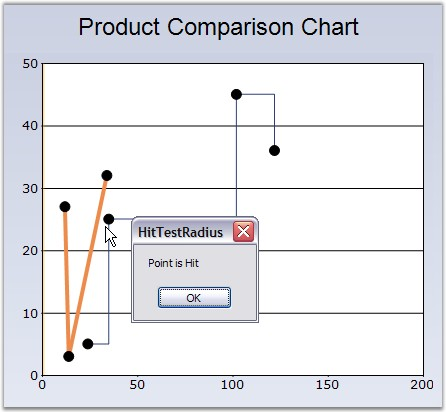

::: {style="DISPLAY: none"}
{#d2h_url_template}{#d2h_package_url style="WIDTH: 0px; DISPLAY: none; HEIGHT: 0px"}
:::

:::: {.d2h_secondary_topic style="PADDING-BOTTOM: 10pt; MARGIN: 0pt; PADDING-LEFT: 0pt; PADDING-RIGHT: 0pt; PADDING-TOP: 0pt"}
#### HitTestRadius {#hittestradius style="tab-stops: 0pt"}

 

HitTestRadius property controls the circle around this point, which will be considered within the bounds of this point for hit-testing purposes. The ChartRegion events such as ChartRegionClick, ChartRegionMouseDown, ChartRegionMouseHover, ChartRegionMouseLeave, ChartRegionMouseMove and ChartRegionMouseEnter, are being affected by this property.

 

::: {align="center"}
+------------------------------+--------------------------------+
| **Details**                                                   |
+------------------------------+--------------------------------+
| **Possible Values**          | A double values                |
+------------------------------+--------------------------------+
| **Default Value    **        | **7.5**                        |
+------------------------------+--------------------------------+
| **2D / 3D Limitations**      | None                           |
+------------------------------+--------------------------------+
| **Applies to Chart Element** | All series                     |
+------------------------------+--------------------------------+
| **Applies to Chart Types**   | Line Chart and Step Line Chart |
+------------------------------+--------------------------------+
:::

 

Here is some sample code.

 

+-------------------------------------------------------------------------------------------------------------------------------------------------------------------------------------------------------------------------------------------------------+
| **[\[C#\]]{style="FONT-FAMILY: 'Courier New'; COLOR: black"}**                                                                                                                                                                                        |
|                                                                                                                                                                                                                                                       |
| []{style="FONT-FAMILY: 'Courier New'"}                                                                                                                                                                                                                |
|                                                                                                                                                                                                                                                       |
| [// Specifies the circle radius around the point for HitTest]{style="FONT-FAMILY: 'Courier New'; COLOR: green"}                                                                                                                                       |
|                                                                                                                                                                                                                                                       |
| [this]{style="FONT-FAMILY: 'Courier New'; COLOR: blue"}[.chartControl1.Series\[0\].Style.HitTestRadius = 20;]{style="FONT-FAMILY: 'Courier New'"}                                                                                                     |
|                                                                                                                                                                                                                                                       |
| []{style="FONT-FAMILY: 'Courier New'"}                                                                                                                                                                                                                |
|                                                                                                                                                                                                                                                       |
| [// ChartClick Event will be fired if clicked within the above circle]{style="FONT-FAMILY: 'Courier New'; COLOR: green"}                                                                                                                              |
|                                                                                                                                                                                                                                                       |
| [void]{style="FONT-FAMILY: 'Courier New'; COLOR: blue"}[ chartControl1_ChartRegionClick([object]{style="COLOR: blue"} sender, Syncfusion.Windows.Forms.Chart.[ChartRegionMouseEventArgs]{style="COLOR: teal"} e)]{style="FONT-FAMILY: 'Courier New'"} |
|                                                                                                                                                                                                                                                       |
| [{]{style="FONT-FAMILY: 'Courier New'"}                                                                                                                                                                                                               |
|                                                                                                                                                                                                                                                       |
| [  // Message appears when User hits the test radius region ]{style="FONT-FAMILY: 'Courier New'; COLOR: green"}                                                                                                                                       |
|                                                                                                                                                                                                                                                       |
| [  [if]{style="COLOR: blue"} (e.Region.IsChartPoint)]{style="FONT-FAMILY: 'Courier New'"}                                                                                                                                                             |
|                                                                                                                                                                                                                                                       |
| [  {     ]{style="FONT-FAMILY: 'Courier New'"}                                                                                                                                                                                                        |
|                                                                                                                                                                                                                                                       |
| [    MessageBox]{style="FONT-FAMILY: 'Courier New'; COLOR: teal"}[.Show([\"Point is Hit\"]{style="COLOR: maroon"});]{style="FONT-FAMILY: 'Courier New'"}                                                                                              |
|                                                                                                                                                                                                                                                       |
| [  }]{style="FONT-FAMILY: 'Courier New'"}                                                                                                                                                                                                             |
|                                                                                                                                                                                                                                                       |
| [}]{style="FONT-FAMILY: 'Courier New'"}                                                                                                                                                                                                               |
+-------------------------------------------------------------------------------------------------------------------------------------------------------------------------------------------------------------------------------------------------------+

 

+----------------------------------------------------------------------------------------------------------------------------------------------------------------------------------------------------------------------------------------------------------------------------------------------------------------------------------------------------------------------------+
| **[\[VB.NET\]]{style="FONT-FAMILY: 'Courier New'; COLOR: black"}**                                                                                                                                                                                                                                                                                                         |
|                                                                                                                                                                                                                                                                                                                                                                            |
| **[]{style="FONT-FAMILY: 'Courier New'; COLOR: black"}**                                                                                                                                                                                                                                                                                                                   |
|                                                                                                                                                                                                                                                                                                                                                                            |
| [\' Specifies the circle radius around the point for HitTest]{style="FONT-FAMILY: 'Courier New'; COLOR: green"}                                                                                                                                                                                                                                                            |
|                                                                                                                                                                                                                                                                                                                                                                            |
| [Me]{style="FONT-FAMILY: 'Courier New'; COLOR: blue"}[.chartControl1.Series(0).Style.HitTestRadius = 20]{style="FONT-FAMILY: 'Courier New'"}                                                                                                                                                                                                                               |
|                                                                                                                                                                                                                                                                                                                                                                            |
| []{style="FONT-FAMILY: 'Courier New'"}                                                                                                                                                                                                                                                                                                                                     |
|                                                                                                                                                                                                                                                                                                                                                                            |
| [\' ChartClick Event will be fired if clicked within the above circle]{style="FONT-FAMILY: 'Courier New'; COLOR: green"}                                                                                                                                                                                                                                                   |
|                                                                                                                                                                                                                                                                                                                                                                            |
| [Private]{style="FONT-FAMILY: 'Courier New'; COLOR: blue"}[ [Sub]{style="COLOR: blue"} chartControl1_ChartRegionClick([ByVal]{style="COLOR: blue"} sender [As]{style="COLOR: blue"} [Object]{style="COLOR: blue"}, [ByVal]{style="COLOR: blue"} e [As]{style="COLOR: blue"} Syncfusion.Windows.Forms.Chart.ChartRegionMouseEventArgs)]{style="FONT-FAMILY: 'Courier New'"} |
|                                                                                                                                                                                                                                                                                                                                                                            |
| [  \' Message appears when User hits the test radius region ]{style="FONT-FAMILY: 'Courier New'; COLOR: green"}                                                                                                                                                                                                                                                            |
|                                                                                                                                                                                                                                                                                                                                                                            |
| [  [If]{style="COLOR: blue"} e.Region.IsChartPoint [Then]{style="COLOR: blue"}]{style="FONT-FAMILY: 'Courier New'"}                                                                                                                                                                                                                                                        |
|                                                                                                                                                                                                                                                                                                                                                                            |
| [      MessageBox.Show(\"Point is Hit\")]{style="FONT-FAMILY: 'Courier New'"}                                                                                                                                                                                                                                                                                              |
|                                                                                                                                                                                                                                                                                                                                                                            |
| [  [End]{style="COLOR: blue"} [If]{style="COLOR: blue"}]{style="FONT-FAMILY: 'Courier New'"}                                                                                                                                                                                                                                                                               |
|                                                                                                                                                                                                                                                                                                                                                                            |
| [End]{style="FONT-FAMILY: 'Courier New'; COLOR: blue"}[ [Sub]{style="COLOR: blue"}]{style="FONT-FAMILY: 'Courier New'"}                                                                                                                                                                                                                                                    |
+----------------------------------------------------------------------------------------------------------------------------------------------------------------------------------------------------------------------------------------------------------------------------------------------------------------------------------------------------------------------------+

 

{border="0"}

 

Figure 149: Chart with HitTestRadius = \"20\"

 

**See Also**

 

[Line Chart]{.UGHyperlink}[ ]{style="COLOR: black"},[ ]{style="COLOR: blue"}[StepLineChart]{.UGHyperlink}, [ChartRegionClick Events]{.UGHyperlink}[]{style="COLOR: black"}

 

[]{#p114} 

[]{#related-topics}
::::
