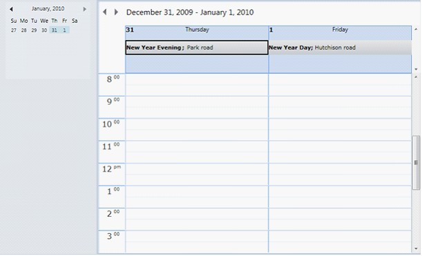

::: {style="DISPLAY: none"}
{#d2h_url_template}{#d2h_package_url style="WIDTH: 0px; DISPLAY: none; HEIGHT: 0px"}
:::

::::: {#nsbanner .d2h_main_nsbanner style="BORDER-BOTTOM: #999999 1px solid; POSITION: relative; PADDING-BOTTOM: 0px; BACKGROUND-COLOR: transparent; PADDING-LEFT: 0px; PADDING-RIGHT: 0px; DISPLAY: none; BORDER-TOP: #999999 1px solid; PADDING-TOP: 0px; LEFT: 0px"}
:::: {#TitleRow .d2h_main_titlerow style="PADDING-BOTTOM: 4px; BACKGROUND-COLOR: transparent; PADDING-LEFT: 22px; WIDTH: 100%; PADDING-RIGHT: 10px; DISPLAY: none; PADDING-TOP: 4px"}
::: {#ienav .d2h_main_ienav style="DISPLAY: none"}
{#D2HPrevious .D2HPreviousEnabled}  {#D2HNext .D2HNextEnabled}
:::
::::
:::::

:::: {#nstext .d2h_main_nstext style="PADDING-BOTTOM: 10px; BACKGROUND-COLOR: transparent; PADDING-LEFT: 22px; PADDING-RIGHT: 10px; HEIGHT: 100%; OVERFLOW: auto; PADDING-TOP: 5px" hasuserbackground="true" valign="bottom"}
::: {#d2h_breadcrumbs .d2h_breadcrumbs}
[Essential Studio User Guide Documentation](ms-xhelp:///?Id=12457748-09e3-4d74-a240-8e049cedf030){.d2h_breadcrumbsNormal}[ \> ]{.d2h_breadcrumbsLinkSeparator}[User Interface Edition](ms-xhelp:///?Id=c29296b7-531c-413b-a0ec-488ca1f7f669){.d2h_breadcrumbsNormal}[ \> ]{.d2h_breadcrumbsLinkSeparator}[Essential WPF](ms-xhelp:///?Id=7f4f82c5-151c-4262-94d0-75c4626c77bc){.d2h_breadcrumbsNormal}[ \> ]{.d2h_breadcrumbsLinkSeparator}[Essential Schedule]{.d2h_breadcrumbsContentsOnly}[ \> ]{.d2h_breadcrumbsLinkSeparator}[Concepts and Features](ms-xhelp:///?Id=7a8d4b17-d8b0-4ff4-a562-1b876329b0f4){.d2h_breadcrumbsNormal}[ \> ]{.d2h_breadcrumbsLinkSeparator}[Basic Features](ms-xhelp:///?Id=ea68be89-135e-489c-9ec3-16f72298a52d){.d2h_breadcrumbsNormal}
:::

### Holidays and Blackout Days for Schedule WPF {#holidays-and-blackout-days-for-schedule-wpf style="tab-stops: 0pt"}

Holidays and blackout days for Schedule WPF enable you to add holidays as all-day appointments, reminding you when the next holiday occurs.

Creating Holidays & Blackout Days for the Schedule Control

Add holidays to the schedule control by using the following code.

 

+---------------------------------------------------------------------------------------------------------------------------------------------------------------------------------------------------------------------------------------------------------------------------------------------------------------------------------------------------------------------------------------------------------+
| **[\[XAML\]]{style="FONT-FAMILY: 'Courier New'; COLOR: black"}**                                                                                                                                                                                                                                                                                                                                        |
|                                                                                                                                                                                                                                                                                                                                                                                                         |
| **[]{style="FONT-FAMILY: 'Times New Roman','serif'; COLOR: black"}**                                                                                                                                                                                                                                                                                                                                    |
|                                                                                                                                                                                                                                                                                                                                                                                                         |
| [\<]{style="FONT-FAMILY: 'Courier New'; COLOR: blue"}[schedule]{style="FONT-FAMILY: 'Courier New'; COLOR: #a31515"}[:]{style="FONT-FAMILY: 'Courier New'; COLOR: blue"}[Schedule.Holidays]{style="FONT-FAMILY: 'Courier New'; COLOR: #a31515"}[ \>]{style="FONT-FAMILY: 'Courier New'; COLOR: blue"}                                                                                                    |
|                                                                                                                                                                                                                                                                                                                                                                                                         |
| [    ]{style="FONT-FAMILY: 'Courier New'; COLOR: #a31515"}[\<]{style="FONT-FAMILY: 'Courier New'; COLOR: blue"}[schedule]{style="FONT-FAMILY: 'Courier New'; COLOR: #a31515"}[:]{style="FONT-FAMILY: 'Courier New'; COLOR: blue"}[ScheduleHolidaysCollection]{style="FONT-FAMILY: 'Courier New'; COLOR: #a31515"}[\>]{style="FONT-FAMILY: 'Courier New'; COLOR: blue"}                                  |
|                                                                                                                                                                                                                                                                                                                                                                                                         |
| [      ]{style="FONT-FAMILY: 'Courier New'; COLOR: #a31515"}[\<]{style="FONT-FAMILY: 'Courier New'; COLOR: blue"}[schedule]{style="FONT-FAMILY: 'Courier New'; COLOR: #a31515"}[:]{style="FONT-FAMILY: 'Courier New'; COLOR: blue"}[ScheduleHolidays]{style="FONT-FAMILY: 'Courier New'; COLOR: #a31515"}[ ]{style="FONT-FAMILY: 'Courier New'; COLOR: #000066"}                                        |
|                                                                                                                                                                                                                                                                                                                                                                                                         |
| [         ]{style="FONT-FAMILY: 'Courier New'; COLOR: #000066"}[StartTime]{style="FONT-FAMILY: 'Courier New'; COLOR: red"}[=\"1/1/2010 12:00:00 AM\"]{style="FONT-FAMILY: 'Courier New'; COLOR: blue"}[ EndTime]{style="FONT-FAMILY: 'Courier New'; COLOR: red"}[=\"1/1/2010 8:00:00 AM\"]{style="FONT-FAMILY: 'Courier New'; COLOR: blue"}[ ]{style="FONT-FAMILY: 'Courier New'; COLOR: #000066"}      |
|                                                                                                                                                                                                                                                                                                                                                                                                         |
| [         ]{style="FONT-FAMILY: 'Courier New'; COLOR: #000066"}[Subject]{style="FONT-FAMILY: 'Courier New'; COLOR: red"}[=\"New Year Day\"]{style="FONT-FAMILY: 'Courier New'; COLOR: blue"}[ Location]{style="FONT-FAMILY: 'Courier New'; COLOR: red"}[=\"Hutchison road\" /\>]{style="FONT-FAMILY: 'Courier New'; COLOR: blue"}                                                                       |
|                                                                                                                                                                                                                                                                                                                                                                                                         |
| [      ]{style="FONT-FAMILY: 'Courier New'; COLOR: #a31515"}[\<]{style="FONT-FAMILY: 'Courier New'; COLOR: blue"}[schedule]{style="FONT-FAMILY: 'Courier New'; COLOR: #a31515"}[:]{style="FONT-FAMILY: 'Courier New'; COLOR: blue"}[ScheduleHolidays]{style="FONT-FAMILY: 'Courier New'; COLOR: #a31515"}[ ]{style="FONT-FAMILY: 'Courier New'; COLOR: #000066"}                                        |
|                                                                                                                                                                                                                                                                                                                                                                                                         |
| [         ]{style="FONT-FAMILY: 'Courier New'; COLOR: #000066"}[StartTime]{style="FONT-FAMILY: 'Courier New'; COLOR: red"}[=\"12/31/2009 12:00:00 AM\"]{style="FONT-FAMILY: 'Courier New'; COLOR: blue"}[ EndTime]{style="FONT-FAMILY: 'Courier New'; COLOR: red"}[=\"12/31/2009 4:00:00 AM\"]{style="FONT-FAMILY: 'Courier New'; COLOR: blue"}[ ]{style="FONT-FAMILY: 'Courier New'; COLOR: #000066"}  |
|                                                                                                                                                                                                                                                                                                                                                                                                         |
| [         ]{style="FONT-FAMILY: 'Courier New'; COLOR: #000066"}[Subject]{style="FONT-FAMILY: 'Courier New'; COLOR: red"}[=\"New Year Evening\"]{style="FONT-FAMILY: 'Courier New'; COLOR: blue"}[ Location]{style="FONT-FAMILY: 'Courier New'; COLOR: red"}[=\"Park road\" /\>]{style="FONT-FAMILY: 'Courier New'; COLOR: blue"}                                                                        |
|                                                                                                                                                                                                                                                                                                                                                                                                         |
| [      ]{style="FONT-FAMILY: 'Courier New'; COLOR: #a31515"}[\<]{style="FONT-FAMILY: 'Courier New'; COLOR: blue"}[schedule]{style="FONT-FAMILY: 'Courier New'; COLOR: #a31515"}[:]{style="FONT-FAMILY: 'Courier New'; COLOR: blue"}[ScheduleHolidays]{style="FONT-FAMILY: 'Courier New'; COLOR: #a31515"}[ ]{style="FONT-FAMILY: 'Courier New'; COLOR: #000066"}                                        |
|                                                                                                                                                                                                                                                                                                                                                                                                         |
| [         ]{style="FONT-FAMILY: 'Courier New'; COLOR: #000066"}[StartTime]{style="FONT-FAMILY: 'Courier New'; COLOR: red"}[=\"12/25/2009 12:00:00 AM\"]{style="FONT-FAMILY: 'Courier New'; COLOR: blue"}[ EndTime]{style="FONT-FAMILY: 'Courier New'; COLOR: red"}[=\"12/25/2009 6:00:00 AM\"]{style="FONT-FAMILY: 'Courier New'; COLOR: blue"}[ ]{style="FONT-FAMILY: 'Courier New'; COLOR: #000066"}  |
|                                                                                                                                                                                                                                                                                                                                                                                                         |
| [         ]{style="FONT-FAMILY: 'Courier New'; COLOR: #000066"}[Subject]{style="FONT-FAMILY: 'Courier New'; COLOR: red"}[=\"Christmas Day\"]{style="FONT-FAMILY: 'Courier New'; COLOR: blue"}[ Location]{style="FONT-FAMILY: 'Courier New'; COLOR: red"}[=\"Hutchison road\" /\>]{style="FONT-FAMILY: 'Courier New'; COLOR: blue"}                                                                      |
|                                                                                                                                                                                                                                                                                                                                                                                                         |
| [      ]{style="FONT-FAMILY: 'Courier New'; COLOR: #a31515"}[\<]{style="FONT-FAMILY: 'Courier New'; COLOR: blue"}[schedule]{style="FONT-FAMILY: 'Courier New'; COLOR: #a31515"}[:]{style="FONT-FAMILY: 'Courier New'; COLOR: blue"}[ScheduleHolidays]{style="FONT-FAMILY: 'Courier New'; COLOR: #a31515"}[ ]{style="FONT-FAMILY: 'Courier New'; COLOR: #000066"}                                        |
|                                                                                                                                                                                                                                                                                                                                                                                                         |
| [         ]{style="FONT-FAMILY: 'Courier New'; COLOR: #000066"}[StartTime]{style="FONT-FAMILY: 'Courier New'; COLOR: red"}[=\"12/24/2009 12:00:00 AM\"]{style="FONT-FAMILY: 'Courier New'; COLOR: blue"}[ EndTime]{style="FONT-FAMILY: 'Courier New'; COLOR: red"}[=\"12/26/2009 4:00:00 AM\"]{style="FONT-FAMILY: 'Courier New'; COLOR: blue"}[  ]{style="FONT-FAMILY: 'Courier New'; COLOR: #000066"} |
|                                                                                                                                                                                                                                                                                                                                                                                                         |
| [         ]{style="FONT-FAMILY: 'Courier New'; COLOR: #000066"}[Subject]{style="FONT-FAMILY: 'Courier New'; COLOR: red"}[=\"Christmas Evening\"]{style="FONT-FAMILY: 'Courier New'; COLOR: blue"}[ Location]{style="FONT-FAMILY: 'Courier New'; COLOR: red"}[=\"Park road \" /\>]{style="FONT-FAMILY: 'Courier New'; COLOR: blue"}                                                                      |
|                                                                                                                                                                                                                                                                                                                                                                                                         |
| [       ]{style="FONT-FAMILY: 'Courier New'; COLOR: #a31515"}[\</]{style="FONT-FAMILY: 'Courier New'; COLOR: blue"}[schedule]{style="FONT-FAMILY: 'Courier New'; COLOR: #a31515"}[:]{style="FONT-FAMILY: 'Courier New'; COLOR: blue"}[ScheduleHolidaysCollection]{style="FONT-FAMILY: 'Courier New'; COLOR: #a31515"}[\>]{style="FONT-FAMILY: 'Courier New'; COLOR: blue"}                              |
|                                                                                                                                                                                                                                                                                                                                                                                                         |
| [\</]{style="FONT-FAMILY: 'Courier New'; COLOR: blue"}[schedule]{style="FONT-FAMILY: 'Courier New'; COLOR: #a31515"}[:]{style="FONT-FAMILY: 'Courier New'; COLOR: blue"}[Schedule.Holidays]{style="FONT-FAMILY: 'Courier New'; COLOR: #a31515"}[\>]{style="FONT-FAMILY: 'Courier New'; COLOR: blue"}                                                                                                    |
+---------------------------------------------------------------------------------------------------------------------------------------------------------------------------------------------------------------------------------------------------------------------------------------------------------------------------------------------------------------------------------------------------------+

[]{style="FONT-FAMILY: 'Times New Roman','serif'"} 

When the code runs, the following output displays.

[]{style="FONT-FAMILY: 'Trebuchet MS','sans-serif'; COLOR: #15428b; FONT-SIZE: 9pt"} 

{border="0"}

Figure 20: Holidays As Appointment

[]{#p18} 

[]{#related-topics}
::::
