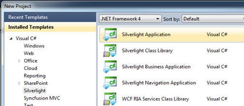
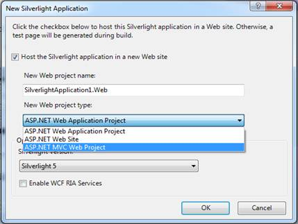
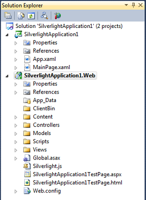
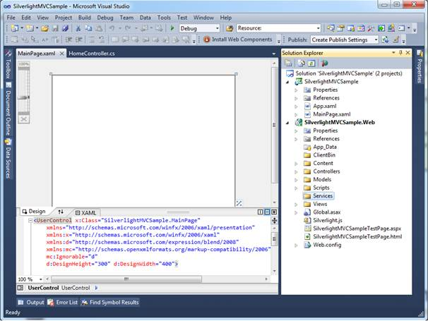
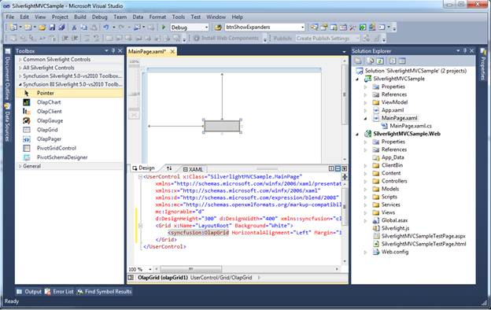
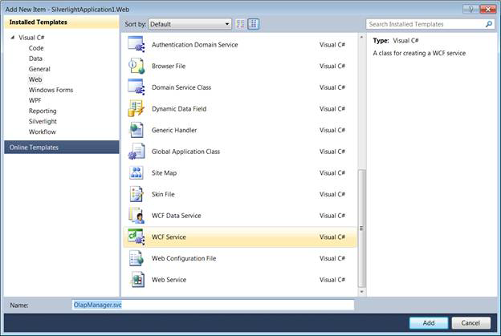
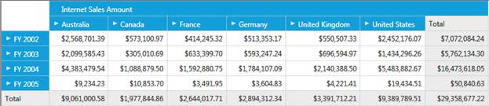

::: {style="DISPLAY: none"}
{#d2h_url_template}{#d2h_package_url style="WIDTH: 0px; DISPLAY: none; HEIGHT: 0px"}
:::

::::: {#nsbanner .d2h_main_nsbanner style="BORDER-BOTTOM: #999999 1px solid; POSITION: relative; PADDING-BOTTOM: 0px; BACKGROUND-COLOR: transparent; PADDING-LEFT: 0px; PADDING-RIGHT: 0px; DISPLAY: none; BORDER-TOP: #999999 1px solid; PADDING-TOP: 0px; LEFT: 0px"}
:::: {#TitleRow .d2h_main_titlerow style="PADDING-BOTTOM: 4px; BACKGROUND-COLOR: transparent; PADDING-LEFT: 22px; WIDTH: 100%; PADDING-RIGHT: 10px; DISPLAY: none; PADDING-TOP: 4px"}
::: {#ienav .d2h_main_ienav style="DISPLAY: none"}
{#D2HPrevious .D2HPreviousEnabled}  {#D2HNext .D2HNextEnabled}
:::
::::
:::::

::: {#nstext .d2h_main_nstext style="PADDING-BOTTOM: 10px; BACKGROUND-COLOR: transparent; PADDING-LEFT: 22px; PADDING-RIGHT: 10px; HEIGHT: 100%; OVERFLOW: auto; PADDING-TOP: 5px" hasuserbackground="true" valign="bottom"}
## Host BI Silverlight component in ASP.NET MVC Web Project {#host-bi-silverlight-component-in-asp.net-mvc-web-project style="tab-stops: 0pt"}

The following steps explain how to add the Silverlight components in MVC project:

1.   Open **Visual Studio IDE**.

2.   Go to **File** [à]{style="FONT-FAMILY: Wingdings"} **New** [à]{style="FONT-FAMILY: Wingdings"} **Project** and create a new Silverlight application.

 A dialog window opens as shown below:

{border="0"}

Figure 13: New Project Dialog Window

3.   Select *Silverlight Application* from the **New Project dialog window** and click **OK**.

The New Silverlight Application dialog opens as shown in the following screenshot:

{border="0"}

Figure 14: Web Project Selection Window

 The **Solution Explorer** window shows the Silverlight application with MVC project.

{border="0"}

Figure 15: Solution Explorer with Silverlight and MVC Projects

 

4.   Double-click to open the Main.xaml which is found under the Silverlight project in Solution Explorer as shown below:

{border="0"}

Figure 16: Designer Page

 

5.       Drag and drop the **OlapGrid** from the toolbox to the MainPage.xaml. 

{border="0"}

Figure 17: OlapGrid in Designer Page

 

6.   Add the following two assemblies as references to the web project:

[·    ]{style="FONT-FAMILY: Symbol; FONT-SIZE: 11pt"}Syncfusion.Olap.Base

[·    ]{style="FONT-FAMILY: Symbol; FONT-SIZE: 11pt"}Syncfusion.OlapSilverlight.BaseWrapper

 

7.   Add a WCF Service to the web project by right-clicking the **Project** **[à]{style="FONT-FAMILY: Wingdings"}  Add New Item** **[à]{style="FONT-FAMILY: Wingdings"} WCF Service**.

8.   Name the service as **OlapManager** and delete the **IOlapManager.cs** file as the service has to be inherited with the IOlapDataProvider.

 

{border="0"}

Figure 18: Add New Item Dialog (WCF Service)

 

9.   Inherit the newly added WCF service with the IOlapDataProvider and explicitly implement the IOlapDataProvider.

10.  The connection to the database is done with the help of the WCF service. The service has to be created and instantiated as described in the below code snippet.

 

The WCF Service has to implement the IOlapDataProvider interface. To implement this interface, you require the OlapDataProvider, which can be instantiated by passing the connection string.

The interface can be implemented as shown in the following code snippet:

 

+-------------------------------------------------------------------------------------------------------------------------------------------------------------------------------------------------------------------------------------------------+
| **[\[C#\]]{style="FONT-FAMILY: 'Courier New'"}**                                                                                                                                                                                                |
|                                                                                                                                                                                                                                                 |
| [public]{style="FONT-FAMILY: 'Courier New'; COLOR: blue"}[ [class]{style="COLOR: blue"} [OlapManager]{style="COLOR: #2b91af"} : [IOlapDataProvider]{style="COLOR: #2b91af"}]{style="FONT-FAMILY: 'Courier New'"}                                |
|                                                                                                                                                                                                                                                 |
| [{]{style="FONT-FAMILY: 'Courier New'"}                                                                                                                                                                                                         |
|                                                                                                                                                                                                                                                 |
| [        Syncfusion.OlapSilverlight.Manager.[OlapDataProvider]{style="COLOR: #2b91af"} dataManager;]{style="FONT-FAMILY: 'Courier New'"}                                                                                                        |
|                                                                                                                                                                                                                                                 |
|                                                                                                                                                                                                                                                 |
|                                                                                                                                                                                                                                                 |
| [        [///]{style="COLOR: gray"}[ ]{style="COLOR: green"}[\<summary\>]{style="COLOR: gray"}]{style="FONT-FAMILY: 'Courier New'"}                                                                                                             |
|                                                                                                                                                                                                                                                 |
| [        [///]{style="COLOR: gray"}[ Initializes a new instance of the ]{style="COLOR: green"}[\<see cref=\"OlapManager\"/\>]{style="COLOR: gray"}[ class.]{style="COLOR: green"}]{style="FONT-FAMILY: 'Courier New'"}                          |
|                                                                                                                                                                                                                                                 |
| [        [///]{style="COLOR: gray"}[ ]{style="COLOR: green"}[\</summary\>]{style="COLOR: gray"}]{style="FONT-FAMILY: 'Courier New'"}                                                                                                            |
|                                                                                                                                                                                                                                                 |
| [        [public]{style="COLOR: blue"} OlapManager()]{style="FONT-FAMILY: 'Courier New'"}                                                                                                                                                       |
|                                                                                                                                                                                                                                                 |
| [        {]{style="FONT-FAMILY: 'Courier New'"}                                                                                                                                                                                                 |
|                                                                                                                                                                                                                                                 |
| [            [string]{style="COLOR: blue"} connectionString = [\"DataSource=localhost;Initial Catalog=Adventure Works DW\"]{style="COLOR: #a31515"};]{style="FONT-FAMILY: 'Courier New'"}                                                       |
|                                                                                                                                                                                                                                                 |
| [            [// Instantiating the OlapDataProvider with connection string.]{style="COLOR: green"}]{style="FONT-FAMILY: 'Courier New'"}                                                                                                         |
|                                                                                                                                                                                                                                                 |
| [            dataManager = [new]{style="COLOR: blue"} [OlapDataProvider]{style="COLOR: #2b91af"}(connectionString);]{style="FONT-FAMILY: 'Courier New'"}                                                                                        |
|                                                                                                                                                                                                                                                 |
| [        }]{style="FONT-FAMILY: 'Courier New'"}                                                                                                                                                                                                 |
|                                                                                                                                                                                                                                                 |
|  [        #region]{style="FONT-FAMILY: 'Courier New'; COLOR: blue"}[ IOlapDataProvider Members]{style="FONT-FAMILY: 'Courier New'"}                                                                                                             |
|                                                                                                                                                                                                                                                 |
|  [        [///]{style="COLOR: gray"}[ ]{style="COLOR: green"}[\<summary\>]{style="COLOR: gray"}]{style="FONT-FAMILY: 'Courier New'"}                                                                                                            |
|                                                                                                                                                                                                                                                 |
| [        [///]{style="COLOR: gray"}[ Executing the CellSet by passing OlapReport.]{style="COLOR: green"}]{style="FONT-FAMILY: 'Courier New'"}                                                                                                   |
|                                                                                                                                                                                                                                                 |
| [        [///]{style="COLOR: gray"}[ ]{style="COLOR: green"}[\</summary\>]{style="COLOR: gray"}]{style="FONT-FAMILY: 'Courier New'"}                                                                                                            |
|                                                                                                                                                                                                                                                 |
| [        [///]{style="COLOR: gray"}[ ]{style="COLOR: green"}[\<param name=\"report\"\>]{style="COLOR: gray"}[The report.]{style="COLOR: green"}[\</param\>]{style="COLOR: gray"}]{style="FONT-FAMILY: 'Courier New'"}                           |
|                                                                                                                                                                                                                                                 |
| [        [///]{style="COLOR: gray"}[ ]{style="COLOR: green"}[\<returns\>]{style="COLOR: gray"}[ The CellSet]{style="COLOR: green"}[ \</returns\>]{style="COLOR: gray"}]{style="FONT-FAMILY: 'Courier New'"}                                     |
|                                                                                                                                                                                                                                                 |
| [        [public]{style="COLOR: blue"} Syncfusion.OlapSilverlight.Data.[CellSet]{style="COLOR: #2b91af"} ExecuteOlapReport(Syncfusion.OlapSilverlight.Reports.[OlapReport]{style="COLOR: #2b91af"} report)]{style="FONT-FAMILY: 'Courier New'"} |
|                                                                                                                                                                                                                                                 |
| [        {]{style="FONT-FAMILY: 'Courier New'"}                                                                                                                                                                                                 |
|                                                                                                                                                                                                                                                 |
| [            Syncfusion.OlapSilverlight.Data.[CellSet]{style="COLOR: #2b91af"} cellSet = [this]{style="COLOR: blue"}.dataManager.ExecuteOlapReport(report);]{style="FONT-FAMILY: 'Courier New'"}                                                |
|                                                                                                                                                                                                                                                 |
| [            [// Closing the provider connection.]{style="COLOR: green"}]{style="FONT-FAMILY: 'Courier New'"}                                                                                                                                   |
|                                                                                                                                                                                                                                                 |
| [            [this]{style="COLOR: blue"}.dataManager.DataProvider.CloseConnection();]{style="FONT-FAMILY: 'Courier New'"}                                                                                                                       |
|                                                                                                                                                                                                                                                 |
| [            [return]{style="COLOR: blue"} cellSet;]{style="FONT-FAMILY: 'Courier New'"}                                                                                                                                                        |
|                                                                                                                                                                                                                                                 |
| [        }]{style="FONT-FAMILY: 'Courier New'"}                                                                                                                                                                                                 |
|                                                                                                                                                                                                                                                 |
|  [        [///]{style="COLOR: gray"}[ ]{style="COLOR: green"}[\<summary\>]{style="COLOR: gray"}]{style="FONT-FAMILY: 'Courier New'"}                                                                                                            |
|                                                                                                                                                                                                                                                 |
| [        [///]{style="COLOR: gray"}[ Executing the CellSet by passing MDX Query.]{style="COLOR: green"}]{style="FONT-FAMILY: 'Courier New'"}                                                                                                    |
|                                                                                                                                                                                                                                                 |
| [        [///]{style="COLOR: gray"}[ ]{style="COLOR: green"}[\</summary\>]{style="COLOR: gray"}]{style="FONT-FAMILY: 'Courier New'"}                                                                                                            |
|                                                                                                                                                                                                                                                 |
| [        [///]{style="COLOR: gray"}[ ]{style="COLOR: green"}[\<param name=\"mdxQuery\"\>]{style="COLOR: gray"}[The MDX query.]{style="COLOR: green"}[\</param\>]{style="COLOR: gray"}]{style="FONT-FAMILY: 'Courier New'"}                      |
|                                                                                                                                                                                                                                                 |
| [        [///]{style="COLOR: gray"}[ ]{style="COLOR: green"}[\<returns\>]{style="COLOR: gray"}[ The CellSet]{style="COLOR: green"}[ \</returns\>]{style="COLOR: gray"}]{style="FONT-FAMILY: 'Courier New'"}                                     |
|                                                                                                                                                                                                                                                 |
| [        [public]{style="COLOR: blue"} Syncfusion.OlapSilverlight.Data.[CellSet]{style="COLOR: #2b91af"} ExecuteMdxQuery([string]{style="COLOR: blue"} mdxQuery)]{style="FONT-FAMILY: 'Courier New'"}                                           |
|                                                                                                                                                                                                                                                 |
| [        {]{style="FONT-FAMILY: 'Courier New'"}                                                                                                                                                                                                 |
|                                                                                                                                                                                                                                                 |
| [            Syncfusion.OlapSilverlight.Data.[CellSet]{style="COLOR: #2b91af"} cellSet = [this]{style="COLOR: blue"}.dataManager.ExecuteMdxQuery(mdxQuery);]{style="FONT-FAMILY: 'Courier New'"}                                                |
|                                                                                                                                                                                                                                                 |
| [            [// Closing the provider connection.]{style="COLOR: green"}]{style="FONT-FAMILY: 'Courier New'"}                                                                                                                                   |
|                                                                                                                                                                                                                                                 |
| [            [this]{style="COLOR: blue"}.dataManager.DataProvider.CloseConnection();]{style="FONT-FAMILY: 'Courier New'"}                                                                                                                       |
|                                                                                                                                                                                                                                                 |
| [            [return]{style="COLOR: blue"} cellSet;]{style="FONT-FAMILY: 'Courier New'"}                                                                                                                                                        |
|                                                                                                                                                                                                                                                 |
| [        }]{style="FONT-FAMILY: 'Courier New'"}                                                                                                                                                                                                 |
|                                                                                                                                                                                                                                                 |
|                                                                                                                                                                                                                                                 |
|                                                                                                                                                                                                                                                 |
| [        [public]{style="COLOR: blue"} [MemberCollection]{style="COLOR: #2b91af"} GetChildMembers([string]{style="COLOR: blue"} memberUniqueName, [string]{style="COLOR: blue"} cubeName)]{style="FONT-FAMILY: 'Courier New'"}                  |
|                                                                                                                                                                                                                                                 |
| [        {]{style="FONT-FAMILY: 'Courier New'"}                                                                                                                                                                                                 |
|                                                                                                                                                                                                                                                 |
| [            [throw]{style="COLOR: blue"} [new]{style="COLOR: blue"} [NotImplementedException]{style="COLOR: #2b91af"}();]{style="FONT-FAMILY: 'Courier New'"}                                                                                  |
|                                                                                                                                                                                                                                                 |
| [        }]{style="FONT-FAMILY: 'Courier New'"}                                                                                                                                                                                                 |
|                                                                                                                                                                                                                                                 |
|  [        [public]{style="COLOR: blue"} [CubeSchema]{style="COLOR: #2b91af"} GetCubeSchema([string]{style="COLOR: blue"} cubeName)]{style="FONT-FAMILY: 'Courier New'"}                                                                         |
|                                                                                                                                                                                                                                                 |
| [        {]{style="FONT-FAMILY: 'Courier New'"}                                                                                                                                                                                                 |
|                                                                                                                                                                                                                                                 |
| [            [throw]{style="COLOR: blue"} [new]{style="COLOR: blue"} [NotImplementedException]{style="COLOR: #2b91af"}();]{style="FONT-FAMILY: 'Courier New'"}                                                                                  |
|                                                                                                                                                                                                                                                 |
| [        }]{style="FONT-FAMILY: 'Courier New'"}                                                                                                                                                                                                 |
|                                                                                                                                                                                                                                                 |
|  [        [public]{style="COLOR: blue"} [CubeInfoCollection]{style="COLOR: #2b91af"} GetCubes()]{style="FONT-FAMILY: 'Courier New'"}                                                                                                            |
|                                                                                                                                                                                                                                                 |
| [        {]{style="FONT-FAMILY: 'Courier New'"}                                                                                                                                                                                                 |
|                                                                                                                                                                                                                                                 |
| [            [throw]{style="COLOR: blue"} [new]{style="COLOR: blue"} [NotImplementedException]{style="COLOR: #2b91af"}();]{style="FONT-FAMILY: 'Courier New'"}                                                                                  |
|                                                                                                                                                                                                                                                 |
| [        }]{style="FONT-FAMILY: 'Courier New'"}                                                                                                                                                                                                 |
|                                                                                                                                                                                                                                                 |
|  [        [public]{style="COLOR: blue"} [MemberCollection]{style="COLOR: #2b91af"} GetLevelMembers([string]{style="COLOR: blue"} levelUniqueName, [string]{style="COLOR: blue"} cubeName)]{style="FONT-FAMILY: 'Courier New'"}                  |
|                                                                                                                                                                                                                                                 |
| [        {]{style="FONT-FAMILY: 'Courier New'"}                                                                                                                                                                                                 |
|                                                                                                                                                                                                                                                 |
| [            [throw]{style="COLOR: blue"} [new]{style="COLOR: blue"} [NotImplementedException]{style="COLOR: #2b91af"}();]{style="FONT-FAMILY: 'Courier New'"}                                                                                  |
|                                                                                                                                                                                                                                                 |
| [        }]{style="FONT-FAMILY: 'Courier New'"}                                                                                                                                                                                                 |
|                                                                                                                                                                                                                                                 |
|  [        #endregion]{style="FONT-FAMILY: 'Courier New'; COLOR: blue"}                                                                                                                                                                          |
|                                                                                                                                                                                                                                                 |
| [}]{style="FONT-FAMILY: 'Courier New'"}                                                                                                                                                                                                         |
+-------------------------------------------------------------------------------------------------------------------------------------------------------------------------------------------------------------------------------------------------+

 

+----------------------------------------------------------------------------------------------------------------------------------------------------------------------------------------------------------------------------------------------------------------------------------------------------------------------------------------------------------------------------------+
| **[\[VB\]]{style="FONT-FAMILY: 'Courier New'"}**                                                                                                                                                                                                                                                                                                                                 |
|                                                                                                                                                                                                                                                                                                                                                                                  |
|  [Public]{style="FONT-FAMILY: 'Courier New'; COLOR: blue"}[ [Class]{style="COLOR: blue"} OlapManager]{style="FONT-FAMILY: 'Courier New'"}                                                                                                                                                                                                                                        |
|                                                                                                                                                                                                                                                                                                                                                                                  |
| [       [Implements]{style="COLOR: blue"} IOlapDataProvider]{style="FONT-FAMILY: 'Courier New'"}                                                                                                                                                                                                                                                                                 |
|                                                                                                                                                                                                                                                                                                                                                                                  |
| [            [Private]{style="COLOR: blue"} dataManager [As]{style="COLOR: blue"} Syncfusion.OlapSilverlight.Manager.OlapDataProvider]{style="FONT-FAMILY: 'Courier New'"}                                                                                                                                                                                                       |
|                                                                                                                                                                                                                                                                                                                                                                                  |
|  [            [\'\'\' \<summary\>]{style="COLOR: green"}]{style="FONT-FAMILY: 'Courier New'"}                                                                                                                                                                                                                                                                                    |
|                                                                                                                                                                                                                                                                                                                                                                                  |
| [            [\'\'\' Initializes a new instance of the \<see cref=\"OlapManager\"/\> class.]{style="COLOR: green"}]{style="FONT-FAMILY: 'Courier New'"}                                                                                                                                                                                                                          |
|                                                                                                                                                                                                                                                                                                                                                                                  |
| [            [\'\'\' \</summary\>]{style="COLOR: green"}]{style="FONT-FAMILY: 'Courier New'"}                                                                                                                                                                                                                                                                                    |
|                                                                                                                                                                                                                                                                                                                                                                                  |
| [            [Public]{style="COLOR: blue"} [Sub]{style="COLOR: blue"} [New]{style="COLOR: blue"}()]{style="FONT-FAMILY: 'Courier New'"}                                                                                                                                                                                                                                          |
|                                                                                                                                                                                                                                                                                                                                                                                  |
| [                  [Dim]{style="COLOR: blue"} connectionString [As]{style="COLOR: blue"} [String]{style="COLOR: blue"} = \"DataSource=localhost;Initial Catalog=Adventure Works DW\"]{style="FONT-FAMILY: 'Courier New'"}                                                                                                                                                        |
|                                                                                                                                                                                                                                                                                                                                                                                  |
| [                  [\' Instantiating the OlapDataProvider with connection string]{style="COLOR: green"}]{style="FONT-FAMILY: 'Courier New'"}                                                                                                                                                                                                                                     |
|                                                                                                                                                                                                                                                                                                                                                                                  |
| [                  dataManager = [New]{style="COLOR: blue"} OlapDataProvider(connectionString)]{style="FONT-FAMILY: 'Courier New'"}                                                                                                                                                                                                                                              |
|                                                                                                                                                                                                                                                                                                                                                                                  |
| [            [End]{style="COLOR: blue"} [Sub]{style="COLOR: blue"}]{style="FONT-FAMILY: 'Courier New'"}                                                                                                                                                                                                                                                                          |
|                                                                                                                                                                                                                                                                                                                                                                                  |
|  [            [#Region]{style="COLOR: blue"} \"IOlapDataProvider Members\"]{style="FONT-FAMILY: 'Courier New'"}                                                                                                                                                                                                                                                                  |
|                                                                                                                                                                                                                                                                                                                                                                                  |
|  [            [\'\'\' \<summary\>]{style="COLOR: green"}]{style="FONT-FAMILY: 'Courier New'"}                                                                                                                                                                                                                                                                                    |
|                                                                                                                                                                                                                                                                                                                                                                                  |
| [            [\'\'\' Executing the CellSet by passing OlapReport]{style="COLOR: green"}]{style="FONT-FAMILY: 'Courier New'"}                                                                                                                                                                                                                                                     |
|                                                                                                                                                                                                                                                                                                                                                                                  |
| [            [\'\'\' \</summary\>]{style="COLOR: green"}]{style="FONT-FAMILY: 'Courier New'"}                                                                                                                                                                                                                                                                                    |
|                                                                                                                                                                                                                                                                                                                                                                                  |
| [            [\'\'\' \<param name=\"report\"\>The report.\</param\>]{style="COLOR: green"}]{style="FONT-FAMILY: 'Courier New'"}                                                                                                                                                                                                                                                  |
|                                                                                                                                                                                                                                                                                                                                                                                  |
| [            [\'\'\' \<returns\>\</returns\>]{style="COLOR: green"}]{style="FONT-FAMILY: 'Courier New'"}                                                                                                                                                                                                                                                                         |
|                                                                                                                                                                                                                                                                                                                                                                                  |
| [            [Public]{style="COLOR: blue"} [Function]{style="COLOR: blue"} ExecuteOlapReport([ByVal]{style="COLOR: blue"} report [As]{style="COLOR: blue"} Syncfusion.OlapSilverlight.Reports.OlapReport) [As]{style="COLOR: blue"} Syncfusion.OlapSilverlight.Data.CellSet]{style="FONT-FAMILY: 'Courier New'"}                                                                 |
|                                                                                                                                                                                                                                                                                                                                                                                  |
| [                  [Dim]{style="COLOR: blue"} cellSet [As]{style="COLOR: blue"} Syncfusion.OlapSilverlight.Data.CellSet = [Me]{style="COLOR: blue"}.dataManager.ExecuteOlapReport(report)]{style="FONT-FAMILY: 'Courier New'"}                                                                                                                                                   |
|                                                                                                                                                                                                                                                                                                                                                                                  |
| [                  [\' Closing the provider connection]{style="COLOR: green"}]{style="FONT-FAMILY: 'Courier New'"}                                                                                                                                                                                                                                                               |
|                                                                                                                                                                                                                                                                                                                                                                                  |
| [                  [Me]{style="COLOR: blue"}.dataManager.DataProvider.CloseConnection()]{style="FONT-FAMILY: 'Courier New'"}                                                                                                                                                                                                                                                     |
|                                                                                                                                                                                                                                                                                                                                                                                  |
| [                  [Return]{style="COLOR: blue"} cellSet]{style="FONT-FAMILY: 'Courier New'"}                                                                                                                                                                                                                                                                                    |
|                                                                                                                                                                                                                                                                                                                                                                                  |
| [            [End]{style="COLOR: blue"} [Function]{style="COLOR: blue"}]{style="FONT-FAMILY: 'Courier New'"}                                                                                                                                                                                                                                                                     |
|                                                                                                                                                                                                                                                                                                                                                                                  |
|  [            [\'\'\' \<summary\>]{style="COLOR: green"}]{style="FONT-FAMILY: 'Courier New'"}                                                                                                                                                                                                                                                                                    |
|                                                                                                                                                                                                                                                                                                                                                                                  |
| [            [\'\'\' Executing the CellSet by passing MDX Query]{style="COLOR: green"}]{style="FONT-FAMILY: 'Courier New'"}                                                                                                                                                                                                                                                      |
|                                                                                                                                                                                                                                                                                                                                                                                  |
| [            [\'\'\' \</summary\>]{style="COLOR: green"}]{style="FONT-FAMILY: 'Courier New'"}                                                                                                                                                                                                                                                                                    |
|                                                                                                                                                                                                                                                                                                                                                                                  |
| [            [\'\'\' \<param name=\"mdxQuery\"\>The MDX query.\</param\>]{style="COLOR: green"}]{style="FONT-FAMILY: 'Courier New'"}                                                                                                                                                                                                                                             |
|                                                                                                                                                                                                                                                                                                                                                                                  |
| [            [\'\'\' \<returns\> The CellSet \</returns\>]{style="COLOR: green"}]{style="FONT-FAMILY: 'Courier New'"}                                                                                                                                                                                                                                                            |
|                                                                                                                                                                                                                                                                                                                                                                                  |
| [            [Public]{style="COLOR: blue"} [Function]{style="COLOR: blue"} ExecuteMdxQuery([ByVal]{style="COLOR: blue"} mdxQuery [As]{style="COLOR: blue"} [String]{style="COLOR: blue"}) [As]{style="COLOR: blue"} Syncfusion.OlapSilverlight.Data.CellSet]{style="FONT-FAMILY: 'Courier New'"}                                                                                 |
|                                                                                                                                                                                                                                                                                                                                                                                  |
| [                  [Dim]{style="COLOR: blue"} cellSet [As]{style="COLOR: blue"} Syncfusion.OlapSilverlight.Data.CellSet = [Me]{style="COLOR: blue"}.dataManager.ExecuteMdxQuery(mdxQuery)]{style="FONT-FAMILY: 'Courier New'"}                                                                                                                                                   |
|                                                                                                                                                                                                                                                                                                                                                                                  |
| [                  [\'Closing the provider connection.]{style="COLOR: green"}]{style="FONT-FAMILY: 'Courier New'"}                                                                                                                                                                                                                                                               |
|                                                                                                                                                                                                                                                                                                                                                                                  |
| [                  [Me]{style="COLOR: blue"}.dataManager.DataProvider.CloseConnection()]{style="FONT-FAMILY: 'Courier New'"}                                                                                                                                                                                                                                                     |
|                                                                                                                                                                                                                                                                                                                                                                                  |
| [                  [Return]{style="COLOR: blue"} cellSet]{style="FONT-FAMILY: 'Courier New'"}                                                                                                                                                                                                                                                                                    |
|                                                                                                                                                                                                                                                                                                                                                                                  |
| [            [End]{style="COLOR: blue"} [Function]{style="COLOR: blue"}]{style="FONT-FAMILY: 'Courier New'"}                                                                                                                                                                                                                                                                     |
|                                                                                                                                                                                                                                                                                                                                                                                  |
|                                                                                                                                                                                                                                                                                                                                                                                  |
|                                                                                                                                                                                                                                                                                                                                                                                  |
| [            [Public]{style="COLOR: blue"} [Function]{style="COLOR: blue"} GetChildMembers([ByVal]{style="COLOR: blue"} memberUniqueName [As]{style="COLOR: blue"} [String]{style="COLOR: blue"}, [ByVal]{style="COLOR: blue"} cubeName [As]{style="COLOR: blue"} [String]{style="COLOR: blue"}) [As]{style="COLOR: blue"} MemberCollection]{style="FONT-FAMILY: 'Courier New'"} |
|                                                                                                                                                                                                                                                                                                                                                                                  |
| [                  [Throw]{style="COLOR: blue"} [New]{style="COLOR: blue"} NotImplementedException()]{style="FONT-FAMILY: 'Courier New'"}                                                                                                                                                                                                                                        |
|                                                                                                                                                                                                                                                                                                                                                                                  |
| [            [End]{style="COLOR: blue"} [Function]{style="COLOR: blue"}]{style="FONT-FAMILY: 'Courier New'"}                                                                                                                                                                                                                                                                     |
|                                                                                                                                                                                                                                                                                                                                                                                  |
|                                                                                                                                                                                                                                                                                                                                                                                  |
|                                                                                                                                                                                                                                                                                                                                                                                  |
| [            [Public]{style="COLOR: blue"} [Function]{style="COLOR: blue"} GetCubeSchema([ByVal]{style="COLOR: blue"} cubeName [As]{style="COLOR: blue"} [String]{style="COLOR: blue"}) [As]{style="COLOR: blue"} CubeSchema]{style="FONT-FAMILY: 'Courier New'"}                                                                                                                |
|                                                                                                                                                                                                                                                                                                                                                                                  |
| [                  [Throw]{style="COLOR: blue"} [New]{style="COLOR: blue"} NotImplementedException()]{style="FONT-FAMILY: 'Courier New'"}                                                                                                                                                                                                                                        |
|                                                                                                                                                                                                                                                                                                                                                                                  |
| [            [End]{style="COLOR: blue"} [Function]{style="COLOR: blue"}]{style="FONT-FAMILY: 'Courier New'"}                                                                                                                                                                                                                                                                     |
|                                                                                                                                                                                                                                                                                                                                                                                  |
|                                                                                                                                                                                                                                                                                                                                                                                  |
|                                                                                                                                                                                                                                                                                                                                                                                  |
| [            [Public]{style="COLOR: blue"} [Function]{style="COLOR: blue"} GetCubes() [As]{style="COLOR: blue"} CubeInfoCollection]{style="FONT-FAMILY: 'Courier New'"}                                                                                                                                                                                                          |
|                                                                                                                                                                                                                                                                                                                                                                                  |
| [                  [Throw]{style="COLOR: blue"} [New]{style="COLOR: blue"} NotImplementedException()]{style="FONT-FAMILY: 'Courier New'"}                                                                                                                                                                                                                                        |
|                                                                                                                                                                                                                                                                                                                                                                                  |
| [            [End]{style="COLOR: blue"} [Function]{style="COLOR: blue"}]{style="FONT-FAMILY: 'Courier New'"}                                                                                                                                                                                                                                                                     |
|                                                                                                                                                                                                                                                                                                                                                                                  |
|                                                                                                                                                                                                                                                                                                                                                                                  |
|                                                                                                                                                                                                                                                                                                                                                                                  |
| [            [Public]{style="COLOR: blue"} [Function]{style="COLOR: blue"} GetLevelMembers([ByVal]{style="COLOR: blue"} levelUniqueName [As]{style="COLOR: blue"} [String]{style="COLOR: blue"}, [ByVal]{style="COLOR: blue"} cubeName [As]{style="COLOR: blue"} [String]{style="COLOR: blue"}) [As]{style="COLOR: blue"} MemberCollection]{style="FONT-FAMILY: 'Courier New'"}  |
|                                                                                                                                                                                                                                                                                                                                                                                  |
| [                  [Throw]{style="COLOR: blue"} [New]{style="COLOR: blue"} NotImplementedException()]{style="FONT-FAMILY: 'Courier New'"}                                                                                                                                                                                                                                        |
|                                                                                                                                                                                                                                                                                                                                                                                  |
| [            [End]{style="COLOR: blue"} [Function]{style="COLOR: blue"}]{style="FONT-FAMILY: 'Courier New'"}                                                                                                                                                                                                                                                                     |
|                                                                                                                                                                                                                                                                                                                                                                                  |
|                                                                                                                                                                                                                                                                                                                                                                                  |
|                                                                                                                                                                                                                                                                                                                                                                                  |
| [            [#End Region]{style="COLOR: blue"}]{style="FONT-FAMILY: 'Courier New'"}                                                                                                                                                                                                                                                                                             |
|                                                                                                                                                                                                                                                                                                                                                                                  |
| [ [End]{style="COLOR: blue"} [Class]{style="COLOR: blue"}]{style="FONT-FAMILY: 'Courier New'"}                                                                                                                                                                                                                                                                                   |
+----------------------------------------------------------------------------------------------------------------------------------------------------------------------------------------------------------------------------------------------------------------------------------------------------------------------------------------------------------------------------------+

 

11.  Include the custom binding and the service endpoint address in the Web.Config file under the ServiceModel section.

 

+------------------------------------------------------------------------------------------------------------------------------------------------------------------------------------------------------------------------------------------------------------------------------------------------------------------------------------------------------------------------------------------------------------------------------------------------------------------------------------------------------------------------------------------------------------------------------------------------------------------------------------------------------------------------------------------------------------------------------------------------------------------------------------+
| **[\[Web.Config\]]{style="FONT-FAMILY: 'Courier New'; COLOR: black"}**                                                                                                                                                                                                                                                                                                                                                                                                                                                                                                                                                                                                                                                                                                             |
|                                                                                                                                                                                                                                                                                                                                                                                                                                                                                                                                                                                                                                                                                                                                                                                    |
|  [     \<!\--]{style="FONT-FAMILY: 'Courier New'; COLOR: blue"}[Binding]{style="FONT-FAMILY: 'Courier New'; COLOR: green"}[\--\>]{style="FONT-FAMILY: 'Courier New'; COLOR: blue"}                                                                                                                                                                                                                                                                                                                                                                                                                                                                                                                                                                                                 |
|                                                                                                                                                                                                                                                                                                                                                                                                                                                                                                                                                                                                                                                                                                                                                                                    |
| [      \<]{style="FONT-FAMILY: 'Courier New'; COLOR: blue"}[bindings]{style="FONT-FAMILY: 'Courier New'; COLOR: #a31515"}[\>]{style="FONT-FAMILY: 'Courier New'; COLOR: blue"}                                                                                                                                                                                                                                                                                                                                                                                                                                                                                                                                                                                                     |
|                                                                                                                                                                                                                                                                                                                                                                                                                                                                                                                                                                                                                                                                                                                                                                                    |
| [        \<]{style="FONT-FAMILY: 'Courier New'; COLOR: blue"}[customBinding]{style="FONT-FAMILY: 'Courier New'; COLOR: #a31515"}[\>]{style="FONT-FAMILY: 'Courier New'; COLOR: blue"}                                                                                                                                                                                                                                                                                                                                                                                                                                                                                                                                                                                              |
|                                                                                                                                                                                                                                                                                                                                                                                                                                                                                                                                                                                                                                                                                                                                                                                    |
| [          \<]{style="FONT-FAMILY: 'Courier New'; COLOR: blue"}[binding]{style="FONT-FAMILY: 'Courier New'; COLOR: #a31515"}[ ]{style="FONT-FAMILY: 'Courier New'; COLOR: blue"}[name]{style="FONT-FAMILY: 'Courier New'; COLOR: red"}[=]{style="FONT-FAMILY: 'Courier New'; COLOR: blue"}[\"[binaryHttpBinding]{style="COLOR: blue"}\"[\>]{style="COLOR: blue"}]{style="FONT-FAMILY: 'Courier New'"}                                                                                                                                                                                                                                                                                                                                                                              |
|                                                                                                                                                                                                                                                                                                                                                                                                                                                                                                                                                                                                                                                                                                                                                                                    |
| [            \<]{style="FONT-FAMILY: 'Courier New'; COLOR: blue"}[binaryMessageEncoding]{style="FONT-FAMILY: 'Courier New'; COLOR: #a31515"}[/\>]{style="FONT-FAMILY: 'Courier New'; COLOR: blue"}                                                                                                                                                                                                                                                                                                                                                                                                                                                                                                                                                                                 |
|                                                                                                                                                                                                                                                                                                                                                                                                                                                                                                                                                                                                                                                                                                                                                                                    |
| [            \<]{style="FONT-FAMILY: 'Courier New'; COLOR: blue"}[httpTransport]{style="FONT-FAMILY: 'Courier New'; COLOR: #a31515"}[ ]{style="FONT-FAMILY: 'Courier New'; COLOR: blue"}[maxReceivedMessageSize]{style="FONT-FAMILY: 'Courier New'; COLOR: red"}[=]{style="FONT-FAMILY: 'Courier New'; COLOR: blue"}[\"[2147483647]{style="COLOR: blue"}\"[/\>]{style="COLOR: blue"}]{style="FONT-FAMILY: 'Courier New'"}                                                                                                                                                                                                                                                                                                                                                          |
|                                                                                                                                                                                                                                                                                                                                                                                                                                                                                                                                                                                                                                                                                                                                                                                    |
| [          \</]{style="FONT-FAMILY: 'Courier New'; COLOR: blue"}[binding]{style="FONT-FAMILY: 'Courier New'; COLOR: #a31515"}[\>]{style="FONT-FAMILY: 'Courier New'; COLOR: blue"}[\                                                                                                                                                                                                                                                                                                                                                                                                                                                                                                                                                                                               |
| [        \</]{style="COLOR: blue"}[customBinding]{style="COLOR: #a31515"}[\>]{style="COLOR: blue"}]{style="FONT-FAMILY: 'Courier New'"}                                                                                                                                                                                                                                                                                                                                                                                                                                                                                                                                                                                                                                            |
|                                                                                                                                                                                                                                                                                                                                                                                                                                                                                                                                                                                                                                                                                                                                                                                    |
| [      \</]{style="FONT-FAMILY: 'Courier New'; COLOR: blue"}[bindings]{style="FONT-FAMILY: 'Courier New'; COLOR: #a31515"}[\>]{style="FONT-FAMILY: 'Courier New'; COLOR: blue"}[ ]{style="FONT-FAMILY: 'Courier New'"}                                                                                                                                                                                                                                                                                                                                                                                                                                                                                                                                                             |
|                                                                                                                                                                                                                                                                                                                                                                                                                                                                                                                                                                                                                                                                                                                                                                                    |
| [      \<!---]{style="FONT-FAMILY: 'Courier New'; COLOR: blue"}[Endpoint Address]{style="FONT-FAMILY: 'Courier New'; COLOR: green"}[\--\>]{style="FONT-FAMILY: 'Courier New'; COLOR: blue"}                                                                                                                                                                                                                                                                                                                                                                                                                                                                                                                                                                                        |
|                                                                                                                                                                                                                                                                                                                                                                                                                                                                                                                                                                                                                                                                                                                                                                                    |
| [      \<]{style="FONT-FAMILY: 'Courier New'; COLOR: blue"}[services]{style="FONT-FAMILY: 'Courier New'; COLOR: #a31515"}[\>]{style="FONT-FAMILY: 'Courier New'; COLOR: blue"}                                                                                                                                                                                                                                                                                                                                                                                                                                                                                                                                                                                                     |
|                                                                                                                                                                                                                                                                                                                                                                                                                                                                                                                                                                                                                                                                                                                                                                                    |
| [        \<]{style="FONT-FAMILY: 'Courier New'; COLOR: blue"}[service]{style="FONT-FAMILY: 'Courier New'; COLOR: #a31515"}[ ]{style="FONT-FAMILY: 'Courier New'; COLOR: blue"}[name]{style="FONT-FAMILY: 'Courier New'; COLOR: red"}[=]{style="FONT-FAMILY: 'Courier New'; COLOR: blue"}[\"[SilverlightApplication1.Web.OlapManager]{style="COLOR: blue"}\"[ \>]{style="COLOR: blue"}]{style="FONT-FAMILY: 'Courier New'"}                                                                                                                                                                                                                                                                                                                                                         |
|                                                                                                                                                                                                                                                                                                                                                                                                                                                                                                                                                                                                                                                                                                                                                                                    |
| [          \<]{style="FONT-FAMILY: 'Courier New'; COLOR: blue"}[endpoint]{style="FONT-FAMILY: 'Courier New'; COLOR: #a31515"}[ ]{style="FONT-FAMILY: 'Courier New'; COLOR: blue"}[address]{style="FONT-FAMILY: 'Courier New'; COLOR: red"}[=]{style="FONT-FAMILY: 'Courier New'; COLOR: blue"}[\"[binary]{style="COLOR: blue"}\"[ ]{style="COLOR: blue"}[binding]{style="COLOR: red"}[=]{style="COLOR: blue"}\"[customBinding]{style="COLOR: blue"}\"[ ]{style="COLOR: blue"}[bindingConfiguration]{style="COLOR: red"}[=]{style="COLOR: blue"}\"[binaryHttpBinding]{style="COLOR: blue"}\"[ ]{style="COLOR: blue"}[contract]{style="COLOR: red"}[=]{style="COLOR: blue"}\"[Syncfusion.OlapSilverlight.Manager.IOlapDataProvider]{style="COLOR: blue"}\"[\>]{style="COLOR: blue"}\ |
| [          \</]{style="COLOR: blue"}[endpoint]{style="COLOR: #a31515"}[\>]{style="COLOR: blue"}]{style="FONT-FAMILY: 'Courier New'"}                                                                                                                                                                                                                                                                                                                                                                                                                                                                                                                                                                                                                                               |
|                                                                                                                                                                                                                                                                                                                                                                                                                                                                                                                                                                                                                                                                                                                                                                                    |
| [        \</]{style="FONT-FAMILY: 'Courier New'; COLOR: blue"}[service]{style="FONT-FAMILY: 'Courier New'; COLOR: #a31515"}[\>]{style="FONT-FAMILY: 'Courier New'; COLOR: blue"}                                                                                                                                                                                                                                                                                                                                                                                                                                                                                                                                                                                                   |
|                                                                                                                                                                                                                                                                                                                                                                                                                                                                                                                                                                                                                                                                                                                                                                                    |
| [      \</]{style="FONT-FAMILY: 'Courier New'; COLOR: blue"}[services]{style="FONT-FAMILY: 'Courier New'; COLOR: #a31515"}[\>]{style="FONT-FAMILY: 'Courier New'; COLOR: blue"}                                                                                                                                                                                                                                                                                                                                                                                                                                                                                                                                                                                                    |
+------------------------------------------------------------------------------------------------------------------------------------------------------------------------------------------------------------------------------------------------------------------------------------------------------------------------------------------------------------------------------------------------------------------------------------------------------------------------------------------------------------------------------------------------------------------------------------------------------------------------------------------------------------------------------------------------------------------------------------------------------------------------------------+

 

12.  Add the **System.ServiceModel** assembly as a reference for the Silverlight project.

13.  Add the following namespace in MainPage.xaml.cs:

[·      ]{style="FONT-FAMILY: Symbol"} System.ServiceModel

[·      ]{style="FONT-FAMILY: Symbol"}System.ServiceModel.Channels

[·      ]{style="FONT-FAMILY: Symbol"}Syncfusion.OlapSilverlight.Reports

[·      ]{style="FONT-FAMILY: Symbol"}Syncfusion.Silverlight.Grid

[·      ]{style="FONT-FAMILY: Symbol"}Syncfusion.OlapSilverlight.Manager

[·      ]{style="FONT-FAMILY: Symbol"}Syncfusion.OlapSilverlight.Engine

 

14.  Instantiate the service from MainPage.xaml.cs which is in the Silverlight Project.

15.  Declare the IOlapDataProvider for service instantiation.

 

+--------------------------------------------------------------------------------------------------------------------------------+
| **[\[C#\]]{style="FONT-FAMILY: 'Courier New'"}**                                                                               |
|                                                                                                                                |
| [ // Declaring the IOlapDataProvider for service instantiation.]{style="FONT-FAMILY: 'Courier New'; COLOR: green"}[\           |
|  [IOlapDataProvider]{style="COLOR: #2b91af"} DataProvider = [null]{style="COLOR: blue"};]{style="FONT-FAMILY: 'Courier New'"}  |
+--------------------------------------------------------------------------------------------------------------------------------+

 

+-----------------------------------------------------------------------------------------------------------------------------------------------------------------------------------------+
| **[\[VB\]]{style="FONT-FAMILY: 'Courier New'"}**                                                                                                                                        |
|                                                                                                                                                                                         |
| [\'Declaring the IOlapDataProvider for service instantiation.]{style="FONT-FAMILY: 'Courier New'; COLOR: green"}                                                                        |
|                                                                                                                                                                                         |
| [Dim]{style="FONT-FAMILY: 'Courier New'; COLOR: blue"}[ DataProvider [As]{style="COLOR: blue"} IOlapDataProvider = [Nothing]{style="COLOR: blue"}]{style="FONT-FAMILY: 'Courier New'"}  |
+-----------------------------------------------------------------------------------------------------------------------------------------------------------------------------------------+

 

16.  Specify the custom binding and instantiate the **DataProvider** from the **ChannelFactory**.   

 

+----------------------------------------------------------------------------------------------------------------------------------------------------------------------------------------------------------------------------------------------------------------------------------------------------------------------------------------------------------------------------------------------------------------------+
| **[\[C#\]]{style="FONT-FAMILY: 'Courier New'"}**                                                                                                                                                                                                                                                                                                                                                                     |
|                                                                                                                                                                                                                                                                                                                                                                                                                      |
| [private]{style="FONT-FAMILY: 'Courier New'; COLOR: blue"}[ [void]{style="COLOR: blue"} InitializeConnection()\                                                                                                                                                                                                                                                                                                      |
| {]{style="FONT-FAMILY: 'Courier New'"}                                                                                                                                                                                                                                                                                                                                                                               |
|                                                                                                                                                                                                                                                                                                                                                                                                                      |
| [      System.ServiceModel.Channels.[Binding]{style="COLOR: #2b91af"} customBinding = [new]{style="COLOR: blue"} [CustomBinding]{style="COLOR: #2b91af"}([new]{style="COLOR: blue"} [BinaryMessageEncodingBindingElement]{style="COLOR: #2b91af"}(), [new]{style="COLOR: blue"} [HttpTransportBindingElement]{style="COLOR: #2b91af"} { MaxReceivedMessageSize = 2147483647 });]{style="FONT-FAMILY: 'Courier New'"} |
|                                                                                                                                                                                                                                                                                                                                                                                                                      |
| [            [EndpointAddress]{style="COLOR: #2b91af"} address = [new]{style="COLOR: blue"} [EndpointAddress]{style="COLOR: #2b91af"}([new]{style="COLOR: blue"} [Uri]{style="COLOR: #2b91af"}([App]{style="COLOR: #2b91af"}.Current.Host.Source + [\"../../../../OlapManager.svc/binary\"]{style="COLOR: #a31515"}));]{style="FONT-FAMILY: 'Courier New'"}                                                          |
|                                                                                                                                                                                                                                                                                                                                                                                                                      |
| [     [ChannelFactory]{style="COLOR: #2b91af"}\<[IOlapDataProvider]{style="COLOR: #2b91af"}\> clientChannel = [new]{style="COLOR: blue"} [ChannelFactory]{style="COLOR: #2b91af"}\<[IOlapDataProvider]{style="COLOR: #2b91af"}\>(customBinding, address);\                                                                                                                                                           |
|      DataProvider = clientChannel.CreateChannel();\                                                                                                                                                                                                                                                                                                                                                                  |
| }]{style="FONT-FAMILY: 'Courier New'"}                                                                                                                                                                                                                                                                                                                                                                               |
+----------------------------------------------------------------------------------------------------------------------------------------------------------------------------------------------------------------------------------------------------------------------------------------------------------------------------------------------------------------------------------------------------------------------+

 

+---------------------------------------------------------------------------------------------------------------------------------------------------------------------------------------------------------------------------------------------------------------------------------------------------------------------------------------------------------------------------------------------------------+
| **[\[VB\]]{style="FONT-FAMILY: 'Courier New'"}**                                                                                                                                                                                                                                                                                                                                                        |
|                                                                                                                                                                                                                                                                                                                                                                                                         |
| [Private]{style="FONT-FAMILY: 'Courier New'; COLOR: blue"}[ [Sub]{style="COLOR: blue"} InitializeConnection()]{style="FONT-FAMILY: 'Courier New'"}                                                                                                                                                                                                                                                      |
|                                                                                                                                                                                                                                                                                                                                                                                                         |
| [                  [Dim]{style="COLOR: blue"} customBinding [As]{style="COLOR: blue"} System.ServiceModel.Channels.Binding = [New]{style="COLOR: blue"} CustomBinding([New]{style="COLOR: blue"} BinaryMessageEncodingBindingElement(), [New]{style="COLOR: blue"} HttpTransportBindingElement [With]{style="COLOR: blue"} {.MaxReceivedMessageSize = 2147483647})]{style="FONT-FAMILY: 'Courier New'"} |
|                                                                                                                                                                                                                                                                                                                                                                                                         |
| [                  [Dim]{style="COLOR: blue"} address [As]{style="COLOR: blue"} EndpointAddress = [New]{style="COLOR: blue"} EndpointAddress([New]{style="COLOR: blue"} Uri(App.Current.Host.Source & [\"../../../../OlapManager.svc/binary\"]{style="COLOR: #a31515"}))]{style="FONT-FAMILY: 'Courier New'"}                                                                                           |
|                                                                                                                                                                                                                                                                                                                                                                                                         |
| [                  [Dim]{style="COLOR: blue"} clientChannel [As]{style="COLOR: blue"} ChannelFactory([Of]{style="COLOR: blue"} IOlapDataProvider) = [New]{style="COLOR: blue"} ChannelFactory([Of]{style="COLOR: blue"} IOlapDataProvider)(customBinding, address)]{style="FONT-FAMILY: 'Courier New'"}                                                                                                 |
|                                                                                                                                                                                                                                                                                                                                                                                                         |
| [                  DataProvider = clientChannel.CreateChannel()]{style="FONT-FAMILY: 'Courier New'"}                                                                                                                                                                                                                                                                                                    |
|                                                                                                                                                                                                                                                                                                                                                                                                         |
| [End]{style="FONT-FAMILY: 'Courier New'; COLOR: blue"}[ [Sub]{style="COLOR: blue"}]{style="FONT-FAMILY: 'Courier New'"}                                                                                                                                                                                                                                                                                 |
+---------------------------------------------------------------------------------------------------------------------------------------------------------------------------------------------------------------------------------------------------------------------------------------------------------------------------------------------------------------------------------------------------------+

[           ]{style="FONT-FAMILY: 'Calibri','sans-serif'; FONT-SIZE: 11pt"}

17.  Create the Report.

         

For creating reports there is a report object called OlapReport. The OlapReport object contains CategoricalItems, SeriesItems, SlicerItems, and FilterItems.

The OlapReport is associated with the OlapDataManager as the current report property. When a report is set to the current report, an event triggers and the control renders based on the current report that is set.

 

18.  Bind the data to OlapGridData.

 

+---------------------------------------------------------------------------------------------------------------------------------------------------------------------------------------------+
| **[\[C#\]]{style="FONT-FAMILY: 'Courier New'"}**                                                                                                                                            |
|                                                                                                                                                                                             |
| [private]{style="FONT-FAMILY: 'Courier New'; COLOR: blue"}[ [void]{style="COLOR: blue"} MainPage_Loaded([object]{style="COLOR: blue"} sender, [RoutedEventArgs]{style="COLOR: #2b91af"} e)\ |
| {\                                                                                                                                                                                          |
|     [// Initialize the service connection.]{style="COLOR: green"}\                                                                                                                          |
|     [this]{style="COLOR: blue"}.InitializeConnection();\                                                                                                                                    |
|     [// Instantiating the OlapDataManager.]{style="COLOR: green"}\                                                                                                                          |
|     [OlapDataManager]{style="COLOR: #2b91af"} m_OlapDataManager =[new]{style="COLOR: blue"} [OlapDataManager]{style="COLOR: #2b91af"}();\                                                   |
|     [// Specifying the DataProvider for OlapDataManager.]{style="COLOR: green"}\                                                                                                            |
|     m_OlapDataManager.DataProvider = [this]{style="COLOR: blue"}.DataProvider;\                                                                                                             |
|     [// Set current report for OlapDataManager.]{style="COLOR: green"}\                                                                                                                     |
|     m_OlapDataManager.SetCurrentReport(CreateOlapReport());\                                                                                                                                |
|     [// Specifying the OlapDataManager for OlapGrid.]{style="COLOR: green"}\                                                                                                                |
|     [this]{style="COLOR: blue"}.olapGrid1.OlapDataManager = m_OlapDataManager;\                                                                                                             |
|     [// Data Binding.]{style="COLOR: green"}\                                                                                                                                               |
|     [this]{style="COLOR: blue"}.olapGrid1.DataBind();\                                                                                                                                      |
| }]{style="FONT-FAMILY: 'Courier New'"}                                                                                                                                                      |
+---------------------------------------------------------------------------------------------------------------------------------------------------------------------------------------------+

 

+--------------------------------------------------------------------------------------------------------------------------------------------------------------------------------------------------------------------------------------------------------------------------------------------------------------------+
| **[\[VB\]]{style="FONT-FAMILY: 'Courier New'"}**                                                                                                                                                                                                                                                                   |
|                                                                                                                                                                                                                                                                                                                    |
| [Private]{style="FONT-FAMILY: 'Courier New'; COLOR: blue"}[ [Sub]{style="COLOR: blue"} MainPage_Loaded([ByVal]{style="COLOR: blue"} sender [As]{style="COLOR: blue"} [Object]{style="COLOR: blue"}, [ByVal]{style="COLOR: blue"} e [As]{style="COLOR: blue"} RoutedEventArgs)]{style="FONT-FAMILY: 'Courier New'"} |
|                                                                                                                                                                                                                                                                                                                    |
| [      [\'Initialize the service connection.]{style="COLOR: green"}]{style="FONT-FAMILY: 'Courier New'"}                                                                                                                                                                                                           |
|                                                                                                                                                                                                                                                                                                                    |
| [      [Me]{style="COLOR: blue"}.InitializeConnection()]{style="FONT-FAMILY: 'Courier New'"}                                                                                                                                                                                                                       |
|                                                                                                                                                                                                                                                                                                                    |
| [      [\'Instantiating the OlapDataManager.]{style="COLOR: green"}]{style="FONT-FAMILY: 'Courier New'"}                                                                                                                                                                                                           |
|                                                                                                                                                                                                                                                                                                                    |
| [      [Dim]{style="COLOR: blue"} m_OlapDataManager [As]{style="COLOR: blue"} OlapDataManager = [New]{style="COLOR: blue"} OlapDataManager()]{style="FONT-FAMILY: 'Courier New'"}                                                                                                                                  |
|                                                                                                                                                                                                                                                                                                                    |
| [      [\'Specifying the DataProvider for OlapDataManager.]{style="COLOR: green"}]{style="FONT-FAMILY: 'Courier New'"}                                                                                                                                                                                             |
|                                                                                                                                                                                                                                                                                                                    |
| [      m_OlapDataManager.DataProvider = [Me]{style="COLOR: blue"}.DataProvider]{style="FONT-FAMILY: 'Courier New'"}                                                                                                                                                                                                |
|                                                                                                                                                                                                                                                                                                                    |
| [      [\'Set current report for OlapDataManager.]{style="COLOR: green"}]{style="FONT-FAMILY: 'Courier New'"}                                                                                                                                                                                                      |
|                                                                                                                                                                                                                                                                                                                    |
| [      m_OlapDataManager.SetCurrentReport(CreateOlapReport())]{style="FONT-FAMILY: 'Courier New'"}                                                                                                                                                                                                                 |
|                                                                                                                                                                                                                                                                                                                    |
| [      [\' Specifying the OlapDataManager for OlapGrid.]{style="COLOR: green"}]{style="FONT-FAMILY: 'Courier New'"}                                                                                                                                                                                                |
|                                                                                                                                                                                                                                                                                                                    |
| [      [Me]{style="COLOR: blue"}.olapGrid1.OlapDataManager = m_OlapDataManager]{style="FONT-FAMILY: 'Courier New'"}                                                                                                                                                                                                |
|                                                                                                                                                                                                                                                                                                                    |
| [      [\' Data Binding.]{style="COLOR: green"}]{style="FONT-FAMILY: 'Courier New'"}                                                                                                                                                                                                                               |
|                                                                                                                                                                                                                                                                                                                    |
| [      [Me]{style="COLOR: blue"}.olapGrid1.DataBind()]{style="FONT-FAMILY: 'Courier New'"}                                                                                                                                                                                                                         |
|                                                                                                                                                                                                                                                                                                                    |
| [End]{style="FONT-FAMILY: 'Courier New'; COLOR: blue"}[ [Sub]{style="COLOR: blue"}]{style="FONT-FAMILY: 'Courier New'"}                                                                                                                                                                                            |
+--------------------------------------------------------------------------------------------------------------------------------------------------------------------------------------------------------------------------------------------------------------------------------------------------------------------+

 

[[[Click here for Sample Report]{style="COLOR: blue"}]{.underline}](http://help.syncfusion.com/UG/Business%20Intelligence/OLAP%20Grid/Silverlight/documents/731olapreportwithsimpledimensionsandmeasure.htm)

 

 

{border="0"}

Figure 19: OlapGrid Control with OLAP Data

[]{#related-topics}
:::
