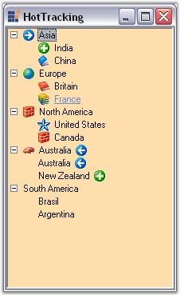

::: {style="DISPLAY: none"}
{#d2h_url_template}{#d2h_package_url style="WIDTH: 0px; DISPLAY: none; HEIGHT: 0px"}
:::

::: {.d2h_secondary_topic style="PADDING-BOTTOM: 10pt; MARGIN: 0pt; PADDING-LEFT: 0pt; PADDING-RIGHT: 0pt; PADDING-TOP: 0pt"}
##### Hot Tracking {#hot-tracking style="MARGIN-LEFT: 18pt; tab-stops: 18.0pt"}

[]{style="COLOR: #15428b"} 

Hot Tracking is a feature available for nodes of the TreeViewAdv control. This gives a hot tracked appearance to the nodes when the mouse cursor is hovering over a corresponding node.

 

Enabling the **HotTracking** property to true and when the mouse hovers over any node,

[]{style="COLOR: #15428b"} 

[·      ]{style="FONT-FAMILY: Symbol"}The forecolor will change to blue and the text will be underlined with blue color, giving the node label a hyperlink appearance.

[·      ]{style="FONT-FAMILY: Symbol"}In the below image the node \"France\" is given a link approach by setting the HotTracking property to true and by moving the mouse over the node.

[]{style="COLOR: #15428b"} 

{border="0"}

[]{style="COLOR: #15428b"} 

Figure 1142: TreeViewAdv Indicating Hot Tracking

 

 

 

 

[]{#related-topics}
:::
