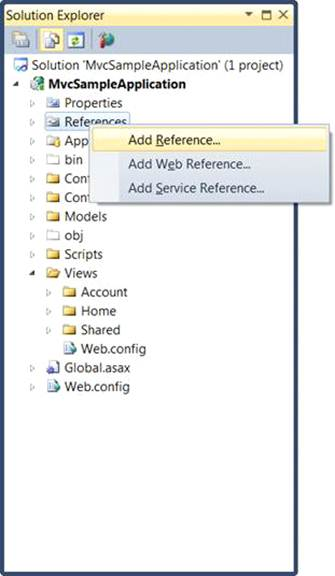
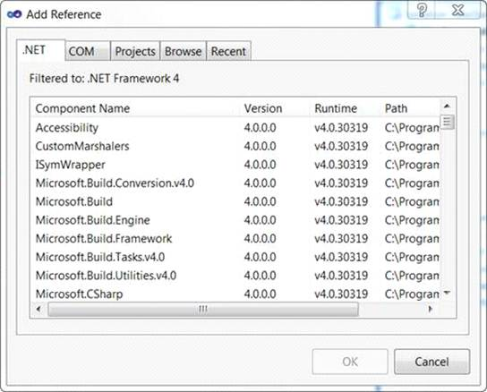
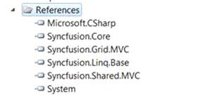
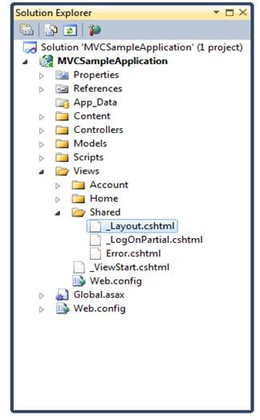
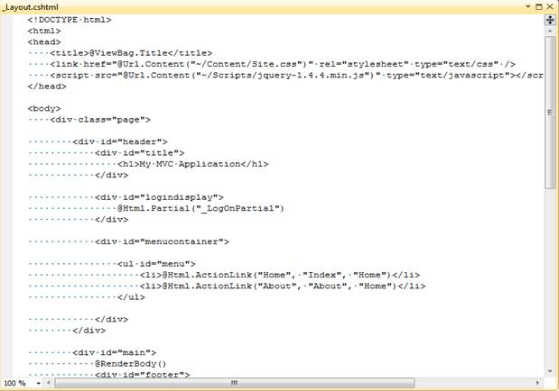
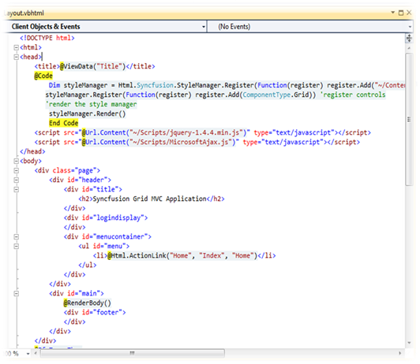
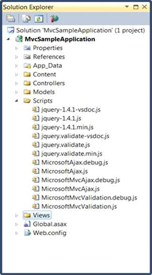
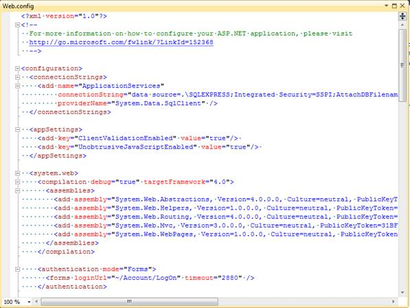

::: {style="DISPLAY: none"}
{#d2h_url_template}{#d2h_package_url style="WIDTH: 0px; DISPLAY: none; HEIGHT: 0px"}
:::

::::: {#nsbanner .d2h_main_nsbanner style="BORDER-BOTTOM: #999999 1px solid; POSITION: relative; PADDING-BOTTOM: 0px; BACKGROUND-COLOR: transparent; PADDING-LEFT: 0px; PADDING-RIGHT: 0px; DISPLAY: none; BORDER-TOP: #999999 1px solid; PADDING-TOP: 0px; LEFT: 0px"}
:::: {#TitleRow .d2h_main_titlerow style="PADDING-BOTTOM: 4px; BACKGROUND-COLOR: transparent; PADDING-LEFT: 22px; WIDTH: 100%; PADDING-RIGHT: 10px; DISPLAY: none; PADDING-TOP: 4px"}
::: {#ienav .d2h_main_ienav style="DISPLAY: none"}
{#D2HPrevious .D2HPreviousEnabled}  {#D2HNext .D2HNextEnabled}
:::
::::
:::::

:::::: {#nstext .d2h_main_nstext style="PADDING-BOTTOM: 10px; BACKGROUND-COLOR: transparent; PADDING-LEFT: 22px; PADDING-RIGHT: 10px; HEIGHT: 100%; OVERFLOW: auto; PADDING-TOP: 5px" hasuserbackground="true" valign="bottom"}
::: {#d2h_breadcrumbs .d2h_breadcrumbs}
[Essential Studio User Guide Documentation](ms-xhelp:///?Id=12457748-09e3-4d74-a240-8e049cedf030){.d2h_breadcrumbsNormal}[ \> ]{.d2h_breadcrumbsLinkSeparator}[User Interface Edition](ms-xhelp:///?Id=c29296b7-531c-413b-a0ec-488ca1f7f669){.d2h_breadcrumbsNormal}[ \> ]{.d2h_breadcrumbsLinkSeparator}[Essential ASP.NET MVC](ms-xhelp:///?Id=4b14e7d1-65c4-4f67-b1aa-2c37709905a5){.d2h_breadcrumbsNormal}[ \> ]{.d2h_breadcrumbsLinkSeparator}[Essential Tools]{.d2h_breadcrumbsContentsOnly}[ \> ]{.d2h_breadcrumbsLinkSeparator}[How to ...](ms-xhelp:///?Id=f61296b6-d22f-4dec-82be-f560f0302129){.d2h_breadcrumbsNormal}
:::

## How do I add Essential Grid to the simple Razor application? {#how-do-i-add-essential-grid-to-the-simple-razor-application style="tab-stops: 0pt"}

1.   **Adding reference assemblies**

a.   On the Solution Explorer, right-click **References** folder, and then click **Add Reference**.

[]{style="FONT-FAMILY: 'MS Sans Serif','serif'"} 

{border="0"}[]{style="FONT-FAMILY: 'MS Sans Serif','serif'"}

 

The **Add Reference** dialog box appears and the .NET tab is highlighted by default. The assemblies for the MVC application are listed here.

[]{style="FONT-FAMILY: 'MS Sans Serif','serif'"} 

{border="0"}[]{style="FONT-FAMILY: 'MS Sans Serif','serif'"}

[]{style="FONT-FAMILY: 'MS Sans Serif','serif'"} 

b.   Select the following assemblies: Syncfusion.Core, Syncfusion.Grid.Mvc, Syncfusion.Linq.Base and Syncfusion.Shared.Mvc.

c.   Click **Ok**.

The selected assemblies are added under **References**.

{border="0"}[]{style="FONT-FAMILY: 'Times New Roman','serif'; FONT-SIZE: 12pt"}

**[]{style="FONT-FAMILY: 'Times New Roman','serif'; FONT-SIZE: 14pt"}** 

**[]{style="FONT-FAMILY: 'Times New Roman','serif'; FONT-SIZE: 14pt"}** 

2.   **Adding Scripts**

a.   On the Solution Explorer, double-click **Views** folder, double-click **Shared** folder, and then double-click **\_Layout.cshtml** file.

[]{style="FONT-FAMILY: 'MS Sans Serif','serif'"} 

{border="0"}[]{style="FONT-FAMILY: 'MS Sans Serif','serif'"}

 

The \_Layout.cshtml page or the \_Layout.vbhtml page appears

[]{style="FONT-FAMILY: 'Times New Roman','serif'; FONT-SIZE: 12pt"} 

{border="0"}

Figure 351: The \_Layout.cshtml page

{border="0"}

Figure 352: The \_Layout.vbhtml page

 

[]{style="FONT-FAMILY: 'MS Sans Serif','serif'"} 

b.   On the solution explorer click **Scripts** folder. The lists of scripts available are displayed.

{border="0"}

 

[]{style="FONT-FAMILY: 'MS Sans Serif','serif'"} 

c.   Import the following javascript files onto the \_Layout.cshtml page or the \_Layout.vbhtml page.

[·      ]{style="FONT-FAMILY: Symbol"}Jquery-1.4.4.min.js

[·      ]{style="FONT-FAMILY: Symbol"}MicrosoftAjax.js

[]{style="FONT-FAMILY: 'Times New Roman','serif'; FONT-SIZE: 12pt"} 

+---------------------------------------------------------------------------------------------------------------------------------------------------------------------------------------------------------------------------------------------------------------------------------------------------------------------------------------------------------------------------------------------------------------------------------------------------------+
| **[\[\_Layout.cshtml\] ]{style="FONT-FAMILY: 'Courier New'"}**[]{style="FONT-FAMILY: 'Courier New'"}                                                                                                                                                                                                                                                                                                                                                    |
|                                                                                                                                                                                                                                                                                                                                                                                                                                                         |
| [\<]{style="FONT-FAMILY: 'Courier New'; COLOR: blue"}[head]{style="FONT-FAMILY: 'Courier New'; COLOR: maroon"}[ [runat]{style="COLOR: red"}[=\"server\"\>]{style="COLOR: blue"} ]{style="FONT-FAMILY: 'Courier New'"}                                                                                                                                                                                                                                   |
|                                                                                                                                                                                                                                                                                                                                                                                                                                                         |
| [\<]{style="FONT-FAMILY: 'Courier New'; COLOR: blue"}[script]{style="FONT-FAMILY: 'Courier New'; COLOR: maroon"}[ [src]{style="COLOR: red"}[=\"]{style="COLOR: blue"}[@]{style="BACKGROUND: yellow"}Url.Content(\"\~/Scripts/jquery-1.4.4.min.js\")[\"]{style="COLOR: blue"} [type]{style="COLOR: red"}[=\"text/javascript\"\>\</]{style="COLOR: blue"}[script]{style="COLOR: maroon"}[\>]{style="COLOR: blue"}]{style="FONT-FAMILY: 'Courier New'"}    |
|                                                                                                                                                                                                                                                                                                                                                                                                                                                         |
| [\<]{style="FONT-FAMILY: 'Courier New'; COLOR: blue"}[script]{style="FONT-FAMILY: 'Courier New'; COLOR: maroon"}[ [src]{style="COLOR: red"}[=\"]{style="COLOR: blue"}[@]{style="BACKGROUND: yellow"}Url.Content(\"\~/Scripts/MicrosoftAjax.js\") [\"]{style="COLOR: blue"} [type]{style="COLOR: red"}[=\"text/javascript\"\>\</]{style="COLOR: blue"}[script]{style="COLOR: maroon"}[\>]{style="COLOR: blue"}     ]{style="FONT-FAMILY: 'Courier New'"} |
|                                                                                                                                                                                                                                                                                                                                                                                                                                                         |
| [        \</]{style="FONT-FAMILY: 'Courier New'; COLOR: blue"}[head]{style="FONT-FAMILY: 'Courier New'; COLOR: maroon"}[\>]{style="FONT-FAMILY: 'Courier New'; COLOR: blue"}                                                                                                                                                                                                                                                                            |
|                                                                                                                                                                                                                                                                                                                                                                                                                                                         |
| []{style="FONT-FAMILY: 'Courier New'; COLOR: blue"}                                                                                                                                                                                                                                                                                                                                                                                                     |
+---------------------------------------------------------------------------------------------------------------------------------------------------------------------------------------------------------------------------------------------------------------------------------------------------------------------------------------------------------------------------------------------------------------------------------------------------------+

[]{style="FONT-FAMILY: Consolas; COLOR: blue; FONT-SIZE: 9.5pt"} 

+-------------------------------------------------------------------------------------------------------------------------------------------------------------------------------------------------------------------------------------------------------------------------------------------------------------------------------------------------------------------------------------------------------------------------------------------------------------------------------------------------------+
| **[\[\_Layout.vbhtml\] ]{style="FONT-FAMILY: 'Courier New'"}**[]{style="FONT-FAMILY: 'Courier New'"}                                                                                                                                                                                                                                                                                                                                                                                                  |
|                                                                                                                                                                                                                                                                                                                                                                                                                                                                                                       |
| [\<]{style="FONT-FAMILY: 'Courier New'; COLOR: blue"}[head]{style="FONT-FAMILY: 'Courier New'; COLOR: maroon"}[ [runat]{style="COLOR: red"}[=\"server\"\>]{style="COLOR: blue"} ]{style="FONT-FAMILY: 'Courier New'"}                                                                                                                                                                                                                                                                                 |
|                                                                                                                                                                                                                                                                                                                                                                                                                                                                                                       |
| [\<]{style="FONT-FAMILY: 'Courier New'; COLOR: blue"}[script]{style="FONT-FAMILY: 'Courier New'; COLOR: maroon"}[ [src]{style="COLOR: red"}[=\"]{style="COLOR: blue"}[@]{style="BACKGROUND: yellow"}[Url.Content(]{style="COLOR: blue"}[\"\~/Scripts/jquery-1.4.4.min.js\"]{style="COLOR: #a31515"}[)\"]{style="COLOR: blue"} [type]{style="COLOR: red"}[=\"text/javascript\"\>\</]{style="COLOR: blue"}[script]{style="COLOR: maroon"}[\>]{style="COLOR: blue"}]{style="FONT-FAMILY: 'Courier New'"} |
|                                                                                                                                                                                                                                                                                                                                                                                                                                                                                                       |
| [    [\<]{style="COLOR: blue"}[script]{style="COLOR: maroon"} [src]{style="COLOR: red"}[=\"]{style="COLOR: blue"}[@]{style="BACKGROUND: yellow"}[Url.Content(]{style="COLOR: blue"}[\"\~/Scripts/MicrosoftAjax.js\"]{style="COLOR: #a31515"}[)\"]{style="COLOR: blue"} [type]{style="COLOR: red"}[=\"text/javascript\"\>\</]{style="COLOR: blue"}[script]{style="COLOR: maroon"}[\>]{style="COLOR: blue"}]{style="FONT-FAMILY: 'Courier New'"}                                                        |
|                                                                                                                                                                                                                                                                                                                                                                                                                                                                                                       |
| [       \</]{style="FONT-FAMILY: 'Courier New'; COLOR: blue"}[head]{style="FONT-FAMILY: 'Courier New'; COLOR: maroon"}[\>]{style="FONT-FAMILY: 'Courier New'; COLOR: blue"}                                                                                                                                                                                                                                                                                                                           |
|                                                                                                                                                                                                                                                                                                                                                                                                                                                                                                       |
| []{style="FONT-FAMILY: 'Courier New'; COLOR: blue"}                                                                                                                                                                                                                                                                                                                                                                                                                                                   |
+-------------------------------------------------------------------------------------------------------------------------------------------------------------------------------------------------------------------------------------------------------------------------------------------------------------------------------------------------------------------------------------------------------------------------------------------------------------------------------------------------------+

[]{style="FONT-FAMILY: Consolas; COLOR: blue; FONT-SIZE: 9.5pt"} 

[]{style="FONT-FAMILY: Consolas; COLOR: blue; FONT-SIZE: 9.5pt"} 

[]{style="FONT-FAMILY: 'Times New Roman','serif'; FONT-SIZE: 12pt"} 

3.   **Configuring the root web.Config file**

 

a.   On the Solution Explorer, double-click **Web.config** file in the root folder.

{border="0"}[]{style="FONT-FAMILY: 'MS Sans Serif','serif'"}

b.   Add the following assemblies in the Web.config page under the \<compilation\> tag:

[]{style="FONT-FAMILY: 'Times New Roman','serif'; FONT-SIZE: 12pt"} 

[·      ]{style="FONT-FAMILY: Symbol"}Syncfusion.Core,

[·      ]{style="FONT-FAMILY: Symbol"}Syncfusion.Grid.Mvc,

[·      ]{style="FONT-FAMILY: Symbol"}Syncfusion.Linq.Base

[·      ]{style="FONT-FAMILY: Symbol"}Syncfusion.Shared.Mvc.

[]{style="FONT-FAMILY: 'Times New Roman','serif'; FONT-SIZE: 12pt"} 

+------------------------------------------------------------------------------------------------------------------------------------------------------------------------------------------------------------------------------------------------------------------------------------------------------------------------------------------------------------------------------------------------------------------------------------------------------------------------------------------------------------+
| [\[Web.config\]]{style="FONT-FAMILY: 'Courier New'"}                                                                                                                                                                                                                                                                                                                                                                                                                                                       |
|                                                                                                                                                                                                                                                                                                                                                                                                                                                                                                            |
| [\<]{style="FONT-FAMILY: 'Courier New'; COLOR: blue"}[system.web]{style="FONT-FAMILY: 'Courier New'; COLOR: #a31515"}[\>]{style="FONT-FAMILY: 'Courier New'; COLOR: blue"}[]{style="FONT-FAMILY: 'Courier New'"}                                                                                                                                                                                                                                                                                           |
|                                                                                                                                                                                                                                                                                                                                                                                                                                                                                                            |
| [    \<]{style="FONT-FAMILY: 'Courier New'; COLOR: blue"}[compilation]{style="FONT-FAMILY: 'Courier New'; COLOR: #a31515"}[ ]{style="FONT-FAMILY: 'Courier New'; COLOR: blue"}[debug]{style="FONT-FAMILY: 'Courier New'; COLOR: red"}[=]{style="FONT-FAMILY: 'Courier New'; COLOR: blue"}[\"[true]{style="COLOR: blue"}\"[ ]{style="COLOR: blue"}[targetFramework]{style="COLOR: red"}[=]{style="COLOR: blue"}\"[4.0]{style="COLOR: blue"}\"[\>]{style="COLOR: blue"}]{style="FONT-FAMILY: 'Courier New'"} |
|                                                                                                                                                                                                                                                                                                                                                                                                                                                                                                            |
| [      \<]{style="FONT-FAMILY: 'Courier New'; COLOR: blue"}[assemblies]{style="FONT-FAMILY: 'Courier New'; COLOR: #a31515"}[\>]{style="FONT-FAMILY: 'Courier New'; COLOR: blue"}[]{style="FONT-FAMILY: 'Courier New'"}                                                                                                                                                                                                                                                                                     |
|                                                                                                                                                                                                                                                                                                                                                                                                                                                                                                            |
| [        \<]{style="FONT-FAMILY: 'Courier New'; COLOR: blue"}[add]{style="FONT-FAMILY: 'Courier New'; COLOR: #a31515"}[ ]{style="FONT-FAMILY: 'Courier New'; COLOR: blue"}[assembly]{style="FONT-FAMILY: 'Courier New'; COLOR: red"}[=]{style="FONT-FAMILY: 'Courier New'; COLOR: blue"}[\"[Syncfusion.Core, Version=9.104.0.20, Culture=neutral, PublicKeyToken=632609b4d040f6b4]{style="COLOR: blue"}\"[/\>]{style="COLOR: blue"}]{style="FONT-FAMILY: 'Courier New'"}                                   |
|                                                                                                                                                                                                                                                                                                                                                                                                                                                                                                            |
| [        \<]{style="FONT-FAMILY: 'Courier New'; COLOR: blue"}[add]{style="FONT-FAMILY: 'Courier New'; COLOR: #a31515"}[ ]{style="FONT-FAMILY: 'Courier New'; COLOR: blue"}[assembly]{style="FONT-FAMILY: 'Courier New'; COLOR: red"}[=]{style="FONT-FAMILY: 'Courier New'; COLOR: blue"}[\"[Syncfusion.Linq.Base, Version=9.104.0.20, Culture=neutral, PublicKeyToken=3d67ed1f87d44c89]{style="COLOR: blue"}\"[/\>]{style="COLOR: blue"}]{style="FONT-FAMILY: 'Courier New'"}                              |
|                                                                                                                                                                                                                                                                                                                                                                                                                                                                                                            |
| [        \<]{style="FONT-FAMILY: 'Courier New'; COLOR: blue"}[add]{style="FONT-FAMILY: 'Courier New'; COLOR: #a31515"}[ ]{style="FONT-FAMILY: 'Courier New'; COLOR: blue"}[assembly]{style="FONT-FAMILY: 'Courier New'; COLOR: red"}[=]{style="FONT-FAMILY: 'Courier New'; COLOR: blue"}[\"[Syncfusion.Shared.Mvc, Version=9.104.0.20, Culture=neutral, PublicKeyToken=3d67ed1f87d44c89]{style="COLOR: blue"}\"[/\>]{style="COLOR: blue"}]{style="FONT-FAMILY: 'Courier New'"}                             |
|                                                                                                                                                                                                                                                                                                                                                                                                                                                                                                            |
| [        \<]{style="FONT-FAMILY: 'Courier New'; COLOR: blue"}[add]{style="FONT-FAMILY: 'Courier New'; COLOR: #a31515"}[ ]{style="FONT-FAMILY: 'Courier New'; COLOR: blue"}[assembly]{style="FONT-FAMILY: 'Courier New'; COLOR: red"}[=]{style="FONT-FAMILY: 'Courier New'; COLOR: blue"}[\"[Syncfusion.Grid.Mvc, Version=9.104.0.20, Culture=neutral, PublicKeyToken=3d67ed1f87d44c89]{style="COLOR: blue"}\"[/\>]{style="COLOR: blue"}]{style="FONT-FAMILY: 'Courier New'"}                               |
|                                                                                                                                                                                                                                                                                                                                                                                                                                                                                                            |
| []{style="FONT-FAMILY: 'Courier New'"}                                                                                                                                                                                                                                                                                                                                                                                                                                                                     |
|                                                                                                                                                                                                                                                                                                                                                                                                                                                                                                            |
| [      \</]{style="FONT-FAMILY: 'Courier New'; COLOR: blue"}[assemblies]{style="FONT-FAMILY: 'Courier New'; COLOR: #a31515"}[\>]{style="FONT-FAMILY: 'Courier New'; COLOR: blue"}[]{style="FONT-FAMILY: 'Courier New'"}                                                                                                                                                                                                                                                                                    |
|                                                                                                                                                                                                                                                                                                                                                                                                                                                                                                            |
| [    \</]{style="FONT-FAMILY: 'Courier New'; COLOR: blue"}[compilation]{style="FONT-FAMILY: 'Courier New'; COLOR: #a31515"}[\>]{style="FONT-FAMILY: 'Courier New'; COLOR: blue"}[]{style="FONT-FAMILY: 'Courier New'"}                                                                                                                                                                                                                                                                                     |
+------------------------------------------------------------------------------------------------------------------------------------------------------------------------------------------------------------------------------------------------------------------------------------------------------------------------------------------------------------------------------------------------------------------------------------------------------------------------------------------------------------+

[]{style="FONT-FAMILY: 'Times New Roman','serif'; FONT-SIZE: 12pt"} 

[]{style="FONT-FAMILY: 'Times New Roman','serif'; FONT-SIZE: 12pt"} 

[]{style="FONT-FAMILY: 'Times New Roman','serif'; FONT-SIZE: 12pt"} 

+------------------------------------------------------------------------------------------------------------------------------------------------------------------------------------------------------------------------------------------------------------------------------------------------------------------------------------------------------------------------------------------------------------------------------------------------------------------------------------------------------------+
| [\[Web.config\]]{style="FONT-FAMILY: 'Courier New'"}                                                                                                                                                                                                                                                                                                                                                                                                                                                       |
|                                                                                                                                                                                                                                                                                                                                                                                                                                                                                                            |
| [\<]{style="FONT-FAMILY: 'Courier New'; COLOR: blue"}[system.web]{style="FONT-FAMILY: 'Courier New'; COLOR: #a31515"}[\>]{style="FONT-FAMILY: 'Courier New'; COLOR: blue"}[]{style="FONT-FAMILY: 'Courier New'"}                                                                                                                                                                                                                                                                                           |
|                                                                                                                                                                                                                                                                                                                                                                                                                                                                                                            |
| [    \<]{style="FONT-FAMILY: 'Courier New'; COLOR: blue"}[compilation]{style="FONT-FAMILY: 'Courier New'; COLOR: #a31515"}[ ]{style="FONT-FAMILY: 'Courier New'; COLOR: blue"}[debug]{style="FONT-FAMILY: 'Courier New'; COLOR: red"}[=]{style="FONT-FAMILY: 'Courier New'; COLOR: blue"}[\"[true]{style="COLOR: blue"}\"[ ]{style="COLOR: blue"}[targetFramework]{style="COLOR: red"}[=]{style="COLOR: blue"}\"[4.0]{style="COLOR: blue"}\"[\>]{style="COLOR: blue"}]{style="FONT-FAMILY: 'Courier New'"} |
|                                                                                                                                                                                                                                                                                                                                                                                                                                                                                                            |
| [      \<]{style="FONT-FAMILY: 'Courier New'; COLOR: blue"}[assemblies]{style="FONT-FAMILY: 'Courier New'; COLOR: #a31515"}[\>]{style="FONT-FAMILY: 'Courier New'; COLOR: blue"}[]{style="FONT-FAMILY: 'Courier New'"}                                                                                                                                                                                                                                                                                     |
|                                                                                                                                                                                                                                                                                                                                                                                                                                                                                                            |
| [        \<]{style="FONT-FAMILY: 'Courier New'; COLOR: blue"}[add]{style="FONT-FAMILY: 'Courier New'; COLOR: #a31515"}[ ]{style="FONT-FAMILY: 'Courier New'; COLOR: blue"}[assembly]{style="FONT-FAMILY: 'Courier New'; COLOR: red"}[=]{style="FONT-FAMILY: 'Courier New'; COLOR: blue"}[\"[Syncfusion.Core, Version=9.104.0.20, Culture=neutral, PublicKeyToken=632609b4d040f6b4]{style="COLOR: blue"}\"[/\>]{style="COLOR: blue"}]{style="FONT-FAMILY: 'Courier New'"}                                   |
|                                                                                                                                                                                                                                                                                                                                                                                                                                                                                                            |
| [        \<]{style="FONT-FAMILY: 'Courier New'; COLOR: blue"}[add]{style="FONT-FAMILY: 'Courier New'; COLOR: #a31515"}[ ]{style="FONT-FAMILY: 'Courier New'; COLOR: blue"}[assembly]{style="FONT-FAMILY: 'Courier New'; COLOR: red"}[=]{style="FONT-FAMILY: 'Courier New'; COLOR: blue"}[\"[Syncfusion.Linq.Base, Version=9.104.0.20, Culture=neutral, PublicKeyToken=3d67ed1f87d44c89]{style="COLOR: blue"}\"[/\>]{style="COLOR: blue"}]{style="FONT-FAMILY: 'Courier New'"}                              |
|                                                                                                                                                                                                                                                                                                                                                                                                                                                                                                            |
| [        \<]{style="FONT-FAMILY: 'Courier New'; COLOR: blue"}[add]{style="FONT-FAMILY: 'Courier New'; COLOR: #a31515"}[ ]{style="FONT-FAMILY: 'Courier New'; COLOR: blue"}[assembly]{style="FONT-FAMILY: 'Courier New'; COLOR: red"}[=]{style="FONT-FAMILY: 'Courier New'; COLOR: blue"}[\"[Syncfusion.Shared.Mvc, Version=9.104.0.20, Culture=neutral, PublicKeyToken=3d67ed1f87d44c89]{style="COLOR: blue"}\"[/\>]{style="COLOR: blue"}]{style="FONT-FAMILY: 'Courier New'"}                             |
|                                                                                                                                                                                                                                                                                                                                                                                                                                                                                                            |
| [        \<]{style="FONT-FAMILY: 'Courier New'; COLOR: blue"}[add]{style="FONT-FAMILY: 'Courier New'; COLOR: #a31515"}[ ]{style="FONT-FAMILY: 'Courier New'; COLOR: blue"}[assembly]{style="FONT-FAMILY: 'Courier New'; COLOR: red"}[=]{style="FONT-FAMILY: 'Courier New'; COLOR: blue"}[\"[Syncfusion.Grid.Mvc, Version=9.104.0.20, Culture=neutral, PublicKeyToken=3d67ed1f87d44c89]{style="COLOR: blue"}\"[/\>]{style="COLOR: blue"}]{style="FONT-FAMILY: 'Courier New'"}                               |
|                                                                                                                                                                                                                                                                                                                                                                                                                                                                                                            |
| []{style="FONT-FAMILY: 'Courier New'"}                                                                                                                                                                                                                                                                                                                                                                                                                                                                     |
|                                                                                                                                                                                                                                                                                                                                                                                                                                                                                                            |
| [      \</]{style="FONT-FAMILY: 'Courier New'; COLOR: blue"}[assemblies]{style="FONT-FAMILY: 'Courier New'; COLOR: #a31515"}[\>]{style="FONT-FAMILY: 'Courier New'; COLOR: blue"}[]{style="FONT-FAMILY: 'Courier New'"}                                                                                                                                                                                                                                                                                    |
|                                                                                                                                                                                                                                                                                                                                                                                                                                                                                                            |
| [    \</]{style="FONT-FAMILY: 'Courier New'; COLOR: blue"}[compilation]{style="FONT-FAMILY: 'Courier New'; COLOR: #a31515"}[\>]{style="FONT-FAMILY: 'Courier New'; COLOR: blue"}[]{style="FONT-FAMILY: 'Courier New'"}                                                                                                                                                                                                                                                                                     |
+------------------------------------------------------------------------------------------------------------------------------------------------------------------------------------------------------------------------------------------------------------------------------------------------------------------------------------------------------------------------------------------------------------------------------------------------------------------------------------------------------------+

[]{style="FONT-FAMILY: 'Times New Roman','serif'; FONT-SIZE: 12pt"} 

::: {style="BORDER-BOTTOM: windowtext 1pt solid; BORDER-LEFT: medium none; PADDING-BOTTOM: 1pt; MARGIN-TOP: 9pt; PADDING-LEFT: 0pt; PADDING-RIGHT: 0pt; MARGIN-BOTTOM: 9pt; BORDER-TOP: windowtext 1pt solid; BORDER-RIGHT: medium none; PADDING-TOP: 1pt"}
Note: X.X.X.X in the above code corresponds to the correct version number of the Essential Studio version that you are currently using.
:::

[]{style="FONT-FAMILY: 'Times New Roman','serif'; FONT-SIZE: 12pt"} 

c.   Register the handlers under \<httphandlers\>, \<handlers\> tags in the web.config file by using the code below.

[]{style="FONT-FAMILY: 'Times New Roman','serif'; FONT-SIZE: 12pt"} 

+------------------------------------------------------------------------------------------------------------------------------------------------------------------------------------------------------------------------------------------------------------------------------------------------------------------------------------------------------------------------------------------------------------------------------------------------------------------------------------------------------------------------------------------------------------------------------------------------------------------------------------------------------------------------------------------------------------------------------------------------------------------------------------------------------------------------------------------------------------------------------------+
| [\[Web.config\]]{style="FONT-FAMILY: 'Courier New'"}                                                                                                                                                                                                                                                                                                                                                                                                                                                                                                                                                                                                                                                                                                                                                                                                                               |
|                                                                                                                                                                                                                                                                                                                                                                                                                                                                                                                                                                                                                                                                                                                                                                                                                                                                                    |
| [\<]{style="FONT-FAMILY: 'Courier New'; COLOR: blue"}[system.web]{style="FONT-FAMILY: 'Courier New'; COLOR: #a31515"}[\>]{style="FONT-FAMILY: 'Courier New'; COLOR: blue"}                                                                                                                                                                                                                                                                                                                                                                                                                                                                                                                                                                                                                                                                                                         |
|                                                                                                                                                                                                                                                                                                                                                                                                                                                                                                                                                                                                                                                                                                                                                                                                                                                                                    |
| [\<]{style="FONT-FAMILY: 'Courier New'; COLOR: blue"}[httpHandlers]{style="FONT-FAMILY: 'Courier New'; COLOR: #a31515"}[\>]{style="FONT-FAMILY: 'Courier New'; COLOR: blue"}[]{style="FONT-FAMILY: 'Courier New'"}                                                                                                                                                                                                                                                                                                                                                                                                                                                                                                                                                                                                                                                                 |
|                                                                                                                                                                                                                                                                                                                                                                                                                                                                                                                                                                                                                                                                                                                                                                                                                                                                                    |
| [      \<]{style="FONT-FAMILY: 'Courier New'; COLOR: blue"}[add]{style="FONT-FAMILY: 'Courier New'; COLOR: #a31515"}[ ]{style="FONT-FAMILY: 'Courier New'; COLOR: blue"}[verb]{style="FONT-FAMILY: 'Courier New'; COLOR: red"}[=]{style="FONT-FAMILY: 'Courier New'; COLOR: blue"}[\"[GET, HEAD]{style="COLOR: blue"}\"[ ]{style="COLOR: blue"}[path]{style="COLOR: red"}[=]{style="COLOR: blue"}\"[MvcResourceHandler.axd]{style="COLOR: blue"}\"[ ]{style="COLOR: blue"}[type]{style="COLOR: red"}[=]{style="COLOR: blue"}\"[Syncfusion.Mvc.Shared.MvcResourceHandler, Syncfusion.Shared.Mvc, Version=9.104.0.20, Culture=neutral, PublicKeyToken=3d67ed1f87d44c89]{style="COLOR: blue"}\"[ ]{style="COLOR: blue"}[validate]{style="COLOR: red"}[=]{style="COLOR: blue"}\"[false]{style="COLOR: blue"}\"[/\>]{style="COLOR: blue"}]{style="FONT-FAMILY: 'Courier New'"}          |
|                                                                                                                                                                                                                                                                                                                                                                                                                                                                                                                                                                                                                                                                                                                                                                                                                                                                                    |
| [ \</]{style="FONT-FAMILY: 'Courier New'; COLOR: blue"}[httpHandlers]{style="FONT-FAMILY: 'Courier New'; COLOR: #a31515"}[\>]{style="FONT-FAMILY: 'Courier New'; COLOR: blue"}                                                                                                                                                                                                                                                                                                                                                                                                                                                                                                                                                                                                                                                                                                     |
|                                                                                                                                                                                                                                                                                                                                                                                                                                                                                                                                                                                                                                                                                                                                                                                                                                                                                    |
| [\</]{style="FONT-FAMILY: 'Courier New'; COLOR: blue"}[system.web]{style="FONT-FAMILY: 'Courier New'; COLOR: #a31515"}[\>]{style="FONT-FAMILY: 'Courier New'; COLOR: blue"}                                                                                                                                                                                                                                                                                                                                                                                                                                                                                                                                                                                                                                                                                                        |
|                                                                                                                                                                                                                                                                                                                                                                                                                                                                                                                                                                                                                                                                                                                                                                                                                                                                                    |
| []{style="FONT-FAMILY: 'Courier New'; COLOR: blue"}                                                                                                                                                                                                                                                                                                                                                                                                                                                                                                                                                                                                                                                                                                                                                                                                                                |
|                                                                                                                                                                                                                                                                                                                                                                                                                                                                                                                                                                                                                                                                                                                                                                                                                                                                                    |
| [\<]{style="FONT-FAMILY: 'Courier New'; COLOR: blue"}[system.webServer]{style="FONT-FAMILY: 'Courier New'; COLOR: #a31515"}[\>]{style="FONT-FAMILY: 'Courier New'; COLOR: blue"}[]{style="FONT-FAMILY: 'Courier New'"}                                                                                                                                                                                                                                                                                                                                                                                                                                                                                                                                                                                                                                                             |
|                                                                                                                                                                                                                                                                                                                                                                                                                                                                                                                                                                                                                                                                                                                                                                                                                                                                                    |
| [    \<]{style="FONT-FAMILY: 'Courier New'; COLOR: blue"}[handlers]{style="FONT-FAMILY: 'Courier New'; COLOR: #a31515"}[\>]{style="FONT-FAMILY: 'Courier New'; COLOR: blue"}[]{style="FONT-FAMILY: 'Courier New'"}                                                                                                                                                                                                                                                                                                                                                                                                                                                                                                                                                                                                                                                                 |
|                                                                                                                                                                                                                                                                                                                                                                                                                                                                                                                                                                                                                                                                                                                                                                                                                                                                                    |
| [      \<]{style="FONT-FAMILY: 'Courier New'; COLOR: blue"}[remove]{style="FONT-FAMILY: 'Courier New'; COLOR: #a31515"}[ ]{style="FONT-FAMILY: 'Courier New'; COLOR: blue"}[name]{style="FONT-FAMILY: 'Courier New'; COLOR: red"}[=]{style="FONT-FAMILY: 'Courier New'; COLOR: blue"}[\"[MvcResourceHandler]{style="COLOR: blue"}\"[/\>]{style="COLOR: blue"}]{style="FONT-FAMILY: 'Courier New'"}                                                                                                                                                                                                                                                                                                                                                                                                                                                                                 |
|                                                                                                                                                                                                                                                                                                                                                                                                                                                                                                                                                                                                                                                                                                                                                                                                                                                                                    |
| [      \<]{style="FONT-FAMILY: 'Courier New'; COLOR: blue"}[add]{style="FONT-FAMILY: 'Courier New'; COLOR: #a31515"}[ ]{style="FONT-FAMILY: 'Courier New'; COLOR: blue"}[verb]{style="FONT-FAMILY: 'Courier New'; COLOR: red"}[=]{style="FONT-FAMILY: 'Courier New'; COLOR: blue"}[\"[GET, HEAD]{style="COLOR: blue"}\"[ ]{style="COLOR: blue"}[name]{style="COLOR: red"}[=]{style="COLOR: blue"}\"[MvcResourceHandler]{style="COLOR: blue"}\"[ ]{style="COLOR: blue"}[path]{style="COLOR: red"}[=]{style="COLOR: blue"}\"[MvcResourceHandler.axd]{style="COLOR: blue"}\"[ ]{style="COLOR: blue"}[type]{style="COLOR: red"}[=]{style="COLOR: blue"}\"[Syncfusion.Mvc.Shared.MvcResourceHandler, Syncfusion.Shared.Mvc, Version=9.104.0.20, Culture=neutral, PublicKeyToken=3d67ed1f87d44c89]{style="COLOR: blue"}\"[/\>]{style="COLOR: blue"}]{style="FONT-FAMILY: 'Courier New'"} |
|                                                                                                                                                                                                                                                                                                                                                                                                                                                                                                                                                                                                                                                                                                                                                                                                                                                                                    |
| [    \</]{style="FONT-FAMILY: 'Courier New'; COLOR: blue"}[handlers]{style="FONT-FAMILY: 'Courier New'; COLOR: #a31515"}[\>]{style="FONT-FAMILY: 'Courier New'; COLOR: blue"}[]{style="FONT-FAMILY: 'Courier New'"}                                                                                                                                                                                                                                                                                                                                                                                                                                                                                                                                                                                                                                                                |
|                                                                                                                                                                                                                                                                                                                                                                                                                                                                                                                                                                                                                                                                                                                                                                                                                                                                                    |
| [  \</]{style="FONT-FAMILY: 'Courier New'; COLOR: blue"}[system.webServer]{style="FONT-FAMILY: 'Courier New'; COLOR: #a31515"}[\>]{style="FONT-FAMILY: 'Courier New'; COLOR: blue"}                                                                                                                                                                                                                                                                                                                                                                                                                                                                                                                                                                                                                                                                                                |
|                                                                                                                                                                                                                                                                                                                                                                                                                                                                                                                                                                                                                                                                                                                                                                                                                                                                                    |
| []{style="FONT-FAMILY: 'Courier New'"}                                                                                                                                                                                                                                                                                                                                                                                                                                                                                                                                                                                                                                                                                                                                                                                                                                             |
+------------------------------------------------------------------------------------------------------------------------------------------------------------------------------------------------------------------------------------------------------------------------------------------------------------------------------------------------------------------------------------------------------------------------------------------------------------------------------------------------------------------------------------------------------------------------------------------------------------------------------------------------------------------------------------------------------------------------------------------------------------------------------------------------------------------------------------------------------------------------------------+

[]{style="FONT-FAMILY: 'Times New Roman','serif'; FONT-SIZE: 12pt"} 

4.   **Configuring the Views web.config(Views\\Web.config)**

::: {style="BORDER-BOTTOM: windowtext 1pt solid; BORDER-LEFT: medium none; PADDING-BOTTOM: 1pt; MARGIN-TOP: 9pt; PADDING-LEFT: 0pt; PADDING-RIGHT: 0pt; MARGIN-BOTTOM: 9pt; BORDER-TOP: windowtext 1pt solid; BORDER-RIGHT: medium none; PADDING-TOP: 1pt"}
Note: There are two web.config files. Refer to the one in the views folder.
:::

[]{style="FONT-FAMILY: 'Cambria','serif'; FONT-SIZE: 12pt"} 

a.   Add the following namespaces under the \<namespaces\> tag.

[]{style="FONT-FAMILY: 'Times New Roman','serif'; FONT-SIZE: 12pt"} 

[·      ]{style="FONT-FAMILY: Symbol"}Syncfusion.Mvc.Shared

[·      ]{style="FONT-FAMILY: Symbol"}Syncfusion.Mvc.Grid

[]{style="FONT-FAMILY: 'Times New Roman','serif'; FONT-SIZE: 12pt"} 

+------------------------------------------------------------------------------------------------------------------------------------------------------------------------------------------------------------------------------------------------------------------------------------------------------------------------------------------------------------------------------------------------------------+
| [\[Web.config\]             ]{style="FONT-FAMILY: 'Courier New'"}                                                                                                                                                                                                                                                                                                                                          |
|                                                                                                                                                                                                                                                                                                                                                                                                            |
| [\<]{style="FONT-FAMILY: 'Courier New'; COLOR: blue"}[system.web.webPages.razor]{style="FONT-FAMILY: 'Courier New'; COLOR: #a31515"}[\>]{style="FONT-FAMILY: 'Courier New'; COLOR: blue"}[]{style="FONT-FAMILY: 'Courier New'"}                                                                                                                                                                            |
|                                                                                                                                                                                                                                                                                                                                                                                                            |
| [\<]{style="FONT-FAMILY: 'Courier New'; COLOR: blue"}[pages]{style="FONT-FAMILY: 'Courier New'; COLOR: #a31515"}[ ]{style="FONT-FAMILY: 'Courier New'; COLOR: blue"}[pageBaseType]{style="FONT-FAMILY: 'Courier New'; COLOR: red"}[=]{style="FONT-FAMILY: 'Courier New'; COLOR: blue"}[\"[System.Web.Mvc.WebViewPage]{style="COLOR: blue"}\"[\>]{style="COLOR: blue"}]{style="FONT-FAMILY: 'Courier New'"} |
|                                                                                                                                                                                                                                                                                                                                                                                                            |
| [\<]{style="FONT-FAMILY: 'Courier New'; COLOR: blue"}[namespaces]{style="FONT-FAMILY: 'Courier New'; COLOR: #a31515"}[\>]{style="FONT-FAMILY: 'Courier New'; COLOR: blue"}                                                                                                                                                                                                                                 |
|                                                                                                                                                                                                                                                                                                                                                                                                            |
| [\<a]{style="FONT-FAMILY: 'Courier New'; COLOR: blue"}[dd]{style="FONT-FAMILY: 'Courier New'; COLOR: #a31515"}[ ]{style="FONT-FAMILY: 'Courier New'; COLOR: blue"}[namespace]{style="FONT-FAMILY: 'Courier New'; COLOR: red"}[=]{style="FONT-FAMILY: 'Courier New'; COLOR: blue"}[\"[Syncfusion.Mvc.Shared]{style="COLOR: blue"}\"[/\>]{style="COLOR: blue"}]{style="FONT-FAMILY: 'Courier New'"}          |
|                                                                                                                                                                                                                                                                                                                                                                                                            |
| [\<]{style="FONT-FAMILY: 'Courier New'; COLOR: blue"}[add]{style="FONT-FAMILY: 'Courier New'; COLOR: #a31515"}[ ]{style="FONT-FAMILY: 'Courier New'; COLOR: blue"}[namespace]{style="FONT-FAMILY: 'Courier New'; COLOR: red"}[=]{style="FONT-FAMILY: 'Courier New'; COLOR: blue"}[\"[Syncfusion.Mvc.Grid]{style="COLOR: blue"}\"[/\>]{style="COLOR: blue"}]{style="FONT-FAMILY: 'Courier New'"}            |
|                                                                                                                                                                                                                                                                                                                                                                                                            |
| [\</]{style="FONT-FAMILY: 'Courier New'; COLOR: blue"}[namespaces]{style="FONT-FAMILY: 'Courier New'; COLOR: #a31515"}[\>]{style="FONT-FAMILY: 'Courier New'; COLOR: blue"}[]{style="FONT-FAMILY: 'Courier New'"}                                                                                                                                                                                          |
|                                                                                                                                                                                                                                                                                                                                                                                                            |
| [\</]{style="FONT-FAMILY: 'Courier New'; COLOR: blue"}[pages]{style="FONT-FAMILY: 'Courier New'; COLOR: #a31515"}[\>]{style="FONT-FAMILY: 'Courier New'; COLOR: blue"}[]{style="FONT-FAMILY: 'Courier New'"}                                                                                                                                                                                               |
|                                                                                                                                                                                                                                                                                                                                                                                                            |
| [\</]{style="FONT-FAMILY: 'Courier New'; COLOR: blue"}[system.web.webPages.razor]{style="FONT-FAMILY: 'Courier New'; COLOR: #a31515"}[\>]{style="FONT-FAMILY: 'Courier New'; COLOR: blue"}                                                                                                                                                                                                                 |
|                                                                                                                                                                                                                                                                                                                                                                                                            |
| []{style="FONT-FAMILY: 'Courier New'"}                                                                                                                                                                                                                                                                                                                                                                     |
+------------------------------------------------------------------------------------------------------------------------------------------------------------------------------------------------------------------------------------------------------------------------------------------------------------------------------------------------------------------------------------------------------------+

[]{style="FONT-FAMILY: 'Times New Roman','serif'; FONT-SIZE: 12pt"} 

[]{style="FONT-FAMILY: 'Courier New'; FONT-SIZE: 9.5pt"} 

5.   **Adding StyleManager**

 

Add the StyleManager extension method in the HEAD tag of the View pages (in most cases, it is reasonable to call it within the \_Layout.cshtml or the \_Layout.vbhtml page). 

\[cshtml\]

+-------------------------------------------------------------------------------------------------------------------------------------+
| **[\[razor\]]{style="FONT-FAMILY: 'Courier New'"}**[]{style="FONT-FAMILY: 'Courier New'"}                                           |
|                                                                                                                                     |
| [\@{]{style="FONT-FAMILY: 'Courier New'; BACKGROUND: yellow"}[Html.Syncfusion().StyleManager()]{style="FONT-FAMILY: 'Courier New'"} |
|                                                                                                                                     |
| [        .Register(stylesheets =\>]{style="FONT-FAMILY: 'Courier New'"}                                                             |
|                                                                                                                                     |
| [            {]{style="FONT-FAMILY: 'Courier New'"}                                                                                 |
|                                                                                                                                     |
| [                stylesheets.Add([\"\~/Content/Site.css\"]{style="COLOR: #a31515"});]{style="FONT-FAMILY: 'Courier New'"}           |
|                                                                                                                                     |
| [                stylesheets.Add([\"\~/Content/Sample.css\"]{style="COLOR: #a31515"});]{style="FONT-FAMILY: 'Courier New'"}         |
|                                                                                                                                     |
| [            }).Render();[}]{style="BACKGROUND: yellow"}]{style="FONT-FAMILY: 'Courier New'"}                                       |
|                                                                                                                                     |
| []{style="FONT-FAMILY: 'Courier New'"}                                                                                              |
+-------------------------------------------------------------------------------------------------------------------------------------+

 

\[vbhtml\]

+---------------------------------------------------------------------------------------------------------------------------------------------------------------------------------------------------------------------------------------------------------------------------------------------------------------------------------------------------+
| **[\[razor\]]{style="FONT-FAMILY: 'Courier New'"}**[]{style="FONT-FAMILY: 'Courier New'"}                                                                                                                                                                                                                                                         |
|                                                                                                                                                                                                                                                                                                                                                   |
| [   [\@Code]{style="BACKGROUND: yellow"}]{style="FONT-FAMILY: 'Courier New'"}                                                                                                                                                                                                                                                                     |
|                                                                                                                                                                                                                                                                                                                                                   |
| [        [Dim]{style="COLOR: blue"} styleManager = Html.[Syncfusion]{style="COLOR: #2b91af"}.StyleManager.Register([Function]{style="COLOR: blue"}(register) register.Add([\"\~/Content/Site.css\"]{style="COLOR: #a31515"})) [\'register css files                                  ]{style="COLOR: green"}]{style="FONT-FAMILY: 'Courier New'"} |
|                                                                                                                                                                                                                                                                                                                                                   |
| [       styleManager.Register([Function]{style="COLOR: blue"}(register) register.Add([ComponentType]{style="COLOR: #2b91af"}.Grid)) [\'register controls       ]{style="COLOR: green"}]{style="FONT-FAMILY: 'Courier New'"}                                                                                                                       |
|                                                                                                                                                                                                                                                                                                                                                   |
| [       [\'render the style manager]{style="COLOR: green"}]{style="FONT-FAMILY: 'Courier New'"}                                                                                                                                                                                                                                                   |
|                                                                                                                                                                                                                                                                                                                                                   |
| [        styleManager.Render()]{style="FONT-FAMILY: 'Courier New'"}                                                                                                                                                                                                                                                                               |
|                                                                                                                                                                                                                                                                                                                                                   |
| [        [End Code]{style="BACKGROUND: yellow"}]{style="FONT-FAMILY: 'Courier New'"}                                                                                                                                                                                                                                                              |
|                                                                                                                                                                                                                                                                                                                                                   |
| []{style="FONT-FAMILY: 'Courier New'"}                                                                                                                                                                                                                                                                                                            |
+---------------------------------------------------------------------------------------------------------------------------------------------------------------------------------------------------------------------------------------------------------------------------------------------------------------------------------------------------+

 

 

6.   **Adding ScriptManager**

 

a.   The ScriptManager () method should be placed after all the components on the page. Generally, you can use this method at the end of the Layout.cshtml page or the \_Layout.vbhtml page.

 

+------------------------------------------------------------------------------------------------------------------------------------------------------------------------------------------------------------+
| **[\[razor\]]{style="FONT-FAMILY: 'Courier New'"}**[]{style="FONT-FAMILY: 'Courier New'"}                                                                                                                  |
|                                                                                                                                                                                                            |
| [\<]{style="FONT-FAMILY: 'Courier New'; COLOR: blue"}[body]{style="FONT-FAMILY: 'Courier New'; COLOR: maroon"}[\>]{style="FONT-FAMILY: 'Courier New'; COLOR: blue"}                                        |
|                                                                                                                                                                                                            |
| [....]{style="FONT-FAMILY: 'Courier New'; COLOR: blue"}                                                                                                                                                    |
|                                                                                                                                                                                                            |
| []{style="FONT-FAMILY: 'Courier New'; COLOR: blue"}                                                                                                                                                        |
|                                                                                                                                                                                                            |
| [\@{]{style="FONT-FAMILY: 'Courier New'; BACKGROUND: yellow"}[Html.Syncfusion().ScriptManager().Render();[}]{style="BACKGROUND: yellow"}]{style="FONT-FAMILY: 'Courier New'"}                              |
|                                                                                                                                                                                                            |
| [\</]{style="FONT-FAMILY: 'Courier New'; COLOR: blue"}[body]{style="FONT-FAMILY: 'Courier New'; COLOR: maroon"}[\>]{style="FONT-FAMILY: 'Courier New'; COLOR: blue"}[]{style="FONT-FAMILY: 'Courier New'"} |
|                                                                                                                                                                                                            |
| []{style="FONT-FAMILY: 'Courier New'"}                                                                                                                                                                     |
|                                                                                                                                                                                                            |
| []{style="FONT-FAMILY: 'Courier New'"}                                                                                                                                                                     |
+------------------------------------------------------------------------------------------------------------------------------------------------------------------------------------------------------------+

Note: Add this ScriptManager() at the end of body tag. Don't add this in top of body tag.[]{style="FONT-SIZE: 9pt"}

 

7.   **Creating the Grid control in the view**

 

a.   Create the database into application.**[]{style="FONT-SIZE: 14pt"}**

b.   Create a model into application.

c.   Create a strongly typed view.

d.   Add the following code in the Index.cshtml, or Index.vbhtml file to create the Grid control in the View:

[]{style="FONT-FAMILY: 'Times New Roman','serif'; FONT-SIZE: 12pt"} 

\[cshtml\]

+------------------------------------------------------------------------------------------------------------------------+
| **[\[razor\]]{style="FONT-FAMILY: 'Courier New'"}**                                                                    |
|                                                                                                                        |
| [\@model IEnumerable\<MvcSampleApplication.Models.Order\>]{style="FONT-FAMILY: 'Courier New'"}                         |
|                                                                                                                        |
| [\@{ Html.Syncfusion().Grid\< MvcSampleApplication.Models.Order\>(\"SampleGrid\")]{style="FONT-FAMILY: 'Courier New'"} |
|                                                                                                                        |
| [                .Datasource(Model)]{style="FONT-FAMILY: 'Courier New'"}                                               |
|                                                                                                                        |
| [                .Caption(\"Orders\")]{style="FONT-FAMILY: 'Courier New'"}                                             |
|                                                                                                                        |
| [                .Column(col =\>]{style="FONT-FAMILY: 'Courier New'"}                                                  |
|                                                                                                                        |
| [                {]{style="FONT-FAMILY: 'Courier New'"}                                                                |
|                                                                                                                        |
| [                    col.Add(c =\> c.OrderID);]{style="FONT-FAMILY: 'Courier New'"}                                    |
|                                                                                                                        |
| [                    col.Add(c =\> c.EmployeeID);]{style="FONT-FAMILY: 'Courier New'"}                                 |
|                                                                                                                        |
| [                    col.Add(c =\> c.CustomerID);]{style="FONT-FAMILY: 'Courier New'"}                                 |
|                                                                                                                        |
| [                    col.Add(c =\> c.OrderDate);                   ]{style="FONT-FAMILY: 'Courier New'"}               |
|                                                                                                                        |
| [                    col.Add(c =\> c.ShipCountry);]{style="FONT-FAMILY: 'Courier New'"}                                |
|                                                                                                                        |
| [                    col.Add(c =\> c.Freight);]{style="FONT-FAMILY: 'Courier New'"}                                    |
|                                                                                                                        |
| [                })               ]{style="FONT-FAMILY: 'Courier New'"}                                                |
|                                                                                                                        |
| [              .EnablePaging()]{style="FONT-FAMILY: 'Courier New'"}                                                    |
|                                                                                                                        |
| [              .EnableSorting()]{style="FONT-FAMILY: 'Courier New'"}                                                   |
|                                                                                                                        |
| [              .EnableGrouping()]{style="FONT-FAMILY: 'Courier New'"}                                                  |
|                                                                                                                        |
| [              .EnableFiltering()]{style="FONT-FAMILY: 'Courier New'"}                                                 |
|                                                                                                                        |
| [              .Render(); ]{style="FONT-FAMILY: 'Courier New'"}                                                        |
|                                                                                                                        |
| [                }]{style="FONT-FAMILY: 'Courier New'"}                                                                |
+------------------------------------------------------------------------------------------------------------------------+

[]{style="FONT-FAMILY: 'Times New Roman','serif'; FONT-SIZE: 12pt"} 

 \[vbhtml\]

+------------------------------------------------------------------------------------------------------------------------------------------------------------------------------------------------------------------------------------------------------------------------------------------------------------------------------------------------------------------------------------------------------------+
| **[\[razor\]]{style="FONT-FAMILY: 'Courier New'"}**                                                                                                                                                                                                                                                                                                                                                        |
|                                                                                                                                                                                                                                                                                                                                                                                                            |
| [\@Code]{style="FONT-FAMILY: 'Courier New'; BACKGROUND: yellow"}[]{style="FONT-FAMILY: 'Courier New'"}                                                                                                                                                                                                                                                                                                     |
|                                                                                                                                                                                                                                                                                                                                                                                                            |
| [ [Dim]{style="COLOR: blue"} gridbuilder = Html.Syncfusion().Grid([Of]{style="COLOR: blue"} GridSample.[Order]{style="COLOR: #2b91af"})([\"SampleGrid\"]{style="COLOR: #a31515"}).Datasource(Model)]{style="FONT-FAMILY: 'Courier New'"}                                                                                                                                                                   |
|                                                                                                                                                                                                                                                                                                                                                                                                            |
| [     ]{style="FONT-FAMILY: 'Courier New'"}                                                                                                                                                                                                                                                                                                                                                                |
|                                                                                                                                                                                                                                                                                                                                                                                                            |
| [        [\'add grid columns using gridbuilder ]{style="COLOR: green"}]{style="FONT-FAMILY: 'Courier New'"}                                                                                                                                                                                                                                                                                                |
|                                                                                                                                                                                                                                                                                                                                                                                                            |
| [     gridbuilder.Column([Function]{style="COLOR: blue"}(cols) cols.Add([Of]{style="COLOR: blue"} [Integer]{style="COLOR: blue"})([Function]{style="COLOR: blue"}(c [As]{style="COLOR: blue"} GridSample.[Order]{style="COLOR: #2b91af"}) c.OrderID).HeaderText([\"OderID\"]{style="COLOR: #a31515"}))]{style="FONT-FAMILY: 'Courier New'"}                                                                |
|                                                                                                                                                                                                                                                                                                                                                                                                            |
| [     gridbuilder.Column([Function]{style="COLOR: blue"}(cols) cols.Add([Of]{style="COLOR: blue"} [Integer]{style="COLOR: blue"})([Function]{style="COLOR: blue"}(c [As]{style="COLOR: blue"} GridSample.[Order]{style="COLOR: #2b91af"}) c.EmployeeID).HeaderText([\"EmployeeID\"]{style="COLOR: #a31515"}))]{style="FONT-FAMILY: 'Courier New'"}                                                         |
|                                                                                                                                                                                                                                                                                                                                                                                                            |
| [     gridbuilder.Column([Function]{style="COLOR: blue"}(cols) cols.Add([Of]{style="COLOR: blue"} [Integer]{style="COLOR: blue"})([Function]{style="COLOR: blue"}(c [As]{style="COLOR: blue"} GridSample.[Order]{style="COLOR: #2b91af"}) c.CustomerID).HeaderText([\"CustomerID\"]{style="COLOR: #a31515"}))]{style="FONT-FAMILY: 'Courier New'"}                                                         |
|                                                                                                                                                                                                                                                                                                                                                                                                            |
| [     gridbuilder.Column([Function]{style="COLOR: blue"}(cols) cols.Add([Of]{style="COLOR: blue"} [Short]{style="COLOR: blue"})([Function]{style="COLOR: blue"}(c [As]{style="COLOR: blue"} GridSample.[Order]{style="COLOR: #2b91af"}) c.ShipCountry).HeaderText([\"ShipCountry\"]{style="COLOR: #a31515"}))]{style="FONT-FAMILY: 'Courier New'"}                                                         |
|                                                                                                                                                                                                                                                                                                                                                                                                            |
| [     gridbuilder.Column([Function]{style="COLOR: blue"}(cols) cols.Add([Of]{style="COLOR: blue"} [Date]{style="COLOR: blue"})([Function]{style="COLOR: blue"}(c [As]{style="COLOR: blue"} GridSample.[Order]{style="COLOR: #2b91af"}) c.OrderDate).HeaderText([\"OrderDate\"]{style="COLOR: #a31515"}).Format([\"{OrderDate:dd/MM/yyyy}\"]{style="COLOR: #a31515"}))]{style="FONT-FAMILY: 'Courier New'"} |
|                                                                                                                                                                                                                                                                                                                                                                                                            |
| [           ]{style="FONT-FAMILY: 'Courier New'"}                                                                                                                                                                                                                                                                                                                                                          |
|                                                                                                                                                                                                                                                                                                                                                                                                            |
| [        gridbuilder.EnablePaging()]{style="FONT-FAMILY: 'Courier New'"}                                                                                                                                                                                                                                                                                                                                   |
|                                                                                                                                                                                                                                                                                                                                                                                                            |
| [        gridbuilder.EnableGrouping()]{style="FONT-FAMILY: 'Courier New'"}                                                                                                                                                                                                                                                                                                                                 |
|                                                                                                                                                                                                                                                                                                                                                                                                            |
| [        gridbuilder.EnableSorting()]{style="FONT-FAMILY: 'Courier New'"}                                                                                                                                                                                                                                                                                                                                  |
|                                                                                                                                                                                                                                                                                                                                                                                                            |
| [        gridbuilder.Render()       ]{style="FONT-FAMILY: 'Courier New'"}                                                                                                                                                                                                                                                                                                                                  |
|                                                                                                                                                                                                                                                                                                                                                                                                            |
| []{style="FONT-FAMILY: 'Courier New'"}                                                                                                                                                                                                                                                                                                                                                                     |
|                                                                                                                                                                                                                                                                                                                                                                                                            |
| [   [End Code]{style="BACKGROUND: yellow"}]{style="FONT-FAMILY: 'Courier New'"}                                                                                                                                                                                                                                                                                                                            |
|                                                                                                                                                                                                                                                                                                                                                                                                            |
| []{style="FONT-FAMILY: 'Courier New'"}                                                                                                                                                                                                                                                                                                                                                                     |
+------------------------------------------------------------------------------------------------------------------------------------------------------------------------------------------------------------------------------------------------------------------------------------------------------------------------------------------------------------------------------------------------------------+

[]{style="FONT-FAMILY: 'Times New Roman','serif'; FONT-SIZE: 12pt"} 

[]{style="FONT-FAMILY: 'Times New Roman','serif'; FONT-SIZE: 12pt"} 

e.   Add two methods in HomeController (one for loading the view and one for handling the grid paging/sorting actions)

[]{style="FONT-FAMILY: 'Times New Roman','serif'; FONT-SIZE: 12pt"} 

\[cshtml\]

+-------------------------------------------------------------------------------------------------------------------------------------------------------------------------------------------------------------------------------------+
| [\[**Controller**\]]{style="FONT-FAMILY: 'Courier New'"}                                                                                                                                                                            |
|                                                                                                                                                                                                                                     |
| [    ]{style="FONT-FAMILY: 'Courier New'; COLOR: gray"}                                                                                                                                                                             |
|                                                                                                                                                                                                                                     |
| [        ///]{style="FONT-FAMILY: 'Courier New'; COLOR: gray"}[ ]{style="FONT-FAMILY: 'Courier New'; COLOR: green"}[\<summary\>]{style="FONT-FAMILY: 'Courier New'; COLOR: gray"}[]{style="FONT-FAMILY: 'Courier New'"}             |
|                                                                                                                                                                                                                                     |
| [        [///]{style="COLOR: gray"}[ Used to bind the Grid.]{style="COLOR: green"}]{style="FONT-FAMILY: 'Courier New'"}                                                                                                             |
|                                                                                                                                                                                                                                     |
| [        [///]{style="COLOR: gray"}[ ]{style="COLOR: green"}[\</summary\>]{style="COLOR: gray"}]{style="FONT-FAMILY: 'Courier New'"}                                                                                                |
|                                                                                                                                                                                                                                     |
| [        [///]{style="COLOR: gray"}[ ]{style="COLOR: green"}[\<returns\>]{style="COLOR: gray"}[View page, displays the Grid]{style="COLOR: green"}[\</returns\>]{style="COLOR: gray"}]{style="FONT-FAMILY: 'Courier New'"}          |
|                                                                                                                                                                                                                                     |
| []{style="FONT-FAMILY: 'Courier New'"}                                                                                                                                                                                              |
|                                                                                                                                                                                                                                     |
| [        [public]{style="COLOR: blue"} [ActionResult]{style="COLOR: #2b91af"} Index()]{style="FONT-FAMILY: 'Courier New'"}                                                                                                          |
|                                                                                                                                                                                                                                     |
| [        {]{style="FONT-FAMILY: 'Courier New'"}                                                                                                                                                                                     |
|                                                                                                                                                                                                                                     |
| [            [var]{style="COLOR: blue"} data = [new]{style="COLOR: blue"} [NorthwindDataContext]{style="COLOR: #2b91af"}().Orders.ToList();]{style="FONT-FAMILY: 'Courier New'"}                                                    |
|                                                                                                                                                                                                                                     |
| [            [return]{style="COLOR: blue"} View(data);]{style="FONT-FAMILY: 'Courier New'"}                                                                                                                                         |
|                                                                                                                                                                                                                                     |
| [        }]{style="FONT-FAMILY: 'Courier New'"}                                                                                                                                                                                     |
|                                                                                                                                                                                                                                     |
| []{style="FONT-FAMILY: 'Courier New'"}                                                                                                                                                                                              |
|                                                                                                                                                                                                                                     |
| [        [///]{style="COLOR: gray"}[ ]{style="COLOR: green"}[\<summary\>]{style="COLOR: gray"}]{style="FONT-FAMILY: 'Courier New'"}                                                                                                 |
|                                                                                                                                                                                                                                     |
| [ [///]{style="COLOR: gray"}[ Paging/sorting Requests are mapped to this method. This method                invokes the ]{style="COLOR: green"}]{style="FONT-FAMILY: 'Courier New'"}                                                |
|                                                                                                                                                                                                                                     |
| [        [///]{style="COLOR: gray"}[ Html Action Result from the Grid. The Required response is generated.]{style="COLOR: green"}]{style="FONT-FAMILY: 'Courier New'"}                                                              |
|                                                                                                                                                                                                                                     |
| [        [///]{style="COLOR: gray"}[ ]{style="COLOR: green"}[\</summary\>]{style="COLOR: gray"}]{style="FONT-FAMILY: 'Courier New'"}                                                                                                |
|                                                                                                                                                                                                                                     |
| [        [///]{style="COLOR: gray"}[ ]{style="COLOR: green"}[\<param name=\"args\"\>]{style="COLOR: gray"}[Contains paging properties ]{style="COLOR: green"}[\</param\>]{style="COLOR: gray"}]{style="FONT-FAMILY: 'Courier New'"} |
|                                                                                                                                                                                                                                     |
| [        [///]{style="COLOR: gray"}[ ]{style="COLOR: green"}[\<returns\>]{style="COLOR: gray"}]{style="FONT-FAMILY: 'Courier New'"}                                                                                                 |
|                                                                                                                                                                                                                                     |
| [        [///]{style="COLOR: gray"}[ HtmlActionResult, returns the data displayed on the Grid]{style="COLOR: green"}]{style="FONT-FAMILY: 'Courier New'"}                                                                           |
|                                                                                                                                                                                                                                     |
| [        [///]{style="COLOR: gray"}[ ]{style="COLOR: green"}[\</returns\>]{style="COLOR: gray"}]{style="FONT-FAMILY: 'Courier New'"}                                                                                                |
|                                                                                                                                                                                                                                     |
| [        ]{style="FONT-FAMILY: 'Courier New'"}[\[[AcceptVerbs]{style="COLOR: #2b91af"}([HttpVerbs]{style="COLOR: #2b91af"}.Post)\]]{style="FONT-FAMILY: 'Courier New'"}                                                             |
|                                                                                                                                                                                                                                     |
| [        [public]{style="COLOR: blue"} [ActionResult]{style="COLOR: #2b91af"} Index([PagingParams]{style="COLOR: #2b91af"} args)]{style="FONT-FAMILY: 'Courier New'"}                                                               |
|                                                                                                                                                                                                                                     |
| [        {]{style="FONT-FAMILY: 'Courier New'"}                                                                                                                                                                                     |
|                                                                                                                                                                                                                                     |
| []{style="FONT-FAMILY: 'Courier New'"}                                                                                                                                                                                              |
|                                                                                                                                                                                                                                     |
| [            [IEnumerable]{style="COLOR: #2b91af"} data = [new]{style="COLOR: blue"} [NorthwindDataContext]{style="COLOR: #2b91af"}().Orders.ToList();]{style="FONT-FAMILY: 'Courier New'"}                                         |
|                                                                                                                                                                                                                                     |
| [            [return]{style="COLOR: blue"} data.GridActions\<[Order]{style="COLOR: #2b91af"}\>();]{style="FONT-FAMILY: 'Courier New'"}                                                                                              |
|                                                                                                                                                                                                                                     |
| []{style="FONT-FAMILY: 'Courier New'"}                                                                                                                                                                                              |
|                                                                                                                                                                                                                                     |
| [        }    ]{style="FONT-FAMILY: 'Courier New'"}                                                                                                                                                                                 |
|                                                                                                                                                                                                                                     |
| []{style="FONT-FAMILY: 'Courier New'"}                                                                                                                                                                                              |
|                                                                                                                                                                                                                                     |
| []{style="FONT-FAMILY: 'Courier New'"}                                                                                                                                                                                              |
+-------------------------------------------------------------------------------------------------------------------------------------------------------------------------------------------------------------------------------------+

[]{style="FONT-FAMILY: 'Courier New'; FONT-SIZE: 9.5pt"} 

[]{style="FONT-FAMILY: 'Courier New'; FONT-SIZE: 9.5pt"} 

\[vbhtml\]

 

+----------------------------------------------------------------------------------------------------------------------------------------------------------------------------------------------------------------------------------------------------------------------------------------+
| [\[Controller\]]{style="FONT-FAMILY: 'Courier New'"}                                                                                                                                                                                                                                   |
|                                                                                                                                                                                                                                                                                        |
| []{style="FONT-FAMILY: 'Courier New'; COLOR: blue"}                                                                                                                                                                                                                                    |
|                                                                                                                                                                                                                                                                                        |
| [Public]{style="FONT-FAMILY: 'Courier New'; COLOR: blue"}[ [Class]{style="COLOR: blue"} [HomeController]{style="COLOR: #2b91af"}]{style="FONT-FAMILY: 'Courier New'"}                                                                                                                  |
|                                                                                                                                                                                                                                                                                        |
| [        [Inherits]{style="COLOR: blue"} System.Web.Mvc.[Controller]{style="COLOR: #2b91af"}]{style="FONT-FAMILY: 'Courier New'"}                                                                                                                                                      |
|                                                                                                                                                                                                                                                                                        |
| []{style="FONT-FAMILY: 'Courier New'"}                                                                                                                                                                                                                                                 |
|                                                                                                                                                                                                                                                                                        |
| [        [Public]{style="COLOR: blue"} [Function]{style="COLOR: blue"} Index() [As]{style="COLOR: blue"} [ActionResult]{style="COLOR: #2b91af"}]{style="FONT-FAMILY: 'Courier New'"}                                                                                                   |
|                                                                                                                                                                                                                                                                                        |
| [            [Dim]{style="COLOR: blue"} data = [New]{style="COLOR: blue"} [NorthwindDataContext]{style="COLOR: #2b91af"}().Orders.ToList()]{style="FONT-FAMILY: 'Courier New'"}                                                                                                        |
|                                                                                                                                                                                                                                                                                        |
| [            [Return]{style="COLOR: blue"} View(data)]{style="FONT-FAMILY: 'Courier New'"}                                                                                                                                                                                             |
|                                                                                                                                                                                                                                                                                        |
| [        [End]{style="COLOR: blue"} [Function]{style="COLOR: blue"}]{style="FONT-FAMILY: 'Courier New'"}                                                                                                                                                                               |
|                                                                                                                                                                                                                                                                                        |
| [        ]{style="FONT-FAMILY: 'Courier New'"}                                                                                                                                                                                                                                         |
|                                                                                                                                                                                                                                                                                        |
| [\<[AcceptVerbs]{style="COLOR: #2b91af"}([HttpVerbs]{style="COLOR: #2b91af"}.Post)\> \_]{style="FONT-FAMILY: 'Courier New'"}                                                                                                                                                           |
|                                                                                                                                                                                                                                                                                        |
| [        [Public]{style="COLOR: blue"} [Function]{style="COLOR: blue"} Index([ByVal]{style="COLOR: blue"} args [As]{style="COLOR: blue"} [PagingParams]{style="COLOR: #2b91af"}) [As]{style="COLOR: blue"} [ActionResult]{style="COLOR: #2b91af"}]{style="FONT-FAMILY: 'Courier New'"} |
|                                                                                                                                                                                                                                                                                        |
| []{style="FONT-FAMILY: 'Courier New'"}                                                                                                                                                                                                                                                 |
|                                                                                                                                                                                                                                                                                        |
| [            [Dim]{style="COLOR: blue"} data [As]{style="COLOR: blue"} [IEnumerable]{style="COLOR: #2b91af"} = [New]{style="COLOR: blue"} [NorthwindDataContext]{style="COLOR: #2b91af"}().Orders.ToList()]{style="FONT-FAMILY: 'Courier New'"}                                        |
|                                                                                                                                                                                                                                                                                        |
| [            [Return]{style="COLOR: blue"} data.GridActions([Of]{style="COLOR: blue"} [Order]{style="COLOR: #2b91af"})()]{style="FONT-FAMILY: 'Courier New'"}                                                                                                                          |
|                                                                                                                                                                                                                                                                                        |
| [        [End]{style="COLOR: blue"} [Function]{style="COLOR: blue"}]{style="FONT-FAMILY: 'Courier New'"}                                                                                                                                                                               |
|                                                                                                                                                                                                                                                                                        |
| [    [End]{style="COLOR: blue"} [Class]{style="COLOR: blue"}]{style="FONT-FAMILY: 'Courier New'"}                                                                                                                                                                                      |
|                                                                                                                                                                                                                                                                                        |
| []{style="FONT-FAMILY: 'Courier New'"}                                                                                                                                                                                                                                                 |
+----------------------------------------------------------------------------------------------------------------------------------------------------------------------------------------------------------------------------------------------------------------------------------------+

[]{style="FONT-FAMILY: 'Courier New'; FONT-SIZE: 9.5pt"} 

[]{style="FONT-FAMILY: 'Courier New'; FONT-SIZE: 9.5pt"} 

f.    Run the application. The output will be as follows:

{border="0"}[]{style="FONT-FAMILY: 'Times New Roman','serif'; FONT-SIZE: 12pt"}

[]{style="FONT-SIZE: 12pt"} 

[]{#related-topics}
::::::
