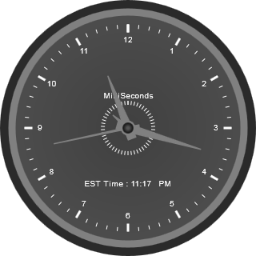

::: {style="DISPLAY: none"}
{#d2h_url_template} {#d2h_package_url style="WIDTH: 0px; DISPLAY: none; HEIGHT: 0px"}
:::

::::: {#nsbanner .d2h_main_nsbanner style="BORDER-BOTTOM: #999999 1px solid; POSITION: relative; PADDING-BOTTOM: 0px; BACKGROUND-COLOR: transparent; PADDING-LEFT: 0px; PADDING-RIGHT: 0px; DISPLAY: none; BORDER-TOP: #999999 1px solid; PADDING-TOP: 0px; LEFT: 0px"}
:::: {#TitleRow .d2h_main_titlerow style="PADDING-BOTTOM: 4px; BACKGROUND-COLOR: transparent; PADDING-LEFT: 22px; WIDTH: 100%; PADDING-RIGHT: 10px; DISPLAY: none; PADDING-TOP: 4px"}
::: {#ienav .d2h_main_ienav style="DISPLAY: none"}
{#D2HPrevious .D2HPreviousEnabled}  {#D2HNext .D2HNextEnabled}
:::
::::
:::::

:::: {#nstext .d2h_main_nstext style="PADDING-BOTTOM: 10px; BACKGROUND-COLOR: transparent; PADDING-LEFT: 22px; PADDING-RIGHT: 10px; HEIGHT: 100%; OVERFLOW: auto; PADDING-TOP: 5px" hasuserbackground="true" valign="bottom"}
::: {#d2h_breadcrumbs .d2h_breadcrumbs}
[Essential Studio User Guide Documentation](ms-xhelp:///?Id=12457748-09e3-4d74-a240-8e049cedf030){.d2h_breadcrumbsNormal} [ \> ]{.d2h_breadcrumbsLinkSeparator} [User Interface Edition](ms-xhelp:///?Id=c29296b7-531c-413b-a0ec-488ca1f7f669){.d2h_breadcrumbsNormal} [ \> ]{.d2h_breadcrumbsLinkSeparator} [Essential ASP.NET](ms-xhelp:///?Id=25c35330-c127-4dad-9a92-ed79dc7261a6){.d2h_breadcrumbsNormal} [ \> ]{.d2h_breadcrumbsLinkSeparator} [Essential Gauge]{.d2h_breadcrumbsContentsOnly} [ \> ]{.d2h_breadcrumbsLinkSeparator} [How do I ...](ms-xhelp:///?Id=dcf7484d-b310-4f39-b813-e69dc31c94a3){.d2h_breadcrumbsNormal}
:::

## How do I create a Clock using the circulars gauge in ASP.NET Gauge? {#how-do-i-create-a-clock-using-the-circulars-gauge-in-asp.net-gauge style="tab-stops: 0pt"}

[ [1.   ]{style="COLOR: windowtext; TEXT-DECORATION: none; text-underline: none"} ]{.UGHyperlink}Create a new ASP.NET Web application. For details, take a look at the [[Creating ASP.NET Web Application[ section.]{style="COLOR: windowtext; TEXT-DECORATION: none; text-underline: none"}]{style="COLOR: windowtext; TEXT-DECORATION: none; text-underline: none"}]{.UGHyperlink}

[2.   ]{style="COLOR: windowtext; TEXT-DECORATION: none; text-underline: none"} Drag and drop the Circular Gauge Control onto the .aspx page in the new web application.

3.   Add the necessary pointers and scales as shown in below code.

+-------------------------------------------------------------------------------------------------------------------------------------------------------------------------------------------------------------------------------------------------------------------------------------------------------------------------------------------------------------------------------------------------------------------------------------------------------------------------------------------------------+
| [\[ASPX\]]{style="FONT-FAMILY: 'Courier New'"}                                                                                                                                                                                                                                                                                                                                                                                                                                                        |
|                                                                                                                                                                                                                                                                                                                                                                                                                                                                                                       |
| []{style="FONT-FAMILY: 'Courier New'"}                                                                                                                                                                                                                                                                                                                                                                                                                                                                |
|                                                                                                                                                                                                                                                                                                                                                                                                                                                                                                       |
| [\<]{style="FONT-FAMILY: 'Courier New'; COLOR: blue"} [syncfusion]{style="FONT-FAMILY: 'Courier New'; COLOR: #a31515"} [:]{style="FONT-FAMILY: 'Courier New'; COLOR: blue"} [CircularGauge]{style="FONT-FAMILY: 'Courier New'; COLOR: #a31515"} [ [AutoFormat]{style="COLOR: red"} [=\"Sandune\"]{style="COLOR: blue"} [FrameInnerWidth]{style="COLOR: red"} [=\"9\"]{style="COLOR: blue"} [FrameOuterWidth]{style="COLOR: red"} [=\"15\"]{style="COLOR: blue"} ]{style="FONT-FAMILY: 'Courier New'"} |
|                                                                                                                                                                                                                                                                                                                                                                                                                                                                                                       |
| [                [ID]{style="COLOR: red"}[=\"ISTGauge\"]{style="COLOR: blue"}[runat]{style="COLOR: red"}[=\"server\"\>]{style="COLOR: blue"}]{style="FONT-FAMILY: 'Courier New'"}                                                                                                                                                                                                                                                                                                                     |
|                                                                                                                                                                                                                                                                                                                                                                                                                                                                                                       |
| [                [\<]{style="COLOR: blue"}[Scales]{style="COLOR: #a31515"}[\>]{style="COLOR: blue"}]{style="FONT-FAMILY: 'Courier New'"}                                                                                                                                                                                                                                                                                                                                                              |
|                                                                                                                                                                                                                                                                                                                                                                                                                                                                                                       |
| [                    [\<]{style="COLOR: blue"}[syncfusion]{style="COLOR: #a31515"}[:]{style="COLOR: blue"}[CircularScale]{style="COLOR: #a31515"}[LabelAutoAngle]{style="COLOR: red"}[=\"false\"]{style="COLOR: blue"}[Minimum]{style="COLOR: red"}[=\"0\"]{style="COLOR: blue"}[Maximum]{style="COLOR: red"}[=\"12\"]{style="COLOR: blue"}[BorderWidth]{style="COLOR: red"}[=\"1\"]{style="COLOR: blue"}]{style="FONT-FAMILY: 'Courier New'"}                                                        |
|                                                                                                                                                                                                                                                                                                                                                                                                                                                                                                       |
| [                        [StartAngle]{style="COLOR: red"}[=\"270\"]{style="COLOR: blue"}[ScaleDirection]{style="COLOR: red"}[=\"Clockwise\"]{style="COLOR: blue"}[PointerCapRadius]{style="COLOR: red"}[=\"8\"]{style="COLOR: blue"}[PointerCapBorderWidth]{style="COLOR: red"}[=\"4\"]{style="COLOR: blue"}]{style="FONT-FAMILY: 'Courier New'"}                                                                                                                                                     |
|                                                                                                                                                                                                                                                                                                                                                                                                                                                                                                       |
| [                        [ScaleRadius]{style="COLOR: red"}[=\"130\"]{style="COLOR: blue"}[ScaleBarSize]{style="COLOR: red"}[=\"0\"]{style="COLOR: blue"}[SweepAngle]{style="COLOR: red"}[=\"360\"]{style="COLOR: blue"}[MajorIntervalValue]{style="COLOR: red"}[=\"1\"]{style="COLOR: blue"}[MinorIntervalValue]{style="COLOR: red"}[=\"0.2\"\>]{style="COLOR: blue"}]{style="FONT-FAMILY: 'Courier New'"}                                                                                            |
|                                                                                                                                                                                                                                                                                                                                                                                                                                                                                                       |
| [                        [\<]{style="COLOR: blue"}[Labels]{style="COLOR: #a31515"}[\>]{style="COLOR: blue"}]{style="FONT-FAMILY: 'Courier New'"}                                                                                                                                                                                                                                                                                                                                                      |
|                                                                                                                                                                                                                                                                                                                                                                                                                                                                                                       |
| [                            [\<]{style="COLOR: blue"}[syncfusion]{style="COLOR: #a31515"}[:]{style="COLOR: blue"}[CircularGaugeLabel]{style="COLOR: #a31515"}[DistanceFromScale]{style="COLOR: red"}[=\"5\"]{style="COLOR: blue"}[IncludeFirstValue]{style="COLOR: red"}[=\"false\"]{style="COLOR: blue"}[LabelStyle]{style="COLOR: red"}[=\"MajorInterval\"]{style="COLOR: blue"}]{style="FONT-FAMILY: 'Courier New'"}                                                                              |
|                                                                                                                                                                                                                                                                                                                                                                                                                                                                                                       |
| [                                [LabelPlacement]{style="COLOR: red"}[=\"Near\"]{style="COLOR: blue"}[Angle]{style="COLOR: red"}[=\"0\"]{style="COLOR: blue"}[/\>]{style="COLOR: blue"}]{style="FONT-FAMILY: 'Courier New'"}                                                                                                                                                                                                                                                                          |
|                                                                                                                                                                                                                                                                                                                                                                                                                                                                                                       |
| [                        [\</]{style="COLOR: blue"}[Labels]{style="COLOR: #a31515"}[\>]{style="COLOR: blue"}]{style="FONT-FAMILY: 'Courier New'"}                                                                                                                                                                                                                                                                                                                                                     |
|                                                                                                                                                                                                                                                                                                                                                                                                                                                                                                       |
| [                        [\<]{style="COLOR: blue"}[Ticks]{style="COLOR: #a31515"}[\>]{style="COLOR: blue"}]{style="FONT-FAMILY: 'Courier New'"}                                                                                                                                                                                                                                                                                                                                                       |
|                                                                                                                                                                                                                                                                                                                                                                                                                                                                                                       |
| [                            [\<]{style="COLOR: blue"}[syncfusion]{style="COLOR: #a31515"}[:]{style="COLOR: blue"}[CircularGaugeTick]{style="COLOR: #a31515"}[TickStyle]{style="COLOR: red"}[=\"MajorInterval\"]{style="COLOR: blue"}[TickWidth]{style="COLOR: red"}[=\"3\"]{style="COLOR: blue"}]{style="FONT-FAMILY: 'Courier New'"}                                                                                                                                                                |
|                                                                                                                                                                                                                                                                                                                                                                                                                                                                                                       |
| [                                [TickHeight]{style="COLOR: red"}[=\"10\"]{style="COLOR: blue"}[TickPlacement]{style="COLOR: red"}[=\"Near\"]{style="COLOR: blue"}[Angle]{style="COLOR: red"}[=\"0\"]{style="COLOR: blue"}[/\>]{style="COLOR: blue"}]{style="FONT-FAMILY: 'Courier New'"}                                                                                                                                                                                                             |
|                                                                                                                                                                                                                                                                                                                                                                                                                                                                                                       |
| [                            [\<]{style="COLOR: blue"}[syncfusion]{style="COLOR: #a31515"}[:]{style="COLOR: blue"}[CircularGaugeTick]{style="COLOR: #a31515"}[TickStyle]{style="COLOR: red"}[=\"MinorInterval\"]{style="COLOR: blue"}[TickWidth]{style="COLOR: red"}[=\"1\"]{style="COLOR: blue"}[TickHeight]{style="COLOR: red"}[=\"5\"]{style="COLOR: blue"}]{style="FONT-FAMILY: 'Courier New'"}                                                                                                   |
|                                                                                                                                                                                                                                                                                                                                                                                                                                                                                                       |
| [                                [Angle]{style="COLOR: red"}[=\"0\"]{style="COLOR: blue"}[TickPlacement]{style="COLOR: red"}[=\"Near\"]{style="COLOR: blue"}[/\>]{style="COLOR: blue"}]{style="FONT-FAMILY: 'Courier New'"}                                                                                                                                                                                                                                                                           |
|                                                                                                                                                                                                                                                                                                                                                                                                                                                                                                       |
| [                        [\</]{style="COLOR: blue"}[Ticks]{style="COLOR: #a31515"}[\>]{style="COLOR: blue"}]{style="FONT-FAMILY: 'Courier New'"}                                                                                                                                                                                                                                                                                                                                                      |
|                                                                                                                                                                                                                                                                                                                                                                                                                                                                                                       |
| [                        [\<]{style="COLOR: blue"}[Pointers]{style="COLOR: #a31515"}[\>]{style="COLOR: blue"}]{style="FONT-FAMILY: 'Courier New'"}                                                                                                                                                                                                                                                                                                                                                    |
|                                                                                                                                                                                                                                                                                                                                                                                                                                                                                                       |
| [                            [\<]{style="COLOR: blue"}[syncfusion]{style="COLOR: #a31515"}[:]{style="COLOR: blue"}[CircularPointer]{style="COLOR: #a31515"}[PointerLength]{style="COLOR: red"}[=\"70\"]{style="COLOR: blue"}[ShowBackNeedle]{style="COLOR: red"}[=\"true\"]{style="COLOR: blue"}[BackNeedleLength]{style="COLOR: red"}[=\"10\"]{style="COLOR: blue"}]{style="FONT-FAMILY: 'Courier New'"}                                                                                             |
|                                                                                                                                                                                                                                                                                                                                                                                                                                                                                                       |
| [                                [PointerWidth]{style="COLOR: red"}[=\"10\"]{style="COLOR: blue"}[Value]{style="COLOR: red"}[=\"3\"]{style="COLOR: blue"}[PointerNeedleType]{style="COLOR: red"}[=\"Needle\"]{style="COLOR: blue"}[NeedleStyle]{style="COLOR: red"}[=\"Triangle\"]{style="COLOR: blue"}[/\>]{style="COLOR: blue"}]{style="FONT-FAMILY: 'Courier New'"}                                                                                                                                |
|                                                                                                                                                                                                                                                                                                                                                                                                                                                                                                       |
| [                            [\<]{style="COLOR: blue"}[syncfusion]{style="COLOR: #a31515"}[:]{style="COLOR: blue"}[CircularPointer]{style="COLOR: #a31515"}[PointerLength]{style="COLOR: red"}[=\"95\"]{style="COLOR: blue"}[ShowBackNeedle]{style="COLOR: red"}[=\"true\"]{style="COLOR: blue"}[BackNeedleLength]{style="COLOR: red"}[=\"10\"]{style="COLOR: blue"}]{style="FONT-FAMILY: 'Courier New'"}                                                                                             |
|                                                                                                                                                                                                                                                                                                                                                                                                                                                                                                       |
| [                                [PointerWidth]{style="COLOR: red"}[=\"10\"]{style="COLOR: blue"}[Value]{style="COLOR: red"}[=\"0\"]{style="COLOR: blue"}[PointerNeedleType]{style="COLOR: red"}[=\"Needle\"]{style="COLOR: blue"}[NeedleStyle]{style="COLOR: red"}[=\"Triangle\"]{style="COLOR: blue"}[/\>]{style="COLOR: blue"}]{style="FONT-FAMILY: 'Courier New'"}                                                                                                                                |
|                                                                                                                                                                                                                                                                                                                                                                                                                                                                                                       |
| [                            [\<]{style="COLOR: blue"}[syncfusion]{style="COLOR: #a31515"}[:]{style="COLOR: blue"}[CircularPointer]{style="COLOR: #a31515"}[PointerLength]{style="COLOR: red"}[=\"95\"]{style="COLOR: blue"}[ShowBackNeedle]{style="COLOR: red"}[=\"true\"]{style="COLOR: blue"}[BackNeedleLength]{style="COLOR: red"}[=\"10\"]{style="COLOR: blue"}]{style="FONT-FAMILY: 'Courier New'"}                                                                                             |
|                                                                                                                                                                                                                                                                                                                                                                                                                                                                                                       |
| [                                [PointerWidth]{style="COLOR: red"}[=\"2\"]{style="COLOR: blue"}[Value]{style="COLOR: red"}[=\"1.5\"]{style="COLOR: blue"}[PointerNeedleType]{style="COLOR: red"}[=\"Needle\"]{style="COLOR: blue"}[NeedleStyle]{style="COLOR: red"}[=\"Triangle\"]{style="COLOR: blue"}[/\>]{style="COLOR: blue"}]{style="FONT-FAMILY: 'Courier New'"}                                                                                                                               |
|                                                                                                                                                                                                                                                                                                                                                                                                                                                                                                       |
| [                        [\</]{style="COLOR: blue"}[Pointers]{style="COLOR: #a31515"}[\>]{style="COLOR: blue"}]{style="FONT-FAMILY: 'Courier New'"}                                                                                                                                                                                                                                                                                                                                                   |
|                                                                                                                                                                                                                                                                                                                                                                                                                                                                                                       |
| [                        [\<]{style="COLOR: blue"}[CustomLabel]{style="COLOR: #a31515"}[\>]{style="COLOR: blue"}]{style="FONT-FAMILY: 'Courier New'"}                                                                                                                                                                                                                                                                                                                                                 |
|                                                                                                                                                                                                                                                                                                                                                                                                                                                                                                       |
| [                            [\<]{style="COLOR: blue"}[syncfusion]{style="COLOR: #a31515"}[:]{style="COLOR: blue"}[GaugeCustomLabel]{style="COLOR: #a31515"}[LabelValue]{style="COLOR: red"}[=\"IST-Time\"]{style="COLOR: blue"}[Location]{style="COLOR: red"}[=\"160,230\"]{style="COLOR: blue"}[/\>]{style="COLOR: blue"}]{style="FONT-FAMILY: 'Courier New'"}                                                                                                                                      |
|                                                                                                                                                                                                                                                                                                                                                                                                                                                                                                       |
| [                        [\</]{style="COLOR: blue"}[CustomLabel]{style="COLOR: #a31515"}[\>]{style="COLOR: blue"}]{style="FONT-FAMILY: 'Courier New'"}                                                                                                                                                                                                                                                                                                                                                |
|                                                                                                                                                                                                                                                                                                                                                                                                                                                                                                       |
| [                    [\</]{style="COLOR: blue"}[syncfusion]{style="COLOR: #a31515"}[:]{style="COLOR: blue"}[CircularScale]{style="COLOR: #a31515"}[\>]{style="COLOR: blue"}]{style="FONT-FAMILY: 'Courier New'"}                                                                                                                                                                                                                                                                                      |
|                                                                                                                                                                                                                                                                                                                                                                                                                                                                                                       |
| [                    [\<]{style="COLOR: blue"}[syncfusion]{style="COLOR: #a31515"}[:]{style="COLOR: blue"}[CircularScale]{style="COLOR: #a31515"}[LabelAutoAngle]{style="COLOR: red"}[=\"false\"]{style="COLOR: blue"}[Minimum]{style="COLOR: red"}[=\"0\"]{style="COLOR: blue"}[Maximum]{style="COLOR: red"}[=\"1000\"]{style="COLOR: blue"}[BorderWidth]{style="COLOR: red"}[=\"2\"]{style="COLOR: blue"}]{style="FONT-FAMILY: 'Courier New'"}                                                      |
|                                                                                                                                                                                                                                                                                                                                                                                                                                                                                                       |
| [                        [StartAngle]{style="COLOR: red"}[=\"270\"]{style="COLOR: blue"}[ScaleDirection]{style="COLOR: red"}[=\"Clockwise\"]{style="COLOR: blue"}[PointerCapRadius]{style="COLOR: red"}[=\"8\"]{style="COLOR: blue"}[PointerCapBorderWidth]{style="COLOR: red"}[=\"4\"]{style="COLOR: blue"}]{style="FONT-FAMILY: 'Courier New'"}                                                                                                                                                     |
|                                                                                                                                                                                                                                                                                                                                                                                                                                                                                                       |
| [                        [ScaleRadius]{style="COLOR: red"}[=\"35\"]{style="COLOR: blue"}[ScaleBarSize]{style="COLOR: red"}[=\"0\"]{style="COLOR: blue"}[SweepAngle]{style="COLOR: red"}[=\"360\"]{style="COLOR: blue"}[MajorIntervalValue]{style="COLOR: red"}[=\"20\"\>]{style="COLOR: blue"}]{style="FONT-FAMILY: 'Courier New'"}                                                                                                                                                                   |
|                                                                                                                                                                                                                                                                                                                                                                                                                                                                                                       |
| [                        [\<]{style="COLOR: blue"}[Ticks]{style="COLOR: #a31515"}[\>]{style="COLOR: blue"}]{style="FONT-FAMILY: 'Courier New'"}                                                                                                                                                                                                                                                                                                                                                       |
|                                                                                                                                                                                                                                                                                                                                                                                                                                                                                                       |
| [                            [\<]{style="COLOR: blue"}[syncfusion]{style="COLOR: #a31515"}[:]{style="COLOR: blue"}[CircularGaugeTick]{style="COLOR: #a31515"}[TickStyle]{style="COLOR: red"}[=\"MajorInterval\"]{style="COLOR: blue"}[TickWidth]{style="COLOR: red"}[=\"1\"]{style="COLOR: blue"}]{style="FONT-FAMILY: 'Courier New'"}                                                                                                                                                                |
|                                                                                                                                                                                                                                                                                                                                                                                                                                                                                                       |
| [                                [TickHeight]{style="COLOR: red"}[=\"5\"]{style="COLOR: blue"}[TickPlacement]{style="COLOR: red"}[=\"Near\"]{style="COLOR: blue"}[Angle]{style="COLOR: red"}[=\"0\"]{style="COLOR: blue"}[/\>]{style="COLOR: blue"}]{style="FONT-FAMILY: 'Courier New'"}                                                                                                                                                                                                              |
|                                                                                                                                                                                                                                                                                                                                                                                                                                                                                                       |
| [                        [\</]{style="COLOR: blue"}[Ticks]{style="COLOR: #a31515"}[\>]{style="COLOR: blue"}]{style="FONT-FAMILY: 'Courier New'"}                                                                                                                                                                                                                                                                                                                                                      |
|                                                                                                                                                                                                                                                                                                                                                                                                                                                                                                       |
| [                        [\<]{style="COLOR: blue"}[Pointers]{style="COLOR: #a31515"}[\>]{style="COLOR: blue"}]{style="FONT-FAMILY: 'Courier New'"}                                                                                                                                                                                                                                                                                                                                                    |
|                                                                                                                                                                                                                                                                                                                                                                                                                                                                                                       |
| [                            [\<]{style="COLOR: blue"}[syncfusion]{style="COLOR: #a31515"}[:]{style="COLOR: blue"}[CircularPointer]{style="COLOR: #a31515"}[PointerLength]{style="COLOR: red"}[=\"25\"]{style="COLOR: blue"}[ShowBackNeedle]{style="COLOR: red"}[=\"true\"]{style="COLOR: blue"}[BackNeedleLength]{style="COLOR: red"}[=\"5\"]{style="COLOR: blue"}]{style="FONT-FAMILY: 'Courier New'"}                                                                                              |
|                                                                                                                                                                                                                                                                                                                                                                                                                                                                                                       |
| [                                [PointerWidth]{style="COLOR: red"}[=\"5\"]{style="COLOR: blue"}[Value]{style="COLOR: red"}[=\"3\"]{style="COLOR: blue"}[PointerNeedleType]{style="COLOR: red"}[=\"Needle\"]{style="COLOR: blue"}[NeedleStyle]{style="COLOR: red"}[=\"Triangle\"]{style="COLOR: blue"}[/\>]{style="COLOR: blue"}]{style="FONT-FAMILY: 'Courier New'"}                                                                                                                                 |
|                                                                                                                                                                                                                                                                                                                                                                                                                                                                                                       |
| [                        [\</]{style="COLOR: blue"}[Pointers]{style="COLOR: #a31515"}[\>]{style="COLOR: blue"}]{style="FONT-FAMILY: 'Courier New'"}                                                                                                                                                                                                                                                                                                                                                   |
|                                                                                                                                                                                                                                                                                                                                                                                                                                                                                                       |
| [                        [\<]{style="COLOR: blue"}[CustomLabel]{style="COLOR: #a31515"}[\>]{style="COLOR: blue"}]{style="FONT-FAMILY: 'Courier New'"}                                                                                                                                                                                                                                                                                                                                                 |
|                                                                                                                                                                                                                                                                                                                                                                                                                                                                                                       |
| [                            [\<]{style="COLOR: blue"}[syncfusion]{style="COLOR: #a31515"}[:]{style="COLOR: blue"}[GaugeCustomLabel]{style="COLOR: #a31515"}[Location]{style="COLOR: red"}[=\"160, 120\"]{style="COLOR: blue"}[LabelValue]{style="COLOR: red"}[=\"MilliSeconds\"]{style="COLOR: blue"}[/\>]{style="COLOR: blue"}]{style="FONT-FAMILY: 'Courier New'"}                                                                                                                                 |
|                                                                                                                                                                                                                                                                                                                                                                                                                                                                                                       |
| [                        [\</]{style="COLOR: blue"}[CustomLabel]{style="COLOR: #a31515"}[\>]{style="COLOR: blue"}]{style="FONT-FAMILY: 'Courier New'"}                                                                                                                                                                                                                                                                                                                                                |
|                                                                                                                                                                                                                                                                                                                                                                                                                                                                                                       |
| [                    [\</]{style="COLOR: blue"}[syncfusion]{style="COLOR: #a31515"}[:]{style="COLOR: blue"}[CircularScale]{style="COLOR: #a31515"}[\>]{style="COLOR: blue"}]{style="FONT-FAMILY: 'Courier New'"}                                                                                                                                                                                                                                                                                      |
|                                                                                                                                                                                                                                                                                                                                                                                                                                                                                                       |
| [                [\</]{style="COLOR: blue"}[Scales]{style="COLOR: #a31515"}[\>]{style="COLOR: blue"}]{style="FONT-FAMILY: 'Courier New'"}                                                                                                                                                                                                                                                                                                                                                             |
|                                                                                                                                                                                                                                                                                                                                                                                                                                                                                                       |
| [            [\</]{style="COLOR: blue"}[syncfusion]{style="COLOR: #a31515"}[:]{style="COLOR: blue"}[CircularGauge]{style="COLOR: #a31515"}[\>]{style="COLOR: blue"}]{style="FONT-FAMILY: 'Courier New'"} []{style="FONT-FAMILY: 'Courier New'"}                                                                                                                                                                                                                                                       |
+-------------------------------------------------------------------------------------------------------------------------------------------------------------------------------------------------------------------------------------------------------------------------------------------------------------------------------------------------------------------------------------------------------------------------------------------------------------------------------------------------------+

**[]{style="COLOR: #e36c0a"}**  

4.   Add the below script in the .aspx page:**[]{style="COLOR: #e36c0a"}**

+-------------------------------------------------------------------------------------------------------------------------------------------------------------------------------------------------------------------------------------+
| [\[Script\]]{style="FONT-FAMILY: 'Courier New'"}                                                                                                                                                                                    |
|                                                                                                                                                                                                                                     |
| []{style="FONT-FAMILY: 'Courier New'"}                                                                                                                                                                                              |
|                                                                                                                                                                                                                                     |
| [\<]{style="FONT-FAMILY: 'Courier New'; COLOR: blue"} [script]{style="FONT-FAMILY: 'Courier New'; COLOR: #a31515"} [ [type]{style="COLOR: red"} [=\"text/javascript\"\>]{style="COLOR: blue"} ]{style="FONT-FAMILY: 'Courier New'"} |
|                                                                                                                                                                                                                                     |
| []{style="FONT-FAMILY: 'Courier New'; COLOR: blue"}                                                                                                                                                                                 |
|                                                                                                                                                                                                                                     |
| [        window.setInterval([\"setClock()\"]{style="COLOR: #a31515"}, 1);]{style="FONT-FAMILY: 'Courier New'"}                                                                                                                      |
|                                                                                                                                                                                                                                     |
| [        [function]{style="COLOR: blue"} setClock() {]{style="FONT-FAMILY: 'Courier New'"}                                                                                                                                          |
|                                                                                                                                                                                                                                     |
| [            [var]{style="COLOR: blue"} estDay, pstDay, mstDay, istDay, pstTime, mstTime, istTime, estTime;]{style="FONT-FAMILY: 'Courier New'"}                                                                                    |
|                                                                                                                                                                                                                                     |
| [            [var]{style="COLOR: blue"} time = [new]{style="COLOR: blue"} Date();]{style="FONT-FAMILY: 'Courier New'"}                                                                                                              |
|                                                                                                                                                                                                                                     |
| [            [var]{style="COLOR: blue"} utcHours = time.getUTCHours();]{style="FONT-FAMILY: 'Courier New'"}                                                                                                                         |
|                                                                                                                                                                                                                                     |
| [            [var]{style="COLOR: blue"} utcMinutes = time.getUTCMinutes();]{style="FONT-FAMILY: 'Courier New'"}                                                                                                                     |
|                                                                                                                                                                                                                                     |
| [            [var]{style="COLOR: blue"} utcSeconds = time.getUTCSeconds();]{style="FONT-FAMILY: 'Courier New'"}                                                                                                                     |
|                                                                                                                                                                                                                                     |
| [            [var]{style="COLOR: blue"} utcMilliseconds = time.getUTCMilliseconds();]{style="FONT-FAMILY: 'Courier New'"}                                                                                                           |
|                                                                                                                                                                                                                                     |
| [            [if]{style="COLOR: blue"} (utcHours - 5 \< 0) { [var]{style="COLOR: blue"} estHours = (utcHours - 5 + 24) }]{style="FONT-FAMILY: 'Courier New'"}                                                                       |
|                                                                                                                                                                                                                                     |
| [            [else]{style="COLOR: blue"} { [var]{style="COLOR: blue"} estHours = (utcHours - 5) }]{style="FONT-FAMILY: 'Courier New'"}                                                                                              |
|                                                                                                                                                                                                                                     |
| [            [if]{style="COLOR: blue"} (estHours \> 12) {]{style="FONT-FAMILY: 'Courier New'"}                                                                                                                                      |
|                                                                                                                                                                                                                                     |
| [                estDay = [\"PM\"]{style="COLOR: #a31515"};]{style="FONT-FAMILY: 'Courier New'"}                                                                                                                                    |
|                                                                                                                                                                                                                                     |
| [                estHours = estHours - 12;]{style="FONT-FAMILY: 'Courier New'"}                                                                                                                                                     |
|                                                                                                                                                                                                                                     |
| [            }]{style="FONT-FAMILY: 'Courier New'"}                                                                                                                                                                                 |
|                                                                                                                                                                                                                                     |
| [            [else]{style="COLOR: blue"} {]{style="FONT-FAMILY: 'Courier New'"}                                                                                                                                                     |
|                                                                                                                                                                                                                                     |
| [                estDay = [\"AM\"]{style="COLOR: #a31515"};]{style="FONT-FAMILY: 'Courier New'"}                                                                                                                                    |
|                                                                                                                                                                                                                                     |
| [            }]{style="FONT-FAMILY: 'Courier New'"}                                                                                                                                                                                 |
|                                                                                                                                                                                                                                     |
| []{style="FONT-FAMILY: 'Courier New'"}                                                                                                                                                                                              |
|                                                                                                                                                                                                                                     |
| [            utcSeconds = (utcSeconds / 60) \* 12;]{style="FONT-FAMILY: 'Courier New'"}                                                                                                                                             |
|                                                                                                                                                                                                                                     |
| [            utcMinutes = (utcMinutes / 60) \* 12 + utcSeconds / 60;]{style="FONT-FAMILY: 'Courier New'"}                                                                                                                           |
|                                                                                                                                                                                                                                     |
| [            [if]{style="COLOR: blue"} (estHours == 12)]{style="FONT-FAMILY: 'Courier New'"}                                                                                                                                        |
|                                                                                                                                                                                                                                     |
| [                estHours = 0;]{style="FONT-FAMILY: 'Courier New'"}                                                                                                                                                                 |
|                                                                                                                                                                                                                                     |
| [            estHours = estHours + (utcMinutes / 12);]{style="FONT-FAMILY: 'Courier New'"}                                                                                                                                          |
|                                                                                                                                                                                                                                     |
| [            [var]{style="COLOR: blue"} estText = parseInt(estHours) == 0 ? 12 : parseInt(estHours);]{style="FONT-FAMILY: 'Courier New'"}                                                                                           |
|                                                                                                                                                                                                                                     |
| [            [var]{style="COLOR: blue"} utcmin = (parseInt(time.getUTCMinutes()) \< 10) ? [\"0\"]{style="COLOR: #a31515"} + parseInt(time.getUTCMinutes()) : parseInt(time.getUTCMinutes());]{style="FONT-FAMILY: 'Courier New'"}   |
|                                                                                                                                                                                                                                     |
| [            estTime = [\"EST Time : \"]{style="COLOR: #a31515"} + estText + [\":\"]{style="COLOR: #a31515"} + utcmin + [\"   \"]{style="COLOR: #a31515"} + estDay;]{style="FONT-FAMILY: 'Courier New'"}                            |
|                                                                                                                                                                                                                                     |
| [            \$([\"#\<%=this.ISTGauge.ClientID %\>\"]{style="COLOR: #a31515"}).sfCircularGauge([\"SetCustomLabelValue\"]{style="COLOR: #a31515"}, 0, 0, estTime);]{style="FONT-FAMILY: 'Courier New'"}                              |
|                                                                                                                                                                                                                                     |
| [            \$([\"#\<%=this.ISTGauge.ClientID %\>\"]{style="COLOR: #a31515"}).sfCircularGauge([\"SetPointerValue\"]{style="COLOR: #a31515"}, 0, 0, estHours);]{style="FONT-FAMILY: 'Courier New'"}                                 |
|                                                                                                                                                                                                                                     |
| [            \$([\"#\<%=this.ISTGauge.ClientID %\>\"]{style="COLOR: #a31515"}).sfCircularGauge([\"SetPointerValue\"]{style="COLOR: #a31515"}, 0, 1, utcMinutes);]{style="FONT-FAMILY: 'Courier New'"}                               |
|                                                                                                                                                                                                                                     |
| [            \$([\"#\<%=this.ISTGauge.ClientID %\>\"]{style="COLOR: #a31515"}).sfCircularGauge([\"SetPointerValue\"]{style="COLOR: #a31515"}, 0, 2, utcSeconds);]{style="FONT-FAMILY: 'Courier New'"}                               |
|                                                                                                                                                                                                                                     |
| [            \$([\"#\<%=this.ISTGauge.ClientID %\>\"]{style="COLOR: #a31515"}).sfCircularGauge([\"SetPointerValue\"]{style="COLOR: #a31515"}, 1, 0, utcMilliseconds);]{style="FONT-FAMILY: 'Courier New'"}                          |
|                                                                                                                                                                                                                                     |
| [        }]{style="FONT-FAMILY: 'Courier New'"}                                                                                                                                                                                     |
|                                                                                                                                                                                                                                     |
| [    [\</]{style="COLOR: blue"}[script]{style="COLOR: #a31515"}[\>]{style="COLOR: blue"}]{style="FONT-FAMILY: 'Courier New'"} []{style="FONT-FAMILY: 'Courier New'"}                                                                |
+-------------------------------------------------------------------------------------------------------------------------------------------------------------------------------------------------------------------------------------+

**[]{style="COLOR: #e36c0a"}**  

5.   Build and run the application. The output will be as the figure given below:**[]{style="COLOR: #e36c0a"}**

 

{border="0"}

**[]{style="COLOR: #e36c0a"}**  

**[]{style="COLOR: #e36c0a"}**  

**[]{style="COLOR: #e36c0a"}**  

[]{#related-topics}
::::
