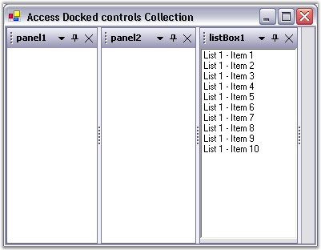
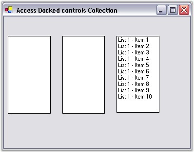

::: {style="DISPLAY: none"}
{#d2h_url_template}{#d2h_package_url style="WIDTH: 0px; DISPLAY: none; HEIGHT: 0px"}
:::

::: {.d2h_secondary_topic style="PADDING-BOTTOM: 10pt; MARGIN: 0pt; PADDING-LEFT: 0pt; PADDING-RIGHT: 0pt; PADDING-TOP: 0pt"}
##### How to Access the Collection of Dock-Enabled Controls? {#how-to-access-the-collection-of-dock-enabled-controls style="tab-stops: 0pt"}

[]{style="COLOR: #15428b"} 

The DockingManager.Controls property returns an enumerator that may be used for accessing the controls that are currently associated with the DockingManager. To access and modify the DockingManager's control, the contents of the enumerator should first be copied to a temporary collection.

 

Step 1: Create the respective controls and dock the control through design by setting EnableDocking on dockingManager property to true and follow the below given steps to enable, access and modify the docked controls.

[]{style="COLOR: #15428b"} 

{border="0"}

**[]{style="COLOR: #15428b"}** 

Figure 102: Docked Controls

[]{style="COLOR: #15428b"} 

Step 2: Access and modify the dockable controls.

 

The below given code snippet accesses the docked controls, disable docking and then disposes the dockable controls.

 

+---------------------------------------------------------------------------------------------------------------------------------------------------------------------+
| **[\[C#\]]{style="FONT-FAMILY: 'Courier New'; COLOR: black"}**                                                                                                      |
|                                                                                                                                                                     |
| **[]{style="FONT-FAMILY: 'Courier New'; COLOR: black"}**                                                                                                            |
|                                                                                                                                                                     |
| [//Getting the Controls into an ArrayList.]{style="FONT-FAMILY: 'Courier New'; COLOR: green"}                                                                       |
|                                                                                                                                                                     |
| [IEnumerator ienum = [this]{style="COLOR: blue"}.dockingManager.Controls; ]{style="FONT-FAMILY: 'Courier New'"}                                                     |
|                                                                                                                                                                     |
| [ArrayList dockedctrls = [new]{style="COLOR: blue"} ArrayList(); ]{style="FONT-FAMILY: 'Courier New'"}                                                              |
|                                                                                                                                                                     |
| [while]{style="FONT-FAMILY: 'Courier New'; COLOR: blue"}[(ienum.MoveNext()) ]{style="FONT-FAMILY: 'Courier New'"}                                                   |
|                                                                                                                                                                     |
| [dockedctrls.Add(ienum.Current); ]{style="FONT-FAMILY: 'Courier New'"}                                                                                              |
|                                                                                                                                                                     |
| [// Iterating through the collection to perform the required operation.]{style="FONT-FAMILY: 'Courier New'; COLOR: green"}                                          |
|                                                                                                                                                                     |
| [foreach]{style="FONT-FAMILY: 'Courier New'; COLOR: blue"}[(Control ctrl [in]{style="COLOR: blue"} dockedctrls) ]{style="FONT-FAMILY: 'Courier New'"}               |
|                                                                                                                                                                     |
| [{                         ]{style="FONT-FAMILY: 'Courier New'"}                                                                                                    |
|                                                                                                                                                                     |
| [// Disabling the docking and disposing control.]{style="FONT-FAMILY: 'Courier New'; COLOR: green"}                                                                 |
|                                                                                                                                                                     |
| [this]{style="FONT-FAMILY: 'Courier New'; COLOR: blue"}[.dockingManager.SetEnableDocking(ctrl, [false]{style="COLOR: blue"}); ]{style="FONT-FAMILY: 'Courier New'"} |
|                                                                                                                                                                     |
| [ctrl.Dispose(); ]{style="FONT-FAMILY: 'Courier New'"}                                                                                                              |
|                                                                                                                                                                     |
| [}]{style="FONT-FAMILY: 'Courier New'"}                                                                                                                             |
+---------------------------------------------------------------------------------------------------------------------------------------------------------------------+

[]{style="COLOR: #15428b"} 

+-------------------------------------------------------------------------------------------------------------------------------------------------------------------------------------------------------+
| **[\[VB.NET\]]{style="FONT-FAMILY: 'Courier New'; COLOR: black"}**                                                                                                                                    |
|                                                                                                                                                                                                       |
| **[]{style="FONT-FAMILY: 'Courier New'; COLOR: black"}**                                                                                                                                              |
|                                                                                                                                                                                                       |
| [\'Getting the Controls into an ArrayList.]{style="FONT-FAMILY: 'Courier New'; COLOR: green"}                                                                                                         |
|                                                                                                                                                                                                       |
| [Dim]{style="FONT-FAMILY: 'Courier New'; COLOR: blue"}[ ienum [As]{style="COLOR: blue"} IEnumerator = [Me]{style="COLOR: blue"}.dockingManager.Controls]{style="FONT-FAMILY: 'Courier New'"}          |
|                                                                                                                                                                                                       |
| [Dim]{style="FONT-FAMILY: 'Courier New'; COLOR: blue"}[ dockedctrls [As]{style="COLOR: blue"} ArrayList = [New]{style="COLOR: blue"} ArrayList()]{style="FONT-FAMILY: 'Courier New'"}                 |
|                                                                                                                                                                                                       |
| [Do]{style="FONT-FAMILY: 'Courier New'; COLOR: blue"}[ [While]{style="COLOR: blue"} ienum.MoveNext()]{style="FONT-FAMILY: 'Courier New'"}                                                             |
|                                                                                                                                                                                                       |
| [   dockedctrls.Add(ienum.Current)]{style="FONT-FAMILY: 'Courier New'"}                                                                                                                               |
|                                                                                                                                                                                                       |
| [Loop]{style="FONT-FAMILY: 'Courier New'; COLOR: blue"}                                                                                                                                               |
|                                                                                                                                                                                                       |
| [\'Iterating through the collection to perform the required operation.]{style="FONT-FAMILY: 'Courier New'; COLOR: green"}                                                                             |
|                                                                                                                                                                                                       |
| [For]{style="FONT-FAMILY: 'Courier New'; COLOR: blue"}[ [Each]{style="COLOR: blue"} ctrl [As]{style="COLOR: blue"} Control [In]{style="COLOR: blue"} dockedctrls]{style="FONT-FAMILY: 'Courier New'"} |
|                                                                                                                                                                                                       |
| [\'Disabling the docking and disposing control.]{style="FONT-FAMILY: 'Courier New'; COLOR: green"}                                                                                                    |
|                                                                                                                                                                                                       |
| [Me]{style="FONT-FAMILY: 'Courier New'; COLOR: blue"}[.dockingManager.SetEnableDocking(ctrl, [False]{style="COLOR: blue"})]{style="FONT-FAMILY: 'Courier New'"}                                       |
|                                                                                                                                                                                                       |
| [ctrl.Dispose()]{style="FONT-FAMILY: 'Courier New'"}                                                                                                                                                  |
|                                                                                                                                                                                                       |
| [Next]{style="FONT-FAMILY: 'Courier New'; COLOR: blue"}[ ctrl]{style="FONT-FAMILY: 'Courier New'"}                                                                                                    |
+-------------------------------------------------------------------------------------------------------------------------------------------------------------------------------------------------------+

[]{style="COLOR: #15428b"} 

{border="0"}

[]{style="COLOR: #15428b"} 

Figure 103: List Box disabled from Docking

[]{#related-topics}
:::
