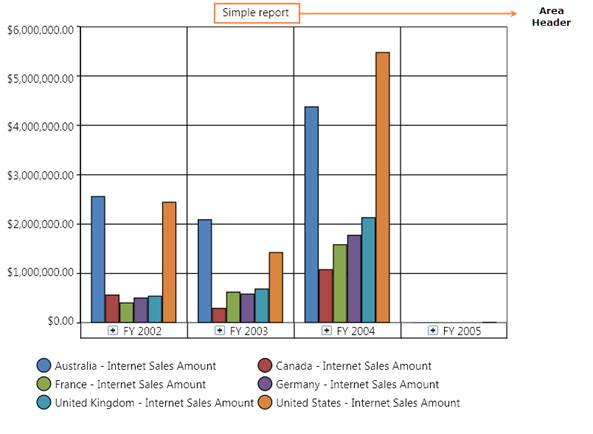

::: {style="DISPLAY: none"}
{#d2h_url_template}{#d2h_package_url style="WIDTH: 0px; DISPLAY: none; HEIGHT: 0px"}
:::

:::: {.d2h_secondary_topic style="PADDING-BOTTOM: 10pt; MARGIN: 0pt; PADDING-LEFT: 0pt; PADDING-RIGHT: 0pt; PADDING-TOP: 0pt"}
##### How to add a Chart header to an OlapArea? {#how-to-add-a-chart-header-to-an-olaparea style="tab-stops: 0pt"}

[]{style="FONT-FAMILY: 'Calibri','sans-serif'; FONT-SIZE: 11pt"} 

Chart header is the title of the chart, which is usually displayed at the top center of the ChartArea.  The following illustration displays the Chart header displayed in the chart area:

 

{border="0"}

Figure 27:  An OlapChart with Chart header

[]{style="FONT-FAMILY: 'Calibri','sans-serif'; FONT-SIZE: 11pt"} 

Steps to Add a Chart Header[]{style="FONT-FAMILY: 'Calibri','sans-serif'; FONT-SIZE: 11pt"}

***[]{style="FONT-FAMILY: 'Calibri','sans-serif'; FONT-SIZE: 11pt"}*** 

The steps to add a chart header are as follows:

 

1.   In general, ChartSeries contains the ChartArea instance, which can be used to customize the OlapArea. The following code snippet describes how to add a chart header to an OlapChart:

 

+----------------------------------------------------------------------------------------------------------------------+
| **\[C#\]**                                                                                                           |
|                                                                                                                      |
|                                                                                                                      |
|                                                                                                                      |
| [       this]{style="COLOR: blue"}.olapchart1.Series\[0\].Area.Header = [\"Simple report\"]{style="COLOR: #a31515"}; |
|                                                                                                                      |
|                                                                                                                      |
+----------------------------------------------------------------------------------------------------------------------+

[]{style="FONT-FAMILY: 'Calibri','sans-serif'; FONT-SIZE: 11pt"} 

+----------------------------------------------------------------------------------------------------------------+
| **\[VB\]**                                                                                                     |
|                                                                                                                |
|                                                                                                                |
|                                                                                                                |
| [      Me]{style="COLOR: blue"}.olapchart1.Series(0).Area.Header = [\"Simple report\"]{style="COLOR: #a31515"} |
|                                                                                                                |
|                                                                                                                |
+----------------------------------------------------------------------------------------------------------------+

[]{style="FONT-FAMILY: 'Calibri','sans-serif'; FONT-SIZE: 11pt"} 

::: {style="BORDER-BOTTOM: windowtext 1pt solid; BORDER-LEFT: medium none; PADDING-BOTTOM: 1pt; MARGIN-TOP: 9pt; PADDING-LEFT: 0pt; PADDING-RIGHT: 0pt; MARGIN-BOTTOM: 9pt; BORDER-TOP: windowtext 1pt solid; BORDER-RIGHT: medium none; PADDING-TOP: 1pt"}
{border="0"}Note: The series will be available only after the data is bound to the control. In other words, you can access the series property of the OlapChart only after the call to DataBind() is made.
:::

[]{style="FONT-FAMILY: 'Calibri','sans-serif'; FONT-SIZE: 11pt"} 

See also:

Chart Area Header

[]{style="FONT-FAMILY: 'Calibri','sans-serif'; FONT-SIZE: 11pt"} 

[]{#related-topics}
::::
