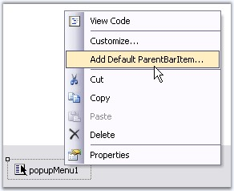
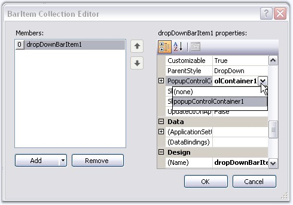
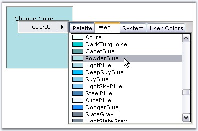

::: {style="DISPLAY: none"}
{#d2h_url_template}{#d2h_package_url style="WIDTH: 0px; DISPLAY: none; HEIGHT: 0px"}
:::

:::: {.d2h_secondary_topic style="PADDING-BOTTOM: 10pt; MARGIN: 0pt; PADDING-LEFT: 0pt; PADDING-RIGHT: 0pt; PADDING-TOP: 0pt"}
##### How to add a ColorUI Control to a Popup Menu {#how-to-add-a-colorui-control-to-a-popup-menu style="tab-stops: 0pt"}

[]{#p346} 

To add ColorUIControl to a PopupMenu, we need to use PopupMenu, PopupControlContainer. Follow the below steps to add a ColorUIControl to a popup menu.

[]{style="COLOR: #15428b"} 

1.   Drag and drop a ColorUIControl, a PopupMenu control, a PopupControlContainer control, a label control and a Panel control onto the form. Place the ColorUIControl inside the PopupControlContainer and the label inside the panel control.

 

2.   Right click PopupMenu and select \'Add Default ParentBarItem\" from the verbs.

[]{style="COLOR: #15428b"} 

{border="0"}

[]{style="COLOR: #15428b"} 

Figure 299: Adding Default ParentBarItem

[]{style="COLOR: #15428b"} 

3.   In the property grid of PopupMenu, expand ParentBarItem, then add a DropDownBarItem to the ParentBarItem using **BarItem Collection Editor**. Also set the PopupControlContainer as the DropDownBarItem\'s PopupControlContainer as shown in the image below.

[]{style="COLOR: #15428b"} 

{border="0"}

[]{style="COLOR: #15428b"} 

Figure 300: Assigning PopupControlContainer to DropDownBarItem

[]{style="COLOR: #15428b"} 

4.   In the MouseUp event of the Panel control call the **PopupMenu.Show** method.

[]{style="COLOR: #15428b"} 

+----------------------------------------------------------------------------------------------------------------------------------------------------------------------------------------------------------------------------+
| **[\[C#\]]{style="FONT-FAMILY: 'Courier New'; COLOR: black"}**                                                                                                                                                             |
|                                                                                                                                                                                                                            |
| []{style="COLOR: #15428b"}                                                                                                                                                                                                 |
|                                                                                                                                                                                                                            |
| [private]{style="FONT-FAMILY: 'Courier New'; COLOR: blue"}[ [void]{style="COLOR: blue"} panel1_MouseUp([object]{style="COLOR: blue"} sender, [MouseEventArgs]{style="COLOR: teal"} e)]{style="FONT-FAMILY: 'Courier New'"} |
|                                                                                                                                                                                                                            |
| [{]{style="FONT-FAMILY: 'Courier New'"}                                                                                                                                                                                    |
|                                                                                                                                                                                                                            |
| [    [this]{style="COLOR: blue"}.popupMenu1.Show([this]{style="COLOR: blue"}.panel1, [new]{style="COLOR: blue"} [Point]{style="COLOR: teal"}(e.X, e.Y));]{style="FONT-FAMILY: 'Courier New'"}                              |
|                                                                                                                                                                                                                            |
| [}]{style="FONT-FAMILY: 'Courier New'"}                                                                                                                                                                                    |
+----------------------------------------------------------------------------------------------------------------------------------------------------------------------------------------------------------------------------+

[]{style="COLOR: #15428b"} 

+---------------------------------------------------------------------------------------------------------------------------------------------------------------------------------------------------------------------------------------------------------------------------------------------------------------------------------------+
| **[\[VB.NET\]]{style="FONT-FAMILY: 'Courier New'; COLOR: black"}**                                                                                                                                                                                                                                                                    |
|                                                                                                                                                                                                                                                                                                                                       |
| []{style="COLOR: #15428b"}                                                                                                                                                                                                                                                                                                            |
|                                                                                                                                                                                                                                                                                                                                       |
| [Private]{style="FONT-FAMILY: 'Courier New'; COLOR: blue"}[ [Sub]{style="COLOR: blue"} panel1_MouseUp([ByVal]{style="COLOR: blue"} sender [As]{style="COLOR: blue"} [Object]{style="COLOR: blue"}, [ByVal]{style="COLOR: blue"} e [As]{style="COLOR: blue"} System.Windows.Forms.MouseEventArgs)]{style="FONT-FAMILY: 'Courier New'"} |
|                                                                                                                                                                                                                                                                                                                                       |
| [    [Me]{style="COLOR: blue"}.popupMenu1.Show([Me]{style="COLOR: blue"}.panel1, [New]{style="COLOR: blue"} Point(e.X, e.Y))]{style="FONT-FAMILY: 'Courier New'"}                                                                                                                                                                     |
|                                                                                                                                                                                                                                                                                                                                       |
| [End]{style="FONT-FAMILY: 'Courier New'; COLOR: blue"}[ [Sub]{style="COLOR: blue"}]{style="FONT-FAMILY: 'Courier New'"}                                                                                                                                                                                                               |
+---------------------------------------------------------------------------------------------------------------------------------------------------------------------------------------------------------------------------------------------------------------------------------------------------------------------------------------+

[]{style="COLOR: #15428b"} 

{border="0"}

**[]{style="COLOR: #15428b"}** 

Figure 301: ColorUIControl as PopupMenu

**[]{style="COLOR: #15428b"}** 

::: {style="BORDER-BOTTOM: windowtext 1pt solid; BORDER-LEFT: medium none; PADDING-BOTTOM: 1pt; MARGIN-TOP: 9pt; PADDING-LEFT: 0pt; PADDING-RIGHT: 0pt; MARGIN-BOTTOM: 9pt; BORDER-TOP: windowtext 1pt solid; BORDER-RIGHT: medium none; PADDING-TOP: 1pt"}
{border="0"} Note: You can close the popup whenever a color is selected at run time. This is done using ColorUIControl.ColorSelected Event.
:::

[]{#related-topics}
::::
