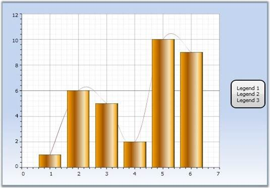

::: {style="DISPLAY: none"}
{#d2h_url_template}{#d2h_package_url style="WIDTH: 0px; DISPLAY: none; HEIGHT: 0px"}
:::

::::: {#nsbanner .d2h_main_nsbanner style="BORDER-BOTTOM: #999999 1px solid; POSITION: relative; PADDING-BOTTOM: 0px; BACKGROUND-COLOR: transparent; PADDING-LEFT: 0px; PADDING-RIGHT: 0px; DISPLAY: none; BORDER-TOP: #999999 1px solid; PADDING-TOP: 0px; LEFT: 0px"}
:::: {#TitleRow .d2h_main_titlerow style="PADDING-BOTTOM: 4px; BACKGROUND-COLOR: transparent; PADDING-LEFT: 22px; WIDTH: 100%; PADDING-RIGHT: 10px; DISPLAY: none; PADDING-TOP: 4px"}
::: {#ienav .d2h_main_ienav style="DISPLAY: none"}
{#D2HPrevious .D2HPreviousEnabled}  {#D2HNext .D2HNextEnabled}
:::
::::
:::::

:::: {#nstext .d2h_main_nstext style="PADDING-BOTTOM: 10px; BACKGROUND-COLOR: transparent; PADDING-LEFT: 22px; PADDING-RIGHT: 10px; HEIGHT: 100%; OVERFLOW: auto; PADDING-TOP: 5px" hasuserbackground="true" valign="bottom"}
::: {#d2h_breadcrumbs .d2h_breadcrumbs}
[Essential Studio User Guide Documentation](ms-xhelp:///?Id=12457748-09e3-4d74-a240-8e049cedf030){.d2h_breadcrumbsNormal}[ \> ]{.d2h_breadcrumbsLinkSeparator}[User Interface Edition](ms-xhelp:///?Id=c29296b7-531c-413b-a0ec-488ca1f7f669){.d2h_breadcrumbsNormal}[ \> ]{.d2h_breadcrumbsLinkSeparator}[Essential WPF](ms-xhelp:///?Id=7f4f82c5-151c-4262-94d0-75c4626c77bc){.d2h_breadcrumbsNormal}[ \> ]{.d2h_breadcrumbsLinkSeparator}[Essential Chart]{.d2h_breadcrumbsContentsOnly}[ \> ]{.d2h_breadcrumbsLinkSeparator}[Frequently Asked Questions](ms-xhelp:///?Id=281ed4d3-72ba-4601-9dda-3a871f3a4a23){.d2h_breadcrumbsNormal}
:::

## How To Add Custom Legends? {#how-to-add-custom-legends style="tab-stops: 0pt"}

It\'s easy to replace existing, default, legend items with custom items in Chart or Chart Area legends.

[]{style="COLOR: #4f81bd"} 

Remember to clear the existing default entries, before adding new custom items. Otherwise, this will result in exceptions. The following lines of code can be used to add items to chart legend.

 

+---------------------------------------------------------------------------------------------------------------------------------------------------------+
| **[\[C#\]]{style="FONT-FAMILY: 'Courier New'"}**                                                                                                        |
|                                                                                                                                                         |
| []{style="FONT-FAMILY: 'Courier New'"}                                                                                                                  |
|                                                                                                                                                         |
| [ChartLegend]{style="FONT-FAMILY: 'Courier New'; COLOR: teal"}[ legend = new [ChartLegend]{style="COLOR: teal"}();]{style="FONT-FAMILY: 'Courier New'"} |
|                                                                                                                                                         |
| [legend.Items.Clear();]{style="FONT-FAMILY: 'Courier New'"}                                                                                             |
|                                                                                                                                                         |
| [legend.Items.Add([\"Legend 1\"]{style="COLOR: #a31515"});]{style="FONT-FAMILY: 'Courier New'"}                                                         |
|                                                                                                                                                         |
| [legend.Items.Add([\"Legend 2\"]{style="COLOR: #a31515"});]{style="FONT-FAMILY: 'Courier New'"}                                                         |
|                                                                                                                                                         |
| [legend.Items.Add([\"Legend 3\"]{style="COLOR: #a31515"});]{style="FONT-FAMILY: 'Courier New'"}                                                         |
|                                                                                                                                                         |
| [Chart1.Legends.Add(legend);]{style="FONT-FAMILY: 'Courier New'"}                                                                                       |
+---------------------------------------------------------------------------------------------------------------------------------------------------------+

[]{style="FONT-FAMILY: 'Trebuchet MS','sans-serif'; COLOR: #15428b; FONT-SIZE: 9pt"} 

{border="0"}

Figure 287: Custom Legend Set for the Chart

 

See Also

**[]{style="FONT-FAMILY: 'Trebuchet MS','sans-serif'; COLOR: #15428b; FONT-SIZE: 9pt"}** 

[[Chart And Chart Area Legends]{.UGHyperlink}](ms-xhelp:///?Id=9595db5d-9ce1-46e7-93db-87a08a461b0b)[]{#p174}[]{.UGHyperlink}

[]{#related-topics}
::::
