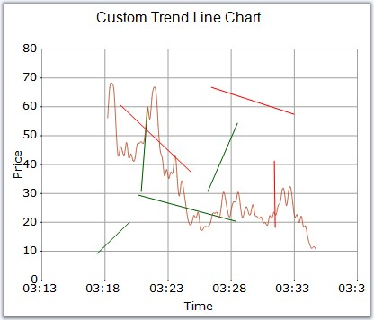

::: {style="DISPLAY: none"}
{#d2h_url_template}{#d2h_package_url style="WIDTH: 0px; DISPLAY: none; HEIGHT: 0px"}
:::

::::: {#nsbanner .d2h_main_nsbanner style="BORDER-BOTTOM: #999999 1px solid; POSITION: relative; PADDING-BOTTOM: 0px; BACKGROUND-COLOR: transparent; PADDING-LEFT: 0px; PADDING-RIGHT: 0px; DISPLAY: none; BORDER-TOP: #999999 1px solid; PADDING-TOP: 0px; LEFT: 0px"}
:::: {#TitleRow .d2h_main_titlerow style="PADDING-BOTTOM: 4px; BACKGROUND-COLOR: transparent; PADDING-LEFT: 22px; WIDTH: 100%; PADDING-RIGHT: 10px; DISPLAY: none; PADDING-TOP: 4px"}
::: {#ienav .d2h_main_ienav style="DISPLAY: none"}
{#D2HPrevious .D2HPreviousEnabled}  {#D2HNext .D2HNextEnabled}
:::
::::
:::::

:::: {#nstext .d2h_main_nstext style="PADDING-BOTTOM: 10px; BACKGROUND-COLOR: transparent; PADDING-LEFT: 22px; PADDING-RIGHT: 10px; HEIGHT: 100%; OVERFLOW: auto; PADDING-TOP: 5px" hasuserbackground="true" valign="bottom"}
::: {#d2h_breadcrumbs .d2h_breadcrumbs}
[Essential Studio User Guide Documentation](ms-xhelp:///?Id=12457748-09e3-4d74-a240-8e049cedf030){.d2h_breadcrumbsNormal}[ \> ]{.d2h_breadcrumbsLinkSeparator}[User Interface Edition](ms-xhelp:///?Id=c29296b7-531c-413b-a0ec-488ca1f7f669){.d2h_breadcrumbsNormal}[ \> ]{.d2h_breadcrumbsLinkSeparator}[Essential Windows](ms-xhelp:///?Id=e60759d8-47a4-4570-9d7a-16a68d63f2ea){.d2h_breadcrumbsNormal}[ \> ]{.d2h_breadcrumbsLinkSeparator}[Essential Chart]{.d2h_breadcrumbsContentsOnly}[ \> ]{.d2h_breadcrumbsLinkSeparator}[Frequently Asked Questions](ms-xhelp:///?Id=ef47b647-7df5-4b78-871d-ce0ee88e8d72){.d2h_breadcrumbsNormal}
:::

## How to add custom TrendLine in Chart {#how-to-add-custom-trendline-in-chart style="tab-stops: 0pt"}

 

TrendLines are used to draw lines in the ChartArea. They can be added to the chart using the **TrendLineAdder** class.

 

TrendLines can also be drawn using the Mouse Events. In this case, you will have to make use of the **Utility** class to listen to mouse events and convert them into trendlines. You can draw any number of trendlines, and can set different colors to differentiate them.

 

+----------------------------------------------------------------------------------------------------------------------------------------------------------------------------------------------------------------------------------------------------------------------------------+
| **[\[C#\]]{style="FONT-FAMILY: 'Courier New'; COLOR: black"}**                                                                                                                                                                                                                   |
|                                                                                                                                                                                                                                                                                  |
| **[]{style="FONT-FAMILY: 'Courier New'; COLOR: black"}**                                                                                                                                                                                                                         |
|                                                                                                                                                                                                                                                                                  |
| [// Creating Custom Points]{style="FONT-FAMILY: 'Courier New'; COLOR: green"}                                                                                                                                                                                                    |
|                                                                                                                                                                                                                                                                                  |
| [ChartPoint]{style="FONT-FAMILY: 'Courier New'; COLOR: #2b91af"}[ ptStart = [this]{style="COLOR: blue"}.chart.ChartArea.GetValueByPoint(start);]{style="FONT-FAMILY: 'Courier New'"}                                                                                             |
|                                                                                                                                                                                                                                                                                  |
| [ChartPoint]{style="FONT-FAMILY: 'Courier New'; COLOR: #2b91af"}[ ptEnd = [this]{style="COLOR: blue"}.chart.ChartArea.GetValueByPoint(end);]{style="FONT-FAMILY: 'Courier New'"}                                                                                                 |
|                                                                                                                                                                                                                                                                                  |
| [ChartSeries]{style="FONT-FAMILY: 'Courier New'; COLOR: #2b91af"}[ tseries = [this]{style="COLOR: blue"}.chart.Model.NewSeries([\"TrendLine\"]{style="COLOR: #a31515"}, [ChartSeriesType]{style="COLOR: #2b91af"}.Line);]{style="FONT-FAMILY: 'Courier New'"}                    |
|                                                                                                                                                                                                                                                                                  |
| [tseries.Points.Add(ptStart);]{style="FONT-FAMILY: 'Courier New'"}                                                                                                                                                                                                               |
|                                                                                                                                                                                                                                                                                  |
| [tseries.Points.Add(ptEnd);]{style="FONT-FAMILY: 'Courier New'"}                                                                                                                                                                                                                 |
|                                                                                                                                                                                                                                                                                  |
| [this]{style="FONT-FAMILY: 'Courier New'; COLOR: blue"}[.chart.Series.Add(tseries);]{style="FONT-FAMILY: 'Courier New'"}                                                                                                                                                         |
|                                                                                                                                                                                                                                                                                  |
| [tseries.LegendItem.Visible = [false]{style="COLOR: blue"};]{style="FONT-FAMILY: 'Courier New'"}                                                                                                                                                                                 |
|                                                                                                                                                                                                                                                                                  |
| []{style="FONT-FAMILY: 'Courier New'"}                                                                                                                                                                                                                                           |
|                                                                                                                                                                                                                                                                                  |
| [// Specify the color for the lines.]{style="FONT-FAMILY: 'Courier New'; COLOR: green"}                                                                                                                                                                                          |
|                                                                                                                                                                                                                                                                                  |
| [tseries.Style.Interior = [new]{style="COLOR: blue"} Syncfusion.Drawing.[BrushInfo]{style="COLOR: #2b91af"}(ptStart.YValues\[0\] \< ptEnd.YValues\[0\] ? [Color]{style="COLOR: #2b91af"}.DarkGreen : [Color]{style="COLOR: #2b91af"}.Red); ]{style="FONT-FAMILY: 'Courier New'"} |
+----------------------------------------------------------------------------------------------------------------------------------------------------------------------------------------------------------------------------------------------------------------------------------+

 

+-------------------------------------------------------------------------------------------------------------------------------------------------------------------------------------------------------------------------------------------------------------+
| **[\[VB.NET\]]{style="FONT-FAMILY: 'Courier New'; COLOR: black"}**                                                                                                                                                                                          |
|                                                                                                                                                                                                                                                             |
| **[]{style="FONT-FAMILY: 'Courier New'; COLOR: black"}**                                                                                                                                                                                                    |
|                                                                                                                                                                                                                                                             |
| [\' Creating Custom Points]{style="FONT-FAMILY: 'Courier New'; COLOR: green"}                                                                                                                                                                               |
|                                                                                                                                                                                                                                                             |
| [Dim]{style="FONT-FAMILY: 'Courier New'; COLOR: blue"}[ tlineAdder [As]{style="COLOR: blue"} TrendLineAdder]{style="FONT-FAMILY: 'Courier New'"}                                                                                                            |
|                                                                                                                                                                                                                                                             |
| [Dim]{style="FONT-FAMILY: 'Courier New'; COLOR: blue"}[ ptStart [As]{style="COLOR: blue"} ChartPoint = [Me]{style="COLOR: blue"}.chart.ChartArea.GetValueByPoint(start)]{style="FONT-FAMILY: 'Courier New'"}                                                |
|                                                                                                                                                                                                                                                             |
| [Dim]{style="FONT-FAMILY: 'Courier New'; COLOR: blue"}[ ptEnd [As]{style="COLOR: blue"} ChartPoint = [Me]{style="COLOR: blue"}.chart.ChartArea.GetValueByPoint(end_Renamed)]{style="FONT-FAMILY: 'Courier New'"}                                            |
|                                                                                                                                                                                                                                                             |
| [Dim]{style="FONT-FAMILY: 'Courier New'; COLOR: blue"}[ tseries [As]{style="COLOR: blue"} ChartSeries = [Me]{style="COLOR: blue"}.chart.Model.NewSeries([\"TrendLine\"]{style="COLOR: #a31515"}, ChartSeriesType.Line)]{style="FONT-FAMILY: 'Courier New'"} |
|                                                                                                                                                                                                                                                             |
| [tseries.Points.Add(ptStart)]{style="FONT-FAMILY: 'Courier New'"}                                                                                                                                                                                           |
|                                                                                                                                                                                                                                                             |
| [tseries.Points.Add(ptEnd)]{style="FONT-FAMILY: 'Courier New'"}                                                                                                                                                                                             |
|                                                                                                                                                                                                                                                             |
| [Me]{style="FONT-FAMILY: 'Courier New'; COLOR: blue"}[.chart.Series.Add(tseries)]{style="FONT-FAMILY: 'Courier New'"}                                                                                                                                       |
|                                                                                                                                                                                                                                                             |
| [tseries.LegendItem.Visible = [False]{style="COLOR: blue"}]{style="FONT-FAMILY: 'Courier New'"}                                                                                                                                                             |
|                                                                                                                                                                                                                                                             |
| []{style="FONT-FAMILY: 'Courier New'; COLOR: blue"}                                                                                                                                                                                                         |
|                                                                                                                                                                                                                                                             |
| [\' Specify the color for the lines.]{style="FONT-FAMILY: 'Courier New'; COLOR: green"}                                                                                                                                                                     |
|                                                                                                                                                                                                                                                             |
| [If]{style="FONT-FAMILY: 'Courier New'; COLOR: blue"}[ ptStart.YValues(0) \< ptEnd.YValues(0) [Then]{style="COLOR: blue"}]{style="FONT-FAMILY: 'Courier New'"}                                                                                              |
|                                                                                                                                                                                                                                                             |
| [tseries.Style.Interior = [New]{style="COLOR: blue"} Syncfusion.Drawing.BrushInfo(Color.DarkGreen)]{style="FONT-FAMILY: 'Courier New'"}                                                                                                                     |
|                                                                                                                                                                                                                                                             |
| [Else]{style="FONT-FAMILY: 'Courier New'; COLOR: blue"}                                                                                                                                                                                                     |
|                                                                                                                                                                                                                                                             |
| [tseries.Style.Interior = [New]{style="COLOR: blue"} Syncfusion.Drawing.BrushInfo(Color.Red)]{style="FONT-FAMILY: 'Courier New'"}                                                                                                                           |
|                                                                                                                                                                                                                                                             |
| [End]{style="FONT-FAMILY: 'Courier New'; COLOR: blue"}[ [If]{style="COLOR: blue"}]{style="FONT-FAMILY: 'Courier New'"}                                                                                                                                      |
+-------------------------------------------------------------------------------------------------------------------------------------------------------------------------------------------------------------------------------------------------------------+

 

{border="0"}

 

Figure 369: Custom TrendLines added to Chart

 

[]{#p279} 

[]{#related-topics}
::::
