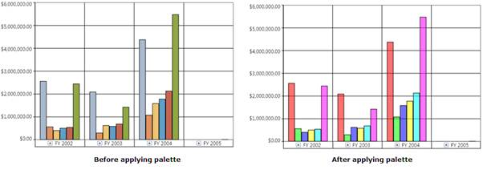

::: {style="DISPLAY: none"}
{#d2h_url_template}{#d2h_package_url style="WIDTH: 0px; DISPLAY: none; HEIGHT: 0px"}
:::

::: {.d2h_secondary_topic style="PADDING-BOTTOM: 10pt; MARGIN: 0pt; PADDING-LEFT: 0pt; PADDING-RIGHT: 0pt; PADDING-TOP: 0pt"}
##### How to apply a built-in chart palette to an OlapChart? {#how-to-apply-a-built-in-chart-palette-to-an-olapchart style="tab-stops: 0pt"}

[]{style="FONT-FAMILY: 'Calibri','sans-serif'; FONT-SIZE: 11pt"} 

The palettes are pre-defined styles, which can be applied to the Series of an OlapChart.

The following code snippet shows how to apply a palette to an OlapChart:

[]{style="FONT-FAMILY: 'Calibri','sans-serif'; FONT-SIZE: 11pt"} 

+-----------------------------------------------------------------------------------------------------------------------------------------------------------------------------------------------------------------------------------------------------------------------------------------------------------------------+
| **\[C#\]**                                                                                                                                                                                                                                                                                                            |
|                                                                                                                                                                                                                                                                                                                       |
|                                                                                                                                                                                                                                                                                                                       |
|                                                                                                                                                                                                                                                                                                                       |
| [this]{style="COLOR: blue"}.olapchart1.ColorModel.Palette = (Syncfusion.Windows.Chart.[ChartColorPalette]{style="COLOR: #2b91af"})[Enum]{style="COLOR: #2b91af"}.Parse([typeof]{style="COLOR: blue"}(Syncfusion.Windows.Chart.[ChartColorPalette]{style="COLOR: #2b91af"}), [\"EarthTone\"]{style="COLOR: #a31515"}); |
|                                                                                                                                                                                                                                                                                                                       |
|                                                                                                                                                                                                                                                                                                                       |
+-----------------------------------------------------------------------------------------------------------------------------------------------------------------------------------------------------------------------------------------------------------------------------------------------------------------------+

[]{style="FONT-FAMILY: 'Calibri','sans-serif'; FONT-SIZE: 11pt"} 

+----------------------------------------------------------------------------------------------------------------------------------------------------------------------------------------------------------------------------------------------------------------------------------------------------------------------------------------------------------+
| **\[VB\]**                                                                                                                                                                                                                                                                                                                                               |
|                                                                                                                                                                                                                                                                                                                                                          |
|                                                                                                                                                                                                                                                                                                                                                          |
|                                                                                                                                                                                                                                                                                                                                                          |
| [Me]{style="COLOR: blue"}.olapchart1.ColorModel.Palette = [CType]{style="COLOR: blue"}(System.[Enum]{style="COLOR: #2b91af"}.Parse([GetType]{style="COLOR: blue"}(Syncfusion.Windows.Chart.[ChartColorPalette]{style="COLOR: #2b91af"}), [\"EarthTone\"]{style="COLOR: #a31515"}), Syncfusion.Windows.Chart.[ChartColorPalette]{style="COLOR: #2b91af"}) |
|                                                                                                                                                                                                                                                                                                                                                          |
|                                                                                                                                                                                                                                                                                                                                                          |
+----------------------------------------------------------------------------------------------------------------------------------------------------------------------------------------------------------------------------------------------------------------------------------------------------------------------------------------------------------+

[]{style="FONT-FAMILY: 'Calibri','sans-serif'; FONT-SIZE: 11pt"} 

The following image shows before and after applying the EarthTone palette:

 

{border="0"}

Figure 59: ChartPalette application[]{style="FONT-FAMILY: 'Calibri','sans-serif'; FONT-SIZE: 11pt"}

[]{style="FONT-FAMILY: 'Calibri','sans-serif'; FONT-SIZE: 11pt"} 

[]{#related-topics}
:::
