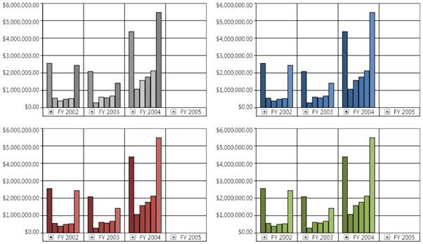
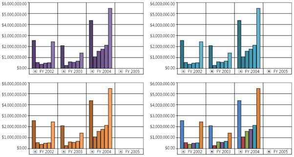

::: {style="DISPLAY: none"}
{#d2h_url_template}{#d2h_package_url style="WIDTH: 0px; DISPLAY: none; HEIGHT: 0px"}
:::

::: {.d2h_secondary_topic style="PADDING-BOTTOM: 10pt; MARGIN: 0pt; PADDING-LEFT: 0pt; PADDING-RIGHT: 0pt; PADDING-TOP: 0pt"}
##### How to apply excel like chart palette for an OlapChart control? {#how-to-apply-excel-like-chart-palette-for-an-olapchart-control style="tab-stops: 0pt"}

[]{style="FONT-FAMILY: 'Calibri','sans-serif'; FONT-SIZE: 11pt"} 

Excel like palettes are very useful in displaying the OlapChart in business applications.

The following type of excel like palettes are available:

 

{border="0"}

Figure 60: Excel Palette1, Palette2, Palette3, and Palette4

***[]{style="FONT-FAMILY: 'Calibri','sans-serif'; FONT-SIZE: 11pt"}*** 

[]{style="FONT-FAMILY: 'Calibri','sans-serif'; FONT-SIZE: 11pt"} 

{border="0"}

Figure 61: Excel Palette5, Palette6, Palette7, and Palette8[]{style="FONT-FAMILY: 'Calibri','sans-serif'; FONT-SIZE: 11pt"}

[]{style="FONT-FAMILY: 'Calibri','sans-serif'; FONT-SIZE: 11pt"} 

The following code snippets show how you can apply excel like palettes. It is similar to the topic *"How to apply a built-in chart palette to an OlapChart".*

 

Palette1:

***[[[]{style="TEXT-DECORATION: none"}]{style="FONT-FAMILY: 'Calibri','sans-serif'; FONT-SIZE: 11pt"}]{.underline}*** 

+----------------------------------------------------------------------------------------------------------------------------------------------------------------------------------------------------------------------------------------------------------------------------------------------------------------------+
| **\[C#\]**                                                                                                                                                                                                                                                                                                           |
|                                                                                                                                                                                                                                                                                                                      |
|                                                                                                                                                                                                                                                                                                                      |
|                                                                                                                                                                                                                                                                                                                      |
| [this]{style="COLOR: blue"}.olapchart1.ColorModel.Palette = (Syncfusion.Windows.Chart.[ChartColorPalette]{style="COLOR: #2b91af"})[Enum]{style="COLOR: #2b91af"}.Parse([typeof]{style="COLOR: blue"}(Syncfusion.Windows.Chart.[ChartColorPalette]{style="COLOR: #2b91af"}), [\"Palette1\"]{style="COLOR: #a31515"}); |
|                                                                                                                                                                                                                                                                                                                      |
|                                                                                                                                                                                                                                                                                                                      |
+----------------------------------------------------------------------------------------------------------------------------------------------------------------------------------------------------------------------------------------------------------------------------------------------------------------------+

[]{style="FONT-FAMILY: 'Calibri','sans-serif'; FONT-SIZE: 11pt"} 

+---------------------------------------------------------------------------------------------------------------------------------------------------------------------------------------------------------------------------------------------------------------------------------------------------------------------------------------------------------+
| **\[VB\]**                                                                                                                                                                                                                                                                                                                                              |
|                                                                                                                                                                                                                                                                                                                                                         |
|                                                                                                                                                                                                                                                                                                                                                         |
|                                                                                                                                                                                                                                                                                                                                                         |
| [Me]{style="COLOR: blue"}.olapchart1.ColorModel.Palette = [CType]{style="COLOR: blue"}(System.[Enum]{style="COLOR: #2b91af"}.Parse([GetType]{style="COLOR: blue"}(Syncfusion.Windows.Chart.[ChartColorPalette]{style="COLOR: #2b91af"}), [\"Palette1\"]{style="COLOR: #a31515"}), Syncfusion.Windows.Chart.[ChartColorPalette]{style="COLOR: #2b91af"}) |
|                                                                                                                                                                                                                                                                                                                                                         |
|                                                                                                                                                                                                                                                                                                                                                         |
+---------------------------------------------------------------------------------------------------------------------------------------------------------------------------------------------------------------------------------------------------------------------------------------------------------------------------------------------------------+

*[]{style="FONT-FAMILY: 'Calibri','sans-serif'; FONT-SIZE: 11pt"}* 

Palette2:

*[]{style="FONT-FAMILY: 'Calibri','sans-serif'; FONT-SIZE: 11pt"}* 

+----------------------------------------------------------------------------------------------------------------------------------------------------------------------------------------------------------------------------------------------------------------------------------------------------------------------+
| **\[C#\]**                                                                                                                                                                                                                                                                                                           |
|                                                                                                                                                                                                                                                                                                                      |
|                                                                                                                                                                                                                                                                                                                      |
|                                                                                                                                                                                                                                                                                                                      |
| [this]{style="COLOR: blue"}.olapchart1.ColorModel.Palette = (Syncfusion.Windows.Chart.[ChartColorPalette]{style="COLOR: #2b91af"})[Enum]{style="COLOR: #2b91af"}.Parse([typeof]{style="COLOR: blue"}(Syncfusion.Windows.Chart.[ChartColorPalette]{style="COLOR: #2b91af"}), [\"Palette2\"]{style="COLOR: #a31515"}); |
|                                                                                                                                                                                                                                                                                                                      |
|                                                                                                                                                                                                                                                                                                                      |
+----------------------------------------------------------------------------------------------------------------------------------------------------------------------------------------------------------------------------------------------------------------------------------------------------------------------+

[]{style="FONT-FAMILY: 'Calibri','sans-serif'; FONT-SIZE: 11pt"} 

+---------------------------------------------------------------------------------------------------------------------------------------------------------------------------------------------------------------------------------------------------------------------------------------------------------------------------------------------------------+
| **\[VB\]**                                                                                                                                                                                                                                                                                                                                              |
|                                                                                                                                                                                                                                                                                                                                                         |
|                                                                                                                                                                                                                                                                                                                                                         |
|                                                                                                                                                                                                                                                                                                                                                         |
| [Me]{style="COLOR: blue"}.olapchart1.ColorModel.Palette = [CType]{style="COLOR: blue"}(System.[Enum]{style="COLOR: #2b91af"}.Parse([GetType]{style="COLOR: blue"}(Syncfusion.Windows.Chart.[ChartColorPalette]{style="COLOR: #2b91af"}), [\"Palette2\"]{style="COLOR: #a31515"}), Syncfusion.Windows.Chart.[ChartColorPalette]{style="COLOR: #2b91af"}) |
|                                                                                                                                                                                                                                                                                                                                                         |
|                                                                                                                                                                                                                                                                                                                                                         |
+---------------------------------------------------------------------------------------------------------------------------------------------------------------------------------------------------------------------------------------------------------------------------------------------------------------------------------------------------------+

*[]{style="FONT-FAMILY: 'Calibri','sans-serif'; FONT-SIZE: 11pt"}* 

Palette3:

*[]{style="FONT-FAMILY: 'Calibri','sans-serif'; FONT-SIZE: 11pt"}* 

+----------------------------------------------------------------------------------------------------------------------------------------------------------------------------------------------------------------------------------------------------------------------------------------------------------------------+
| **\[C#\]**                                                                                                                                                                                                                                                                                                           |
|                                                                                                                                                                                                                                                                                                                      |
|                                                                                                                                                                                                                                                                                                                      |
|                                                                                                                                                                                                                                                                                                                      |
| [this]{style="COLOR: blue"}.olapchart1.ColorModel.Palette = (Syncfusion.Windows.Chart.[ChartColorPalette]{style="COLOR: #2b91af"})[Enum]{style="COLOR: #2b91af"}.Parse([typeof]{style="COLOR: blue"}(Syncfusion.Windows.Chart.[ChartColorPalette]{style="COLOR: #2b91af"}), [\"Palette3\"]{style="COLOR: #a31515"}); |
|                                                                                                                                                                                                                                                                                                                      |
|                                                                                                                                                                                                                                                                                                                      |
+----------------------------------------------------------------------------------------------------------------------------------------------------------------------------------------------------------------------------------------------------------------------------------------------------------------------+

[]{style="FONT-FAMILY: 'Calibri','sans-serif'; FONT-SIZE: 11pt"} 

+---------------------------------------------------------------------------------------------------------------------------------------------------------------------------------------------------------------------------------------------------------------------------------------------------------------------------------------------------------+
| **\[VB\]**                                                                                                                                                                                                                                                                                                                                              |
|                                                                                                                                                                                                                                                                                                                                                         |
|                                                                                                                                                                                                                                                                                                                                                         |
|                                                                                                                                                                                                                                                                                                                                                         |
| [Me]{style="COLOR: blue"}.olapchart1.ColorModel.Palette = [CType]{style="COLOR: blue"}(System.[Enum]{style="COLOR: #2b91af"}.Parse([GetType]{style="COLOR: blue"}(Syncfusion.Windows.Chart.[ChartColorPalette]{style="COLOR: #2b91af"}), [\"Palette3\"]{style="COLOR: #a31515"}), Syncfusion.Windows.Chart.[ChartColorPalette]{style="COLOR: #2b91af"}) |
|                                                                                                                                                                                                                                                                                                                                                         |
|                                                                                                                                                                                                                                                                                                                                                         |
+---------------------------------------------------------------------------------------------------------------------------------------------------------------------------------------------------------------------------------------------------------------------------------------------------------------------------------------------------------+

*[]{style="FONT-FAMILY: 'Calibri','sans-serif'; FONT-SIZE: 11pt"}* 

Palette4:

*[]{style="FONT-FAMILY: 'Calibri','sans-serif'; FONT-SIZE: 11pt"}* 

+----------------------------------------------------------------------------------------------------------------------------------------------------------------------------------------------------------------------------------------------------------------------------------------------------------------------+
| **\[C#\]**                                                                                                                                                                                                                                                                                                           |
|                                                                                                                                                                                                                                                                                                                      |
|                                                                                                                                                                                                                                                                                                                      |
|                                                                                                                                                                                                                                                                                                                      |
| [this]{style="COLOR: blue"}.olapchart1.ColorModel.Palette = (Syncfusion.Windows.Chart.[ChartColorPalette]{style="COLOR: #2b91af"})[Enum]{style="COLOR: #2b91af"}.Parse([typeof]{style="COLOR: blue"}(Syncfusion.Windows.Chart.[ChartColorPalette]{style="COLOR: #2b91af"}), [\"Palette4\"]{style="COLOR: #a31515"}); |
|                                                                                                                                                                                                                                                                                                                      |
|                                                                                                                                                                                                                                                                                                                      |
+----------------------------------------------------------------------------------------------------------------------------------------------------------------------------------------------------------------------------------------------------------------------------------------------------------------------+

[]{style="FONT-FAMILY: 'Calibri','sans-serif'; FONT-SIZE: 11pt"} 

+---------------------------------------------------------------------------------------------------------------------------------------------------------------------------------------------------------------------------------------------------------------------------------------------------------------------------------------------------------+
| **\[VB\]**                                                                                                                                                                                                                                                                                                                                              |
|                                                                                                                                                                                                                                                                                                                                                         |
|                                                                                                                                                                                                                                                                                                                                                         |
|                                                                                                                                                                                                                                                                                                                                                         |
| [Me]{style="COLOR: blue"}.olapchart1.ColorModel.Palette = [CType]{style="COLOR: blue"}(System.[Enum]{style="COLOR: #2b91af"}.Parse([GetType]{style="COLOR: blue"}(Syncfusion.Windows.Chart.[ChartColorPalette]{style="COLOR: #2b91af"}), [\"Palette4\"]{style="COLOR: #a31515"}), Syncfusion.Windows.Chart.[ChartColorPalette]{style="COLOR: #2b91af"}) |
|                                                                                                                                                                                                                                                                                                                                                         |
|                                                                                                                                                                                                                                                                                                                                                         |
+---------------------------------------------------------------------------------------------------------------------------------------------------------------------------------------------------------------------------------------------------------------------------------------------------------------------------------------------------------+

*[]{style="FONT-FAMILY: 'Calibri','sans-serif'; FONT-SIZE: 11pt"}* 

Palette5:

*[]{style="FONT-FAMILY: 'Calibri','sans-serif'; FONT-SIZE: 11pt"}* 

+----------------------------------------------------------------------------------------------------------------------------------------------------------------------------------------------------------------------------------------------------------------------------------------------------------------------+
| **\[C#\]**                                                                                                                                                                                                                                                                                                           |
|                                                                                                                                                                                                                                                                                                                      |
|                                                                                                                                                                                                                                                                                                                      |
|                                                                                                                                                                                                                                                                                                                      |
| [this]{style="COLOR: blue"}.olapchart1.ColorModel.Palette = (Syncfusion.Windows.Chart.[ChartColorPalette]{style="COLOR: #2b91af"})[Enum]{style="COLOR: #2b91af"}.Parse([typeof]{style="COLOR: blue"}(Syncfusion.Windows.Chart.[ChartColorPalette]{style="COLOR: #2b91af"}), [\"Palette5\"]{style="COLOR: #a31515"}); |
|                                                                                                                                                                                                                                                                                                                      |
|                                                                                                                                                                                                                                                                                                                      |
+----------------------------------------------------------------------------------------------------------------------------------------------------------------------------------------------------------------------------------------------------------------------------------------------------------------------+

[]{style="FONT-FAMILY: 'Calibri','sans-serif'; FONT-SIZE: 11pt"} 

+---------------------------------------------------------------------------------------------------------------------------------------------------------------------------------------------------------------------------------------------------------------------------------------------------------------------------------------------------------+
| **\[VB\]**                                                                                                                                                                                                                                                                                                                                              |
|                                                                                                                                                                                                                                                                                                                                                         |
|                                                                                                                                                                                                                                                                                                                                                         |
|                                                                                                                                                                                                                                                                                                                                                         |
| [Me]{style="COLOR: blue"}.olapchart1.ColorModel.Palette = [CType]{style="COLOR: blue"}(System.[Enum]{style="COLOR: #2b91af"}.Parse([GetType]{style="COLOR: blue"}(Syncfusion.Windows.Chart.[ChartColorPalette]{style="COLOR: #2b91af"}), [\"Palette5\"]{style="COLOR: #a31515"}), Syncfusion.Windows.Chart.[ChartColorPalette]{style="COLOR: #2b91af"}) |
|                                                                                                                                                                                                                                                                                                                                                         |
|                                                                                                                                                                                                                                                                                                                                                         |
+---------------------------------------------------------------------------------------------------------------------------------------------------------------------------------------------------------------------------------------------------------------------------------------------------------------------------------------------------------+

*[]{style="FONT-FAMILY: 'Calibri','sans-serif'; FONT-SIZE: 11pt"}* 

Palette6:

*[]{style="FONT-FAMILY: 'Calibri','sans-serif'; FONT-SIZE: 11pt"}* 

+----------------------------------------------------------------------------------------------------------------------------------------------------------------------------------------------------------------------------------------------------------------------------------------------------------------------+
| **\[C#\]**                                                                                                                                                                                                                                                                                                           |
|                                                                                                                                                                                                                                                                                                                      |
|                                                                                                                                                                                                                                                                                                                      |
|                                                                                                                                                                                                                                                                                                                      |
| [this]{style="COLOR: blue"}.olapchart1.ColorModel.Palette = (Syncfusion.Windows.Chart.[ChartColorPalette]{style="COLOR: #2b91af"})[Enum]{style="COLOR: #2b91af"}.Parse([typeof]{style="COLOR: blue"}(Syncfusion.Windows.Chart.[ChartColorPalette]{style="COLOR: #2b91af"}), [\"Palette6\"]{style="COLOR: #a31515"}); |
|                                                                                                                                                                                                                                                                                                                      |
|                                                                                                                                                                                                                                                                                                                      |
+----------------------------------------------------------------------------------------------------------------------------------------------------------------------------------------------------------------------------------------------------------------------------------------------------------------------+

[]{style="FONT-FAMILY: 'Calibri','sans-serif'; FONT-SIZE: 11pt"} 

+---------------------------------------------------------------------------------------------------------------------------------------------------------------------------------------------------------------------------------------------------------------------------------------------------------------------------------------------------------+
| **\[VB\]**                                                                                                                                                                                                                                                                                                                                              |
|                                                                                                                                                                                                                                                                                                                                                         |
|                                                                                                                                                                                                                                                                                                                                                         |
|                                                                                                                                                                                                                                                                                                                                                         |
| [Me]{style="COLOR: blue"}.olapchart1.ColorModel.Palette = [CType]{style="COLOR: blue"}(System.[Enum]{style="COLOR: #2b91af"}.Parse([GetType]{style="COLOR: blue"}(Syncfusion.Windows.Chart.[ChartColorPalette]{style="COLOR: #2b91af"}), [\"Palette6\"]{style="COLOR: #a31515"}), Syncfusion.Windows.Chart.[ChartColorPalette]{style="COLOR: #2b91af"}) |
|                                                                                                                                                                                                                                                                                                                                                         |
|                                                                                                                                                                                                                                                                                                                                                         |
+---------------------------------------------------------------------------------------------------------------------------------------------------------------------------------------------------------------------------------------------------------------------------------------------------------------------------------------------------------+

*[]{style="FONT-FAMILY: 'Calibri','sans-serif'; FONT-SIZE: 11pt"}* 

Palette7:

*[]{style="FONT-FAMILY: 'Calibri','sans-serif'; FONT-SIZE: 11pt"}* 

+----------------------------------------------------------------------------------------------------------------------------------------------------------------------------------------------------------------------------------------------------------------------------------------------------------------------+
| **\[C#\]**                                                                                                                                                                                                                                                                                                           |
|                                                                                                                                                                                                                                                                                                                      |
|                                                                                                                                                                                                                                                                                                                      |
|                                                                                                                                                                                                                                                                                                                      |
| [this]{style="COLOR: blue"}.olapchart1.ColorModel.Palette = (Syncfusion.Windows.Chart.[ChartColorPalette]{style="COLOR: #2b91af"})[Enum]{style="COLOR: #2b91af"}.Parse([typeof]{style="COLOR: blue"}(Syncfusion.Windows.Chart.[ChartColorPalette]{style="COLOR: #2b91af"}), [\"Palette7\"]{style="COLOR: #a31515"}); |
|                                                                                                                                                                                                                                                                                                                      |
|                                                                                                                                                                                                                                                                                                                      |
+----------------------------------------------------------------------------------------------------------------------------------------------------------------------------------------------------------------------------------------------------------------------------------------------------------------------+

[]{style="FONT-FAMILY: 'Calibri','sans-serif'; FONT-SIZE: 11pt"} 

+---------------------------------------------------------------------------------------------------------------------------------------------------------------------------------------------------------------------------------------------------------------------------------------------------------------------------------------------------------+
| **\[VB\]**                                                                                                                                                                                                                                                                                                                                              |
|                                                                                                                                                                                                                                                                                                                                                         |
|                                                                                                                                                                                                                                                                                                                                                         |
|                                                                                                                                                                                                                                                                                                                                                         |
| [Me]{style="COLOR: blue"}.olapchart1.ColorModel.Palette = [CType]{style="COLOR: blue"}(System.[Enum]{style="COLOR: #2b91af"}.Parse([GetType]{style="COLOR: blue"}(Syncfusion.Windows.Chart.[ChartColorPalette]{style="COLOR: #2b91af"}), [\"Palette7\"]{style="COLOR: #a31515"}), Syncfusion.Windows.Chart.[ChartColorPalette]{style="COLOR: #2b91af"}) |
|                                                                                                                                                                                                                                                                                                                                                         |
|                                                                                                                                                                                                                                                                                                                                                         |
+---------------------------------------------------------------------------------------------------------------------------------------------------------------------------------------------------------------------------------------------------------------------------------------------------------------------------------------------------------+

*[]{style="FONT-FAMILY: 'Calibri','sans-serif'; FONT-SIZE: 11pt"}* 

Palette8:

*[]{style="FONT-FAMILY: 'Calibri','sans-serif'; FONT-SIZE: 11pt"}* 

+----------------------------------------------------------------------------------------------------------------------------------------------------------------------------------------------------------------------------------------------------------------------------------------------------------------------+
| **\[C#\]**                                                                                                                                                                                                                                                                                                           |
|                                                                                                                                                                                                                                                                                                                      |
|                                                                                                                                                                                                                                                                                                                      |
|                                                                                                                                                                                                                                                                                                                      |
| [this]{style="COLOR: blue"}.olapchart1.ColorModel.Palette = (Syncfusion.Windows.Chart.[ChartColorPalette]{style="COLOR: #2b91af"})[Enum]{style="COLOR: #2b91af"}.Parse([typeof]{style="COLOR: blue"}(Syncfusion.Windows.Chart.[ChartColorPalette]{style="COLOR: #2b91af"}), [\"Palette8\"]{style="COLOR: #a31515"}); |
|                                                                                                                                                                                                                                                                                                                      |
|                                                                                                                                                                                                                                                                                                                      |
+----------------------------------------------------------------------------------------------------------------------------------------------------------------------------------------------------------------------------------------------------------------------------------------------------------------------+

[]{style="FONT-FAMILY: 'Calibri','sans-serif'; FONT-SIZE: 11pt"} 

+---------------------------------------------------------------------------------------------------------------------------------------------------------------------------------------------------------------------------------------------------------------------------------------------------------------------------------------------------------+
| **\[VB\]**                                                                                                                                                                                                                                                                                                                                              |
|                                                                                                                                                                                                                                                                                                                                                         |
|                                                                                                                                                                                                                                                                                                                                                         |
|                                                                                                                                                                                                                                                                                                                                                         |
| [Me]{style="COLOR: blue"}.olapchart1.ColorModel.Palette = [CType]{style="COLOR: blue"}(System.[Enum]{style="COLOR: #2b91af"}.Parse([GetType]{style="COLOR: blue"}(Syncfusion.Windows.Chart.[ChartColorPalette]{style="COLOR: #2b91af"}), [\"Palette8\"]{style="COLOR: #a31515"}), Syncfusion.Windows.Chart.[ChartColorPalette]{style="COLOR: #2b91af"}) |
|                                                                                                                                                                                                                                                                                                                                                         |
|                                                                                                                                                                                                                                                                                                                                                         |
+---------------------------------------------------------------------------------------------------------------------------------------------------------------------------------------------------------------------------------------------------------------------------------------------------------------------------------------------------------+

[]{style="FONT-FAMILY: 'Calibri','sans-serif'; FONT-SIZE: 11pt"} 

[]{#related-topics}
:::
