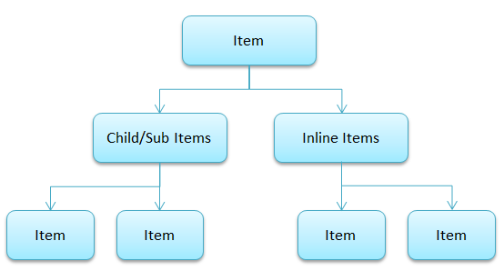
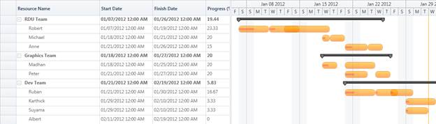

::: {style="DISPLAY: none"}
{#d2h_url_template}{#d2h_package_url style="WIDTH: 0px; DISPLAY: none; HEIGHT: 0px"}
:::

::::: {#nsbanner .d2h_main_nsbanner style="BORDER-BOTTOM: #999999 1px solid; POSITION: relative; PADDING-BOTTOM: 0px; BACKGROUND-COLOR: transparent; PADDING-LEFT: 0px; PADDING-RIGHT: 0px; DISPLAY: none; BORDER-TOP: #999999 1px solid; PADDING-TOP: 0px; LEFT: 0px"}
:::: {#TitleRow .d2h_main_titlerow style="PADDING-BOTTOM: 4px; BACKGROUND-COLOR: transparent; PADDING-LEFT: 22px; WIDTH: 100%; PADDING-RIGHT: 10px; DISPLAY: none; PADDING-TOP: 4px"}
::: {#ienav .d2h_main_ienav style="DISPLAY: none"}
{#D2HPrevious .D2HPreviousEnabled}  {#D2HNext .D2HNextEnabled}
:::
::::
:::::

:::: {#nstext .d2h_main_nstext style="PADDING-BOTTOM: 10px; BACKGROUND-COLOR: transparent; PADDING-LEFT: 22px; PADDING-RIGHT: 10px; HEIGHT: 100%; OVERFLOW: auto; PADDING-TOP: 5px" hasuserbackground="true" valign="bottom"}
::: {#d2h_breadcrumbs .d2h_breadcrumbs}
[Essential Studio User Guide Documentation](ms-xhelp:///?Id=12457748-09e3-4d74-a240-8e049cedf030){.d2h_breadcrumbsNormal}[ \> ]{.d2h_breadcrumbsLinkSeparator}[User Interface Edition](ms-xhelp:///?Id=c29296b7-531c-413b-a0ec-488ca1f7f669){.d2h_breadcrumbsNormal}[ \> ]{.d2h_breadcrumbsLinkSeparator}[Essential WPF](ms-xhelp:///?Id=7f4f82c5-151c-4262-94d0-75c4626c77bc){.d2h_breadcrumbsNormal}[ \> ]{.d2h_breadcrumbsLinkSeparator}[Essential Gantt]{.d2h_breadcrumbsContentsOnly}[ \> ]{.d2h_breadcrumbsLinkSeparator}[How To?](ms-xhelp:///?Id=e555ed49-ba41-4fdc-85f3-afb3a5b1bca8){.d2h_breadcrumbsNormal}
:::

## How to Build a Resource View Gantt? {#how-to-build-a-resource-view-gantt style="TEXT-ALIGN: justify; tab-stops: 0pt"}

By default the Gantt will display single node in a row. This helps you to manage the project. When you want to manage the resources in a project, you need multiple nodes in a single row. Resource View Gantt enables you to manage the resources involved in the project.  

In normal Gantt, the node represents the task or activity of the project. In Resource View Gantt, the node represents Tasks assigned to a resource. Multiple tasks assigned to a resource can be displayed in a single row.  You can achieve this using the new mapping attribute of the *InLineTaskMapping*.

You can develop a populate Resource View Gantt by populating the collection of tasks in a single row by mapping the corresponding field in the underlying source to the *InLineTaskMapping*.

The following code illustrates this:

 

+--------------------------------------------------------------------------------------------------------------------------------------------------------------------------------------------------------------------------------------------------------------------------------------------------------------------------------------------------------------------------------------------------------------------------------------------------------------------------------------------------------------------------------------------------------------------------------------------------------------------------------------------------+
| **[\[XAML\]]{style="FONT-FAMILY: 'Courier New'"}**                                                                                                                                                                                                                                                                                                                                                                                                                                                                                                                                                                                               |
|                                                                                                                                                                                                                                                                                                                                                                                                                                                                                                                                                                                                                                                  |
| []{style="FONT-FAMILY: 'Courier New'"}                                                                                                                                                                                                                                                                                                                                                                                                                                                                                                                                                                                                           |
|                                                                                                                                                                                                                                                                                                                                                                                                                                                                                                                                                                                                                                                  |
| [ ]{style="FONT-FAMILY: 'Courier New'; COLOR: #a31515"}[\<]{style="FONT-FAMILY: 'Courier New'; COLOR: blue"}[gantt]{style="FONT-FAMILY: 'Courier New'; COLOR: #a31515"}[:]{style="FONT-FAMILY: 'Courier New'; COLOR: blue"}[GanttControl]{style="FONT-FAMILY: 'Courier New'; COLOR: #a31515"}[ Grid.Row]{style="FONT-FAMILY: 'Courier New'; COLOR: red"}[=\"1\"]{style="FONT-FAMILY: 'Courier New'; COLOR: blue"}[ x]{style="FONT-FAMILY: 'Courier New'; COLOR: red"}[:]{style="FONT-FAMILY: 'Courier New'; COLOR: blue"}[Name]{style="FONT-FAMILY: 'Courier New'; COLOR: red"}[=\"Gantt\"\>]{style="FONT-FAMILY: 'Courier New'; COLOR: blue"}[\ |
| [                ]{style="COLOR: #a31515"}[\<]{style="COLOR: blue"}[gantt]{style="COLOR: #a31515"}[:]{style="COLOR: blue"}[GanttControl.TaskAttributeMapping]{style="COLOR: #a31515"}[\>]{style="COLOR: blue"}\                                                                                                                                                                                                                                                                                                                                                                                                                                  |
| [                    ]{style="COLOR: #a31515"}[\<]{style="COLOR: blue"}[gantt]{style="COLOR: #a31515"}[:]{style="COLOR: blue"}[TaskAttributeMapping]{style="COLOR: #a31515"} \                                                                                                                                                                                                                                                                                                                                                                                                                                                                   |
|                                            [ TaskNameMapping]{style="COLOR: red"}[=\"Name\"]{style="COLOR: blue"}\                                                                                                                                                                                                                                                                                                                                                                                                                                                                                                                               |
|                                            [ StartDateMapping]{style="COLOR: red"}[=\"StartDate\"]{style="COLOR: blue"} \                                                                                                                                                                                                                                                                                                                                                                                                                                                                                                                        |
|                                            [ ChildMapping]{style="COLOR: red"}[=\"SubItems\"]{style="COLOR: blue"}\                                                                                                                                                                                                                                                                                                                                                                                                                                                                                                                              |
|                                            [ FinishDateMapping]{style="COLOR: red"}[=\"FinishDate\"]{style="COLOR: blue"}\                                                                                                                                                                                                                                                                                                                                                                                                                                                                                                                       |
|                                            [ InLineTaskMapping]{style="COLOR: red"}[=\"InLineItems\"\>]{style="COLOR: blue"}\                                                                                                                                                                                                                                                                                                                                                                                                                                                                                                                    |
| [                    ]{style="COLOR: #a31515"}[\</]{style="COLOR: blue"}[gantt]{style="COLOR: #a31515"}[:]{style="COLOR: blue"}[TaskAttributeMapping]{style="COLOR: #a31515"}[\>]{style="COLOR: blue"}\                                                                                                                                                                                                                                                                                                                                                                                                                                          |
| [                ]{style="COLOR: #a31515"}[\</]{style="COLOR: blue"}[gantt]{style="COLOR: #a31515"}[:]{style="COLOR: blue"}[GanttControl.TaskAttributeMapping]{style="COLOR: #a31515"}[\>]{style="COLOR: blue"}\                                                                                                                                                                                                                                                                                                                                                                                                                                 |
| [            ]{style="COLOR: #a31515"}[\</]{style="COLOR: blue"}[gantt]{style="COLOR: #a31515"}[:]{style="COLOR: blue"}[GanttControl]{style="COLOR: #a31515"}[\>]{style="COLOR: blue"}]{style="FONT-FAMILY: 'Courier New'"}                                                                                                                                                                                                                                                                                                                                                                                                                      |
|                                                                                                                                                                                                                                                                                                                                                                                                                                                                                                                                                                                                                                                  |
| []{style="FONT-FAMILY: 'Courier New'"}                                                                                                                                                                                                                                                                                                                                                                                                                                                                                                                                                                                                           |
|                                                                                                                                                                                                                                                                                                                                                                                                                                                                                                                                                                                                                                                  |
| []{style="FONT-FAMILY: 'Courier New'"}                                                                                                                                                                                                                                                                                                                                                                                                                                                                                                                                                                                                           |
+--------------------------------------------------------------------------------------------------------------------------------------------------------------------------------------------------------------------------------------------------------------------------------------------------------------------------------------------------------------------------------------------------------------------------------------------------------------------------------------------------------------------------------------------------------------------------------------------------------------------------------------------------+

 

The following is the sample data source for the Resource View Gantt**:**

+-------------------------------------------------------------------------------------------------------------------------------------------------------------------------------------------------------------------------------------------------------------------------------------------------------------------------------------------------------------------------+
| **[\[C#\]]{style="FONT-FAMILY: 'Courier New'"}**                                                                                                                                                                                                                                                                                                                        |
|                                                                                                                                                                                                                                                                                                                                                                         |
| []{style="FONT-FAMILY: 'Courier New'"}                                                                                                                                                                                                                                                                                                                                  |
|                                                                                                                                                                                                                                                                                                                                                                         |
| [ ]{style="FONT-FAMILY: 'Courier New'; COLOR: #a31515"}[ObservableCollection]{style="FONT-FAMILY: 'Courier New'; COLOR: #2b91af"}[\<[Item]{style="COLOR: #2b91af"}\> teams = [new]{style="COLOR: blue"} [ObservableCollection]{style="COLOR: #2b91af"}\<[Item]{style="COLOR: #2b91af"}\>();\                                                                            |
|  \                                                                                                                                                                                                                                                                                                                                                                      |
|             teams.Add([new]{style="COLOR: blue"} [Item]{style="COLOR: #2b91af"}() { Name = [\"RDU Team\"]{style="COLOR: #a31515"} });\                                                                                                                                                                                                                                  |
|             [Item]{style="COLOR: #2b91af"} Person = [new]{style="COLOR: blue"} [Item]{style="COLOR: #2b91af"}() { Name = [\"Robert\"]{style="COLOR: #a31515"} };\                                                                                                                                                                                                       |
|             Person.InLineItems.Add([new]{style="COLOR: blue"} [Item]{style="COLOR: #2b91af"}() { StartDate = [new]{style="COLOR: blue"} [DateTime]{style="COLOR: #2b91af"}(2012, 01, 07), FinishDate = [new]{style="COLOR: blue"} [DateTime]{style="COLOR: #2b91af"}(2012, 01, 11), Name = [\"Market Analysis\"]{style="COLOR: #a31515"}, Progress = 50d });\           |
|             Person.InLineItems.Add([new]{style="COLOR: blue"} [Item]{style="COLOR: #2b91af"}() { StartDate = [new]{style="COLOR: blue"} [DateTime]{style="COLOR: #2b91af"}(2012, 01, 11), FinishDate = [new]{style="COLOR: blue"} [DateTime]{style="COLOR: #2b91af"}(2012, 01, 15), Name = [\"Competitor Analysis\"]{style="COLOR: #a31515"}, Progress = 20d });\       |
|             Person.InLineItems.Add([new]{style="COLOR: blue"} [Item]{style="COLOR: #2b91af"}() { StartDate = [new]{style="COLOR: blue"} [DateTime]{style="COLOR: #2b91af"}(2012, 01, 13), FinishDate = [new]{style="COLOR: blue"} [DateTime]{style="COLOR: #2b91af"}(2012, 01, 19), Name = [\"Desing Spec\"]{style="COLOR: #a31515"} });\                               |
|             teams\[0\].SubItems.Add(Person);\                                                                                                                                                                                                                                                                                                                           |
|  \                                                                                                                                                                                                                                                                                                                                                                      |
|             Person = [new]{style="COLOR: blue"} [Item]{style="COLOR: #2b91af"}() { Name = [\"Michael\"]{style="COLOR: #a31515"} };\                                                                                                                                                                                                                                     |
|             Person.InLineItems.Add([new]{style="COLOR: blue"} [Item]{style="COLOR: #2b91af"}() { StartDate = [new]{style="COLOR: blue"} [DateTime]{style="COLOR: #2b91af"}(2012, 01, 18), FinishDate = [new]{style="COLOR: blue"} [DateTime]{style="COLOR: #2b91af"}(2012, 01, 19), Name = [\"Basic Requirement Analysis\"]{style="COLOR: #a31515"}, Progress = 40 });\ |
|             Person.InLineItems.Add([new]{style="COLOR: blue"} [Item]{style="COLOR: #2b91af"}() { StartDate = [new]{style="COLOR: blue"} [DateTime]{style="COLOR: #2b91af"}(2012, 01, 19), FinishDate = [new]{style="COLOR: blue"} [DateTime]{style="COLOR: #2b91af"}(2012, 01, 21), Name = [\"Requirement Spec\"]{style="COLOR: #a31515"} });\                          |
|             teams\[0\].SubItems.Add(Person);\                                                                                                                                                                                                                                                                                                                           |
|  \                                                                                                                                                                                                                                                                                                                                                                      |
|             Person = [new]{style="COLOR: blue"} [Item]{style="COLOR: #2b91af"}() { Name = [\"Anne\"]{style="COLOR: #a31515"} };\                                                                                                                                                                                                                                        |
|             Person.InLineItems.Add([new]{style="COLOR: blue"} [Item]{style="COLOR: #2b91af"}() { StartDate = [new]{style="COLOR: blue"} [DateTime]{style="COLOR: #2b91af"}(2012, 01, 21), FinishDate = [new]{style="COLOR: blue"} [DateTime]{style="COLOR: #2b91af"}(2012, 01, 24), Name = [\"Estimation\"]{style="COLOR: #a31515"}, Progress = 30 });\                 |
|             Person.InLineItems.Add([new]{style="COLOR: blue"} [Item]{style="COLOR: #2b91af"}() { StartDate = [new]{style="COLOR: blue"} [DateTime]{style="COLOR: #2b91af"}(2012, 01, 24), FinishDate = [new]{style="COLOR: blue"} [DateTime]{style="COLOR: #2b91af"}(2012, 01, 26), Name = [\"Budget & Plan Spec\"]{style="COLOR: #a31515"} });\                        |
|             teams\[0\].SubItems.Add(Person);]{style="FONT-FAMILY: 'Courier New'"}                                                                                                                                                                                                                                                                                       |
|                                                                                                                                                                                                                                                                                                                                                                         |
| []{style="FONT-FAMILY: 'Courier New'"}                                                                                                                                                                                                                                                                                                                                  |
|                                                                                                                                                                                                                                                                                                                                                                         |
| []{style="FONT-FAMILY: 'Courier New'"}                                                                                                                                                                                                                                                                                                                                  |
+-------------------------------------------------------------------------------------------------------------------------------------------------------------------------------------------------------------------------------------------------------------------------------------------------------------------------------------------------------------------------+

 

The following is the Data Structure used to build a Resource View Gantt:

 

{border="0"}

 

 

 

Data Structure:

[·      ]{style="FONT-FAMILY: Symbol"}**Team** that hold info about the team.

[·      ]{style="FONT-FAMILY: Symbol"}SubItems of **Team** will hold the list of **Resources**   in that particular team.

[·      ]{style="FONT-FAMILY: Symbol"}InLineItems of each **Resource** will holds the tasks assigned to the particular resource.

 

Information Displayed in Gantt

**Grid Region:** Grid will display only the information about the team and its resources (Sub Items). It will not display the info about Assigned Tasks (InLineItems).

**Chart Region:** Chart will display only the information about the team and the tasks assigned to each resource in the team (InLineItems). It will not display the info about Resources (Sub Items)

 

 

{border="0"}

Figure 40: Information Displayed in Gantt

 

 

Samples Link

To view samples:

1.   Open **Syncfusion Dashboard**.

2.   Select **User Interface \> WPF**.

3.   Click **Run Samples**.

4.   Navigate to **Gantt \>** **Data Binding item \> Resource View Gantt sample**.

 

[]{#related-topics}
::::
