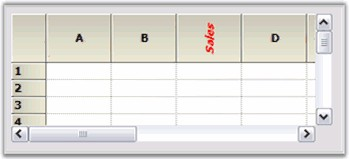

::: {style="DISPLAY: none"}
{#d2h_url_template}{#d2h_package_url style="WIDTH: 0px; DISPLAY: none; HEIGHT: 0px"}
:::

::::: {#nsbanner .d2h_main_nsbanner style="BORDER-BOTTOM: #999999 1px solid; POSITION: relative; PADDING-BOTTOM: 0px; BACKGROUND-COLOR: transparent; PADDING-LEFT: 0px; PADDING-RIGHT: 0px; DISPLAY: none; BORDER-TOP: #999999 1px solid; PADDING-TOP: 0px; LEFT: 0px"}
:::: {#TitleRow .d2h_main_titlerow style="PADDING-BOTTOM: 4px; BACKGROUND-COLOR: transparent; PADDING-LEFT: 22px; WIDTH: 100%; PADDING-RIGHT: 10px; DISPLAY: none; PADDING-TOP: 4px"}
::: {#ienav .d2h_main_ienav style="DISPLAY: none"}
{#D2HPrevious .D2HPreviousEnabled}  {#D2HNext .D2HNextEnabled}
:::
::::
:::::

:::: {#nstext .d2h_main_nstext style="PADDING-BOTTOM: 10px; BACKGROUND-COLOR: transparent; PADDING-LEFT: 22px; PADDING-RIGHT: 10px; HEIGHT: 100%; OVERFLOW: auto; PADDING-TOP: 5px" hasuserbackground="true" valign="bottom"}
::: {#d2h_breadcrumbs .d2h_breadcrumbs}
[Essential Studio User Guide Documentation](ms-xhelp:///?Id=12457748-09e3-4d74-a240-8e049cedf030){.d2h_breadcrumbsNormal}[ \> ]{.d2h_breadcrumbsLinkSeparator}[User Interface Edition](ms-xhelp:///?Id=c29296b7-531c-413b-a0ec-488ca1f7f669){.d2h_breadcrumbsNormal}[ \> ]{.d2h_breadcrumbsLinkSeparator}[Essential Windows](ms-xhelp:///?Id=e60759d8-47a4-4570-9d7a-16a68d63f2ea){.d2h_breadcrumbsNormal}[ \> ]{.d2h_breadcrumbsLinkSeparator}[Essential Grid]{.d2h_breadcrumbsContentsOnly}[ \> ]{.d2h_breadcrumbsLinkSeparator}[Frequently Asked Questions](ms-xhelp:///?Id=28ff22ed-2523-4bf9-8f6c-4d94f7bcabcc){.d2h_breadcrumbsNormal}[ \> ]{.d2h_breadcrumbsLinkSeparator}[GridControl](ms-xhelp:///?Id=89bf6d1f-a0f2-4d1f-add6-545cce1c52f0){.d2h_breadcrumbsNormal}
:::

### How to Change the Appearance of a Single Header Cell {#how-to-change-the-appearance-of-a-single-header-cell style="tab-stops: 0pt"}

[]{style="FONT-FAMILY: 'Trebuchet MS','sans-serif'; COLOR: #15428b; FONT-SIZE: 9pt"} 

Introduction

 

To make changes to individual cells (header cells or otherwise), use an indexer on the GridControl. In a GridControl with  the default headers, the column headers are row zero and the row headers are column zero. Given below is the code that will change a column header.

[]{style="FONT-FAMILY: 'Trebuchet MS','sans-serif'; COLOR: #15428b; FONT-SIZE: 9pt"} 

Example

[]{style="FONT-FAMILY: 'Trebuchet MS','sans-serif'; COLOR: #15428b; FONT-SIZE: 9pt"} 

+------------------------------------------------------------------------------------------------------------------------------------------------------------------------------------------------------+
| **[\[C#\]]{style="FONT-FAMILY: 'Courier New'; COLOR: black"}**                                                                                                                                       |
|                                                                                                                                                                                                      |
| []{style="COLOR: black"}                                                                                                                                                                             |
|                                                                                                                                                                                                      |
| [// Changing the font properties of the header cell.]{style="FONT-FAMILY: 'Courier New'; COLOR: green"}                                                                                              |
|                                                                                                                                                                                                      |
| [gridControl1\[0, 3\].Font.Italic = ]{style="FONT-FAMILY: 'Courier New'; COLOR: black"}[true]{style="FONT-FAMILY: 'Courier New'; COLOR: blue"}[; ]{style="FONT-FAMILY: 'Courier New'; COLOR: black"} |
|                                                                                                                                                                                                      |
| [gridControl1\[0, 3\].Font.Bold = ]{style="FONT-FAMILY: 'Courier New'; COLOR: black"}[true]{style="FONT-FAMILY: 'Courier New'; COLOR: blue"}[; ]{style="FONT-FAMILY: 'Courier New'; COLOR: black"}   |
|                                                                                                                                                                                                      |
| [gridControl1\[0, 3\].Font.Orientation = 270;]{style="FONT-FAMILY: 'Courier New'; COLOR: black"}                                                                                                     |
|                                                                                                                                                                                                      |
| []{style="FONT-FAMILY: 'Courier New'; COLOR: black"}                                                                                                                                                 |
|                                                                                                                                                                                                      |
| [// Changing the Text Color and Text of the header cell. ]{style="FONT-FAMILY: 'Courier New'; COLOR: green"}                                                                                         |
|                                                                                                                                                                                                      |
| [gridControl1\[0, 3\].TextColor = Color.Red; ]{style="FONT-FAMILY: 'Courier New'; COLOR: black"}                                                                                                     |
|                                                                                                                                                                                                      |
| [gridControl1\[0, 3\].Text = \"Sales\";]{style="FONT-FAMILY: 'Courier New'; COLOR: black"}                                                                                                           |
+------------------------------------------------------------------------------------------------------------------------------------------------------------------------------------------------------+

[]{style="FONT-FAMILY: 'Trebuchet MS','sans-serif'; COLOR: #15428b; FONT-SIZE: 9pt"} 

+----------------------------------------------------------------------------------------------------------------------------------------------+
| **[\[VB.NET\]]{style="FONT-FAMILY: 'Courier New'; COLOR: black"}**                                                                           |
|                                                                                                                                              |
| []{style="COLOR: black"}                                                                                                                     |
|                                                                                                                                              |
| [// Changing the font properties of the header cell.]{style="FONT-FAMILY: 'Courier New'; COLOR: green"}                                      |
|                                                                                                                                              |
| [GridControl1(0, 3).Font.Italic = ]{style="FONT-FAMILY: 'Courier New'; COLOR: black"}[True]{style="FONT-FAMILY: 'Courier New'; COLOR: blue"} |
|                                                                                                                                              |
| [GridControl1(0, 3).Font.Bold = ]{style="FONT-FAMILY: 'Courier New'; COLOR: black"}[True]{style="FONT-FAMILY: 'Courier New'; COLOR: blue"}   |
|                                                                                                                                              |
| [GridControl1(0, 3).Font.Orientation = 270]{style="FONT-FAMILY: 'Courier New'; COLOR: black"}                                                |
|                                                                                                                                              |
| []{style="FONT-FAMILY: 'Courier New'; COLOR: black"}                                                                                         |
|                                                                                                                                              |
| [// Changing the Text Color and Text of the header cell.]{style="FONT-FAMILY: 'Courier New'; COLOR: green"}                                  |
|                                                                                                                                              |
| [GridControl1(0, 3).TextColor = Color.Red]{style="FONT-FAMILY: 'Courier New'; COLOR: black"}                                                 |
|                                                                                                                                              |
| [GridControl1(0, 3).Text = \"Sales\"]{style="FONT-FAMILY: 'Courier New'; COLOR: black"}                                                      |
+----------------------------------------------------------------------------------------------------------------------------------------------+

[]{style="FONT-FAMILY: 'Trebuchet MS','sans-serif'; COLOR: #15428b; FONT-SIZE: 9pt"} 

{border="0"}

[]{style="FONT-FAMILY: 'Trebuchet MS','sans-serif'; COLOR: #15428b; FONT-SIZE: 9pt"} 

*[Figure ]{style="FONT-SIZE: 9pt"}[499]{style="FONT-SIZE: 9pt"}[: GridControl Showing Modified Header Cell]{style="FONT-SIZE: 9pt"}*

 

[]{#p548} 

 

[]{#related-topics}
::::
