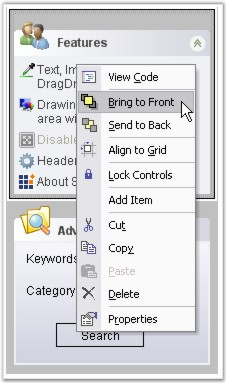

::: {style="DISPLAY: none"}
{#d2h_url_template}{#d2h_package_url style="WIDTH: 0px; DISPLAY: none; HEIGHT: 0px"}
:::

::: {.d2h_secondary_topic style="PADDING-BOTTOM: 10pt; MARGIN: 0pt; PADDING-LEFT: 0pt; PADDING-RIGHT: 0pt; PADDING-TOP: 0pt"}
##### How to change the order of the XPTaskBar Boxes in the designer after creating them {#how-to-change-the-order-of-the-xptaskbar-boxes-in-the-designer-after-creating-them style="MARGIN-LEFT: 18pt; tab-stops: 18.0pt"}

[]{style="COLOR: #15428b"} 

You can right-click on the XPTaskBar Box in the designer and select the \"**Bring To Front**\" or \"**Send To Back**\" verbs to reorder them. In code this will just change the order in which the XPTaskBar Boxes are added to the parent XPTaskBar, which in turn will affect the order in which they are shown.

 

You can also drag one box over the other to change the order during designtime.

[]{style="FONT-SIZE: 8pt"} 

{border="0"}

[        ]{style="COLOR: #15428b"}

Figure 952: Reordering TaskBarBoxes in the Designer

 

 

[]{#p695} 

 

[]{#related-topics}
:::
