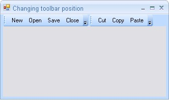
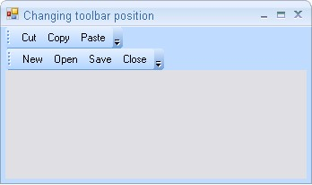

::: {style="DISPLAY: none"}
{#d2h_url_template}{#d2h_package_url style="WIDTH: 0px; DISPLAY: none; HEIGHT: 0px"}
:::

::: {.d2h_secondary_topic style="PADDING-BOTTOM: 10pt; MARGIN: 0pt; PADDING-LEFT: 0pt; PADDING-RIGHT: 0pt; PADDING-TOP: 0pt"}
##### How to change the position of toolbars at runtime? {#how-to-change-the-position-of-toolbars-at-runtime style="tab-stops: 0pt"}

[]{style="COLOR: #15428b"} 

We can change the position of toolbars at runtime using **RowIndex** and **RowOffset** properties of MainFrameBarManager as follows.

[]{style="COLOR: #15428b"} 

+----------------------------------------------------------------------------------------------------------------------------------------------------------------------------------+
| **[\[C#\]]{style="FONT-FAMILY: 'Courier New'; COLOR: black"}**                                                                                                                   |
|                                                                                                                                                                                  |
| **[]{style="FONT-FAMILY: 'Courier New'; COLOR: black"}**                                                                                                                         |
|                                                                                                                                                                                  |
| [this]{style="FONT-FAMILY: 'Courier New'; COLOR: blue"}[.mainFrameBarManager1.GetBarControl([this]{style="COLOR: blue"}.bar1).RowIndex = 1;]{style="FONT-FAMILY: 'Courier New'"} |
|                                                                                                                                                                                  |
| [this]{style="FONT-FAMILY: 'Courier New'; COLOR: blue"}[.mainFrameBarManager1.GetBarControl([this]{style="COLOR: blue"}.bar2).RowIndex = 0;]{style="FONT-FAMILY: 'Courier New'"} |
|                                                                                                                                                                                  |
| [        ]{style="FONT-FAMILY: 'Courier New'"}                                                                                                                                   |
|                                                                                                                                                                                  |
| [this]{style="FONT-FAMILY: 'Courier New'; COLOR: blue"}[.mainFrameBarManager1.GetBarControl(bar2).RowOffset = 0;]{style="FONT-FAMILY: 'Courier New'"}                            |
|                                                                                                                                                                                  |
| [this]{style="FONT-FAMILY: 'Courier New'; COLOR: blue"}[.mainFrameBarManager1.GetBarControl(bar1).RowOffset = 1;]{style="FONT-FAMILY: 'Courier New'"}                            |
|                                                                                                                                                                                  |
| [this]{style="FONT-FAMILY: 'Courier New'; COLOR: blue"}[.mainFrameBarManager1.GetCommandBarManager().RecalcLayout();]{style="FONT-FAMILY: 'Courier New'"}                        |
+----------------------------------------------------------------------------------------------------------------------------------------------------------------------------------+

[]{style="COLOR: #15428b"} 

+-----------------------------------------------------------------------------------------------------------------------------------------------------------------------------+
| **[\[VB.NET\]]{style="FONT-FAMILY: 'Courier New'; COLOR: black"}**                                                                                                          |
|                                                                                                                                                                             |
| **[]{style="FONT-FAMILY: 'Courier New'; COLOR: black"}**                                                                                                                    |
|                                                                                                                                                                             |
| [Me]{style="FONT-FAMILY: 'Courier New'; COLOR: blue"}[.mainFrameBarManager1.GetBarControl([Me]{style="COLOR: blue"}.bar1).RowIndex = 1]{style="FONT-FAMILY: 'Courier New'"} |
|                                                                                                                                                                             |
| [Me]{style="FONT-FAMILY: 'Courier New'; COLOR: blue"}[.mainFrameBarManager1.GetBarControl([Me]{style="COLOR: blue"}.bar2).RowIndex = 0]{style="FONT-FAMILY: 'Courier New'"} |
|                                                                                                                                                                             |
| []{style="FONT-FAMILY: 'Courier New'"}                                                                                                                                      |
|                                                                                                                                                                             |
| [Me]{style="FONT-FAMILY: 'Courier New'; COLOR: blue"}[.mainFrameBarManager1.GetBarControl(bar2).RowOffset = 0]{style="FONT-FAMILY: 'Courier New'"}                          |
|                                                                                                                                                                             |
| [Me]{style="FONT-FAMILY: 'Courier New'; COLOR: blue"}[.mainFrameBarManager1.GetBarControl(bar1).RowOffset = 0]{style="FONT-FAMILY: 'Courier New'"}                          |
|                                                                                                                                                                             |
| [Me]{style="FONT-FAMILY: 'Courier New'; COLOR: blue"}[.mainFrameBarManager1.GetCommandBarManager().RecalcLayout()]{style="FONT-FAMILY: 'Courier New'"}                      |
+-----------------------------------------------------------------------------------------------------------------------------------------------------------------------------+

**[]{style="COLOR: #15428b"}** 

{border="0"}

[]{style="COLOR: #15428b"} 

Figure 848: Toolbar placed in the First Row

**[]{style="COLOR: #15428b"}** 

The position of toolbar1 is moved to second row as follows.

[]{style="COLOR: #15428b"} 

{border="0"}

***[]{style="COLOR: #15428b"}*** 

Figure 849: Toolbar moved to the Second Row

[]{#related-topics}
:::
