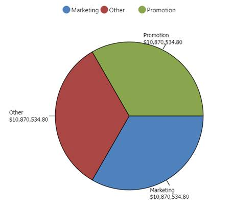

::: {style="DISPLAY: none"}
{#d2h_url_template}{#d2h_package_url style="WIDTH: 0px; DISPLAY: none; HEIGHT: 0px"}
:::

:::: {.d2h_secondary_topic style="PADDING-BOTTOM: 10pt; MARGIN: 0pt; PADDING-LEFT: 0pt; PADDING-RIGHT: 0pt; PADDING-TOP: 0pt"}
##### How to create a pie chart? {#how-to-create-a-pie-chart style="tab-stops: 0pt"}

[]{style="FONT-FAMILY: 'Calibri','sans-serif'; FONT-SIZE: 11pt"} 

Pie chart renders the data points in segments. It is capable of rendering only one series at a time. Usually, it is used for proportional analysis for a small set of data points.

The following illustration shows the Pie chart:

 

{border="0"}

Figure 58: Pie Chart[]{style="FONT-FAMILY: 'Calibri','sans-serif'; FONT-SIZE: 11pt"}

[]{style="FONT-FAMILY: 'Calibri','sans-serif'; FONT-SIZE: 11pt"} 

The following code snippet shows how to select a Pie chart:

[]{style="FONT-FAMILY: 'Calibri','sans-serif'; COLOR: black; FONT-SIZE: 11pt"} 

+--------------------------------------------------------------------------------------------------------------------------------------------------------------------------------------------------------------------------------------------------------------+
| **\[XAML\]**                                                                                                                                                                                                                                                 |
|                                                                                                                                                                                                                                                              |
|                                                                                                                                                                                                                                                              |
|                                                                                                                                                                                                                                                              |
| [\<]{style="COLOR: blue"}[syncfusion]{style="COLOR: #a31515"}[:]{style="COLOR: blue"}[OlapChart]{style="COLOR: #a31515"}[ Name]{style="COLOR: red"}[=\"olapchart1\"]{style="COLOR: blue"}[ ChartType]{style="COLOR: red"}[=\"Pie\" /\>]{style="COLOR: blue"} |
+--------------------------------------------------------------------------------------------------------------------------------------------------------------------------------------------------------------------------------------------------------------+

[]{style="FONT-FAMILY: 'Calibri','sans-serif'; FONT-SIZE: 11pt"} 

+-------------------------------------------------------------------------------------------------------------------+
| **\[C#\]**                                                                                                        |
|                                                                                                                   |
|                                                                                                                   |
|                                                                                                                   |
| [OlapChart]{style="COLOR: #2b91af"} olapChart = [new]{style="COLOR: blue"} [OlapChart]{style="COLOR: #2b91af"}(); |
|                                                                                                                   |
| olapChart.ChartType = [ChartTypes]{style="COLOR: #2b91af"}.Pie;                                                   |
|                                                                                                                   |
|                                                                                                                   |
+-------------------------------------------------------------------------------------------------------------------+

[]{style="FONT-FAMILY: 'Calibri','sans-serif'; FONT-SIZE: 11pt"} 

+-----------------------------------------------------------------------------------------------------------------------------------------------------------------------+
| **\[VB\]**                                                                                                                                                            |
|                                                                                                                                                                       |
|                                                                                                                                                                       |
|                                                                                                                                                                       |
| [Dim]{style="COLOR: blue"} olapChart [As]{style="COLOR: blue"} [OlapChart]{style="COLOR: #2b91af"} = [New]{style="COLOR: blue"} [OlapChart]{style="COLOR: #2b91af"}() |
|                                                                                                                                                                       |
| olapChart.ChartType = [ChartTypes]{style="COLOR: #2b91af"}.Pie                                                                                                        |
|                                                                                                                                                                       |
|                                                                                                                                                                       |
+-----------------------------------------------------------------------------------------------------------------------------------------------------------------------+

[]{style="FONT-FAMILY: 'Calibri','sans-serif'; FONT-SIZE: 11pt"} 

::: {style="BORDER-BOTTOM: windowtext 1pt solid; BORDER-LEFT: medium none; PADDING-BOTTOM: 1pt; MARGIN-TOP: 9pt; PADDING-LEFT: 0pt; PADDING-RIGHT: 0pt; MARGIN-BOTTOM: 9pt; BORDER-TOP: windowtext 1pt solid; BORDER-RIGHT: medium none; PADDING-TOP: 1pt"}
[{border="0"}]{style="FONT-FAMILY: 'Calibri','sans-serif'; COLOR: black; FONT-SIZE: 11pt"}Note: Pie chart should not be used for Comparison analysis of large data points, because it is harder for people to estimate angles rather than distance.
:::

 

A sample, which demonstrates the Pie chart, can be found in the following installation location:

**..\\Syncfusion\\\<Version Number\>\\BI\\WPF\\OlapChart.WPF\\Samples\\Chart Types\\Pie Chart Demo**

[]{style="FONT-FAMILY: 'Calibri','sans-serif'; FONT-SIZE: 11pt"} 

[]{#related-topics}
::::
