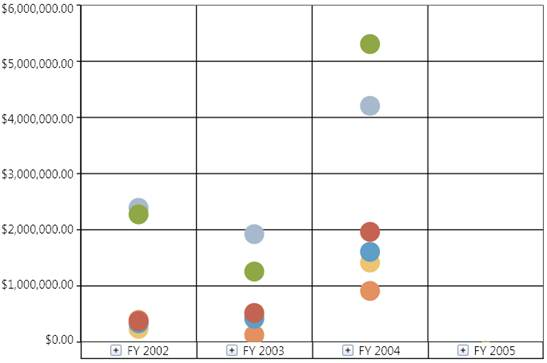

::: {style="DISPLAY: none"}
{#d2h_url_template}{#d2h_package_url style="WIDTH: 0px; DISPLAY: none; HEIGHT: 0px"}
:::

::: {.d2h_secondary_topic style="PADDING-BOTTOM: 10pt; MARGIN: 0pt; PADDING-LEFT: 0pt; PADDING-RIGHT: 0pt; PADDING-TOP: 0pt"}
##### How to create a scatter chart? {#how-to-create-a-scatter-chart style="tab-stops: 0pt"}

[]{style="FONT-FAMILY: 'Calibri','sans-serif'; FONT-SIZE: 11pt"} 

Scatter chart is a collection of points plotted in the rectangular co-ordinate system. It is often used in relationship analysis upto one independent variable.

The following illustration shows the Scatter chart:

 

{border="0"}

Figure 57: Scatter Chart[]{style="FONT-FAMILY: 'Calibri','sans-serif'; FONT-SIZE: 11pt"}

[]{style="FONT-FAMILY: 'Calibri','sans-serif'; FONT-SIZE: 11pt"} 

The following code snippet shows how to select a Scatter chart:

[]{style="FONT-FAMILY: 'Calibri','sans-serif'; COLOR: black; FONT-SIZE: 11pt"} 

+------------------------------------------------------------------------------------------------------------------------------------------------------------------------------------------------------------------------------------------------------------------+
| **\[XAML\]**                                                                                                                                                                                                                                                     |
|                                                                                                                                                                                                                                                                  |
|                                                                                                                                                                                                                                                                  |
|                                                                                                                                                                                                                                                                  |
| [\<]{style="COLOR: blue"}[syncfusion]{style="COLOR: #a31515"}[:]{style="COLOR: blue"}[OlapChart]{style="COLOR: #a31515"}[ Name]{style="COLOR: red"}[=\"olapchart1\"]{style="COLOR: blue"}[ ChartType]{style="COLOR: red"}[=\"Scatter\" /\>]{style="COLOR: blue"} |
+------------------------------------------------------------------------------------------------------------------------------------------------------------------------------------------------------------------------------------------------------------------+

[]{style="FONT-FAMILY: 'Calibri','sans-serif'; FONT-SIZE: 11pt"} 

+-------------------------------------------------------------------------------------------------------------------+
| **\[C#\]**                                                                                                        |
|                                                                                                                   |
|                                                                                                                   |
|                                                                                                                   |
| [OlapChart]{style="COLOR: #2b91af"} olapChart = [new]{style="COLOR: blue"} [OlapChart]{style="COLOR: #2b91af"}(); |
|                                                                                                                   |
| olapChart.ChartType = [ChartTypes]{style="COLOR: #2b91af"}.Scatter;                                               |
|                                                                                                                   |
|                                                                                                                   |
+-------------------------------------------------------------------------------------------------------------------+

[]{style="FONT-FAMILY: 'Calibri','sans-serif'; FONT-SIZE: 11pt"} 

+-----------------------------------------------------------------------------------------------------------------------------------------------------------------------+
| **\[VB\]**                                                                                                                                                            |
|                                                                                                                                                                       |
|                                                                                                                                                                       |
|                                                                                                                                                                       |
| [Dim]{style="COLOR: blue"} olapChart [As]{style="COLOR: blue"} [OlapChart]{style="COLOR: #2b91af"} = [New]{style="COLOR: blue"} [OlapChart]{style="COLOR: #2b91af"}() |
|                                                                                                                                                                       |
| olapChart.ChartType = [ChartTypes]{style="COLOR: #2b91af"}.Scatter                                                                                                    |
|                                                                                                                                                                       |
|                                                                                                                                                                       |
+-----------------------------------------------------------------------------------------------------------------------------------------------------------------------+

 

A sample, which demonstrates the Scatter chart, can be found in the following installation location:

**..\\Syncfusion\\\<Version Number\>\\BI\\WPF\\OlapChart.WPF\\Samples\\Chart Types\\Scatter Chart Demo**

 

[]{#related-topics}
:::
