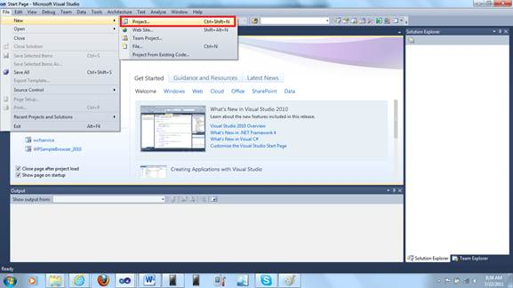
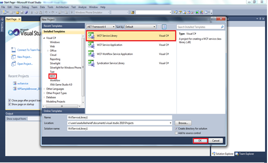
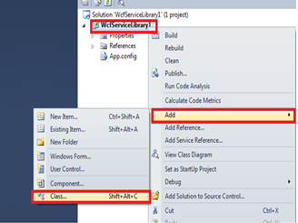
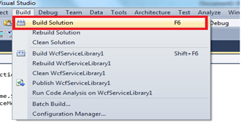
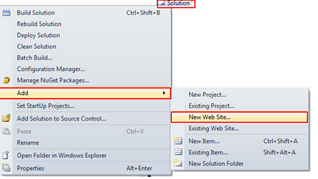
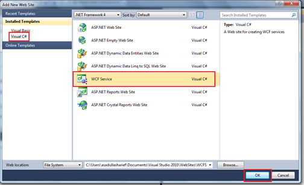
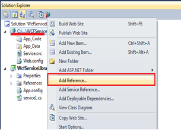
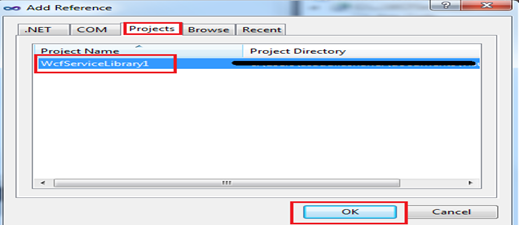
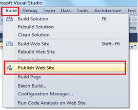
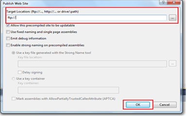

::: {style="DISPLAY: none"}
{#d2h_url_template}{#d2h_package_url style="WIDTH: 0px; DISPLAY: none; HEIGHT: 0px"}
:::

::::: {#nsbanner .d2h_main_nsbanner style="BORDER-BOTTOM: #999999 1px solid; POSITION: relative; PADDING-BOTTOM: 0px; BACKGROUND-COLOR: transparent; PADDING-LEFT: 0px; PADDING-RIGHT: 0px; DISPLAY: none; BORDER-TOP: #999999 1px solid; PADDING-TOP: 0px; LEFT: 0px"}
:::: {#TitleRow .d2h_main_titlerow style="PADDING-BOTTOM: 4px; BACKGROUND-COLOR: transparent; PADDING-LEFT: 22px; WIDTH: 100%; PADDING-RIGHT: 10px; DISPLAY: none; PADDING-TOP: 4px"}
::: {#ienav .d2h_main_ienav style="DISPLAY: none"}
{#D2HPrevious .D2HPreviousEnabled}  {#D2HNext .D2HNextEnabled}
:::
::::
:::::

::::: {#nstext .d2h_main_nstext style="PADDING-BOTTOM: 10px; BACKGROUND-COLOR: transparent; PADDING-LEFT: 22px; PADDING-RIGHT: 10px; HEIGHT: 100%; OVERFLOW: auto; PADDING-TOP: 5px" hasuserbackground="true" valign="bottom"}
::: {#d2h_breadcrumbs .d2h_breadcrumbs}
[Essential Studio User Guide Documentation](ms-xhelp:///?Id=12457748-09e3-4d74-a240-8e049cedf030){.d2h_breadcrumbsNormal}[ \> ]{.d2h_breadcrumbsLinkSeparator}[User Interface Edition](ms-xhelp:///?Id=c29296b7-531c-413b-a0ec-488ca1f7f669){.d2h_breadcrumbsNormal}[ \> ]{.d2h_breadcrumbsLinkSeparator}[Essential Windows Phone](ms-xhelp:///?Id=5ea1999c-4eff-4775-b84e-407dc825f555){.d2h_breadcrumbsNormal}[ \> ]{.d2h_breadcrumbsLinkSeparator}[Essential Tools]{.d2h_breadcrumbsContentsOnly}[ \> ]{.d2h_breadcrumbsLinkSeparator}[Frequently Asked Questions](ms-xhelp:///?Id=3022e8a5-607d-4ede-b1a9-7ec66eaed87d){.d2h_breadcrumbsNormal}
:::

## How to Create A WCF Data Binding Service {#how-to-create-a-wcf-data-binding-service style="tab-stops: 0pt"}

WCF Data binding is the process of populating the data/items through Web dynamically when the page/control is being loaded. WCF Data Binding requires an internet connection to load the items. It works by configuring the service reference in the client side application.

The following are the requirements to deploy a WCF binding:

1.   Create a WCF service library

2.   Create a Service site

3.   Host in a server

4.   Configure the client side Service reference of the hosted service site

5.   Sample code to fetch and populate the control

 

{border="0"}

Figure 146: Creating a new project

 

Create a WCF Service Library

1.   Open visual studio, file-\> new-\> project

2.   Then select the WCF tab, and select WCF Service Library

 

 

 

 

{border="0"}

Figure 147: Create a Wcf Library

{hspace="12" align="left"}

3.   Create new class and add the following code

::: {style="BORDER-BOTTOM: windowtext 1pt solid; BORDER-LEFT: medium none; PADDING-BOTTOM: 1pt; MARGIN-TOP: 9pt; PADDING-LEFT: 0pt; PADDING-RIGHT: 0pt; MARGIN-BOTTOM: 9pt; BORDER-TOP: windowtext 1pt solid; BORDER-RIGHT: medium none; PADDING-TOP: 1pt"}
 Note: code depends upon the individual requirement
:::

{border="0"}

Figure 148:Adding a new class

4.   Include the following namespaces:

 

    

+------------------------------------------------------------------------------------------------------------------------------+
| **[\[C#\]]{style="FONT-FAMILY: 'Courier New'"}**                                                                             |
|                                                                                                                              |
| [using]{style="FONT-FAMILY: 'Courier New'; COLOR: blue"}[ System.Runtime.Serialization;]{style="FONT-FAMILY: 'Courier New'"} |
|                                                                                                                              |
| [using]{style="FONT-FAMILY: 'Courier New'; COLOR: blue"}[ System.ServiceModel;]{style="FONT-FAMILY: 'Courier New'"}          |
|                                                                                                                              |
| []{style="FONT-FAMILY: 'Courier New'"}                                                                                       |
|                                                                                                                              |
| []{style="FONT-FAMILY: 'Courier New'"}                                                                                       |
+------------------------------------------------------------------------------------------------------------------------------+

    

5.   Add the following sample code:

    

+--------------------------------------------------------------------------------------------------------------------------------------------------------------------------------------------------------------------------------------------------------+
| **[\[C#\]]{style="FONT-FAMILY: 'Courier New'"}**                                                                                                                                                                                                       |
|                                                                                                                                                                                                                                                        |
| []{style="FONT-FAMILY: 'Courier New'"}                                                                                                                                                                                                                 |
|                                                                                                                                                                                                                                                        |
| []{style="FONT-FAMILY: 'Courier New'"}                                                                                                                                                                                                                 |
|                                                                                                                                                                                                                                                        |
| [namespace]{style="FONT-FAMILY: 'Courier New'; COLOR: blue"}[ WcfServiceLibrary1]{style="FONT-FAMILY: 'Courier New'"}                                                                                                                                  |
|                                                                                                                                                                                                                                                        |
| [{]{style="FONT-FAMILY: 'Courier New'"}                                                                                                                                                                                                                |
|                                                                                                                                                                                                                                                        |
| [    \[[DataContract]{style="COLOR: #2b91af"}\] [// annotate the field]{style="COLOR: green"}]{style="FONT-FAMILY: 'Courier New'"}                                                                                                                     |
|                                                                                                                                                                                                                                                        |
| [    [public]{style="COLOR: blue"} [class]{style="COLOR: blue"} [my]{style="COLOR: #2b91af"}]{style="FONT-FAMILY: 'Courier New'"}                                                                                                                      |
|                                                                                                                                                                                                                                                        |
| [    {]{style="FONT-FAMILY: 'Courier New'"}                                                                                                                                                                                                            |
|                                                                                                                                                                                                                                                        |
| [        \[[DataMember]{style="COLOR: #2b91af"}\]]{style="FONT-FAMILY: 'Courier New'"}                                                                                                                                                                 |
|                                                                                                                                                                                                                                                        |
| [        [public]{style="COLOR: blue"} [int]{style="COLOR: blue"} a; [// variables]{style="COLOR: green"}]{style="FONT-FAMILY: 'Courier New'"}                                                                                                         |
|                                                                                                                                                                                                                                                        |
| []{style="FONT-FAMILY: 'Courier New'"}                                                                                                                                                                                                                 |
|                                                                                                                                                                                                                                                        |
| [        ]{style="FONT-FAMILY: 'Courier New'"}                                                                                                                                                                                                         |
|                                                                                                                                                                                                                                                        |
| [    }]{style="FONT-FAMILY: 'Courier New'"}                                                                                                                                                                                                            |
|                                                                                                                                                                                                                                                        |
| []{style="FONT-FAMILY: 'Courier New'"}                                                                                                                                                                                                                 |
|                                                                                                                                                                                                                                                        |
| []{style="FONT-FAMILY: 'Courier New'"}                                                                                                                                                                                                                 |
|                                                                                                                                                                                                                                                        |
| [    \[[ServiceContract]{style="COLOR: #2b91af"}\] [// annotate the interface]{style="COLOR: green"}]{style="FONT-FAMILY: 'Courier New'"}                                                                                                              |
|                                                                                                                                                                                                                                                        |
| [    [public]{style="COLOR: blue"} [interface]{style="COLOR: blue"} [Imyservice]{style="COLOR: #2b91af"}]{style="FONT-FAMILY: 'Courier New'"}                                                                                                          |
|                                                                                                                                                                                                                                                        |
| [    {]{style="FONT-FAMILY: 'Courier New'"}                                                                                                                                                                                                            |
|                                                                                                                                                                                                                                                        |
| [        \[[OperationContract]{style="COLOR: #2b91af"}\]]{style="FONT-FAMILY: 'Courier New'"}                                                                                                                                                          |
|                                                                                                                                                                                                                                                        |
| [        [void]{style="COLOR: blue"} setdata([my]{style="COLOR: #2b91af"} m); [// function to receive the data of type my(class)]{style="COLOR: green"}]{style="FONT-FAMILY: 'Courier New'"}                                                           |
|                                                                                                                                                                                                                                                        |
| []{style="FONT-FAMILY: 'Courier New'"}                                                                                                                                                                                                                 |
|                                                                                                                                                                                                                                                        |
| [        \[[OperationContract]{style="COLOR: #2b91af"}\]]{style="FONT-FAMILY: 'Courier New'"}                                                                                                                                                          |
|                                                                                                                                                                                                                                                        |
| [        [List]{style="COLOR: #2b91af"}\<[my]{style="COLOR: #2b91af"}\> getdata([my]{style="COLOR: #2b91af"} m);]{style="FONT-FAMILY: 'Courier New'"}                                                                                                  |
|                                                                                                                                                                                                                                                        |
| []{style="FONT-FAMILY: 'Courier New'"}                                                                                                                                                                                                                 |
|                                                                                                                                                                                                                                                        |
| [    }]{style="FONT-FAMILY: 'Courier New'"}                                                                                                                                                                                                            |
|                                                                                                                                                                                                                                                        |
| []{style="FONT-FAMILY: 'Courier New'"}                                                                                                                                                                                                                 |
|                                                                                                                                                                                                                                                        |
| []{style="FONT-FAMILY: 'Courier New'"}                                                                                                                                                                                                                 |
|                                                                                                                                                                                                                                                        |
| []{style="FONT-FAMILY: 'Courier New'"}                                                                                                                                                                                                                 |
|                                                                                                                                                                                                                                                        |
| [    \[[ServiceBehavior]{style="COLOR: #2b91af"}(InstanceContextMode = [InstanceContextMode]{style="COLOR: #2b91af"}.Single)\] [// to have only single instance mode running in the host. ]{style="COLOR: green"}]{style="FONT-FAMILY: 'Courier New'"} |
|                                                                                                                                                                                                                                                        |
| [    [public]{style="COLOR: blue"} [class]{style="COLOR: blue"} [myservice]{style="COLOR: #2b91af"} : [Imyservice]{style="COLOR: #2b91af"}]{style="FONT-FAMILY: 'Courier New'"}                                                                        |
|                                                                                                                                                                                                                                                        |
| [    {]{style="FONT-FAMILY: 'Courier New'"}                                                                                                                                                                                                            |
|                                                                                                                                                                                                                                                        |
| [        [List]{style="COLOR: #2b91af"}\<[my]{style="COLOR: #2b91af"}\> obj = [new]{style="COLOR: blue"} [List]{style="COLOR: #2b91af"}\<[my]{style="COLOR: #2b91af"}\>();]{style="FONT-FAMILY: 'Courier New'"}                                        |
|                                                                                                                                                                                                                                                        |
| [        ]{style="FONT-FAMILY: 'Courier New'"}                                                                                                                                                                                                         |
|                                                                                                                                                                                                                                                        |
| [        [public]{style="COLOR: blue"} [void]{style="COLOR: blue"} setdata([my]{style="COLOR: #2b91af"} m)]{style="FONT-FAMILY: 'Courier New'"}                                                                                                        |
|                                                                                                                                                                                                                                                        |
| [        {]{style="FONT-FAMILY: 'Courier New'"}                                                                                                                                                                                                        |
|                                                                                                                                                                                                                                                        |
| [            obj.Add(m);  [// method to add new  value]{style="COLOR: green"}]{style="FONT-FAMILY: 'Courier New'"}                                                                                                                                     |
|                                                                                                                                                                                                                                                        |
| [        }]{style="FONT-FAMILY: 'Courier New'"}                                                                                                                                                                                                        |
|                                                                                                                                                                                                                                                        |
| []{style="FONT-FAMILY: 'Courier New'"}                                                                                                                                                                                                                 |
|                                                                                                                                                                                                                                                        |
| [        [public]{style="COLOR: blue"}   [List]{style="COLOR: #2b91af"}\<[my]{style="COLOR: #2b91af"}\> getdata()]{style="FONT-FAMILY: 'Courier New'"}                                                                                                 |
|                                                                                                                                                                                                                                                        |
| [        {]{style="FONT-FAMILY: 'Courier New'"}                                                                                                                                                                                                        |
|                                                                                                                                                                                                                                                        |
| [            [return]{style="COLOR: blue"} obj; [// method to get the values]{style="COLOR: green"}]{style="FONT-FAMILY: 'Courier New'"}                                                                                                               |
|                                                                                                                                                                                                                                                        |
| [        }]{style="FONT-FAMILY: 'Courier New'"}                                                                                                                                                                                                        |
|                                                                                                                                                                                                                                                        |
| []{style="FONT-FAMILY: 'Courier New'"}                                                                                                                                                                                                                 |
|                                                                                                                                                                                                                                                        |
| [    }]{style="FONT-FAMILY: 'Courier New'"}                                                                                                                                                                                                            |
|                                                                                                                                                                                                                                                        |
| []{style="FONT-FAMILY: 'Courier New'"}                                                                                                                                                                                                                 |
|                                                                                                                                                                                                                                                        |
| [}]{style="FONT-FAMILY: 'Courier New'"}                                                                                                                                                                                                                |
|                                                                                                                                                                                                                                                        |
| []{style="FONT-FAMILY: 'Courier New'"}                                                                                                                                                                                                                 |
|                                                                                                                                                                                                                                                        |
| []{style="FONT-FAMILY: 'Courier New'"}                                                                                                                                                                                                                 |
|                                                                                                                                                                                                                                                        |
| []{style="FONT-FAMILY: 'Courier New'"}                                                                                                                                                                                                                 |
+--------------------------------------------------------------------------------------------------------------------------------------------------------------------------------------------------------------------------------------------------------+

 

 

 

6.   Build the service Library

 

 

{border="0"}

Figure 149: Build the Solution

 

                  

7.   Add a new web service by, Right Click the **Solution** and select **Add** and then select **New Website**.

 

{border="0"}

Figure 150: Adding new Website to the Solution

 

 

 

8.   Select the  type as  WCF Service

 

{border="0"}

Figure 151: Adding a WCF Service Website

 

 

9.   Refer the WCF service library to the newly added project, RightClick [à]{style="FONT-FAMILY: Wingdings"} Add Reference 

 

 

 

 

{border="0"}

Figure 152: Refer the Service Library

 

   

 

 

 

10.  In Add Reference Window

 

 

{border="0"}

Figure 153: Selecting the Reference

 

 

 

11.  Publish the Wcf Service website at your hosting space. Once your website is published the service reference link to be added at the client site application is automatically generated.

 

To Publish the Website , Build [à]{style="FONT-FAMILY: Wingdings"}  Publish, a windows appears, specify the publish type, credentials and location ( web address).

{border="0"}

Figure 154: Publishing the Web Service

 

                        

 

 

 

{border="0"}

Figure 155: Selecting the Publish type[]{style="FONT-STYLE: normal"}

 

 

The above are the steps to create and host a WCF service application which enables to bind the data dynamically from a website.

 

[]{#related-topics}
:::::
