::: {style="DISPLAY: none"}
{#d2h_url_template}{#d2h_package_url style="WIDTH: 0px; DISPLAY: none; HEIGHT: 0px"}
:::

::::: {#nsbanner .d2h_main_nsbanner style="BORDER-BOTTOM: #999999 1px solid; POSITION: relative; PADDING-BOTTOM: 0px; BACKGROUND-COLOR: transparent; PADDING-LEFT: 0px; PADDING-RIGHT: 0px; DISPLAY: none; BORDER-TOP: #999999 1px solid; PADDING-TOP: 0px; LEFT: 0px"}
:::: {#TitleRow .d2h_main_titlerow style="PADDING-BOTTOM: 4px; BACKGROUND-COLOR: transparent; PADDING-LEFT: 22px; WIDTH: 100%; PADDING-RIGHT: 10px; DISPLAY: none; PADDING-TOP: 4px"}
::: {#ienav .d2h_main_ienav style="DISPLAY: none"}
{#D2HPrevious .D2HPreviousEnabled}  {#D2HNext .D2HNextEnabled}
:::
::::
:::::

:::::::: {#nstext .d2h_main_nstext style="PADDING-BOTTOM: 10px; BACKGROUND-COLOR: transparent; PADDING-LEFT: 22px; PADDING-RIGHT: 10px; HEIGHT: 100%; OVERFLOW: auto; PADDING-TOP: 5px" hasuserbackground="true" valign="bottom"}
::: {#d2h_breadcrumbs .d2h_breadcrumbs}
[Essential Studio User Guide Documentation](ms-xhelp:///?Id=12457748-09e3-4d74-a240-8e049cedf030){.d2h_breadcrumbsNormal}[ \> ]{.d2h_breadcrumbsLinkSeparator}[Reporting Edition](ms-xhelp:///?Id=027aa5b6-6676-4f93-ad23-c20e8c45792e){.d2h_breadcrumbsNormal}[ \> ]{.d2h_breadcrumbsLinkSeparator}[Essential Report Viewer](ms-xhelp:///?Id=35081cc7-4b81-4ef5-97d2-894ad584b907){.d2h_breadcrumbsNormal}[ \> ]{.d2h_breadcrumbsLinkSeparator}[Report Viewer WPF]{.d2h_breadcrumbsContentsOnly}[ \> ]{.d2h_breadcrumbsLinkSeparator}[Frequently Asked Question](ms-xhelp:///?Id=e9b38d20-5239-4ac0-86c5-a77faf7d5846){.d2h_breadcrumbsNormal}
:::

## How to Create RDLC Report In VS2010 and Show It in Report Viewer {#how-to-create-rdlc-report-in-vs2010-and-show-it-in-report-viewer style="tab-stops: 0pt"}

 

This section covers the steps for creating RDLC report in VS2010 and showing the created RDLC report in Report viewer.

 

1.   Create a new WPF application with .Net Framework 4. The **Solution Explorer** dialog will open.

 

::: {style="BORDER-BOTTOM: windowtext 1pt solid; BORDER-LEFT: medium none; PADDING-BOTTOM: 1pt; MARGIN-TOP: 9pt; PADDING-LEFT: 0pt; PADDING-RIGHT: 0pt; MARGIN-BOTTOM: 9pt; BORDER-TOP: windowtext 1pt solid; BORDER-RIGHT: medium none; PADDING-TOP: 1pt"}
{border="0"}Note: In below example, the new WPF application is created in the name of ReportsApplication8.

 
:::

2.   To add a new RDLC report in the WPF application, right-click on the newly added WPF application in the **Solution Explorer** dialog.

 

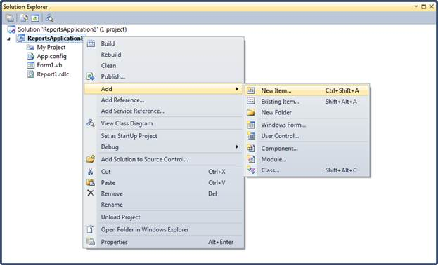{border="0"}

Figure 18: Add option in Solution Explorer

 

3.   Select **Add,** and then click **New Item**. The **Add New Item** dialog will open.

 

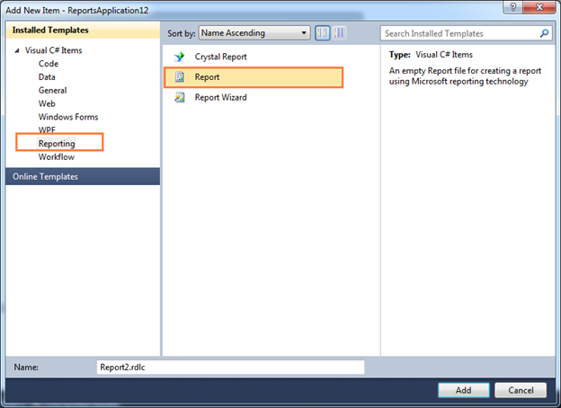{border="0"}

Figure 19: Add New Item window

 

4.   To create a dataset for the RDLC report, click **Reporting** under **Visual C# Items**.

5.   Click **Report**, and then click **Add**. The **Report Wizard** will open.

 

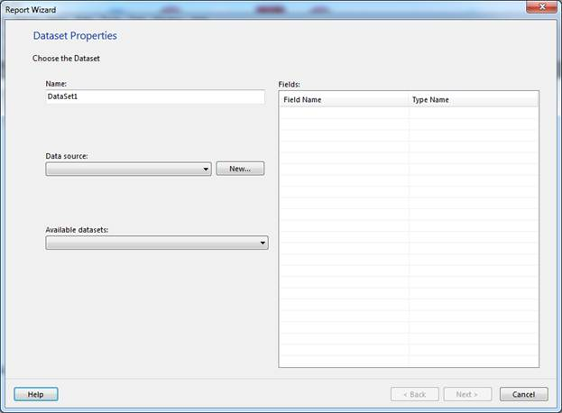{border="0"}

Figure 20: Report Wizard

 

6.   Enter a dataset name in **Name** field.

7.   To choose a data source for the dataset, click **New** on the right of **Data source** drop-down combo box. The **Data Source Configuration Wizard** will open.

 

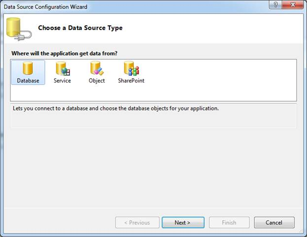{border="0"}

Figure 21: Choose a Data Source Type

 

8.   Click **Database** under **Where will the application get data from?** field, and then click **Next**.

 

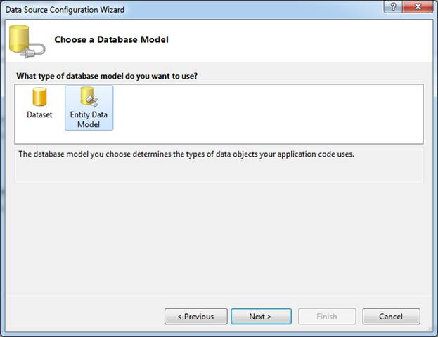{border="0"}

Figure 22: Choose a Database Model

 

9.   Click **Entity Data Model** under **What type of database model do you want to use?** field.

10.  Click **Next**. The **Entity Data Model Wizard** will open.

 

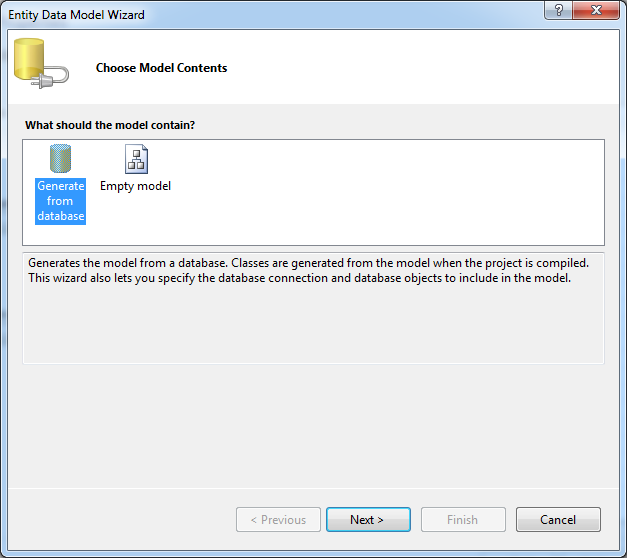{border="0"}

Figure 23: Choose Model Contents

 

11.  Click **Generate from database** under **what should the model contain?** field.

12.  Click **Next**.

 

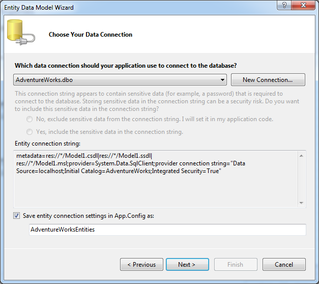{border="0"}

Figure 24: Choose Your Data Connection

 

13.  Select a data connection from **Which data connection should your application use to connect to the database?** drop-down combo box.

 

::: {style="BORDER-BOTTOM: windowtext 1pt solid; BORDER-LEFT: medium none; PADDING-BOTTOM: 1pt; MARGIN-TOP: 9pt; PADDING-LEFT: 0pt; PADDING-RIGHT: 0pt; MARGIN-BOTTOM: 9pt; BORDER-TOP: windowtext 1pt solid; BORDER-RIGHT: medium none; PADDING-TOP: 1pt"}
{border="0"}Note: You can create a new data connection by clicking New Connection.
:::

 

14.  Click **Next**.

 

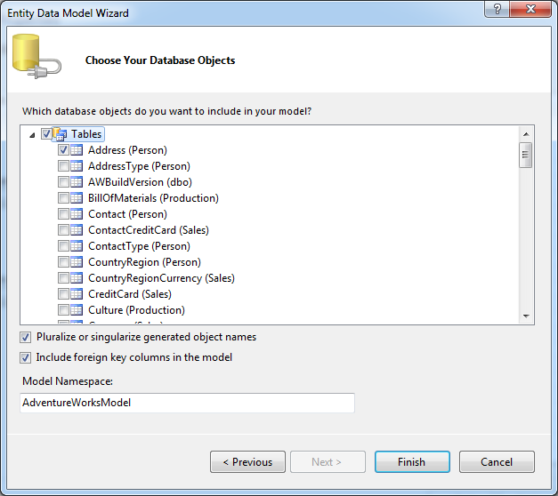{border="0"}

Figure 25: Choose Your Database Objects

 

15.  Select the required object and click **Next**. The **Data Source Configuration Wizard** will open.

 

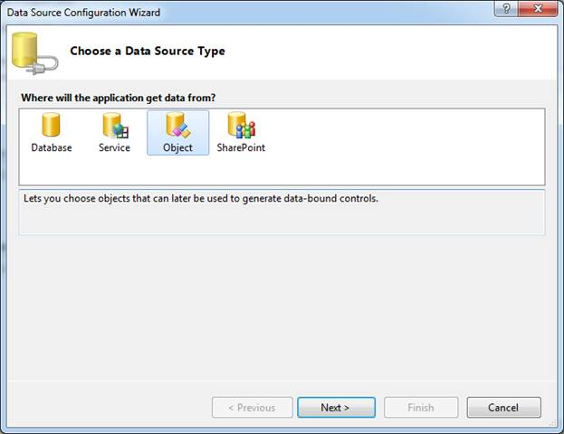{border="0"}

Figure 26: Choose a Data Source Type

 

16.  Select **Object** under **Where will the application get data from?** field.

17.  Click **Next**.

 

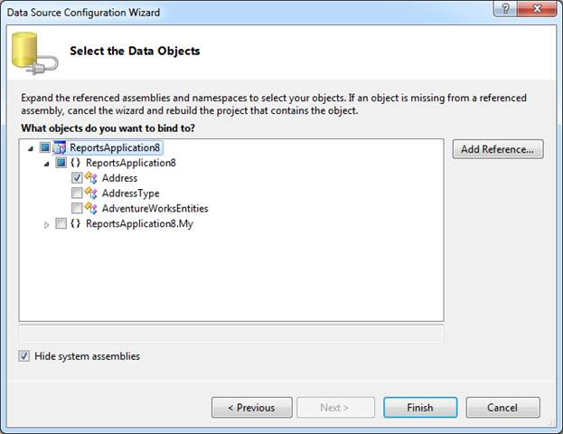{border="0"}

Figure 27:Select the Data objects

 

18.  Select the **object** under **What objects do you want to bind to?** field.

19.  Click **Finish**. The **Report Wizard** will show the details of the dataset under **Fields**.

 

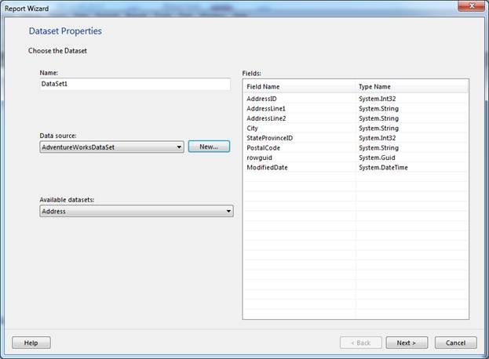{border="0"}

Figure 28: Report Wizard with added fields

 

20.  Click **Next**.

 

::: {style="BORDER-BOTTOM: windowtext 1pt solid; BORDER-LEFT: medium none; PADDING-BOTTOM: 1pt; MARGIN-TOP: 9pt; PADDING-LEFT: 0pt; PADDING-RIGHT: 0pt; MARGIN-BOTTOM: 9pt; BORDER-TOP: windowtext 1pt solid; BORDER-RIGHT: medium none; PADDING-TOP: 1pt"}
{border="0"}Note: The fields will be added under the dataset in Data Sources window.

 
:::

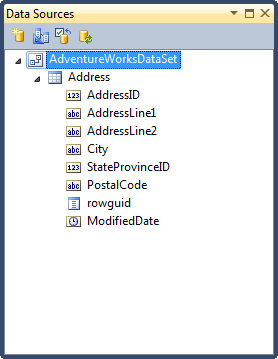{border="0"}

Figure 29: Data Sources with added fields

 

21.  On **Toolbox** window, in **Report Items**, select **Table**.

 

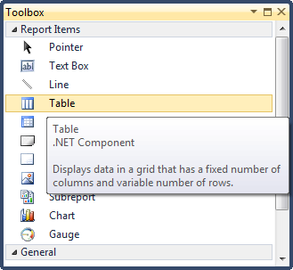{border="0"}

Figure 30: Table option in Toolbox

 

22.  Draw a table on the WPF Designer window.

 

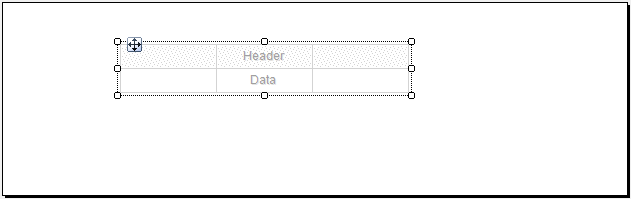{border="0"}

Figure 31: WPF Designer window with table

 

23.  Drag the dataset field on the Table.

 

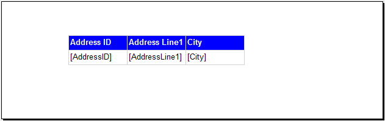{border="0"}

Figure 32: Table with dataset fields

 

24.  To add Report Viewer in WPF application, select **ReportViewer** under **Reporting**.

 

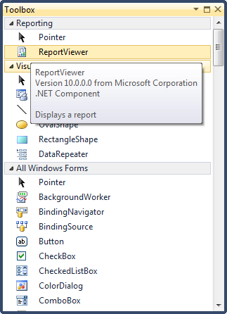{border="0"}

Figure 33: ReportViewer option in Toolbox

 

::: {style="BORDER-BOTTOM: windowtext 1pt solid; BORDER-LEFT: medium none; PADDING-BOTTOM: 1pt; MARGIN-TOP: 9pt; PADDING-LEFT: 0pt; PADDING-RIGHT: 0pt; MARGIN-BOTTOM: 9pt; BORDER-TOP: windowtext 1pt solid; BORDER-RIGHT: medium none; PADDING-TOP: 1pt"}
{border="0"}Note: The following window will be shown in the WPF Designer window.

 
:::

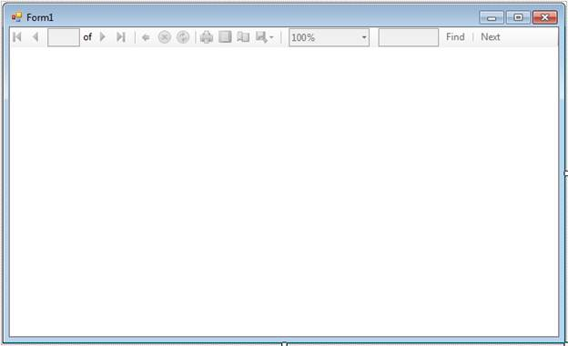{border="0"}

Figure 34: WPF Designer window with Report Viewer

 

25.  Set the **ReportPath** and the **ProcessingMode** as local in Report Viewer.

 

+-----------------------------------------------------------------------------------------------------------------------------------------------------------------------------------+
| [\<Window x:Class=\"WpfApplication15.MainWindow\"]{style="FONT-FAMILY: 'Courier New'; COLOR: blue"}                                                                               |
|                                                                                                                                                                                   |
| [        xmlns=\"http://schemas.microsoft.com/winfx/2006/xaml/presentation\"]{style="FONT-FAMILY: 'Courier New'; COLOR: blue"}                                                    |
|                                                                                                                                                                                   |
| [        xmlns:x=\"http://schemas.microsoft.com/winfx/2006/xaml\"]{style="FONT-FAMILY: 'Courier New'; COLOR: blue"}                                                               |
|                                                                                                                                                                                   |
| [        Title=\"MainWindow\" Height=\"350\" Width=\"525\" xmlns:syncfusion=\"http://schemas.syncfusion.com/wpf\"\>]{style="FONT-FAMILY: 'Courier New'; COLOR: blue"}             |
|                                                                                                                                                                                   |
| [    \<Grid \>]{style="FONT-FAMILY: 'Courier New'; COLOR: blue"}                                                                                                                  |
|                                                                                                                                                                                   |
| [        \<syncfusion:ReportViewer Name=\"reportViewer1\" ProcessingMode=\"Local\" ReportPath=\"..\\..\\SampleReport.rdlc\" /\>]{style="FONT-FAMILY: 'Courier New'; COLOR: blue"} |
|                                                                                                                                                                                   |
| [    \</Grid\>]{style="FONT-FAMILY: 'Courier New'; COLOR: blue"}                                                                                                                  |
|                                                                                                                                                                                   |
| [\</Window\>]{style="FONT-FAMILY: 'Courier New'; COLOR: blue"}                                                                                                                    |
+-----------------------------------------------------------------------------------------------------------------------------------------------------------------------------------+

 

26.  Set the **DataSource** information in the code to view the report in Report Viewer.

 

+---------------------------------------------------------------------------------------------------------------------------------------------+
| [public MainWindow()]{style="FONT-FAMILY: 'Courier New'; COLOR: blue"}                                                                      |
|                                                                                                                                             |
| [{]{style="FONT-FAMILY: 'Courier New'; COLOR: blue"}                                                                                        |
|                                                                                                                                             |
| [    InitializeComponent();]{style="FONT-FAMILY: 'Courier New'; COLOR: blue"}                                                               |
|                                                                                                                                             |
| [    this.Loaded += new RoutedEventHandler(MainWindow_Loaded);]{style="FONT-FAMILY: 'Courier New'; COLOR: blue"}                            |
|                                                                                                                                             |
| [}]{style="FONT-FAMILY: 'Courier New'; COLOR: blue"}                                                                                        |
|                                                                                                                                             |
| []{style="FONT-FAMILY: 'Courier New'; COLOR: blue"}                                                                                         |
|                                                                                                                                             |
| [void MainWindow_Loaded(object sender, RoutedEventArgs e)]{style="FONT-FAMILY: 'Courier New'; COLOR: blue"}                                 |
|                                                                                                                                             |
| [{]{style="FONT-FAMILY: 'Courier New'; COLOR: blue"}                                                                                        |
|                                                                                                                                             |
| [    this.reportViewer1.DataSources.Clear();]{style="FONT-FAMILY: 'Courier New'; COLOR: blue"}                                              |
|                                                                                                                                             |
| [    this.reportViewer1.DataSources.Add(new Syncfusion.Windows.Reports.ReportDataSource()]{style="FONT-FAMILY: 'Courier New'; COLOR: blue"} |
|                                                                                                                                             |
| [    {]{style="FONT-FAMILY: 'Courier New'; COLOR: blue"}                                                                                    |
|                                                                                                                                             |
| [                Name = \"DataSet1\",]{style="FONT-FAMILY: 'Courier New'; COLOR: blue"}                                                     |
|                                                                                                                                             |
| [                Value = new AdventureWorksEntities().Addresses.Take(100)]{style="FONT-FAMILY: 'Courier New'; COLOR: blue"}                 |
|                                                                                                                                             |
| [   });]{style="FONT-FAMILY: 'Courier New'; COLOR: blue"}                                                                                   |
|                                                                                                                                             |
| [    this.reportViewer1.RefreshReport();]{style="FONT-FAMILY: 'Courier New'; COLOR: blue"}                                                  |
|                                                                                                                                             |
| [}]{style="FONT-FAMILY: 'Courier New'; COLOR: blue"}                                                                                        |
+---------------------------------------------------------------------------------------------------------------------------------------------+

 

27.  Run the application. The following output will be displayed.

 

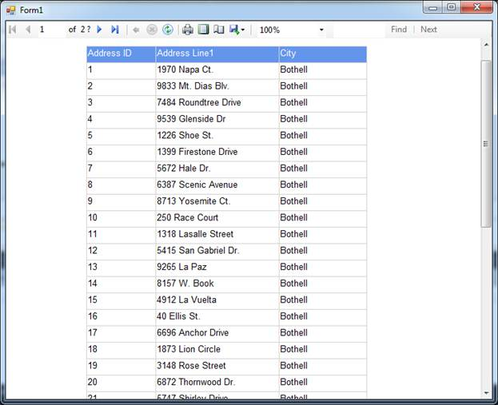{border="0"}

Figure 35: Report Viewer with RDLC reports

 

[]{#related-topics}
::::::::
