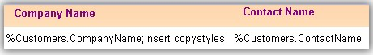
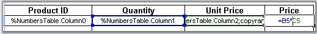
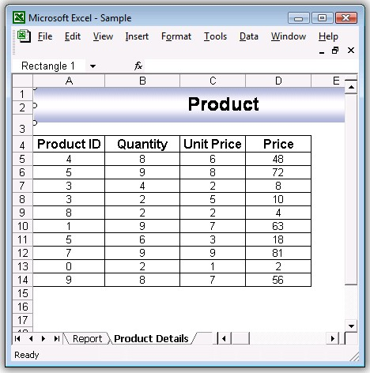
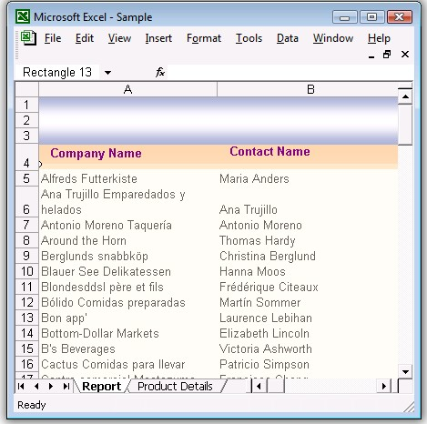

::: {style="DISPLAY: none"}
{#d2h_url_template}{#d2h_package_url style="WIDTH: 0px; DISPLAY: none; HEIGHT: 0px"}
:::

::::: {#nsbanner .d2h_main_nsbanner style="BORDER-BOTTOM: #999999 1px solid; POSITION: relative; PADDING-BOTTOM: 0px; BACKGROUND-COLOR: transparent; PADDING-LEFT: 0px; PADDING-RIGHT: 0px; DISPLAY: none; BORDER-TOP: #999999 1px solid; PADDING-TOP: 0px; LEFT: 0px"}
:::: {#TitleRow .d2h_main_titlerow style="PADDING-BOTTOM: 4px; BACKGROUND-COLOR: transparent; PADDING-LEFT: 22px; WIDTH: 100%; PADDING-RIGHT: 10px; DISPLAY: none; PADDING-TOP: 4px"}
::: {#ienav .d2h_main_ienav style="DISPLAY: none"}
{#D2HPrevious .D2HPreviousEnabled}  {#D2HNext .D2HNextEnabled}
:::
::::
:::::

:::: {#nstext .d2h_main_nstext style="PADDING-BOTTOM: 10px; BACKGROUND-COLOR: transparent; PADDING-LEFT: 22px; PADDING-RIGHT: 10px; HEIGHT: 100%; OVERFLOW: auto; PADDING-TOP: 5px" hasuserbackground="true" valign="bottom"}
::: {#d2h_breadcrumbs .d2h_breadcrumbs}
[Essential Studio User Guide Documentation](ms-xhelp:///?Id=12457748-09e3-4d74-a240-8e049cedf030){.d2h_breadcrumbsNormal}[ \> ]{.d2h_breadcrumbsLinkSeparator}[Reporting Edition](ms-xhelp:///?Id=027aa5b6-6676-4f93-ad23-c20e8c45792e){.d2h_breadcrumbsNormal}[ \> ]{.d2h_breadcrumbsLinkSeparator}[Essential XlsIO](ms-xhelp:///?Id=b01a1b50-1d7d-40c0-bc83-af67e57c9005){.d2h_breadcrumbsNormal}[ \> ]{.d2h_breadcrumbsLinkSeparator}[Frequently Asked Questions](ms-xhelp:///?Id=702d1cd4-b827-4e46-83f2-e25d649fc6e6){.d2h_breadcrumbsNormal}[ \> ]{.d2h_breadcrumbsLinkSeparator}[Common](ms-xhelp:///?Id=204d4885-27f7-4e80-a9ba-4b2afe542a91){.d2h_breadcrumbsNormal}
:::

### How to Create Template Markers Using XlsIO? {#how-to-create-template-markers-using-xlsio style="tab-stops: 0pt"}

[]{style="FONT-FAMILY: 'Trebuchet MS','sans-serif'; COLOR: #15428b; FONT-SIZE: 9pt"} 

Report created in Excel provides ordered and rich look for large datasets. This article focuses on creating an Excel report using template markers. A template marker is a special marker symbol created in an Excel template which will be bound the required user data. Essential XlsIO allows you to create and bind the template markers to data from various sources, such as data table, variables and arrays. This allows the user to control the data formats for the data bound to the template document.

[]{style="FONT-FAMILY: 'Trebuchet MS','sans-serif'; COLOR: #15428b; FONT-SIZE: 9pt"} 

How Does it Work?

[]{style="FONT-FAMILY: 'Trebuchet MS','sans-serif'; COLOR: #15428b; FONT-SIZE: 9pt"} 

Markers are applied in the template to the required cells. This will include the data source name and field name of interest. During data binding a search is conducted for the data source name and the field name in the Excel workbook and the corresponding data from the data source is bound to the marker. Cells in the worksheet can be filled with single data source or with multiple records. Format of these data can be changed using the arguments of the markers.

[]{style="FONT-FAMILY: 'Trebuchet MS','sans-serif'; COLOR: #004f8a; FONT-SIZE: 9pt"} 

What is the Syntax of the Markers in Template?

[]{style="FONT-FAMILY: 'Trebuchet MS','sans-serif'; COLOR: #15428b; FONT-SIZE: 9pt"} 

Each marker starts with some prefix (by default it is "%" character) and followed by the variable name and properties. There could be several arguments after a variable which are delimited by some character (by default it is semicolon ";".)

[]{style="FONT-FAMILY: 'Trebuchet MS','sans-serif'; COLOR: #15428b; FONT-SIZE: 9pt"} 

{border="0"}

Figure 164: Marker Syntax

[]{style="FONT-FAMILY: 'Trebuchet MS','sans-serif'; COLOR: #15428b"} 

What are the Various Sources of Binding Data to Markers?

 

Essential XlsIO allows data binding from following data sources.

 

1\. Data Source

This includes data tables, datasets, data readers and data views. A data source can be used to bind large number records to the template document. This will add the rows for each record and fields to be bound are identified through the field name in the template.

[]{style="FONT-FAMILY: 'Trebuchet MS','sans-serif'; COLOR: #15428b; FONT-SIZE: 9pt"} 

Syntax: %DataSource.FieldName

[]{style="FONT-FAMILY: 'Trebuchet MS','sans-serif'; COLOR: #15428b; FONT-SIZE: 9pt"} 

2\. Variable Name

This option will allow you to bind a single data stored in a variable to the marker in the template.

 

Syntax: %VariableName

 

**3. Variable Array**

This option will allow you to bind array of data stored in an array to the marker in the template.

 

Syntax: %VariableArray

 

**4. Formulas**

This option will allow you to create formulas for each row when multiple records comprising formula in the cells are bound to the marker. If a cell contains formula, by default it will be stretched to the rows/columns for any of the above sources of data binding.

[]{style="FONT-FAMILY: 'Trebuchet MS','sans-serif'; COLOR: #15428b; FONT-SIZE: 9pt"} 

{border="0"}

Figure 165: Formulas[]{style="FONT-FAMILY: 'Trebuchet MS','sans-serif'; COLOR: #15428b"}

***[]{style="FONT-FAMILY: 'Trebuchet MS','sans-serif'; COLOR: #15428b; FONT-SIZE: 9pt"}*** 

What are the Various Arguments for the Marker?

 

The following arguments can be used with the marker to control the formatting while binding the data:

[·      ]{style="FONT-FAMILY: Symbol"}**Horizontal**-This argument specifies the horizontal direction of the data import for complex variables.

[·      ]{style="FONT-FAMILY: Symbol"}**Vertical**-This argument specifies the vertical direction of the data import for complex variables.

[·      ]{style="FONT-FAMILY: Symbol"}**Insert**-This argument inserts new row or column depending on the direction argument for each new cell. By default, the rows can't be added.

[·      ]{style="FONT-FAMILY: Symbol"}**insert:copystyles**-This argument copies style from the row above or left column.

[·      ]{style="FONT-FAMILY: Symbol"}**jump:\[cell reference in R1C1 notation\]**-This argument binds the data to the cell at the specified reference. Cell reference address can be relative or absolute.

[·      ]{style="FONT-FAMILY: Symbol"}**copyrange:\[top-left cell reference in R1C1\]:\[bottom-right cell reference in R1C1\]**-Copies the specified cells after each cell import.

 

Following code snippet illustrates processing and binding the marker with data.

 

+-----------------------------------------------------------------------------------------------------------------------------------+
| [// Create marker processor]{style="FONT-FAMILY: 'Courier New'; COLOR: green"}                                                    |
|                                                                                                                                   |
| [ITemplateMarkersProcessor marker = workbook.CreateTemplateMarkersProcessor();]{style="FONT-FAMILY: 'Courier New'; COLOR: black"} |
|                                                                                                                                   |
| []{style="FONT-FAMILY: 'Courier New'; COLOR: black"}                                                                              |
|                                                                                                                                   |
| [// Bind the data from the data table]{style="FONT-FAMILY: 'Courier New'; COLOR: green"}                                          |
|                                                                                                                                   |
| [marker.AddVariable(\"Customers\",northwindDt);]{style="FONT-FAMILY: 'Courier New'; COLOR: black"}                                |
|                                                                                                                                   |
| []{style="FONT-FAMILY: 'Courier New'; COLOR: black"}                                                                              |
|                                                                                                                                   |
| [// Process the markers in the template]{style="FONT-FAMILY: 'Courier New'; COLOR: green"}                                        |
|                                                                                                                                   |
| [marker.ApplyMarkers();]{style="FONT-FAMILY: 'Courier New'; COLOR: black"}                                                        |
+-----------------------------------------------------------------------------------------------------------------------------------+

***[]{style="FONT-FAMILY: 'Trebuchet MS','sans-serif'; COLOR: #15428b; FONT-SIZE: 9pt"}*** 

Here, **CreateTemplateMarkerProcessor** returns **ITemplateMarkersProcessor** interface which creates and manipulates the marker data. **ApplyMarkers** method of **ITemplateMarkersProcessor** is the special method that processes the markers in the template.

 

Here is a screen shot after binding data with marker variable.

***[]{style="FONT-FAMILY: 'Trebuchet MS','sans-serif'; COLOR: #15428b; FONT-SIZE: 9pt"}*** 

{border="0"}

Figure 166: Marker Syntax

 

[Here is a screen shot after binding the data with the marker that retains the formula.]{style="FONT-SIZE: 9pt"}

[]{style="FONT-SIZE: 9pt"} 

{border="0"}

Figure 167: Marker Syntax**[]{style="FONT-STYLE: normal; FONT-FAMILY: 'Trebuchet MS','sans-serif'; COLOR: #15428b"}**

**[]{style="FONT-FAMILY: 'Trebuchet MS','sans-serif'; COLOR: #15428b"}** 

Summary

This article demonstrates about how Essential XlsIO can be used to generate rich reports in Excel format using template markers. You can create and format user specific information in a large report with few lines of coding and great performance[. ]{style="COLOR: #004f8a; FONT-SIZE: 9pt"}

[]{style="COLOR: #004f8a; FONT-SIZE: 9pt"} 

[]{#related-topics}
::::
