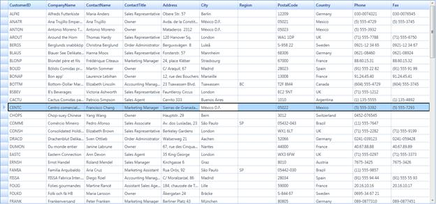

::: {style="DISPLAY: none"}
[](ms-xhelp:///?Id=d2h_url_template){#d2h_url_template}{#d2h_package_url style="WIDTH: 0px; DISPLAY: none; HEIGHT: 0px"}
:::

::::: {#nsbanner .d2h_main_nsbanner style="BORDER-BOTTOM: #999999 1px solid; POSITION: relative; PADDING-BOTTOM: 0px; BACKGROUND-COLOR: transparent; PADDING-LEFT: 0px; PADDING-RIGHT: 0px; DISPLAY: none; BORDER-TOP: #999999 1px solid; PADDING-TOP: 0px; LEFT: 0px"}
:::: {#TitleRow .d2h_main_titlerow style="PADDING-BOTTOM: 4px; BACKGROUND-COLOR: transparent; PADDING-LEFT: 22px; WIDTH: 100%; PADDING-RIGHT: 10px; DISPLAY: none; PADDING-TOP: 4px"}
::: {#ienav .d2h_main_ienav style="DISPLAY: none"}
[](ms-xhelp:///?Id=66593f9b-2465-44fe-8293-d96e89b210ef){#D2HPrevious .D2HPreviousEnabled}  [](ms-xhelp:///?Id=2d3315cd-a9b6-4b71-a45e-b53f794976f1){#D2HNext .D2HNextEnabled}
:::
::::
:::::

::::: {#nstext .d2h_main_nstext style="PADDING-BOTTOM: 10px; BACKGROUND-COLOR: transparent; PADDING-LEFT: 22px; PADDING-RIGHT: 10px; HEIGHT: 100%; OVERFLOW: auto; PADDING-TOP: 5px" hasuserbackground="true" valign="bottom"}
::: {#d2h_breadcrumbs .d2h_breadcrumbs}
[Essential Studio User Guide Documentation](ms-xhelp:///?Id=12457748-09e3-4d74-a240-8e049cedf030){.d2h_breadcrumbsNormal}[ \> ]{.d2h_breadcrumbsLinkSeparator}[User Interface Edition](ms-xhelp:///?Id=c29296b7-531c-413b-a0ec-488ca1f7f669){.d2h_breadcrumbsNormal}[ \> ]{.d2h_breadcrumbsLinkSeparator}[Essential WPF](ms-xhelp:///?Id=7f4f82c5-151c-4262-94d0-75c4626c77bc){.d2h_breadcrumbsNormal}[ \> ]{.d2h_breadcrumbsLinkSeparator}[Essential Grid]{.d2h_breadcrumbsContentsOnly}[ \> ]{.d2h_breadcrumbsLinkSeparator}[Frequently Asked Questions](ms-xhelp:///?Id=f0ba96de-029b-4b3a-8f3e-275c39720dbb){.d2h_breadcrumbsNormal}
:::

## How to Customize GridDataControl Selection Border? {#how-to-customize-griddatacontrol-selection-border style="tab-stops: 0pt"}

 

The GridDataControl selection border can be customized using the *HighlightSelectionBorder* and *HighlightSelectionBorderWidth* properties. The *HighlightSelectionBorder* helps you to change the color of the selection border. With the *HighlightSelectionBorder* property, you can easily identify a record in the GridDataControl. The *HighlightSelectionBorderWidth* is used to set thickness for the selection border when you select the record using the mouse.

 

The following code examples show how to customize the GridDataControl selection border using the *HighlightSelectionBorder* and *HighlightSelectionBorderWidth* properties.

 

::: {style="BORDER-BOTTOM: windowtext 1pt solid; BORDER-LEFT: medium none; PADDING-BOTTOM: 1pt; MARGIN-TOP: 9pt; PADDING-LEFT: 0pt; PADDING-RIGHT: 0pt; MARGIN-BOTTOM: 9pt; BORDER-TOP: windowtext 1pt solid; BORDER-RIGHT: medium none; PADDING-TOP: 1pt"}
{border="0"}To enable these properties, you have to set the ExcelLikeSelectionFrame as True.

 
:::

+-----------------------------------------------------------------------------------------------------------------------------------------------------------------------------------------------------------------------------------------------------------------------------------------------------------------------------------------------------------------------------------------------------------------------------------------+
| **[\[XAML\]]{style="FONT-FAMILY: 'Courier New'"}**                                                                                                                                                                                                                                                                                                                                                                                      |
|                                                                                                                                                                                                                                                                                                                                                                                                                                         |
| **[]{style="FONT-FAMILY: 'Courier New'; COLOR: blue"}**                                                                                                                                                                                                                                                                                                                                                                                 |
|                                                                                                                                                                                                                                                                                                                                                                                                                                         |
| [     \<]{style="FONT-FAMILY: 'Courier New'; COLOR: blue"}[syncfusion]{style="FONT-FAMILY: 'Courier New'; COLOR: #a31515"}[:]{style="FONT-FAMILY: 'Courier New'; COLOR: blue"}[GridDataControl]{style="FONT-FAMILY: 'Courier New'; COLOR: #a31515"}[ Name]{style="FONT-FAMILY: 'Courier New'; COLOR: red"}[=\"GridDataControl1\"]{style="FONT-FAMILY: 'Courier New'; COLOR: blue"}[ ]{style="FONT-FAMILY: 'Courier New'; COLOR: black"} |
|                                                                                                                                                                                                                                                                                                                                                                                                                                         |
| [                                 ]{style="FONT-FAMILY: 'Courier New'; COLOR: black"}[AutoPopulateColumns]{style="FONT-FAMILY: 'Courier New'; COLOR: red"}[=\"True\"]{style="FONT-FAMILY: 'Courier New'; COLOR: blue"}[]{style="FONT-FAMILY: 'Courier New'; COLOR: black"}                                                                                                                                                              |
|                                                                                                                                                                                                                                                                                                                                                                                                                                         |
| [                                 ]{style="FONT-FAMILY: 'Courier New'; COLOR: black"}[AutoPopulateRelations]{style="FONT-FAMILY: 'Courier New'; COLOR: red"}[=\"False\"]{style="FONT-FAMILY: 'Courier New'; COLOR: blue"}[ ]{style="FONT-FAMILY: 'Courier New'; COLOR: black"}                                                                                                                                                          |
|                                                                                                                                                                                                                                                                                                                                                                                                                                         |
| [                                 ]{style="FONT-FAMILY: 'Courier New'; COLOR: black"}[UpdateMode]{style="FONT-FAMILY: 'Courier New'; COLOR: red"}[=\"LostFocus\"]{style="FONT-FAMILY: 'Courier New'; COLOR: blue"}[]{style="FONT-FAMILY: 'Courier New'; COLOR: black"}                                                                                                                                                                  |
|                                                                                                                                                                                                                                                                                                                                                                                                                                         |
| [                                 ]{style="FONT-FAMILY: 'Courier New'; COLOR: black"}[NotifyPropertyChanges]{style="FONT-FAMILY: 'Courier New'; COLOR: red"}[=\"True\"]{style="FONT-FAMILY: 'Courier New'; COLOR: blue"}                                                                                                                                                                                                                |
|                                                                                                                                                                                                                                                                                                                                                                                                                                         |
| [                                 ]{style="FONT-FAMILY: 'Courier New'; COLOR: black"}[HighlightSelectionBorder]{style="FONT-FAMILY: 'Courier New'; COLOR: red"}[=\"AliceBlue\"]{style="FONT-FAMILY: 'Courier New'; COLOR: blue"}                                                                                                                                                                                                        |
|                                                                                                                                                                                                                                                                                                                                                                                                                                         |
| [                                 ]{style="FONT-FAMILY: 'Courier New'; COLOR: black"}[HighlightSelectionBorderWidth]{style="FONT-FAMILY: 'Courier New'; COLOR: red"}[=\"3\"]{style="FONT-FAMILY: 'Courier New'; COLOR: blue"}                                                                                                                                                                                                           |
|                                                                                                                                                                                                                                                                                                                                                                                                                                         |
| ``` {style="BACKGROUND: #f0f0f0; tab-stops: 234.75pt 243.0pt"}                                                                                                                                                                                                                                                                                                                                                                          |
|                                  ExcelLikeSelectionFrame="True">                                                                                                                                                                                                                                                                                                                                                                        |
| ```                                                                                                                                                                                                                                                                                                                                                                                                                                     |
|                                                                                                                                                                                                                                                                                                                                                                                                                                         |
| ``` {style="BACKGROUND: #f0f0f0; tab-stops: 234.75pt 243.0pt"}                                                                                                                                                                                                                                                                                                                                                                          |
|                                                                                                                                                                                                                                                                                                                                                                                                                                         |
| ```                                                                                                                                                                                                                                                                                                                                                                                                                                     |
+-----------------------------------------------------------------------------------------------------------------------------------------------------------------------------------------------------------------------------------------------------------------------------------------------------------------------------------------------------------------------------------------------------------------------------------------+

 

+------------------------------------------------------------------------------+
| ``` {style="BACKGROUND: #f0f0f0"}                                            |
|                                                                              |
| ```                                                                          |
|                                                                              |
| ``` {style="BACKGROUND: #f0f0f0"}                                            |
| [C#]                                                                         |
| ```                                                                          |
|                                                                              |
| ``` {style="BACKGROUND: #f0f0f0; tab-stops: 30.75pt 36.0pt"}                 |
|      public MainWindow()                                                     |
| ```                                                                          |
|                                                                              |
| ``` {style="BACKGROUND: #f0f0f0"}                                            |
|         {                                                                    |
| ```                                                                          |
|                                                                              |
| ``` {style="BACKGROUND: #f0f0f0"}                                            |
|             InitializeComponent();                                           |
| ```                                                                          |
|                                                                              |
| ``` {style="BACKGROUND: #f0f0f0"}                                            |
|                                                                              |
| ```                                                                          |
|                                                                              |
| ``` {style="BACKGROUND: #f0f0f0"}                                            |
|             this.GridDataControl1.HighlightSelectionBorder = Brushes. Black; |
| ```                                                                          |
|                                                                              |
| ``` {style="BACKGROUND: #f0f0f0"}                                            |
|             this.GridDataControl1.HighlightSelectionBorderWidth = 2d;        |
| ```                                                                          |
|                                                                              |
| ``` {style="BACKGROUND: #f0f0f0"}                                            |
|             this.GridDataControl1.ExcelLikeSelectionFrame = true;            |
| ```                                                                          |
|                                                                              |
| ``` {style="BACKGROUND: #f0f0f0"}                                            |
|                                                                              |
| ```                                                                          |
|                                                                              |
| ``` {style="BACKGROUND: #f0f0f0"}                                            |
|         }                                                                    |
| ```                                                                          |
|                                                                              |
| []{style="FONT-FAMILY: 'Courier New'"}                                       |
+------------------------------------------------------------------------------+

 

The following screen shot is a sample output for the above border settings in the GridDataControl.

 

{border="0"}

Figure 278: GridDataControl with customized selection border

[]{#related-topics}
:::::
